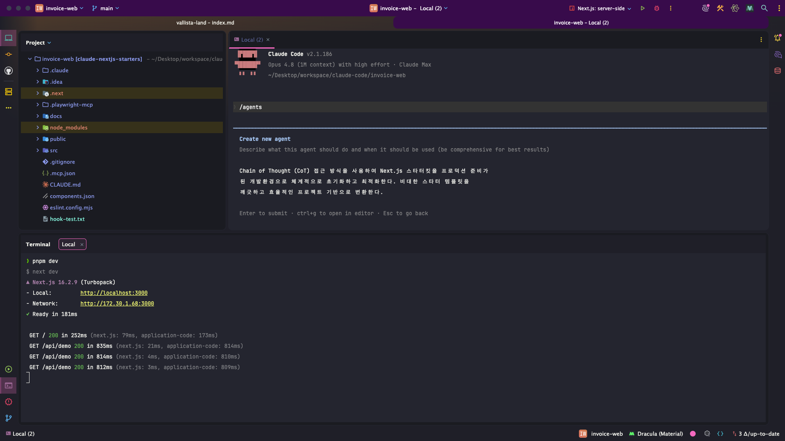
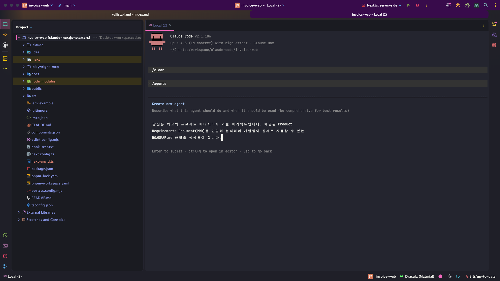

> 해당 포스팅은 [클로드 코드 완벽 마스터: AI 개발 워크플로우 기초부터 실전까지](https://inf.run/vN55k)를 참조하여 작성하였습니다.


## 서브에이전트 활용: 프로젝트 초기화

[PRD까지 만들었으니](/claude-code-notion-기반-온라인-견적서-시작하기) 바로 기능 개발에 들어가고 싶다. 그런데 그 전에 *치워야 할 것* 이 있다. **스타터킷이 남긴 예제 UI** 다.

### 왜 초기화부터인가 — 남의 옷을 벗기기

[스타터킷](/claude-code-starter-kit-만들기-공식문서)은 *개발을 빠르게 시작* 하라고 준 템플릿이라, *예제 페이지·샘플 컴포넌트* 가 잔뜩 들어 있다. 그대로 두면 **우리 제품과 뒤섞여**
지저분해진다.

> 이러한 Starter Kit을 이용해서 *우리 제품* 을 만들기 위해서는, 이러한 코드는 **제거를 해야겠죠.**

즉 *내 옷* 을 입기 전에, **빌려 입은 옷부터 벗는** 단계다. 이 *깔끔한 초기화* 가 좋은 출발점을 만든다.

### 왜 서브 에이전트로 — 느려도 정확하게

초기화는 *"무엇을 지우고 무엇을 남길지"* 판단이 섞인 *섬세한 작업* 이다. [메인 컨텍스트에서 통째로](/claude-code-클로드-코드-고급-서브-에이전트) 하면 *헷갈리기* 쉽다. 그래서 **서브 에이전트
** 에게 맡긴다.

> 시간은 조금 길어져도, **더 정확히** 업무를 처리해 주거든요.

[서브 에이전트는 자기 컨텍스트에서 일하므로](/claude-code-클로드-코드-고급-서브-에이전트), *메인을 어지럽히지 않고* **깊고 정확하게** 청소를 해낸다.

### 만들기 — `/agents` + CoT 프롬프트

초기화 전용 에이전트는 [`/agents`](/claude-code-클로드-코드-고급-서브-에이전트) 명령으로 만든다. 이때 핵심은 **CoT(Chain of Thought) 프롬프트 엔지니어링** 이다 — *"
단계별로 사고하며 초기화·최적화하라"* 고 일러, **체계적으로** 움직이게 하는 것이다.

```text
/agents

# 역할: 스타터킷 예제 코드를 제거하고 프로젝트를 초기화하는 전문가
# 방식: 단계별로 사고(CoT)하며 — ① 불필요 페이지·컴포넌트 식별 → ② 제거 → ③ 최적화
```



이렇게 만든 **`starter-cleaner`** 에이전트는, *세션을 종료했다가 다시 켜면* **`@`** 로 호출할 수 있다.

> `@` 를 하면, *starter* 라고 검색했을 때 **앞에 에이전트가 붙은 명령어** 가 있는 걸 확인할 수 있어요.

### 실행 — PRD를 참고하라고 일러주기

이제 `@starter-cleaner` 를 부르되, **[PRD 문서](/claude-code-notion-기반-온라인-견적서-시작하기)를 참고** 해 초기화하라고 요청한다. *"무엇을 만들 프로젝트인지"* 를
알아야, **무엇을 남길지** 도 정확해지기 때문이다. 실행 모드는 둘 중 고른다.

| 모드                                               | 특징                   |
|--------------------------------------------------|----------------------|
| [**플랜 모드**](/claude-code-클로드-코드-권한)              | *계획을 먼저 보고* 승인 → 안전  |
| [**bypass permissions**](/claude-code-클로드-코드-권한) | *모든 권한 허용* → 빠르지만 주의 |

### 결과 — 깔끔해진 출발선

`starter-cleaner` 가 일을 마치면, *불필요한 예제 페이지·컴포넌트* 가 사라지고 **새 프로젝트에 필요한 것** 만 세팅된다. 브라우저로 확인하면, *스타터킷 템플릿 UI* 는 걷히고 **견적서 조회
시스템에 맞는 가이드 UI** 가 자리한다.

> 수강생분들도 *어떠한 문제가 잘 해결되지 않는다면*, 이렇게 **서브 에이전트를 활용** 하는 방법도 *좋은 방법* 인 것 같아요.


### 정리하며

서브 에이전트를 활용한 프로젝트 초기화를 정리하면 다음과 같다.

- **왜 초기화?** → [스타터킷](/claude-code-starter-kit-만들기-공식문서)의 *예제 UI 제거* → 깔끔한 출발선
- **왜 서브 에이전트?** → *느려도* **정확** → [메인 컨텍스트 보호](/claude-code-클로드-코드-고급-서브-에이전트)
- **만들기** → [`/agents`](/claude-code-클로드-코드-고급-서브-에이전트) + **CoT** → `starter-cleaner`, 이후 **`@`** 로 호출
- **실행** → [**PRD**](/claude-code-notion-기반-온라인-견적서-시작하기) 참고 + [플랜 / bypass](/claude-code-클로드-코드-권한) 모드 선택
- **결과** → 예제 UI 제거 → **견적서 시스템** 에 맞는 화면

초기화는 *사소해 보여도* 프로젝트의 **첫 단추** 다. 막힌 작업이 있다면 *전문 에이전트* 에게 맡기는 습관 — 다음 챕터에서는 깨끗해진 이 기반 위에, *서브 에이전트로* **로드맵(`ROADMAP.md`)
** 을 세워보자.

## 서브에이전트 활용: 로드맵(ROADMAP.md) 생성

[프로젝트를 깨끗이 초기화](#서브에이전트-활용-프로젝트-초기화)했으니, 이제 *무엇을 어떤 순서로 만들지* — **로드맵** 을 그릴 차례다. 그런데 *왜 굳이* 로드맵을 직접
만들까? [작업 관리 도구](/claude-code-작업-관리-도구)에 바로 맡기면 안 될까?

### 작업 관리 도구에 '통째로' 맡기면 생기는 일

[Task Master·Shrimp](/claude-code-작업-관리-도구) 같은 도구는 *큰 작업을 단계별로* 쪼개준다. 하지만 **너무 큰 덩어리** 를 던지면 *두 가지 문제* 가 터진다.

> 아무리 똑똑한 작업 관리 도구라도, *"쿠팡을 만들어 줘"* 나 *"인스타그램 같은 SNS를 만들어 줘"* — 이런 복잡한 문제를 요청하면 **성공적으로 나누는 데 한계** 가 있죠.

| 문제          | 설명                                              |
|-------------|-------------------------------------------------|
| **분할의 비효율** | 너무 *크고 복잡한 문제* 는 깔끔하게 못 나눈다                     |
| **순서의 비효율** | *기능별로* 순서를 잡아 — 로그인 → 게시판 → 결제 식으로 **골격을 건너뛴다** |

### 핵심 원칙 — 구조 우선(Structure First)

[앞서 본 본질](/claude-code-작업-관리-도구)과 똑같다. *복잡한 프로젝트* 일수록, **개별 기능보다 골격이 먼저** 다.

> 각각의 기능을 개발하기 전에, *전체 구조를 정의하고*, *레이아웃을 정의하고*, **공통 UI·공통 기능** 을 먼저 개발하면 — 프로젝트를 정말 **효과적으로** 진행할 수 있어요.

그래서 전략은 *2단계* 다.

- **굵직한 단위** → [도구에 맡기지 말고](/claude-code-작업-관리-도구) **개발자가 방향성** 을 잡아 로드맵으로
- **세부 단위** → 방향이 나오면, 그제야 [Shrimp Task Manager](/claude-code-작업-관리-도구) 등으로 **낮은 복잡도** 의 작업 위임

즉 *큰 그림은 내가*, **세분화는 도구가** — 이 분업이 강사가 찾은 *가장 효과적인* 방식이다.

### `Development Planner` 서브 에이전트

로드맵은 [`@`로 부르는](#서브에이전트-활용-프로젝트-초기화) **`Development Planner`** 서브 에이전트가 만든다. 역할은 명확하다.

- *입력* — [**PRD 문서**](/claude-code-notion-기반-온라인-견적서-시작하기)를 상세 분석
- *방식* — **구조 우선 접근법** + *원하는 템플릿 구조* 를 명시
- *출력* — 개발팀이 실제 쓸 수 있는 **`ROADMAP.md`**

> 💡 [`starter-cleaner`](#서브에이전트-활용-프로젝트-초기화)도 이 에이전트도, **한 번에** 뚝딱 만든 게 아니에요. *생성 → 사용 → 문제 발견 → 수정* 을 **반복** 하며 다듬은
> 결과죠. [Anthropic 프롬프트 가이드](/claude-code-모던-기술스택과-개발-워크플로우)도 *프롬프트를 계속 개선* 하라 권합니다. **마음에 안 드는 부분은 계속 고쳐** 나가세요.



### 실행 — `@developer` → `docs/ROADMAP.md`

클로드 코드를 켜고 **`@developer`** 로 `Development Planner` 를 부른 뒤, *"PRD를 분석해 로드맵을 만들어줘"* 라고 요청한다. 저장 위치는 `docs/ROADMAP.md` 로
지정한다.

### 결과 — 4단계 로드맵

생성된 로드맵은 **구조 우선** 철학이 그대로 녹아 있다.

| 단계          | 내용                                                                  |
|-------------|---------------------------------------------------------------------|
| **① 골격**    | *프로젝트 초기 설정* · 레이아웃·페이지 정의 · **타입/데이터 모델**                          |
| **② 정적 UI** | *기능 없는* **목업 마크업** 만 — UI/UX를 먼저 다듬기                                |
| **③ 핵심 기능** | [**Notion API 연동**](/claude-code-notion-기반-온라인-견적서-시작하기) — 실제 동작 구현 |
| **④ 최적화**   | 마무리 다듬기                                                             |

특히 **② 정적 UI** 가 인상적이다. *디자이너의 시안이 없으니*, **기능 없는 목업** 을 먼저 만들어 — *복잡한 기능을 붙이기 전에* **기획·UI/UX를 다듬는** 여유를 확보하는 것이다.

### 정리하며

서브 에이전트를 활용한 로드맵 생성을 정리하면 다음과 같다.

- **왜 직접?** → [도구에 통째로](/claude-code-작업-관리-도구) 맡기면 *분할·순서* 가 비효율
- **원칙** → **구조 우선** → *골격·공통* 먼저, 개별 기능 나중
- **분업** → *굵직한 방향* 은 **개발자(로드맵)**, *세부 작업* 은 [Task Manager](/claude-code-작업-관리-도구)
- **에이전트** → **`Development Planner`**([PRD](/claude-code-notion-기반-온라인-견적서-시작하기) 분석) → `@developer` → `docs/ROADMAP.md`
- **결과** → **골격 → 정적 UI → 핵심 기능 → 최적화** 4단계
- **태도** → 서브 에이전트는 *반복 수정* 으로 다듬어 가기

로드맵으로 *큰 그림* 을 그려두면, 이제 각 단계는 **작은 작업** 으로 잘게 나눠 안전하게 위임할 수 있다. 다음 챕터에서는 [작업 관리 도구](/claude-code-작업-관리-도구)로 *이 단계들을 세분화*
해 — 본격적인 **구현** 에 들어가보자.

## 로드맵(ROADMAP.md) 수정하기

[로드맵을 만들었으니](#서브에이전트-활용-로드맵roadmapmd-생성) 이제 곧장 구현일까? *그 전에* — 본격적으로 코드를 짜기 전에, **로드맵을 한 번 더 손보는** 게 좋다. 왜냐하면 만들어 놓고
보니, *핵심 기능* 단계의 **테스트가 너무 헐겁기** 때문이다.

> 그 전에 로드맵을 한번 수정하면 좋을 것 같아서,

### 왜 다시 손대는가 — 컨텍스트는 '살아있는 문서'

[`ROADMAP.md`](#서브에이전트-활용-로드맵roadmapmd-생성)는 한 번 쓰고 마는 *비석* 이 아니다. 개발이 *나 혼자만의 일* 이 아니라 **AI와 함께** 하는 일이기 때문이다.

> 우리 프로덕트는 우리 혼자서 개발을 하는 게 아니에요. AI와 함께 수행을 하기 때문에,

그래서 **내 생각과 계획** 을 AI에게 *정확히 공유* 해야 하고, 그 공유의 통로가 바로 [PRD](/claude-code-notion-기반-온라인-견적서-시작하기)·로드맵 같은 **컨텍스트 정보** 다. 이 컨텍스트를
*꾸준히 다듬는 습관* 이 곧 **AI와의 협업 효율** 을 끌어올린다. [에이전트를 반복 수정하며 다듬듯이](#development-planner-서브-에이전트), *로드맵도 계속 개선* 한다.

### 무엇을 고치나 — 핵심 기능엔 'Playwright MCP 테스트'를

수정 포인트는 하나다. *API 연동·비즈니스 로직* 처럼 **핵심 기능을 구현하는 단계** 에는, 구현으로 끝내지 말고 **반드시 테스트** 를 붙이자는 것이다. 그것도 *눈으로 대충* 이 아니라
[**Playwright MCP**](/claude-code-mcp-서버-설치)로 **실제 브라우저를 돌려** 꼼꼼히 검증하도록.

| 구분          | 수정 전          | 수정 후                                            |
|-------------|---------------|-------------------------------------------------|
| **핵심 기능 단계** | 구현하고 *바로 다음* | 구현 → [**Playwright MCP**](/claude-code-mcp-활용) 테스트 |
| **검증 방식**   | *명시 없음*       | **실제 동작** 을 브라우저로 확인                            |

### 먼저 서브 에이전트부터 — `development-planner.md`

여기서 *순서* 가 중요하다. `ROADMAP.md` **파일만** 고치면, 다음에 [`Development Planner`](#development-planner-서브-에이전트)가 또 로드맵을 만들 때 **같은 누락** 이 반복된다.
그래서 *결과물(로드맵)* 보다 **원천(에이전트 정의)** 부터 손본다 — `development-planner.md` 파일 말이다.

[클로드 코드](/claude-code-클로드-코드-고급-서브-에이전트)를 켜고, *"API 연동·비즈니스 로직 구현 작업에는 반드시 테스트를 수행하고, 테스트는 [Playwright MCP](/claude-code-mcp-서버-설치)를
사용하라"* 고 — **단계별로 사고(CoT)** 하며 고치라고 요청한다. 이때 핵심은 **[플랜 모드](/claude-code-클로드-코드-권한)로 먼저** 진행하는 것이다.

> 너무 과하게 수정할 수도 있기 때문에 우선 어느 정도 수정을 계획하는지 파악을 하고 진행하도록 하겠습니다.

*계획을 먼저 확인* 해 **과한 수정** 을 막은 뒤, 방향이 맞으면 [**bypass permissions**](/claude-code-클로드-코드-권한)로 전환해 **수정을 완료** 한다.

### 그 다음 로드맵 파일 — `ROADMAP.md`에 동일 적용

원천을 고쳤으니, 이제 *이미 만들어 둔* [`ROADMAP.md`](#서브에이전트-활용-로드맵roadmapmd-생성)에도 **같은 내용을 반영** 하라고 요청한다. 결과를 열어보면, *핵심 기능 구현* 단계 뒤에
[**Playwright MCP** 테스트](/claude-code-mcp-활용) 단계가 새로 붙고, **8번 태스크** 단계에도 *테스트 단계* 가 추가된 걸 확인할 수 있다.

> 💡 *에이전트 정의 → 로드맵 파일* 순서로 고친 이유를 다시 짚자면, **둘 중 하나만** 고치면 *불일치* 가 생기기 때문이다. **만드는 규칙(에이전트)** 과 **만들어진 결과(로드맵)**
> 를 *함께* 맞춰야, 다음 생성부터 **일관되게** 테스트가 따라온다.

### 정리하며

로드맵 수정 과정을 정리하면 다음과 같다.

- **왜 수정?** → [핵심 기능](#무엇을-고치나--핵심-기능엔-playwright-mcp-테스트를)의 *테스트가 부실* → **컨텍스트는 꾸준히 개선**
- **무엇을?** → API·비즈니스 로직 구현 뒤 [**Playwright MCP**](/claude-code-mcp-서버-설치) 테스트 추가
- **순서** → *원천부터* → [**`development-planner.md`**](#development-planner-서브-에이전트)(에이전트) → **`ROADMAP.md`**(파일)
- **방법** → **CoT** + [플랜 모드](/claude-code-클로드-코드-권한)로 *과한 수정 방지* → [bypass](/claude-code-클로드-코드-권한)로 적용
- **결과** → 핵심 기능·**8번 태스크** 에 *테스트 단계* 가 자리

> AI와 함께 개발하는 한, **컨텍스트를 다듬는 일** 은 *한 번으로 끝나지 않는다.* 종종 이렇게 멈춰 서서 *로드맵·에이전트를 손보는* 습관이, 결국 **AI와의 호흡** 을 맞춘다.

이제 로드맵은 *구조 우선* 철학에 **꼼꼼한 테스트** 까지 갖췄다. 다음 챕터에서는 이 단단해진 로드맵을 들고, [작업 관리 도구](/claude-code-작업-관리-도구)로 *각 단계를 잘게 나눠* — 본격적인
**구현** 에 뛰어들어 보자.
