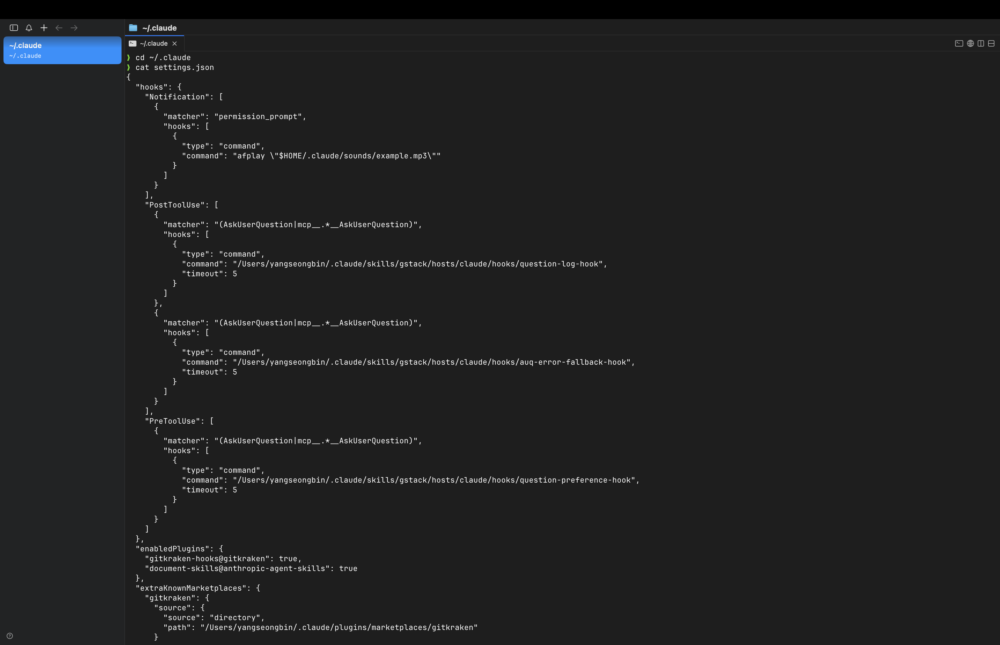
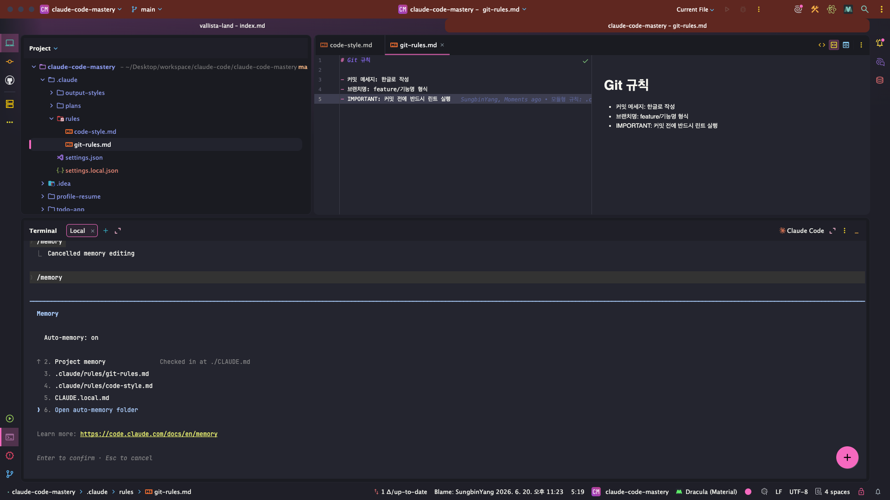

> 해당 포스팅은 [클로드 코드 완벽 마스터: AI 개발 워크플로우 기초부터 실전까지](https://inf.run/vN55k)를 참조하여 작성하였습니다.


## ⚙️ 설정 파일 (settings.json)

지난 섹션들에서 `settings.json` 을 *여러 번* 스쳐왔다. [권한 규칙](/claude-code-클로드-코드-권한)도, [모델 고정](/claude-code-슬래시-명령어와-단축키)도,
[`MAX_THINKING_TOKENS`](/claude-code-클로드-코드-권한)도 모두 이 파일에 적었다. 이번 챕터는 그 **`settings.json` 의 전체 그림** 을 정리한다.

> Claude Code에서 설정 파일이라는 건, **Claude Code의 설정을 결정하는 프로필** 이에요.

즉, *어떤 파일에 접근할지, 어떤 명령을 실행할지, 어떤 모델을 쓸지* 를 정하는 **프로필** 이다. *프로젝트 상황에 맞게* 세팅해두면 개발이 한결 매끄러워진다.



### 설정의 세 가지 레벨

클로드 코드 설정은 **세 레벨** 로 나뉜다. *어디에 두느냐* 에 따라 *적용 범위* 가 달라진다.

| 레벨               | 위치                               | 적용 범위                       |
|--------------------|------------------------------------|---------------------------------|
| **사용자 설정**    | `~/.claude/settings.json`          | *내 모든 프로젝트* 에 일괄 적용 |
| **프로젝트 설정**  | 프로젝트의 `.claude/settings.json` | *그 프로젝트* 에만 적용         |
| **관리 정책 설정** | OS별 시스템 경로 (*엔터프라이즈*)  | *조직 전체* 에 강제 적용        |

**사용자 설정** 은 *홈 디렉터리* 에 있어 A·B·C 프로젝트 *모두* 에 적용된다. (앞서 본 *모델·상태 표시줄* 설정이 보통 여기 담긴다.) **프로젝트 설정** 은 *그 폴더 안* 에만 적용되고,
**관리 정책 설정** 은 *큰 기업* 에서 전사 정책을 *강제* 할 때 쓴다.

### 프로젝트 설정 — 공유용 vs 개인용

프로젝트 설정은 *용도* 에 따라 **두 파일** 로 갈린다. [권한 챕터](/claude-code-클로드-코드-권한)에서 살짝 짚었던 그 구분이다.

| 파일                      | 용도                | Git     |
|---------------------------|---------------------|---------|
| **`settings.json`**       | *팀과 공유* 할 설정 | 포함 ✅ |
| **`settings.local.json`** | *나만의 개인* 설정  | 제외 ❌ |

> `settings.local.json` 파일은 *Git으로 포함하지 않고*, **개인 선호도에 따라** 설정을 적용하는 파일이에요.

즉, *팀원과 함께 쓸* 규칙 (예: 공통 권한·모델 정책)은 **`settings.json`** 에 넣어 *Git에 커밋* 하고, *나만의* 취향 (개인 권한 등)은 **`settings.local.json`**
에 둔다.

> 이러면 *개인 파일이 아니라*, 팀원들이 다운받으면 **팀원들도 이 설정이 적용** 됩니다.

### ⚠️ `settings.local.json`은 반드시 `.gitignore`

여기서 **꼭** 챙길 게 있다. `settings.local.json` 은 *개인용* 이니, **Git이 추적하지 않도록** 해야 한다. [앞 섹션의 Git 지식](/claude-code-git과-github)을
써먹을 차례다. 프로젝트의 **`.gitignore`** 파일에 한 줄 추가하면 된다.

```gitignore
# .gitignore
.claude/settings.local.json
```

이렇게 해두면 *개인 설정* 이 *실수로 커밋되어* 팀원에게 *덮어씌워지는* 일을 막을 수 있다. (보통 `/init` 시 자동으로 추가되기도 하지만, *직접 확인* 하는 게 안전하다.)

### 설정 우선순위 — 누가 이기나

같은 옵션이 *여러 곳* 에 있으면 *누구를 따를까?* **우선순위** 가 정해져 있다.

> **관리 정책 설정 > 개인 설정 (`local`) > 프로젝트 설정 > 사용자 설정** 순으로 적용됩니다.

```text
관리 정책(엔터프라이즈)  ←  가장 강함
        ▲
개인 설정 (settings.local.json)
        ▲
프로젝트 설정 (settings.json)
        ▲
사용자 설정 (~/.claude/settings.json)  ←  가장 약함
```

즉, *조직 정책* 이 **최우선** 이고, 개인 < 프로젝트 < 사용자 순으로 *더 구체적인 설정이 이긴다.* 헷갈릴 땐 *"좁은 범위가 넓은 범위를 덮어쓴다"* 로 기억하자. (단, 관리 정책만은 *예외적으로*
모든 걸 누른다.)

### 알아두면 좋은 옵션 셋

권한·환경변수 말고도 *유용한 옵션* 이 많다. 자주 쓰는 셋만 짚자.

#### 1. 기본 권한 모드 고정

[`plan` 모드](/claude-code-클로드-코드-권한)를 *자주 쓴다면*, 매번 `Shift+Tab` 으로 바꾸는 대신 **기본값으로 고정** 할 수 있다.

```json
{
  "permissions": {
    "defaultMode": "plan"
  }
}
```

#### 2. 추가 디렉터리 참고 — `additionalDirectories`

[Workspace 디렉터리 추가](/claude-code-클로드-코드-권한)에서 봤듯, *작업 폴더 밖* 의 프로젝트를 참고하고 싶을 때 쓴다. *GitHub에서 클론한 오픈소스* 를 참고용으로 붙이기 좋다.

```json
{
  "permissions": {
    "additionalDirectories": [
      "../reference-project"
    ]
  }
}
```

#### 3. 민감 정보 차단 — `deny`

**가장 중요한** 보안 옵션이다. *API 키·환경 파일* 처럼 *민감한 정보* 를 클로드 코드가 *읽지 못하게* 막는다.

```json
{
  "permissions": {
    "deny": [
      "Read(./.env)",
      "Read(./secrets/**)"
    ]
  }
}
```

`.env` 같은 *비밀이 든 파일* 을 `deny` 에 넣어두면, *실수로라도* 클로드 코드가 그 내용을 *읽거나 노출* 하는 일을 막을 수 있다. **보안의 기본** 으로 챙겨두자.

### 정리하며

설정 파일을 정리하면 다음과 같다.

- `settings.json` = 클로드 코드의 **프로필** (접근 파일·명령·모델 등 결정)
- 세 레벨 → **사용자**(`~/.claude`) · **프로젝트**(`.claude`) · **관리 정책**(엔터프라이즈)
- 프로젝트 설정 → **`settings.json`**(팀 공유, Git 포함) vs **`settings.local.json`**(개인, Git 제외)
- ⚠️ `settings.local.json` 은 **`.gitignore`** 에 추가
- 우선순위 → **관리 정책 > 개인 > 프로젝트 > 사용자**
- 유용 옵션 → `defaultMode`(권한 모드 고정) · `additionalDirectories`(외부 참고) · **`deny`(민감정보 차단)**

설정 파일을 *제대로* 다루면, 클로드 코드를 *프로젝트마다·팀마다* 최적화할 수 있다. 다음 챕터에서는 클로드 코드의 *또 다른 핵심 파일*, 프로젝트의 **기억** 을 담는 **`CLAUDE.md`(메모리
관리)** 로 넘어가 보자.

## 🃏 설정파일: Bash 와일드 카드, JSON 스키마 설정

앞 챕터에서 `settings.json` 의 *큰 그림* 을 그렸다면, 이번엔 **실무에서 자주 걸려 넘어지는 디테일 두 가지** 를 짚는다. 하나는 *Bash 권한* 에 쓰는 **와일드카드 문법** 이 *바뀐*
부분이고, 다른 하나는 설정 파일을 *훨씬 편하게* 만들어주는 **JSON 스키마** 다. 둘 다 *작지만*, 모르면 *한참 헤매는* 포인트들이다.

### Bash 와일드카드 — `:` 에서 공백으로

[권한 챕터](/claude-code-클로드-코드-권한)에서 봤듯, 클로드 코드는 *우리 대신 터미널 명령* 을 실행한다. 그 **Bash 명령** 을 *어디까지 허용할지* 도 `settings.json` 에서
관리한다.

> Bash라는 건 터미널에서 컴퓨터에게 명령을 내리는 언어예요. 우리가 일상에서 말할 때 *"TV 켜줘", "불 꺼줘"* 이렇게 말하잖아요. 컴퓨터한테는 터미널에서 명령을 할 때 이 Bash로 말하는 거예요.

여기서 자주 쓰는 게 **와일드카드** 다. 별표 (`*`) 기호로, *"모든 것"* 을 뜻한다. 예를 들어 `npm run` 으로 *시작하는 명령은 전부 허용* 하고 싶을 때 쓴다.

> `npm` 하고 와일드카드 하면, `npm` 뒤에 나오는 명령어 *모든 것* 을 다 `allow` 에 놓으면 허용하겠다, 이러한 뜻이에요.

**바로 이 와일드카드 문법이 바뀌었다.** 예전에는 명령어와 와일드카드 사이에 **콜론 (`:`)** 을 넣었는데, *이제는 콜론이 아니라 **공백*** 이다.

| 구분        | 문법              |
|-------------|-------------------|
| **예전 ❌** | `Bash(npm run:*)` |
| **지금 ✅** | `Bash(npm run *)` |

`settings.json` 에 적용하면 이런 모습이다.

```json
{
  "permissions": {
    "allow": [
      "Bash(npm run *)"
    ]
  }
}
```

`npm run` *뒤에 어떤 명령이 붙든* (`npm run dev`, `npm run build`, `npm run test` …) **전부 허용** 한다는 의미다. 혹시 예전 강의나 블로그를 보고
`npm run:*` 처럼 *콜론* 을 넣어 두었다면, **공백** 으로 고쳐주자.

### JSON 스키마 — 설정 파일에 자동완성을 달자

`settings.json` 을 손으로 적다 보면 *키 이름이 헷갈리거나*(`additionalDirectories` 였나 `additional_directories` 였나…) *오타* 가 나기 쉽다. 이걸 **코드
편집기가 잡아주게**
만드는 게 **JSON 스키마** 다.

> JSON 스키마라는 건, 쉽게 말해서 우리가 사용하는 코드 편집기에게 *"이러한 파일은 Claude Code 설정 파일이야. 키는 어떤 종류를 사용할 수 있고, 값은 어떤 값을 사용할 수 있는지"* 미리 알려주는
> 일종의 **스펙 문서** 죠.

즉, 편집기에게 *"이 파일의 정답지가 여기 있어"* 라고 알려주는 셈이다. 그러면 [WebStorm](/claude-code-cursor-ai-ide-통합) 같은 편집기가 그 스펙을 읽어, **자동완성** 과 *
*오타 감지**
를 해준다. *없는 키* 를 적으면 *빨간 줄* 로 알려주는 식이다.

적용은 **놀랍도록 간단** 하다. 설정 파일 *맨 위* 에 `$schema` **한 줄** 만 추가하면 된다.

```json
{
  "$schema": "https://json.schemastore.org/claude-code-settings.json",
  "permissions": {
    "allow": [
      "Bash(npm run *)"
    ]
  }
}
```

> 설정 파일의 `configuration` 메뉴에서 `$schema` 한 줄을 복사해서 붙여넣기만 하면 돼요.

이 한 줄을 넣는 순간, 편집기는 *그 아래 키·값* 을 스펙과 *대조* 한다. **새 옵션을 적었는데 빨간 줄 (오류 표시)이 뜬다면** → `$schema` 를 추가해보자. *편집기가 스펙을 몰라서* 생긴
오류라면, 그 표시가 *사라질* 것이다.

### 정리하며

이번 챕터의 *작지만 중요한* 두 가지는 다음과 같다.

- **Bash 와일드카드** → 콜론 (`:`)이 아니라 **공백**. `Bash(npm run *)` 처럼 쓴다.
- **JSON 스키마** → 설정 파일 맨 위에 **`$schema` 한 줄** 추가 → 편집기의 **자동완성·오타 감지** 활성화
- 새 옵션에서 *오류 표시* 가 뜨면 → `$schema` 부터 의심해보자

> 공식 문서가 맨 처음 봤을 땐 어렵게 느껴질 수 있어요. 이 어렵게 느껴지는 건 *자주 접하지 않아서* 예요.

클로드 코드는 *빠르게 업데이트* 되는 도구라, 이런 *작은 문법* 도 종종 바뀐다. **변경된 스펙을 가끔씩 확인하는 습관** 을 들여두면, 바이브 코딩으로 개발할 때 큰 도움이 된다. 다음 챕터에서는 클로드
코드가 *프로젝트를 기억* 하게 만드는 **`CLAUDE.md` 메모리 관리** 로 넘어가 보자.

## 🧠 메모리 관리: CLAUDE.md

설정 파일이 클로드 코드의 *프로필* 이었다면, 이번 챕터의 주인공은 클로드 코드의 **기억** 이다. 클로드 코드를 쓰다 보면 한 가지 *답답한 한계* 에 부딪힌다. **대화가 끝나면, 방금 한 약속을
잊어버린다.**

> 클로드 코드는 대화가 종료되면 이전 내용을 *기억하지 못해요.* 세션이 종료될 때마다 **백지 상태** 가 되는 거죠.

[`/clear` 로 컨텍스트를 비우거나](/claude-code-슬래시-명령어와-단축키) 새 세션을 켜면, *"우리 프로젝트는 React 써", "들여쓰기는 2칸이야"* 같은 약속이 **싹 사라진다.** 매번 다시
설명하자니 *손가락이 아프다.* 이 문제를 푸는 게 바로 **`CLAUDE.md`** 다.

### CLAUDE.md — 프로젝트의 규칙을 적어두는 파일

> 쉽게 말해서, 이 프로젝트에서 *매번 지켜야 할 규칙* 을 적어놓은 파일이라고 보시면 돼요.

`CLAUDE.md` 는 클로드 코드가 **세션을 시작할 때마다 자동으로 읽어들이는** 파일이다. 여기에 *"우리 프로젝트의 규칙"* 을 적어두면, 매번 설명하지 않아도 클로드 코드가 *알아서 지킨다.*
[`/init` 챕터](/claude-code-클로드-코드-맛보기-및-초기화)에서 이미 한 번 만났던 그 파일이다 — `/init` 이 프로젝트 구조를 훑어 **`CLAUDE.md` 초안** 을 만들어줬다.

핵심은 *한 번 만들고 끝* 이 아니라, **개발하면서 계속 업데이트** 해나가는 것이다. 그럼 이 메모리 파일을 *어디에 두느냐* 에 따라 역할이 어떻게 갈리는지 보자.

### 메모리 파일의 네 가지 종류

메모리 파일은 **놓는 위치** 에 따라 적용 범위가 달라진다. [설정 파일의 레벨 구분](#설정-파일-settingsjson)과 *판박이* 라 이해하기 쉽다.

> 이러한 여러 개가 있다고 해서 *어려워하실 필요는 없어요.* 실제로 사용하는 건 **몇 개 안 돼요.**

| 종류                   | 위치                        | 역할                            | Git     |
|------------------------|-----------------------------|---------------------------------|---------|
| **엔터프라이즈 정책**  | OS별 시스템 경로            | *회사 전체* 강제 규칙           | —       |
| **프로젝트 메모리** ⭐ | 프로젝트 루트의 `CLAUDE.md` | *그 프로젝트* 의 규칙 (팀 공유) | 포함 ✅ |
| **로컬 메모리**        | `CLAUDE.local.md`           | *나만의* 개인 규칙              | 제외 ❌ |
| **사용자 메모리**      | `~/.claude/CLAUDE.md`       | *내 모든 프로젝트* 공통 규칙    | —       |

각각 *언제 쓰는지* 짚어보자.

- **엔터프라이즈 정책** — *회사 IT 관리자* 가 *"모든 개발자는 이 규칙을 따라라"* 하고 배포하는 파일이다. (예: *보안 코드 리뷰 필수*, *사내 API 키 하드코딩 금지*) 개인 사용자라면 *거의
  건드릴 일 없다.*
- **프로젝트 메모리** ⭐ — **가장 많이 쓰는** 파일이다. 프로젝트 루트 (또는 `.claude/` 하위)에 `CLAUDE.md` 로 둔다. *"이 프로젝트는 React를 쓰고, 디자인은 깔끔하고 미니멀하게
  통일한다"* 같은 *그 프로젝트만의* 규칙을 적는다. **Git에 커밋** 하면 *팀원 전체* 가 같은 규칙으로 작업하게 된다.
- **로컬 메모리** — *Git으로 공유하지 않는* **나만의** 규칙이다. 팀 프로젝트에서 *공유용 (`CLAUDE.md`)* 과 *개인용* 을 나누고 싶을 때 쓴다.
- **사용자 메모리** — `~/.claude/CLAUDE.md` 에 두면 *이 PC의 모든 프로젝트* 에 공통 적용된다. *공통 스타일 가이드*, *Git 관리 습관*, *내 PC 환경 정보* 등을 적기 좋다.

> 혼자 개발한다면 그냥 **프로젝트 메모리 (`CLAUDE.md`)** 에 적어 Git으로 관리하는 게 일반적이에요. 팀 협업에서야 *공유 파일* 과 *개인 파일* 을 구분하는 거죠.

### ⚠️ `CLAUDE.local.md`도 `.gitignore` 확인

[`settings.local.json` 과 똑같이](#️-settingslocaljson은-반드시-gitignore), 로컬 메모리인 **`CLAUDE.local.md`** 도 *Git에 올라가면 안 된다.*
보통은
`.gitignore` 에 *자동 추가* 되지만,

> `.gitignore`에 *자동으로 추가되지 않는 경우* 가 있어, **수동으로 추가** 해야 할 수 있어요.

직접 한 번 확인해두자.

```gitignore
# .gitignore
CLAUDE.local.md
```

### `import` 문법 — 파일이 길어질 때

`CLAUDE.md` 에 규칙을 *계속 쌓다 보면* 파일이 *너무 길어진다.* 공식 문서는 **500줄 이하** 유지를 권장한다. 너무 길면 클로드가 *오히려 참조하기 어렵기* 때문이다.

이때 쓰는 게 **`import` 문법** 이다. `@` 뒤에 *파일 경로* 를 적으면, 그 파일을 **메모리로 끌어와** 읽는다. *중복을 줄이고* `CLAUDE.md` 를 *날씬하게* 유지하는 비결이다.

```markdown
# CLAUDE.md

## 프로젝트 개요

프로젝트 전반은 @README.md 를 참고할 것.

## 자주 쓰는 명령어

사용 가능한 npm 스크립트는 @package.json 을 참고할 것.
```

이렇게 하면 *프로젝트 개요* 는 이미 잘 정리된 `README.md` 를, *명령어 목록* 은 `package.json` 을 *재활용* 한다. **같은 내용을 두 번 적지 않아도** 되는 셈이다.

### 잘 쓰는 법 — 구체적으로, 구조적으로

메모리 파일도 *잘 적어야* 클로드가 잘 따른다. **모범 사례 세 가지** 만 기억하자.

**① 구체적으로 적어라.** *"코드를 적절히 포맷한다"* 같은 *모호한* 문장은 피하자.

> 왜냐하면 *모호하게 작성하면* 클로드는 이를 **자기 멋대로 판단** 을 해요.

*"두 칸 들여쓰기 사용"* 처럼 **명확하게** 적어야, 클로드가 *제멋대로 해석* 하지 않는다.

| 나쁜 예 ❌               | 좋은 예 ✅                                      |
|--------------------------|-------------------------------------------------|
| "코드를 적절히 포맷한다" | "들여쓰기는 **2칸 공백** 사용"                  |
| "테스트를 잘 작성한다"   | "테스트는 **Jest** 로 작성, 파일명 `*.test.ts`" |

**② 구조를 잡아라.** 한 문단에 *주르륵* 적기보다, **리스트로 그룹핑** 하면 클로드가 훨씬 잘 이해한다.

**③ 정기적으로 업데이트하라.** *가장 중요한* 습관이다. *프로젝트가 진화하면* 메모리 파일도 *같이* 자라야 한다.

> 키보드를 타이핑하면서 *손가락이 아픈 순간* 이요. *(같은 설명을 또 하고 있을 때)* 그럴 때 하나둘씩 **메모리 파일로 관리** 해 나가면 돼요.

그리고 한 가지 *현실적인 주의점.* 메모리 파일이라고 해서 클로드가 **100% 지키는 건 아니다.** LLM의 특성상 *놓칠 때* 가 있다. *꼭 지켜야 할* 규칙이라면 **`IMPORTANT`** 나 **
`YOU MUST`** 같은 *강조 문구* 를 붙이면 준수율이 올라간다.

```markdown
- **IMPORTANT**: 모든 API 호출은 반드시 `try/catch` 로 감쌀 것.
- **YOU MUST**: 커밋 메시지는 한국어로 작성할 것.
```

### `/memory` — 로드된 메모리 확인하고 편집하기

지금 *어떤 메모리가 적용 중인지* 궁금하다면, **`/memory`** 명령을 쓰자.

```bash
/memory
```

입력하면 *현재 세션에 로드된* 메모리 목록 (사용자 메모리·프로젝트 메모리 등)이 *쭉* 뜬다. 거기서 *특정 메모리를 선택* 하고 엔터를 누르면, **바로 편집** 까지 할 수 있다. *어디에 무슨 규칙이 걸려
있는지* 헷갈릴 때 유용하다.

### 정리하며

메모리 관리를 정리하면 다음과 같다.

- **`CLAUDE.md`** = 클로드 코드가 *세션마다 자동으로 읽는* **프로젝트 규칙 파일**
- 네 종류 → **엔터프라이즈** · **프로젝트**(⭐ 가장 많이 씀, Git 공유) · **로컬**(`CLAUDE.local.md`, 개인) · **사용자**(`~/.claude/CLAUDE.md`, 전역)
- ⚠️ `CLAUDE.local.md` 는 **`.gitignore`** 확인
- **`import`(`@경로`)** 로 `README.md`·`package.json` 등을 끌어와 *파일을 날씬하게* (권장 500줄 이하)
- 잘 쓰는 법 → **구체적으로 · 구조적으로 · 꾸준히 업데이트**, 중요한 건 `IMPORTANT`/`YOU MUST`
- **`/memory`** 로 로드된 메모리 확인·편집

> 이건 *당연한 겁니다.* 경험이 없기 때문에 *공감이 안 되는 건* 매우 당연한 현상이에요.

메모리 관리는 *처음엔 와닿지 않다가*, 같은 설명을 *세 번째 반복* 할 때쯤 그 가치를 체감하게 된다. *손가락이 아플 때마다* 한 줄씩 `CLAUDE.md` 에 옮겨 적자. 그게 쌓이면 클로드 코드는 *우리
프로젝트를 가장 잘 아는 동료* 가 된다.

## 🧩 모듈형 규칙: `.claude/rules/`

[앞 챕터](#-메모리-관리-claudemd)에서 `CLAUDE.md` *하나로* 프로젝트 규칙을 관리하는 법을 배웠다. *대부분의 프로젝트* 는 이걸로 충분하다. 그런데…

> 대부분의 프로젝트에서는 이러한 규칙만으로도 충분합니다. 그런데 프로젝트가 *커지면*, 규칙이 *많아지면* **두 가지 불편함** 이 생기는데요.

**① 파일이 너무 길어진다.** 코드 스타일, Git 규칙, API 규칙… *전부 한 파일* 에 욱여넣으면 *500줄* 은 금방이고, 클로드도 *참조하기 버거워진다.*
**② 조건부 적용이 안 된다.** [`@import`](#import-문법--파일이-길어질-때) 로 끌어온 파일은 *무조건 로드* 된다.

> 우리가 원하는 건 *특정 디렉터리에만 적용* 하고 싶다는, 이러한 **조건부 규칙** 인데 말이죠.

이 두 불편을 *한 번에* 푸는 게 최근 추가된 **모듈형 규칙 (`.claude/rules/`)** 이다.

### 기본 구조 — 주제별로 파일을 쪼갠다

방법은 간단하다. 프로젝트의 **`.claude/rules/`** 디렉터리 아래에 *주제별로* `.md` 파일을 만들면 된다. 이 폴더 안의 **모든 마크다운 파일** 은 클로드 코드 실행 시 *자동으로*
메모리에 로드되고, **`CLAUDE.md` 와 동일한 우선순위** 를 갖는다.

```text
.claude/
└── rules/
    ├── code-style.md     ← 코드 스타일 규칙
    └── git-rules.md      ← Git 커밋 규칙
```

`CLAUDE.md` 의 내용을 *주제별로 쪼개* 이렇게 나눠두면, 길고 복잡하던 규칙이 **깔끔하게 정리** 된다. 예를 들어 `code-style.md` 는 이렇게 적는다.

```markdown
# 코드 스타일 규칙

- 들여쓰기는 **2칸 공백** 사용
- 컴포넌트는 **함수형** 으로 작성
- 변수명은 **camelCase**, 컴포넌트명은 **PascalCase**
```

> 알파벳이 틀리면 안 됩니다. **`.claude/rules`** 정확하게 입력하셔야 돼요.

폴더 이름이 *조금만 틀려도* 로드되지 않으니, [`/memory`](#memory--로드된-메모리-확인하고-편집하기) 명령으로 *제대로 로드됐는지* 확인하는 습관을 들이자.

### ⭐ 진짜 강력한 기능 — `paths` 조건부 규칙

> 그러면 지금부터 이 모듈형 메모리의 **강력한 기능** 을 소개해드릴게요. 여기서부터 *진짜 강력한 기능* 인데요.

모듈형 규칙 파일은 *맨 위* 에 **프론트매터 (frontmatter)** 를 달 수 있다. 여기에 **`paths`** 필드를 적으면, 그 규칙을 *특정 파일·디렉터리에만* 적용할 수 있다. 바로
`CLAUDE.md` 로는 못 하던 **조건부 규칙** 이다.

```markdown
---
paths:
  - "src/api/**/*.ts"
---

# API 코드 규칙

- 모든 API 호출은 **`try/catch`** 로 감쌀 것
- 응답 타입은 반드시 **인터페이스로 정의** 할 것
```

이렇게 해두면 이 규칙은 *오직* `src/api/` 하위의 `.ts` 파일을 다룰 때만 적용된다. *프론트엔드 컴포넌트* 를 만질 땐 *끼어들지 않는* 것이다.

여기서 `src/api/**/*.ts` 같은 표현이 **Glob 패턴** 이다. *파일 경로를 패턴으로 한꺼번에 지정* 하는 문법으로, `*`(임의의 이름)와 확장자를 조합해 *원하는 파일들만* 콕
집는다. [권한 챕터의 `Read(./secrets/**)`](/claude-code-클로드-코드-권한) 에서 이미 만나본 그 문법이다.

### 규칙이 더 많아지면 — 폴더로 계층화

규칙 파일이 *더* 늘어나면, `rules/` 아래에 **하위 폴더** 를 만들어 계층적으로 정리할 수 있다.

```text
.claude/
└── rules/
    ├── frontend/
    │   ├── component.md
    │   └── style.md
    └── backend/
        ├── api.md
        └── database.md
```

또한 *프로젝트 레벨* 뿐 아니라 [사용자 홈 디렉터리](#메모리-파일의-네-가지-종류)(`~/.claude/rules/`)에도 규칙을 두면, *내 모든 프로젝트* 에 공통으로 적용되는 **사용자 레벨 모듈 규칙**
이 된다.

### 모범 사례

모듈형 규칙을 *잘 쓰는* 요령은 다음과 같다.

- **한 파일엔 한 주제만** — `code-style.md` 엔 스타일만, `git-rules.md` 엔 Git 규칙만.
- **파일 이름만 봐도 알게** — *이름만으로* 내용을 짐작할 수 있게 명확히 짓는다.
- **`paths` 는 꼭 필요할 때만** — *대부분의 규칙* 은 전역 적용이면 충분하다. *조건부가 필요한 경우에만* 쓴다.
- **관련 규칙은 그룹화** — 흩뿌리지 말고 *주제별로* 묶는다.

### 정리하며 — 메모리 관리 전체 전략

[`CLAUDE.md`](#-메모리-관리-claudemd)부터 [`@import`](#import-문법--파일이-길어질-때), 그리고 모듈형 규칙까지 — 메모리 관리의 *전체 전략* 을 한 줄로 정리하면 이렇다.

| 상황                               | 방법                                   |
|------------------------------------|----------------------------------------|
| **기본** — 대부분의 프로젝트       | **`CLAUDE.md`** 한 파일로 시작         |
| 기존 문서(README 등)를 재활용      | **`@import`** (`@README.md`)           |
| 규칙이 많아져 파일이 길어짐        | **모듈형 규칙** (`.claude/rules/*.md`) |
| *특정 디렉터리* 에만 적용하고 싶음 | 모듈 규칙 + **`paths` 프론트매터**     |

즉, **작게 시작해서**(`CLAUDE.md`) → *문서가 있으면 끌어오고*(`@import`) → *규칙이 불어나면 쪼개고*(`rules/`) → *조건이 필요하면 `paths` 로 좁힌다.* 이 흐름만
기억하면, 프로젝트가 *아무리 커져도* 메모리를 *깔끔하게* 관리할 수 있다.

여기까지가 *우리가 직접 적어주는* 메모리였다. 그런데 클로드 코드에는 *클로드가 **스스로** 적는* 메모리도 있다. 마지막으로 그 **Auto Memory** 를 들여다보자.

## 🤖 Auto Memory

지금까지 본 [`CLAUDE.md`](#-메모리-관리-claudemd)·[`rules/`](#-모듈형-규칙-clauderules)는 *우리가 손으로* 적는 메모리였다. 그런데 **Auto Memory** 는 결이
다르다.

> Auto Memory는 AI가 세션 중에 *학습한 내용* 을 **스스로 기록하고 메모하는** 기능이에요.

즉, 우리가 적어주는 게 아니라 **클로드가 자기 자신을 위해 쓰는 노트** 다. *우리를 위한* `CLAUDE.md` 와 달리, *클로드를 위한* 메모인 셈이다.



### 무엇을, 어디에 저장하나

클로드는 대화하면서 *알게 된 것들* 을 **`MEMORY.md`** 파일에 적어둔다. 저장되는 건 대략 이런 내용이다.

- 이 프로젝트의 **패턴** 과 **아키텍처**
- *자주 발생하는 문제* 와 그 **해결법**
- **사용자 (나)의 선호 사항**

저장 위치는 *프로젝트 폴더 안* 이 아니라, **사용자 홈 디렉터리** 아래다.

```text
~/.claude/projects/[현재-프로젝트-디렉터리]/memory/MEMORY.md
```

말하자면 *그 프로젝트에 대한* 클로드의 **개인 대화 노트** 가 여기 쌓이는 것이다.

### 로드 방식 — 첫 200줄만

`MEMORY.md` 도 *무한정* 읽지는 않는다. 세션을 시작할 때 **첫 200줄** 만 자동으로 로드된다. 그래서 클로드는 *이 한도를 넘지 않도록* 알아서 관리한다.

- 200줄을 넘기지 않게 **간결히** 적거나,
- *주제별로* **다른 파일** 로 분리한다.

이렇게 분리된 *주제별 파일* 은 시작 시 *자동 로드되지 않고*, **필요한 순간에만** 메모리로 불러온다. [
`CLAUDE.md` 의 500줄 권장](#import-문법--파일이-길어질-때)·[모듈형 규칙](#-모듈형-규칙-clauderules)과 *비슷한 발상* 이다.

### ⚠️ 아직 실험 단계 (Research Preview)

여기서 **꼭** 짚을 점이 있다. Auto Memory는 *아직* **실험 단계 (Research Preview)** 기능이다.

- 한국어 공식 문서엔 *아직 없고*, **영문 공식 문서** 에만 기재돼 있다.
- 기능은 해당 메뉴에서 엔터로 **ON/OFF** 할 수 있다.
- *실험 단계* 라, 파일이 **자동으로 안 써질 수도** 있다. (실제로 강의에서도 *"auto-memory에 저장해 줘"* 라고 **명시적으로 요청** 해야 기록됐다.)

> 아직 *실험 단계* 인 기능이고, 또 우리가 *크게 핸들링해야 하는 건 없어요.*

### 정리하며

Auto Memory를 정리하면 다음과 같다.

- **Auto Memory** = 클로드가 *스스로* 학습 내용을 적는 **자기용 노트**(`MEMORY.md`)
- 저장 위치 → `~/.claude/projects/[프로젝트]/memory/MEMORY.md`
- 내용 → *프로젝트 패턴·문제 해결법·사용자 선호*
- 로드 → 세션 시작 시 **첫 200줄**, 초과분은 *주제별 분리* 후 필요할 때 로드
- ⚠️ **실험 단계** → 자동 기록이 *보장되진 않음*, 메뉴에서 ON/OFF

아직은 *가볍게 인지* 만 해두면 충분한 기능이다. 다만 *방향성* 은 흥미롭다 — `CLAUDE.md` 로 *우리가* 클로드를 가르치고, Auto Memory로 *클로드가* 스스로 배운 걸 남긴다면, 세션을
거듭할수록 *우리 프로젝트를 더 잘 아는* 동료가 되어갈 테니 말이다.

이로써 **설정 파일과 메모리 관리** 섹션을 마친다. 클로드 코드를 *내 프로젝트에 꼭 맞게* 길들이는 두 축 — **설정 (`settings.json`)** 과 **기억 (`CLAUDE.md` ·
`rules/` ·
`MEMORY.md`)** — 을 모두 손에 넣었다.