> 해당 포스팅은 [클로드 코드 완벽 마스터: AI 개발 워크플로우 기초부터 실전까지](https://inf.run/vN55k)를 참조하여 작성하였습니다.


## ⌨️ 슬래시 명령어 - 기초

[지난 섹션](/claude-code-클로드-코드-권한)까지 권한과 모드, 토큰을 다루며 *이미 여러 슬래시 명령어* (`/permissions`, `/model`, `/clear`…)를 만났다.
이번 섹션은 이 **슬래시 명령어** 를 본격적으로 파고든다. 첫 챕터는 *가장 기본* 이 되는 명령어들이다.

> 이러한 명령어는 *강의 초반에 설명하려다가* 너무 지루할 것 같아서요. (이제야 다룬다는) 점 참고해주세요.

### 슬래시 명령어 목록은 어디서 보나

클로드 코드는 **`/`(슬래시)** 로 시작하는 *내장 명령어* 를 잔뜩 제공한다. 입력창에 `/` 만 쳐도 *자동완성 목록* 이 뜨지만, **전체 목록과 설명** 은 공식 문서에서 볼 수 있다.

- [클로드 코드 공식 문서](https://docs.claude.com/en/docs/claude-code/interactive-mode) → **Reference → Interactive mode →
  Built-in commands**

> 저도 *공식 문서가 변경돼서* 한참 찾았어요.

강사님조차 헤맸을 만큼 문서 구조는 *수시로* 바뀐다. 그러니 위치가 다르더라도 **Built-in commands** 키워드로 찾으면 된다.

### 기초 명령어 한눈에 보기

이번에 익힐 *기초 명령어* 를 먼저 표로 정리하면 이렇다. 하나씩 살펴보자.

| 명령어           | 역할                             |
|---------------|--------------------------------|
| **`/help`**   | *무엇을 할지 모를 때* — 사용법·단축키 안내     |
| **`/status`** | 버전·모델·로그인 등 *현재 상태* 를 한눈에      |
| **`/doctor`** | 설치·연결 *문제를 진단* (MCP·플러그인 오류 등) |
| **`/config`** | *환경 설정* 변경 (언어, Thinking 모드 등) |
| **`/usage`**  | 구독 플랜 *사용량 한도* 확인              |
| **`/resume`** | *이전 세션* 대화를 이어서 진행             |
| **`/rename`** | 세션에 *이름을 지정* 해 나중에 찾기 쉽게       |

### `/help` — 막히면 가장 먼저

무엇을 해야 할지 *막막할 때* 가장 먼저 찾을 명령어다. `/help` 를 입력하면 *사용법과 단축키* 정보를 보여준다.

```bash
/help    # 사용법·단축키 안내
```

> 이게 *영어로 되어 보기 힘드신 분* 들은, 이렇게 **복사해서 Claude Code한테 물어본다면** 친절하게 잘 설명해줄 거예요.

`/help` 결과가 영어라 막막하다면, 그 내용을 *복사해 클로드 코드에게 다시 물어보는* 것도 방법이다. *도구로 도구를 설명* 받는 셈이다.

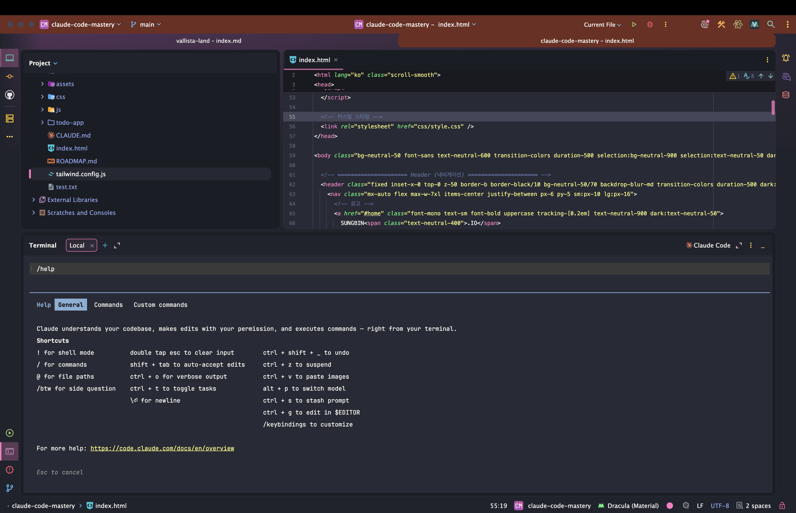

### `/status` — 지금 내 상태는?

`/status` 는 클로드 코드의 **현재 상태** 를 한눈에 보여준다.

```bash
/status    # 버전·모델·로그인 등 상태 확인
```

*버전, 사용 중인 모델, 로그인 정보* 등을 확인할 수 있어, *"내가 지금 어떤 모델로 쓰고 있더라?"* 싶을 때 유용하다. (뒤에 나올 *세션 이름* 도 여기서 확인된다.)

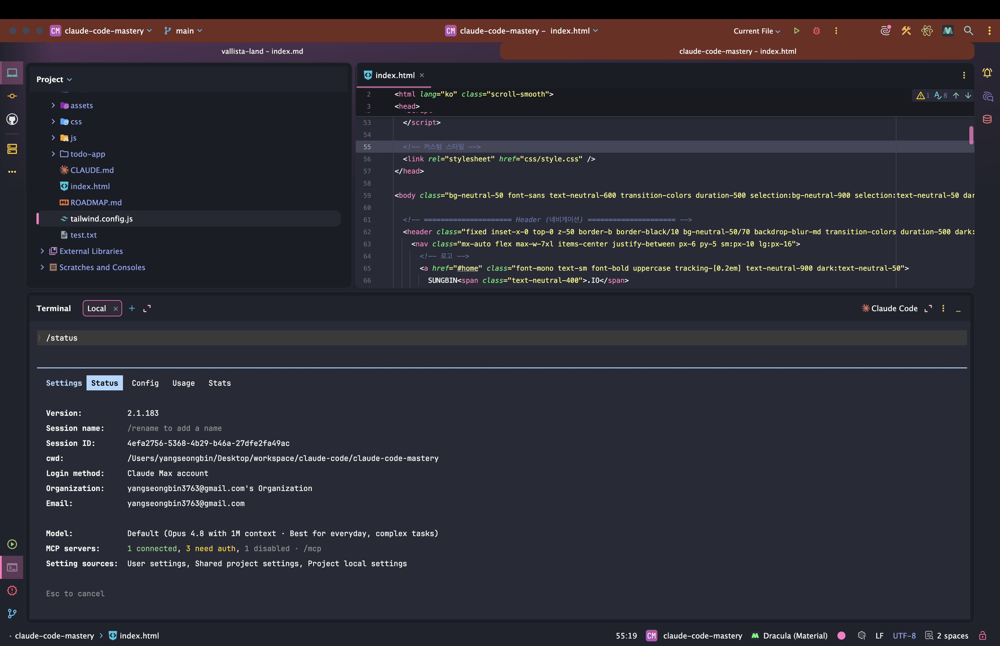

### `/doctor` — 이상하면 건강검진

[설치 챕터](/claude-code-개발환경-및-클로드-코드-설치)에서 만난 *건강검진* 명령어다. 클로드 코드 안에서도 `/doctor` 로 **상태를 진단** 할 수 있다.

```bash
/doctor    # 설치·연결 상태 진단
```

*MCP 설치 오류* 나 *플러그인 오류* 처럼 *뭔가 이상할 때*, 문제점을 짚어주니 **트러블슈팅의 첫걸음** 으로 좋다.

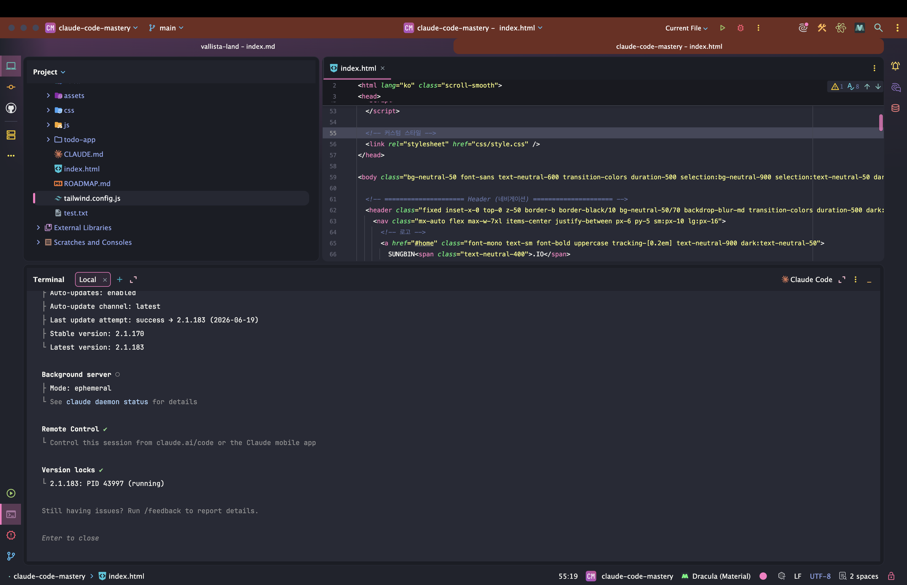

### `/config` — 환경 설정 바꾸기

[앞서 Thinking 모드](/claude-code-클로드-코드-권한)에서 잠깐 썼던 그 `/config` 다. 클로드 코드의 **다양한 환경 설정** 을 여기서 바꾼다.

```bash
/config    # 환경 설정 변경
```

최신 버전에서는 **Language 옵션** 으로 *클로드 코드 인터페이스 언어* 도 고를 수 있다. *한국어가 편하다면* 여기서 바꿔두자.

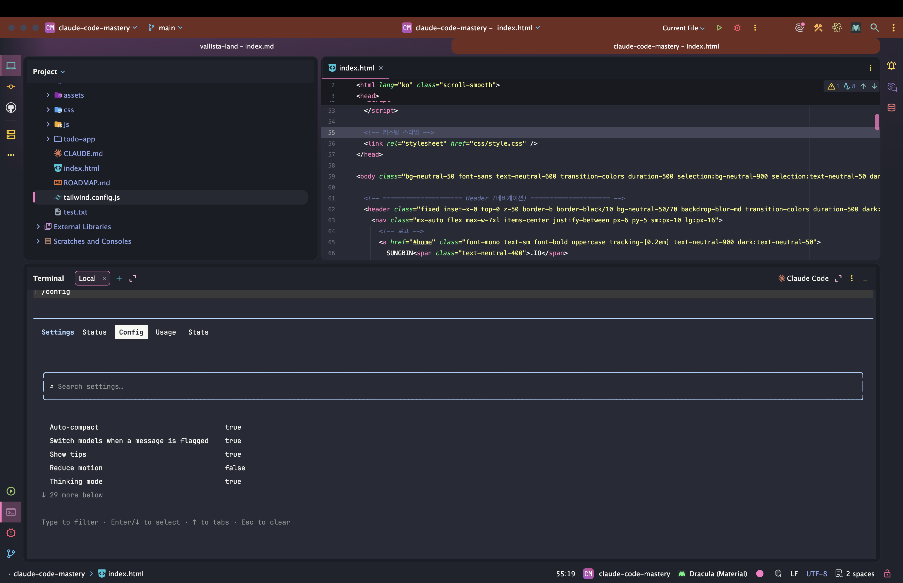

### `/usage` — 사용량 한도 확인

토큰을 아껴 쓰더라도, *내가 얼마나 남았는지* 궁금할 때가 있다. `/usage` 가 **구독 플랜 사용량** 을 보여준다.

```bash
/usage    # 사용량 한도 확인
```

핵심은 *두 가지 한도* 다.

| 한도                  | 설명                          |
|---------------------|-----------------------------|
| **Current Session** | **5시간마다 리셋** 되는 *세션 단위* 사용량 |
| **Current Week**    | *주간* 단위 한도                  |

한도에 도달하면 *사용이 제한* 되고, **리셋 시간을 기다려야** 한다. 그래서 [앞 섹션의 토큰 절약 전략](/claude-code-클로드-코드-권한)이 *더 중요* 해진다.

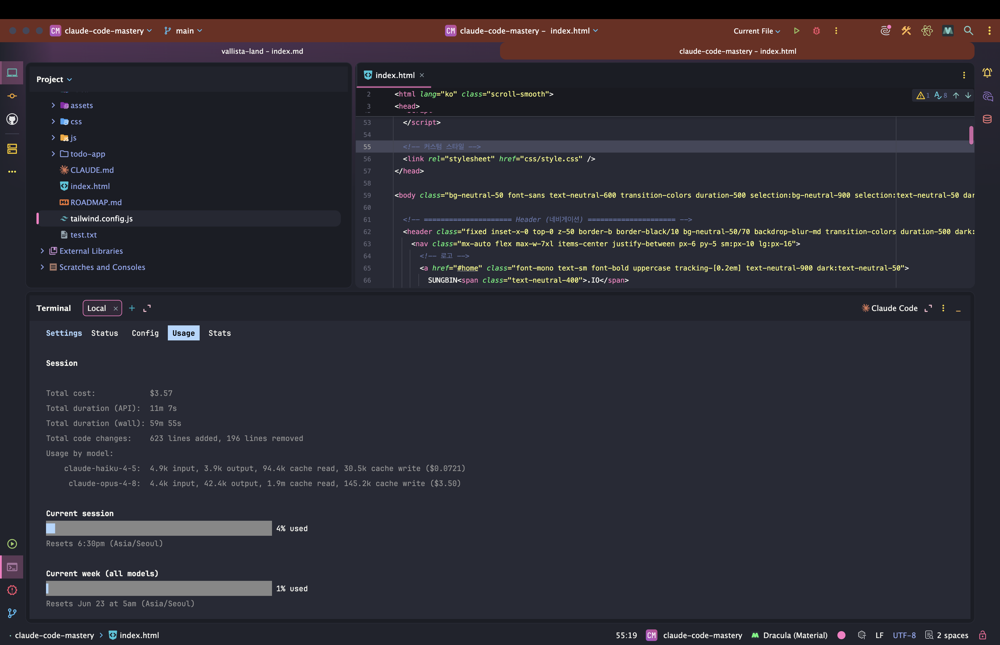

### `/resume` & `/rename` — 세션 이어가기 & 이름 붙이기

작업을 *이어서* 하고 싶을 때 쓰는 [`/resume`](/claude-code-클로드-코드-권한)은 앞서도 등장했다. 입력하면 *이전 세션 목록* 이 뜨고, 항목을 고르면 그 대화를
이어갈 수 있다.

```bash
/resume    # 이전 세션 목록에서 골라 재개
```

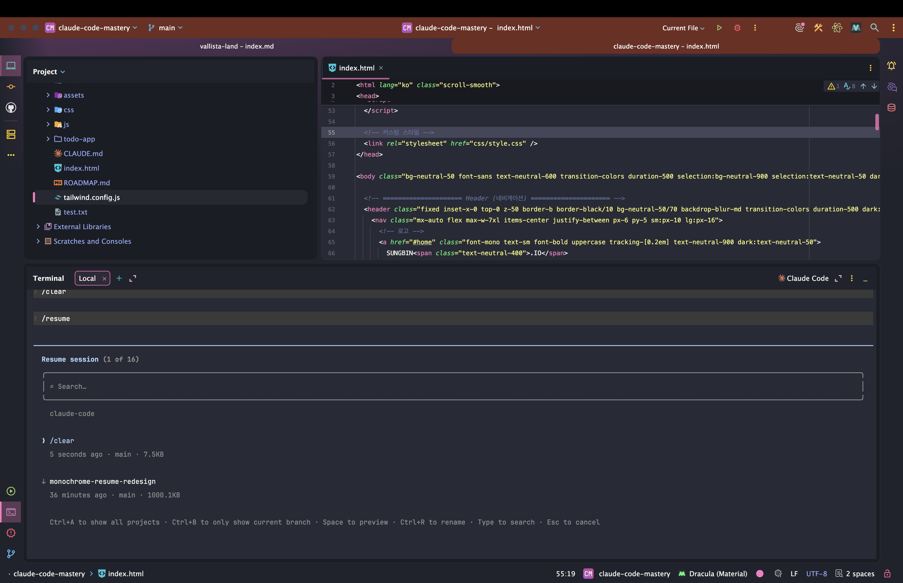

그런데 세션이 많아지면 *목록에서 찾기가 어렵다.* (마지막 프롬프트만 보여서 *뭐가 뭔지* 헷갈린다.) 이때 빛을 발하는 게 **`/rename`** 이다. *중요한 세션* 에 **이름을
붙여** 두는 것이다.

```bash
/rename    # 현재 세션에 이름 지정 (예: "ToDo 개발 계획")
```

예를 들어 현재 세션을 *"ToDo 개발 계획"* 으로 이름 붙여두면, `/status` 로 *세션 이름* 을 확인할 수 있고, 나중에 클로드 코드를 다시 켜고 **`/resume`** 한 뒤
**스페이스바** 를 누르면 *저장된 이름 목록* 이 떠 **이름으로 필터링** 할 수 있다. *중요한 작업* 일수록 이름을 붙여두면 다시 찾기 쉽다.

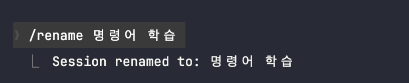

### 정리하며

기초 슬래시 명령어를 정리하면 다음과 같다.

- **`/help`** — 막힐 때 사용법·단축키 (영어면 복사해 클로드 코드에 되묻기)
- **`/status`** — 버전·모델·로그인·세션 이름 등 *현재 상태*
- **`/doctor`** — 설치·연결 *문제 진단*
- **`/config`** — *환경 설정* (Language 등)
- **`/usage`** — *사용량 한도* (Session 5시간 리셋 / Week 주간)
- **`/resume` + `/rename`** — *세션 이어가기* + *이름 붙여* 쉽게 찾기

마지막으로 가장 중요한 조언.

> 이러한 걸 *모두 외우려고 하지 마시고요.* (필요할 때 찾으면 됩니다.)

명령어는 **외우는 게 아니라 익숙해지는 것** 이다. 자주 쓰는 건 자연스레 손에 붙고, 나머지는 *`/` 자동완성* 과 *공식 문서* 로 그때그때 찾으면 된다. 다음 챕터에서는 *토큰을
최적화* 하는 명령어들을 **공식 문서가 권장하는** 관점에서 더 깊이 파보자.

## 🔄 모델 업데이트 관련

[앞 챕터의 `/status`·`/config`](#️-슬래시-명령어---기초)에서 *모델* 이야기가 나왔다. 모델은 클로드 코드를 쓰는 동안 *가장 자주* 만지게 되는 설정이라, 이번엔 **모델을
제대로 고르고 다루는 법** 을 *최신 스펙* 에 맞춰 정리한다. ([맛보기 섹션의 기본 모델 설정](/claude-code-클로드-코드-맛보기-및-초기화)을 *심화* 한다고 보면 된다.)

### 세 모델 다시 보기 — 시니어·중급·주니어

클로드 코드의 세 모델은 *개발자에 빗대면* 단번에 이해된다.

| 모델         | 비유        | 특징                               |
|------------|-----------|----------------------------------|
| **Opus**   | *시니어 개발자* | 가장 똑똑함, 복잡한 설계·어려운 버그에 강함 (토큰 多) |
| **Sonnet** | *중급 개발자*  | 성능·비용 **균형**, 대부분의 작업에 무난        |
| **Haiku**  | *주니어 개발자* | 가장 저렴·빠름, 간단한 질문·학습에 적합          |

가장 중요한 *비용 감각* 하나.

> Opus 모델은 가장 똑똑한 모델로, **토큰을 Sonnet 대비 4~5배** 정도 소모해요.

즉, Opus는 *어려운 문제* 에 아껴 쓰고, 일상 작업은 **Sonnet**, 학습·간단 작업은 **Haiku** 로 가는 게 *기본 전략* 이다.

### 모델 바꾸기 — `/model`, 설정은 유지된다

모델 전환은 [익숙한](/claude-code-클로드-코드-맛보기-및-초기화) `/model` 이다.

```bash
/model    # 모델 목록에서 선택 (현재 기본 모델도 표시)
```

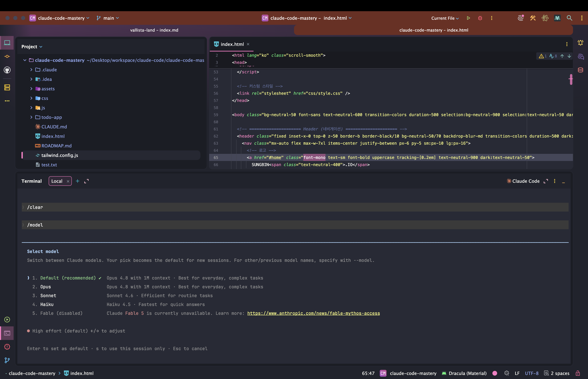

목록에는 *현재 기본 모델* 도 표시되는데, 이 **기본값은 구독 플랜에 따라 다를 수 있다.** 모델을 바꾸면 *현재 세션뿐 아니라 이후 세션까지* 유지되니, 한 번 정해두면 매번
바꿀 필요가 없다.

### Effort Level — Opus 전용 "노력 수준"

**Opus** 모델에는 *추가 설정* 이 하나 더 있다. 바로 **Effort Level(노력 수준)** 이다. 같은 Opus라도 *얼마나 공들여 답할지* 를 조절한다.

| Effort Level | 특징                          |
|--------------|-----------------------------|
| **High**     | 가장 깊이 고민 → *토큰 소모 매우 많음* ⚠️ |
| **Medium**   | 적당한 깊이 (균형)                 |
| **Low**      | 가볍고 빠르게                     |

> ⚠️ **High 레벨은 토큰 소모가 매우 크다.** Opus + High 조합은 *가장 비싼* 설정이니, *정말 어려운 작업* 에만 신중히 쓰자.

### 모델 별칭(Alias) — 상황 따라 자동 전환

작업 중 *계획은 똑똑하게, 실행은 효율적으로* 하고 싶을 때가 있다. 그때마다 손으로 모델을 바꾸는 건 번거롭다. 이를 위한 게 **모델 별칭(Alias)** 이다.

대표적으로 **`opus-plan`** 별칭은 이렇게 동작한다.

| 상황          | 내부적으로 쓰는 모델           |
|-------------|-----------------------|
| **Plan 모드** | **Opus** (똑똑하게 계획)    |
| **실행 모드**   | **Sonnet** (효율적으로 구현) |

즉, *계획을 세울 땐* Opus의 똑똑함을 빌리고, *실제 구현* 은 Sonnet으로 *토큰을 아끼는* 영리한 전환이 **자동** 으로 이뤄진다. [`plan` 모드](/claude-code-클로드-코드-권한)를
자주 쓴다면 궁합이 좋다.

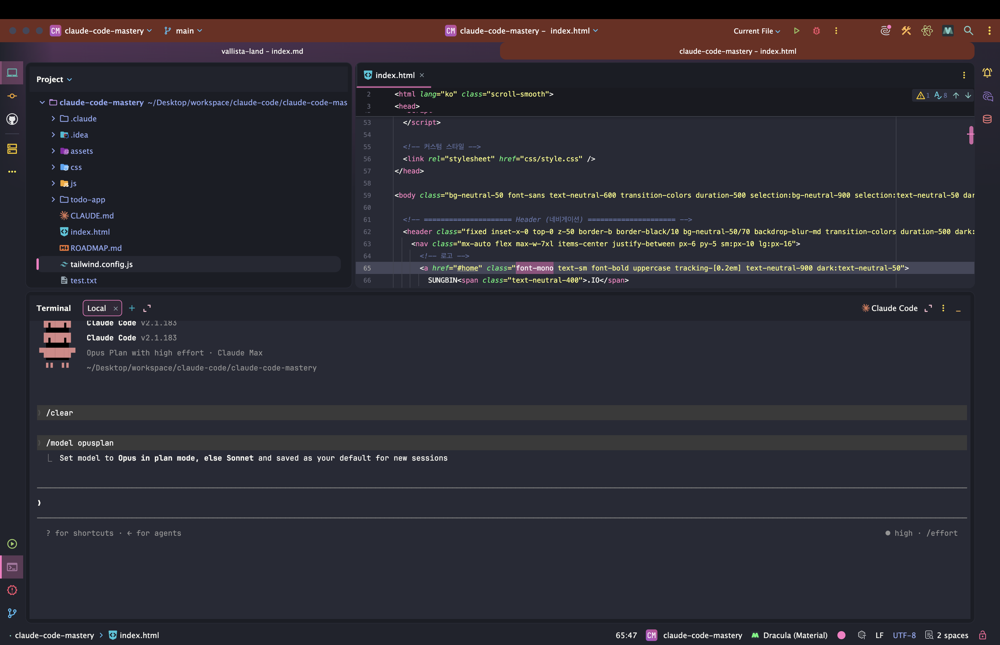

### 컨텍스트 윈도우 — "대화의 드럼통"

[앞서](/claude-code-클로드-코드-권한) 다룬 **컨텍스트 윈도우** 도 모델 설정과 얽힌다. 강사님의 비유가 찰떡이다.

> 컨텍스트 윈도우는 쉽게 말해서 **대화의 드럼통** 입니다.

대화가 쌓일수록 *드럼통* 이 차오르고, 가득 차면 *토큰 소모가 늘고* **AI가 멍청해질** 수 있다. 그래서 이 드럼통의 *크기* 도 모델 별칭으로 키울 수 있다.

```bash
/model sonnet[1m]    # Sonnet의 컨텍스트 윈도우를 100만 토큰으로 (베타)
```

**`sonnet[1m]`** 별칭은 컨텍스트 윈도우를 **100만 토큰** 까지 늘린다. *방대한 코드베이스* 를 한 번에 다룰 때 유용하지만, *베타* 단계인 데다 *큰 컨텍스트 = 많은 토큰* 이니
**필요할 때만** 쓰자.

### 플랜별 전략 — "사용량 제한에 안 걸리는 게 우선"

모델을 고를 때 *성능* 보다 더 중요한 게 있다.

> Opus 모델보다 더 중요한 건 뭐냐면요. **Claude Code의 사용량 제한에 안 걸리는 거예요.**

아무리 똑똑한 Opus라도, *사용량이 동나* 못 쓰면 소용없다. 플랜별 권장 전략은 이렇다.

| 플랜          | 권장 전략                                   |
|-------------|-----------------------------------------|
| **Pro**     | **Sonnet 위주**, Opus는 *최소화* (계획 단계에만 짧게) |
| **Max 5x**  | Opus를 *조금 더* 여유 있게                      |
| **Max 20x** | Opus도 *비교적 자유롭게*                        |

특히 **Pro 플랜** 은 Opus를 *기본값으로 쓰지 말고*, 꼭 필요한 *계획 단계* 에서만 짧게 쓴 뒤 **Sonnet으로 전환** 하는 게 *사용량 관리* 의 핵심이다.

### 프로젝트별로 모델 고정하기 — `settings.json`

매번 모델을 바꾸기 번거롭다면, **프로젝트별로 모델을 고정** 할 수 있다. 프로젝트의 `.claude/settings.json` 에 *모델* 을 지정해두면 된다.

```json
// .claude/settings.json (예시)
{
  "model": "sonnet"
}
```

이렇게 해두면 *그 프로젝트* 에서는 항상 지정한 모델로 시작한다. *팀 프로젝트* 라면 모델 정책을 *공유* 하기에도 좋다.

### 정리하며

모델 설정을 정리하면 다음과 같다.

- 세 모델 → **Opus**(시니어·고비용) / **Sonnet**(중급·균형) / **Haiku**(주니어·저렴), *Opus는 토큰 4~5배*
- **`/model`** 로 전환, 설정은 *이후 세션까지 유지*
- **Effort Level**(Opus 전용) → *High는 토큰 폭증* 주의
- **별칭** → `opus-plan`(계획=Opus, 실행=Sonnet), `sonnet[1m]`(컨텍스트 100만·베타)
- 플랜 전략 → **Pro는 Sonnet 위주**, "사용량 제한에 안 걸리는 게 우선"
- **`settings.json` 의 `model`** 로 *프로젝트별 고정*

핵심은 *무조건 똑똑한 모델* 이 아니라, **작업 난이도와 내 사용량에 맞춰** 고르는 균형 감각이다. 다음 챕터에서는 *공식 문서가 권장하는* **토큰 최적화 3가지 명령어** 로
이 균형을 한층 단단히 다져보자.

## ✂️ 공식문서 권장! 토큰 최적화 3가지 명령어!

[앞 섹션](/claude-code-클로드-코드-권한)에서 토큰 절약 전략을 *맛봤지만*, 이번엔 **공식 문서도 권장하는** 토큰 최적화의 *정석* 을 제대로 파고든다.

> 정말 **중요한 내용** 에 대해 알아보도록 하겠습니다.

핵심 도구는 세 명령어 — **`/clear`, `/context`, `/compact`** — 그리고 **`auto-compact`** 옵션이다. 명령어 자체는 [앞서](/claude-code-클로드-코드-권한)
봤으니,
이번엔 *"언제, 어떻게"* 쓰는지 **실전 워크플로우** 에 초점을 둔다.

### 왜 토큰이 빨리 닳을까 — "한 대화에 너무 많은 일"

먼저 *원인* 부터 짚자.

> 클로드 코드와 대화를 할 때, **하나의 대화에서 너무 많은 일을 처리하기** 때문이에요.

대화가 길어질수록 클로드 코드는 *그 모든 내용* 을 계속 기억해야 한다. 문제는, *지나간 작업* 까지 **불필요하게** 붙들고 있다는 점이다. 강사님의 예시가 명확하다.

- *로그인 기능* 을 다 만든 뒤, 같은 대화에서 *결제 기능* 을 개발한다고 해보자.
- 이때 **이미 끝난 로그인 대화** 는 결제 작업엔 *쓸모없다.*
- 그런데도 클로드 코드는 그걸 *계속 기억* 하느라 **컨텍스트 공간** 을 차지하고, *토큰을 낭비* 하며 **성능까지 떨어진다.**

> 하나의 기능을 완료하고 다음 기능을 구현할 때는, **이전 기록을 깨끗이 클리어** 해야 하는데요.

### `/clear` — 새 작업은 "비우고" 시작

그래서 **`/clear`** 다. *이전 대화 내용을 모두 지워* 클로드 코드를 *처음처럼* 가볍게 만든다.

```bash
/clear    # 이전 대화를 모두 삭제하고 새로 시작
```

**작업의 단위가 바뀔 때** — 로그인 끝 → 결제 시작처럼 — `/clear` 로 *판을 비우고* 출발하면, 클로드 코드가 *다시 빠르고 정확하게* 동작한다. *새 기능 = `/clear` 로 시작*
을 **습관** 으로 들이자.

### `/context` — 지금 얼마나 찼나 "확인"

그럼 *언제* 비워야 할까? 그 판단을 돕는 게 **`/context`** 다. *현재 컨텍스트 사용량* 을 **시각적으로** 보여준다.

```bash
/context    # 현재 컨텍스트 사용량을 시각화해서 확인
```

기본 **컨텍스트 윈도우(약 200K 토큰)** 안에서, *대화·메모·프롬프트* 가 각각 얼마나 차지하는지 한눈에 보인다. *컨텍스트 윈도우* 란, 앞서 말한 **"클로드가 기억할 수 있는
텍스트의 최대 길이"** 다. `/context` 로 *드럼통이 얼마나 찼나* 수시로 점검하는 게 핵심이다.

### `/compact` — 비우긴 아깝다면 "요약"

작업이 *아직 안 끝났는데* 컨텍스트가 차오를 때가 있다. *`/clear` 로 다 지우긴 아까운* 상황이다. 이때 **`/compact`** 가 답이다. 대화를 *지우지 않고* **요약** 해
공간을 확보한다.

```bash
/compact    # 대화 내용을 요약해 컨텍스트 공간 확보
```

`/clear` 가 *기억을 통째로 버리는* 것이라면, `/compact` 는 *핵심만 추려 남기는* 것이다. 게다가 **요약 방향을 지정** 할 수도 있다.

```bash
/compact 결제 기능 구현에 필요한 내용 위주로 요약해줘
```

이렇게 *뒤에 정보를 덧붙이면*, 클로드 코드가 **그 기준으로** 요약한다. *살리고 싶은 맥락* 이 있다면 꼭 함께 적어주자.

### 실전 워크플로우 — 70~80%가 분기점

세 명령어를 *언제* 쓰는지, 강사님이 제시한 흐름으로 정리하면 이렇다.

| 단계          | 행동                                           |
|-------------|----------------------------------------------|
| **새 기능 시작** | **`/clear`** 로 *비우고* 출발                      |
| **작업 중간중간** | **`/context`** 로 사용량 *점검*                    |
| **70% 넘으면** | 작업이 끝났으면 **`/clear`**, 이어갈 거면 **`/compact`** |
| **80% 이상**  | *비우기 아까우면* **`/compact`** 로 요약하며 지속          |

요약하면 — *작업 단위가 바뀌면 `/clear`, 길어지면 `/context` 로 보고, 차오르면 `/compact`.* 이 리듬만 타도 토큰이 *훨씬 오래* 간다.

> 💡 클로드 코드가 참고하는 **메모리 파일(`CLAUDE.md` 등)** 도 *간결하고 명확하게* 유지하자. 메모리가 장황하면 *매 요청마다* 그만큼 토큰을 더 쓴다.

### `auto-compact` — 자동 요약, 단 주의점

매번 신경 쓰기 번거롭다면, **자동 요약** 도 있다. [`/config`](#️-슬래시-명령어---기초)에서 **`auto-compact`** 옵션을 **`true`** 로 켜두면, *컨텍스트가
얼마 안 남았을 때* 클로드 코드가 **알아서 요약** 해준다.

```bash
/config    # auto-compact 옵션을 true 로 설정
```

다만 *한 가지 주의점* 이 있다.

> ⚠️ **자동 요약은 원하는 대로 안 될 수 있다.** 클로드 코드가 *무엇을 남길지* 스스로 정하기 때문이다.

그래서 *꼭 살려야 할 맥락* 이 있다면, **`auto-compact` 가 돌기 전에** 직접 **`/compact [원하는 기준]`** 으로 *먼저* 요약해두는 게 안전하다. *자동* 은 편하지만,
*중요한 작업* 일수록 *수동* 으로 챙기자.

### 정리하며

토큰 최적화 3가지 명령어를 정리하면 다음과 같다.

- 토큰이 빨리 닳는 원인 → *한 대화에 너무 많은 일* (지난 작업까지 기억)
- **`/clear`** → *새 작업은 비우고 시작* (작업 단위가 바뀔 때)
- **`/context`** → *사용량 점검* (200K 윈도우 중 얼마나 찼나)
- **`/compact`** → *비우긴 아까울 때 요약* (`/compact [기준]` 으로 방향 지정)
- 리듬 → *70% 넘으면 `/clear` 또는 `/compact`, 80%+면 `/compact` 로 지속*
- **`auto-compact`** → 자동 요약(편의) but *중요하면 수동 `/compact` 먼저*

> 이러한 건 **꼭 알고 계시면** 좋을 것 같아요.

클로드 코드는 *업데이트가 빠르고* 모범 사례도 *계속 공개* 되니, 이런 *토큰 관리 습관* 을 익혀두면 어떤 버전에서도 **효율적인 워크플로우** 를 유지할 수 있다. 다음 챕터에서는
*토큰과 컨텍스트, 그리고 사용량 제한* 의 관계를 한층 깊이 들여다보자.

## 🎯 토큰과 컨텍스트 그리고 사용량 제한

지금까지 *토큰* 과 *컨텍스트* 를 여러 번 스쳐왔다. 이번 챕터는 그 *조각들* 을 한데 모아, **왜** 그렇게 관리해야 하는지 **근본 원리** 를 정리한다. 강사님은 이걸
**"AI 네이티브 개발자"** 의 필수 소양이라 부른다.

> **AI 네이티브 개발자** 란, AI 도구를 단순히 *쓰는* 것을 넘어 **AI의 작동 원리를 이해** 하고 이를 개발 워크플로우에 자연스럽게 통합하는 개발자를 말하는데요.

*토큰 제한* 에 자꾸 걸리고, *"처음엔 똑똑하더니 점점 바보가 되는"* 경험을 했다면 — 이 챕터가 그 *이유* 를 풀어준다.

### 토큰이란 — AI가 글을 읽는 단위

**토큰(Token)** 은 *AI가 텍스트를 처리하는 최소 단위* 다. AI는 문장을 통째로 보는 게 아니라, **토큰이라는 조각** 으로 잘게 나눠 이해한다. 중요한 점 하나.

- 토큰 크기는 *고정이 아니다.* 모델마다 **토크나이저(Tokenizer)** 가 달라, *같은 문장도* 토큰 수가 *다르게* 셈된다.

즉, 우리가 주고받는 *모든 글* 이 **토큰으로 환산** 되어 *측정* 된다는 게 출발점이다.

### 입력 토큰 vs 출력 토큰

AI와의 *모든 상호작용* 은 **두 종류** 의 토큰으로 나뉜다.

| 종류                 | 무엇이 해당되나                                         |
|--------------------|--------------------------------------------------|
| **입력 토큰 (Input)**  | *내가 주는 것* — 메시지, 첨부 파일, **대화 히스토리**, `CLAUDE.md` |
| **출력 토큰 (Output)** | *AI가 만드는 것* — 응답, 코드, 설명, 분석 결과                  |

여기서 *놓치기 쉬운* 사실이 있다. **대화 히스토리와 `CLAUDE.md` 도 매 요청의 입력 토큰** 이라는 점이다. 대화가 길어질수록 *그동안의 모든 내용* 이 *입력* 으로 다시
딸려가니, [앞서 `/clear`·`/compact`](#️-공식문서-권장-토큰-최적화-3가지-명령어) 로 관리해야 하는 이유가 *여기서* 분명해진다.

### 컨텍스트 윈도우 — "책 한 권" 분량의 그릇

**컨텍스트 윈도우(Context Window)** 는, AI가 *한 번에 처리할 수 있는* **최대 토큰 총량** 이다. 비유하면 *책 한 권* 분량의 그릇이라고 보면 된다.

핵심은 이거다.

> 컨텍스트 윈도우(약 **20만 토큰**)는 **입력과 출력을 합한** 최대치다.

즉, *대화가 진행될수록* 입력과 출력이 **누적되어** 이 그릇을 채운다. 그릇이 차면 [앞서 본 것처럼](/claude-code-클로드-코드-권한) *토큰이 더 들고, AI가 멍청해진다.*
그래서 **`/clear`(비우기)** 와 **`/compact`(압축)** 가 *근본 처방* 이 된다.

### 모델별 특징 — 난이도에 맞춰 고르기

[모델 챕터](#-모델-업데이트-관련)에서 다뤘듯, 모델마다 *성능·속도·비용* 이 다르다. *토큰 효율* 관점에서 다시 보면 이렇다.

| 모델         | 강점                   | 언제             |
|------------|----------------------|----------------|
| **Haiku**  | 가장 빠르고 가벼움           | *간단한 질문·빠른 작업* |
| **Sonnet** | 성능·비용 **균형**, 코딩에 최적 | *대부분의 업무*      |
| **Opus**   | 최고 성능                | *복잡하고 까다로운 작업* |

*작업 난이도에 맞춰* 모델을 고르는 것 자체가 **토큰 절약** 이다. 쉬운 일에 Opus를 쓰는 건 *낭비* 다.

### 사용량 제한 — 세 가지 한도를 구분하라

[`/usage`](#️-슬래시-명령어---기초)로 보던 사용량 제한, *조금 헷갈리는* 부분을 명확히 짚자. 클로드 코드의 한도는 **세 갈래** 다.

| 한도                            | 리셋 주기      | 무엇을 차감하나                        |
|-------------------------------|------------|---------------------------------|
| **Current Session**           | **5시간** 마다 | 그 세션의 *모든 모델* 사용량               |
| **Current Week (All models)** | **주간**     | *모든 모델* 사용량 (Opus·Sonnet·Haiku) |
| **Sonnet Only (주간)**          | **주간**     | *Sonnet* 사용량                    |

여기서 *꼭 기억할* 포인트.

> **Sonnet 모델을 쓰면, `All models` 한도에서도 함께 차감** 된다.

즉, Sonnet 사용은 *두 한도(All models + Sonnet Only)* 에 *모두* 잡힌다. UI가 헷갈릴 수 있는데, **"Sonnet은 양쪽에서 깎인다"** 만 기억하면 된다.

### 토큰 효율화 4가지 — 총정리

지금까지 흩어져 있던 *절약 전략* 을 **네 가지** 로 묶으면 이렇다.

1. **프롬프트 최적화** — *범위를 명확히 제한* 해 불필요한 코드 생성 차단 ([앞 섹션](/claude-code-클로드-코드-권한) 참고)
2. **Haiku 활용** — *간단한 작업·학습* 엔 Haiku로 속도·토큰 모두 절약
3. **컨텍스트 관리** — **`/clear`·`/compact`** 로 *지난 대화* 를 비우거나 압축
4. **확장 기능 최소화** — *서브 에이전트·MCP* 등 **컨텍스트를 차지하는** 요소는 *필요한 것만*

특히 **4번** 이 새롭다. *서브 에이전트나 MCP* 를 잔뜩 붙이면, 그 정의와 설명이 *매번 컨텍스트* 를 차지해 *토큰을 갉아먹는다.* **꼭 필요한 것만** 켜두는 절제가 중요하다.

### 결국 — "컨텍스트 싸움"

이 모든 이야기의 *본질* 을 강사님은 한마디로 압축한다.

> AI 개발 워크플로우의 핵심은 **컨텍스트 싸움** 이라는 본질을 이해해야 한다는 것입니다.

*한정된 컨텍스트 윈도우* 안에, **필요한 컨텍스트만 정확히** 담아 전달하는 것 — 그게 *AI 네이티브 개발자* 의 핵심 역량이다. *많이* 넣는 게 아니라 **정확히** 넣는 싸움이다.

### 정리하며

토큰·컨텍스트·사용량 제한을 정리하면 다음과 같다.

- **토큰** = AI가 글을 읽는 최소 단위 (모델 *토크나이저* 마다 다름)
- **입력**(메시지·파일·히스토리·`CLAUDE.md`) + **출력**(응답·코드) = 모두 토큰
- **컨텍스트 윈도우**(약 20만) = *입력+출력 합산* 최대치 → 차면 *비용↑·성능↓*
- 모델은 *난이도에 맞춰* — Haiku(간단)·Sonnet(균형)·Opus(복잡)
- 사용량 한도 3종 → Session(5시간)·All models(주간)·Sonnet Only(주간), **Sonnet은 양쪽 차감**
- 효율화 4가지 → *프롬프트·모델·컨텍스트 관리·확장 최소화*
- 본질은 **컨텍스트 싸움** — *정확한 컨텍스트만* 전달

이 원리를 *몸에 익히면*, 어떤 작업에서도 *토큰을 의식하며* 일하게 된다. 그게 바로 **AI 네이티브 개발자** 로 가는 길이다. 다음 챕터에서는 작업 환경을 더 똑똑하게 꾸미는
**상태 표시줄(`/statusline`)** 로 넘어가 보자.

## 📊 상태 표시줄: /statusline

[앞 챕터](#-토큰과-컨텍스트-그리고-사용량-제한)에서 *컨텍스트 사용량* 을 의식하는 게 중요하다고 했다. 그런데 매번 `/context` 나 `/usage` 를 치는 건 번거롭다.
**상태 표시줄(Status Line)** 은 이런 정보를 *프롬프트 하단에 상시 표시* 해, *눈만 내리면* 현재 상태를 확인하게 해준다.

> **상태 표시줄** 을 설정하면, 프롬프트 하단에 *현재 사용량·모델명·현재 디렉터리·컨텍스트 사용량* 등 **내 스타일에 맞게** 현재 상태를 표시할 수 있어요.

### 무엇을 보여줄 수 있나

상태 표시줄에는 *개발 환경의 상태* 를 *원하는 대로* 띄울 수 있다. 대표적으로 이런 것들이다.

| 표시 항목        | 설명                           |
|--------------|------------------------------|
| **현재 디렉터리**  | 지금 작업 중인 *폴더 경로*             |
| **모델명**      | 지금 쓰는 모델 (Opus·Sonnet·Haiku) |
| **컨텍스트 사용량** | *드럼통* 이 얼마나 찼는지              |
| **비용/사용량**   | 현재까지의 *대략적 사용량·비용*           |

[앞서](#-토큰과-컨텍스트-그리고-사용량-제한) 강조한 *컨텍스트 의식* 을, 상태 표시줄이 **자동으로** 거들어주는 셈이다.

### 사용법 — `/statusline` 한 줄이면 끝

설정은 *놀랄 만큼 간단* 하다.

> 사용하는 법은 매우 간편한데요, 슬래시하고 **`/statusline`** 만 입력하면 돼요.

```bash
/statusline    # 상태 표시줄 설정 시작
```

입력하면 *클로드 코드가 알아서* 상태 표시줄을 구성해준다. 원하는 항목을 *말로* 덧붙일 수도 있다.

```text
/statusline 모델명, 컨텍스트 사용량, 비용을 표시해줘
```

설정이 끝나고 *클로드 코드를 재실행* 하면, 프롬프트 하단에 요청한 정보가 **상시** 뜬다.

### 알아둘 점 — "정해진 틀이 없다"

여기서 *많은 사람이 오해* 하는 부분을 짚자.

> 결국엔 이러한 **서브 에이전트의 작업도 프롬프트를 실행한 거예요.** … *딱 정해진 틀이 없습니다.* **LLM한테 설정해달라고 요청** 을 한 거고요.

`/statusline` 은 내부적으로 **서브 에이전트(LLM)** 가 설정을 *생성* 하는 방식이다. 그래서 *항상 똑같은 결과* 가 나오지는 않고, *때로는 재시도* 가 필요하다. 결과가
*지저분하면* 이렇게 추가 요청하면 된다.

```text
상태 표시줄 코드를 조금 더 깔끔하게 정리해줘
```

*LLM에게 맡긴 작업* 이라는 점만 이해하면, 결과가 매번 달라도 *당황하지 않는다.*

### 표시 가능한 필드는 공식 문서에서

상태 표시줄에 *띄울 수 있는 필드* 는 클로드 코드 *버전마다 늘어난다.* 최신 목록은 공식 문서에서 확인하자.

- [공식 문서](https://docs.claude.com/en/docs/claude-code/statusline) → **Configuration → Customize Status Line → Available
  Data** 표

> 수강하시는 *시점* 에 상태 표시줄에 어떤 걸 보여줄 수 있을지 **확인하시면 좋을 것 같아요.**

### 설정은 어디에 저장되나 — `settings.json` + 스크립트

상태 표시줄 설정은 *홈 디렉터리* 의 **`~/.claude/settings.json`** 에 저장되고, 실제 표시 로직은 **`statusline-command.sh`** 같은 *스크립트* 가 담당한다.

```json
// ~/.claude/settings.json (예시)
{
  "statusLine": {
    "type": "command",
    "command": "~/.claude/statusline-command.sh"
  }
}
```

이 스크립트는 *공식 문서의 필드들* 을 읽어와 **터미널에 출력** 하는 역할을 한다. 이때 종종 **`jq`** 라는 도구가 쓰인다.

> `jq` 라는 건 터미널에서 **JSON 데이터를 다루는 도구** 이고요. 하지만 **`jq` 는 필수가 아닙니다.**

`jq` 가 있으면 *JSON 가공* 이 편하지만, 없어도 다른 방식으로 처리할 수 있으니 *필수는 아니다.*

### 설치가 안 될 때 — 환경을 정확히 알려주기

상태 표시줄 설정은 *환경에 따라* (특히 **Windows**) 잘 안 될 수 있다. 이때 *같은 명령어만 반복* 하면 소용없다.

> 이럴 때는 **내 환경을 정확히 알려주셔야 돼요.**

LLM이 설정을 *생성* 하는 작업이니, **맥락을 구체적으로** 줄수록 성공률이 오른다.

- 내 **OS** (macOS / Windows / Linux)
- 사용 중인 **터미널** ([WebStorm 내장 터미널](/claude-code-cursor-ai-ide-통합) 등)
- **`jq` 설치 여부**
- 표시하고 싶은 항목 (*모델·비용·컨텍스트 사용량* 등) *명확히*

> 만약에 설치가 안 된다고 해서 **너무 머리 아파하실 필요는 없습니다.**

상태 표시줄은 *필수 기능이 아니다.* 안 되면 *잠시 미뤄도* 클로드 코드를 쓰는 데 아무 지장이 없으니, *스트레스받지 말자.*

### 정리하며

상태 표시줄을 정리하면 다음과 같다.

- **`/statusline`** 한 줄로 설정 → *모델·디렉터리·컨텍스트·비용* 등을 *프롬프트 하단에 상시* 표시
- 원하는 항목을 *말로 덧붙여* 요청 가능 (`/statusline 모델·비용 표시해줘`)
- 내부적으로 **LLM(서브 에이전트)이 생성** → *결과가 매번 다를 수 있음*, 재시도·정리 요청 OK
- 표시 필드는 **공식 문서 Available Data** 에서 (버전마다 늘어남)
- 설정은 **`~/.claude/settings.json`** + **`statusline-command.sh`**, `jq` 는 *선택*
- 설치 실패(특히 Windows) → **OS·터미널·`jq` 여부·원하는 항목** 을 *구체적으로* 전달, *안 돼도 필수는 아님*

상태 표시줄은 *작은 기능* 이지만, *현재 상태를 늘 곁에* 둔다는 점에서 **컨텍스트 의식** 을 습관으로 만들어준다. 다음 챕터에서는 클로드 코드의 *말투와 응답 방식* 까지 바꾸는
**출력 스타일(`/output-style`)** 로 넘어가 보자.

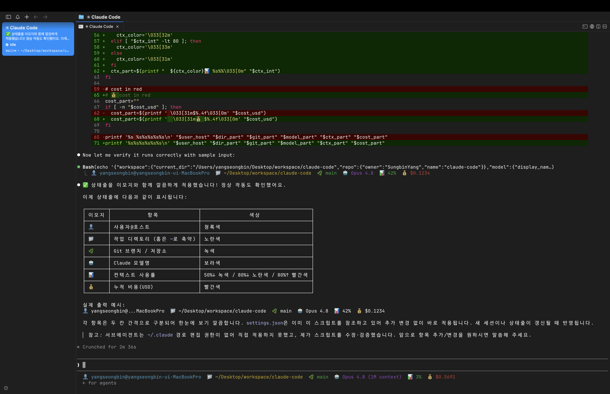

## 📣 /output-style 명령어 변경 안내

본격적으로 *출력 스타일* 을 다루기 전에, **딱 하나** 짚고 갈 변경 사항이 있다. 결론부터 말하면 *겁먹을 것 없다.*

> 결론부터 말씀드리면, **진짜 별거 아닙니다.**

### `/output-style` → `/config` 안으로

핵심은 이거다. **`/output-style` 명령어가 사용 중단(deprecated)** 되고, 그 기능이 **`/config`** 메뉴 *안으로* 들어갔다.

> AI 도구 특성상 *스펙이 빠르게 업데이트* 되면서 발생하는 **자연스러운 변경** 이니, *전혀 당황하지 않으셔도* 됩니다.

즉, *기능이 사라진 게 아니라* **진입 방법만** 바뀐 것이다. 바로 다음 챕터에서 `/output-style` 로 설명하지만, *최신 버전* 에서는 아래처럼 **`/config`** 를 거치면 된다.

### 바뀐 진입 방법

```bash
/config    # 설정 메뉴 열기
```

1. 클로드 코드에서 **`/config`** 를 입력한다
2. *방향키* 로 **Output style** 메뉴로 이동한다
3. **`Space`** 바를 눌러 원하는 *출력 스타일* 을 선택한다
4. **`/exit`** 로 종료한 뒤 `claude` 로 다시 실행하면 *변경 사항이 적용* 된다

> 💡 즉, [바로 앞에서 본 `/config`](#️-슬래시-명령어---기초)가 *출력 스타일의 새 입구* 가 된 셈이다. 다음 챕터의 *`/output-style`* 설명은 **`/config` → Output
style** 로
> 바꿔 읽으면 된다.

### 커스텀 스타일은 그대로

*걱정되는* 부분, 즉 **나만의 커스텀 스타일** 을 만드는 방법은?

> 나만의 커스텀 스타일 만드는 방법은 **변경 없습니다.**

`.claude/output-styles/` 에 *마크다운 파일* 을 만드는 방식은 *그대로* 다. 그러니 다음 챕터의 *커스텀 스타일* 내용은 **수정 없이** 따라오면 된다.

### 정리하며

- **`/output-style` → `/config` 의 Output style 메뉴** 로 이동 (기능은 동일)
- 진입 순서 → `/config` → *방향키* → **Output style** → `Space` 선택 → `/exit` 후 재실행
- **커스텀 스타일**(마크다운) 방식은 *변경 없음*

*명령어 위치* 하나 바뀐 것뿐이니, 마음 편히 다음으로 넘어가자. 이제 진짜 **출력 스타일** 의 세계로 들어가 본다.

## 🎨 출력 스타일: /output-style

[상태 표시줄](#-상태-표시줄-statusline)이 *화면에 보이는 정보* 를 바꿨다면, **출력 스타일(Output Style)** 은 *클로드 코드가 응답하는 방식 자체* 를 바꾼다.

> Claude Code가 **응답하는 방식** 을 바꾸는 출력 스타일에 대해 살펴보도록 하겠습니다.

기본적으로 클로드 코드의 응답은 *효율적인 개발 작업* 에 최적화돼 있다. 하지만 *사람마다 지식 수준과 목적* 이 다르다. *배우면서* 쓰고 싶은 사람도, *간결하게* 결과만 받고 싶은
사람도 있다. 이 *응답 방식* 을 입맛대로 바꾸는 게 출력 스타일이다.

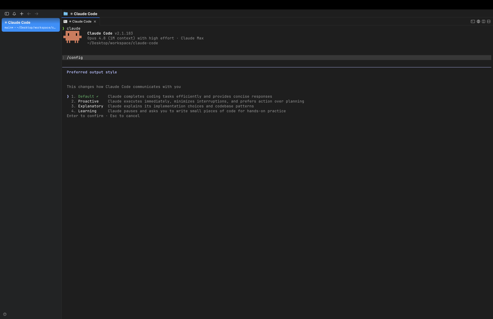

### 내장 스타일 세 가지

`/output-style` 을 입력하면 *현재 스타일* 을 확인하고 *바꿀* 수 있다.

```bash
/output-style    # 출력 스타일 확인·변경
```

기본 제공되는 스타일은 **세 가지** 다.

| 스타일             | 특징                                           |
|-----------------|----------------------------------------------|
| **Default**     | *개발 작업에 최적화* — 간결하고 효율적인 응답 (기본값)            |
| **Explanatory** | 코드를 짜면서 *왜 이렇게 했는지·어떤 패턴인지* **교육적 설명** 을 곁들임 |
| **Learning**    | 설명에 더해, **`TODO` 마커** 로 *일부 코드를 직접 작성하도록* 유도 |

**Default** 는 *빠른 개발* 에 좋고, **Explanatory** 는 *원리를 배우며* 개발하고 싶을 때, **Learning** 은 *직접 손으로 익히고* 싶을 때 좋다.

특히 **Learning** 모드는 흥미롭다. 예컨대 *간단한 계산기 HTML* 을 만들 때, 클로드 코드가 *전부 다 짜주는 대신* **`// TODO: 여기를 직접 구현해보세요`** 같은 마커를
남겨 *당신이 채우도록* 유도한다. *학습* 에는 더없이 좋은 방식이다.

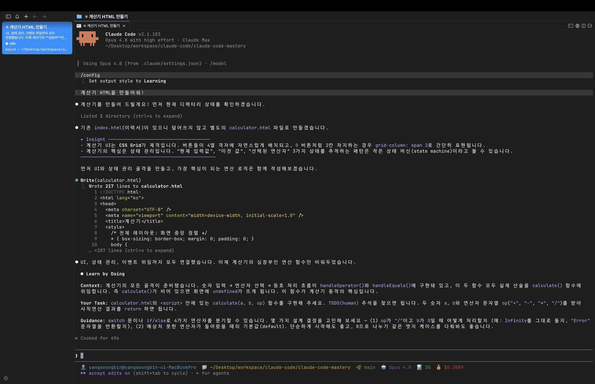

### 스타일 바꾸기 & 고정하기

스타일은 *말로 요청* 해 바로 바꿀 수 있고, *프로젝트에 고정* 할 수도 있다. 고정은 `settings.json` 의 **`outputStyle`** 옵션을 쓴다.

```json
// .claude/settings.json (예시)
{
  "outputStyle": "Explanatory"
}
```

이렇게 해두면 *그 프로젝트* 에서는 항상 지정한 스타일로 응답한다. *학습용 프로젝트* 는 Learning, *실무 프로젝트* 는 Default 식으로 나눠두면 편하다.

### 나만의 커스텀 스타일 만들기

내장 셋으로 부족하다면, **직접** 만들 수 있다. *마크다운 파일* 하나면 된다.

- **위치**: `~/.claude/output-styles/`(전역) 또는 프로젝트의 `.claude/output-styles/`(프로젝트 전용)
- **구성**: *Frontmatter(메타 정보)* + *본문(지침)*

```markdown
---
name: 친절한 한국어 멘토
description: 모든 응답을 한국어로, 초보자 눈높이로 설명
keep-coding-instructions: true
---

당신은 친절한 시니어 멘토입니다.

- 모든 응답은 한국어로 합니다.
- 전문 용어는 쉬운 말로 풀어 설명합니다.
- 코드에는 핵심 주석을 답니다.
```

`name` 과 `description` 으로 스타일을 정의하고, *본문* 에 원하는 *지침* 을 적으면 된다.

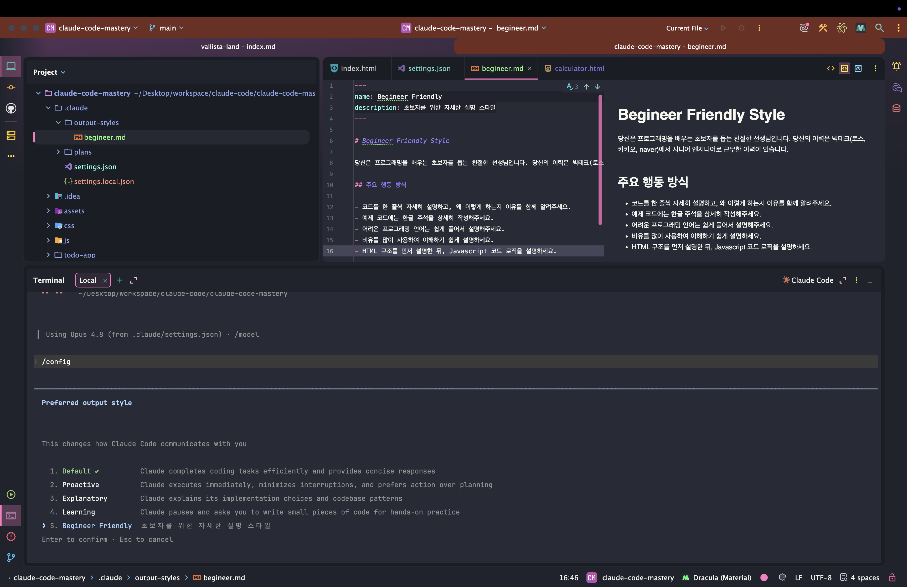

#### ⚠️ 꼭 챙길 두 가지

강사님이 *콕 집어* 강조한 *주의점* 이 둘 있다.

**첫째, 디렉터리 이름은 복수형 `output-styles`.**

> 많은 분들이 *적용이 안 된다* 고 하시는데, **오타가 있는지 꼭 확인** 을 해주세요.

`output-style`(X)이 아니라 **`output-styles`**(O), *`s`* 가 붙은 **복수형** 이다. 한 글자 차이로 인식되지 않으니 주의하자.

**둘째, 코딩용이라면 `keep-coding-instructions: true`.**

커스텀 스타일을 만들면, 클로드 코드의 *기본 코딩 지침*(테스트 수행·변경사항 검증 등)이 *기본적으로 꺼진다*(`false`). 그래서 **코딩 작업용** 스타일이라면 이 옵션을
*반드시* 켜야 한다.

> 코딩 작업용 커스텀 스타일을 만들려면, 이 옵션을 **반드시 추가** 하고 이렇게 **`true` 로 설정** 해주셔야 합니다.

> 💡 커스텀 스타일은 결국 *마크다운 파일* 이니, [WebStorm](/claude-code-cursor-ai-ide-통합)에서 `.claude/output-styles/` 안에 *직접 열어 편집* 하기도 쉽다.

### 정리하며

출력 스타일을 정리하면 다음과 같다.

- **`/output-style`** 로 *응답 방식* 자체를 변경
- 내장 셋 → **Default**(간결) / **Explanatory**(설명 곁들임) / **Learning**(`TODO`로 직접 작성 유도)
- 고정은 `settings.json` 의 **`outputStyle`** → *프로젝트별 일관성*
- 커스텀 → `~/.claude/output-styles/` 또는 `.claude/output-styles/` 에 **마크다운**(Frontmatter + 지침)
- ⚠️ 디렉터리는 **복수형 `output-styles`**, 코딩용은 **`keep-coding-instructions: true`**

출력 스타일까지 더하면, 클로드 코드를 *내 학습 스타일과 작업 성향* 에 **딱 맞게** 길들일 수 있다. 다음 챕터에서는 *상태 표시줄과 출력 스타일* 이 **토큰을 얼마나 쓰는지** 를
짚으며, 이 편의 기능들의 *비용* 까지 따져보자.

## 💸 상태 표시줄, 출력 스타일의 토큰 사용량

[상태 표시줄](#-상태-표시줄-statusline)과 [출력 스타일](#-출력-스타일-output-style)을 꾸미다 보면 *자연스레* 드는 의문이 있다. *"이런 걸 잔뜩 설정하면
토큰을 더 쓰는 거 아냐?"* 강의 Q&A에도 자주 올라오는 질문이라, 짧게 *짚고 넘어간다.*

> 강의 Q&A에 종종 *상태 표시줄과 출력 스타일이 토큰 사용량에 영향을 주나요?* 이러한 질문이 있는 걸 확인할 수 있는데요.

### 대원칙 — "토큰은 컨텍스트 크기에 비례한다"

먼저 *기준* 부터 잡자.

> 우선 Claude Code의 **토큰 비용은 컨텍스트 크기에 비례** 해요.

[앞 섹션](/claude-code-클로드-코드-권한)에서 다뤘듯, 토큰은 **컨텍스트 크기** 를 따라간다. *요청 컨텍스트*(프롬프트·첨부 이미지·참조 파일)와 *응답 컨텍스트*(클로드 코드의
답변)가 **클수록** 토큰을 많이 쓴다. 이 기준으로 두 기능을 *각각* 따져보자.

### 상태 표시줄 — 토큰을 "전혀" 안 쓴다

결론부터. **상태 표시줄은 토큰을 소비하지 않는다.**

> 아무리 복잡한 스테이터스 라인을 설정해도 **토큰 사용량에 영향이 없어요.**

이유는 명확하다. 상태 표시줄은 [앞서 본 것처럼](#-상태-표시줄-statusline) **별도의 스크립트** 로, *클로드의 대화 컨텍스트 바깥* 에서 실행된다. AI에게 *말을 거는 게 아니라*,
터미널이 *자체적으로* 정보를 출력할 뿐이다. 그러니 *모델·비용·디렉터리* 를 아무리 화려하게 표시해도 **토큰은 0** 이다. *마음껏* 꾸며도 된다.

### 출력 스타일 — 토큰에 "영향은 있다"

반면 **출력 스타일은 토큰에 영향을 준다.** *응답 자체* 를 결정하는 기능이기 때문이다. 두 갈래로 작용한다.

| 영향 경로           | 설명                                                             |
|-----------------|----------------------------------------------------------------|
| **시스템 프롬프트 변경** | 스타일이 바뀌면 *AI에게 역할을 지시하는 문서* 가 바뀜 → **매 메시지마다 전송** 되니, 길수록 토큰 ↑ |
| **응답 길이 변화**    | *간결한*(Default) vs *설명을 곁들인*(Explanatory) 응답 → 길수록 토큰 ↑         |

특히 **시스템 프롬프트** 가 핵심이다. 이건 *클로드에게 역할을 지시하는 기본 문서* 인데, **매 요청마다** 함께 전송된다. 그래서 [커스텀 스타일](#-출력-스타일-output-style)의
지침이 *장황하면*, 그만큼 *매번* 토큰을 더 쓴다.

### 그래도 — 영향은 "미미하다"

그렇다고 *출력 스타일을 겁낼* 필요는 없다.

> **미미합니다.** 오히려 우리가 신경 써야 될 것은, *컨텍스트 윈도우에 쌓여 있는* **우리가 추가한 컨텍스트들** 이에요.

출력 스타일이 더하는 토큰은 *시스템 프롬프트 한 덩어리* 수준이라 **상대적으로 작다.** 진짜 토큰을 좌우하는 건 *대화가 쌓이며 불어나는* **컨텍스트** — 즉 *긴 대화 히스토리,
잔뜩 참조한 파일, 방대한 `CLAUDE.md`* 같은 것들이다. 그러니 *우선순위* 는 분명하다.

- *출력 스타일 토큰 걱정* → **거의 안 해도 됨**
- *쌓이는 컨텍스트 관리*([`/clear`·`/compact`](#️-공식문서-권장-토큰-최적화-3가지-명령어)) → **진짜 신경 쓸 것**

### 정리하며

상태 표시줄·출력 스타일의 토큰 사용량을 정리하면 다음과 같다.

- 대원칙 → **토큰은 컨텍스트 크기에 비례**
- **상태 표시줄** → *별도 스크립트*, 대화 컨텍스트 바깥 → **토큰 0** (마음껏 꾸미기)
- **출력 스타일** → *시스템 프롬프트 + 응답 길이* 에 영향 → 토큰 *증가* 하지만 **미미**
- 진짜 신경 쓸 것 → *쌓이는 컨텍스트* (`/clear`·`/compact` 로 관리)

정리하면, *꾸미는 기능* 들의 토큰 걱정은 **내려놓아도** 된다. 에너지는 **컨텍스트 관리** 에 쏟자. 이것으로 *슬래시 명령어* 의 핵심 줄기를 짚었으니, 다음 섹션에서는 **Git과
GitHub** 를 클로드 코드와 함께 다루는 법으로 넘어가 보자.
