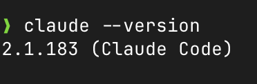
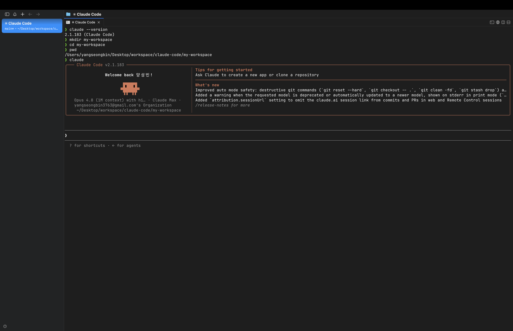
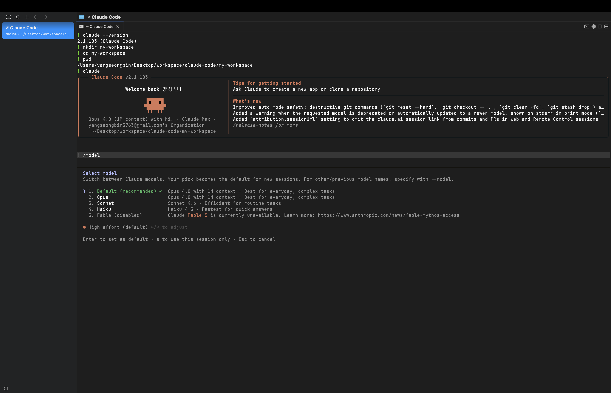
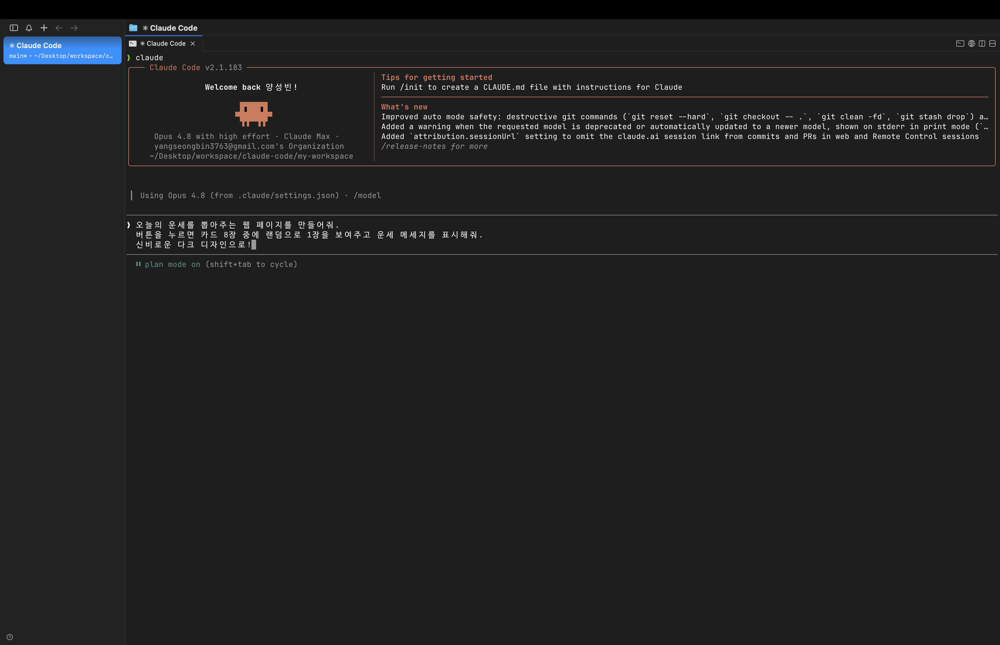
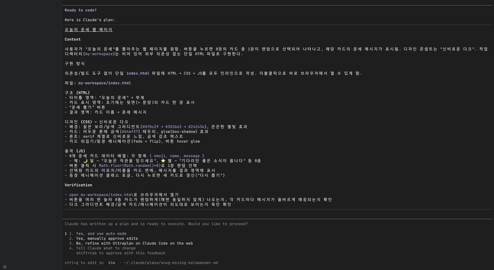
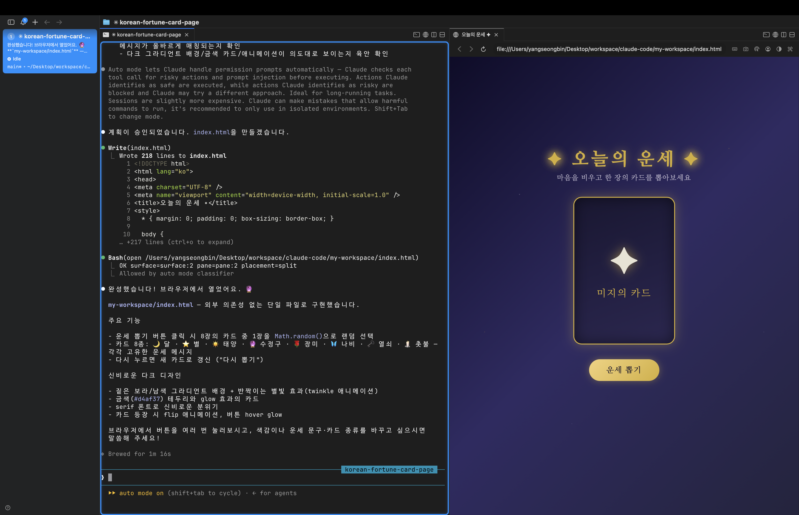

> 해당 포스팅은 [클로드 코드 완벽 마스터: AI 개발 워크플로우 기초부터 실전까지](https://inf.run/vN55k)를 참조하여 작성하였습니다.


## 🚀 강의소개

이번 시리즈에서는 인프런 짐코딩님의 [클로드 코드 완벽 마스터: AI 개발 워크플로우 기초부터 실전까지](https://inf.run/vN55k) 강의를 따라가며 정리해보려 한다.
그 첫 시작으로, 이 강의가 *무엇을* 다루고 *왜* 들어야 하는지를 짚는 **강의소개** 챕터부터 풀어보겠다.

### 요즘 클로드 코드가 정말 핫한데요

요즘 개발 커뮤니티를 둘러보면 **클로드 코드(Claude Code)** 이야기가 빠지지 않는다. 특히 Claude의 모델이 한 단계씩 업데이트될 때마다 *"이번엔 진짜 다르다"* 는 반응이 쏟아지고,
그 중심에는 늘 터미널에서 동작하는 이 AI 코딩 에이전트가 있다.

그런데 막상 내가 직접 사용해보면 어떨까? 처음엔 신기하다. *"버튼 하나 만들어줘"*, *"이 함수 좀 고쳐줘"* 같은 **간단한 요청** 은 정말 순식간에 처리된다. 문제는 그다음부터다.
조금만 복잡한 기능을 부탁하면 엉뚱한 코드가 나오고, 오류가 나고, 그걸 고치려다 보면 결국엔 *코드만 잔뜩 늘어나고 더 이상 진행이 안 되는* 상황에 빠진다.

> 도구는 분명 강력한데, 내 손에서는 왜 이게 잘 안 될까?

강의는 바로 이 지점에서 출발한다. 이런 막힘 현상의 근본 원인을 **도구의 한계** 가 아니라 **사용하는 방식의 문제** 로 본다는 것이 핵심이다.

### 진짜 문제는 "워크플로우"다

무언가를 제대로 만들기 위해서는 세 가지가 필요하다.

- 올바른 **정보(Context)** 를 수집하고
- 그것을 바탕으로 **체계적인 계획** 을 세우며
- 검증된 **워크플로우** 위에서 구현하는 것

대부분의 사람들이 클로드 코드를 쓰면서 막히는 이유는 도구가 부족해서가 아니라, 바로 이 **AI 개발 워크플로우** 에 대한 이해가 없기 때문이다. 그래서 이 강의는 클로드 코드의 *기능 나열* 에
그치지 않고, **검증된 개발 절차를 몸에 익히는 것** 을 목표로 삼는다.

### 무엇을 배우게 될까

강의는 크게 세 단계로 흘러간다.

#### 1. 클로드 코드 기초와 핵심 기능

터미널 기초부터 시작해서 클로드 코드의 핵심 기능, **메모리 관리**, **서브 에이전트(Sub-agent)**, **훅(Hook)** 까지 깊이 있게 다룬다. 도구를 그저 쓰는 것을 넘어,
*어떻게 동작하는지* 를 이해하는 단계다.

#### 2. 실무 워크플로우와 도구 활용

실무에서 유용하게 쓰이는 **MCP 서버** 와 **태스크(Task) 관리** 방법을 익힌다. 실제 개발 환경에서 효율을 끌어올리고 프로젝트를 체계적으로 굴리기 위한 실질적인 기술들이다.

#### 3. 실전 프로젝트로 워크플로우 체득

공식 문서가 권장하는 개발 워크플로우를 직접 경험해보는 단계다. **PRD 문서** 작성부터 로드맵 수립, 태스크 관리를 거쳐 다음과 같은 프로젝트를 만들어본다.

- 빠르게 시작할 수 있는 **스타터 킷(Starter Kit)** 제작
- **노션(Notion)을 CMS로 활용** 한 온라인 견적서 웹 개발
- **슈퍼베이스(Supabase)** 를 활용한 이벤트 관리 풀스택 웹 개발

### 미션으로 직접 부딪혀본다

AI 활용 강의인 만큼, 눈으로만 보고 끝나면 남는 게 없다. 그래서 이 강의에는 **총 23개의 미션** 이 준비되어 있다. 수강생이 직접 손을 움직이며 문제를 해결하는 과정에서
자연스럽게 워크플로우가 *체득* 되도록 설계되어 있다.

### 마무리하며

이 강의에서 배우는 내용은 비단 클로드 코드에만 국한되지 않는다. 정보를 수집하고 계획을 세워 구현하는 **AI 개발 워크플로우** 는 다른 AI 도구를 쓸 때에도 그대로 통하는 *본질적인 역량* 이기
때문이다.

그리고 강사님은 AI 기술의 빠른 발전 속도를 고려해, 클로드 코드의 스펙이 업데이트되면 강의 내용도 함께 갱신할 예정이라고 한다.

> 클로드 코드에 관심 있으신 분들은, 지금이 가장 좋은 시기에 수강하는 것이라 권장드린다.

다음 글부터는 본격적으로 클로드 코드를 설치하고, 하나씩 다뤄보도록 하겠다.

## 🔥 [필수] 오리엔테이션 🔥

강의소개로 큰 그림을 그렸다면, 오리엔테이션에서는 *실제로 무엇을 어떻게 배우게 되는지* 를 좀 더 구체적으로 짚어준다. 한 줄로 요약하면 이렇다.

> 이 강의는 클로드 코드를 활용해 **AI 개발 워크플로우를 처음부터 끝까지 완벽하게 학습** 하는 강의다.

즉, 단순히 클로드 코드라는 도구의 사용법을 익히는 게 아니라, *AI 시대에 클로드 코드를 활용해 실전 개발 역량을 키우는 것* 이 진짜 목표인 셈이다.

### 클로드 코드, 스펙까지 제대로 배운다

많은 사람들이 클로드 코드를 *그냥 명령만 내리는 도구* 로 쓴다. 하지만 이 강의는 **공식 문서를 기반으로 클로드 코드의 스펙 그 자체** 를 배우는 데 무게를 둔다. 다루는 범위는 다음과 같다.

- **터미널 기초** 와 Cursor AI 통합
- **슬래시 커맨드(Slash Command)** 와 **메모리 관리**
- **커스텀 커맨드(Custom Command)**
- **서브 에이전트(Sub-agent)** 와 **훅(Hook)** 같은 고급 기능

기초에서 시작해 고급 기능까지, *어떻게 동작하는지를 이해한 채* 도구를 다루는 것이 핵심이다.

### 모던 기술 스택과 MCP

도구만 잘 다룬다고 끝이 아니다. 이 강의는 실제 현업에서 인기 있는 **모던 기술 스택** 을 함께 사용한다.

- **Next.js** — 풀스택 React 프레임워크
- **shadcn/ui** — 컴포넌트 UI 라이브러리
- **Supabase** — 오픈 소스 백엔드 서비스

이런 기술들을 클로드 코드가 이해할 수 있도록 **컨텍스트로 등록** 하고, 나아가 **MCP** 를 활용해 클로드 코드가 *데이터베이스까지 직접 다룰 수 있도록* 만든다.

### 검증된 실전 개발 워크플로우

강사님이 특히 강조하는 부분이 바로 **실전 개발 워크플로우** 다. 그냥 감으로 만드는 게 아니라, 체계적인 절차를 따른다.

- **PRD(Product Requirements Document)** 문서 작성
- 효율적인 **로드맵 수립**
- **클로드 태스크 마스터(Claude Task Master)**, **쉬림프 태스크 매니저(Shrimp Task Manager)** 같은 작업 관리 도구 활용

여기서 중요한 점은, 이 워크플로우가 강사님의 개인 취향이 아니라 **Anthropic 공식 문서와 해외 검증 사례를 벤치마킹** 한 결과라는 것이다.

### 왜 "능동적 실습"이 중요할까

AI 강의는 일반적인 강의와 결정적으로 다른 점이 하나 있다. 바로 **AI는 확률적** 이라는 것이다. 똑같이 따라 해도 결과가 매번 똑같이 나오지 않는다.

그래서 *영상만 보는 학습* 으로는 한계가 분명하다. 이 강의가 섹션별로 **총 23개의 미션** 을 준비한 이유도 여기에 있다. 직접 손을 움직여 부딪혀봐야 클로드 코드의 스펙도, AI 개발 워크플로우도
비로소 *내 것* 이 된다.

### 세 가지 실전 프로젝트

배운 내용은 결국 세 개의 실전 프로젝트로 모인다.

1. **스타터 킷(Starter Kit) 제작** — 다양한 애플리케이션을 빠르게 시작할 수 있는 기반 프로젝트
2. **온라인 견적서 웹** — 노션(Notion)을 CMS로 활용하며 클로드 코드 스펙과 워크플로우를 익히는 프로젝트
3. **풀스택 애플리케이션** — Supabase MCP를 활용해 데이터베이스까지 다루는 본격적인 풀스택 개발

난이도가 *점진적으로* 올라가도록 설계되어 있어, 차근차근 따라가다 보면 자연스럽게 실력이 쌓인다.

### 강의는 계속 업데이트된다

AI 도구는 변화 속도가 정말 빠르다. 그래서 이 강의도 *한 번 찍고 끝* 이 아니라 **지속적으로 업데이트** 된다. 강의 제목 앞에 붙는 표시를 이렇게 읽으면 된다.

- **[UPDATED]** — 스펙 변경으로 다시 촬영된 강의
- **[ADDED]** — 새롭게 추가된 기능

### 나에게 맞는 학습 방법으로

마지막으로, 강사님은 정해진 정답은 없으니 *자신에게 맞는 학습 방식* 을 택하라고 권한다.

- 영상을 보다가 **일시정지하며 바로 실습**
- 영상을 **전체 시청한 뒤 실습**
- **섹션 전체를 끝낸 뒤 몰아서 실습**

어떤 방식이든 좋지만, **섹션별 미션 수행만큼은 꼭 챙기라** 는 것이 핵심이다. 그것이 클로드 코드 스펙 학습과 실전 워크플로우 체득의 가장 확실한 길이기 때문이다.

이제 오리엔테이션은 여기까지다. 그런데 그 미션과 실습을 *어떤 마음가짐* 으로 따라가야 할지, 특히 개발 경험이 없는 분들을 위한 이야기가 하나 더 남아 있다.

## 🧠 비개발자를 위한 학습 마인드셋

본격적으로 강의를 시작하기 전에, 강사님은 **개발 경험이 전혀 없는 분들** 을 위한 이야기를 따로 준비해두었다. 새로운 기능이나 스펙을 다루는 챕터는 아니지만, *강의를 끝까지 완주하게 만드는* 가장
중요한 이야기일지도 모른다.

### 개발 지식이 없어도 괜찮다

먼저 짚고 넘어갈 점. 이 강의는 **선수 지식 없이도 들을 수 있도록** 설계되어 있다. 실제로 클로드 코드는 개발에만 쓰이는 도구가 아니다.

- PPT 분석하기
- 보고서나 이메일 작성하기
- PPT 제작하기

이처럼 *개발 지식이 전혀 없어도* 업무에 충분히 유용하게 활용할 수 있다. 강사님 본인도 실무에서 클로드 코드를 적극적으로 쓰고 있고, 마케터 같은 비개발 직군 수강생들의 긍정적인 후기가 이를
뒷받침한다.

### 한 번에 이해되지 않는 건 "정상"이다

비개발자가 강의를 들을 때 가장 먼저 부딪히는 벽은 *"왜 나만 이해를 못 하지?"* 라는 자책이다. 강사님은 단호하게 말한다.

> 나는 왜 이럴까? 이렇게 자책하지 않으셔도 돼요. 그게 정상이에요.

경험이 많은 사람은 한 번에 이해하지만, 경험이 없는 사람이 한 번에 이해하지 못하는 건 *너무나 당연한 일* 이다. 이건 머리가 좋고 나쁘고의 문제가 아니라 **경험의 차이** 일 뿐이다.

마치 운전면허를 처음 딸 때와 같다. 운전대도 처음 잡아보는데 *"깜빡이 켜고, 사이드미러 보고, 핸들 돌리고, 액셀 밟으세요"* 라는 지시를 한꺼번에 들으면 누구나 머리가 하얘진다. 시간이
지나 경험이 쌓이면 자연스러워질 뿐이다.

### 핵심은 결국 "반복"이다

그래서 강사님이 가장 강조하는 것은 단 하나, **반복** 이다. 경험이 적을수록 반복이 더 필요하고, 어떤 강의든 반복이 가장 중요하다. 강사님 역시 새로운 기술을 배울 때 *기본 세 번 이상*,
때로는 *열 번 넘게* 반복해서 본다고 한다.

반복하면 신기한 일이 벌어진다.

- 처음엔 보이지 않던 것들이 *보이기 시작* 하고
- 강사가 왜 그렇게 했는지 **의도** 가 파악되며
- 두 번째부터는 **배속** 으로 들어도 따라갈 수 있게 된다

그래서 최소 두 번 이상 보는 것을 권하고, 두 번째부터는 배속으로 시간을 아끼면 된다.

### 단계별 학습 전략

무작정 반복하라는 게 아니다. 회차마다 *목표를 다르게* 두는 것이 핵심이다.

#### 1회차 — 가볍게, 목표에만 집중

첫 번째는 *가벼운 마음* 으로 쭉 따라가는 것이 중요하다. 대단한 걸 만들려 하기보다 **"이 기능은 이런 거구나"** 정도만 이해하고 넘어가자. 처음부터 복잡한 애플리케이션을 만들려고 하면
에너지가 금방 소진되고, 요금제의 토큰 사용량 제한에도 빠르게 도달해버린다.

#### 2회차 — 직접 만들며, 배속으로

두 번째부터는 *평소 만들어보고 싶었던 것* 을 직접 만들어가며 듣는다. 속도는 1.25배속이나 1.5배속이 적당하다. 직접 적용해보면, 1회차에서 이해 안 됐던 기능들이 *실제 구현에 쓰이면서*
훨씬 쉽게 와닿는다. 막히는 부분은 강의 후반부 기능으로 해결하면 된다.

#### 3·4회차 — 깊이 있게, 실험하며

세 번째, 네 번째 반복에서는 *궁금했던 부분이나 실험해보고 싶었던 것* 을 직접 시도하며 더 깊이 들어간다.

### 결과물은 "내 역량 × AI 활용 능력"

비전공자 수강생들의 실제 경험도 이를 증명한다. 1회차에는 어려워도, 2회차부터 익숙해져 혼자 프로젝트를 진행할 수 있게 되고, 3회차부터는 충분히 이해한 상태로 강의를 *재미있게* 보게 된다.
이것이 바로 **반복의 힘** 이다.

강사님이 마지막으로 남긴 한마디가 이 챕터의 전부를 요약한다.

> 결국에 내가 얻고자 하는 결과물은 **내 역량 × AI 활용 능력** 이에요.

반복 학습을 통해 이 두 가지는 *경험이 적을수록 오히려 더 크게* 향상된다. 그러니 일단 시작했다면, 자신 있게 끝까지 완주해보자.

마음의 준비가 끝났다면, 이제 한 가지 개념만 더 정리하고 가자. 바로 *AI 모델* 과 *AI 코딩 도구* 가 무엇이 다른가 하는 이야기다.

## 🤖 AI 모델 vs AI 코딩 도구: 무엇이 다를까?

요즘 AI 코딩에 관심을 가지다 보면 *ChatGPT*, *Claude*, *Cursor*, *Claude Code* 같은 이름들이 한꺼번에 쏟아진다. 그러다 보니 **AI 모델** 과 **AI 코딩 도구** 의
경계가
점점 흐려진다. 이 챕터는 바로 이 둘의 차이를 명확하게 짚고, 그 위에서 *왜 클로드 코드인가* 를 설명한다.

### AI 모델은 "두뇌"다

**AI 모델** 은 사람의 언어를 이해하고 답변을 생성하는 인공지능 프로그램이다. 쉽게 말해 **두뇌** 에 해당한다. 수십억 개의 텍스트 데이터를 학습해 언어의 패턴과 맥락을 이해하고, ChatGPT나
Claude처럼 질문에 답을 내놓는다.

하지만 결정적인 한계가 있다.

> 생각하고 판단하고 대답은 할 수 있는데, 직접 행동은 못 하는 거죠.

즉, AI 모델은 *대화* 만 가능할 뿐 직접 파일을 만들거나 코드를 실행하지는 못한다. 그리고 만든 회사마다 성향이 다르다. **Claude** 는 신중하게, **GPT** 는 폭넓게, **Gemini** 는
멀티미디어까지 활용하는 식으로 답변 스타일이 갈린다.

### AI 코딩 도구는 "손과 발"이다

반면 **AI 코딩 도구** 는 그 두뇌에 *실제 행동 능력* 을 부여하는 소프트웨어다. 비유하자면 **손과 발** 인 셈이다.

AI 모델이 *"이 버그는 이렇게 고치면 돼"* 라고 알려주는 데서 그친다면, AI 코딩 도구는 **실제로 파일을 열고, 코드를 수정하고, 테스트를 실행** 한다. Claude.ai에서 Claude 모델만
쓰면 코드를 텍스트로 *보여주기만* 하지만, 클로드 코드 같은 도구는 프로젝트 구조를 파악하고 필요한 파일을 직접 만들어 코드를 작성한다.

AI 코딩 도구는 크게 세 종류로 나뉜다.

- **터미널 기반** — Claude Code, Gemini CLI
- **데스크톱 IDE 기반** — Cursor, Windsurf, Trae
- **웹 IDE 기반** — Replit, Bolt, Lovable

### 나에게 맞는 도구는?

정답은 없다. *코딩 경험 수준, 개발 목표, AI 활용 능력* 에 따라 적합한 도구가 달라진다.

- 간단한 웹페이지 → **웹 IDE**
- 복잡한 프로젝트 → **데스크톱 IDE** (Cursor 등)
- 강력한 성능의 대규모 프로젝트 → **터미널 기반** 도구

터미널 기반은 진입 장벽이 조금 있지만, 복잡한 결과물을 만들어내는 능력이 뛰어나다. 참고로 Cursor 같은 IDE의 *내장 터미널* 에서 클로드 코드를 실행하면, IDE의 편리함과 터미널의 강력함을
동시에 누릴 수 있다.

### 같은 모델이어도 결과는 다르다

여기서 중요한 포인트. 클로드 코드 안에서도 Claude 모델을 쓰고, Cursor에서도 Claude 모델을 쓸 수 있다. **같은 모델** 인데 결과가 다를 수 있다는 게 의외일 것이다.

이유는 *AI를 활용하는 방식* 이 도구마다 다르기 때문이다. 시스템 프롬프트, 에이전트 루프, 컨텍스트 관리, 전용 기능 등이 제각각이라 최종 경험과 결과물이 달라진다.

> 같은 엔진이라도 어떤 차에 얹느냐에 따라 승차감과 용도가 다른 것과 같다.

### 패러다임이 바뀌고 있다: 타이핑에서 의사결정으로

과거에는 AI가 만든 코드 품질이 낮아서, 개발자가 직접 코드를 쓰며 AI의 도움을 *조금* 받는 방식이 현실적이었다. 하지만 모델 성능이 올라오면서 흐름이 바뀌었다.

> 예전에는 운전자가 모든 걸 조작했지만, 이제는 목적지만 말하면 자율주행이 데려다주는 시대가 된 거예요.

코드 편집기 기반 도구가 *열린 파일* 중심으로 빠르게 응답한다면, 터미널 기반 도구는 **프로젝트 전체를 분석해 자율적으로** 작업한다. 클로드 코드는 이 *자율주행* 방식의 대표 주자이고, 그
결과 개발자의 역할도 **타이핑하는 실행자에서 방향을 정하는 설계자** 로 바뀌고 있다.

### 클로드 코드의 차별점 ① 컨텍스트 엔지니어링

그렇다면 클로드 코드는 왜 특별할까. 첫 번째는 **컨텍스트 엔지니어링(Context Engineering)** 이다.

과거의 *프롬프트 엔지니어링* 이 **"어떻게 말할지"** 에 집중했다면, 이제는 AI에게 **"무엇을 알고 있는지"** 를 제공하는 컨텍스트 엔지니어링이 핵심이다. 실제로 AI 에이전트를 운영할 때
품질 문제의 대부분은 *모델 능력 부족* 이 아니라 **컨텍스트 관리 실패** 에서 나온다.

클로드 코드는 `CLAUDE.md` 메모리 파일, 에이전트 Skills, MCP tool search 등을 통해 *필요한 정보만 정확하게* 전달한다. 덕분에 컨텍스트 윈도우의 토큰을 아끼고, AI가 방향을
잃지 않게 돕는다.

### 클로드 코드의 차별점 ② 네이티브 통합

두 번째는 **네이티브 통합(Native Integration)** 이다. 클로드 코드는 Claude를 만든 **Anthropic이 직접 개발** 했다. 그래서 Claude 모델이 어떤 프롬프트에 잘
반응하고, 어떤 컨텍스트 구조가 효과적인지를 가장 정확하게 알고 있다.

> 다른 도구들이 자동차 매뉴얼만 보고 운전하는 거라면, Claude Code는 그 자동차를 직접 설계한 엔지니어가 운전하는 거예요.

그 결과 클로드 코드는 Cursor 대비 *적은 토큰, 빠른 작업 완료, 적은 오류* 를 보인다. 게다가 터미널 기반이라 기존 개발 환경을 바꿀 필요 없이 IntelliJ IDEA, VS Code 등
어떤 IDE에서도 쓸 수 있고, GitHub Actions 연동을 통한 자동화나 원격 서버 접속에서도 강점을 발휘한다.

### 정리하며

이 챕터를 한 문장으로 요약하면 이렇다.

> **AI 모델은 엔진, AI 코딩 도구는 자동차다.**

같은 Claude 모델을 쓰더라도 어떤 도구에 얹느냐에 따라 경험이 완전히 달라진다. 개발 도구의 패러다임은 코드 편집기에서 *터미널 기반* 으로 옮겨가고 있고, 개발자의 역할도 *실행자에서 설계자* 로
변하고 있다. 그리고 **컨텍스트 엔지니어링** 과 **네이티브 통합** 이 같은 모델로도 다른 수준의 결과를 만들어낸다.

결국 AI 시대 개발의 본질은 *모델과 도구를 구분할 줄 알고, 트렌드를 읽으며, 컨텍스트의 중요성을 아는 것* 이다. 그 위에서 AI는 단순한 도구를 넘어 **진짜 개발 파트너** 가 된다.

개념 정리는 여기까지다. 이제 *말로만 듣던* 클로드 코드를 직접 설치하고, 첫 앱까지 만들어보자.

## 🛠️ 클로드 코드 시작하기: 설치부터 첫 앱 만들기 맛보기

드디어 손을 움직일 차례다. 이 챕터에서는 **클로드 코드 설치 → 터미널 이해 → 첫 웹 앱 만들기** 까지, *처음부터 끝까지* 한 번에 훑어본다. 개발자가 아니어도 따라올 수 있게 구성되어 있으니
너무 걱정하지 않아도 된다.

> 다만 미리 말해두자면, **상세한 설치 과정은 다음 글에서 따로 차근차근 다룰 예정** 이다. 이 챕터는 어디까지나 *"클로드 코드를 깔면 이런 흐름으로 쓰는구나"* 를 감만 잡는 **맛보기** 라고
> 생각하면 된다. 그러니 지금은 세세한 설정 하나하나에 집착하기보다, 전체 그림을 가볍게 따라오는 데 집중하자.

### 먼저, 결제 플랜부터

아쉽지만 클로드 코드는 **무료 플랜으로는 사용할 수 없다.** 월 정액제인 Claude 구독이 필요하며, 최소 **프로(Pro) 플랜 이상** 을 구독해야 한다.

- **입문자** → 우선 **프로 플랜** 으로 시작
- 토큰이 부족하다고 느껴지면 → **맥스(Max) 플랜** 으로 업그레이드

처음부터 비싼 플랜을 지를 필요는 없다. 프로로 시작해 필요에 따라 올리는 것이 합리적이다.

### 클로드 코드는 "터미널에서 일하는 동료"

클로드 코드는 **터미널에서 실행되는 AI 코딩 에이전트** 다. 단순히 답만 해주는 게 아니라, *파일을 읽고 수정하며 명령어를 실행* 하는 **동료** 같은 존재라고 생각하면 된다.

여기서 터미널이라는 단어에 겁먹을 필요 없다. 터미널은 **명령어로 컴퓨터를 조작하는 방식**, 즉 **CLI(Command Line Interface)** 도구다. 우리가 평소 마우스로 아이콘을 클릭하는
**GUI(Graphical User Interface)** 와 대비되는 개념일 뿐이다.

설치는 운영체제마다 조금씩 다른데, 자동 업데이트가 되는 **네이티브 설치** 방식을 권장한다. 잘 설치가 되었다면 아래의 명령어를 작성해보자.

```shell
claude --version
```



### 설치하다 막혔다면

설치 과정에서 흔히 겪는 오류는 크게 두 가지다.

1. **설치가 멈춘 것처럼 보일 때** — 사실 멈춘 게 아니라 네트워크 환경에 따라 시간이 걸리는 것이다. *5분 정도* 느긋하게 기다려보자.
2. **`claude` 명령어를 인식하지 못할 때** — 설치 경로가 **환경 변수(Path)** 에 등록되지 않아 생기는 문제다.

여기서 *환경 변수* 란, **터미널이 명령어를 찾을 때 뒤져보는 폴더 목록** 정도로 이해하면 된다. 이 목록에 클로드 코드 설치 경로를 추가해주면 된다. Windows는 제어판의 시스템 설정에서,
macOS는 별도 명령어로 설정할 수 있다.

### 코드 편집기와 함께 쓰기

클로드 코드는 *작업할 디렉터리* 안에서 실행해야 한다. 그 폴더의 파일을 읽고 수정하고, 새 파일을 만들어내기 때문이다.

여기에 **VS Code** 같은 코드 편집기(IDE)를 함께 쓰면 더 좋다. 앞 챕터에서 이야기했듯, *IDE의 편리한 UI* 와 *터미널 기반 에이전트의 강력함* 을 동시에 누릴 수 있기 때문이다.
실제로 VS Code의 **내장 터미널** 에서 클로드 코드를 실행하는 방식이 가장 일반적이다.



### 첫 앱 만들기: 오늘의 운세

이제 진짜 무언가를 만들어볼 차례다. 강의에서는 가볍게 **"오늘의 운세"** 를 확인하는 웹 앱을 만든다.

> 프로 플랜 사용자라면, 토큰을 아끼기 위해 기본 모델을 **Opus → Sonnet** 으로 바꿔두는 것을 권장한다.

모델을 바꾸는 방법은 아래 명령어를 실행하여 모델들을 볼 수 있다. 해당 모델들을 변경하면 된다.

```shell
/model
```



그리고 `settings.json`을 생성하여 아래와 같이 설정하면 클로드 코드를 킬때 기본 모델을 설정할 수 있다.

만드는 과정은 강의가 내내 강조하는 개발 워크플로우, 즉 **탐색 → 계획 → 구현** 순서를 그대로 따른다. 이때 두 가지 모드가 핵심이다.

- **Plan 모드** — 곧바로 코드를 짜는 대신 *먼저 계획부터* 세우는 모드. `Shift + Tab` 을 두 번 누르면 켜진다. 계획을 보고 마음에 안 들면 수정한 뒤 진행할 수 있다.
- **Auto 모드** — 파일을 만들 때마다 *일일이 허락받지 않고* 알아서 진행하는 모드.







계획을 세우고, 자동으로 구현하게 두면 어느새 **오늘의 운세 웹 앱** 이 뚝딱 완성된다. 정말 간단하다.

### 정리하며

이 챕터에서는 클로드 코드를 *설치하고, 실행하고, 첫 앱까지* 만들어봤다.

- 클로드 코드는 **프로 플랜 이상** 이 필요하다
- 터미널은 *명령어로 컴퓨터와 대화* 하는 도구일 뿐, 겁낼 것 없다
- 설치 오류는 대부분 **기다림** 이나 **환경 변수** 로 해결된다
- VS Code의 내장 터미널과 함께 쓰면 편하다
- 실제 개발은 **탐색 → 계획 → 구현** 의 워크플로우를 따른다

여기까지가 **시작하기 전에** 섹션의 전부다. 이제 기초 준비를 마쳤으니, 다음 글부터는 클로드 코드의 기능을 하나씩 본격적으로 파헤쳐보도록 하겠다.