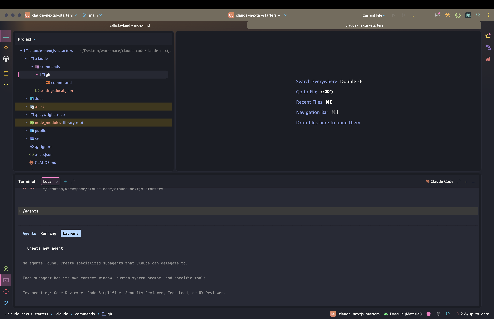
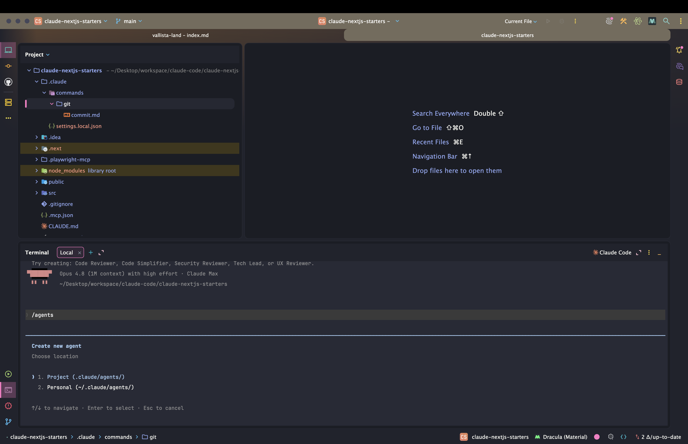
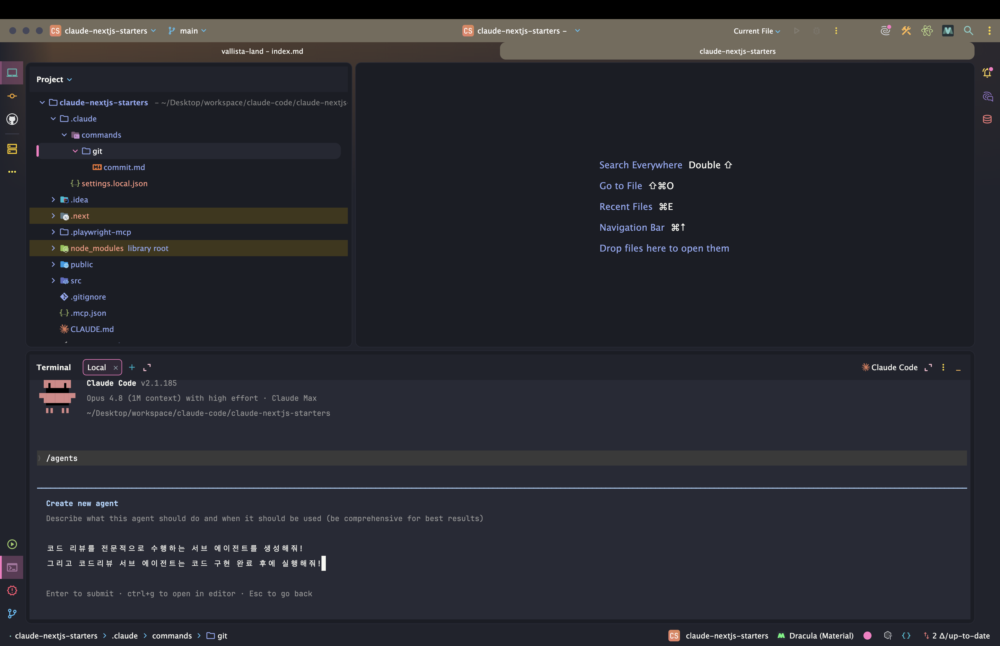

> 해당 포스팅은 [클로드 코드 완벽 마스터: AI 개발 워크플로우 기초부터 실전까지](https://inf.run/vN55k)를 참조하여 작성하였습니다.


## 🤝 서브에이전트 기초: 코드 리뷰 서브 에이전트

개발에는 *여러 전문 작업* 이 섞여 있다. *기능 개발*, *코드 리뷰*, *보안 점검*, *테스트* — 저마다 **다른 전문 지식** 을 요구한다. 그런데 이걸 *한 명* 이 다 하려 들면?

> 한 사람이 *모든 걸 다* 하려고 한다면 어떻게 될까요? 결국 *어느 것 하나 제대로 못 보는* 경우가 생길 거예요.

*인테리어* 를 한 사람이 *전 공정* 떠맡으면 완성도가 떨어지듯, 클로드에게 *이것저것 한꺼번에* 시키면 **[컨텍스트가 꼬여](/claude-code-슬래시-명령어와-단축키)** 결과가 흐려진다. 이 문제를 푸는
게 **서브 에이전트** 다.

### 서브 에이전트란 — '전문가'를 부르는 일

**서브 에이전트** 는 *특정 작업* 을 전담하는 **전문 AI 어시스턴트** 다. *각 분야 전문가* 처럼, *맡은 일만* 깊이 처리한다.

> 쉽게 말해, 우리가 *업무를 시키면* **뒤에 가서 조용히 일을 하는** 것과 같아요.

핵심 이점은 둘이다.

- **작업별 워크플로우** — *리뷰는 리뷰답게*, *테스트는 테스트답게* 전담
- **향상된 컨텍스트 관리** — *자기만의 별도 컨텍스트* 에서 일해, **메인 대화가 꼬이지 않음**

### 만들기 — `/agents`

서브 에이전트는 **`/agents`** 내장 명령으로 만든다. 실행하면 *생성 인터페이스* 가 뜨고, 몇 가지를 *고르며* 만들어간다.

```bash
/agents
```



저장 위치는 [`.claude` 디렉터리](/claude-code-설정-파일과-메모리-관리) 아래 **`agents/`** 폴더다. [커스텀 커맨드와 똑같이](/claude-code-클로드-코드-고급-커스텀-커맨드)
*현재 프로젝트* 용과 *모든 프로젝트 (전역)* 용을 고를 수 있다. 생성 과정에서 정하는 것들은 이렇다.

| 항목          | 정하는 내용                                           |
|---------------|-------------------------------------------------------|
| **생성 방식** | *공식 권장* — **클로드 코드가 대신 작성**(1번)        |
| **역할·시점** | *무슨 일* 을, *언제* 실행할지 (예: 구현 완료 후 리뷰) |
| **도구**      | 이 에이전트가 쓸 *툴* 목록                            |
| **모델**      | 예: **Sonnet**                                        |
| **색상**      | 식별용 색 (예: 옐로우)                                |

이렇게 *코드 리뷰 전문* 서브 에이전트 — `code-reviewer-korean` — 를 만든다. *"코드 구현이 끝난 뒤 실행하라"* 는 *사용 시점* 까지 일러둔다.





### 활용 ① 자동 호출 — `description`의 힘

서브 에이전트를 *부르는* 방법은 둘이다. 첫째는 **자동 호출** — 클로드 코드가 *내 요청을 분석* 해 *알맞은 에이전트* 를 *알아서* 부른다.

이때 결정적인 게 에이전트의 **[`description` 필드](/claude-code-클로드-코드-고급-커스텀-커맨드)** 다. 여기에 *언제 써야 하는지* 를 잘 적어두면, 클로드가 *그걸 보고* 판단한다.
특히 **`use proactively`** 나 **`must be used`** 같은 문구를 넣으면, 클로드가 *더 능동적으로* 그 에이전트를 *알아서* 쓴다.

```markdown
---
name: code-reviewer-korean
description: 코드 구현이 끝나면 use proactively — 한국어로 코드 리뷰를 수행
---
```

### 활용 ② 명시적 호출

둘째는 **명시적 호출** — 프롬프트에서 *에이전트 이름* 을 *직접* 부르는 방식이다.

```text
code-reviewer-korean 서브 에이전트로 전체 코드를 리뷰해줘.
```

*확실하게* 그 에이전트를 쓰고 싶을 때 깔끔하다. 강의에선 이렇게 *명시적으로* 불러 **전체 코드베이스 리뷰** 를 맡긴다.

### 조용히 일하고 요약만 — 컨텍스트 분리

서브 에이전트의 *진짜 매력* 은 **일하는 방식** 에 있다.

> 서브 에이전트는 *메인 대화 창에 노출되지 않고*, **조용히 작업** 한 뒤 **결과만 요약** 해서 전달해요.

즉 *리뷰하느라 쏟아낸 수많은 중간 과정* 이 **내 메인 컨텍스트를 더럽히지 않는다.** 에이전트는 *자기 방* 에서 일하고, *우리에겐* **결론만** 들고 온다. 이게 *"컨텍스트가 꼬이지 않는다"* 의
실체다 — *복잡한 작업* 일수록 빛난다.

### 리뷰 결과를 고치기까지

리뷰가 끝나면, `code-reviewer-korean` 이 *전체 코드* 를 분석해 **문제 목록** 을 내놓는다. (강의에선 *404 에러* 이슈와 여러 개선점이 나왔다.) 여기서부터는 *익숙한 흐름* 이다.

1. 리뷰가 짚은 문제를 [**플랜 모드**](/claude-code-클로드-코드-권한)로 *계획* 세우고
2. 계획대로 **수정** 한 뒤
3. [**커스텀 커맨드**](/claude-code-클로드-코드-고급-커스텀-커맨드)로 *"코드 리뷰 기반 품질 개선"* 커밋

**리뷰 (서브 에이전트) → 계획 → 수정 → 커밋 (커스텀 커맨드)** — 지금까지 배운 도구들이 *하나의 워크플로우* 로 엮이는 순간이다.

### 정리하며

코드 리뷰 서브 에이전트를 정리하면 다음과 같다.

- **서브 에이전트** = *특정 작업 전담* 전문 AI → *작업별 워크플로우* + **컨텍스트 분리**
- **왜?** → 한 명 (메인)이 *다 하면* 컨텍스트가 *꼬인다* → 전문가에게 *맡긴다*
- **만들기** → **`/agents`** → `.claude/agents/`(프로젝트·전역), 역할·도구·모델·색상 지정
- **활용** → ① *자동 호출*(`description` + `use proactively`) · ② *명시적 호출*(이름 지정)
- **특징** → *조용히 일하고* **결과만 요약** → 메인 컨텍스트 *안 더럽힘*
- **흐름** → 리뷰 → [플랜](/claude-code-클로드-코드-권한) → 수정 → [커스텀 커맨드](/claude-code-클로드-코드-고급-커스텀-커맨드) 커밋

서브 에이전트는 *"혼자 다 하지 말고, 전문가에게 나눠 맡겨라"* 는 발상이다. 다음 챕터에서는 이 서브 에이전트의 **컨텍스트 관리** 특성을 *더 깊이* 들여다보며, *언제·왜* 효과적인지 살펴보자.

## 🧩 서브에이전트 심화: 컨텍스트 관리

[기초 챕터](#-서브에이전트-기초-코드-리뷰-서브-에이전트)에서 *서브 에이전트가 무엇이고 어떻게 만드는지* 봤다. 이번엔 *왜* 강력한지 — 특히 **컨텍스트 관리** 측면을 *깊이* 파본다. 혹시 *어렵게*
느껴진다면, 괜찮다.

> 영화도 *처음 봤을 때보다 두 번째* 볼 때, 처음엔 안 보이던 게 보이죠. **강의도 마찬가지** 예요.

### ⭐ 서브 에이전트의 4가지 이점

서브 에이전트가 좋은 이유는 *네 가지* 로 정리된다.

| 이점                      | 설명                                                                     |
|---------------------------|--------------------------------------------------------------------------|
| **유연한 권한 설정**      | 에이전트별 *필요한 권한만* 부여 — 리뷰어는 *읽기 권한만* → **실수 방지** |
| **뛰어난 재사용성**       | 한 번 만들면 *여러 프로젝트* 에서 재사용 + *팀 공유* → 일관된 워크플로우 |
| **특정 도메인 전문 지식** | *보안 전문가* 에이전트 → 전문 관점으로 분석, **핵심만 요약**             |
| **컨텍스트 보존**         | *자체 컨텍스트* 에서 작동 → **메인 대화 오염 방지** → 목표에 집중        |

특히 **유연한 권한** 은 *안전장치* 다. [코드 리뷰어에게 *읽기 권한만*](/claude-code-클로드-코드-권한) 주면, *실수로 코드를 고치는* 사고 자체가 *불가능* 해진다. 또 **재사용성**
덕에, [프로젝트 `.claude/agents` 를 Git으로 공유](/claude-code-설정-파일과-메모리-관리)하면 *팀 전체* 가 같은 전문가를 *함께* 쓴다.

### 언제 쓰나 — 간단 vs 복잡

*모든 일* 에 서브 에이전트가 필요한 건 아니다. **작업의 복잡도** 가 기준이다.

- **간단한 기능** → *메인 컨텍스트* 에서 바로 처리해도 충분
- **복잡한 기능** → *설계·API 연동·결제* 등 **여러 도메인 지식** 이 필요 → **서브 에이전트**

복잡한 기능을 *메인에서 통째로* 분석하면, *온갖 중간 대화* 로 **컨텍스트가 오염** 된다. 반면 서브 에이전트는 *자기 방* 에서 분석하고 **필요한 정보만 요약** 해 넘긴다.

> 서브 에이전트는 *자체 컨텍스트* 를 써서 메인 컨텍스트를 *절약* 했기 때문에, 그만큼 **긴 세션** 을 유지할 수 있어요.

즉 *메인 창은 깨끗하게* 유지되니, [컨텍스트 한도](/claude-code-슬래시-명령어와-단축키)에 *덜 부딪히고* — *핵심 목표* 에 더 오래 집중할 수 있다.

### 탐색 단계에서 빛난다 — Anthropic 팁

**Anthropic 공식 문서** 도 *서브 에이전트를 쓸 타이밍* 을 콕 집어준다. [탐색 → 계획 → 구현 → 커밋](/claude-code-모던-기술스택과-개발-워크플로우) 4단계 중 — 바로 **탐색**
단계다.

*복잡한 문제* 일수록, *작업 초반* 에 서브 에이전트로 **정보를 수집** 하는 게 좋다. *전체 맥락은 메인이 유지* 하면서, *특정 도메인의 세부 정보* 는 *에이전트가 모아오는* 그림이다. **메인은 숲을,
에이전트는 나무를** 보는 셈이다.

### ⭐ 서브 에이전트 체이닝 — 전문가들을 잇기

진짜 강력한 활용은 **체이닝 (chaining)** 이다. *여러 서브 에이전트* 를 **연결** 해, *한 흐름* 으로 일을 넘긴다.

```text
code-analyzer 서브 에이전트로 성능 문제를 찾고,
그 결과를 optimizer 서브 에이전트로 넘겨서 최적화해줘.
```

| 단계 | 에이전트            | 역할               |
|------|---------------------|--------------------|
| ①    | **`code-analyzer`** | 성능 *문제를 찾기* |
| ②    | **`optimizer`**     | 찾은 문제를 *수정* |

*분석 전문가* 가 찾고 → *최적화 전문가* 가 고치는 — **분업과 협업** 이 일어난다. *각자 자기 컨텍스트* 에서 일하니, *복잡한 워크플로우* 도 **메인을 어지럽히지 않고** 굴러간다.

### 정리하며

서브 에이전트의 컨텍스트 관리를 정리하면 다음과 같다.

- ⭐ **4가지 이점** → *유연한 권한* · *재사용성*(팀 공유) · *도메인 전문성* · **컨텍스트 보존**
- **언제** → *간단한 일* 은 메인, *복잡한 일* 은 서브 에이전트 (도메인 지식 多)
- **효과** → 메인 *오염 방지* → [컨텍스트 절약](/claude-code-슬래시-명령어와-단축키) → **긴 세션** 유지·목표 집중
- **Anthropic 팁** → [4단계](/claude-code-모던-기술스택과-개발-워크플로우)의 **탐색** 단계에서 *정보 수집* 에 활용
- ⭐ **체이닝** → `code-analyzer` → `optimizer` 처럼 *여러 전문가* 를 *연결*

서브 에이전트의 본질은 *"메인 컨텍스트를 지키며, 전문성을 빌려오는 것"* 이다. **권한·재사용·전문성·컨텍스트** 네 축을 기억하고, *복잡한 작업* 일수록 *전문가에게 나눠 맡기는* 습관을 들이면 — 클로드
코드와의 워크플로우가 *한 단계 더* 단단해진다.
