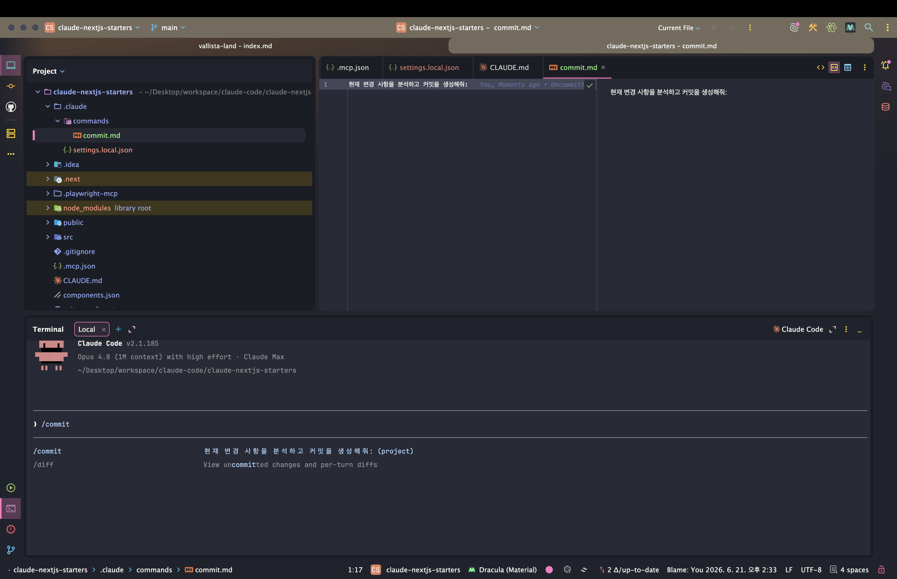

> 해당 포스팅은 [클로드 코드 완벽 마스터: AI 개발 워크플로우 기초부터 실전까지](https://inf.run/vN55k)를 참조하여 작성하였습니다.


## ⌨️ 커스텀 커맨드: Git 커밋 하기

[슬래시 명령어 챕터](/claude-code-슬래시-명령어와-단축키)에서 `/init`·`/help` 같은 *기본 명령* 을 봤다. 그런데 — *매번 똑같이 치는 프롬프트* 가 있다면? *"변경사항 분석해서
커밋해줘"*
같은 걸 *그때그때* 타이핑하긴 손이 아프다. 이걸 **나만의 슬래시 명령** 으로 박제하는 게 **커스텀 커맨드** 다.

> 자주 사용하는 프롬프트를 **Markdown 파일로 정의** 해두면, Claude Code에서 *슬래시 하나로* 쉽게 실행할 수 있어요.

### 커스텀 커맨드란 — 프롬프트를 '.md'로 박제

원리는 *간단* 하다. *자주 쓰는 프롬프트* 를 **마크다운 (`.md`) 파일** 하나에 적어두면, 그 **파일 이름** 이 *슬래시 명령* 이 된다.

> Markdown은 *일반 텍스트에 특수 기호* 를 써서 서식을 표현하는 **경량 마크업 언어** 예요. `#` 으로 제목, `-` 로 리스트를 표현하죠.

특별한 문법이랄 게 없다. *평소 클로드에게 부탁하던 말* 을 *그대로* 적으면 된다.

### 만들기 — `.claude/commands/commit.md`

커스텀 커맨드는 [프로젝트의 `.claude` 디렉터리](/claude-code-설정-파일과-메모리-관리) 아래 **`commands/`** 폴더에 둔다. *파일 이름* 이 곧 *명령 이름* 이다.

```text
.claude/
└── commands/
    └── commit.md     ←  /commit 명령이 된다
```

`commit.md` 안에는 *커밋할 때 늘 하던 부탁* 을 적는다.

```markdown
현재 변경사항을 분석해서, 의미 있는 단위로 Git 커밋을 생성해줘. 커밋 메시지는 한글로 작성해줘.
```

이게 전부다. *마크다운 한 장* 이 **`/commit`** 명령으로 *변신* 한다.

### 실행 — `/commit`

이제 코드를 좀 바꿔보자. 예를 들어 [앞서 만든 스타터 킷](/claude-code-starter-kit-만들기-공식문서)에서 *예제 페이지* 를 지운 뒤, 명령을 친다.

```bash
/commit
```

그러면 클로드가 *`commit.md` 에 적힌 프롬프트대로* — **변경사항을 분석** 하고, **커밋 메시지를 지어** 커밋을 만든다.

> 보시는 것처럼 *변경된 사항* 이 **커밋 완료** 된 걸 확인할 수 있어요.

[의미 있는 단위로 커밋하던 습관](/claude-code-starter-kit-만들기-공식문서)을, 이제 *명령 한 줄* 로 *반복* 할 수 있게 된 셈이다.



### 프로젝트 vs 전역 명령어

방금 만든 건 **프로젝트 명령어** 다. *그 프로젝트 안* 에서만 동작한다. *어디에 두느냐* 에 따라 범위가 갈리는데 — [설정·메모리의 레벨 구분](/claude-code-설정-파일과-메모리-관리)과
*판박이* 다.

| 종류                | 위치                          | 범위                 | Git     |
|---------------------|-------------------------------|----------------------|---------|
| **프로젝트 명령어** | 프로젝트의 `.claude/commands` | *그 프로젝트* 에서만 | 공유 ✅ |
| **전역 명령어**     | `~/.claude/commands`          | *내 모든 프로젝트*   | 공유 ❌ |

**프로젝트 명령어** 는 *Git에 커밋* 되니 *팀원과 공유* 된다. 반면 **전역 명령어** 는 *홈 디렉터리* 에 두어 *모든 프로젝트* 에서 쓰지만, *Git 관리가 안 돼* 팀원과는 *공유되지 않는다.*
*나만의 범용 명령* 은 전역에, *팀 공통* 명령은 프로젝트에 두면 된다.

### 네임스페이스 — `/git commit`

명령이 *많아지면* 정리가 필요하다. 이때 **네임스페이스** 를 쓴다. `commands/` 아래에 *디렉터리* 를 만들면, 그 **폴더 이름** 이 *네임스페이스* 가 된다.

```text
.claude/
└── commands/
    └── git/
        └── commit.md     ←  /git commit 으로 실행
```

`commit.md` 를 **`git/`** 폴더로 옮기면, 이제 **`/git commit`** 으로 실행된다.

```bash
/git commit
```

> 변경한 코드는 *꼭 테스트* 한 뒤 커밋하세요.

이렇게 *주제별로* 묶으면 **명령어 충돌을 막고** *체계적으로* 관리할 수 있다. *Git 관련* 명령은 `git/` 아래, *배포 관련* 은 `deploy/` 아래 — 이런 식이다.

### 정리하며

커스텀 커맨드 (Git 커밋)를 정리하면 다음과 같다.

- **커스텀 커맨드** = *자주 쓰는 프롬프트* 를 **`.md` 파일** 로 박제한 *나만의 슬래시 명령*
- **만들기** → `.claude/commands/<이름>.md` → 파일명이 곧 **`/<이름>`**
- **실행** → `/commit` → *변경사항 분석 → 커밋* 자동
- **범위** → **프로젝트**(`.claude/commands`, Git 공유) vs **전역**(`~/.claude/commands`, 미공유)
- **네임스페이스** → `commands/git/commit.md` → **`/git commit`** (충돌 방지·체계적 관리)

자주 반복하는 *프롬프트* 일수록 **커스텀 커맨드** 로 만들어두면, *손가락이 편해지고* 워크플로우도 *일관* 된다. 다음 챕터에서는 한발 더 나아가, **동적 파라미터** 로 *입력값을 받는* — 더 강력한
커스텀 커맨드를 만들어보자.

## ⚙️ 커스텀 커맨드 고급: 동적 파라미터

[앞 챕터](#️-커스텀-커맨드-git-커밋-하기)의 `/commit` 은 *늘 똑같은 프롬프트* 였다. 그런데 *상황마다 값이 바뀐다면?* — 예를 들어 *커밋 메시지* 를 매번 다르게 넣고 싶다면? 이때 필요한
게 **동적 파라미터** 다. *입력값을 받는* 커스텀 커맨드를 만들어보자.

> 명령어에 *동적인 값* 을 전달하는 방법은 **매우 간단** 해요.

### `$arguments` — 입력 전체를 받기

가장 쉬운 방법은 **`$arguments`** 키워드다. *명령어 뒤에 오는 모든 텍스트* 를 *하나의 인자* 로 받아, 그 자리에 *그대로 치환* 한다.

`git/commit.md` 를 이렇게 고쳐보자.

```markdown
현재 변경사항을 분석해서 커밋해줘. 커밋 메시지: $arguments
```

그러면 명령에 *값을 붙여* 실행할 수 있다.

```bash
/git commit 로그인 기능 완료
```

이때 **`$arguments`** 는 *"로그인 기능 완료"* 로 *치환* 되어 커밋 메시지로 쓰인다. *고정 프롬프트* 가 **입력을 받는 명령** 으로 진화한 것이다.

### `$1`, `$2` — 인자를 따로따로

값을 *여러 개* — 그것도 *개별적으로* 받고 싶다면 **`$1`, `$2`, `$3`** 처럼 *숫자 인덱스* 를 쓴다. 명령어 뒤 값을 **띄어쓰기로 구분** 하면, *순서대로* 매핑된다.

예를 들어 *PR 리뷰* 명령 (`reviewpr.md`)을 만든다면 —

```markdown
PR #$1 을 리뷰해줘. 중점 항목: $2, 난이도: $3
```

```bash
/reviewpr 42 보안 high
```

이러면 `$1`=`42`, `$2`=`보안`, `$3`=`high` 로 각각 들어간다. *입력의 자리* 를 *콕 집어* 쓸 수 있어, **구조화된 명령** 에 어울린다.

| 방식             | 받는 값                    | 어울리는 경우             |
|------------------|----------------------------|---------------------------|
| **`$arguments`** | 뒤 텍스트 *전체* 를 하나로 | 자유로운 *한 덩어리* 입력 |
| **`$1` `$2` …**  | *띄어쓰기로 나눠* 개별로   | *여러 값* 을 자리별로     |

### Front Matter — 명령어에 '명찰' 달기

마크다운 *맨 위* 에 **Front Matter**(YAML 메타데이터)를 달면, 명령어에 *부가 정보* 를 입힐 수 있다. [`CLAUDE.md` 의 프론트매터](/claude-code-설정-파일과-메모리-관리)
와 같은 문법이다.

```markdown
---
description: 변경사항을 분석해 커밋합니다
argument-hint: <커밋 메시지>
allowed-tools: Bash
model: claude-sonnet-4-6
---

현재 변경사항을 분석해서 커밋해줘. 커밋 메시지: $arguments
```

각 필드가 하는 일은 다음과 같다.

| 필드                | 역할                                                            |
|---------------------|-----------------------------------------------------------------|
| **`description`**   | 명령어 *설명* — 검색·자동완성에 표시                            |
| **`argument-hint`** | *어떤 인자* 를 받는지 **힌트**                                  |
| **`allowed-tools`** | 이 명령이 쓸 수 있는 *도구* (예: `Bash`)                        |
| **`model`**         | 이 명령에 쓸 [*모델 지정*](/claude-code-슬래시-명령어와-단축키) |

이렇게 *명찰* 을 달아두면, 명령을 *고를 때* 무슨 일을 하는지 한눈에 보이고, *실행 환경* 까지 명령마다 *제어* 할 수 있다.

### 한 스푼 더 — `@`참조 · `think` · Conventional Commits

커스텀 커맨드 *본문* 엔 *클로드에게 쓰던 기법* 을 그대로 녹일 수 있다.

- **`@` 참조** — *다른 파일·디렉터리* 를 끌어와 참조 (예: `@README.md`)
- **[`think` 키워드](/claude-code-클로드-코드-권한)** — *확장 사고 모드* 로 더 깊이 생각하게

강의는 이를 응용해, **Conventional Commits** 규칙으로 *잘 포맷된 커밋 메시지* 를 만드는 커맨드를 소개한다.

> **Conventional Commits** 는 커밋 메시지를 *일관성 있고 구조화* 해 작성하는 **국제 표준** 으로, 구글·페이스북 같은 대기업도 쓰는 규칙이에요.

`feat`(기능 추가)·`fix`(버그 수정) 같은 **타입** 을 붙이고, *이모지* 를 더하며, *스테이지된 파일만* 커밋하거나 *여러 변경* 을 분석해 **분할 커밋을 제안** 하는 — *똑똑한* 커밋 명령을
만들 수 있다.

```markdown
---
description: Conventional Commits 규칙으로 커밋합니다
allowed-tools: Bash
---

스테이지된 변경만 분석해서, Conventional Commits 형식으로 커밋해줘.

- 타입: feat / fix / docs / refactor 등 + 이모지
- 변경이 여러 성격이면 **분할 커밋** 을 제안할 것
```

### Custom Commands vs `CLAUDE.md`

마지막으로 *역할 분담* 을 짚자. **자주 쓰는 프롬프트** 와 **클로드가 늘 기억할 지침** 은 *둘 곳이 다르다.*

| 무엇을                    | 어디에                                                         |
|---------------------------|----------------------------------------------------------------|
| *자주 실행* 하는 프롬프트 | **Custom Commands**(`.claude/commands`)                        |
| 클로드가 *늘 지킬* 지침   | [**`CLAUDE.md`** 메모리](/claude-code-설정-파일과-메모리-관리) |

> 프로젝트를 진행하다 *같은 프롬프트를 반복* 한다고 느껴지면, **Custom Command로 추가** 하며 *계속 개선* 해 나가는 게 중요해요.

[손가락이 아플 때 `CLAUDE.md` 에 적던 것](/claude-code-설정-파일과-메모리-관리)처럼, *반복되는 명령* 은 **커스텀 커맨드** 로 쌓아간다. *쓰면서 다듬는* 게 핵심이다.

### 정리하며

동적 파라미터와 Front Matter를 정리하면 다음과 같다.

- **`$arguments`** → 명령어 뒤 *텍스트 전체* 를 하나로 받아 치환
- **`$1` `$2` …** → *띄어쓰기로 나눈* 값을 *자리별로* 받기
- **Front Matter** → `description`·`argument-hint`·`allowed-tools`·`model` 로 *명령에 명찰*
- **본문 기법** → `@`파일 참조 · [`think`](/claude-code-클로드-코드-권한) · **Conventional Commits**(`feat`/`fix`+이모지)
- **역할 분담** → *반복 프롬프트* = Custom Command, *늘 지킬 지침* = [`CLAUDE.md`](/claude-code-설정-파일과-메모리-관리)

이렇게 **동적 파라미터** 까지 더하면, 커스텀 커맨드는 *단순 단축* 을 넘어 **재사용 가능한 작은 도구** 가 된다. *반복* 이 보일 때마다 하나씩 만들어 쌓으면, 클로드 코드와의 워크플로우가 *점점 더
매끄러워질*
것이다.
