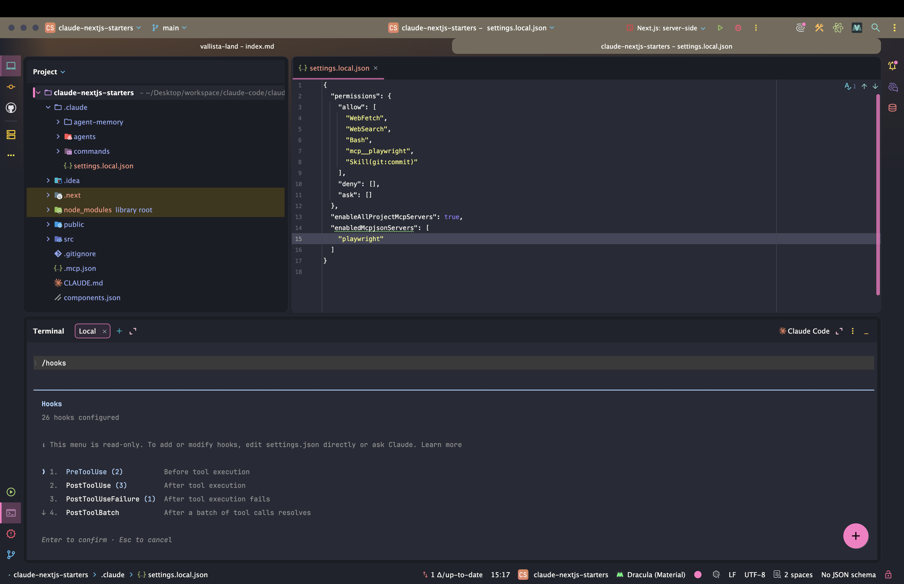
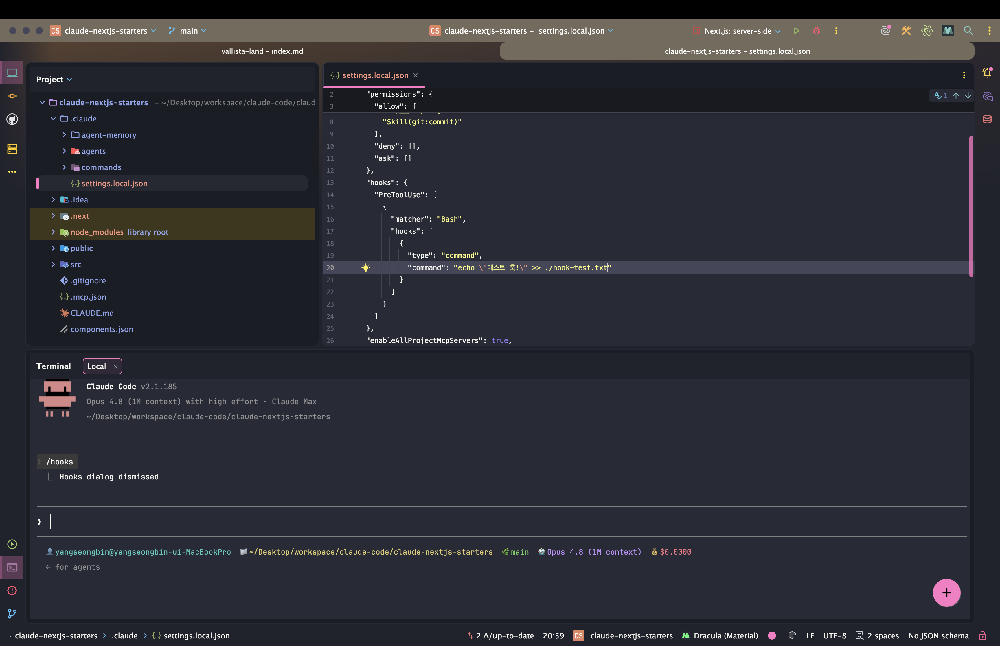

> 해당 포스팅은 [클로드 코드 완벽 마스터: AI 개발 워크플로우 기초부터 실전까지](https://inf.run/vN55k)를 참조하여 작성하였습니다.


## 훅(hooks)이란 무엇인가?

같은 일을 시켰는데 *어떨 땐 테스트를 돌리고*, *어떨 땐 그냥 넘어간다.* 클로드 코드를 쓰다 보면 한 번쯤 겪는 일이다.

> 여러분, 혹시 이런 경험 있으신가요? 버그를 고쳐달라고 했는데, *어떤 날은 테스트까지 돌려주고* 어떤 날은 그냥 넘어가는 거예요.

왜 이럴까. **LLM의 확률적 특성** 때문이다.

> 말 그대로 *AI가 결과를 선택할 때 확률을 기반으로 선택하는* 거예요.

그래서 *결과가 매번 똑같지 않다.* 한데 **우리가 개발하는 환경에선 일관성이 정말 중요하다.** *코드 포맷팅*, *민감 파일 보호*, *로그 기록* — 이런 건 *기분 따라* 됐다 안 됐다 하면 곤란하다. 바로
이 문제를 풀어주는 게 **훅(hooks)** 이다.

### 훅이란 — '정해진 지점'에서 반드시 실행되는 명령어

**클로드 코드 훅** 은 개발 과정의 *다양한 지점* 에서 실행되는 **사용자 정의 셸 명령어** 다.

*프롬프트를 제출할 때*, *작업이 끝났을 때*, *도구를 쓰기 직전·직후* — 이런 **특정 시점** 에 *내가 정한 명령어* 를 **반드시** 실행하도록 걸어두는 것이다. 클로드의 *판단(확률)* 에 맡기지
않고, **규칙으로 못 박는다** 는 게 핵심이다.

서브 에이전트가 *"전문가에게 나눠 맡기는"* 발상이었다면, 훅은 *"이 시점엔 무조건 이걸 해라"* 는 **결정론적 장치** 다.

### 무엇에 쓰나 — 5가지 사용 사례

훅이 빛나는 대표적인 장면은 다음과 같다.

| 사용 사례         | 설명                                                  |
|---------------|-----------------------------------------------------|
| **알림 시스템**    | 작업 완료·권한 요청 시 *데스크톱/모바일 알림* → 놓치지 않고 **효율적인 업무 전환** |
| **자동 포맷팅**    | 클로드가 고친 코드를 *팀 컨벤션에 맞춰* 자동 정리 → **일관된 스타일** 유지      |
| **로그 기록**     | *어떤 명령어가 언제 실행됐는지* 자동 기록 → 문제 발생 시 **원인 추적** 수월     |
| **피드백 활용**    | 코드베이스 규칙을 *어긴 코드* 를 생성하면 **자동 피드백** 제공              |
| **사용자 정의 권한** | *민감한 파일·디렉터리* 에 대한 접근·수정 **차단** → 프로젝트 보안 강화        |

특히 **사용자 정의 권한** 은 [클로드 코드 권한](/claude-code-클로드-코드-권한)과 맞물려, *건드리면 안 되는 파일* 을 **아예 막아버리는** 안전장치가 된다.

### 훅 이벤트 — '언제' 실행할지 고르기

훅의 절반은 **이벤트** 선택이다. *어느 시점에* 명령어를 끼워 넣을지 정하는 것이다.



| 이벤트                             | 실행 시점                                             |
|---------------------------------|---------------------------------------------------|
| **`PreToolUse`**                | *특정 도구*(Bash, 파일 편집, 웹 검색 등) **호출 전**             |
| **`PostToolUse`**               | 도구 **호출 후**                                       |
| **`UserPromptSubmit`**          | 사용자가 *프롬프트를 제출*(엔터)할 때 — 클로드가 처리하기 **전**          |
| **`Notification`**              | 클로드가 *알림을 보낼 때* (입력 대기·권한 필요 시)                   |
| **`Stop`**                      | 클로드가 *응답을 완료* 할 때 → **자동 커밋·백업** 에 활용 (ESC 중단 제외) |
| **`SubagentStop`**              | [서브 에이전트](/claude-code-클로드-코드-고급-서브-에이전트) 작업 완료 시 |
| **`PreCompact`**                | 대화 압축 시 또는 `/compact` 실행 시                        |
| **`SessionStart`/`SessionEnd`** | 세션 *시작·재개·종료* 시                                   |

이 중 자주 쓰는 건 **`PreToolUse`**(도구 쓰기 전 검사·차단), **`PostToolUse`**(수정 후 포맷팅), **`Stop`**(끝나면 알림·커밋)이다.

### 어떻게 등록하나 — `settings.json`

> ⚠️ **등록 방법이 바뀌었습니다.** 예전엔 `/hooks` CLI 명령으로 훅을 *등록* 했지만, 지금은 **확인 전용** 으로 바뀌었다. 등록은 아래 두 방식으로 한다.

훅을 거는 길은 두 가지다.

1. **`settings.json` 직접 편집** — 설정 파일에 *이벤트·매처·커맨드* 를 직접 적는다.
2. **클로드에게 요청** — *"이런 훅을 걸어줘"* 라고 말하면 클로드가 `settings.json` 을 대신 수정한다.



저장 위치는 [`.claude` 디렉터리](/claude-code-설정-파일과-메모리-관리)와 같은 규칙을 따른다 — *프로젝트별* 적용은 프로젝트 `.claude/settings.json`, *모든 프로젝트*
적용은 사용자 홈 디렉터리 설정이다.

훅 하나는 **세 조각** 으로 이뤄진다.

| 구성               | 역할                                    |
|------------------|---------------------------------------|
| **이벤트(Event)**   | *언제* 실행할지 (예: `PreToolUse`)           |
| **매처(Matcher)**  | *어떤 도구* 에 걸지 (예: `Bash`, `WebSearch`) |
| **커맨드(Command)** | *무엇을* 실행할지 (실제 셸 명령어)                 |

### 직접 확인해보기 — `PreToolUse` + Bash

강의에선 *"Bash 도구를 쓰기 직전, 파일에 한 줄 남기는"* 훅을 건다.

```json
{
  "hooks": {
    "PreToolUse": [
      {
        "matcher": "Bash",
        "hooks": [
          {
            "type": "command",
            "command": "echo '테스트 훅!' >> hook-test.txt"
          }
        ]
      }
    ]
  }
}
```

이제 클로드에게 `ls` 같은 *Bash 명령* 을 시키면, **도구가 실행되기 전에** 훅이 먼저 돌아 `hook-test.txt` 에 `테스트 훅!` 이 쌓인다. 재미있는 점 하나.

> 클로드 코드가 *Bash 도구를 세 번 사용했다면*, 그 스크립트도 **세 번 실행** 돼요.

즉 훅은 *"한 요청당 한 번"* 이 아니라, **도구를 쓰는 그 횟수만큼** 정확히 따라붙는다. 이게 *확률이 아닌 규칙* 으로 동작한다는 증거다.

### 정리하며

훅의 기본 개념을 정리하면 다음과 같다.

- **훅** = *특정 시점* 에 **반드시 실행** 되는 사용자 정의 셸 명령어
- **왜?** → [LLM은 *확률적*](/claude-code-모던-기술스택과-개발-워크플로우)이라 결과가 들쭉날쭉 → 훅으로 **일관성** 을 못 박는다
- **사용 사례** → *알림* · *자동 포맷팅* · *로그* · *피드백* · **권한 차단**
- **이벤트** → `PreToolUse` · `PostToolUse` · `Stop` 등 — *언제* 실행할지
- **구성** → **이벤트 + 매처 + 커맨드** 세 조각
- **등록** → `/hooks`(확인 전용)가 아니라 → [`settings.json` 직접 편집](/claude-code-설정-파일과-메모리-관리) 또는 *클로드에게 요청*

훅의 본질은 *"클로드의 판단에 맡기지 말고, 규칙으로 정해두라"* 는 발상이다. 다음 챕터에서는 이 훅을 **실무에서 유용하게** 직접 만들어보며, *언제·어떻게* 써야 효과적인지 살펴보자.

## 훅(hooks) 활용: 슬랙 알림 추가하기

[앞 챕터](#훅hooks이란-무엇인가)에서 *훅이 무엇인지* 봤다면, 이번엔 **실무에서 가장 먼저 쓰게 되는** 훅을 만들어본다 — **슬랙(Slack) 알림** 이다.

복잡한 작업을 시켜두면, 클로드는 *한참* 일한다. 그 사이 우리는?

> 이때 마냥 기다릴 수 없어서 *커피를 한 잔* 한다거나, *다른 업무* 를 보시는 분들이 계실 거예요.

그러다 *권한 승인 요청* 이 떠도 모르고, *작업이 끝난 줄* 도 모르고 시간을 흘려보낸다. **자리에 없어도** 알림을 받을 수 있다면? 그게 이번 챕터의 목표다.

### 그림 — 클로드 코드 → 슬랙 웹훅 → 모바일

슬랙은 *카카오톡* 같은 **팀 협업 메시징** 플랫폼이다. *데스크톱·모바일 앱* 을 모두 제공한다는 게 핵심이다. 우리가 만들 흐름은 이렇다.

```text
[클로드 코드 훅 이벤트] → [슬랙 Incoming Webhook] → [슬랙 채널 → 내 휴대폰 알림]
```

여기서 **슬랙 웹훅(Incoming Webhook)** 은 *외부에서 슬랙으로 메시지를 보내게* 해주는 통로다. [훅 이벤트](#훅hooks이란-무엇인가)가 발생하는 순간, 이 웹훅으로 메시지를 쏘면 **내 휴대폰
** 으로 알림이 떨어진다.

### 어떤 이벤트에 걸까 — `Notification` & `Stop`

여기서 *이벤트 선택* 이 중요하다. 강의에서도 클로드에게 설정을 맡겼더니, 처음엔 엉뚱하게 `PreToolUse`·`PostToolUse` 를 제안했다.

> 클로드 코드가 *환각을 일으키고* 있죠.

목적에 맞는 건 따로 있다. **컨텍스트를 보강해** 다시 계획을 세우게 한 결과는 이렇다.

| 이벤트                | 언제 알림이 오나                         |
|--------------------|-----------------------------------|
| **`Notification`** | *권한 승인 요청* 등 클로드가 **내 입력을 기다릴 때** |
| **`Stop`**         | 클로드가 *응답을 완료* — **작업이 끝났을 때**     |

*도구를 쓸 때마다*(`PreToolUse`) 알림이 오면 폭탄이다. 우리가 원하는 건 *"나를 기다릴 때"* 와 *"다 끝났을 때"* 딱 두 순간이니, **`Notification` + `Stop`** 조합이
정답이다. 이게 [이벤트를 제대로 고르는](#훅-이벤트--언제-실행할지-고르기) 감각이다.

### 준비 ① 슬랙 웹훅 URL 발급

먼저 알림을 받을 통로부터 연다. 강의 흐름을 따라가면 이렇다.

1. 슬랙 공식 홈페이지에서 *회원가입·로그인*
2. **새 워크스페이스 개설** — *알림 전용* 으로 하나 판다
3. 워크스페이스에 **`Claude Code` 채널** 추가
4. 앱 추가 메뉴에서 **`Incoming Webhook`** 검색 → 설치
5. *알림을 받을 채널*(`Claude Code`)을 고르면 → **Webhook URL** 발급

발급된 URL이 잘 동작하는지는 **`curl`** 한 줄로 바로 테스트할 수 있다.

```bash
curl -X POST -H 'Content-type: application/json' \
  --data '{"text":"슬랙 웹훅 테스트!"}' \
  "$SLACK_WEBHOOK_URL"
```

슬랙 `Claude Code` 채널에 *"슬랙 웹훅 테스트!"* 가 뜨면 성공이다.

### 준비 ② `.env` 에 URL 보관

이 Webhook URL은 *외부에 노출되면 안 되는* 값이다. 그래서 **코드에 직접 박지 않고** [환경 변수](/claude-code-설정-파일과-메모리-관리)로 뺀다.

```bash
# .env
SLACK_WEBHOOK_URL=https://hooks.slack.com/services/...
```

> 해당 Webhook URL을 복사를 하고요, 우리 프로젝트에 와서 *`.env` 파일* 에 이렇게 설정을 하도록 할게요.

URL이 바뀌어도 *코드는 그대로*, `.env` 만 고치면 된다. **민감 정보 관리** 의 기본기다.

### 훅 등록 — 클로드에게 맡기기

이제 [훅을 등록](#어떻게-등록하나--settingsjson)할 차례다. 강의는 *직접 JSON을 짜는 대신* 클로드에게 요청하는 방식을 택한다.

```text
클로드 코드 훅과 슬랙 웹훅을 사용해서,
권한 요청(Notification)과 작업 완료(Stop) 시점에
모바일 슬랙 앱으로 알림을 받도록 설정해줘.
Webhook URL은 .env의 SLACK_WEBHOOK_URL 환경 변수로 관리해줘.
```

이렇게 *이벤트(Notification·Stop)* 와 *환경 변수 관리* 까지 **컨텍스트를 명확히** 주면, 클로드가 ① 환경 변수 로딩, ② 훅 스크립트 생성, ③ `settings.json` 이벤트 설정을 한
번에 잡아준다.

### 동작 확인 — 그리고 자주 만나는 버그

설정 후 `test.txt` 를 만들어달라고 시켜보면 흐름이 보인다.

- *권한 요청* 이 뜨는 순간 → **`Notification` 훅** 실행 → 슬랙 알림 📩
- 작업이 끝나는 순간 → **`Stop` 훅** 실행 → *완료 알림* 📩

다만 강의에선 **상태 메시지가 비어서 오는** 버그를 만난다. 원인은 의외로 단순했다.

> 소스 코드를 분석해 보니, **`jq` 명령어가 설치돼 있지 않아** 메시지 파싱이 안 됐던 거예요.

훅 스크립트가 클로드의 JSON 입력을 [`jq`](/claude-code-클로드-코드-고급-커스텀-커맨드)로 파싱하는데, *그 도구가 없으니* 값이 빈 채로 전송된 것이다. 강의에선 우선 *해당 메시지 출력만
제거* 하는 식으로 넘어간다. (이 **`jq` 로 입력 데이터를 다루는** 이야기는 다음 챕터의 핵심이다.)

### ⚠️ 알림이 안 온다면 — 데스크톱 앱을 끄자

마지막 함정 하나. *모바일 앱* 을 깔았는데 알림이 안 울린다면, 십중팔구 이것이다.

> **데스크톱 알림이 켜져 있으면**, 모바일 앱 알림이 *울리지 않을 수 있어요.*

슬랙은 *어느 한 곳에서 보고 있으면* 다른 기기로 굳이 알리지 않는다. 그러니 **모바일 알림을 테스트할 땐** 데스크톱 슬랙 앱을 *완전히 종료* 하고 확인하자. (물론 슬랙 알림 설정 자체가 *켜져 있는지* 도
점검.)

### 정리하며

슬랙 알림 훅을 정리하면 다음과 같다.

- **왜?** → 복잡한 작업은 오래 걸린다 → *자리에 없어도* **권한 요청·완료** 를 놓치지 않기
- **그림** → 훅 이벤트 → **슬랙 Incoming Webhook** → 모바일 알림
- **이벤트** → *권한 대기* 는 **`Notification`**, *작업 완료* 는 **`Stop`** (`PreToolUse`는 과함)
- **준비** → 워크스페이스·채널 → Incoming Webhook 발급 → `curl` 테스트 → [`.env`](/claude-code-설정-파일과-메모리-관리)에 보관
- **등록** → *이벤트·환경 변수* 컨텍스트를 명확히 줘서 [클로드에게 요청](#어떻게-등록하나--settingsjson)
- **함정** → `jq` 미설치(메시지 빈값) · **데스크톱 앱 켜져 있으면** 모바일 알림 안 옴

이제 *커피를 마시러 가도*, 클로드가 *나를 부르는 순간* 휴대폰이 울린다. 다음 챕터에서는 방금 잠깐 등장한 **`jq`** 로 — 클로드가 훅에 넘겨주는 **입력(Input) 데이터** 를 *제대로 다뤄*
알림을 더 똑똑하게 만들어보자.

## 훅(hooks) 고급: 클로드로부터 받은 Input 데이터 활용

[슬랙 챕터](#훅hooks-활용-슬랙-알림-추가하기) 막바지에서 *메시지가 비어서 오던* 버그, 기억나는가. 범인은 **`jq` 미설치** 였다. 이번엔 그 `jq` 를 제대로 들여, 클로드가 훅에 **넘겨주는
데이터** 를 직접 다뤄본다.

> 훅 이벤트가 실행될 때, **클로드는 특정 데이터를 JSON 형식으로 전달** 해요. 이렇게 *전달된 입력 데이터* 를 활용하면 더 **커스텀화된 작업** 을 할 수 있죠.

즉 훅은 *"그냥 실행"* 에서 끝나지 않는다. **"무슨 일이 일어났는지"** 를 받아서, *상황에 맞는* 동작까지 할 수 있다.

### 클로드가 건네주는 JSON — Input 데이터

[훅 이벤트](#훅-이벤트--언제-실행할지-고르기)가 발생하면, 클로드는 훅 스크립트에 **JSON 한 덩어리** 를 표준 입력으로 흘려준다. 여기엔 *모든 이벤트 공통 데이터* 와 *이벤트별 고유 데이터* 가 섞여
있다.

| 데이터                   | 성격            | 예시 이벤트             |
|-----------------------|---------------|--------------------|
| **`hook_event_name`** | *공통* — 어떤 훅인지 | 모든 이벤트             |
| **`message`**         | *고유* — 알림 내용  | **`Notification`** |

> 어떤 데이터가 오는지는 **공식 문서의 훅 메뉴** 에서 확인할 수 있어요. *공통 데이터* 와 *이벤트별 데이터* 가 정리돼 있죠.

핵심은 *"이벤트마다 주는 데이터가 다르다"* 는 것. 그래서 **쓰기 전에 문서로 확인** 하는 습관이 중요하다.

### 준비물 — `jq` 설치

받은 JSON에서 *원하는 값만 뽑으려면* **`jq`** 가 필요하다. *JSON 전용 커맨드라인 파서* 다.

| OS          | 설치 방법                                                        |
|-------------|--------------------------------------------------------------|
| **macOS**   | [Homebrew](/claude-code-개발환경-및-클로드-코드-설치)로 `brew install jq` |
| **Windows** | Chocolatey로 `choco install jq`(관리자 PowerShell)               |

설치가 끝났는지는 한 줄로 확인한다.

```bash
jq --version
```

### `Notification` 훅 — `message` 뽑아내기

이제 [슬랙 챕터](#훅hooks-활용-슬랙-알림-추가하기)에서 비어 있던 *상태 메시지* 를 채워보자. `Notification` 훅 스크립트에서, 클로드가 준 JSON의 **`.message`** 를 꺼내 변수에
담는다.

```bash
# 표준 입력(JSON)을 받아 .message 값만 추출
message=$(jq -r '.message')
```

여기서 **`$(...)`** 는 *명령의 출력을 변수에 담는* 셸 문법이고, **`jq -r '.message'`** 는 JSON에서 `message` 필드를 *따옴표 없이* 읽어온다. 이 `message` 를
슬랙 페이로드에 끼워 보내면 — 비어 있던 알림에 **상태 메시지가 또렷이** 찍힌다.

### `Stop` 훅 — 없는 필드를 읽으려다 (`reason` → `hook_event_name`)

강의는 여기서 *흔한 실수* 를 보여준다. `Stop` 훅에서 **`reason`** 이라는 값을 읽으려 한 것.

> 그런데 `Stop` 훅의 입력값에도, 공통 데이터에도 **`reason` 같은 건 없어요.**

문서에 없는 필드를 `jq` 로 뽑으니 *당연히 빈값* 이다. 그래서 **실제로 존재하는** 공통 데이터인 `hook_event_name` 으로 바꾼다.

```bash
# Stop 훅: 존재하는 공통 필드를 사용
event=$(jq -r '.hook_event_name')
```

이제 [accept-edits 모드](/claude-code-클로드-코드-권한)로 `test.txt` 를 만들게 하면, 작업이 끝나는 순간 슬랙에 **`Stop`**(= `hook_event_name`)이 또렷이
찍힌다. 교훈은 단순하다 — **있는 필드만 읽어라.** 그리고 그건 *문서가 알려준다.*

### 너무 깊이 파지 않아도 된다 — 강사의 조언

마지막으로, 강사가 *힘을 빼주는* 말을 남긴다.

> 자주 사용 안 하는 스펙은 *저도 잊어버려요.* 그때그때 *필요할 때 다시 공식 문서* 를 보고 진행하죠.

훅의 깊은 활용은 **필요한 사람만** 파면 된다. 지금 당장 쓸 일이 없다면, *"훅은 공통·고유 데이터를 JSON으로 건네준다"* 는 **사실만 기억** 해두고, *나중에 필요할 때* 문서를 펴고 다시 실습하면
충분하다.

### 정리하며

훅 Input 데이터 활용을 정리하면 다음과 같다.

- **무엇** → 훅 실행 시 클로드가 **JSON 입력 데이터** 를 건넨다 (*공통* + *이벤트별 고유*)
- **도구** → JSON 파싱은 **`jq`** (`brew install jq` / `choco install jq`)
- **`Notification`** → `jq -r '.message'` 로 *알림 내용* 추출 → [슬랙 빈값 버그](#훅hooks-활용-슬랙-알림-추가하기) 해결
- **`Stop`** → 없는 `reason` 대신 *존재하는* **`hook_event_name`** 사용 — **있는 필드만 읽기**
- **문법** → **`$(...)`** 로 명령 출력을 변수에 담기
- **태도** → 깊은 스펙은 *필요할 때* **공식 문서** 로 — 외우려 애쓰지 말 것

훅의 본질을 한 줄로 줄이면 *"정해진 시점에, 받은 데이터로, 내가 정한 일을 한다"* 이다. [훅이 무엇인지](#훅hooks이란-무엇인가)에서 시작해 — [슬랙 알림](#훅hooks-활용-슬랙-알림-추가하기)으로
실용을 맛보고 — Input 데이터로 *커스텀* 까지 왔다. 이제 **확률에 흔들리지 않는** 나만의 워크플로우를, 훅으로 단단히 못 박을 차례다.
