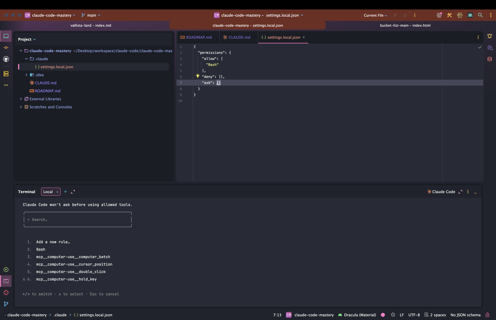
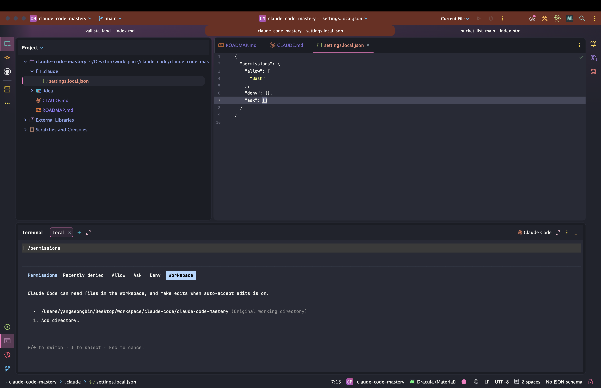
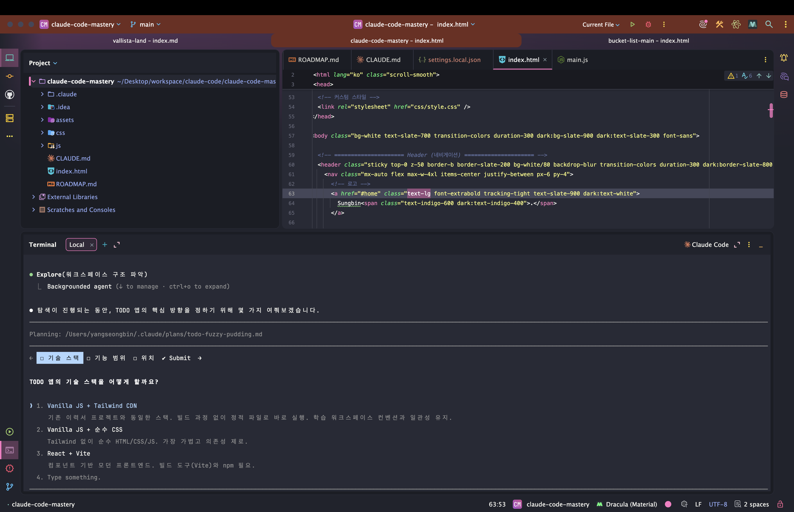

> 해당 포스팅은 [클로드 코드 완벽 마스터: AI 개발 워크플로우 기초부터 실전까지](https://inf.run/vN55k)를 참조하여 작성하였습니다.


## 🔐 권한 관리 (/permissions)

[지난 섹션](/claude-code-cursor-ai-ide-통합)에서 에디터와 클로드 코드를 *한 몸* 으로 묶었다. 이제 클로드 코드를 *더 안전하고 똑똑하게* 부리는 **권한 시스템** 으로
들어간다. 클로드 코드에게 일을 시키다 보면, *파일을 읽고·고치고·명령어를 실행* 하면서 **"이거 해도 될까요?"** 하고 묻는 장면을 수없이 만난다. 이 *승인 절차* 가 바로
권한 시스템이고, 잘 길들이면 작업이 한결 매끄러워진다.

### 왜 권한이 필요할까

클로드 코드는 코드를 *분석·계획·개발* 하기 위해 **여러 도구(Tool)** 를 쓴다. 우리가 개발할 때 *키보드·마우스·브라우저·IDE* 를 쓰듯, 클로드 코드도 **Bash(명령어 실행),
Edit(파일 수정), Read(읽기), Task, TodoWrite** 같은 도구를 동원한다.

그런데 이 도구들은 *위험도* 가 제각각이다. 파일을 *읽는 것* 과 `rm` 으로 파일을 *지우는 것* 은 차원이 다르다. 그래서 클로드 코드는 **도구의 위험도에 따라** 우리에게
*승인을 받을지 말지* 를 결정한다.

> 하나하나의 파일을 Claude Code가 읽을 때마다 우리에게 권한을 요청하면, *정말 번거롭지 않을까요?*

강사님은 이를 **회사에서 중요한 자산을 쓸 때 결재를 받는 것** 에 비유한다.

> 이처럼 Claude Code도 어떤 건 *허락 없이* 사용해도 되고, 어떤 건 *허락을 받고* 사용해 달라는 설정을 할 수 있는데요, 이게 바로 **Claude Code의 권한 시스템** 입니다.

즉, *덜 위험한 일은 알아서* 하게 두고, *위험한 일은 꼭 물어보게* 만드는 것. 이 균형을 잡는 게 권한 관리의 핵심이다.

### 세 계층 권한 — 무엇을 묻고 무엇을 안 묻나

클로드 코드는 효율적인 작업을 위해 **세 계층** 으로 권한을 나눠 다룬다. 핵심만 정리하면 이렇다.

| 분류         | 대표 도구                                 | 승인 필요?        |
|------------|---------------------------------------|---------------|
| **읽기 전용**  | `Read`(파일 읽기), `LS`, `Grep`           | ❌ *불필요* (알아서) |
| **변경·실행**  | `Edit`/`Write`(파일 수정), `Bash`(명령어 실행) | ✅ **승인 필요**   |
| **사용자 설정** | 위 규칙을 `/permissions` 로 *직접 조정*        | ⚙️ *내가 정함*    |

정리하면, *파일을 읽거나 검색* 하는 **읽기 전용** 작업은 굳이 묻지 않고 *바로* 한다. 하지만 *파일을 고치거나*(`Edit`) *터미널 명령어를 실행*(`Bash`)하는 것처럼 **실제로
무언가를 바꾸는** 작업은 *반드시 승인* 을 받는다. 이 기본 정책 위에, *내가 직접* 규칙을 더하거나 빼는 게 다음에 볼 `/permissions` 다.

> 💡 *Pro 요금제* 사용자는 토큰 소모가 크니, 이 챕터는 *먼저 눈으로 보고* 따라 하는 걸 권한다. (*Max 요금제* 라면 같이 실습해도 부담이 덜하다.)

### 매번 묻는 게 번거롭다면 — `/permissions`

작업을 하다 보면 *똑같은 종류의 승인* 을 *계속* 묻는 게 번거로워진다. 예를 들어 개발 서버를 띄우는 `npm run dev` 를 실행할 때마다 매번 *"실행해도 될까요?"* 라고 물으면
피곤하다. 이럴 때 쓰는 게 **`/permissions`** 명령어다.

```bash
/permissions    # 현재 권한 규칙 확인 및 추가·수정
```

이 명령어를 실행하면 *현재 허용된 권한 목록* 을 보고, **새 규칙(add new rule)** 을 더할 수 있다. 규칙은 크게 세 종류다.

| 규칙 종류          | 의미                       |
|----------------|--------------------------|
| **Allow (허용)** | 해당 도구·명령어를 *승인 없이* 자동 실행 |
| **Ask (질문)**   | 사용할 때마다 *매번 확인* 을 요청     |
| **Deny (거부)**  | 해당 도구·명령어를 *아예 금지*       |

예컨대 **Bash 도구의 `npm run dev`** 만 콕 집어 *Allow* 규칙으로 등록하면, 이후로는 *묻지 않고* 바로 실행된다. 반대로 *위험한 명령어* 는 **Deny** 로 막아둘 수 있다.
*도구별·명령어별로* 세밀하게 조정할 수 있는 게 핵심이다.

> ⚠️ 편하자고 *모든 것* 을 무턱대고 *Allow* 하면, 그만큼 *통제력* 을 잃는다. **자주 쓰고 안전한 것만** 허용하고, *파괴적인 명령어*(예: `rm -rf`)는 신중히 다루자.

### 권한은 어디에 저장될까 — `settings.local.json`

`/permissions` 로 정한 규칙은 *어딘가에 저장* 되어야 다음에도 유지된다. 클로드 코드는 이를 프로젝트 안의 **`.claude/settings.local.json`** 파일에 기록한다.

```json
// .claude/settings.local.json (예시)
{
  "permissions": {
    "allow": [
      "Bash(npm run dev)",
      "Bash(npm run build)"
    ],
    "deny": [
      "Bash(rm -rf *)"
    ]
  }
}
```

이렇게 *파일로 관리* 되니, 규칙을 직접 열어보거나 *팀원과 공유* 하기도 좋다. (`.local.json` 은 보통 *개인 설정* 이라 커밋에서 제외되곤 하니, 공유가 필요하면 프로젝트의
`.claude/settings.json` 을 쓰는 식으로 나눌 수 있다.)

### 작업이 끊겼을 때 — `--continue` 와 `/resume`

권한을 다루다 *실수로 거부* 했거나, *세션이 끊겼을* 때 이전 대화를 *이어가고* 싶을 수 있다. 클로드 코드는 두 가지 방법을 준다.

```bash
claude --continue    # 가장 최근 대화를 그대로 이어서 재개
```

```bash
/resume    # 이전 대화 목록에서 골라 재개 (클로드 코드 실행 중)
```

`--continue` 는 *직전 세션* 을 곧장 잇고, `/resume` 은 *여러 이전 대화 중에서 골라* 잇는다. 작업이 *날아갈까 봐* 걱정하지 않아도 되니, *마음 편히* 권한을 만져볼 수 있다.



### 한 걸음 더 — Workspace에 디렉터리 추가하기

클로드 코드는 기본적으로 *실행한 프로젝트 폴더 안* 에서만 움직인다. 그런데 *다른 폴더의 코드* 를 참고하고 싶을 때가 있다. 예를 들어 *상위 폴더의 `example` 디렉터리* 를
참고해 새 프로젝트를 짜는 경우다.

이럴 때 `/permissions` 의 **Workspace(작업 영역)** 설정에서 **추가 디렉터리** 를 등록하면, 클로드 코드가 *그 폴더까지* 읽고 참고할 수 있다. *다른 프로젝트의
코드베이스를 참고* 해 개발할 때 요긴하다.



### 정리하며

권한 관리를 정리하면 다음과 같다.

- 클로드 코드는 도구(`Bash`·`Edit`·`Read`…)를 쓰며, **위험도에 따라** 승인을 *물어볼지* 결정
- **세 계층** → *읽기 전용* 은 자동, *변경·실행* 은 승인 필요, 그 위에 *내가 규칙 추가*
- **`/permissions`** 로 *Allow / Ask / Deny* 규칙을 도구·명령어별로 세밀하게 설정
- 규칙은 **`.claude/settings.local.json`** 에 저장 → 확인·공유 용이
- 끊긴 작업은 **`--continue`**(직전) / **`/resume`**(골라서)로 재개
- **Workspace** 에 디렉터리를 추가하면 *프로젝트 밖 폴더* 도 참고 가능

처음엔 권한이 *낯설고 번거롭게* 느껴질 수 있다. 하지만 강사님 말처럼,

> 자주 사용하다 보면 익숙해지니, 이번 시간엔 **Claude Code의 행동을 내가 제어할 수 있구나** 라는 걸 인지하고 넘어가시면 됩니다.

핵심은 *"클로드 코드를 내가 통제한다"* 는 감각이다. 이 감각만 잡으면, 이후 작업에서 *안전과 편의* 사이의 균형을 자유롭게 조절할 수 있다.

## 🚦 권한 모드 (accept, plan): 프로필 웹 사이트 만들기

[앞 챕터](#-권한-관리-permissions)에서는 *도구·명령어별 개별 규칙* 을 다뤘다. 이번엔 한 단계 위, **권한 모드(Permission Mode)** 다. 개별 규칙이 *"이 명령어는
허용/거부"* 처럼 하나하나를 정하는 것이라면, 권한 모드는 클로드 코드의 **전반적인 행동 방식** 자체를 *통째로* 바꾼다.

> 권한 모드는 *정말 중요하기 때문에*, 이번 시간 **꼭 집중해서** 들으시는 걸 권장 드리고요.

### 네 가지 권한 모드

권한 모드는 *"클로드 코드가 기본적으로 어떻게 굴지"* 를 정하는 스위치다. 크게 네 가지가 있다.

| 모드                    | 행동 방식                                     |
|-----------------------|-------------------------------------------|
| **default** (기본)      | 도구를 쓸 때마다 *매번* 권한을 물어보는 표준 모드             |
| **accept edits**      | *파일 편집* 권한을 **자동 수락** → 개발 흐름이 끊기지 않음     |
| **plan** (계획)         | *쓰기 작업 없이* 분석·계획만 → 코드를 *건드리지 않고* 전략부터 세움 |
| **bypassPermissions** | *모든 권한을 무시* → **안전한 환경에서만** 신중히           |

이 중 실전에서 가장 자주 쓰는 둘이 **`accept edits`** 와 **`plan`** 이다.

### 모드 전환은 `Shift + Tab`

모드 전환은 클로드 코드 입력창에서 **`Shift + Tab`** 을 누르면 된다. 누를 때마다 *default → accept edits → plan → …* 순으로 *순환* 한다.

> 참고로 말씀드리면, **Windows** 에서 설치하신 분들은 **`Alt + M`** 을 눌러주시면 됩니다.

| OS          | 모드 전환 단축키       |
|-------------|-----------------|
| **macOS**   | `Shift` + `Tab` |
| **Windows** | `Alt` + `M`     |

지금 어떤 모드인지는 *입력창 주변에 표시* 되니, 전환하며 확인하면 된다.

### `accept edits` — 파일 편집을 자동 수락

개발을 하다 보면 *여러 파일* 을 만들고 고치게 되는데, 그때마다 *"이 파일 수정해도 될까요?"* 를 일일이 승인하는 건 *흐름을 끊는다.* **`accept edits`** 모드는
이 **파일 편집 승인을 자동** 으로 처리해, 개발이 *물 흐르듯* 이어지게 한다.

*"이제 본격적으로 코드를 짜자"* 싶을 때 켜두면, 클로드 코드가 파일을 *척척* 만들고 고친다. *번거로운 확인* 이 사라지니 속도가 확 붙는다. (대신 *무엇이 바뀌는지* 는 에디터에서
틈틈이 확인하자.)

### `plan` — "일단 계획부터"

강사님이 *가장 아낀다* 고 꼽는 모드가 바로 **`plan`(계획 모드)** 다.

> 이것보다 제가 *개인적으로 더 유용하고 더 중요하게* 사용하는 게 바로 **`plan` 모드** 입니다.

`plan` 모드에서는 클로드 코드가 **파일을 일절 수정하지 않는다.** 오직 *코드를 읽고 분석해서* **계획만** 세운다. 왜 이게 중요할까? 강사님의 *AI 택시* 비유가 절묘하다.

> 여러분, 우리가 **AI 택시** 를 탔다고 가정해볼게요.

무작정 *"출발!"* 을 외치기보다, *어디로, 어떤 경로로 갈지* 먼저 합의하는 게 *안전하고 빠르다.* 코드도 마찬가지다. 곧장 구현에 들어가면 *엉뚱한 방향* 으로 한참 갈 수 있지만,
`plan` 모드로 **계획을 먼저 검토** 하면 *내가 원하는 방향* 인지 확인한 뒤 출발할 수 있다.

흐름은 이렇다.

1. **`plan` 모드** 로 전환(`Shift+Tab`)하고, 만들고 싶은 걸 요청한다
2. 클로드 코드가 *코드를 분석* 해 **계획(plan)** 을 제시한다 (파일은 안 건드림)
3. 계획을 보고 *마음에 안 들면* **수정 요청** → 다시 계획을 다듬는다
4. 계획이 만족스러우면, **`accept edits`(1번)** 또는 *수동 승인(2번)* 을 골라 **실제 구현** 으로 넘어간다

즉, **`plan` 으로 설계 → `accept edits` 로 구현** 이라는 *2단 콤보* 가 핵심 워크플로우다.

### 실습 — 프로필 웹사이트 만들기

이 흐름을 *프로필(웹 이력서) 사이트* 를 만들며 직접 따라가 보자. (앞서 만든 `roadmap.md` 같은 *계획 문서* 가 있으면 더 좋다.)

1. **`plan` 모드** 로 전환한 뒤, 클로드 코드에게 요청한다

   ```text
   roadmap.md 를 참고해서, 나를 소개하는 웹 이력서 페이지를
   만들 계획을 세워줘.
   ```

2. 제시된 계획을 검토하고, *원하는 걸 더한다.* 예컨대 —

   ```text
   계획에 SNS 링크 섹션도 추가해줘.
   ```

   `plan` 모드라 *계획만* 다시 세워주니, *코드가 망가질 걱정 없이* 마음껏 다듬을 수 있다.

3. 계획이 흡족하면 **`accept edits`** 로 구현을 맡긴다. 그러면 파일 생성·편집을 *일일이 묻지 않고* 진행해, **Tailwind CSS** 기반의 `index.html` 같은 결과물이
   *뚝딱* 만들어진다.

4. [앞 섹션에서 익힌](/claude-code-cursor-ai-ide-통합) **WebStorm 내장 미리보기**(우측 상단 브라우저 아이콘)로 결과를 띄워 확인한다.

> 디자인은 *아직* 마음에 안 들 수 있지만, **클로드 코드로 이렇게 쉽게 웹 포트폴리오 사이트** 를 만들어 봤다는 게 핵심이다. (예쁘게 다듬는 법은 *뒤에서* 다룬다.)

### 이미지로 수정 요청하기 — `@`와 스크린샷

클로드 코드는 `@` 로 *파일* 뿐 아니라 **이미지** 도 참고할 수 있다. 고치고 싶은 부분을 *스크린샷* 으로 찍어 **클립보드에 복사한 뒤 붙여넣고**, *"이 부분 이렇게 바꿔줘"*
라고 요청하면 된다. 이때도 **`plan` 모드로 먼저** 계획을 받아보는 게 안전하다.

요청할 때 **웹 레이아웃 용어** 를 쓰면 *맥락이 또렷* 해져 결과가 좋아진다.

- **컨테이너 / 헤더 / 히어로(Hero) 섹션 / 소개 섹션 / 기술 스택 섹션 / 푸터**

예를 들어 *"히어로 섹션의 배경을 어둡게, 푸터에 SNS 아이콘을 추가해줘"* 처럼 *부위를 콕 집어* 말하면 훨씬 정확하다.

### WebStorm 팁 — Tailwind 지원

결과물이 **Tailwind CSS** 로 작성되는데, Tailwind는 *자주 쓰는 CSS 조합* 을 **유틸리티 클래스**(`flex`, `px-4` 등) 하나로 묶어 쓰는 프레임워크다. 강의에서는
VS Code에 *Tailwind CSS IntelliSense* 확장을 깔지만, **WebStorm은 Tailwind를 기본 지원** 한다.

- 프로젝트 루트에 **`tailwind.config.js`**(또는 `tailwind.config.ts`)가 있으면, WebStorm이 자동으로 인식해 *클래스 자동완성* 과 *마우스 오버 시 스타일 미리보기* 를
  제공한다.
- 더 풍부한 기능을 원하면 `Settings → Plugins` 에서 **Tailwind CSS** 플러그인이 *활성화* 돼 있는지 확인하면 된다. (보통 *기본 번들* 돼 있다.)

즉, *별도 확장 설치 없이* 유틸리티 클래스가 *어떤 스타일 조합* 인지 바로 확인할 수 있다.

### 정리하며

권한 모드와 실습을 정리하면 다음과 같다.

- 권한 모드는 클로드 코드의 **전반적 행동 방식** → `default` / `accept edits` / `plan` / `bypassPermissions`
- 전환은 **`Shift+Tab`**(macOS) / **`Alt+M`**(Windows)
- **`accept edits`** → 파일 편집 *자동 수락* 으로 개발 흐름 유지
- **`plan`** → *쓰기 없이 계획만* (AI 택시처럼 *경로부터 합의* )
- 실전 콤보 → **`plan` 으로 설계 → `accept edits` 로 구현**
- `@` 로 *이미지·스크린샷* 참고 가능, **레이아웃 용어** 로 요청하면 정확도 ↑
- **WebStorm은 Tailwind 기본 지원** (`tailwind.config.js` 있으면 자동완성·미리보기)

권한 모드는 *처음엔 헷갈려도* 한번 익히면 **워크플로우의 골격** 이 된다. *계획은 `plan`, 구현은 `accept edits`* — 이 두 박자만 손에 익혀도, 클로드 코드와의 협업이
훨씬 *안정적이고 빨라진다.*

## 💬 대화형 질문 기능 (Interactive Question Tool)

[앞 챕터](#-권한-모드-accept-plan-프로필-웹-사이트-만들기)에서 *계획은 `plan` 모드로 세운다* 고 했다. 그런데 이 `plan` 모드를 한층 똑똑하게 만들어주는 **새 기능** 이
하나 있다. 바로 **대화형 질문 기능(Interactive Question Tool)** 이다.

> 새롭게 추가된 기능을 **간단히 안내하고** 마치도록 하겠습니다.

### AI가 "추측" 대신 "질문"을 한다

기존 방식의 *아쉬운 점* 을 떠올려보자. 우리가 *"TODO 앱 만들어줘"* 라고 던지면, 클로드 코드는 *우리가 어떤 걸 원하는지* 알 수 없어 **알아서 추측** 해버렸다. 그러다
*내 의도와 다른* 방향으로 가기도 했다.

대화형 질문 기능은 이 문제를 정면으로 푼다. **`plan` 모드** 에서 무언가를 요청하면, 클로드 코드가 곧장 추측하는 대신 **필요한 정보를 되묻는다.**

> 보시는 것처럼, *작업을 수행하기 위해* 필요한 **추가 정보를 묻는** 걸 확인할 수 있어요.

즉, *"웹 앱이야 모바일 앱이야?"*, *"프론트엔드는 뭘로?"* 처럼 **구체적인 선택지** 를 *질문* 으로 던져준다. 우리는 그저 *고르기만* 하면 된다.

### 길게 타이핑할 필요 없이 — 골라서 답하기

가장 좋은 점은, *긴 설명을 타이핑* 할 필요가 없다는 것이다. **방향키와 엔터** 만으로 빠르게 답한다. 조작은 직관적이다.

| 키                 | 동작                      |
|-------------------|-------------------------|
| **↑ / ↓**         | 선택지(옵션) 사이를 *위아래로* 이동   |
| **Enter**         | 현재 옵션을 *선택* (복수 선택도 가능) |
| **← (왼쪽)**        | *이전 질문* 으로 돌아가 답을 *수정*  |
| **→ (오른쪽)**       | *Submit* 탭으로 이동         |
| **Submit Answer** | 모든 답을 *제출* (Enter)      |

예를 들어 *TODO 앱* 을 계획할 때 이런 식으로 흘러간다.

1. **앱 형태** → "웹 애플리케이션"을 고르고 `Enter`
2. **프론트엔드** → "React" 선택
3. **백엔드(저장소)** → "JSON 파일" 선택
4. **기능** → 원하는 항목을 `Enter` 로 *여러 개* 체크
5. 왼쪽 키로 *되돌아가* 마음 바뀐 답을 고치고, 오른쪽 **Submit** 으로 이동해 **Submit Answer** → 제출

이렇게 *몇 번의 키 입력* 만으로, *길고 복잡한 요구사항* 을 **정확하게** 전달할 수 있다.



### 왜 좋은가 — 빠르고, 정확하다

이 기능의 가치는 두 가지로 압축된다.

- **빠르다** — 긴 문장을 *작문* 할 필요 없이 *옵션만 클릭* 하듯 고르면 끝
- **정확하다** — 클로드 코드가 *추측* 하지 않고, *내가 고른 그대로* 계획을 세움

특히 `plan` 모드와 만났을 때 *시너지* 가 크다. [앞 챕터](#-권한-모드-accept-plan-프로필-웹-사이트-만들기)에서 *"계획부터 합의하라"* 고 했는데, 대화형 질문은
**그 합의 과정을 더 또렷하게** 만들어준다. *AI 택시* 비유로 치면, 기사가 *"어느 경로로 갈까요? ① 고속도로 ② 시내"* 라고 **먼저 물어봐 주는** 셈이다.

### 정리하며

대화형 질문 기능을 정리하면 다음과 같다.

- **`plan` 모드** 에서 클로드 코드가 *추측 대신* **필요한 정보를 질문** 으로 되물음
- **방향키 + 엔터** 로 옵션 선택 → *길게 타이핑할 필요 없음*
- 왼쪽 키로 *수정*, 오른쪽 **Submit** 으로 *제출*
- 장점은 **빠름 + 정확함** → `plan` 모드의 *계획 합의* 를 한층 또렷하게

> 새로운 스펙은 *계속 추가* 되니, 바뀌는 부분이 있으면 그때그때 익혀두자. *이번 시간은 여기서 마친다.*

클로드 코드는 *이렇게* 꾸준히 진화한다. 작은 기능 하나가 **소통의 질** 을 바꾸기도 하니, 새 기능이 보이면 *가볍게 한번* 써보는 습관을 들이자. 다음 챕터에서는 이 `plan`
모드가 *더 똑똑해진* **향상된 플랜 모드** 와, 토큰을 아끼는 **`clear`** 활용법으로 넘어가 보자.

## 🧠 향상된 플랜 모드: 계획 파일관리 및 clear 실행

앞서 본 [`plan` 모드](#-권한-모드-accept-plan-프로필-웹-사이트-만들기)는 클로드 코드가 *워낙 빠르게* 업데이트되며 **한층 똑똑해졌다.** 이번 챕터에서는 *달라진
플랜 모드* 와, 그 핵심에 있는 **컨텍스트 관리(`clear`)** 그리고 **계획 파일 저장 방식의 변화** 를 짚는다.

### 달라진 플랜 모드 선택지

`Shift + Tab`(Windows는 `Alt + M`)으로 `plan` 모드에 들어가 계획을 받으면, *예전과 다른* 선택지들이 보인다. 핵심은 **새로 생긴 1번 옵션** 이다.

| 옵션                       | 동작                                       |
|--------------------------|------------------------------------------|
| **1. clear context**     | *기존 대화를 비우고* 계획만 들고 **새로** 진행 (토큰 최적화 ✨) |
| **2. auto-accept edits** | *기존 대화를 유지* 한 채, 편집을 *자동 수락* 하며 실행       |
| **3. 수동 승인**             | 파일을 *고칠 때마다* 직접 승인하며 실행                  |
| **4. 플랜 수정**             | *"이거 이거 고쳐줘"* → 계획을 *다시* 다듬기             |

2·3·4번은 *기존 흐름* 과 비슷하지만, **1번 `clear context`** 가 새로 들어왔다. 이게 왜 중요한지 이해하려면 *컨텍스트* 부터 알아야 한다.

### 컨텍스트 윈도우 — "메모리가 차면 AI가 바보가 된다"

클로드 코드와 *요청·응답* 을 주고받을수록, 그 **대화 메시지가 차곡차곡 쌓인다.** 이렇게 쌓인 대화의 총량을 담는 공간을 **컨텍스트 윈도우(Context Window)** 라고 한다.

> 이러한 걸 **컨텍스트 윈도우**, 컨텍스트라고 해요.

문제는 이 *메모리 용량* 이 가득 차면 생긴다.

> (컨텍스트가 가득 차면) **AI가 바보가 될 확률이 올라가요.**

대화가 너무 많이 쌓이면 두 가지 *손해* 가 발생한다.

- **성능 저하** — 정보가 넘쳐 *중요한 맥락* 을 놓치고, 엉뚱한 답을 낼 확률이 올라간다
- **토큰 낭비** — 매 요청마다 *이전 대화 전체* 가 딸려 들어가, *비용(토큰)* 이 불필요하게 커진다

### `clear` — 본격 작업 전, 판을 정리한다

그래서 등장하는 게 **`clear`** 다. 쌓인 *대화 기록* 을 비워 컨텍스트 윈도우를 **깨끗하게** 만든다.

```bash
/clear    # 쌓인 대화(컨텍스트)를 비우기
```

특히 *본격적인 작업을 실행하기 직전* 에 `clear` 로 정리하면, **AI 성능 저하도 막고 토큰도 아낄** 수 있다. 그동안 잡담처럼 쌓인 대화가 *다음 요청* 에 끼어들지 않으니,
*깔끔한 상태* 에서 실행에 들어가는 셈이다.

향상된 플랜 모드의 **1번 `clear context`** 옵션이 바로 이걸 *자동으로* 해준다. 계획을 확정하는 순간 *지난 대화를 비우고*, 오직 **계획만 들고** 구현에 들어가니
*토큰 최적화* 에 딱 맞다.

### 비밀은 "계획을 파일로 저장"한다는 것

여기서 *당연한 의문* 이 든다. *"대화를 비우면(clear) 애써 세운 계획도 사라지는 거 아냐?"*

> 그런데 여기서 이러한 **궁금증** 이 생길 수도 있어요.

예전엔 정말 그랬다. 계획이 *메모리(대화)* 에만 있어서, `clear` 하면 *함께 날아갔다.* 하지만 **최근 버전은 다르다.** 플랜 모드로 세운 계획을 *메모리가 아니라*
**파일로 저장** 한다.

덕분에 **`clear` 로 대화를 다 지워도**, 파일에 남은 *계획을 보고* 클로드 코드가 *내부적으로* 작업을 이어간다. **대화는 비우되, 계획은 지킨다** — 이게 향상된 플랜 모드의
핵심이자, 1번 옵션이 가능한 *비결* 이다.

### 계획 파일 열기·관리 — `plan open`과 `plansDirectory`

계획 파일은 직접 열어 볼 수 있다. *`Command(⌘)` 클릭* 등으로 열리며, 보다가 `Esc` 로 닫았다면 **`plan open`** 으로 다시 펼칠 수 있다.

```bash
plan open    # 닫았던 계획 파일을 다시 열기
```

또, 계획 파일을 *어디에 저장할지* 도 정할 수 있다. 클로드 코드 설정 파일(`settings.json`)의 **`plansDirectory`** 속성을 지정하면 된다.

```json
// .claude/settings.json (예시)
{
  "plansDirectory": ".claude/plans"
}
```

이렇게 하면 *프로젝트 안의* `.claude/plans` 같은 *원하는 위치* 에 계획 파일을 **차곡차곡 관리** 할 수 있다.

> ⚠️ 강사님이 콕 집어 강조한 *오타 주의* 포인트가 있다. **`planDirectory`(X)** 가 아니라 **`plansDirectory`(O)** — *plan**s*** 처럼 **복수형** 이다. 한
> 글자 차이로
> 동작하지 않으니 주의하자.

### 정리하며

향상된 플랜 모드를 정리하면 다음과 같다.

- 플랜 모드에 **1번 `clear context`** 옵션 추가 → *대화 비우고 계획만 들고* 진행
- **컨텍스트 윈도우** 가 가득 차면 → *성능 저하 + 토큰 낭비* (AI가 "바보" 될 확률 ↑)
- **`/clear`** 로 본격 작업 전 *대화를 정리* → 성능·비용 모두 최적화
- 이제 계획은 **메모리가 아닌 파일** 로 저장 → `clear` 해도 *계획은 유지*
- 계획 파일은 **`plan open`** 으로 다시 열고, **`plansDirectory`**(복수형!)로 *저장 위치* 지정

요약하면, *대화는 가볍게 비우되 계획은 단단히 붙드는* 방향으로 플랜 모드가 진화했다. *컨텍스트를 의식적으로 관리* 하는 습관만 들이면, **더 똑똑하고 더 저렴하게** 클로드 코드를
부릴 수 있다. 다음 챕터에서는 클로드 코드의 *사고력* 을 한 단계 끌어올리는 **확장된 사고(Extended Thinking)** 로 넘어가 보자.

## 🤔 Extended Thinking: 확장된 사고

이번엔 클로드 코드의 *사고력* 을 끌어올리는 **확장된 사고(Extended Thinking)** 다. 이름은 거창해 보이지만, 개념은 *한 문장* 으로 끝난다.

> 쉽게 말하면, 우리가 프롬프트를 요청했을 때 **바로 답변하지 말고, 깊게 생각해서** 답변을 해달라는 거예요.

### 확장 사고란 — "답하기 전에 더 깊이 생각한다"

보통 우리가 질문을 던지면 클로드 코드는 *곧장* 답한다. **확장 사고** 는 이 사이에 **내부 추론 과정** 을 한 단계 끼워 넣는다. 답을 내기 전에 *스스로 따져보고·검토하는*
시간을 갖는 것이다.

사람으로 치면, *즉답* 하는 대신 *"잠깐 생각 좀 해보고…"* 하며 **곰곰이 따져본 뒤** 대답하는 셈이다. 그만큼 *복잡하거나 까다로운 문제* 에서 **더 깊이 있는 답** 을 기대할 수 있다.

### 기본은 "켜짐" — 예전엔 `--ultra-think`였다

반가운 점은, 이 기능이 **기본적으로 활성화** 되어 있다는 것이다. 따로 켜지 않아도 클로드 코드는 *알아서* 생각하고 답한다.

과거에는 달랐다. 프롬프트에 **`--ultra-think`** 같은 *키워드* 를 붙여야 확장 사고가 켜졌다.

> 다음 시간(확장 사고 및 이미지 UI 개선)에서 `--ultra-think` 를 설명하게 되면, *"아, 예전에는 이렇게 확장 사고 모드를 활성화할 수 있었구나"* 하고 **편하게** 보시면 돼요.

지금은 *기본 활성화* 이니, *프롬프트로 직접 켜는* 방식은 [다음 챕터](#)에서 *역사적 맥락* 으로 가볍게 짚고 넘어가면 된다.

### 깊이 생각하면 — 토큰을 더 쓴다

세상에 *공짜* 는 없다. 확장 사고가 켜져 더 깊이 생각할수록, 그만큼 **토큰을 더 소모** 한다. *추론 과정* 자체가 토큰을 쓰기 때문이다.

그래서 **Pro 요금제** 처럼 사용량이 빠듯한 경우, *토큰이 부족* 하면 이 기능을 **꺼서** 아낄 수 있다. *간단한 작업* 만 할 때는 굳이 깊은 추론이 필요 없으니, 끄는 게 합리적일 때도
있다.

비활성화는 **`/config`** 메뉴에서 한다.

```bash
/config    # 설정 메뉴 열기 → Thinking mode 항목
```

`/config` 에서 **`Thinking mode`** 항목을 찾아 **`false`** 로 바꾸면 꺼진다. (`true` 가 활성화, `false` 가 비활성화다.)

| Thinking mode | 의미                       |
|---------------|--------------------------|
| **true** (기본) | 깊이 추론 → *답 품질 ↑*, *토큰 ↑* |
| **false**     | 즉답 → *토큰 절약*, 간단한 작업에 적합 |

### 단축키로 빠르게 켜고 끄기 — `Option/Alt + T`

매번 `/config` 를 여는 대신, **단축키** 로 *즉석에서* 토글할 수 있다.

> 단축키로 쉽게 변경하고 싶으신 분들은, **Windows** 에서는 **`Alt + T`**, **맥** 에서는 **`Option + T`** 를 눌러보세요.

| OS          | 확장 사고 토글        |
|-------------|-----------------|
| **macOS**   | `Option(⌥) + T` |
| **Windows** | `Alt + T`       |

> 💡 **WebStorm 사용자 참고** — 강의에서는 *Cursor* 기준으로, 맥에서 `Option + T` 가 안 먹히면 *Cursor 설정에서 `meta` 를 검색해 옵션 키를 메타 키로* 처리하라고
> 안내한다. **WebStorm 내장 터미널** 에서도 `Option` 키가 *특수문자 입력* 으로 새어 나가 단축키가 안 들을 수 있는데, 이때는 `Settings → Tools → Terminal` 에서
> ***"Option as Meta key"*** 옵션을 켜주면 해결된다. (단축키가 영 말을 안 들으면, *그냥 `/config` 로* 바꿔도 된다.)

### 정리하며

확장된 사고를 정리하면 다음과 같다.

- **확장 사고** = 답하기 전에 *내부 추론* 을 거쳐 **더 깊이 있는 답** 을 내는 기능
- **기본 활성화** → 예전엔 `--ultra-think` 키워드로 켰지만, *지금은 알아서* 작동
- 깊이 생각하는 만큼 **토큰을 더 소모** → *Pro 요금제* 는 필요시 끄기
- 끄려면 **`/config` → Thinking mode → `false`**, 또는 단축키 **`⌥T`(맥) / `Alt+T`(윈도우)**
- *WebStorm* 에서 `Option` 단축키가 안 먹히면 → 터미널 설정의 **"Option as Meta key"** 활성화

정리하면, 평소엔 *켜둔 채로* **품질 좋은 답** 을 누리고, *토큰이 빠듯할 때만* 잠시 꺼서 아끼면 된다. 다음 챕터에서는 방금 예고한 **`--ultra-think` 키워드와 이미지로
UI 개선** 하기로 이어가며, 확장 사고를 *직접 불러내는* 방법을 살펴보자.

## 🧩 확장 사고 (ultrathink) 및 이미지로 UI 개선

[앞 챕터](#-extended-thinking-확장된-사고)에서 확장 사고가 *기본으로 켜져 있다* 고 했다. 그런데 클로드 코드가 *유난히 어려운 문제* 와 씨름할 때는, **사고의 깊이를 내가
직접 조절** 하고 싶을 때가 있다. 이번엔 그 방법인 **`think` 키워드** 와, 결과물을 한층 끌어올리는 **이미지 맥락 추가** 를 다룬다.

### `think` 키워드 — 생각의 깊이를 단계로 조절

방법은 의외로 *허무할 만큼 단순* 하다. 프롬프트에 **`think`** 라는 단어를 넣으면, 클로드 코드가 *더 깊이* 생각한다. 게다가 *단계* 까지 있다.

| 키워드            | 사고 깊이                |
|----------------|----------------------|
| **think**      | *기본* 보다 한 단계 깊게      |
| **think hard** | *더* 깊게               |
| **ultrathink** | **가장** 깊게 (최대 사고 예산) |

이 키워드가 붙으면 클로드 코드는 **사고 예산(thinking budget)** 을 *차등 배정* 한다. 할당받은 토큰 예산 안에서 *여러 접근법을 떠올리고, 장단점을 따져본 뒤* 최종 답을
내놓는 식이다. 더 많은 예산을 줄수록 *더 신중하게* 고민한다.

특히 **`ultrathink`** 는 *최고 품질* 이 필요한 순간에 진가를 발휘한다.

- **복잡한 아키텍처 결정** — 구조를 어떻게 잡을지 *여러 갈래* 를 저울질해야 할 때
- **성능 최적화** — *트레이드오프* 가 얽힌 까다로운 튜닝
- **전체 코드베이스 분석** — *넓게 훑고 깊게 파야* 하는 작업

반대로 *간단한 작업* 에까지 `ultrathink` 를 붙이면 *토큰만 낭비* 다. **문제의 난이도에 맞춰** 골라 쓰는 게 핵심이다.

> 💡 [앞 챕터](#-extended-thinking-확장된-사고)에서 *예전엔 `--ultra-think` 로 켰다* 고 했는데, 지금은 이렇게 **프롬프트에 단어로** 자연스럽게 녹여 쓴다. *"...를
ultrathink 해서
> 설계해줘"* 처럼 문장 속에 넣으면 된다.

### 이미지로 맥락 더하기 — 말보다 강한 한 장

확장 사고를 *디자인 개선* 에 써보자. UI는 *말로 설명하기 어렵다.* *"모던하고 세련되게"* 라고 백 번 말하는 것보다, **참고 이미지 한 장** 이 훨씬 정확하다.

클로드 코드는 `@` 로 *파일* 뿐 아니라 **이미지** 도 맥락으로 받을 수 있다. 그래서 [Dribbble](https://dribbble.com/) 같은 사이트에서 *벤치마킹할 디자인* 을
가져와 **시각적 맥락** 으로 던져주면, 클로드 코드가 *그 스타일을 참고* 해 결과를 만든다.

> 첨부한 이미지 스타일처럼, **다크 디자인 스타일** 의 세련된 디자인으로 *일관성 있게* UI가 완성되었습니다. *정말 예쁘죠?*

### 실습 — 포트폴리오를 "다크 모드"로 단장하기

[앞서 만든 프로필 사이트](#-권한-모드-accept-plan-프로필-웹-사이트-만들기)를 *더 예쁘게* 다듬어 보자. **`plan` 모드 + `ultrathink` + 참고 이미지** 를 한꺼번에 쓴다.

1. **`plan` 모드** 로 전환(`Shift+Tab`)한다
2. Dribbble 등에서 *마음에 드는 디자인* 을 찾아 **클립보드에 복사** 한다
3. 프롬프트에 *요구사항 + `ultrathink` + 이미지* 를 함께 넣어 요청한다

   ```text
   [이미지 붙여넣기]
   이 이미지를 참고해서, 내 포트폴리오를 모던하고 세련된
   다크 모드 스타일로 개선할 계획을 ultrathink 해서 세워줘.
   레이아웃과 간격은 일관성 있게.
   ```

4. 제시된 **계획을 꼼꼼히 검토** 한 뒤, 만족스러우면 **`accept edits`** 로 구현을 맡긴다
5. [WebStorm 내장 미리보기](/claude-code-cursor-ai-ide-통합)로 결과를 확인한다 — *다크 모드의 세련된 포트폴리오* 가 완성된다

> ⚠️ 강의에서는 *진행상 빠르게* 넘어가지만, **현업에서는 계획을 반드시 꼼꼼히** 봐야 한다. 특히 *함께 진행하는 프로젝트* 라면 구현 방식을 *제대로 검토* 하는 습관이 중요하다.

#### WebStorm에서 이미지를 첨부하는 법

강의는 Cursor 기준이지만, **WebStorm 내장 터미널** 에서도 이미지를 넣는 방법은 여럿이다.

| 방법               | 설명                                                    |
|------------------|-------------------------------------------------------|
| **클립보드 붙여넣기**    | 이미지를 복사한 뒤, 클로드 코드 입력창에 `Cmd/Ctrl + V` 로 붙여넣기         |
| **파일로 참조** (`@`) | 이미지를 *프로젝트 폴더에 저장* 한 뒤 `@assets/design.png` 처럼 경로로 참조 |
| **드래그 앤 드롭**     | 이미지 파일을 입력창으로 *끌어다 놓기* (환경에 따라 지원)                    |

*붙여넣기가 잘 안 되면*, 이미지를 **프로젝트 안에 저장하고 `@` 로 참조** 하는 방법이 가장 확실하다. WebStorm Project 창에서 *경로를 확인* 하기도 쉬우니 궁합이 좋다.

### 잠깐 — `bypassPermissions` 모드 주의

이 강의에서 권한 모드 중 **`bypassPermissions`** 도 짧게 언급된다. *모든 권한 확인을 건너뛰고* 파일 수정·명령 실행을 **승인 없이 자동** 으로 처리하는 모드다. 빠르지만
그만큼 *위험* 하다.

> ⚠️ `bypassPermissions` 는 **개발 컨테이너처럼 안전한 환경** 에서만 써야 한다. 실행 시 *경고* 가 뜨는 데는 이유가 있으니, *내 로컬 주요 작업* 에서는 신중하자.

### 정리하며

확장 사고 키워드와 이미지 활용을 정리하면 다음과 같다.

- 프롬프트에 **`think` / `think hard` / `ultrathink`** → *사고 깊이* 를 단계로 조절
- **`ultrathink`** 는 *아키텍처·성능·전체 분석* 등 **최고 품질** 이 필요할 때 (간단한 일엔 과함)
- **이미지 맥락** 을 더하면 *디자인 요청* 의 정확도가 확 오름 (Dribbble 벤치마킹)
- 실전 콤보 → **`plan` + `ultrathink` + 참고 이미지** → 검토 후 **`accept edits`**
- *WebStorm* 에선 **붙여넣기 / `@` 파일 참조 / 드래그** 로 이미지 첨부 (`@` 참조가 가장 확실)
- **`bypassPermissions`** 는 *안전한 환경에서만* 신중히

핵심 도구를 한 줄로 요약하면 이렇다 — *계획은 `plan`, 구현은 `accept edits`, 깊은 고민은 `ultrathink`, 디자인은 이미지로.* 이 조합만 손에 익혀도, 클로드
코드로 **꽤 그럴듯한 결과물** 을 *빠르게* 만들 수 있다. 다음 챕터에서는 *이름이 바뀐* **`ultrathink` 키워드 변경 안내** 를 짚으며, 최신 사용법을 맞춰보자.

## 📢 ultrathink 키워드 변경 안내 (Extended Thinking)

> ⚠️ **먼저 알아둘 변경 사항** — 바로 [앞 챕터](#-확장-사고-ultrathink-및-이미지로-ui-개선)에서 배운 `ultrathink` 키워드는, 사실 **2026년 1월 16일부터 사용이
> 중단(deprecated)** 됐다. 입력하면 *"더 이상 쓰지 않는다"* 는 안내 메시지가 뜬다. 그렇다고 앞 내용이 *헛수고* 는 아니다. **개념은 그대로** 이고, *부르는 방식만* 바뀌었기 때문이다.

### 무엇이 바뀌었나 — "이제 안 써도 된다"

예전에는 *깊이 생각해 달라* 고 **`ultrathink`** 를 *직접 입력* 해야 했다. 하지만 이제는 다르다.

> 강의 영상에서 `ultrathink` 를 입력하는 부분은 **그냥 건너뛰셔도 됩니다.** 이제는 입력하지 않아도 *동일한 효과* 가 자동으로 적용되고 있어요.

즉, **깊이 생각하는 모드가 기본으로 항상 켜져** 있다. *키워드를 붙이든 안 붙이든* 결과는 같으니, 앞 챕터의 *예시에서 `ultrathink` 는 빼고* 읽어도 무방하다.
*[Extended Thinking 챕터](#-extended-thinking-확장된-사고)에서 말한 "기본 활성화"* 가, 이제 **키워드까지 흡수** 한 셈이다.

### "사고 토큰" — 머릿속으로 고민하는 시간

그럼 *깊이 조절* 은 어떻게 할까? 핵심은 **사고 토큰(Thinking Tokens)** 이라는 개념이다.

> 클로드 코드는 요청을 받으면 *바로 답하는 게 아니라*, 먼저 **머릿속으로 고민하는 시간** 을 가져요. 이 고민 시간을 **"사고 토큰"** 이라고 부릅니다.

사고 토큰이 *많을수록* 더 오래·깊이 생각해 **정확** 해지고, *적을수록* 빠르게 답해 **속도와 비용** 을 아낀다. 예전의 `think → think hard → ultrathink` *단계* 가,
이제는 **사고 토큰 수치** 로 *정량화* 됐다고 보면 된다.

### 대부분은 — 아무것도 안 건드려도 된다

가장 중요한 안내부터.

> **대부분은 아무것도 안 건드려도 괜찮아요.** 기본값 그대로 사용하시면 됩니다.

현재 **기본 사고 토큰** 은 **31,999** 인데, 이는 *예전 `ultrathink` 를 입력했을 때와 동일한 수준* 이다. 다시 말해, **지금은 별도 설정 없이도 이미 가장 깊게** 생각하고
있다는 뜻이다. 그러니 *복잡한 작업* 을 한다고 따로 키워드를 붙일 필요가 없다.

### 사고 토큰 조절하기 — `MAX_THINKING_TOKENS`

그래도 *값을 바꾸고 싶은* 경우가 있다. **더 복잡한 작업** 에 토큰을 최대로 올리거나, 반대로 *간단한 작업 위주* 라 **비용·속도를 아끼고** 싶을 때다. 이때는 클로드 코드
**설정 파일(`settings.json`)** 의 **`MAX_THINKING_TOKENS`** 값을 조절한다.

설정 파일 위치는 다음과 같다.

| OS                | 설정 파일 경로                               |
|-------------------|----------------------------------------|
| **macOS / Linux** | `~/.claude/settings.json`              |
| **Windows**       | `C:\Users\사용자이름\.claude\settings.json` |

값은 *상황에 맞춰* 정하면 된다.

| 사고 토큰      | 쓰임새                                |
|------------|------------------------------------|
| **63,999** | *최대* — 복잡한 시스템 설계·대규모 작업 (비용·시간 ↑) |
| **31,999** | *기본값* — 대부분의 작업에 충분 ✅              |
| **10,000** | *절약* — 간단한 작업 위주, 비용·속도 우선         |
| **0**      | *끔* — 확장 사고 완전 비활성화                |

설정은 **`env`** 항목 안에 넣는다. 기존 설정이 있다면 *`env` 부분만 병합* 하면 된다.

```json
// ~/.claude/settings.json (예시 — 최대치로 올리기)
{
  "env": {
    "MAX_THINKING_TOKENS": "63999"
  }
}
```

> 💡 값을 바꾼 뒤에는 **클로드 코드를 새로 실행** 해야 적용된다. ([앞서](/claude-code-cursor-ai-ide-통합) 익힌 WebStorm 내장 터미널에서 `claude` 를 다시 띄우면
> 된다.)

### 정리하며

`ultrathink` 키워드 변경을 정리하면 다음과 같다.

- **`ultrathink` 키워드는 deprecated**(2026-01-16~) → *입력 불필요*, 깊은 사고가 **기본 항상 ON**
- 깊이는 **사고 토큰(Thinking Tokens)** = *"머릿속으로 고민하는 시간"* 으로 조절
- **기본값 31,999** = 예전 `ultrathink` 수준 → *대부분 그대로* 써도 충분
- 바꾸려면 `settings.json` 의 **`MAX_THINKING_TOKENS`**(`env` 항목) → *최대 63,999 / 절약 10,000 / 끄기 0* → 재실행

> 한 줄 정리: **이제 `ultrathink` 는 입력하지 않아도 됩니다. 클로드 코드가 알아서 깊이 생각해요** 🙂

요컨대 *앞 챕터의 `ultrathink` 는 빼고* 읽되, **개념(깊은 사고)은 그대로 살아 있다.** AI 도구는 이렇게 *수시로* 바뀌니, 이런 *변경 안내* 를 만나면 *당황하지 말고*
달라진 한 가지만 *업데이트* 하면 된다. 다음 챕터에서는 **토큰을 효과적으로 쓰는 법** 으로 넘어가, 비용과 성능의 균형을 한층 깊이 다뤄보자.

## 💰 토큰 효과적으로 사용하기

클로드 코드를 쓰다 보면 *반드시* 만나는 벽이 있다. 바로 **토큰 사용 제한** 이다.

> 특히 **Pro 플랜** 이신 분들은 Max 플랜이신 분들보다 토큰 사용량이 *빠르게 도달* 할 거예요.

[앞서 모델 설정](/claude-code-클로드-코드-맛보기-및-초기화)과 [`clear` 활용](#-향상된-플랜-모드-계획-파일관리-및-clear-실행)에서 토큰 이야기를 띄엄띄엄 했는데,
이번엔 **토큰을 아끼는 실전 전략** 을 *한자리에* 모아본다. 크게 **세 갈래** 다 — *프롬프트, 모델, 컨텍스트.*

### 1. 프롬프트로 아끼기 — "범위를 좁혀라"

가장 먼저, *어떻게 요청하느냐* 에 따라 토큰 소모가 **천차만별** 이다. 같은 결과물이라도 *두루뭉술하게* 시키면 클로드 코드가 *과하게* 일한다.

예를 들어 *프로필 사이트* 를 만든다고 해보자.

```text
# ❌ 토큰을 많이 쓰는 프롬프트
프로필 웹사이트 만들어줘
```

이렇게 *포괄적으로* 던지면, 클로드 코드는 *복잡한 HTML, 여러 파일, 배포 설정, 불필요한 최적화·테스트 코드* 까지 **알아서 잔뜩** 만들어낸다. *내가 원한 건 간단한
한 페이지* 였는데 말이다.

```text
# ✅ 토큰을 아끼는 프롬프트
간단한 프로필 웹사이트를 만들어줘:
- 단일 HTML 파일로만 작성
- 이름, 소개, SNS 링크만 포함
- 외부 라이브러리 없이 순수 HTML/CSS만 사용
- 배포, 테스트, 최적화 단계는 제외
- 총 300줄 이하로 작성
```

이렇게 **제약 조건을 명시** 하면, 클로드 코드가 *꼭 필요한 코드만* 만들어 토큰을 크게 아낀다.

> 범위를 명확히 제한하면 Claude가 *꼭 필요한 코드만 생성* 하여 토큰을 **크게 절약** 할 수 있습니다!

기억해두면 좋은 **범위 제한 키워드** 는 이렇다.

| 키워드 유형    | 예시                        |
|-----------|---------------------------|
| **규모 한정** | *"간단한"*, *"최소한의 기능만"*     |
| **파일 제한** | *"단일 파일로"*, *"○○ 파일만 수정"* |
| **단계 제외** | *"배포/테스트/최적화 제외"*         |
| **분량 상한** | *"300줄 이하로 작성"*           |

### 2. 모델로 아끼기 — 학습엔 Haiku

두 번째는 [앞서 다룬](/claude-code-클로드-코드-맛보기-및-초기화) **모델 선택** 이다. 학습·실습 단계에서는 *가볍고 빠른* **Haiku** 로 충분하다.

```bash
/model haiku    # Haiku 모델로 전환
```

Haiku는 Sonnet보다 *응답이 빠르고 토큰도 적게* 쓰면서, **기본 개념 학습과 간단한 실습** 에는 부족함이 없다. 특히 *Pro 플랜* 사용자라면, Haiku로 실습해야 **5시간
리셋 주기** 를 여유롭게 쓸 수 있다.

| 상황                         | 추천 모델       |
|----------------------------|-------------|
| *학습·미션 실습, 간단한 기능, 수정·디버깅* | **Haiku** ✅ |
| *복잡한 프로젝트, 높은 품질이 필요할 때*   | **Sonnet**  |

즉, **평소엔 Haiku, 중요할 때만 Sonnet** 이라는 전략이 *토큰 효율* 의 핵심이다.

### 3. 컨텍스트로 아끼기 — 세 가지 명령어

마지막이자 *가장 중요한* 갈래다.

> **토큰 관리의 핵심은 컨텍스트 관리입니다.**

[앞서](#-향상된-플랜-모드-계획-파일관리-및-clear-실행) 본 것처럼, 대화가 쌓일수록 *매 요청에 이전 내용이 딸려가* 토큰이 불어난다. 이를 다스리는 **필수 명령어 3종** 이 있다.

| 명령어            | 역할                                   |
|----------------|--------------------------------------|
| **`/context`** | 지금 *컨텍스트에 포함된 파일* 을 확인 (무엇이 쌓였는지 점검) |
| **`/clear`**   | 불필요한 컨텍스트를 **싹 비우기** (대화 초기화)        |
| **`/compact`** | 컨텍스트를 *요약·압축* 해 **핵심만 남기고** 토큰 절약    |

흐름은 이렇다. **`/context`** 로 *무엇이 쌓였나* 들여다보고, 작업이 *완전히 끝났으면* **`/clear`** 로 비우고, *맥락은 이어가되 가볍게* 하고 싶으면 **`/compact`**
로 압축한다. `/clear` 가 *기억을 통째로 지우는* 것이라면, `/compact` 는 *기억을 요약해 남기는* 점이 다르다.

| 구분        | `/clear`    | `/compact`         |
|-----------|-------------|--------------------|
| **대화 내용** | *완전히 삭제*    | *요약해서 유지*          |
| **언제**    | 작업이 *끝났을* 때 | *맥락은 이어가되* 가볍게 할 때 |

### 정리하며

토큰을 효과적으로 쓰는 법을 정리하면 다음과 같다.

- **프롬프트** → *범위를 좁혀라* (간단한·단일 파일·단계 제외·○줄 이하)
- **모델** → *학습엔 `Haiku`*, 중요할 때만 `Sonnet`
- **컨텍스트** → **`/context`**(점검) · **`/clear`**(비우기) · **`/compact`**(압축)
- 한마디로, **토큰 관리의 핵심은 컨텍스트 관리**

세 갈래를 *습관처럼* 챙기면, *토큰 제한* 에 발목 잡히는 일이 확 줄어든다. 특히 *Pro 플랜* 이라면 이 전략이 **실습량을 좌우** 하니 꼭 몸에 익히자. 이것으로 **클로드 코드 권한**
섹션을 마친다. 권한·모드·확장 사고·토큰까지, 클로드 코드를 *내 손에 맞게 길들이는* 법을 두루 익혔다. 다음 섹션에서는 더 다양한 **슬래시 명령어와 단축키** 로 작업을 가속해보자.