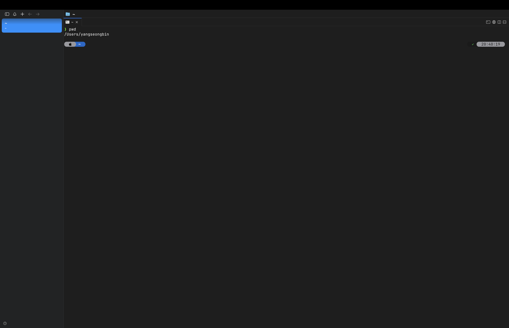
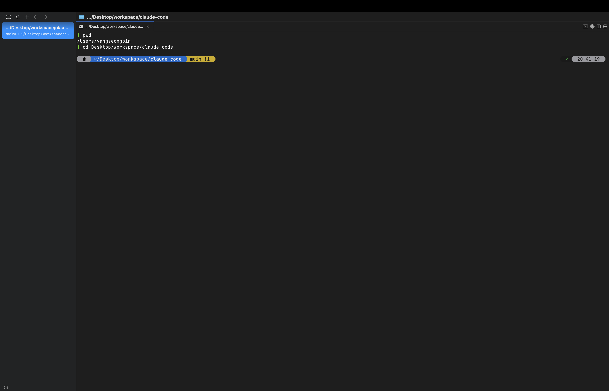
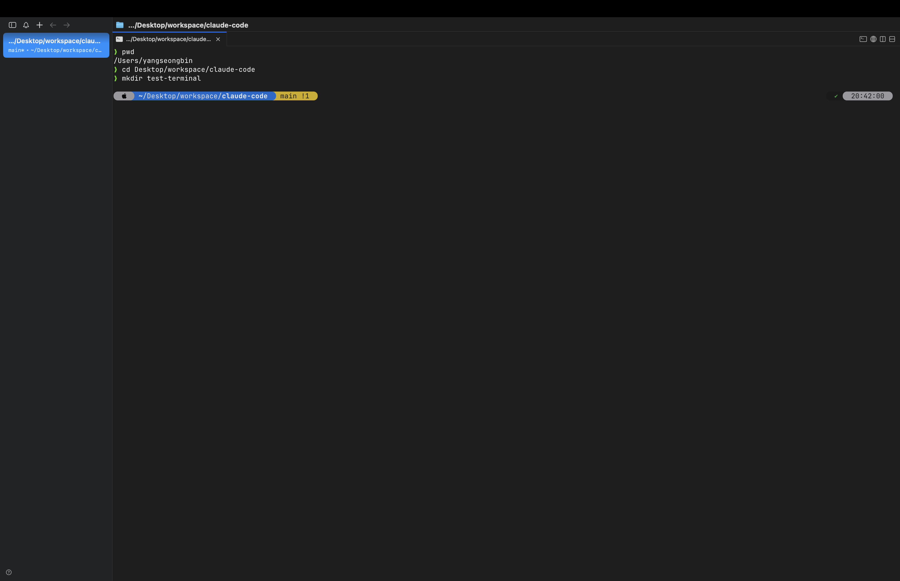
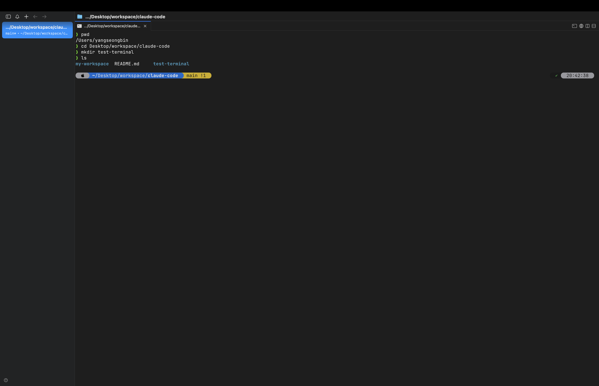
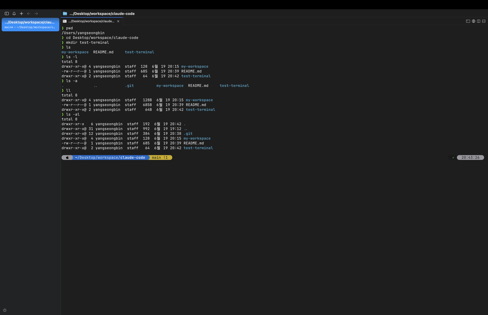

> 해당 포스팅은 [클로드 코드 완벽 마스터: AI 개발 워크플로우 기초부터 실전까지](https://inf.run/vN55k)를 참조하여 작성하였습니다.


## 💻 터미널이란?

앞선 [시작하기 전에](/claude-code-시작하기-전에) 섹션에서 클로드 코드를 가볍게 맛봤다면, 이제부터는 본격적으로 *기초를 다질* 차례다. 그 첫걸음은 바로 **터미널** 이다.

### 왜 터미널부터 배워야 할까

이유는 단순하다. **클로드 코드는 터미널에서 실행되는 AI 코딩 도구** 이기 때문이다. 그래서 기본적인 터미널 명령어 몇 개만 알아둬도 클로드 코드를 *훨씬 수월하게* 다룰 수 있다.

특히 평소 Windows를 주로 쓰던 분들이라면, 터미널이라는 단어부터 살짝 부담스러울 수 있다.

> 뭔가 까만 창에 텍스트 명령어만 입력해도 왠지 어려워 보일 수 있죠.

하지만 걱정할 필요 없다. 이번 챕터의 목표가 바로 그 *진입 장벽을 낮추는 것* 이다.

### 터미널은 "컴퓨터와 텍스트로 대화하는 창"

터미널을 한 문장으로 정의하면 이렇다. **컴퓨터와 텍스트로 대화할 수 있는 특별한 창** 이다.

우리가 평소 컴퓨터를 쓰는 모습을 떠올려보자. 마우스로 폴더를 더블클릭해서 열고, 드래그해서 옮기고, 우클릭해서 새 폴더를 만든다. 이렇게 *눈에 보이는 시각적 요소* 를 마우스로 조작하는 방식을
**GUI(Graphical User Interface)** 라고 한다.

반면 터미널은 그 까만 창 안에서 **오직 텍스트** 로 동작한다. 폴더로 이동하거나 새 폴더를 만드는 작업을, 마우스 대신 *명령어를 입력* 해서 처리한다. 이렇게 명령어로 컴퓨터와 대화하는
방식을 **CLI(Command Line Interface)** 라고 부른다.

| 구분    | GUI            | CLI(터미널)         |
|-------|----------------|------------------|
| 조작 방식 | 마우스로 아이콘·메뉴 클릭 | 텍스트 명령어 입력       |
| 예시    | 폴더 더블클릭으로 열기   | 명령어로 폴더 이동·생성    |
| 느낌    | 직관적, 시각적       | 처음엔 낯섦, 익숙해지면 빠름 |

결국 *컴퓨터를 사용하는 방법만 다를 뿐*, 하는 일은 똑같다. 그리고 클로드 코드는 이 터미널 기반으로 동작하니, 기본 명령어를 알아두는 건 **필수** 다.

### 까만 창, 두려워하지 않아도 된다

개발 경험이 없는 분들이 검정 화면에 흰 글씨가 가득한 모습을 처음 보면 위축되기 쉽다. 하지만 강사님은 이렇게 말한다.

> 컴퓨터를 사용하는 방법만 다를 뿐이에요.

마우스로 클릭하느냐, 명령어를 입력하느냐의 *방식 차이* 일 뿐이라는 것이다. 그리고 실제로 터미널을 쓰기 위해 알아야 할 기본 명령어는 *몇 개 되지도 않는다.* 자주 쓰다 보면 금세 손에 익는다.

### 명령어, 외우지 말자

마지막으로 학습 전략 하나. 터미널 명령어는 **억지로 외울 필요가 없다.**

- 실제로 쓰는 명령어는 *손에 꼽을 만큼* 적다
- 자주 사용하다 보면 *자연스럽게* 익숙해진다
- 기억이 안 나면? *구글링* 하면 금방 나온다

그러니 명령어 암기에 부담 느끼지 말고, *직접 쳐보며 익숙해지는 것* 에 집중하자.

다음 글부터는 실제로 자주 쓰는 터미널 명령어들을 하나씩 다뤄보도록 하겠다.

## 🍎 터미널 기본 명령어 (macOS): Windows vs macOS, 명령어가 다른 이유

터미널이 무엇인지 감을 잡았으니, 이제 *실제로 손을 움직여* 명령어를 쳐볼 차례다. 이 챕터에서는 **macOS** 기준으로 가장 기본이 되는 명령어 네 개를 익히고, 마지막에는 *왜 Windows와
macOS의 명령어가 다른지* 까지 짚어본다.

> Windows를 쓰는 분들도 이 챕터는 짧으니 한 번 봐두면 좋다. Windows와 macOS의 명령어가 어떻게 다른지 비교하며 보면 오히려 이해가 쉽다.

### 터미널 실행하기

macOS에서 터미널을 켜는 건 간단하다. 기본으로 제공되는 **터미널(Terminal)** 앱을 실행하면 된다. 참고로 개발자들이 많이 쓰는 **iTerm2** 같은 대체 터미널도 있는데, 지금
단계에서는 기본 터미널만으로 충분하다.

### 꼭 알아야 할 기본 명령어 4가지

명령어는 대부분 *영어 단어의 약자* 라서, 뜻을 알면 외우기 쉽다.

#### 1. `pwd` — 나 지금 어디 있지?

**`pwd`** (print working directory)는 *현재 내가 위치한 디렉터리* 를 알려준다. 터미널에서 길을 잃었을 때 가장 먼저 쳐보는 명령어다.



#### 2. `cd` — 폴더 이동하기

**`cd`** (change directory)는 *디렉터리를 이동* 한다. 마우스로 폴더를 더블클릭해 들어가는 것과 같다.

```bash
cd Documents   # Documents 폴더로 이동
cd ..          # 상위(부모) 폴더로 이동
```

`cd ..` 에서 점 두 개(`..`)는 *한 단계 위 폴더* 를 의미한다.



#### 3. `mkdir` — 새 폴더 만들기

**`mkdir`** (make directory)는 *새 디렉터리를 생성* 한다. 우클릭 → 새 폴더와 같은 동작이다.

```bash
mkdir my-project   # my-project 폴더 생성
```



#### 4. `ls` — 뭐가 들어있나 보기

**`ls`** (list)는 *현재 디렉터리의 파일과 폴더 목록* 을 보여준다. 옵션을 붙이면 더 자세히 볼 수 있다.

```bash
ls       # 목록 보기
ls -l    # 상세 정보까지 (ll 로도 가능)
ls -a    # 숨김 파일까지 모두 (ll -a)
```





여기서 `-l`, `-a` 처럼 명령어 뒤에 붙는 걸 **옵션(option)** 이라고 한다. `-l` 은 상세 정보를, `-a` 는 *숨김 파일* 까지 함께 보여준다.

### 그런데 Windows는 명령어가 다르다?

같은 *숨김 파일 보기* 인데도 운영체제마다 명령어가 다르다.

| 작업       | macOS   | Windows (PowerShell) | Windows (명령 프롬프트) |
|----------|---------|----------------------|-------------------|
| 숨김 파일 표시 | `ls -a` | `ls -Force`          | `dir /a`          |

같은 일을 하는데 왜 이렇게 제각각일까? 강사님이 마지막에 그 이유를 짚어준다.

### 명령어가 다른 진짜 이유: "설계 철학의 차이"

결론부터 말하면, **운영체제마다 설계 철학이 다르기 때문** 이다.

- **macOS** → **유닉스(Unix) 표준** 명령어 체계를 따른다. (`ls`, `pwd`, `cd` 등)
- **Windows** → 마이크로소프트의 **독자적인** 명령어 체계를 사용한다. (`dir` 등)

macOS와 리눅스가 비슷한 명령어를 쓰는 것도 바로 이 *유닉스 뿌리* 를 공유하기 때문이다. 반면 Windows는 처음부터 다른 길을 걸어왔기에 명령어가 갈린 것이다.

> 그러니 "왜 강의에서 본 명령어가 내 컴퓨터에선 안 되지?" 하고 당황할 필요 없다. 운영체제가 다르면 명령어도 다를 수 있다는 것만 기억하면 된다.

다음 글에서는 이렇게 익힌 기본 명령어를 바탕으로, 클로드 코드를 실제로 실행하며 더 깊이 들어가 보도록 하겠다.