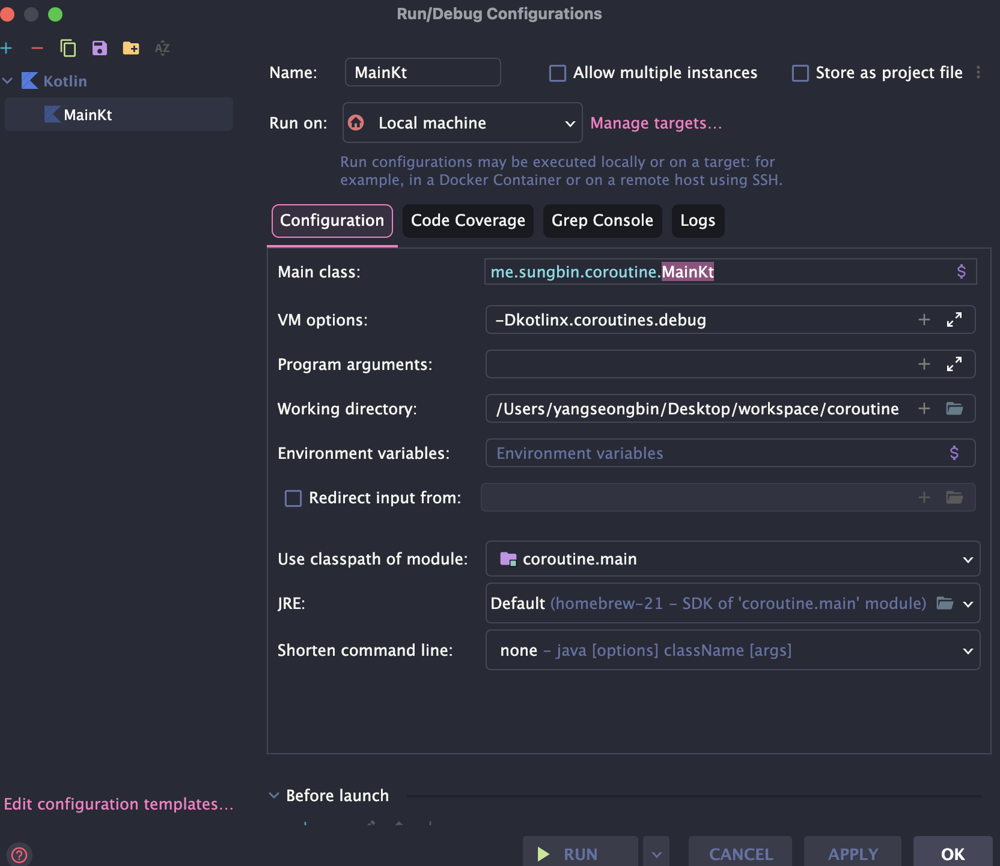

> 해당 포스팅은 인프런의 [2시간으로 끝내는 코루틴](https://inf.run/Rm45L) 강의를 참조하여 작성한 글입니다.

## 루틴과 코루틴

이번에는 코루틴을 사용해보면서 코루틴이 무엇인지 감을 잡아보도록 해보겠다. 도대체 코루틴이란 무엇일까? 코루틴을 영어로 살펴보면 `co-routine`으로 여기서 접미어 `co`는 ‘협력하는’이라는 의미가 있다. 뒤에 있는 routine 은 컴퓨터 공학에서 이야기하는 루틴으로 간단히 ‘함수’라고 생각해도 좋다. 그렇다면 `co-routine`은 협력하는 루틴, 협력하는 함수라는 의미이다.

> 우리가 생각하는 그냥 루틴(함수)도 서로 호출과 반환을 주고받으며 협력을 한다.

그런데 협력하는 루틴이라니 도대체 그냥 루틴과 협력하는 루틴은 어떤 차이가 있길래 ‘협력하는’이라는 의미가 있을까? 한번 다음 코드를 살펴보자.

``` kotlin
package me.sungbin.coroutine

import kotlinx.coroutines.launch
import kotlinx.coroutines.runBlocking
import kotlinx.coroutines.yield

fun main() = runBlocking {
    println("START")
    newRoutine()
    println("END")
}

fun newRoutine() {
    val num1 = 1
    val num2 = 2

    println("${num1 + num2}")
}
```

위의 결과는 아래와 같이 나올 것이다.

``` bash
START
3
END
```

해당 결과가 나오는 과정은 아래와 같다.

- main 루틴이 START를 출력한 이후 new 루틴을 호출한다.
- new 루틴은 1과 2를 계산해 3을 출력한다.
- 그 이후, new 루틴은 종료되고 main 루틴으로 돌아온다.
- main 루틴은 END 를 출력하고 종료된다.

또한 이때 new 루틴이 종료된 이후 new 루틴에서 사용되었던 num1과 num2는 접근이 불가능하고 메모리에서도 사라져 있을 것이다.

지금까지 정리를 해보면 아래와 같이 정의를 내릴 수 있을 것이다.

> 루틴은 진입하는 곳이 한 곳이고 루틴이 종료되면 그 루틴에서 사용했던 정보가 초기화된다고 생각 할 수 있다.

이번에는 협력하는 루틴, 코루틴을 살펴보자. 코루틴을 사용하려면 의존성을 한 가지 추가해 주어야 한다.

``` kotlin
implementation("org.jetbrains.kotlinx:kotlinx-coroutines-core:1.10.2")
```

그리고 나서 아래의 예제 코드를 작성해보자.

``` kotlin
package me.sungbin.coroutine

import kotlinx.coroutines.launch
import kotlinx.coroutines.runBlocking
import kotlinx.coroutines.yield

fun main() = runBlocking {
    printWithThread("START")
    launch {
        newRoutine()
    }
    yield()
    printWithThread("END")
}

suspend fun newRoutine() {
    val num1 = 1
    val num2 = 2

    yield()
    printWithThread("${num1 + num2}")
}
```

가장 먼저 처음보는 함수는 `runBlocking`이다. `runBlocking` 함수는 일반 루틴 세계와 코루틴 세계를 연결하는 함수이다. 이 함수 자체로 새로운 코루틴을 만들게 되고, `runBlocking`에 넣어준 람다가 새로운 코루틴 안에 들어가게 된다. 다음으로 `launch`라는 함수도 보인다. `launch`라는 함수 역시 새로운 코루틴을 만드는 함수이다. 주로 반환 값이 없는 코루틴을 만드는데 사용된다. 즉, 우리는 `runBlocking`과 `launch`를 사용해 2개의 코루틴을 만든 것이다.

다음으로 `yield()`라는 함수가 보인다. `yield`라는 단어는 양보하다라는 의미가 있는데, 이 의미에 걸맞게 `yield()`라는 함수는 지금 코루틴의 실행을 잠시 멈추고 다른 코루틴이 실행되도록 양보한다. 마지막으로 `suspend fun`이라는 키워드가 보인다. 코틀린에서 일반적인 함수는 `fun`으로 만드는 것과 다르게 `suspend`라는 키워드가 붙었는데 `suspend`라는 키워드가 붙으면 다른 `suspend fun`을 호출하는 특수 능력을 갖게 된다. 우리가 사용한 `yield()`가 바로 `suspend fun`이기 때문에 함수 newRoutine에 `suspend`를 붙여주었다. 그리고 한번 실행해보자. 그러면 아래와 같이 나올 것이다.

``` bash
START
END
3
```

그러면 왜 위와 같이 출력이 되었는지 한번 살펴보도록 하겠다.

- main 코루틴이 `runBlocking`에 의해 시작되고 START가 출력된다.
- `launch`에 의해 새로운 코루틴이 생긴다. 하지만, newRoutine의 실행은 바로 일어나지 않는다.
- main 코루틴 안에 있는 `yield()`가 되면 main 코루틴은 new 코루틴에게 실행을 양보다. 따라서 `launch`가 만든 새로운 코루틴이 실행되고, newRoutine 함수가 실행된다.
- newRoutine 함수는 다시 `yield()`를 호출하고 main 코루틴으로 되돌아온다.
- main 루틴은 END를 출력하고 종료된다.
- 아직 newRoutine 함수가 끝나지 않았으니 newRoutine 함수로 되돌아가 3이 출력되고 프로그램이 종료된다.

루틴과 코루틴의 가장 큰 차이는 중단과 재개이다. 루틴은 한 번 시작되면 종료될 때까지 멈추지 않지만, 코루틴은 상황에 따라 잠시 중단이 되었다가 다시 시작되기도 한다. 때문에 완전히 종료되기 전까지는 newRoutine 함수 안에 있는 num1 num2 변수가 메모리에서 제거되지도 않는다. 그러면 추가적으로 어떤 쓰레드에서 발생했는지도 확인해볼 필요가 있다. 만약 다른 스레드에서 발생시킨 것일수도 있기 때문이다. 아래와 같이 작성해보자.

``` kotlin
package me.sungbin.coroutine

import kotlinx.coroutines.launch
import kotlinx.coroutines.runBlocking
import kotlinx.coroutines.yield

fun main() = runBlocking {
    printWithThread("START")
    launch {
        newRoutine()
    }
    yield()
    printWithThread("END")
}

suspend fun newRoutine() {
    val num1 = 1
    val num2 = 2

    yield()
    printWithThread("${num1 + num2}")
}

fun printWithThread(str: Any) {
    println("[${Thread.currentThread().name}] ${str}")
}
```

또한 인텔리제이에서 VM Option으로 `-Dkotlinx.coroutines.debug`을 주게 되면 어떤 코루틴에서 발생했는지도 알게된다.



이 두 옵션을 사용하면, 출력 결과가 다음과 같이 변경된다.

``` bash
[main @coroutine#1] START
[main @coroutine#1] END
[main @coroutine#2] 3
```

## 스레드와 코루틴

이번에는 코루틴과 자주 비교되는 또 다른 존재, 스레드와 코루틴을 비교해 볼 것이다. 본격적으로 스레드와 코루틴을 비교하기 전에, 프로세스와 스레드를 간단히 살펴보자.

프로세스(process)는 컴퓨터에서 실행되고 있는 프로그램을 의미한다. 그리고 스레드(thread)는 프로세스보다 작은 개념으로 프로세스에 소속되어 여러 코드를 동시에 실행할 수 있도록 해준다. 스레드는 코드를 실행하고 따라서 우리가 작성한 코드는 특정 스레드에서 실행된다. 만약 한 프로세스가 여러 개의 스레드를 갖고 있다면 멀티스레드 환경이라고 한다.

여기까지 정리해 보면, 스레드는 프로세스가 있어야만 존재할 수 있고 스레드는 코드를 실행하며 스레드가 프로세스보다 작은 개념이라 할 수 있다. 그렇다면 코루틴은 무엇일까? 코루틴은 스레드보다 작은 개념이다. 하지만 프로세스-스레드하고는 차이가 분명히 존재한다.

가장 먼저 코루틴은 단지 우리가 작성한 루틴, 코드의 종류 중 하나이기 때문에 코루틴 코드가 실행되려면 스레드가 있어야만 한다. 그런데 코루틴은 중단되었다가 재개될 수 있기 때문에, 코루틴 코드의 앞부분은 1번 스레드에 배정되고, 뒷부분은 2번 스레드에 배정될 수 있다.

context switching 과정에서도 차이가 있다.

- 프로세스
    - 프로세스는 각각 독립된 메모리 영역을 갖고 있기 때문에 1번 프로세스에서 2번 프로세스로 실행이 변경되면 힙 영역과 스탭 영역이 모두 교체되어야 한다.
    - 때문에 프로세스 간의 context switching은 비용이 제일 크다.
- 스레드
    - 스레드는 독립된 스택영역을 가지고 있지만 힙 영역을 공유하기 때문에 실행이 변경되면 스택영역만 교체한다.
    - 따라서 프로세스보다는 context switching 비용이 적다.
- 코루틴
    - 반면 코루틴은 1번 코루틴과 2번 코루틴이 같은 스레드에서 실행될 수 있다.
    - 때문에 동일한 스레드에서 코루틴이 실행되면, 메모리 전부를 공유하므로 스레드보다도 context switching 비용이 적다.

또한, 스레드는 동시성을 확보하기 위해 여러 개의 스레드가 필요하다. 반면, 코루틴은 1번 코루틴과 2번 코루틴이 하나의 스레드에서 번갈아 실행될 수 있기 때문에 단 하나의 스레드만으로도 동시성을 확보할 수 있다. 마지막으로 코루틴은 `yield()` 함수를 사용했던 것처럼 스스로가 다른 코루틴에게 자리를 양보할 수 있다. 반면, 스레드는 보통 OS가 실행되고 있는 스레드를 멈추고 다른 스레드가 실행되도록 한다. 코루틴과 같은 방식을 ‘비선점형’이라 부르고 스레드와 같은 방식을 ‘선점형’이라 부른다.

## 코루틴 빌더와 Job

이번에는 코틀린에서 코루틴을 어떻게 만드는지 알아보고, 각 방법의 차이점도 살펴보자.

코루틴을 만드는 첫 번째 방법은 `runBlocking`이다. 우리가 한 번 사용해 보았던 `runBlocking` 함수는 새로운 코루틴을 만들고 루틴 세계와 코루틴 세계를 이어주는 역할을 한다. 이렇게 코루틴을 만드는 함수를 **코루틴 빌더** 라 부른다.

``` kotlin
fun main(): Unit = runBlocking {
}
```

이 함수에서 주의해야 할 부분은 이름에 `blocking`이 들어있다는 점이다. `runBlocking` 함수는 `runBlocking`으로 인해 만들어진 코루틴과 그 안의 코루틴이 모두 완료될 때까지 스레드를 블락시킨다. 스레드가 블락되면 그 스레드는 블락이 풀릴 때까지 다른 코드를 실행시킬 수 없다. 아래의 함수를 살펴보자.

``` kotlin
fun example1() {
    runBlocking {
        printWithThread("START")
        launch {
            delay(2_000L)
            printWithThread("LAUNCH END")
        }
    }
    printWithThread("END")
}
```

main 함수에는 `runBlocking`으로 만들어진 코루틴이 있고, `runBlocking`으로 만들어진 코루틴 안에는 다시 한번 `launch`로 만들어진 코루틴이 있다. 여기서 사용된 `delay()` 함수는 코루틴을 지정된 시간 동안 지연시키는 함수이다. 이 코드에서 END가 출력되기 위해서는 `runBlocking` 때문에 두개의 코루틴이 모두 완전히 종료되어야 하고 따라서 출력 결과는 다음과 같다.

``` bash
[main @coroutine#1] START
[main @coroutine#2] LAUNCH END
[main] END
```

이 상황에서는 핵심은, END가 출력되기 위해 아무런 의미 없이 2초를 기다려야 한다는 것이다. 즉, `runBlocking` 함수를 함부로 사용하면 스레드가 블락되어 다른 코드를 실행할 수 없이 프로그램이 멈출 수 있게 된다. 그렇기 때문에 `runBlocking` 함수를 계속해서 사용해서는 안 되고, 프로그램에 진입하는 최초의 메인 함수나 테스트 코드를 시작할 때만 사용하는 편이 좋다.

다음으로 살펴볼 함수는 `launch`이다. 위에서도 사용했지만, `launch` 역시 코루틴 빌더이고, 반환 값이 없는 코드를 실행할 때 사용한다. `launch`는 `runBlocking`과는 다르게 만들어진 코루틴을 결과로 반환하고, 이 객체를 이용해 코루틴을 제어할 수 있다. 이 객체의 타입은 `Job`으로 코루틴을 나타낸다. 즉, `Job`을 하나 받으면 코루틴을 하나 만든 것이다.

``` kotlin
fun example2(): Unit = runBlocking {
    printWithThread("Hello Lanunch")
}
```

`Job`을 이용해 코루틴을 제어할 수 있다고 했는데, 제어한다는 의미는 무엇일까? 일단 아래의 코드를 한번 살펴보자.

``` kotlin
fun example2(): Unit = runBlocking {
    val job = launch(start = CoroutineStart.LAZY) {
        printWithThread("Hello Lanunch")
    }

    delay(1_000L)
    job.start()
}
```

`launch`라는 코루틴 빌더를 사용할 때 `CoroutineStart.LAZY` 옵션을 주어 코루틴이 즉시 실행되지 않도록 변경했다. 때문에 이 코루틴은 `Job.start()`를 직접 호출해서 시작 신호를 주어야만 동작한다. 우리가 코루틴이 시작되도록 제어한 것이다.

또 다른 대표적인 제어 기능으로 `cancel()` 기능이 존재한다. 한번 아래의 코드를 살펴보자.

``` kotlin
fun example3() = runBlocking {
    val job = launch {
        (1..5).forEach {
            printWithThread(it)
            delay(500L)
        }
    }

    delay(1_000L)
    job.cancel()
}
```

우리의 코루틴은 원래대로라면 1부터 5까지 출력할 수 있지만, 우리가 `Job.cancel()`을 호출해 취소했기 때문에 2까지만 출력하게 된다. 또한 Job 객체의 join() 기능을 사용하면 우리가 제어하고 있는 코루틴이 끝날 때까지 대기할 수도 있다. 아래의 코드를 살펴보자.

``` kotlin
fun example4() = runBlocking {
    val job1 = launch {
        delay(1_000L)
        printWithThread("Job 1")
    }

    val job2 = launch {
        delay(1_000L)
        printWithThread("Job 2")
    }
}
```

위의 코드는 각각의 코루틴에서 delay가 1초씩 걸려 있지만, Job1과 Job2를 전부 호출하는데 걸리는 시간은 1.x초일 것이다. 그 이유는, job1에서 1초를 기다리는 동안 job2도 시작되어 함께 1초를 기다리기 때문이다. 위의 코드에서 딱 한 줄이 추가된 두 번째 코드를 살펴보자. `join()` 기능을 사용해 job1이 끝날 때까지 기다리는 코드이다.

``` kotlin
fun example4() = runBlocking {
    val job1 = launch {
        delay(1_000L)
        printWithThread("Job 1")
    }

    job1.join()

    val job2 = launch {
        delay(1_000L)
        printWithThread("Job 2")
    }
}
```

이 코드는 첫 번째와 다르게 전체 코드가 수행되는데 2초 이상이 소요된다. 우리가 첫 번째 코루틴에 대해 `join()`을 호출하며 첫 번째 코루틴이 끝날 때까지 완전히 기다렸기 때문이다.

마지막으로 살펴볼 코루틴 빌더는 `async()`이다. `async()`는 `launch()`와 거의 유사한데 딱 한 가지 다른 점이 있다. 주어진 함수의 실행 결과를 반환할 수 없는 `launch()`와 달리 `async()`는 주어진 함수 실행 결과를 반환할 수 있다.

``` kotlin
fun example5() = runBlocking {
    val job = async { 3 + 5 }
}
```

또한, async() 역시 launch() 처럼 코루틴을 제어할 수 있는 객체를 반환하며 그 객체는 `Deferred`이다. `Deferred`는 Job 의 하위 타입으로 `Job`과 동일한 기능들이 있고 `async()`에서 실행된 결과를 가져오는 `await()` 함수가 추가적으로 존재한다.

``` kotlin
fun example5() = runBlocking {
    val job = async { 3 + 5 }
    val result = job.await()
    printWithThread(result)
}
```

이 `async()` 함수는 여러 외부 자원을 동시에 호출해야 하는 상황에서 유용하게 활용될 수 있다. 아래처럼 외부 API의 결과를 합치는 요구사항이 있다고 해보자.

``` kotlin
suspend fun apiCall1(): Int {
    delay(1_000L)
    return 1
}

suspend fun apiCall2(): Int {
    delay(1_000L)
    return 2
}
```

우리는 `async()`를 함수를 활용해 두 API를 각각 호출함으로써 소요시간을 최소화할 수 있다.

``` kotlin
fun main() = runBlocking {
    val times = measureTimeMillis {
        val job1 = async { apiCall1() }
        val job2 = async { apiCall2() }

        printWithThread(job1.await() + job2.await())
    }

    printWithThread("소요 시간: $times ms")
}
```

또한, 첫 번째 API의 결과가 두 번째 API에 필요한 경우에는 callback을 이용하지 않고도, 동기 방식으로 코드를 작성할 수 있게 해준다.

``` kotlin
fun main() = runBlocking {
    val times = measureTimeMillis {
        val job1 = async { apiCall1() }
        val job2 = async { apiCall2(job1.await()) }

        printWithThread(job2.await())
    }

    printWithThread("소요 시간: $times ms")
}
```

`async()`와 관련해 한 가지 주의할 점으로는, `CoroutineStart.LAZY` 옵션을 사용해 코루틴을 지연 실행시킨다면, `await()` 함수를 호출했을 때 계산 결과를 계속해서 기다린다는 것이다. 만약, 지연 코루틴을 `async()`와 함께 사용하는 경우라도, 동시에 API 호출을 하고 싶다면 `start()` 함수를 먼저 사용해 주어야 한다.

## 코루틴의 취소

이번에는 코루틴의 취소에 대해 상세히 알아보도록 하겠다. 더 이상 사용하지 않는 코루틴을 취소하는 것은 중요하다. 특히 여러 코루틴을 사용할 때, 필요 없어진 코루틴을 적절하게 취소하며 컴퓨터 자원을 절약할 수 있다. 코루틴을 취소하기 위해서는 이전에 살펴봤던 것처럼, Job 객체의 `cancel()` 함수를 사용할 수 있다. 다만, 취소 대상인 코루틴도 취소에 협조를 해주어야 한다.

``` kotlin
fun example01() = runBlocking {
    val job1 = launch {
        delay(1_000L)
        printWithThread("Job 1")
    }

    val job2 = launch {
        delay(1_000L)
        printWithThread("Job 2")
    }

    delay(100)
    job1.cancel()
}
```

위 코드에서 우리는 `runBlocking` 안에서 두 코루틴을 만들고 첫 번째 코루틴을 취소시켰다. 첫 번째 코루틴은 취소에 잘 협조하고 있기에 정상적으로 취소되어 “Job 1”이 출력되지 않고, “Job 2”만 출력되었다. 지금까지 작성하던 코루틴과 크게 다르지 않은데, 어떻게 협조를 한 것일까? 바로 `delay()` 함수가 바로 코루틴 취소에 대한 협조이다. 더 근본적으로는 `delay()` 혹은 `yield()`와 같은 `kotlinx.coroutines` 패키지의 `suspend` 함수를 사용하면 취소에 협조할수 있다. 취소에 협조하는 첫 번째 방법은 바로 코루틴 패키지의 suspend 함수이다.

다만 여기서 한 가지 주의할 점이 있다! 취소되기 전에 코루틴이 완료될 수도 있다는 점이다.

``` kotlin
fun main(): Unit = runBlocking {
    val job = launch {
        delay(10L) // 지연 시간을 0.01초로 변경했다.
        printWithThread("Job 1")
    }
    delay(100L)
    job.cancel()
}
```

이런 경우는 취소되지 않은 것이 아니라, 취소 되기 전에 코루틴이 진작 완료된 것이다! 자 그럼, 코루틴이 취소에 협조하지 않으면 정말 취소되지 않는 것일까? 우리가 만든 코루틴에서, 코루틴 패키지의 suspend 함수를 사용하지 않고 5번의 출력을 반복시켜보자. 출력을 반복시키기 위해 일종의 무한 루프를 사용했다.

``` kotlin
fun example02(): Unit = runBlocking {
    val job = launch {
        var i = 1
        var nextPrintTime = System.currentTimeMillis()
        while (i <= 5) {
            if (nextPrintTime <= System.currentTimeMillis()) {
                printWithThread("${i++}번째 출력")
                nextPrintTime += 1_000L
            }
        }
    }

    delay(100)
    job.cancel()
}
```

분명 우리는 `job1.cancel()`을 사용해 코루틴을 취소시켰지만, 우리가 만든 코루틴은 5번을 모두 출력할 때까지 취소되지 않는 모습을 확인할 수 있다. 그렇다! 협력하는 코루틴만 취소 가능한 것이다.

코루틴이 취소에 협력하는 두 번째 방법은, 코루틴 스스로가 본인의 상태를 확인해 취소 요청을 받았을 때 `CancellationException`을 던지는 방법이다. 스스로 본인 상태를 확인해 취소 요청을 받으려면 두 가지 개념을 추가적으로 이해해야 한다.

- `isActive`
    - 코틀린을 만들 때 사용한 함수 블록 안에서는 `isActive`라는 프로퍼티에 접근할 수 있다.
    - 이 프로퍼티는 현재 코루틴이 활성화 되어 있는지, 아니면 취소 신호를 받았는지 구분할 수 있게 해준다.
- `Dispatchers.Default`
    - 취소 신호를 정상적으로 전달하려면 우리가 만든 코루틴이 다른 스레드에 동작해야 한다.
    - `Dispatchers.Default`를 `launch()` 함수에 전달하면 우리의 코루틴을 다른 스레드에서 동작시킬 수 있다.

``` kotlin
fun example02(): Unit = runBlocking {
    val job = launch(Dispatchers.Default) {
        var i = 1
        var nextPrintTime = System.currentTimeMillis()
        while (i <= 5) {
            if (nextPrintTime <= System.currentTimeMillis()) {
                printWithThread("${i++}번째 출력")
                nextPrintTime += 1_000L
            }

            if (!isActive) {
                throw CancellationException("Job cancelled")
            }
        }
    }

    delay(100)
    job.cancel()
}
```

`Dispatchers.Default`로 다른 스레드를 배정해 주었기 때문에 출력 결과에서 스레드 이름이 변경된 것을 확인할 수 있다. 또한, while문의 루프가 최초 한 번 동작한 이후, 두 번째 반복하려 할 때 취소 신호를 정상적으로 받아들인 것 역시 확인할 수 있다. 만약 위 코드에서, `launch(Dispatchers.Default)` 대신 `launch`를 사용한다면, “취소 시작” 자체가 출력되지 않게 된다. launch에서 동작시키고 있는 코드가 main 스레드를 점유한 채 비켜주지 않기 때문이다.

추가적으로 굳이 `CancellationException`을 던지지 않고 while문에서 `isActive`를 확인해서 할 수 있다.

이제 우리가 사용했던 CancellationException 에 대해서 조금 더 자세히 살펴보자. 사실, 우리가 살펴보았던 `delay()` 같은 함수 역시 `CancellationException`을 던지며 코루틴을 취소시키게 된다. 때문에 `try - catch`문을 활용해 `CancellationException`를 잡은 후 다시 던지지 않는다면 코틀린이 취소되지 않고, `finally`문을 활용해 필요한 자원을 닫을 수도 있다.

``` kotlin
fun main() = runBlocking {
    val job = launch {
        try {
            delay(1_000L)
        } catch (e: CancellationException) {
            // 아무것도 안 한다.
        }

        printWithThread("delay에 의해 취소되지 않았다!!")
    }

    delay(100)
    printWithThread("취소 시작")
    job.cancel()
}
```

## 코루틴의 예외 처리와 Job의 상태 변화

이번에는 코루틴에서 예외가 발생할 때 무슨 일이 벌어지는지, 예외 처리는 어떻게 해야 하는지 알아보도록 하자. 본격적으로 예외 처리를 살펴보기 전에 새로운 root 코루틴을 만드는 방법을 알아보자.

``` kotlin
fun lec0501() = runBlocking {
    val job1 = launch {
        delay(1_000L)
        printWithThread("Job 1")
    }

    val job2 = launch {
        delay(1_000L)
        printWithThread("Job 2")
    }
}
```

이 코드에서 코루틴은 총 3개이다. `runBlocking`으로 만들어진 코루틴 안에 `launch`로 다시 2가지 코루틴이 만들어졌다. 이때 `runBlocking`으로 만들어진 코루틴은 최상위 코루틴, 즉 root 코루틴이자 부모 코루틴이 되고 `launch`로 만들어진 2가지 코루틴은 각각 자식 코루틴이 된다. 그렇다면 만약 새로운 root 코루틴을 만들고 싶다면 어떻게 해야 할까?! launch를 사용해 코루틴을 만들 때, 새로운 영역에 만들면 된다. 새로운 영역에 만드는 방법은 간단하다! 코루틴 영역이라는 의미가 있는 CoroutineScope 함수를 이용해 새로운 영역을 만들고, 이 영역에서 launch를 호출하는 것이다.

``` kotlin
fun lec0501() = runBlocking {
    val job1 = CoroutineScope(Dispatchers.Default).launch {
        delay(1_000L)
        printWithThread("Job 1")
    }

    val job2 = CoroutineScope(Dispatchers.Default).launch {
        delay(1_000L)
        printWithThread("Job 2")
    }
}
```

이제 우리는 root 코루틴을 만들 수 있다! 그럼 이제 `launch`와 `async`의 예외 발생 차이부터 알아보자. 먼저 `launch`이다.

``` kotlin
fun lec0502(): Unit = runBlocking {
    val job = CoroutineScope(Dispatchers.Default).launch {
        throw IllegalArgumentException()
    }

    delay(1_000L)
    job.await()
}
```

`launch` 함수는 예외가 발생하자마자, 해당 예외를 출력하고 코루틴이 종료된다. 반면 `async` 함수는 예외가 발생하더라도 예외를 출력하지 않는다.

``` kotlin
fun lec0502(): Unit = runBlocking {
    val job = CoroutineScope(Dispatchers.Default).async {
        throw IllegalArgumentException()
    }

    delay(1_000L)
}
```

`async` 함수에서 발생한 예외를 확인하고 싶다면, `await()` 함수를 사용해야 한다. `async`는 `launch`와 다르게 값을 반환하는 코루틴에 사용되기에, 예외 역시 값을 반환할 때 처리 할 수 있도록 설계된 것이다.

``` kotlin
fun lec0502(): Unit = runBlocking {
    val job = CoroutineScope(Dispatchers.Default).async {
        throw IllegalArgumentException()
    }

    delay(1_000L)
    job.await()
}
```

그럼 이번에는 새로운 영역에 root 코루틴을 만들지 않고, `runBlocking` 코루틴의 자식 코루틴으로 만들어 보자. 이 경우는 `launch`와 `async` 모두 예외가 발생하면 바로 에러 로그를 확인할 수 있다.

``` kotlin
fun lec0503(): Unit = runBlocking {
    val job = async {
        throw IllegalArgumentException()
    }

    delay(1_000L)
}
```

분명 `async`는 예외를 즉시 반환하지 않는다고 했는데 왜 이런 차이가 발생하는 것일까? 그 이유는 코루틴 안에서 발생한 예외가 부모 코루틴으로 전파되기 때문이다. runBlocking 안에 있는 async 코루틴에서 예외가 발생하면, 그 예외는 부모 코루틴으로 이동되고, 부모 코루틴도 취소하는 절차에 들어가게 된다. runBlocking의 경우 예외가 발생하면 해당 예외를 출력하기에 async의 예외를 받아 즉시 출력하는 것이다. 그렇다면, 부모 코루틴에게 예외를 전파하지 않는 방법은 없을까? 바로 아래와 같이 하는 것이다.

``` kotlin
fun lec0503(): Unit = runBlocking {
    val job = async(SupervisorJob()) {
        throw IllegalArgumentException()
    }

    delay(1_000L)
}
```

만약 코루틴에서 발생하는 예외를 핸들링 하고 싶다면 어떻게 해야할까? 가장 직관적으로 생각할 수 있는 방법은 `try catch` 구문을 사용하는 것이다.

``` kotlin
fun lec0504(): Unit = runBlocking {
    val job = launch {
        try {
            throw IllegalArgumentException()
        } catch (e: IllegalArgumentException) {
            printWithThread("정상 종료")
        }
    }
}
```

try catch 구문을 활용하면, 발생한 예외를 잡아 코루틴이 취소되지 않게 만들 수도 있고, 적절한 처리를 한 이후 다시 예외를 던질 수도 있다. 만약 try catch 대신, 예외가 발생한 이후 에러를 로깅하거나, 에러 메시지를 보내는 등의 공통된 로직을 처리하고 싶다면 `CoroutineExceptionHandler`라는 객체를 활용해볼 수 있다.

``` kotlin
fun main(): Unit = runBlocking {
    val exceptionHandler = CoroutineExceptionHandler { _, _ ->
        printWithThread("예외 처리")
    }

    val job = CoroutineScope(Dispatchers.Default).launch(exceptionHandler) {
        throw IllegalArgumentException()
    }

    delay(1_000L)
}
```

다만, `CoroutineExceptionHandler`는 launch 에만 적용 가능하고, 부모 코루틴이 있으면 동작하지 않는다는 점을 주의해야 한다.

그런데 한번 생각을 해보면 취소도 `CancellationException`을 던지는 방식을 이용했다. 하지만 예외가 던져지지 않았다. 이유가 뭘까? 코루틴 입장에서 취소와 예외는 뭐가 다를까? 코루틴은 코루틴 내부에서 발생한 예외에 대해 다음과 같이 처리하고 있다.

- 발생한 예외가 `CancellationException`인 경우
    - 취소로 간주하고 부모 코루틴에게 전파하지 않는다.
- 다른 예외가 발생한 경우
    - 실패로 간주하고 부모 코루틴에게 전파한다.

그리고 코루틴은 예외가 발생하면 해당 예외가 `CancellationException`이든 다른 예외이건 내부적으로 "취소됨"으로 간주한다.