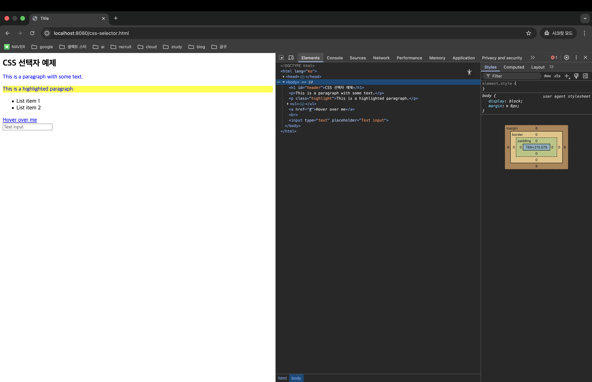
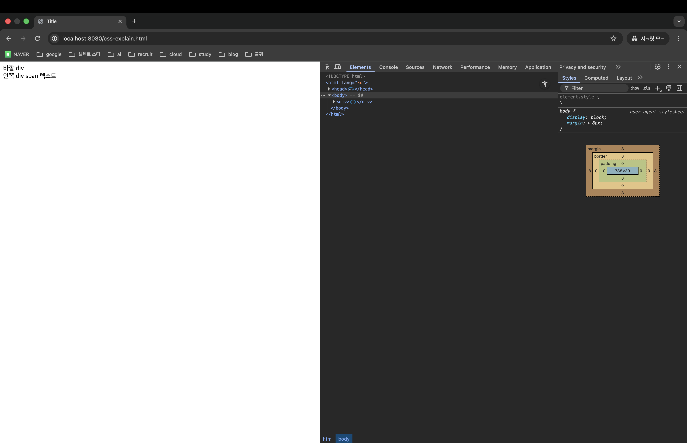
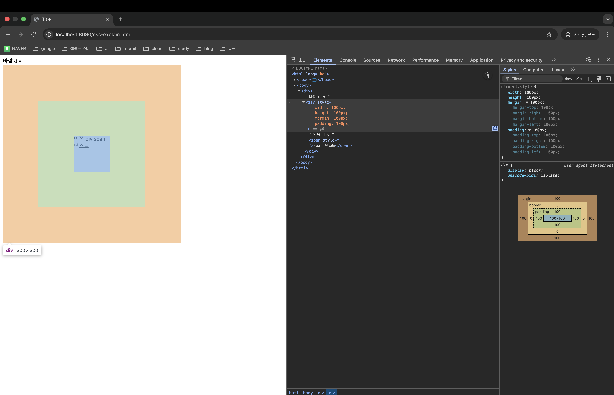

> 해당 포스팅은 인프런의 [백엔드 개발자에 의한, 백엔드 개발자들을 위한 프론트엔드 강의 - 기본편](https://inf.run/DQ8mU)를 참조하여 만들었습니다.


## css를 적용하는 방법과 선택자

이번에는 css를 적용하는 방법과 선택자에 대해 알아보도록 하겠다.

### HTML 페이지에 css를 적용하는 방법

먼저, HTML 페이지에 css를 적용하는 방법에 대해 알아보자. 총 3가지 방법이 존재한다. 그 중에 2개는 앞에서 봤던 방법인데 한번 알아보자.

``` html
<!DOCTYPE html>
<html lang="ko">
<head>
    <meta charset="UTF-8">
    <link rel="stylesheet" href="./css-selector.css">
    <style>
      .custom-style {
        font-size: 30px;
      }
    </style>
    <title>Title</title>
</head>
<body>
  안녕하세요. <span class="custom-style" style="font-size: 30px;">개발자 Robert</span> 입니다.
</body>
</html>
```

먼저, link 태그를 통해 css를 적용하는 방법이 존재한다. 이 경우는 별도의 css 파일이 필요하다. 그리고 html 태그에 style 속성을 추가하여 적용하는 방법이 존재한다. 이렇게 태그 내에 속성을 지정하는 방법을 inline으로 지정한다라고 표현한다. 그리고 이전에는 다루지 않았지만 하나 더 존재하는데 head 태그 내에 style 태그를 선언하여 그 안에 css를 지정하는 방법이 존재한다.

이 중에 일반적으로 권장되는 방법은 link 태그를 사용해서 별도의 css 파일을 불러오는 방법이고 불가피하다면 다른 2가지 방법을 시도하면 좋을 것 같다. 이렇게 style 태그를 사용하는 방법과 inline으로 style을 지정하는 방법은 html 문서내에 css가 섞여 있기 때문에 가독성이 떨어지고 html 코드 용량이 늘어나서 불필요한 트래픽을 유발할 수 있다. 반면에 css 파일이 존재하고 이렇게 link 태그를 이용해서 css를 사용하면 css 파일이 변경되지 않으면 캐시되도록 처리할 수 있다. 그러면 나머지 html 파일은 순수한 html 파일만 남게 될 것이고 그러면 그 html 파일만 주고 받으면 용량이 훨씬 줄어들 것이다.

우리가 css를 공부하면서 선택자에 대한 개념을 알아야 한다. 모든 css 속성을 inline으로 지정을 하면 한번에 여러 html 태그의 속성을 지정할 수가 없어서 지나치게 코드의 중복이 많아지고 우리가 UI 관련 템플릿을 사용한다면 반드시 선택자를 잘 이해하고 있어야 한다.

### 선택자의 종류 - 태그 선택자

선택자라는 것은 html 태그를 지정하는 방법을 의미한다. 어떤 html 태그에 css 속성이 적용되어야 하는지 지정을 하는 문법인 것이다. 선택자 문법에는 다양한 종류가 존재하는데 먼저 설명드릴 선택자는 바로 태그 선택자이다.

``` css
p {
  color: blue;
}
```

태그 선택자는 단순히 태그 이름만 나온다. 위의 예시는 p 태그의 글자 색을 변경하는 css 문법인데 html 태그에는 문단을 표현하기 위해 p 태그가 존재한다. 이 처럼 태그 이름만을 지정해서 속성을 지정해 줄 수 있다. 즉, 위와 같이 적용하면 html 문서 내에 있는 p 태그들에게 해당 스타일이 전부 적용되는 것이다.

### 선택자의 종류 - 클래스 선택자

``` css
.highlight {
  background-color: yellow;
}
```

다음은 클래스 선택자를 알아 볼 것이다. 클래스 이름 앞에 점을 붙이면 되는데 highlight라는 클래스 이름을 가진 태그들에게 해당 스타일이 적용된다. 위의 문법은 `background-color`라는 스타일을 적용해주고 있는데 말 그대로 배경 색을 노란색으로 변경하겠다라는 의미이다. 그러면 아래의 html 태그는 위의 css들이 적용되었을 때 어떻게 될까? 둘 중 하나만 적용이 될까?

``` html
<p class="highlight">hi</p>
```

둘 중 하나만 적용되는 것은 아니고 2가지 스타일이 동시에 적용이 된다. 그런데 똑같은 속성인데 서로 다른 값이라면 어떻게 지정이 될까? 예를 들어 p 태그에 `color: blue;`라고 지정이 되어 있는데 클래스 선택자에서 `color: yellow;`라고 해주면 어떻게 될까? 이것은 css 우선순위에 대한 문제인데 이는 뒤에 가서 어떻게 될지 알 수 있을 것이다.

### 선택자 종류 - id 선택자

``` css
#header {
  font-size: 24px;
}
```

다음으로는 id 선택자이다. id도 class랑 동일하게 해당 id 속성을 가진 html 태그에 해당 스타일을 적용하는 것이다. 위의 `font-size`는 글자 크기를 조절하는 스타일이다. 그러면 여기서 드는 의문이 있을 것이다.

> class랑 id의 차이는 무엇일까요?

id는 html 문서 내에 유일한 값이어야 하고 오직 1개만 존재해야 한다. 반면에 class의 경우 html 문서 내에 여러개가 존재해도 괜찮다. 또한, 하나의 html 태그가 여러개의 클래스를 가지는 것도 가능하다. 아래와 같이 말이다.

``` html
<div class="highlight checked"></div>
```

다만, html 문서 내에 id가 하나만 존재해야 한다는 사항은 문법적으로 강제되는 사항은 아니다. html 문서 내에 동일한 id가 여러개 있어도 웹 페이지는 정상적으로 동작은 한다. 그래도 가급적 지켜서 id와 class 속성을 활용하는게 좋다.

### 선택자의 종류 - 자식 선택자

``` html
<ul>
  <li>List item 1</li>
  <li>List item 2</li>
</ul>
```

``` css
ul > li {
  list-style-type: square;
}
```

다음은 자식 선택자이다. 자식 선택자는 위와 같이 작성해주면 된다. 해당 선택자의 의미는 ul 태그의 자식 태그들 중에 li 태그들에게 해당 속성을 지정하겠다라는 의미이다. 여기서 1가지 유심히 볼 께 있는데 위의 자식 선택자에서 `>`를 빼면 조금 의미가 달라진다.

``` css
ul li {
  list-style-type: square;
}
```

이렇게 했을 때 어떤 차이가 있냐면 위의 `>`가 있는 경우는 ul 태그의 바로 아래에 있는 깊이의 자식 태그들에게 해당 속성을 지정해주는 반면에 `>`가 없는 경우는 ul 하위에 있는 모든 자식 즉, 바로 아래가 아닌 후손 태그들까지도 적용이 되는 것이다.

### 선택자의 종류 - 가상 클래스 선택자

``` css
a:hover {
    color: red;
}
```

다음은 가상 클래스 선택자에 대해 알아보자. 위의 예시는 가상 클래스 선택자의 전형적인 예시인데 `a:hover`의 의미는 a 태그의 마우스를 가져다가 되었을 때 해당 스타일을 적용하라는 의미이다.

### 선택자의 종류 - 속성 선택자

``` css
input[type="text"] {
    border: 1px solid gray;
}
```

마지막으로 속성 선택자가 존재한다. 속성 선택자는 html 태그에 있는 속성이 특정한 값인 요소들을 css 속성으로 적용을 시킬 수 있다. 위의 예시는 input 태그중에 type 속성이 text인 태그들에게만 해당 스타일을 적용하겠다라는 의미이다.



### css 우선순위

다음으로 css 우선순위에 대해 알아보겠다. css를 적요하는 방법이나 선택자에 따라서 우선순위가 적용된다. 우선순위 순은 높은순으로 아래와 같다.

> css 우선순위
>
> - `!important` 적용
> - inline style 적용
> - id 선택자
> - 클래스 선택자
> - 태그 선택자
> - 가상 클래스 선택자

위와 같이 css 우선순위가 결정되며 여기서 `!important`라는 것을 알아보겠다. 해당 부분은 css 스타일 속성 중에 이건 가장 중요하게 적용되고 싶을 때 css 스타일 속성 값 끝에 적어주며, 실무에서는 사용되는 것을 권장하고 있지 않다.

## 주요 속성들

이번에는 css의 주요 속성들에 대해 알아보도록 하겠다. css에는 아주 다양한 속성들이 존재한다. 사실 모든 것을 알아 볼 수는 없고 기본이 되는 속성들에 대해서 살펴보도록 하겠다.



우리는 css 속성들을 알아보기 위해 위의 화면처럼 개발자 도구에 element탭에 `element.style`에 하나하나 스타일을 적용해보면서 진행해보려고 한다.

### 텍스트

텍스트의 폰트 사이즈를 적용해보려고 한다면 어떻게 될까? 바로 아래와 같이 `font-size`속성을 지정해주면 된다.

``` css
p {
  font-size: 30px;
}
```

다음으로 텍스트의 글꼴을 지정해줄 수도 있다. 미리 다운받은 폰트가 있거나 브라우저 내장 폰트를 적용하려면 아래와 같이 `font-family` 속성을 통해 지정해줄 수 있다.

``` css
p {
  font-size: 30px;
  font-family: math;
}
```

다음으로 텍스트의 굻기를 지정해줄 수 있다. 바로 `font-weight`라는 속성을 이용하여 지정을 아래와 같이 할 수 있다. 아래의 숫자 값이 증가할 수록 굻기가 굻어진다.

``` css
p {
  font-size: 30px;
  font-family: math;
  font-weight: 700;
}
```

다음으로 알아 볼 속성은 정렬 관련 기능이다. 우리가 문서 작업을 하다보면 가운데 정렬같은 것을 하곤 한다. 이때 `text-align` 속성을 지정해줄 수 있는데 만약 해당 선택자에 자식 선택자가 없거나 해당 선택자가 inline 태그이면 아무 효과를 못 본다. 꼭 자식 태그가 존재하는 블록 태그에 지정을 해야한다.

``` css
div {
  text-align: center;
}
```

### 색상

다음으로 색상 관련 속성들을 알아보자. 텍스트의 색상을 변경하려면 아래와 같이 `color` 속성을 쓰면 된다. 해당 값으로는 영어로 색깔을 쓰면 자동 반영되거나 16진수 색깔 표시법을 기입해주면 된다.

``` css
p {
  color: red;
  color: #0f0f0f;
}
```

다음으로 배경색을 변경하는 법에 대해 알아보자. 배경색을 바꾸는 방법으로는 `background-color`를 통해 변경이 가능하고 값은 색깔과 동일하게 적용이 가능하다.

``` css
div {
  background-color: yellow;
}
```

다음으로 background에 이미지도 넣을 수 있는데 이 백그라운드의 이미지 같은 경우에 실제 이미지가 필요하다. 만약 이미 프로젝트 경로에 이미지가 있다면 해당 이미지로 혹은 외부에 있다면 외부 경로를 입력해주면 된다.

``` css
div {
  background-image: url("./image.png");
}
```

해당 경로는 css 파일 기준으로 경로를 지정해주면 된다. 하지만 이렇게 이미지를 넣게 되면 이미지 크기에 따라 해당 태그 배경 이미지가 너무 작아서 반복되서 나오거나 너무 크게 나올 수도 있다. 이럴 때는 해당 태그의 크기를 키우거나 줄이는 방법을 택헤야 한다. 그래도 뭔가 이미지가 너무 작아서 반복되서 나오면 아래와 같이 나온다.

``` css
div {
  background-image: url("./image.png") no-repeat;
}
```

### 크기


다음으로 크기에 대해 알아보겠다. 크기를 알아보기 전에 먼저 용어정리부터 해보고 넘어가자. 위의 사각형 기준으로 사각형 가로 길이는 **width**라고 부르고 세로 길이는 **height**라고 부른다. 그리고 이 사각형의 안쪽에 다른 영역이 존재한다면 이 영역간에 여백을 줄 수가 있는데 이 안쪽 여백을 **padding**이라고 한다. 그리고 사각형 바깥쪽에 다른 영역이 존재할 수도 있을텐데 이 사각형의 바깥쪽에 있는 여백을 **margin**이라고 한다. 그럼 실제 css 적용에 대해 알아보자.

먼저, width부터 지정해보자. 바로 아래와 같이 말이다.

``` css
div {
  width: 100px;
}
```

다음으로는 height를 지정하는 법에 대해 알아보자. 바로 아래와 같이 적용을 진행하면 된다.

``` css
div {
  width: 100px;
  height: 100px;
}
```

다음으로 margin을 지정하는 방법에 대해 알아보겠다. 바로 아래와 같이 적용을 진행하면 된다.

``` css
div {
  width: 100px;
  height: 100px;
  margin: 100px;
}
```

다음으로 padding을 지정해보자. 바로 아래와 같이 지정이 가능하다.

``` css
div {
  width: 100px;
  height: 100px;
  margin: 100px;
  padding: 100px;
}
```

참고로, marign과 padding 속성 같은 경우 우리는 그냥 위와 같이 사용을 했는데 아래와 같이 top, bottom, left, right 속성을 따로 지정해줄 수 있다.



### 테두리

다음으로는 테두리에 대해 알아보겠다. 테두리는 `border`를 이용하면 된다.

``` css
div {
  width: 100px;
  height: 100px;
  margin: 100px;
  padding: 100px;
  border: 1px solid gray;
}
```

이제 테두리에 둥근 테두리로 만들어보자. 이때는 `border-radius` 속성을 이용해주면 된다.

``` css
div {
  width: 100px;
  height: 100px;
  margin: 100px;
  padding: 100px;
  border: 1px solid gray;
  border-radius: 20px;
}
```

`border`랑 동일한 속성이 존재하는데 바로 `outline`이다.

``` css
div {
  width: 100px;
  height: 100px;
  margin: 100px;
  padding: 100px;
  border: 1px solid gray;
  border-radius: 20px;
  outline: 1px solid gray;
}
```

그런데 `border` 속성과 `outline` 속성에는 중요한 차이가 존재한다. border 속성을 지정해주면 해당 지정해준 태그의 자식 내용과 태그들이 위치가 변경이 된다. 하지만 outline 속성은 변경되지 않는다. 즉, `border`는 면적이 존재한다. 선의 길이만큼 면적이 되는 것이고 `outline`의 경우 선의 면적이 되지 않는다.

## JavaScript와 함께 사용하기

지금부터 자바스크립트와 함께 사용하면서 css를 변경하는 경험을 해보도록 하겠다. 우리가 흔히 웹페이지에 접속해서 어떤 버튼이나 요소를 누르거나 행동을 했을 때 UI가 변경되는 경험은 해본 적이 있을 것이다. 마치 어떤 버튼을 눌렀을 때 전구가 켜지거나 꺼지는 것처럼 말이다. 이것은 html 자체내에서 제공해주는 것들도 있지만 꽤 많은 상황에서는 css 속성을 적용해서 처리한다. 이때 css를 직접 수정하기 보다는 해당 html 요소에 클래스를 추가하거나 제거하는 식으로 css가 적용되거나 적용되지 않는 식으로 만든다. 아래의 예제 코드를 보면 이해가 잘 될 것이다.

``` html
<!DOCTYPE html>
<html lang="ko">
<head>
    <meta charset="UTF-8">
    <link rel="stylesheet" href="./class-toggle.css">
    <title>Title</title>
</head>
<body>
<div class="box" id="my-box"></div>
<button onclick="toggleBorder()">테두리 변경</button>
<script src="./class-toggle.js"></script>
</body>
</html>
```

``` css
.box {
    width: 200px;
    height: 200px;
    border: 2px solid black;
    margin: 20px;
}

.bold-border {
    border: 5px solid black;
}
```

``` js
function toggleBorder() {
    const box = document.getElementById('my-box');
    box.classList.toggle('bold-border');
}
```

위의 코드를 보면 div에 class 선택자로 스타일을 적용해두었고 해당 태그를 클릭했을 때 자바스크립트 코드를 보명 `document.getElementById`로 해당 id 선택자를 가진 태그를 고르고  `toggleBorder`를 실행함으로 클래스 선택자를 추가해두었고 이에 따라 스타일 속성이 적용되고 풀리고를 볼 수 있을 것이다.