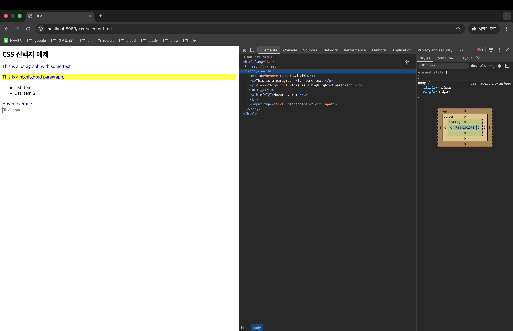
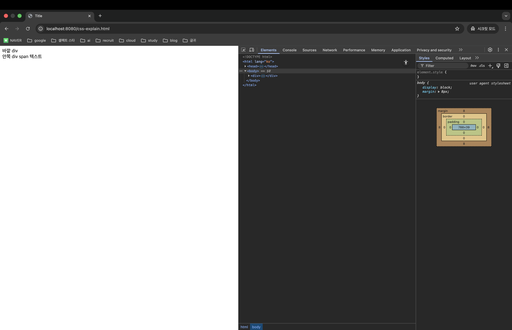
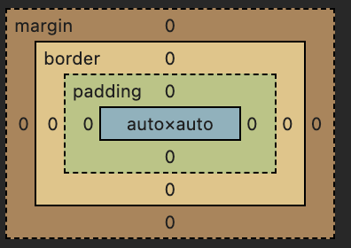
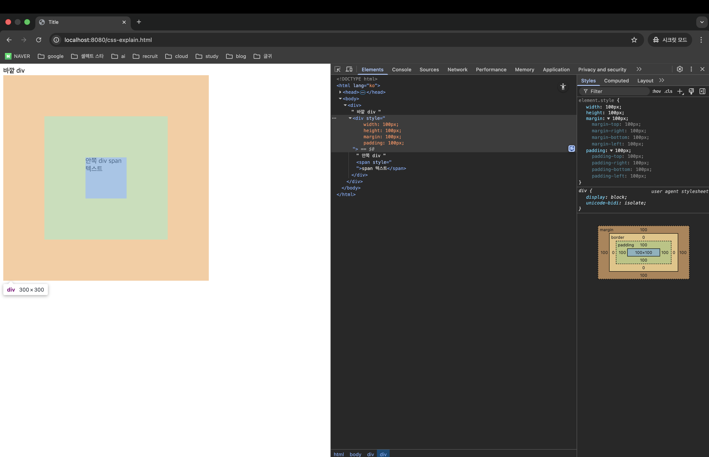

> 해당 포스팅은 인프런의 [백엔드 개발자에 의한, 백엔드 개발자들을 위한 프론트엔드 강의 - 기본편](https://inf.run/DQ8mU)를 참조하여 만들었습니다.


## css를 적용하는 방법과 선택자

이번에는 css를 적용하는 방법과 선택자에 대해 알아보도록 하겠다.

CSS는 Cascading Style Sheets의 약자로, HTML 태그에 시각적인 스타일을 입히기 위한 언어이다. HTML이 웹 페이지의 "구조"를 담당한다면, CSS는 "표현"을 담당하는 것이다. 백엔드 개발자
관점에서 보자면, HTML은 데이터의 형식을 정의하는 부분이고 CSS는 그 데이터를 어떻게 보여줄지를 정의하는 부분이라고 이해하면 좋다. 이런 식으로 구조와 표현을 분리하는 것은 백엔드의 MVC 패턴에서 모델과 뷰를
분리하는 것과 비슷한 맥락이다.

### HTML 페이지에 css를 적용하는 방법

먼저, HTML 페이지에 css를 적용하는 방법에 대해 알아보자. 총 3가지 방법이 존재한다. 그 중에 2개는 앞에서 봤던 방법인데 한번 알아보자.

``` html
<!DOCTYPE html>
<html lang="ko">
<head>
    <meta charset="UTF-8">
    <link rel="stylesheet" href="./css-selector.css">
    <style>
      .custom-style {
        font-size: 30px;
      }
    </style>
    <title>Title</title>
</head>
<body>
  안녕하세요. <span class="custom-style" style="font-size: 30px;">개발자 Robert</span> 입니다.
</body>
</html>
```

먼저, link 태그를 통해 css를 적용하는 방법이 존재한다. 이 경우는 별도의 css 파일이 필요하다. 그리고 html 태그에 style 속성을 추가하여 적용하는 방법이 존재한다. 이렇게 태그 내에 속성을
지정하는 방법을 inline으로 지정한다라고 표현한다. 그리고 이전에는 다루지 않았지만 하나 더 존재하는데 head 태그 내에 style 태그를 선언하여 그 안에 css를 지정하는 방법이 존재한다.

이 3가지 방법을 정리해보자면 다음과 같다.

- **외부 스타일 시트(External Stylesheet)**: link 태그로 별도의 css 파일을 불러오는 방법
- **내부 스타일 시트(Internal Stylesheet)**: head 태그 안의 style 태그에 css를 작성하는 방법
- **인라인 스타일(Inline Style)**: html 태그의 style 속성에 직접 css를 작성하는 방법

이 중에 일반적으로 권장되는 방법은 link 태그를 사용해서 별도의 css 파일을 불러오는 방법이고 불가피하다면 다른 2가지 방법을 시도하면 좋을 것 같다. 이렇게 style 태그를 사용하는 방법과 inline으로
style을 지정하는 방법은 html 문서내에 css가 섞여 있기 때문에 가독성이 떨어지고 html 코드 용량이 늘어나서 불필요한 트래픽을 유발할 수 있다. 반면에 css 파일이 존재하고 이렇게 link 태그를
이용해서 css를 사용하면 css 파일이 변경되지 않으면 캐시되도록 처리할 수 있다. 그러면 나머지 html 파일은 순수한 html 파일만 남게 될 것이고 그러면 그 html 파일만 주고 받으면 용량이 훨씬 줄어들
것이다.

이 캐싱 부분이 외부 스타일 시트의 가장 큰 강점이다. 백엔드 개발자라면 HTTP 캐시 헤더(`Cache-Control`, `ETag`, `Last-Modified` 등)에 익숙할 것이다. CSS 파일을 별도로
분리해두면 브라우저가 이 정적 리소스를 캐시해두고, 다음 페이지 방문 시에는 다시 다운로드하지 않는다. 또한 한 번 다운로드된 CSS는 같은 도메인의 모든 페이지에서 재활용되기 때문에 전체적인 트래픽이 크게
줄어든다. 만약 모든 스타일이 inline으로 들어가 있다면 페이지마다 같은 스타일 코드를 매번 다시 받아야 하니 그 차이는 매우 커진다.

또한 관심사의 분리(Separation of Concerns) 관점에서도 외부 스타일 시트가 유리하다. HTML은 구조에만 집중하고, CSS는 스타일에만 집중하도록 분리해두면 디자이너와 개발자의 협업도 수월해지고
유지보수도 쉬워진다.

우리가 css를 공부하면서 선택자에 대한 개념을 알아야 한다. 모든 css 속성을 inline으로 지정을 하면 한번에 여러 html 태그의 속성을 지정할 수가 없어서 지나치게 코드의 중복이 많아지고 우리가 UI 관련
템플릿을 사용한다면 반드시 선택자를 잘 이해하고 있어야 한다.

### 선택자의 종류 - 태그 선택자

선택자라는 것은 html 태그를 지정하는 방법을 의미한다. 어떤 html 태그에 css 속성이 적용되어야 하는지 지정을 하는 문법인 것이다. 선택자 문법에는 다양한 종류가 존재하는데 먼저 설명드릴 선택자는 바로 태그
선택자이다.

``` css
p {
  color: blue;
}
```

태그 선택자는 단순히 태그 이름만 나온다. 위의 예시는 p 태그의 글자 색을 변경하는 css 문법인데 html 태그에는 문단을 표현하기 위해 p 태그가 존재한다. 이 처럼 태그 이름만을 지정해서 속성을 지정해 줄 수
있다. 즉, 위와 같이 적용하면 html 문서 내에 있는 p 태그들에게 해당 스타일이 전부 적용되는 것이다.

여기서 한 가지 주의할 점은 태그 선택자는 그 효과가 매우 광범위하다는 것이다. 문서 내의 모든 p 태그에 일괄 적용되기 때문에, 특정 영역에만 다른 스타일을 적용하고 싶을 때는 클래스 선택자나 id 선택자를 함께
활용해야 한다. 그래서 보통 태그 선택자는 페이지 전체의 기본 스타일(예: body의 폰트, 모든 a 태그의 기본 색상 등)을 잡을 때 주로 사용하고, 세부적인 스타일은 클래스 선택자로 처리하는 패턴이 일반적이다.

### 선택자의 종류 - 클래스 선택자

``` css
.highlight {
  background-color: yellow;
}
```

다음은 클래스 선택자를 알아 볼 것이다. 클래스 이름 앞에 점을 붙이면 되는데 highlight라는 클래스 이름을 가진 태그들에게 해당 스타일이 적용된다. 위의 문법은 `background-color`라는 스타일을
적용해주고 있는데 말 그대로 배경 색을 노란색으로 변경하겠다라는 의미이다. 그러면 아래의 html 태그는 위의 css들이 적용되었을 때 어떻게 될까? 둘 중 하나만 적용이 될까?

``` html
<p class="highlight">hi</p>
```

둘 중 하나만 적용되는 것은 아니고 2가지 스타일이 동시에 적용이 된다. 그런데 똑같은 속성인데 서로 다른 값이라면 어떻게 지정이 될까? 예를 들어 p 태그에 `color: blue;`라고 지정이 되어 있는데 클래스
선택자에서 `color: yellow;`라고 해주면 어떻게 될까? 이것은 css 우선순위에 대한 문제인데 이는 뒤에 가서 어떻게 될지 알 수 있을 것이다.

클래스 선택자는 CSS에서 가장 많이 사용되는 선택자라고 봐도 무방하다. 그 이유는 재사용성이 가장 뛰어나기 때문이다. 한번 정의해놓은 클래스를 여러 태그에 자유롭게 적용할 수 있기 때문에 일관된 스타일을
유지하면서도 코드 중복을 줄일 수 있다. 백엔드 개발에서 공통 로직을 메서드로 추출해두고 여러 곳에서 호출하는 것과 비슷한 발상이라고 보면 된다.

### 선택자 종류 - id 선택자

``` css
#header {
  font-size: 24px;
}
```

다음으로는 id 선택자이다. id도 class랑 동일하게 해당 id 속성을 가진 html 태그에 해당 스타일을 적용하는 것이다. 위의 `font-size`는 글자 크기를 조절하는 스타일이다. 그러면 여기서 드는
의문이 있을 것이다.

> class랑 id의 차이는 무엇일까요?

id는 html 문서 내에 유일한 값이어야 하고 오직 1개만 존재해야 한다. 반면에 class의 경우 html 문서 내에 여러개가 존재해도 괜찮다. 또한, 하나의 html 태그가 여러개의 클래스를 가지는 것도
가능하다. 아래와 같이 말이다.

``` html
<div class="highlight checked"></div>
```

위의 예시처럼 한 태그에 여러 클래스를 부여할 때는 공백으로 구분해주면 된다. 위의 div는 `highlight` 클래스의 스타일과 `checked` 클래스의 스타일을 모두 적용받게 된다. 이런 특성 덕분에 클래스를
마치 "스타일 조각"처럼 조합하여 사용할 수 있다. 예를 들어 "버튼"이라는 기본 스타일과 "큰 사이즈"라는 스타일을 따로 만들어 두고 `<button class="btn btn-large">`처럼 조합해서 사용하는
식이다. 이런 패턴은 Bootstrap이나 Tailwind CSS 같은 유명한 CSS 프레임워크에서도 적극적으로 활용된다.

다만, html 문서 내에 id가 하나만 존재해야 한다는 사항은 문법적으로 강제되는 사항은 아니다. html 문서 내에 동일한 id가 여러개 있어도 웹 페이지는 정상적으로 동작은 한다. 그래도 가급적 지켜서 id와
class 속성을 활용하는게 좋다.

이 규칙을 지켜야 하는 이유는 단순히 컨벤션이 아니라 실용적인 이유 때문이다. 자바스크립트의 `document.getElementById`는 id가 유일하다는 가정 하에 가장 먼저 발견된 태그 하나만 반환한다. 만약
같은 id가 여러 개 있다면 우리가 의도한 태그가 아닌 다른 태그가 선택될 수도 있고, 이런 버그는 추적하기가 매우 어렵다. 그래서 정리하자면, **id는 "그 페이지의 단 하나뿐인 요소"를 가리킬 때**(예:
페이지의 헤더, 메인 콘텐츠 영역, 특정 모달 등) 사용하고, **클래스는 "재사용 가능한 스타일이나 분류"를 표현할 때** 사용한다고 기억하면 좋다.

### 선택자의 종류 - 자식 선택자

``` html
<ul>
  <li>List item 1</li>
  <li>List item 2</li>
</ul>
```

``` css
ul > li {
  list-style-type: square;
}
```

다음은 자식 선택자이다. 자식 선택자는 위와 같이 작성해주면 된다. 해당 선택자의 의미는 ul 태그의 자식 태그들 중에 li 태그들에게 해당 속성을 지정하겠다라는 의미이다. 여기서 1가지 유심히 볼 께 있는데 위의
자식 선택자에서 `>`를 빼면 조금 의미가 달라진다.

``` css
ul li {
  list-style-type: square;
}
```

이렇게 했을 때 어떤 차이가 있냐면 위의 `>`가 있는 경우는 ul 태그의 바로 아래에 있는 깊이의 자식 태그들에게 해당 속성을 지정해주는 반면에 `>`가 없는 경우는 ul 하위에 있는 모든 자식 즉, 바로 아래가
아닌 후손 태그들까지도 적용이 되는 것이다.

조금 더 구체적인 예시로 살펴보자. 아래와 같은 HTML 구조가 있다고 해보자.

``` html
<ul>
  <li>1단계 항목</li>
  <li>
    2단계가 있는 항목
    <ul>
      <li>2단계 항목</li>
    </ul>
  </li>
</ul>
```

이 경우 `ul > li`로 선택하면 가장 바깥쪽 ul의 직속 자식인 "1단계 항목"과 "2단계가 있는 항목"만 선택된다. 반면에 `ul li`로 선택하면 "2단계 항목"까지 모두 포함되어 4개의 li 태그가 모두
선택된다. 백엔드에서 자주 다루는 트리 구조를 떠올려 보면, `>`는 바로 직속 자식만, 공백은 모든 후손 노드를 의미한다고 이해하면 좋다.

이 차이를 알고 있어야 의도하지 않은 곳에 스타일이 적용되는 실수를 막을 수 있다. 예를 들어 메뉴를 만들 때 메뉴 안에 서브 메뉴가 있다면, 후손 선택자를 사용하면 서브 메뉴의 li까지 같은 스타일이 적용되어버려서
의도하지 않은 결과가 나올 수 있다.

### 선택자의 종류 - 가상 클래스 선택자

``` css
a:hover {
    color: red;
}
```

다음은 가상 클래스 선택자에 대해 알아보자. 위의 예시는 가상 클래스 선택자의 전형적인 예시인데 `a:hover`의 의미는 a 태그의 마우스를 가져다가 되었을 때 해당 스타일을 적용하라는 의미이다.

여기서 "가상 클래스(pseudo-class)"라는 이름이 붙은 이유는, 실제로 HTML에 클래스 속성을 부여한 것은 아니지만 마치 그런 클래스가 임시로 부여된 것처럼 동작하기 때문이다. 사용자가 마우스를 올리면
일시적으로 `:hover`라는 가상의 상태가 적용되고, 마우스를 떼면 그 상태가 사라지는 식이다.

`:hover` 외에도 자주 사용되는 가상 클래스가 몇 가지 더 있다. `:focus`는 입력 필드에 포커스가 들어왔을 때, `:active`는 클릭하는 순간에, `:visited`는 이미 방문한 링크에 적용된다.
이런 가상 클래스 덕분에 자바스크립트 없이도 사용자의 인터랙션에 따른 시각적 피드백을 줄 수 있다. 예를 들어 버튼에 마우스를 올렸을 때 색이 변하는 효과를 자바스크립트로 구현하려면 이벤트 리스너를 등록해야 하지만,
CSS의 `:hover`만 사용하면 코드 한 줄로 끝낼 수 있다. 이는 백엔드 개발자가 처음 봤을 때 "이게 가능하다고?"라고 놀라는 부분 중 하나이다.

### 선택자의 종류 - 속성 선택자

``` css
input[type="text"] {
    border: 1px solid gray;
}
```

마지막으로 속성 선택자가 존재한다. 속성 선택자는 html 태그에 있는 속성이 특정한 값인 요소들을 css 속성으로 적용을 시킬 수 있다. 위의 예시는 input 태그중에 type 속성이 text인 태그들에게만 해당
스타일을 적용하겠다라는 의미이다.



input 태그처럼 type 속성에 따라 동작이 완전히 달라지는 태그에서 속성 선택자가 특히 유용하다. 앞서 자바스크립트 포스팅에서 input의 type을 `text`, `number`, `url` 등으로 설정해서
유효성 검사를 하는 방법을 살펴봤었다. 그런데 이렇게 type이 달라도 input 태그라는 점은 같기 때문에 단순한 태그 선택자로는 type별로 다른 스타일을 줄 수가 없다. 그럴 때 속성 선택자를 사용하면
type별로 다른 스타일을 깔끔하게 적용할 수 있다. 예를 들어 텍스트 입력란에는 회색 테두리, 숫자 입력란에는 파란색 테두리를 주고 싶을 때 속성 선택자가 빛을 발하는 것이다.

### css 우선순위

다음으로 css 우선순위에 대해 알아보겠다. css를 적요하는 방법이나 선택자에 따라서 우선순위가 적용된다. 우선순위 순은 높은순으로 아래와 같다.

> css 우선순위
>
> - `!important` 적용
> - inline style 적용
> - id 선택자
> - 클래스 선택자
> - 태그 선택자
> - 가상 클래스 선택자

위와 같이 css 우선순위가 결정되며 여기서 `!important`라는 것을 알아보겠다. 해당 부분은 css 스타일 속성 중에 이건 가장 중요하게 적용되고 싶을 때 css 스타일 속성 값 끝에 적어주며, 실무에서는
사용되는 것을 권장하고 있지 않다.

`!important`의 사용을 권장하지 않는 이유에 대해 좀 더 풀어 보자면, 이 키워드는 다른 모든 우선순위 규칙을 무시하고 강제로 적용되기 때문에 한번 사용하기 시작하면 디버깅이 매우 어려워진다. 어떤 스타일이
의도대로 적용되지 않을 때 "왜 이게 안 먹지?" 하면서 코드를 따라가다 보면 어딘가에 숨어있는 `!important`가 범인인 경우가 많다. 또한 `!important`는 또 다른 `!important`로만 덮어쓸
수 있기 때문에, 한번 쓰기 시작하면 점점 더 많은 `!important`가 추가되는 악순환이 생긴다. 백엔드로 비유하자면, 정상적인 메서드 호출 흐름을 따르지 않고 리플렉션이나 전역 변수로 강제로 동작을 바꾸는
것과 비슷한 느낌이라고 보면 좋겠다. 가능한 정상적인 우선순위 규칙 안에서 해결하는 것이 유지보수에 훨씬 좋다.

그리고 우선순위 규칙을 보면 일반적으로 "더 구체적으로 지정한 선택자가 우선한다"라는 원칙이 있다는 것을 알 수 있다. id 선택자는 페이지에서 단 하나의 요소만 가리키니 가장 구체적이고, 클래스는 그보다 덜
구체적이며, 태그 선택자는 가장 광범위하니 가장 낮은 우선순위를 갖는 것이다. 이 원칙을 머릿속에 두면 우선순위를 외우지 않아도 자연스럽게 이해할 수 있다.

## 주요 속성들

이번에는 css의 주요 속성들에 대해 알아보도록 하겠다. css에는 아주 다양한 속성들이 존재한다. 사실 모든 것을 알아 볼 수는 없고 기본이 되는 속성들에 대해서 살펴보도록 하겠다.



우리는 css 속성들을 알아보기 위해 위의 화면처럼 개발자 도구에 element탭에 `element.style`에 하나하나 스타일을 적용해보면서 진행해보려고 한다.

이렇게 개발자 도구에서 직접 스타일을 변경해보면서 학습하는 것을 강력히 추천한다. CSS를 코드로만 보고 머릿속으로 그려보는 것보다, 실제로 값을 바꿔보면서 화면이 어떻게 변하는지 눈으로 확인하는 것이 훨씬 빠르게
익숙해지는 길이다. 그리고 개발자 도구에서 변경한 내용은 페이지를 새로고침하면 사라지기 때문에 부담 없이 이것저것 시도해볼 수 있다는 장점도 있다.

### 텍스트

텍스트의 폰트 사이즈를 적용해보려고 한다면 어떻게 될까? 바로 아래와 같이 `font-size`속성을 지정해주면 된다.

``` css
p {
  font-size: 30px;
}
```

여기서 단위로 `px`을 사용했는데 이는 픽셀(pixel)의 약자로 절대 단위이다. 화면의 픽셀 개수를 기준으로 하기 때문에 어떤 환경에서든 일정한 크기를 유지한다. CSS에는 `px` 외에도 `em`, `rem`,
`%` 같은 상대 단위도 존재하는데, 우선은 가장 직관적인 `px`로 익혀두면 좋다.

다음으로 텍스트의 글꼴을 지정해줄 수도 있다. 미리 다운받은 폰트가 있거나 브라우저 내장 폰트를 적용하려면 아래와 같이 `font-family` 속성을 통해 지정해줄 수 있다.

``` css
p {
  font-size: 30px;
  font-family: math;
}
```

`font-family`를 지정할 때 주의할 점은, 사용자의 브라우저나 운영체제에 해당 폰트가 설치되어 있지 않으면 그 폰트가 적용되지 않는다는 것이다. 그래서 실무에서는 보통 여러 개의 폰트를 콤마로 구분해서
나열한다. 예를 들어 `font-family: 'Pretendard', 'Apple SD Gothic Neo', sans-serif;`처럼 작성하면 첫 번째 폰트가 없으면 두 번째 폰트로, 그것도 없으면 마지막의
일반적인 sans-serif 계열 폰트로 대체된다. 이를 폰트 폴백(fallback)이라고 부른다.

다음으로 텍스트의 굻기를 지정해줄 수 있다. 바로 `font-weight`라는 속성을 이용하여 지정을 아래와 같이 할 수 있다. 아래의 숫자 값이 증가할 수록 굻기가 굻어진다.

``` css
p {
  font-size: 30px;
  font-family: math;
  font-weight: 700;
}
```

이 숫자 값에는 약속이 있는데, 100부터 900까지 100 단위로 사용한다. 일반적으로 400이 보통 굵기(normal), 700이 굵게(bold)에 해당한다. 그래서 `font-weight: 700;`은
`font-weight: bold;`라고 적은 것과 같은 효과를 낸다. 다만 폰트에 따라 모든 굵기 단계를 지원하지 않는 경우도 많다. 예를 들어 어떤 폰트는 400과 700만 제공할 수 있는데, 이 경우 500을
지정해도 가장 가까운 400이 적용된다.

다음으로 알아 볼 속성은 정렬 관련 기능이다. 우리가 문서 작업을 하다보면 가운데 정렬같은 것을 하곤 한다. 이때 `text-align` 속성을 지정해줄 수 있는데 만약 해당 선택자에 자식 선택자가 없거나 해당
선택자가 inline 태그이면 아무 효과를 못 본다. 꼭 자식 태그가 존재하는 블록 태그에 지정을 해야한다.

``` css
div {
  text-align: center;
}
```

`text-align`이 inline 태그에 안 먹히는 이유는 이 속성이 "블록 태그 안의 인라인 콘텐츠를 어떻게 정렬할지"를 정하는 속성이기 때문이다. 그래서 정렬할 대상이 되는 인라인 자식이 있어야만 의미가
있다. 값으로는 `center` 외에도 `left`(왼쪽 정렬, 기본값), `right`(오른쪽 정렬), `justify`(양쪽 정렬)가 있다.

### 색상

다음으로 색상 관련 속성들을 알아보자. 텍스트의 색상을 변경하려면 아래와 같이 `color` 속성을 쓰면 된다. 해당 값으로는 영어로 색깔을 쓰면 자동 반영되거나 16진수 색깔 표시법을 기입해주면 된다.

``` css
p {
  color: red;
  color: #0f0f0f;
}
```

색상을 지정하는 방법은 위에서 설명한 두 가지 외에도 여러 가지가 있다. 영어 색상명(`red`, `blue`, `aliceblue` 등)은 직관적이지만 표현할 수 있는 색이 한정적이다. 16진수 표기법(
`#0f0f0f`)은 RGB 각각을 0~255 범위에서 16진수 두 자리로 표현한 것으로, 거의 모든 색을 표현할 수 있다. 이 외에도 `rgb(15, 15, 15)`처럼 10진수로 RGB를 직접 적는 방법, 그리고
투명도까지 함께 지정할 수 있는 `rgba(15, 15, 15, 0.5)` 같은 방법도 있다. 실무에서는 디자이너로부터 받은 디자인 시스템에 정의된 16진수 색상 코드를 그대로 사용하는 경우가 가장 많다.

위의 예시에서는 `color`가 두 번 지정되어 있는데, 이 경우 나중에 작성된 `#0f0f0f`가 최종적으로 적용된다. 같은 속성이 여러 번 지정되면 나중에 작성된 값이 이전 값을 덮어쓰는 것이 CSS의 기본
동작이다. 이 부분도 우선순위와 관련된 중요한 특성이다.

다음으로 배경색을 변경하는 법에 대해 알아보자. 배경색을 바꾸는 방법으로는 `background-color`를 통해 변경이 가능하고 값은 색깔과 동일하게 적용이 가능하다.

``` css
div {
  background-color: yellow;
}
```

다음으로 background에 이미지도 넣을 수 있는데 이 백그라운드의 이미지 같은 경우에 실제 이미지가 필요하다. 만약 이미 프로젝트 경로에 이미지가 있다면 해당 이미지로 혹은 외부에 있다면 외부 경로를 입력해주면
된다.

``` css
div {
  background-image: url("./image.png");
}
```

해당 경로는 css 파일 기준으로 경로를 지정해주면 된다. 하지만 이렇게 이미지를 넣게 되면 이미지 크기에 따라 해당 태그 배경 이미지가 너무 작아서 반복되서 나오거나 너무 크게 나올 수도 있다. 이럴 때는 해당
태그의 크기를 키우거나 줄이는 방법을 택헤야 한다. 그래도 뭔가 이미지가 너무 작아서 반복되서 나오면 아래와 같이 나온다.

``` css
div {
  background-image: url("./image.png") no-repeat;
}
```

여기서 한 가지 짚고 넘어갈 부분이 있다. `background-image`의 경로가 "css 파일 기준"이라는 점이다. 이는 백엔드 개발자가 자주 실수하는 부분 중 하나인데, HTML 파일에서 이미지를 참조할 때는
HTML 파일 기준으로 경로를 적어야 하지만, CSS 파일 안에서 이미지를 참조할 때는 CSS 파일 기준으로 적어야 한다. 같은 이미지라도 어느 파일에서 참조하느냐에 따라 상대 경로가 달라질 수 있으니 주의하자.

### 크기



다음으로 크기에 대해 알아보겠다. 크기를 알아보기 전에 먼저 용어정리부터 해보고 넘어가자. 위의 사각형 기준으로 사각형 가로 길이는 **width**라고 부르고 세로 길이는 **height**라고 부른다. 그리고 이
사각형의 안쪽에 다른 영역이 존재한다면 이 영역간에 여백을 줄 수가 있는데 이 안쪽 여백을 **padding**이라고 한다. 그리고 사각형 바깥쪽에 다른 영역이 존재할 수도 있을텐데 이 사각형의 바깥쪽에 있는 여백을
**margin**이라고 한다. 그럼 실제 css 적용에 대해 알아보자.

이러한 width, height, padding, margin, border의 구성을 CSS에서는 **박스 모델(Box Model)**이라고 부른다. CSS에서 모든 HTML 요소는 사각형 박스로 취급되며, 이
박스가 어떤 구조로 이루어져 있는지를 이해하는 것이 CSS 학습의 가장 기본이다. 안쪽부터 바깥쪽으로 나열하면 콘텐츠 영역(width × height) → padding(안쪽 여백) → border(테두리) →
margin(바깥쪽 여백) 순서로 둘러싸여 있는 구조이다.

먼저, width부터 지정해보자. 바로 아래와 같이 말이다.

``` css
div {
  width: 100px;
}
```

다음으로는 height를 지정하는 법에 대해 알아보자. 바로 아래와 같이 적용을 진행하면 된다.

``` css
div {
  width: 100px;
  height: 100px;
}
```

width와 height의 단위로는 `px` 외에도 `%`(부모 요소의 크기에 대한 비율)나 `vw`/`vh`(뷰포트의 너비/높이에 대한 비율) 같은 상대 단위를 사용할 수 있다. 반응형 웹을 만들 때는 이런 상대
단위를 적극적으로 활용하지만, 우선은 절대 단위인 `px`로 감을 잡으면 좋다.

다음으로 margin을 지정하는 방법에 대해 알아보겠다. 바로 아래와 같이 적용을 진행하면 된다.

``` css
div {
  width: 100px;
  height: 100px;
  margin: 100px;
}
```

다음으로 padding을 지정해보자. 바로 아래와 같이 지정이 가능하다.

``` css
div {
  width: 100px;
  height: 100px;
  margin: 100px;
  padding: 100px;
}
```

참고로, marign과 padding 속성 같은 경우 우리는 그냥 위와 같이 사용을 했는데 아래와 같이 top, bottom, left, right 속성을 따로 지정해줄 수 있다.



`margin: 100px;`처럼 한 번에 지정하면 상하좌우 모두에 동일한 값이 적용되지만, 방향별로 다른 값을 주고 싶다면 `margin-top`, `margin-right`, `margin-bottom`,
`margin-left`처럼 각각 따로 지정할 수 있다. padding도 마찬가지이다.

또한 단축 표기법도 있는데, `margin: 10px 20px;`처럼 두 개의 값을 쓰면 첫 번째 값은 상하, 두 번째 값은 좌우에 적용되고, `margin: 10px 20px 30px 40px;`처럼 네 개의 값을
쓰면 시계 방향으로 위, 오른쪽, 아래, 왼쪽 순서로 적용된다. 이런 단축 표기법은 코드를 줄여주기 때문에 실무에서 자주 사용된다.

여기서 margin과 padding을 헷갈리지 않는 팁을 하나 주자면, "padding은 박스 안쪽의 여백이라 배경색이 적용되고, margin은 박스 바깥쪽의 여백이라 배경색이 적용되지 않는다"라고 기억하면 좋다.
즉, 어떤 div에 노란색 배경을 주고 padding을 100px로 지정하면 그 100px의 안쪽 여백도 노란색으로 칠해지지만, margin을 100px로 지정한 부분은 노란색이 칠해지지 않고 투명하게 남는다. 이
차이를 이해하면 어떤 상황에서 padding을 쓰고 어떤 상황에서 margin을 써야 할지 자연스럽게 알 수 있다.

### 테두리

다음으로는 테두리에 대해 알아보겠다. 테두리는 `border`를 이용하면 된다.

``` css
div {
  width: 100px;
  height: 100px;
  margin: 100px;
  padding: 100px;
  border: 1px solid gray;
}
```

`border: 1px solid gray;`라는 표현을 좀 더 풀어 보면, 이는 세 가지 속성을 한 번에 지정한 단축 표기법이다. 첫 번째 `1px`은 테두리의 두께(`border-width`), 두 번째
`solid`는 테두리의 종류(`border-style`), 세 번째 `gray`는 테두리의 색상(`border-color`)을 의미한다. 테두리 종류로는 `solid`(실선) 외에도 `dashed`(점선),
`dotted`(점), `double`(이중선) 등이 있다.

이제 테두리에 둥근 테두리로 만들어보자. 이때는 `border-radius` 속성을 이용해주면 된다.

``` css
div {
  width: 100px;
  height: 100px;
  margin: 100px;
  padding: 100px;
  border: 1px solid gray;
  border-radius: 20px;
}
```

`border-radius`의 값을 어떤 사각형의 한 변 길이의 절반으로 지정하면 그 변에 해당하는 모서리가 완전한 원이 된다. 예를 들어 `width: 100px; height: 100px;`인 정사각형에
`border-radius: 50px;`을 주면 완전한 원이 그려진다. 이를 활용해서 둥근 프로필 이미지나 버블 모양의 채팅 말풍선 등을 만들 수 있다.

`border`랑 동일한 속성이 존재하는데 바로 `outline`이다.

``` css
div {
  width: 100px;
  height: 100px;
  margin: 100px;
  padding: 100px;
  border: 1px solid gray;
  border-radius: 20px;
  outline: 1px solid gray;
}
```

그런데 `border` 속성과 `outline` 속성에는 중요한 차이가 존재한다. border 속성을 지정해주면 해당 지정해준 태그의 자식 내용과 태그들이 위치가 변경이 된다. 하지만 outline 속성은 변경되지
않는다. 즉, `border`는 면적이 존재한다. 선의 길이만큼 면적이 되는 것이고 `outline`의 경우 선의 면적이 되지 않는다.

이 차이를 좀 더 풀어서 설명하자면, border는 앞서 설명한 박스 모델의 일부로서 박스의 크기에 영향을 주는 반면, outline은 박스 모델 바깥에 따로 그려지는 선이라 박스의 크기에는 전혀 영향을 주지
않는다. 그래서 border를 추가하거나 두께를 변경하면 옆에 있던 다른 요소들의 위치가 함께 밀려나지만, outline은 그런 영향을 주지 않는다.

이런 특성 때문에 두 속성의 활용처가 조금 다르다. border는 주로 영구적인 디자인 요소(카드의 테두리, 입력 폼의 외곽선 등)에 사용되고, outline은 일시적인 강조 효과(포커스가 들어왔을 때의 표시 등)에
사용된다. 실제로 input 태그에 포커스가 들어왔을 때 브라우저가 자동으로 그려주는 파란색 테두리가 바로 outline으로 구현되어 있다. 만약 그것이 border였다면 포커스가 들어올 때마다 input의 크기가
살짝씩 커져서 주변 레이아웃이 흔들렸을 것이다.

## JavaScript와 함께 사용하기

지금부터 자바스크립트와 함께 사용하면서 css를 변경하는 경험을 해보도록 하겠다. 우리가 흔히 웹페이지에 접속해서 어떤 버튼이나 요소를 누르거나 행동을 했을 때 UI가 변경되는 경험은 해본 적이 있을 것이다. 마치
어떤 버튼을 눌렀을 때 전구가 켜지거나 꺼지는 것처럼 말이다. 이것은 html 자체내에서 제공해주는 것들도 있지만 꽤 많은 상황에서는 css 속성을 적용해서 처리한다. 이때 css를 직접 수정하기 보다는 해당
html 요소에 클래스를 추가하거나 제거하는 식으로 css가 적용되거나 적용되지 않는 식으로 만든다. 아래의 예제 코드를 보면 이해가 잘 될 것이다.

``` html
<!DOCTYPE html>
<html lang="ko">
<head>
    <meta charset="UTF-8">
    <link rel="stylesheet" href="./class-toggle.css">
    <title>Title</title>
</head>
<body>
<div class="box" id="my-box"></div>
<button onclick="toggleBorder()">테두리 변경</button>
<script src="./class-toggle.js"></script>
</body>
</html>
```

``` css
.box {
    width: 200px;
    height: 200px;
    border: 2px solid black;
    margin: 20px;
}

.bold-border {
    border: 5px solid black;
}
```

``` js
function toggleBorder() {
    const box = document.getElementById('my-box');
    box.classList.toggle('bold-border');
}
```

위의 코드를 보면 div에 class 선택자로 스타일을 적용해두었고 해당 태그를 클릭했을 때 자바스크립트 코드를 보명 `document.getElementById`로 해당 id 선택자를 가진 태그를 고르고
`toggleBorder`를 실행함으로 클래스 선택자를 추가해두었고 이에 따라 스타일 속성이 적용되고 풀리고를 볼 수 있을 것이다.

여기서 핵심은 자바스크립트로 직접 스타일을 변경하는 게 아니라 **클래스를 추가/제거하는 방식**으로 스타일을 토글한다는 점이다. 자바스크립트에서는
`element.style.border = '5px solid black';`처럼 직접 스타일을 변경할 수도 있지만, 이런 방식은 권장되지 않는다. 그 이유는 두 가지이다.

첫째, 관심사의 분리 원칙이 깨진다. 스타일은 CSS 파일에 모여 있어야 유지보수가 쉬운데, 자바스크립트 코드 안에 스타일 값을 직접 작성하면 스타일이 여러 곳에 흩어지게 된다. 디자이너가 색상을 바꾸려고 할 때
CSS 파일만 보면 안 되고 자바스크립트 파일까지 뒤져야 하는 상황이 발생하는 것이다.

둘째, 재사용성과 일관성이 떨어진다. 만약 스타일을 세부 속성마다 바꿔야 한다면 자바스크립트로 일일이 변경해야 하지만, 클래스 하나만 추가해도 그 클래스에 정의된 모든 속성이 한 번에 적용된다.

`classList`는 HTML 요소가 가진 클래스 목록을 다루기 위한 객체로, 위에서 사용한 `toggle` 외에도 몇 가지 유용한 메서드를 제공한다.

- `classList.add('클래스명')`: 해당 클래스를 추가한다. 이미 있으면 아무 일도 일어나지 않는다.
- `classList.remove('클래스명')`: 해당 클래스를 제거한다.
- `classList.toggle('클래스명')`: 해당 클래스가 있으면 제거하고, 없으면 추가한다.
- `classList.contains('클래스명')`: 해당 클래스가 포함되어 있는지 boolean으로 반환한다.

위 예제에서는 `toggle`을 사용했기 때문에 버튼을 한 번 누르면 `bold-border` 클래스가 추가되어 두꺼운 테두리가 적용되고, 다시 한 번 누르면 클래스가 제거되어 원래 상태로 돌아가는 동작이
만들어진다. 이런 패턴은 다크모드 토글, 메뉴 펼침/접힘, 모달 열기/닫기 등 웹 UI에서 굉장히 자주 사용되는 패턴이니 잘 익혀두면 좋다.

여기까지가 CSS의 기본 개념과 자바스크립트와의 결합까지 살펴본 내용이다. CSS는 처음에는 단순해 보여도 실제로 화면을 만들어 보면 의외로 까다로운 상황이 많이 생긴다. 직접 손으로 코드를 작성하고 개발자 도구로
이리저리 만져보면서 익숙해지는 것이 가장 좋은 학습법이다. 다음 포스팅에서는 또 다른 주제로 찾아오도록 하겠다.