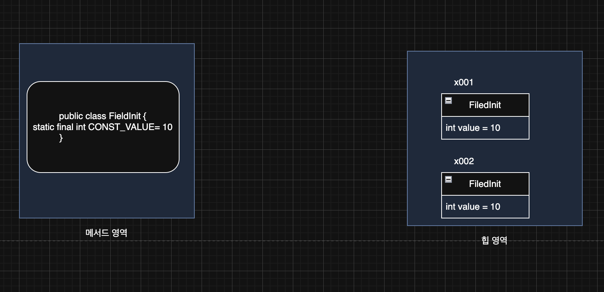

> 해당 블로그 글은 [영한님의 인프런 강의](https://inf.run/PuC6W)를 바탕으로 쓰여진 글입니다.

## final 변수와 상수1

`final`이라는 키워드는 마지막, 끝이라는 의미이다. 변수에 `final` 키워드가 붙으면 최초 할당 이후에 변경이 불가능하다. `final`은 변수뿐만 아니라 클래스, 메서드에도 붙을 수 있다. 일단 지금은 변수에 붙은 `final`에 대해서 확인해보자.

``` java
package final1;

public class FinalLocalMain {
    public static void main(String[] args) {
        final int data1;
        data1 = 10;
//        data1 = 20;

        final int data2 = 10;
//        data2 = 20;

        method(10);
    }

    static void method(final int parameter) {
//        parameter = 20;
    }
}
```

위의 코드처럼 `final` 키워드가 붙은 변수는 재할당이 불가능하다. 여기서는 지역변수와 파라미터로 재할당이 되는지 여부를 확인해보았다. `final` 키워드가 붙은 변수를 재할당하려고 시도한다면 자바는 컴파일 에러를 발생시킨다.

### final - 필드(멤버변수)

그러면 멤버변수에 `final`을 사용해 초기화하는 과정을 살펴보겠다.

``` java
package final1;

public class ConstructInit {

    final int value;

    public ConstructInit(int value) {
        this.value = value;
    }
}
```

`final` 멤버 변수 초기화 과정 중 1가지로 생성자에 주입받아서 초기화하는 방법이 있다. 또 한가지 방법으로는 아래와 같이 직접 초기화를 시키는 방법이 있다.

``` java
package final1;

public class FieldInit {

    static final int CONST_VALUE = 10;
    final int value = 10;
}
```

`final` 필드를 필드에서 초기화하면 이미 값이 설정되었기 때문에 생성자를 통해서도 초기화 할 수 없다. 코드에서 보는 것처럼 `static` 변수에도 `final` 을 선언할 수 있다.



`ConstructInit` 과 같이 생성자를 사용해서 `final` 필드를 초기화 하는 경우, 각 인스턴스마다 `final` 필드에 다른 값을 할당할 수 있다. 그런데 `FiledInit`과 같은 경우는 인스턴스 몇개를 생성하든 위와 같이 같은 값을 항상 가지게 된다. 하지만 이렇게 생각해보면 뭔가 낭비라고 생각이 든다. 생성자로 주입받는 코드는 인스턴스마다 다른 값을 가질 수 있기에 납득이 되지만 필드 초기화는 항상 같은 값을 가지기에 뭔가 메모리 낭비라고 생각이 든다. 모든 인스턴스가 같은 값을 사용하기 때문에 결과적으로 메모리를 낭비하게 된다.(물론 JVM에 따라서 내부 최적화를 시도할 수 있다) 또 메모리 낭비를 떠나서 같은 값이 계속 생성되는 것은 개발자가 보기에 명확한 중복이다. 이럴 때 사용하면 좋은 것이 바로 `static` 영역이다.

### static final

`static` 영역은 단 하나만 존재하는 영역이다. `CONST_VALUE` 변수는 JVM 상에서 하나만 존재하므로 앞서 설명한 중복과 메모리 비효율 문제를 모두 해결할 수 있다.

이런 이유로 필드에 `final` + 필드 초기화를 사용하는 경우 `static` 을 붙여서 사용하는 것이 효과적이다.

## final 변수와 상수2

상수는 변하지 않고, 항상 일정한 값을 갖는 수를 말한다 자바에서는 보통 단 하나만 존재하는 변하지 않는 고정된 값을 상수라 한다.

### 자바 상수 특징

- `static final` 키워드를 사용한다.
- 대문자를 사용하고 구분은 `_` (언더스코어)로 한다. (관례)
    - 일반적인 변수와 상수를 구분하기 위해 이렇게 한다.
- 필드를 직접 접근해서 사용한다.
    - 원래 변수는 필드 직접 접근을 피해야 한다고 캡슐화 시간때 말했다.
    - 하지만 상수는 값을 노출해도 값 변경이 불가하기에 노출해도 상관이 없다.
- 상수는 중앙에서 값을 하나로 관리할 수 있다는 장점도 있다.
    - 만약 상수를 사용하지 않는다면 값 변경이 있을 때마다 같은 숫자 값을 매번 변경해줘야 한다.
    - 그런데 상수를 이용하면 하나의 상수 값만 변경하면 되므로 유지보수 측면에서 뛰어나다.
    - 참고로 상수는 런타임에 변경이 불가하기에 변경하면 재시작을 해야 한다.
- 매직넘버의 문제도 해결한다.

> 📚 용어 정리
>
> 매직 넘버(Magic number)는 코드에서 하드 코딩된(literal value) 일정한 값을 의미하는 숫자나 문자열 등을 의미한다. 매직넘버는 코드 내에서 여러 곳에서 사용되지만 이 값의 의미나 목적은 코드에서 명확하게 알려지지 않았다. 매직 넘버는 가독성이 떨어지고 유지보수가 어렵게 만들며, 예상치 못한 버그를 발생시키는 원인이 될 수 있다. 따라서 매직 넘버 대신에 상수나 변수를 사용하는 것이 좋습니다. 변수나 상수를 사용하면 값을 변경할 때 일괄적으로 변경할 수 있으므로 코드의 유지보수성과 가독성이 향상된다.

## final 변수와 참조

`final` 을 기본형 변수에 사용하면 값을 변경할 수 없다 `final` 을 참조형 변수에 사용하면 참조값을 변경할 수 없다. 이 의미를 잘 알아야 한다.

``` java
public class Data {
    public int value;
}
```

``` java
public class Main {
    public static void main(String[] args) {
        final Data data = new Data();
        // data = new Data(); // 컴파일 에러

        data.value = 100;
        data.value = 200;
    }
}
```

위의 코드를 보면 Data타입의 data 참조변수가 final이다. 즉, 참조 값 변경이 불가능하다고 봉인 당한 것이다. 하지만 인스턴스 내부의 필드는 final이 아니기에 변경이 가능하다. 여기서 잘 봐야할께 인스턴스가 final로 인해 봉인당한게 아니고 참조변수가 봉인당한 것이다.

> 잘못된 지식이 있을 경우 댓글로 남겨주시면 빠르게 반영하겠습니다!