> 해당 포스팅은 인프런의 [제대로 파는 Git & GitHub - by 얄코(Yalco)](https://inf.run/VyuWK) 강의를 참조하여 작성한 글입니다.

## Github을 사용하는 이유

이번에는 깃허브가 무엇인지 알아보도록 하겠다. 깃허브는 개발자라면 어쩌면 이메일보다 더 많이 확인하는 서비스일 것이다. 깃과 마찬가지로 프로그래밍을 하려면 이 깃허브 또는 그와 같은 종류의 서비스의 사용법도 익혀둬야
한다. 깃이나 SVN, Mercurial등의 프로그램들이 Version Control System, 줄여서 VCS라면 깃허브와 같은 종류의 서비스들을 'Git 저장소 호스팅 서비스'라 부른다.

이들의 용도는 여럿이 있지만 메인은 개발 과정의 협업이다. 매우 작은 규모의 프로젝트가 아니라면 소프트웨어의 개발은 보통 여러 개발자들의 협엽을 통해 진행된다. 깃허브와 같은 git 저장소 호스팅 서비스들은 이들이
개발하는 프로젝트가 온라인으로 저장될 공간을 제공한다.

> 그런데 이런 용도라면 구글 드라이브나 드랍박스 같은 클라우드 서비스가 있지 않나요?

위의 클라우드 저장소 서비스를 사용한다면 팀원들이 프로젝트의 파일들을 한 공간에 업로드/다운로드 해가면서 작업을 할 것이다. 그런데 이런식으로 하면 여러 문제들이 발생한다. 예를 들어 한 팀원이 어느 파일에다가
작업한 내용을 클라우드에 업로드 했는데 또 다른 팀원이 같은 파일에 그와 다른 작업을 해서 업로드 한다면 먼저 올라간 파일은 그대로 덮어씌워진다. 먼저 작업한 팀원의 프로젝트가 클라우드와 동기화되고 나면 자신이
작업한 바가 모두 날라가게 되는 것이다. 이런 식으로는 프로젝트를 안정적으로 함께 개발하는 것은 불가능하다. 무엇보다도 각 팀원들의 작업들이 버전으로 관리되는 방식이 아니기 때문에 되돌리거나 브랜치등의 git
기능들을 활용할 수 없게 되는 것이다. 사람들이 git 기반으로 협업할 수 있는 다른 방법이 필요한 것이다.

그래서 개발자들간에 협업은 github와 같은 서비스들을 통해 이루어진다. 이러한 서비스들은 쉽게 말해 커밋 단위로 프로젝트의 진행 현황을 공유한다고 생각하면 될 것이다. 아까와 같이 한 팀원이 커밋 하나를 작업한
뒤 이를 원격 저장소에 올리게 된다. 이처럼 원격 저장소에 새로운 커밋이 올라왔을 경우, 다른 팀원은 이를 내려 받기 전에는 자신의 작업을 올리지 못한다. 다른 팀원들은 원격 저장소에 올라와 있는 최신 커밋들을 자기
컴퓨터에 저장된 프로젝트에 적용한 다음에야 자신의 작업을 올릴 수 있다. 자기가 작업한 내용과 충돌하는 부분이 있다면 이 과정에서 각자 해결을 해야 한다. 그리고 나서 자기가 작업한 커밋을 원격 저장소에 올라가는
것이다. 다른 팀원들은 또 이를 각자 내려 받아서 본인의 프로젝트를 업데이트 한 다음에 자신의 작업이 완료되는데로 해당 커밋을 업로드 하는 것이다.

이처럼 깃허브와 같은 서비스들은 구성원들의 작업들을 커밋 단위로 교통정리 해주기 때문에 앞서 이야기한 클라우드와 같은 문제는 발생하지 않는다. 더 중요한 부분은 원격 저장소에 구성원들의 작업들이 커밋 단위로
저장된다는 것이다. 이 때문에 프로젝트의 문제가 있을 시 이를 리셋하거나 리버트할 수도 있고 브랜치와 같은 git의 강력한 기능들을 그대로 사용할 수 있다는 점이다. 규모가 큰 회사나 보안이 중요한 곳들에서는 이러한
git 저장소 서버를 자체적으로 운영한다. 한편 원격 git 저장소 서버를 누구나 사용할 수 있게 해주는 Github, GitLab, BitBucket등의 서비스들도 존재한다. 그 중에 가장 널리 사용되는 것이
Github이다.

깃허브는 단순히 프로젝트를 원격으로 저장할 수 있는 공간만 빌려주는 것이 아니라 앞으로 배울 PR, 이슈, Actions등 협업 및 자동화를 위한 강력한 기능들을 제공한다. Github를 통해 팀원들간 코드를
리뷰하고 버그나 개선사항등 각종 사안들에 대해 소통하며 개발의 여러 과정들을 자동화하는 방법을 배우게 될 것이다. 뿐만 아니라 깃허브는 전세계의 오픈소스 프로젝트들이 올라오는 공간이다. 세계 곳곳에 수 많은
개발자들이 자신들이 개발한 소프트웨어를 깃허브에 올려 공개하고 다른 개발자들이 이로부터 배워가거나, 코드를 직접 개선하여 기여하는 등 개발자들간에 활발한 활동이 이루어지는 거대한 오픈소스 생태계로서 역할을 하는
것이다.

## Github 시작하기

### github.com 가입하기

먼저 [깃허브 사이트](https://github.com)을 방문해서 회원가입을 해주자. 매우 간단하므로 독자들이 스스로 할 수 있을 것이라 본다.

### GCM(Git Credential Manager) 설정하기

다음으로 GCM을 설정해줘야 한다. 이를 해주면 매번 프로젝트를 다운로드 받거나 업로드할 때 비밀번호를 입력하지 않아도 되는 유용한 도구이다.

> 여기서 비밀번호는 깃허브의 비밀번호와 무관하다.

먼저 GCM이 설치되어 있는지 여부를 아래의 명령어를 통해 확인한다.

```shell
git credential-manager --version
```

보통 윈도우 같은 경우 `git`을 설치할 때 같이 설치되지만 맥은 설치되지 않으므로 위의 명령어에서 명령어를 모른다는 오류가 발생할 것이다. 따라서 별도로 설치를 진행해줘야 한다. 아래의 명령어를 통해 설치를
해보자.

```shell
brew install --cask git-credential-manager
```

그리고 다시 확인해보면 잘 나오는 것을 알 수 있다. 이제 이 GCM을 git의 인증 도우미로 사용하도록 설정해야 한다. 먼저 해당 설정이 되어 있는지 한번 확인해보도록 하자.

```shell
git config --global credential.helper
```

위의 명령어를 입력했는데 아무것도 뜨지 않는다면 아무런 설정이 되어 있지 않은 것이다. 그러면 아래의 명령어를 통해 추가를 해주면 된다.

```shell
git config --global credential.helper manager
```

깃이 깃헙등에 원격 저장소에 접근할 때 사용되는 패스워드 관리를 GCM에 맡기는 명령어이다.

> 맥은 `brew install --cask git-credential-manager` 명령어로 자동 설치되므로 별도 조치를 하지 않아도 된다.

이것으로 GCM의 설치 및 세팅이 완료되었다. 이제 내 컴퓨터에서 Github에 접근하고 기능들을 사용하기 위한 토큰을 발급받도록 해보겠다. 커밋들을 올리고 내려받는 등 지정된 작업들에 사용할 비밀번호 같은 것이라고
생각하면 좋을 것이다. 로그인 된 깃허브 우측 상단 프로필을 눌러서 Settings 버튼을 클릭하자.

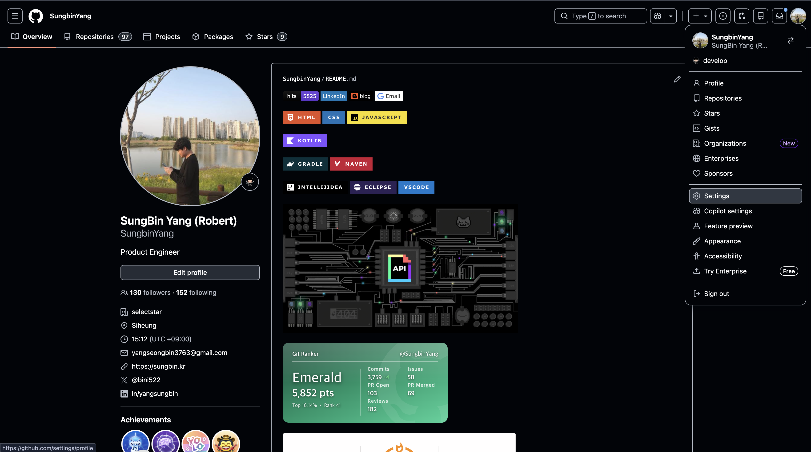

이후 화면을 스크롤 업을 해보면 `Developer Settings`를 클릭해보자.

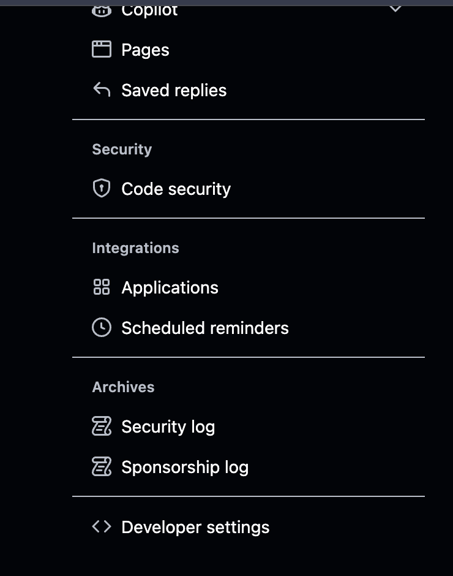

다음으로 Personal Access Token을 클릭하고 classic을 클릭해주자.

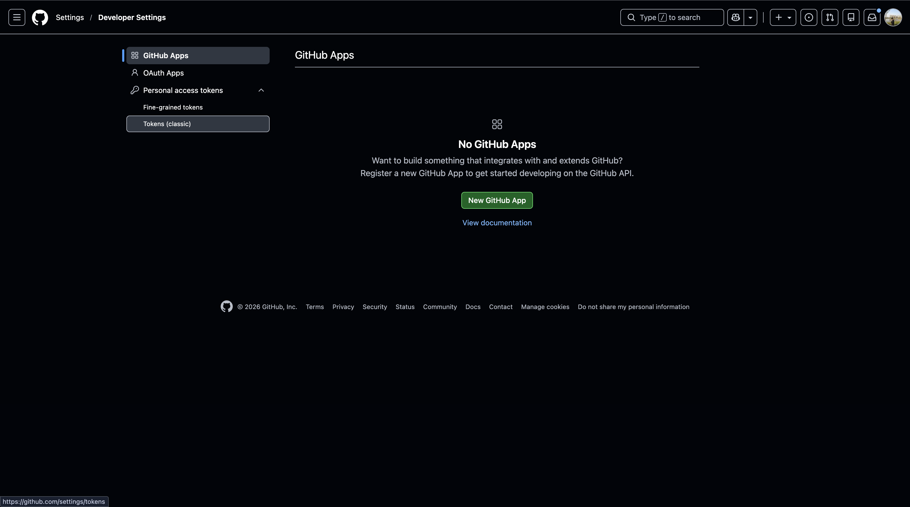

그러면 토큰 목록들이 있을텐데 처음 접근하신 분들은 아마 비어 있는 화면일 것이다. 필자는 이전에 생성해둔것이 있어서 아래와 같이 나오는 것이다.

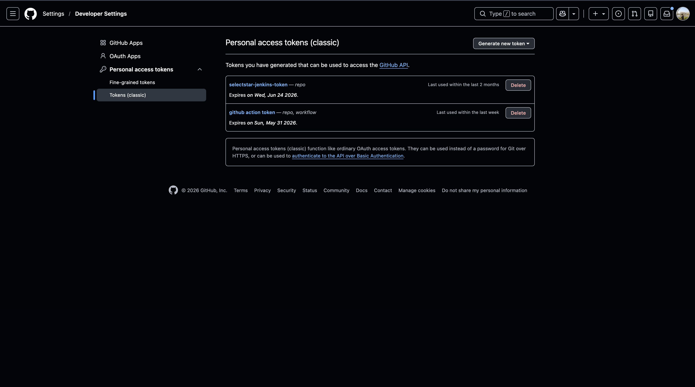

새 토큰을 생성해보자. 우측 상단에 혹은 가운데에 'Generate new token'을 클릭하고 classic을 선택하여 토큰을 생성해두자.

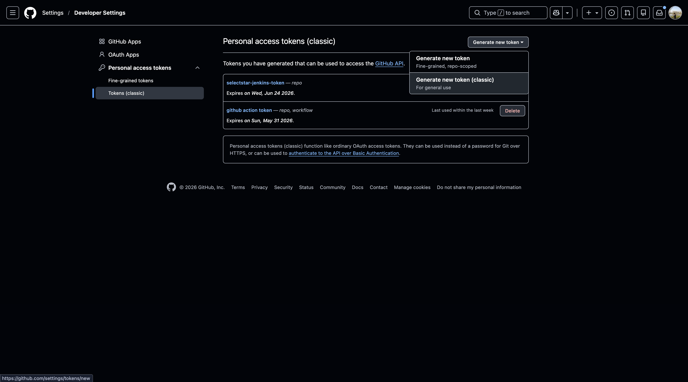

그러면 새 토큰을 생성하는 화면이 나타날 것이다.

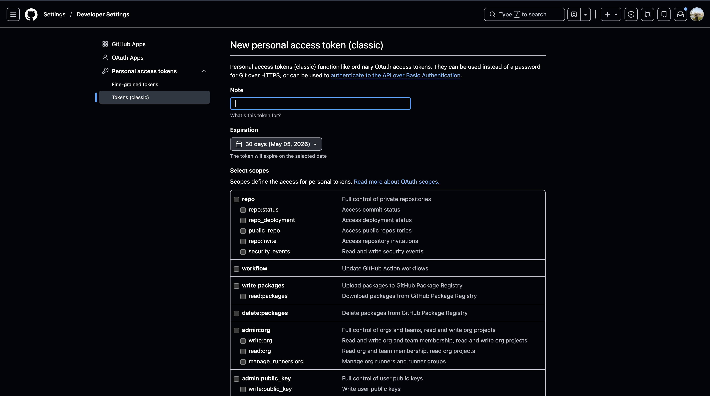

먼저 Note에 토큰의 이름을 입력하는 칸이 존재한다. 원하는 이름으로 입력해주면 된다. 다음으로 해당 토큰의 유효기간을 지정할 수 있다. 기본은 1달이지만 원하는 기한으로 만들 수 있다. 다음은 해당 토큰으로 어떤
작업을 할 지 Select scopes에 선택을 할 수 있다. 해당 포스팅에서는 repo기능만 체크해도 충분하니 이것을 체크해주도록 하자.

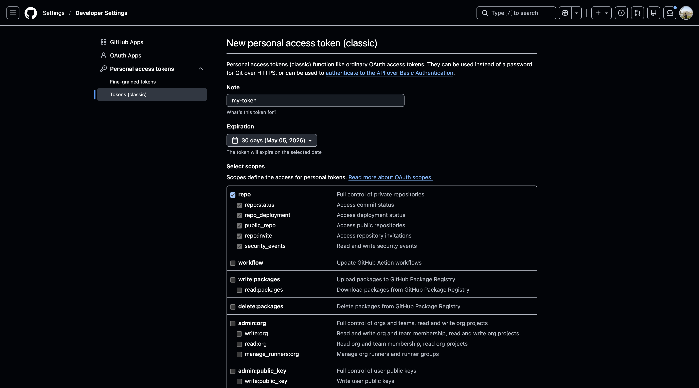

이후 하단에 Generate Token을 클릭해주면 된다.

이제 다음으로 실습을 진행하기 위한 저장소를 만들어 볼 것이다. create repository 버튼을 클릭하면 아래처럼 나올 것이다.

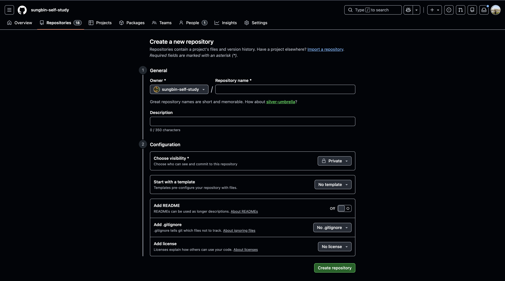

이제 아래와 같이 입력해보자.

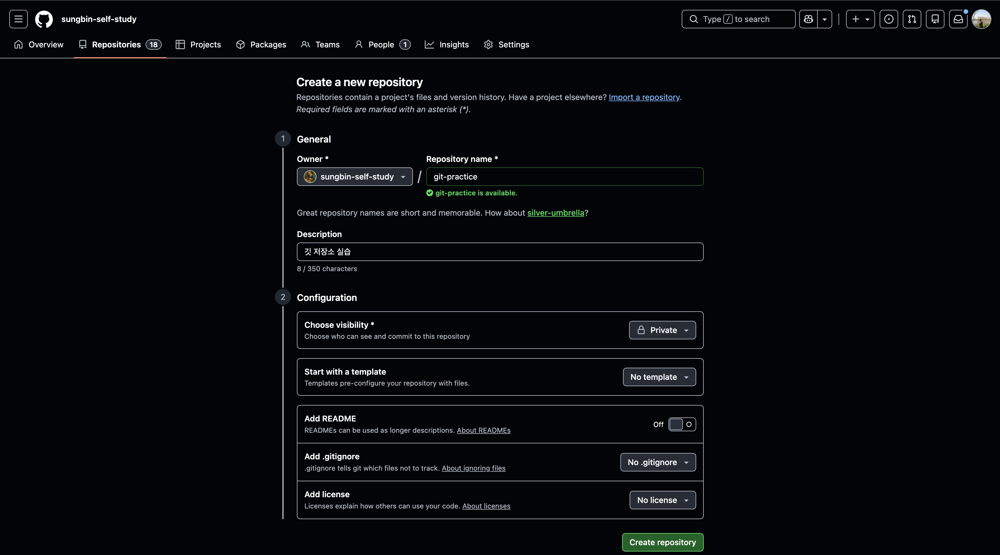

repository명은 기본적으로 프로젝트명과 동일하게 적어주면 된다. 다음으로 저장소의 공개 범위를 지정해주는 건데 이것은 자유롭게 해주면 된다. 필자는 private으로 하였지만 public으로 해도 무방하다.

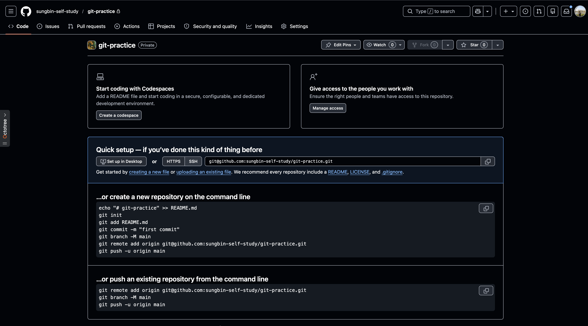

위와 같이 저장소가 만들어졌다. 이제 우리가 진행한 프로젝트를 한번 올려보자.

## 원격 저장소 사용하기

### 로컬에 원격 저장소 추가 후 푸시

이제 우리가 작업했던 프로젝트를 원격 저장소에 올려보도록 하겠다.


저장소를 가보면 위와 같이 2가지 방법들을 제안하고 있다. 첫번째 방법은 우리 로컬 프로젝트에 아직 git 저장소가 만들어지지 않았을 때 사용하는 방법이다. 우리는 이미 프로젝트에 git을 사용하고 있으므로 2번째
방법을 사용하면 된다. 이 명령어들을 터미널에 붙여넣고 실행을 할 예정이다. 그 전에 각 명령들을 하나씩 살펴보자.

첫번째 명령인 `git remote`는 로컬, 즉 내 컴퓨터에 있는 저장소에 이 깃허브 저장소를 원격 저장소에 등록하는 것이다. 'remote'는 원격 자정소를 의미한다. 즉 현 프로젝트를 저장할 이 깃허브등 다른
서버의 저장공간을 의미한다. remote를 add한다는 것은 이 명령이 실행되는 프로젝트에 특정 원격 저장소를 추가하여 연동한다는 것이다. origin은 추가할 원격 저장소에 부여하는 이름이다. 때문에 origin이
아닌 다른 이름으로 지어도 괜찮다. origin이 이름이라면 그 뒤에 오는 주소는 전화번호이다. 말 그대로 git-practice의 깃허브 저장소 주소인 것이다. 해당 url은 기본적으로 https 버전의 것으로
설정되어 있다. ssh버튼을 클릭하면 필자처럼 주소가 바뀔 것이다. 이 부분은 추후에 학습해보도록 하겠다.

다음은 현 브랜치 명을 강제로 바꾸는 명령어이다.

```shell
git branch -M main
```

대문자 M이므로 같은 이름의 브랜치가 있게 된다면 이를 덮어씌우게 된다. 우리는 기본 브랜치 명이 main으로 설정했으니 해당 명령은 생략해도 무방하다.

```shell
git push -u origin main
```

마지막 명령어는 현 로컬 저장소의 커밋들을 원격으로 업로드 하는 명령어이다. 이 명령어를 통해 깃허브의 레파지토리에 프로젝트 파일들과 git 관리내역들이 통째로 업로드 되는 것이다. 여기서 u 옵션은
`--set-upstream`의 약자로 앞으로 push나 pull을 사용할 때 따로 명시가 없으면 그 뒤에 오는 origin 원격 저장소의 main 브랜치 대상으로 하도록 디폴트를 지정하는 것이다. 그래서 이후로는
`git push`까지만 입력하면 로컬의 최신 커밋들을 디폴트 목적지인 origin/main으로 업로드 되는 것이다.

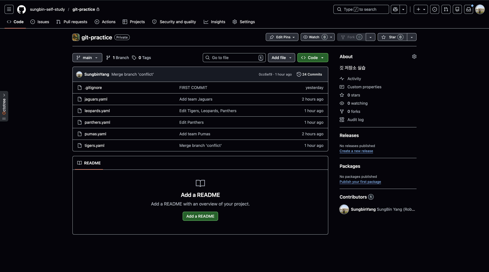

깃 크라켄도 확인해보면 깃허브 프로필로 아이콘이 변경된 것을 볼 수 있을 것이다.

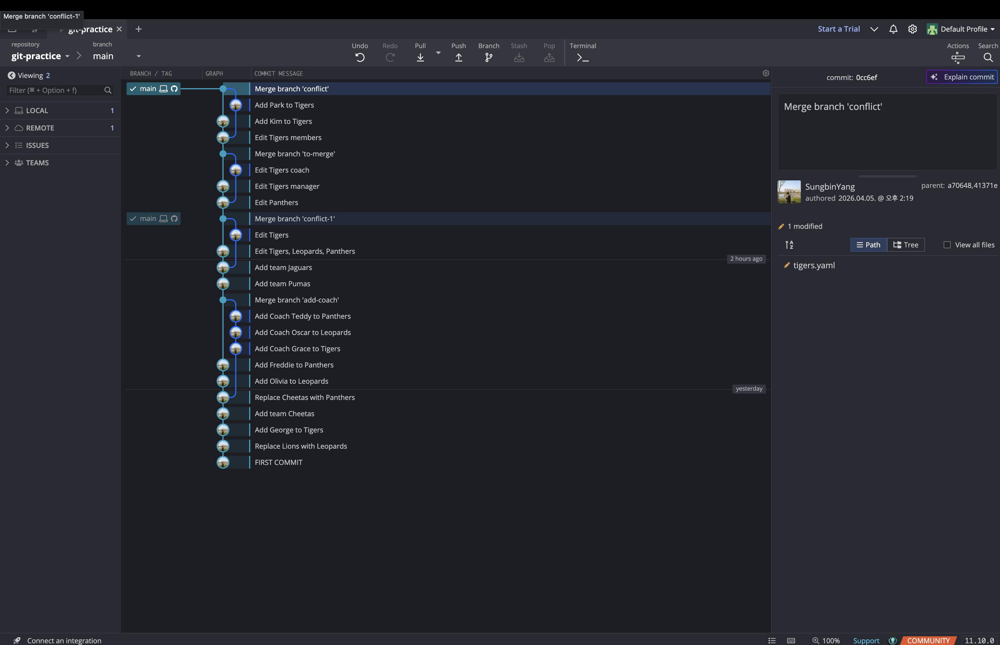

다시 repository로 돌아와서 반영된 파일들을 클릭하면 수정을 하여 새로운 커밋도 만들 수 있으며 커밋 메세지를 클릭하면 해당 커밋에 어떤 작업을 하였는디 diff화면처럼 잘 나오는 것을 볼 수 있다. 또한
우측 상단에 24 commits를 누르면 아래와 같이 커밋 내역을 git log처럼 나오는 것도 볼 수 있을 것이다.

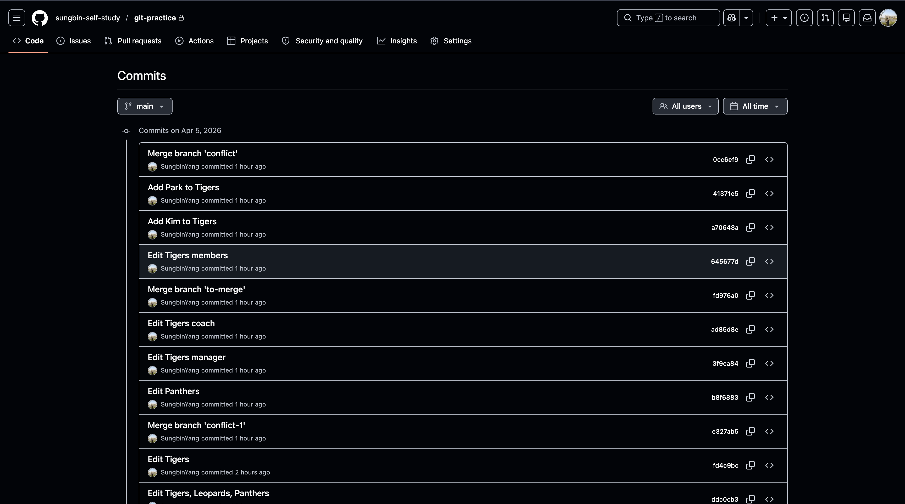

여기서도 항목 하나를 클릭해보면 어떤 변경사항이 있었는지도 확인이 가능하다. 이처럼 프로젝트의 파일뿐만 아니라 git의 관리내역까지 모두 깃허브에 업로드 되어 이렇게 볼 수 있다.

다시 vscode로 돌아와 아래의 명령어를 쳐보자.

```shell
git remote
```

이 명령어는 한 로컬 git 저장소에 연결된 원격 저장소 목록들을 보여준다. 보다 상세한 정보를 보고 싶다면 아래의 명령어를 입력해주면 된다.

```shell
git remote -v
```

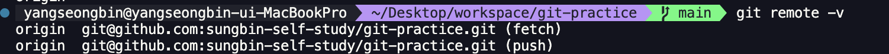

일반적인 경우 fetch를 위한 주소와 push를 위한 주소는 동일하다.

다음으로 원격 저장소와의 연결을 끊으려면 아래와 같이 하면 된다.

```shell
git remote remove "(origin 등 원격 이름)"
```

내 폰에서 그 사람의 연락처를 삭제한다고 그 사람이 사라지지 않은 것처럼 이는 로컬 저장소와 원격 저장소와의 연결을 끊는 것일뿐 깃헙이나 깃랩에 추가한 원격 저장소가 사라지는 것은 아니다.

### GitHub에서 프로젝트 다운받기

레파지토리 페이지로 돌아간다. 우측 상단에 code를 클릭하면 아래와 같이 나올 것이다.

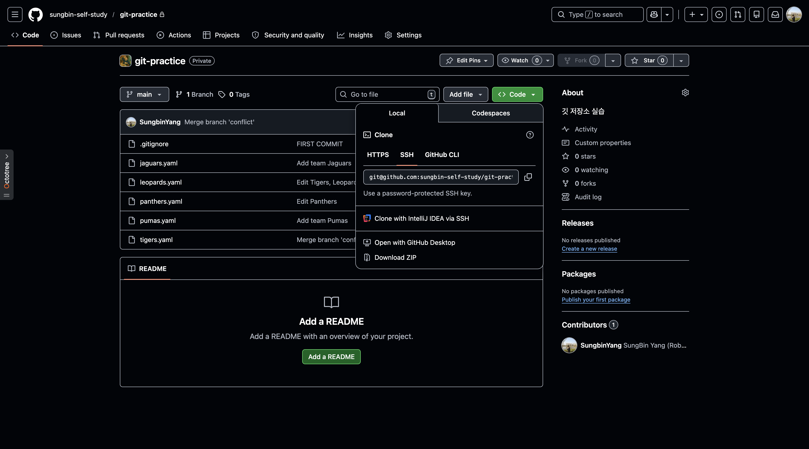

아래의 download zip file을 클릭해서 다운받으면 프로젝트의 파일이 다운로드 받을 수 있다. 하지만 아쉬운 점은 `.git` 폴더가 존재하지 않는 것이다. 때문에 이 방식은 프로젝트를 협업으로 개발하는
실무 과정에서는 사용되지 않는 방식이다.

다음 방식은 주소를 통해서 받는 방법이다. 레파지토리의 code를 다시 눌러서 주소를 copy를 해준다. 이 때 https든 ssh든 상관은 없다. 이후 아래의 명령어를 실행한다.

```shell
git clone "원격 저장소 주소"
```

## push와 pull

### 원격으로 커밋 밀어올리기(push)

이제 본격적으로 원격 저장소와 로컬 저장소간의 협업을 진행해보겠다. 현재는 이렇게 진행되어 있는 상황이다.

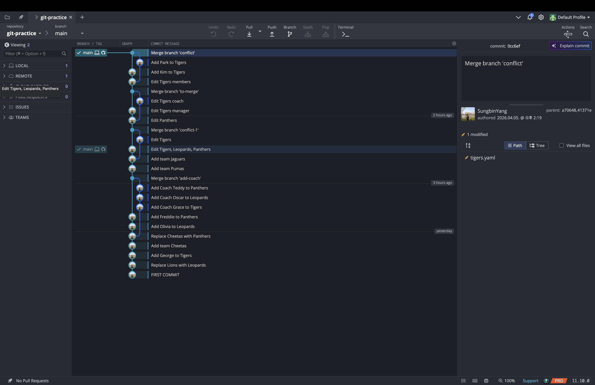

이제 로컬 저장소에 변경사항을 반영하고 커밋을 해보자. 그러면 아마 아래와 같이 될 것이다.

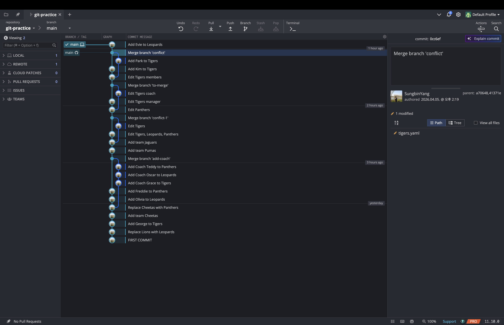

그리고 `push`를 진행하면 원격 저장소에도 반영이 될 것이다.

> 이미 `git push -u origin main`으로 대상 원격 브랜치가 지정되었기 때문에 가능

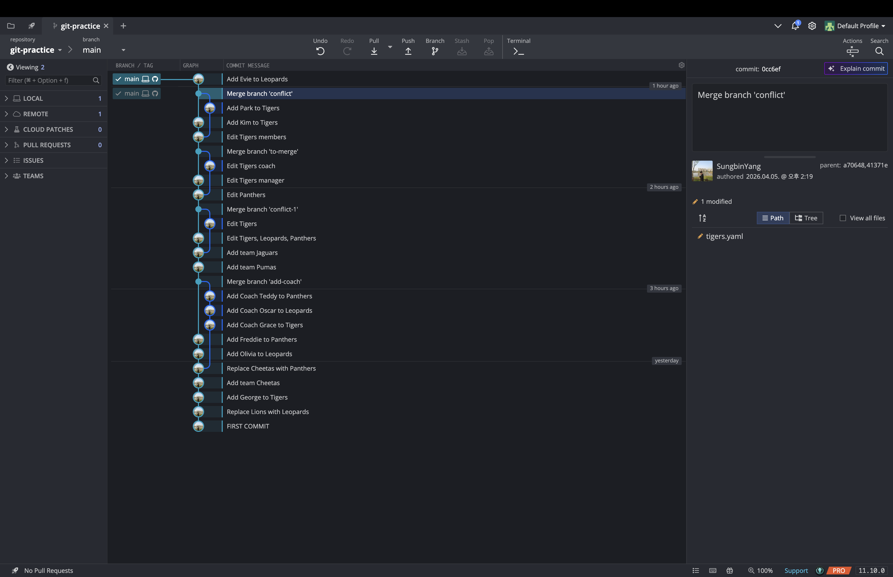

### 원격의 커밋 당겨오기(pull)

이제 깃헙에서 특정 파일을 하나 수정해보자.

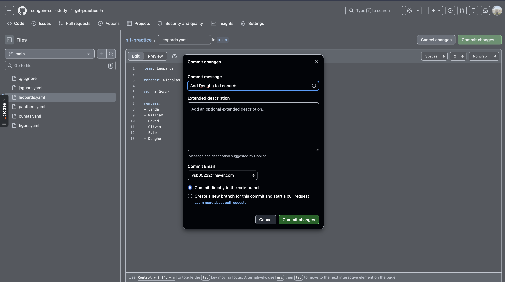

이렇게 위와 같이 수정하고 커밋을 날리면 바로 원격 저장소에 반영이 된다. 이것을 로컬 저장소에 받아오려면 어떻게 해야할까? 바로 아래의 명령어를 실행하면 된다.

```shell
git pull
```

### pull 할 것이 있을 때 push를 하면?

로컬 환경에서 변경사항을 반영하고 commit을 하고 원격 저장소에도 변경사항이 있어서 변경하고 바로 원격 저장소에 반영하였다. 이후에 로컬 저장소에서 `push`를 진행하면 아래와 같이 오류가 나온다.

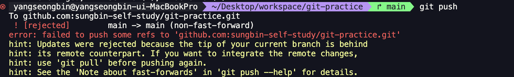

이유는 단순하다. 원격에 먼저 적용된 새 버전이 있으므로 적용 불가한 것이다. pull 해서 원격의 버전을 받아온 다음 push 가능하다. push 할 것이 있을 시 pull 하는 두 가지 방법이 존재한다.

- `git pull --no-rebase`: merge 방식
- `git pull --rebase`: rebase 방식

방식은 어느것을 사용하든 큰 의미는 없다. 이후 `push`를 진행하면 된다.

### 협업상 충돌 발생 해결하기

충돌도 마찬가지다. 로컬에서 변경사항을 만들고 커밋을 하고 원격 저장소에는 직접 파일을 고쳐서 push까지 진행을 했다고 하자. 이후로 로컬에서 `push`를 하면 아까와 같은 오류가 날 것이다. 이에 `pull`을
하면 충돌이 발생할 것이다. 이를 해결해주고 `push`를 해주면 완료된다. `pull` 방식은 위와 같이 적절한 방법을 사용하면 될 것이다.

### 로컬의 내역 강제 push해보기

로컬 저장소 깃 플로우와 원격 저장소 깃 플로우를 마쳐야 하는 상황이 나온다. 그런 경우 아래의 명령어를 사용하면 된다. 예를 들이 `reset`을 하는 상황에 동기화를 해야한다면 그럴 것인데 아래 명령어는 매우
주의해야한다.

```shell
git push --force
```

## 원격의 브랜치 다루기

### 로컬에서 브랜치 만들어 원격에 push 해보기

`from-local`이라는 브랜치를 만들어보자. 그리고 `git push`를 진행하면 아래와 같이 원격 저장소에 브랜치가 반영되는 것을 볼 수 있다.

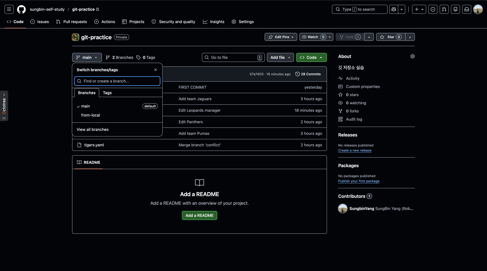

물론 아래 명령어로 원격의 브랜치 명시 및 기본설정을 할 수 있다.

```shell
git push -u origin from-local
```

깃 크라켄을 보면 아래처럼 나오는 것을 볼 수 있다.

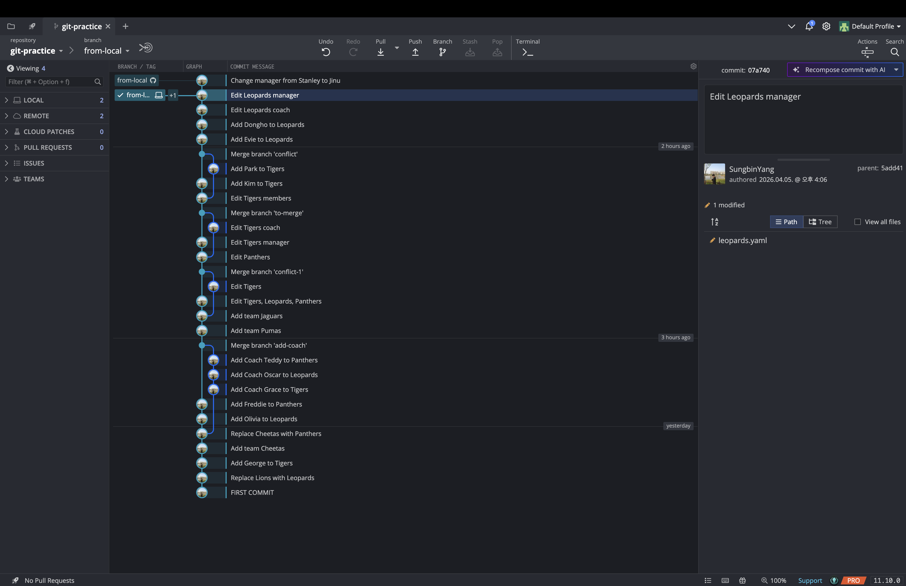

물론 이것을 명령어로 확인할 수 있다. 이전에 알아 본 `git branch`를 입력하면 현재 로컬 저장소의 브랜치만 볼 수 있다. 하지만 아래의 명령어를 입력하면 원격 저장소의 브랜치까지 확인이 가능하다.

```shell
git branch --all
```

### 원격의 브랜치 로컬에 받아오기

깃허브에 아래와 같이 브랜치 선택 박스를 누르고 검색창에 브랜치 이름을 입력하고 create branch를 눌러보자.

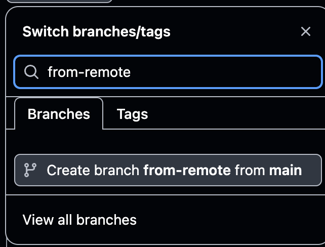

이후 로컬에서는 해당 브랜치에 접속하려면 아래와 같은 명령어를 통해 접속이 가능하다.

```shell
git switch -t origin/from-remote
```

### 원격의 브랜치 삭제

원격 브랜치를 삭제하려면 아래와 같은 명령어를 통해 삭제가 가능하거나 깃헙에서 삭제가 가능하다.

```shell
git push "(원격 이름)" --delete "(원격의 브랜치명)"
```