> 해당 포스팅은 인프런의 [제대로 파는 Git & GitHub - by 얄코(Yalco)](https://inf.run/VyuWK) 강의를 참조하여 작성한 글입니다.

## Git을 특별하게 만드는 것

이번 포스팅은 Git을 보다 깊이 알아보는 시간을 가져보도록 하겠다. 이번에는 깃이 이전에 존재했던 다른 VCS 제품들과 어떻게 다른지, 2가지 큰 차이점을 알아 볼 예정이다. VCS란 깃과 같은 'Version
Control System'이다. VCS가 버전을 관리하는 방식은 크게 2가지가 존재한다. 델타 기반 방식과 스냅샷 방식이다.

깃 이전 시대의 VCS는 델타를 기반으로 한 방식을 사용했다. 예를 들어 파일 3개가 저장되었던 첫 시점이 버전1로 기록이 된다. 이 상태에서 파일A와 파일C를 수정하는 작업을 한 뒤에 이를 다음 버전 커밋한다라고
해보자. 그러면 각각 파일A와 파일C에서 델타1이라는 버전이 생긴다. 여기서 델타는 각 파일의 변경 내역을 말한다. 즉 델타 방식의 각 버전은 이전 버전으로부터 **무엇이 바뀌었는지** 를 저장하는 것이다. 그리고
다음 버전에서는 파일C만 수정되어서 해당 파일의 변경사항만 저장되고 다음 버전에서는 파일A와 B, 마지막 버전에서는 파일B와 C가 수정되었다면 해당 변경사항이 기록이 되는 것이다. 그리고 마지막 이전 버전을
`checkout`으로 방문한다고 해보자. 그러면 각 파일의 초기 상태부터 시작해서 이후 모든 버전들의 모든 델타를 차례로 적용해나가는 식으로 마지막 이전 버전의 파일 내용을 연산하게 된다. 이 버전에서 어느 줄을
추가했고 이 버전에서 어느 부분을 어떻게 바뀌었고 혹은 어떻게 삭제했는에 대한 변경사항을 하나하나씩 반영해나가는 것이다. 하지만 델타 방식은 한계점이 명확히 존재한다. 프로젝트가 수 많은 버전들로 구성이 되어있다면
수 많은 버전들의 델타들을 연산해야 하기 때문에 버전이 많아질수록 부하가 커지게 된다.

깃은 델타방식이 아닌 스냅샷 방식으로 버전들을 관리한다. 파일A, 파일B, 파일C가 있다고 가정해보자. 이후 두번째 버전에 파일 A와 C가 변경이 되었다고 해보자. 스냅샷 방식에서는 스냅샷을 찍는 것처럼 프로젝트의
전체 상태를 저장한다. 즉, 델타만 저장하는 것이 아닌 내용이 변경된 파일 자체를 새로 저장하는 것을 말한다. 수정되지 않은 파일의 경우는 중복되는 용량을 차지하지 않도록 이전 버전으로부터의 링크만 담는다. 이는
델타를 합산하는 방식이 아니기 때문에 사진 보관함에서 스냅샷을 꺼내듯 어느 버전으로든 프로젝트 상태를 바로 되돌릴 수 있다. 또한 깃은 내부적으로 압축 및 중복 제거를 하기 때문에 실제 저장 효율또한 매우 좋다.
이와 같은 스냅샷 방식 덕분에 git의 각종 기능들이 빠르고 안정적으로 수행할 수 있는 것이다.

VCS는 팀원들이 코드 관리 내역을 공유하고 협업하는 방식에 있어서도 크게 2가지로 나뉜다. SVN등 git 이전 세대들의 VCS들이 많이 사용하는 방식은 중앙 집중식 버전 관리를 사용한다. 이는 이름에서 유추할 수
있듯이 중앙에 있는 서버를 중심으로 협업을 이루는 것이다. 중앙 집중식에서는 프로젝트의 관리 내역들이 이 중앙 서버에 저장된다. 팀원들은 특정 버전으로 체크아웃을 하거나 다른 브랜치로 이동하거나 할 때 이 중앙
서버로부터 해당 상태의 프로젝트를 내려받아야 하는 것이다. 새로운 커밋을 할 때도 매 번 이를 일일이 중앙 서버로 올려보내야 한다. 이처럼 중앙 서버에 의존적이기 때문에 네트워크 문제등으로 인해 중앙 서버와의 연결이
끊어지거나 원활하지 않으면 팀원 모두가 제대로 작업할 수 없는 상황이 발생한다.

반면 깃은 분산 방식을 사용한다. 이는 모든 팀원이 각자 깃 저장소를 가지고 있는 것이라고 말할 수 있다. 즉 중앙 서버에 의존적이지 않는 것이다. 깃허브등의 원격 저장소를 두고 협업할 때도 각 관리내역이 모든
팀원들의 로컬로 다운받아지기 때문에 팀원들은 로컬 저장소에서 원하는 모든 깃 관련 작업을 수행하고 각자 원하는 시점에만 푸시 및 풀을 통해 다른 팀원들과 동기화를 할 수 있다. 로컬에서 진행되기 때문에 브랜칭이나
병합과정도 빠르고 자유롭다. 이렇게 깃은 스냅샷 방식과 분산 방식을 사용하여 사용자들이 빠르고 유연하게 버전을 관리할 수 있도록 해준다.

## Git의 3가지 공간

이번에는 깃에서 작업물을 `add`하고 `commit`할 때 내부적으로 어떻게 동작하는지 알아보도록 하자.

앞에서는 깃을 조금 더 쉽게 이해하기 위해 타임캡슐이라는 비유를 사용했다. `add`는 변경사항을 타임 캡슐에 담는 것이라고 하였고 `commit`은 타임 캡슐을 땅속에 묻는 것이라고 하였다. 이번에는 이 과정들을
보다 정확한 용어로 알려드리도록 하겠다.

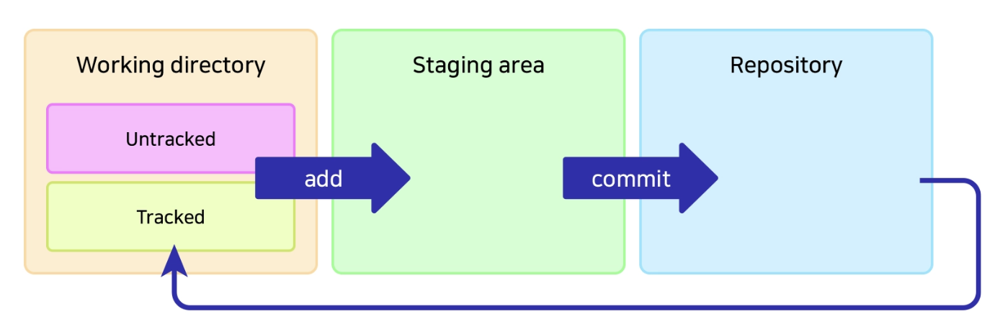

깃으로 관리되는 파일들은 `gitignore`된 것을 제외하고 위의 그림에서 나오는 3개의 영역 중 하나에 속하게 된다. 바로 **Working Directory**, **Staging Area**, *
*Repository** 영역이다.

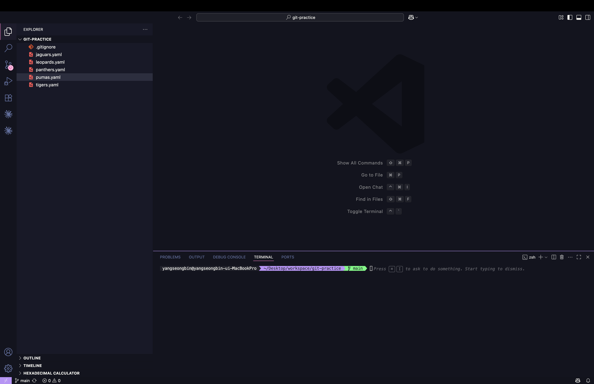

위의 vscode화면을 보자. `secrets.yaml`과 같이 `gitignore`에 제외한 파일을 제외하고는 나머지 파일들은 깃 저장소에 커밋되어 마지막 버전의 상태를 갖고 있는 파일들을 repository라는
영역에 속하게 된다. 앞서 배운 `.git` 폴더에는 이 repository 영역의 데이터가 들어가져 있는 것이다. 쉽게 말해 repository에는 커밋되어 있는 것들이 들어가져 있다고 생각하면 좋을 것 같다.

그러면 본격적으로 실습을 해보도록 하자. 아래와 같이 새로운 파일을 만들어보자.

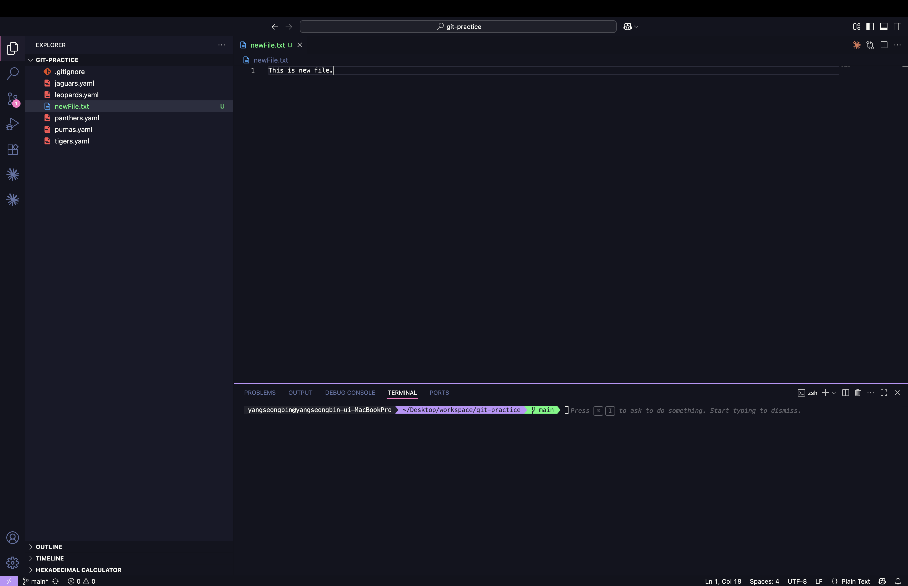

이후에 기존에 파일들도 한번 아래처럼 원하는데로 수정을 해보자.

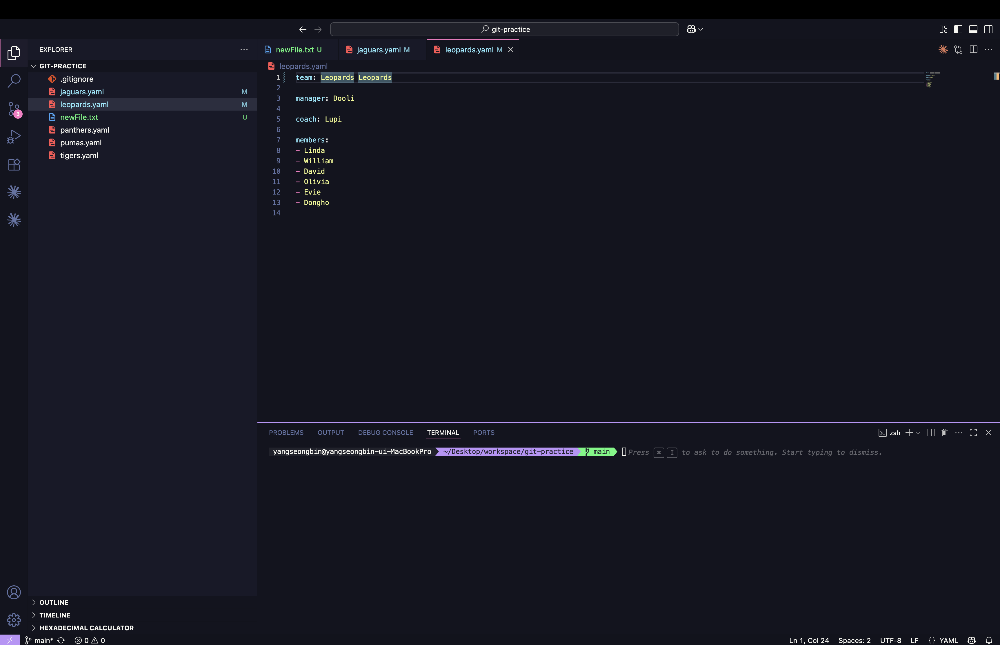

이렇게 새로 생긴 파일은 깃이 추적하지 않는 파일이다. 즉, 위의 도식도를 보면 Working Directory에 Untracked 파일로 볼 수 있다. 단, 이미 한번이라도 커밋한 기록이 있는 파일들을 수정을 하면
이전에 한번 Tracked를 한 적이 있기 때문에 Working Directory의 Tracked 상태로 되는 것이다.

그러면 한번 특정 파일들만 `add`를 한번 해보자. 그리고 `git status` 명령어를 입력해보면 아래와 같이 나올 것이다.

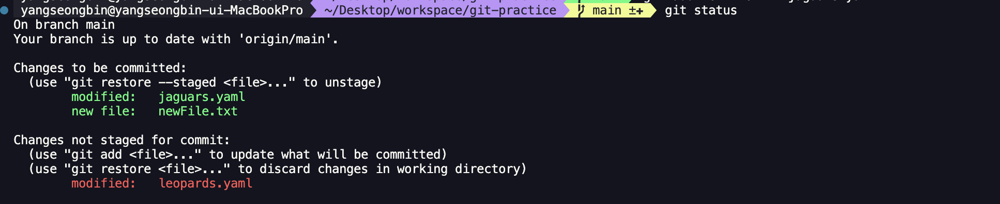

이 말은 즉, 2개의 파일이 Staging 영역으로 `add`와 동시에 올라갔다는 것이고 나머지는 아직 Working Directory라는 의미이다. 그러면 한번 정리해보도록 하겠다.

### **Working directory**

- untracked: Add된 적 없는 파일, ignore 된 파일
- tracked: Add된 적 있고 변경내역이 있는 파일
- `git add`명령어로 Staging area로 이동

### **Staging area**

- 커밋을 위한 준비 단계
    - 예시: 작업을 위해 선택된 파일들
- `git commit`명령어로 repository로 이동

### **Repository**

- `.git directory`라고도 불림
- 커밋된 상태

이제 한번 다음 실슴을 진행해보자. `tigers.yaml`을 삭제하고 `git status`를 해보자. 그러면 아래와 같이 삭제한 것도 working directory에 추적을 하고 있음을 알 수 있다.

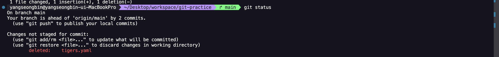

즉, 파일의 삭제가 `working directory`에 있다라는 것이다. 그러면 `git reset --hard`로 다시 원복을 하고 아래의 명령어를 작성하고 `git status`를 해보자.

```shell
git rm tigers.yaml
```

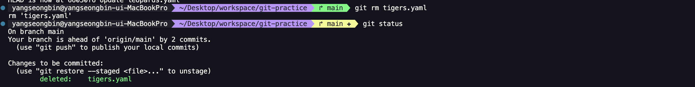

그러면 삭제되었던 변경 이력이 스테이징 영역으로 올라간 것을 알 수 있다. 그러면 다음 실습을 위해 `git reset --hard`를 해주자. 그리고 `tigers.yaml` 파일을 `zzamTigers.yaml`
이름으로 변경해보자. 그리고 `git status`를 해보자. 그러면 아래와 같이 `tigers.yaml`이 삭제되고 `zzamTigers.yaml`이 새로 생성된 이력을 볼 수 있을 것이다. 즉, 파일 이름 변경은
컴퓨터 입장에서 기존 파일을 삭제하고 똑같은 내용의 새로운 파일을 생성하는 것과 같다라는 것을 알 수 있을 것이다.

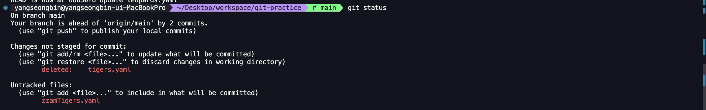

그러면 지금 상태에서 `git reset --hard`를 해보자. 그러면 뭔가 이상하게 `tigers.yaml`은 복구가 되었지만 `zzamTigers.yaml`은 그대로 남아 있는 것을 알 수 있다. 이유는
`reset`은 기존에 있는 파일을 복구하는데만 있다. 그래서 `Untracked`상태는 따로 별도 작업을 하지 않은 것이다. 즉, `reset`은 깃이 관리하는 파일들만 뭔가 해준다라는 것으로 받아들일 수 잇을
것이다.

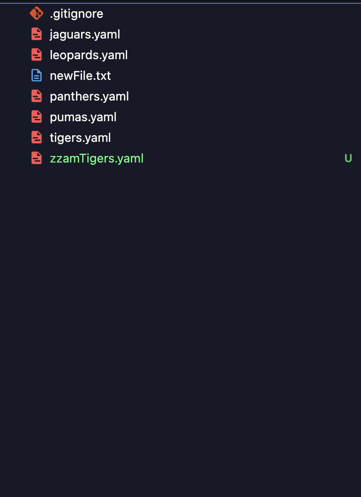

이제 다음으로 아래의 명령어를 통해 `tigers.yaml` 파일을 `zzamTigers.yaml`로 변경해보자.

```shell
git mv tigers.yaml zzamTigers.yaml
```

이후에 `git status`를 해보면 파일을 삭제하고 새로운 파일이 생성된 것이 아닌 `rename`만 된것을 볼 수 있다.

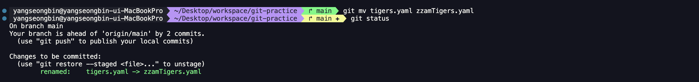

그러면 다음으로 이미 스테이징 영역에 있는 파일들을 워킹 디렉토리로 옮기는 방법에 대해 알아보자. 아래의 명령어를 사용하면 스테이징에 있던 파일들을 워킹 디렉토리로 내릴 수 있다.

```shell
git restore --staged "(파일명)"
```

`--staged` 옵션을 빼면 working directory에서도 제거가 된다.

다음으로 reset의 옵션들을 상세히 보겠다. 우리는 이제까지 `--hard` 옵션만 사용했었는데 더욱 자세히 보자.

- --soft: `repository`에서 `staging area`로 이동
- --mixed (default): `repository`에서 `working directory`로 이동
- --hard: 수정사항 완전히 삭제

## HEAD

지금부터 우리는 HEAD에 대한 개념을 알아보도록 하겠다. 보다 정확하게 알기 위해 실습을 통해 진행해보도록 하겠다.

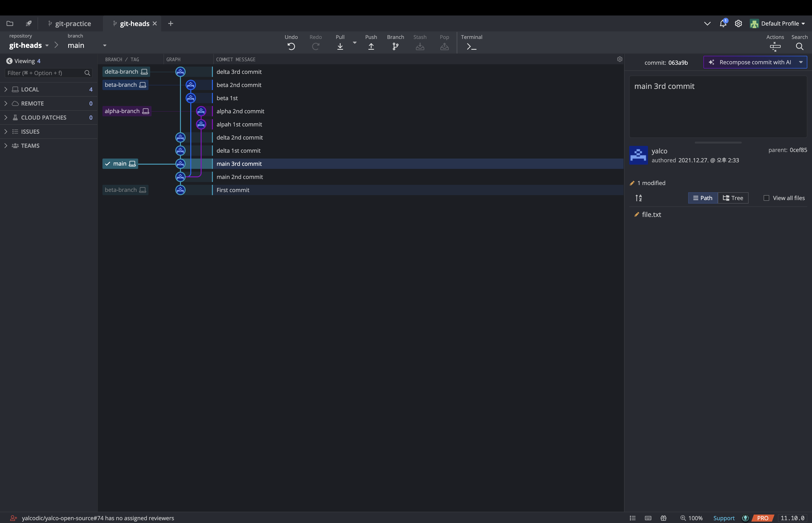

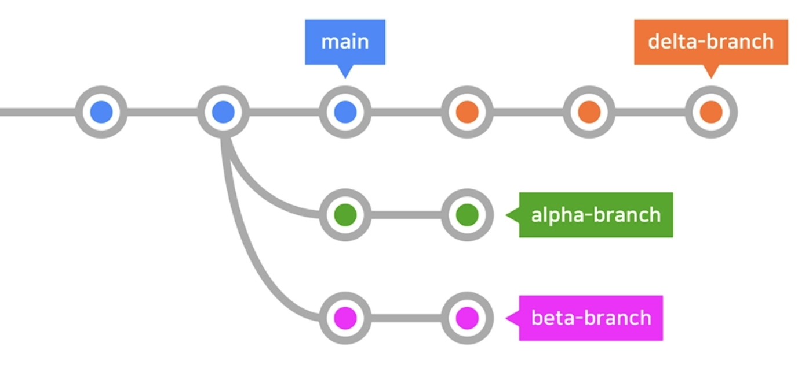

위와 같이 실습 환경을 구축해보자. 어떤 파일이든지 상관은 없다.

깃의 HEAD란 현재 속한 브랜치의 가장 최신 커밋을 뜻한다. `git switch`로 브랜치를 이동할때마다 해당 브랜치의 최신 커밋으로 이동하고 HEAD도 그 위치를 한다. 이를 통해 정말로 최신 커밋이
HEAD인것을 인지할 수 있다.

그러면 HEAD를 옮겨보도록 하자. 깃에는 최신 커밋이 기본적으로 HEAD라고 했다. 하지만 HEAD 자체를 옮길 수도 있다. 아래의 명령어를 한번 실행해보자.

```shell
git checkout HEAD^
```

그러면 아래와 같이 커밋 해시가 뜨는데 확인해보면 최신 커밋의 이전 커밋으로 이동하게 되는 것을 볼 수 있게 된다.

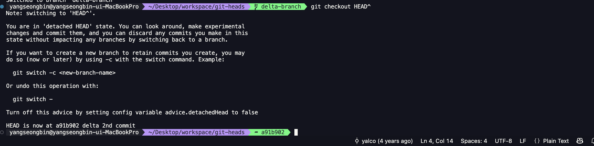

여기서 `^`나 `~`의 갯수만큼 이전으로 이동하게 된다. 따라서 아래처럼 하면 3칸 이전으로 이동하게 되는 것이다.

```shell
git checkout HEAD^^^
```

혹은 더욱 간단하게 아래와 같이 해도 무방하다.

```shell
git checkout HEAD~3
```

물론 커밋 해시를 알고 있다면 아래처럼 커밋해시로 직접 이동을 해도 상관은 없다.

```shell
git checkout "커밋 해시"
```

만약 이렇게 `checkout`을 통해 이동을 했는데 만약 `Ctrl + Z`처럼 뒤로가기를 하고 싶다면 아래처럼 사용하면 바로 이전 상태로 가게 된다.

```shell
git checkout -
```

또한 해당 브랜치에 HEAD를 사용해서 reset이 가능하다. 커밋 해시를 모르는데 특정 시점으로 reset을 하고 싶은 경우 아래와 같이 진행하면 편할 것이다.

```shell
git reset HEAD^ --hard
```

## fetch vs. pull

이번에는 깃의 `fetch`와 `pull`에 대해 보다 자세하게 살펴보도록 하겠다. 저번에는 원격 저장소의 커밋을 가져올 때 풀 명령어만 사용했었다. 사실 이 풀은 패치를 포함하는 과정이다.

패치란 원격 저장소의 최신 커밋을 로컬로 가져오되, 로컬의 다른 브랜치에는 영향을 주지 않는 작업이다. 쉽게 생각해서 업데이트된 내용을 일단 살펴보기만 하기 위해 다운만 받는다고 생각하면 좋을 것 같다. 이처럼
패치된 작업을 merge 또는 rebase로 로컬 브랜치에 적용하는 것은 풀이다. 풀 방식은 2가지 방식 중에 하나를 선택했다는 것을 기억할 것이다. 즉, 풀을 실행하면 패치가 자동으로 실행된 다음에 설정한 바에
따라 머지 또는 리베이스까지 이어지는 것이다.

그러면 본격적으로 한번 실습을 진행해보겠다. 원격 저장소에 파일을 수정해보자. 그 이후 로컬에 가서 해당 수정사항을 pull 받기 전에 잘 되어있는지 fetch를 통해 확인할 수 있다.

```shell
git fetch
```

이후 잘 적용이 되었는지 아래의 명령어로 원격 저장소 브랜치에 접속해서 확인 후에 잘 적용되어 있으면 pull을 받는것이 공식이다. 이것은 실무에서도 많이 사용하니 잘 숙지해주자.

```shell
git checkout origin/main
```

다음으로 원격 저장소에 브랜치를 하나 만들자. 이후 fetch를 통해 새로 만든 원격 저장소 브랜치를 받아오면 아래와 같이 원격 저장소 브랜치로 접속이 가능하다.

```shell
git checkout "origin/(브랜치명)"
```

다른 방식으로 아래와 같이 하는 방식도 존재한다.

```shell
git switch -t "origin/(브랜치명)"
```

이 2개의 차이는 다음과 같다. `git checkout origin/브랜치명`은 detached HEAD 상태가 됩니다. 로컬 브랜치를 만들지 않고 해당 커밋만 직접 가리키므로, 여기서 커밋하면 어떤 브랜치에도
속하지 않게 됩니다. `git switch -t origin/브랜치명`은 원격 브랜치를 tracking하는 로컬 브랜치를 자동 생성하고 거기로 전환합니다. -t(--track)가 git checkout -b 브랜치명
origin/브랜치명과 동일한 효과가 된다.

## Git의 각종 설정

### help

이번에는 깃에서 유용한 각종 설정들을 하는 방법에 대해 알아보도록 하겠다. 그 전에 `git help` 명령어를 잠시 집고 넘어가겠다. 이는 깃의 사용법 가이드를 확인할 수 있는 명령어이다. 해당 명령어를 사용하면
기본적인 명령어들과 설명이 나온다. 만약 깃의 모든 명령어들을 조금 더 보고 싶다면 아래와 같이 a 옵션을 주면 된다.

```shell
git help -a
```

만약 특정 명령어의 설명과 옵션을 보고 싶다면 아래의 명령어를 입력해주면 된다.

```shell
git "(명령어)" -h
```

### global 설정과 local 설정

config를 --global과 함께 지정하면 전역으로 설정이 된다. 만약 해당 프로젝트에만 설정을 하고 싶다면 생략하거나 --local을 해주면 된다. 실무에서는 거의 할 일이 없지만 만약 해당 시스템 전체로 하고
싶은 경우라면 --system으로 설정을 해주면 된다. 그러면 각각 적용해서 아래의 명령어로 어떤 설정들이 어느 환경에 적용되어 있는지 살펴보자.

```shell
git config (--global / --system / --local) --list
```

### 단축어 설정

우리는 깃 명령어들을 단축어를 적용할 수 있다. 아래의 명령어를 통해 자기 자신만의 단축어로 적용해보자.

```shell
git config --global alias."(단축키)" "명령어"
```