> 해당 포스팅은 인프런의 [제대로 파는 Git & GitHub - by 얄코(Yalco)](https://inf.run/VyuWK) 강의를 참조하여 작성한 글입니다.

## 변화를 타임캡슐에 담아 묻기

우리는 깃을 통해 각 버전들을 생성하려고 한다. 쉽게 은유적으로 표현하자면 버전은 마치 타임캡슐이라고 생각하면 된다. 타임캡슐에 변경사항을 담아서 묻는 행위를 깃의 전문 용어로 커밋한다라고 표현한다. 그러면 한번
자세히 살펴보자.

### 프로젝트의 변경사항들을 타임캡슐(버전)에 담기

먼저 변경 사항 확인을 해보자. 아래의 명령어를 입력해보자.

```shell
git status
```

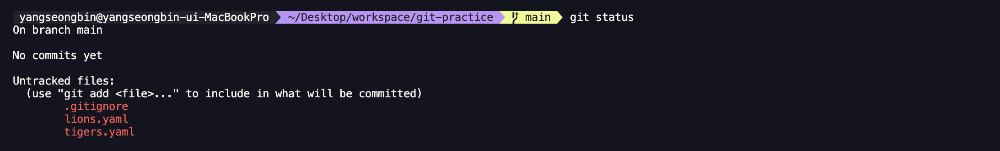

여기서 보면 'Untracked files'라고 뜨는 것을 볼 수 있을 것이다. 즉, 추적하지 않는 파일인데 추적하지 않는 파일이란 Git의 관리에 들어간 적 없는 파일이라고 볼 수 있다. 그러면 타임 캡슐에
변경사항들을 담아보도록 하자. 먼저 `tigers.yaml`을 담아보도록 하겠다. 아래의 명령어를 입력해보자.

```shell
git add tigers.yaml
```

그리고 `git status`로 확인해보면 아래와 같다.

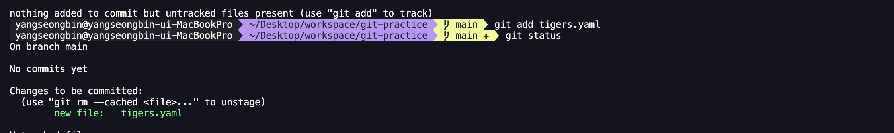

이렇게 하니 `tigers.yaml`이 타임캡슐에 담겼다. 그러면 나머지 파일들도 한번 담아보자. 파일마다 위와 같이 할 수 있지만 한번에 담는 명령어도 존재한다. 아래와 같이 한번 입력해보도록 하자.

```shell
git add .
```

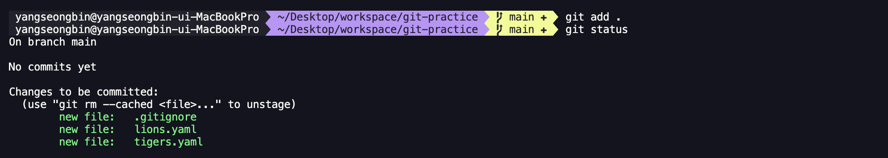

변경사항이 존재한 파일들이 전부 타임 캡슐에 담김을 확인이 되었다.

### 타임캡슐 묻기

이제 타임 캡슐에 변경사항들을 담았으니 땅에 묻어보도록 하자. 묻는 명령어는 아래와 같다.

```shell
git commit
```

위와 같이 입력하면 vi 창이 나올 것이다. 당연히 vi창은 입력을 해도 아무런 동작을 안 한다. 입력 모드로 진입해야 입력이 가능할 것이다. 입력 모드는 `i`를 누르면 가능하다. vi를 모르시는 독자를 위해
간단한 꿀팁을 아래의 표로 정리했으니 참고 바란다.

| 작업          | Vi 명령어 | 상세                        |
|-------------|--------|---------------------------|
| 입력 시작       | `i`    | 명령어 입력 모드에서 텍스트 입력 모드로 전환 |
| 입력 종료       | `ESC`  | 텍스트 입력 모드에서 명령어 입력 모드로 전환 |
| 저장 없이 종료    | `:q`   |                           |
| 저장 없이 강제 종료 | `:q!`  | 입력한 것이 있을 때 사용            |
| 저장하고 종료     | `:wq`  | 입력한 것이 있을 때 사용            |
| 위로 스크롤      | `k`    | `git log` 등에서 내역이 길 때 사용  |
| 아래로 스크롤     | `j`    | `git log` 등에서 내역이 길 때 사용  |

입력모드로 FIRST COMMIT이라고 입력한 뒤 저장하고 종료를 하자. 그러면 아래와 같이 뭔가 반영되었다고 뜰 것이다. `git status`를 입력해도 뭔가 깨끗하다고 뜰 것이다.

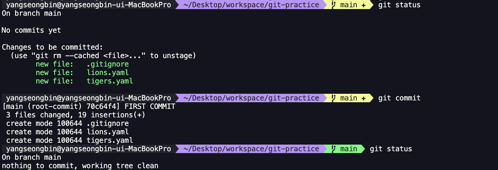

그러면 잘 반영이 되었는지 확인하는 명령어를 살펴보도록 하겠다. 아래와 같이 입력해보자.

```shell
git log
```

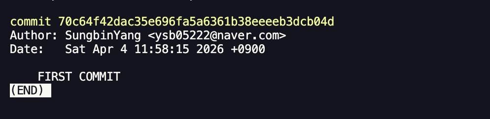

잘 반영된 것을 확인할 수 있다. 이것도 vi모드이므로 종료할때는 `:q`를 입력하면 된다.

### 변경사항들을 만들고 타임캡슐에 묻기

그러면 여러가지 변경사항들을 만들고 타임 캡슐에 묻어보자. 변경사항은 아래와 같다.

- `lions.yaml` 파일 삭제
- `tigers.yaml`의 manager를 `Donald`로 변경
- `leopards.yaml` 파일 추가

```yaml
team: Leopards

manager: Luke

members:
  - Linda
  - William
  - David
```

이제 `git status`로 확인해보면 파일의 추가, 변경, 삭제 모두 내역으로 저장할 대상이 되는 것을 볼 수 있을 것이다.

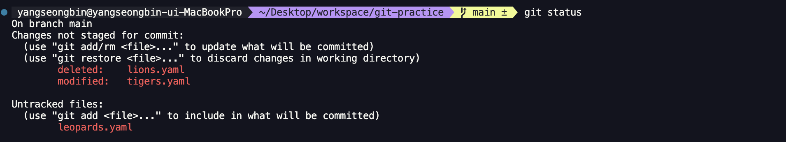

그러면 이전 버전과 어떤 차이가 발생했는지 확인 방법을 알아보자. `git diff`를 통해 쉽게 확인이 가능하다. 하지만 이것보다는 GitKraken을 이용하면 편하다. GitKraken을 열어서 open을 눌러서
해당 프로젝트를 불러온다. 그러면 아래와 같이 그래프도 손 쉽게 볼 수 있다.

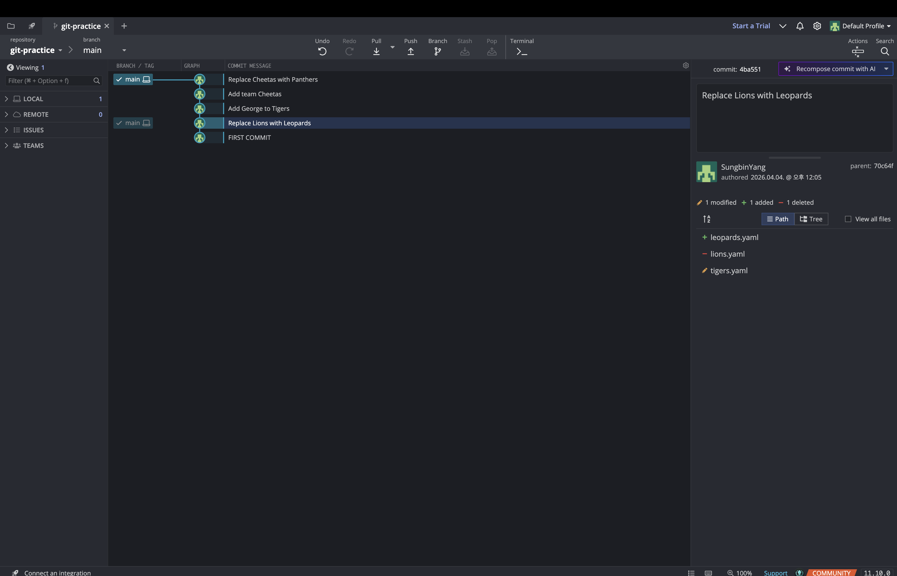

또한, 각 커밋에서 어떤 부분이 변경되었는지도 볼 수 있다.

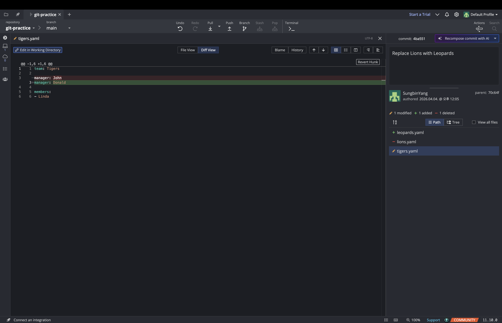

이제 해당 변경사항을 `git add .`와 `git commit`으로 타임캡슐에 담아보자.

여기서 꿀팁을 알려드리자면 `git commit`보다는 아래와 같이 한번에 메세지를 적어서 커밋하는 경우를 실무에서 많이 사용한다. 저렇게 하면 vi창도 안 나오고 매우 간편하다.

```shell
git commit -m "커밋 메세지"
```

만약, 새로 추가된(untracked) 파일이 없다면 add와 동시에 커밋하는 방법도 존재하는데 바로 아래와 같이 하면 된다.

```shell
git commit -am "커밋 메세지"
```

## 과거로 돌아가는 세 가지 방법

### reset 사용해서 시간 되감기

먼저 GitKraken으로 깃 로그들을 살펴보자.


이제 시간 여행중 하나인 `git reset`을 살펴보겠다. `git reset`은 마치 닥터스트레인지가 타임스톤을 써서 과거로 돌리듯이 현재를 과거상태로 변경해버리는 행위를 말한다. 그러면 한번 우리 프로젝트로
진행해보겠다. 돌아가고 싶은 시점의 커밋 해시를 복사하여 아래의 명령어를 실행하자.

```shell
git reset --hard "돌아갈 커밋 해시"
```

> reset의 hard 옵션은 추후에 다뤄보도록 하겠다.

여기서 커밋 해시는 GitKraken의 우측에 commit: 이후에 나오는 영문자이다. 이것을 클릭만 하면 바로 복사가 되니 쉽게 붙여넣기를 할 수 있을 것이다.

## 나머지 두 방법들

GitKraken을 통해 살펴보면 다음과 같은 상태가 된다.

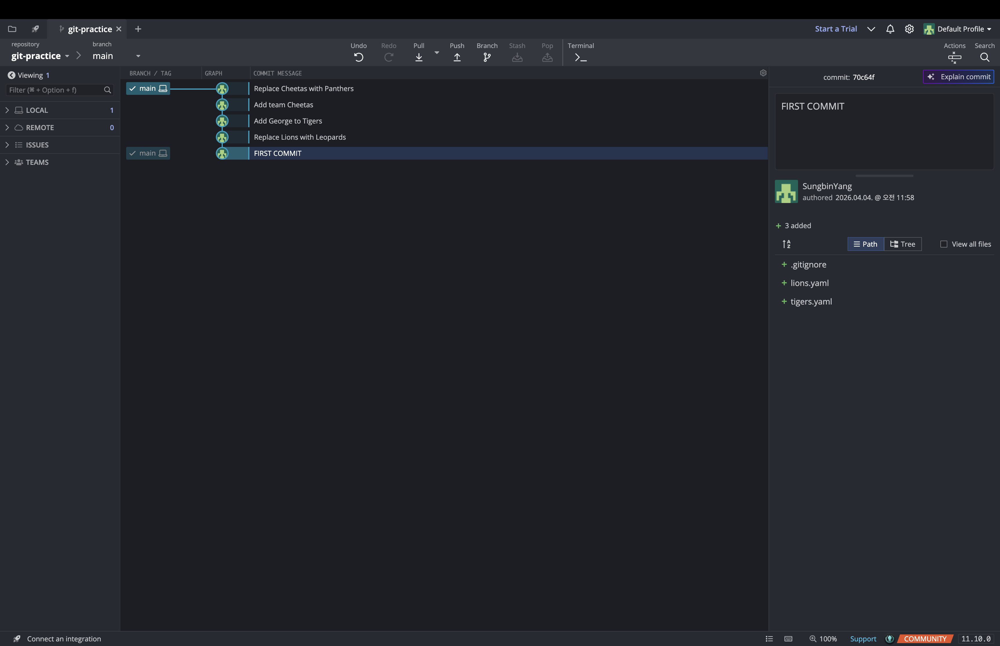

### revert로 과거 청산하기

다음 알아볼 시간여행 방법중 하나는 `revert`이다. `revert`는 과거의 낙오를 청산하듯이 과저의 잘못된 점을 되돌려 새로운 커밋을 하는 방법을 말한다. 한번 실습을 해보면 바로 이해가 될 것이다. Add
George to Tigers의 커밋 해시 구하여 아래의 명령어를 실행해보자.

```shell
git revert "되돌릴 커밋 해시"
```

이렇게 되면 커밋 메세지가 자동으로 생긴 vi창이 아래와 같이 나올 것이다.

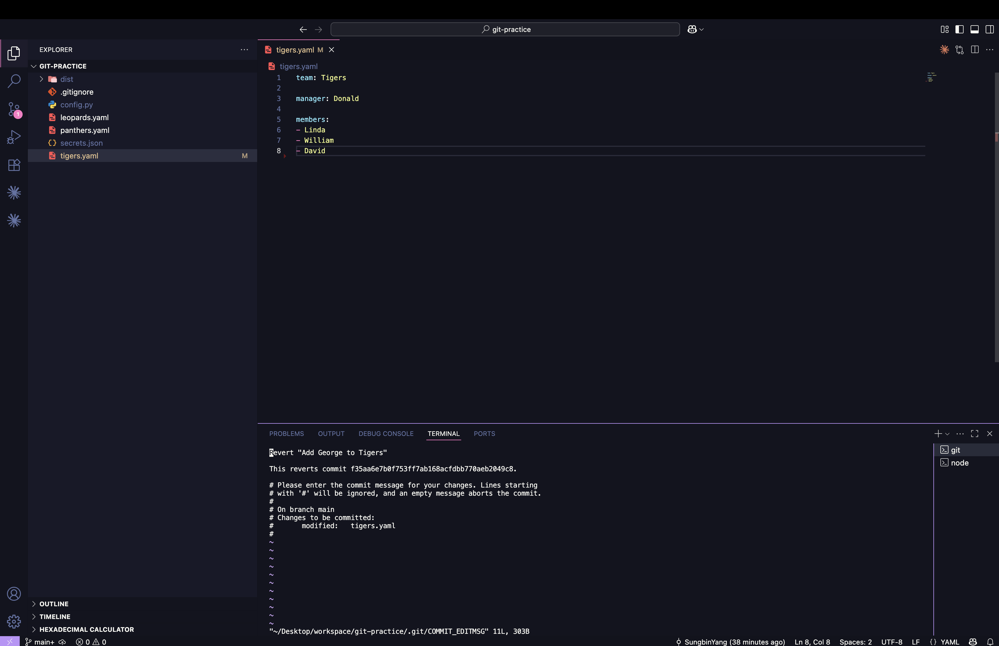

`:wq`를 누르면 과거를 청산한 새로운 커밋이 생긴다.

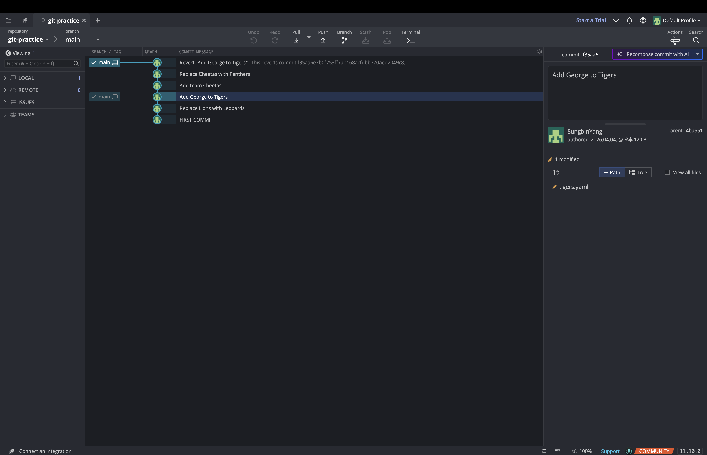

하지만 보통 `revert`는 이렇게 순조롭지 않다. 그것을 위해 한번 다른 실습을 해보도록 하겠다. "Replace Lions with Leopards"라는 커밋 해시를 통해 revert를 해보겠다. 하지만 이러면
아래와 같이 이상한 문제가 발생한다.

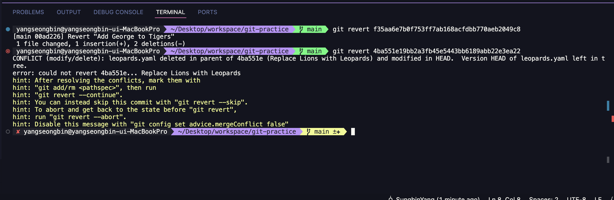

`lions.yaml`과 `tigers.yaml`은 잘 반영이 되는 것 같지만 `leopards.yaml`이 충돌이 발생했다고 한다. 그 이유는 해당 커밋 이후에 `leopards.yaml`의 내용을 수정했던 경험이
있기 때문인데 이때 커밋으로 되돌리려니 git은 내가 해당 커밋에서 생성한 파일이 아닌데라고 판단하는 것이다. 이런 경우는 어떻게 할까? 일단 우리는 `leopards.yaml`을 삭제하기를 원하니 아래와 같은
방법으로 해결을 취할 수 있을 것이다.

```shell
git rm leopards.yaml // Git에서 해당 파일 삭제
```

이후에 `revert`를 이어서 진행해야 하니 아래와 같이 실행한다.

```shell
git revert --continue
```

이후 `:wq`로 커밋 메시지 저장을 하면 된다.

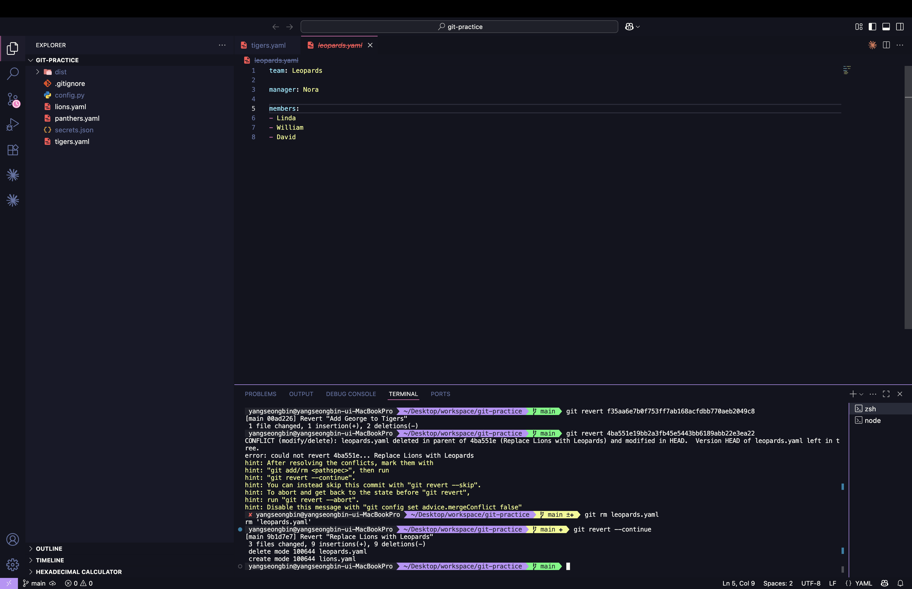

그러면 아래와 같이 된다.

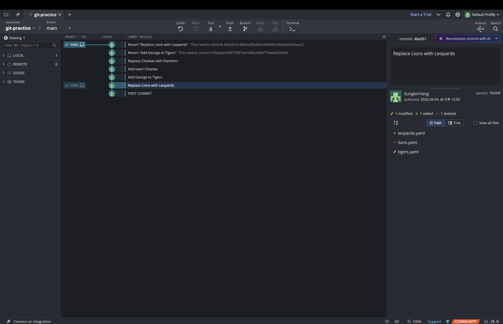

그런데 만약 이 revert를 했던 2개의 커밋을 revert를 하고 싶다면 어떻게 할까? 말 그대로 revert를 이용해서 해도 된다. 하지만 그러면 너무 불필요한 커밋이 생성된다. 따라서 깔끔하게 하기 위해서는
`reset`을 이용해주면 된다.

### checkout으로 과거 방문하기

마지막 시간 여행 방법은 마치 타임머신을 타고 현재를 두고 과거로 가는듯한 방법이 존재한다. 바로 `checkout` 방법이다. 아래 명령어로 특정 커밋 방문할 있다.

```shell
git checkout "(방문할 커밋 해시)"
```

그리고 볼일을 마치고 다시 현재로 돌아오려면 아래와 같이 `switch` 명령어를 해주면 된다.

```shell
git switch main
```

## 💡 checkout 명령어에 대하여

오늘날 checkout 명령어는 그 의미가 불명확한 부분이 있어서 이 글에서도 알려드리지만 switch와 restore로 분화되어 사용된다. 단 이 글에서는 이전 글에서와 같이 특정 커밋으로 detach되어 이동을
할 때, checkout 명령어를 사용하도록 안내드렸다. 이 때 checkout 대신 switch 명령을 사용하려면 `--detach` 옵션을 붙여야 하므로 이 용도에 한해 이 글에서는 `checkout`을
사용한다. 즉 해당 명령에서 'checkout'은 'switch --detach'로 대체될 수도 있다고 이해하면 좋을 것 같다.

## GUI 및 AI로 진행해보기

지금까지 작업을 GitKraken과 Claude Code로 해보겠다. 먼저 그 전에 아래와 같은 변경사항들을 만들자.

- `leopards.yaml` 삭제
- `.gitignore`에 `.config` 추가
- `hello.txt` 추가 (내용 자유)

그리고 깃 크라켄을 가보자 아마 아래와 같은 화면이 보일 것이다.

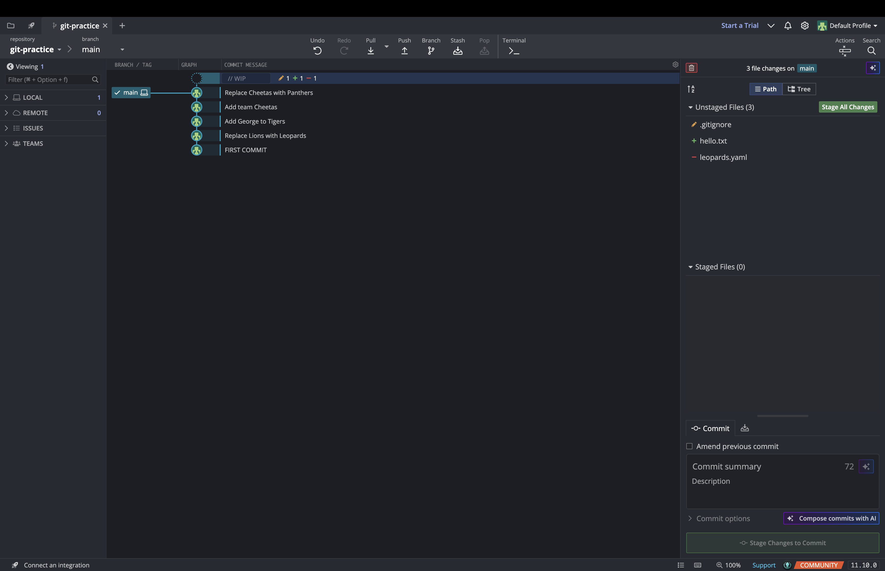

이제 깃 크라켄으로 `add`를 해보자. 우측 상단에 Stage All Changes를 누르자. 그러면 아래와 같이 될 것이다.

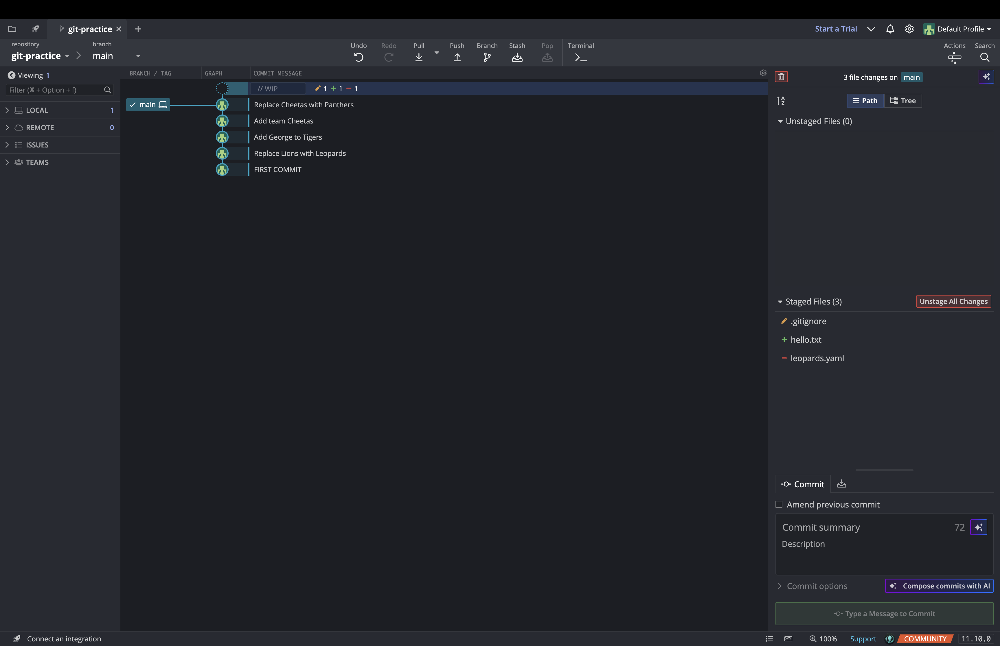

이후 하단에 커밋 메세지를 작성하고 하단 초록색 버튼을 클릭하면 커밋이 정상적으로 되는 것을 볼 수 있다.

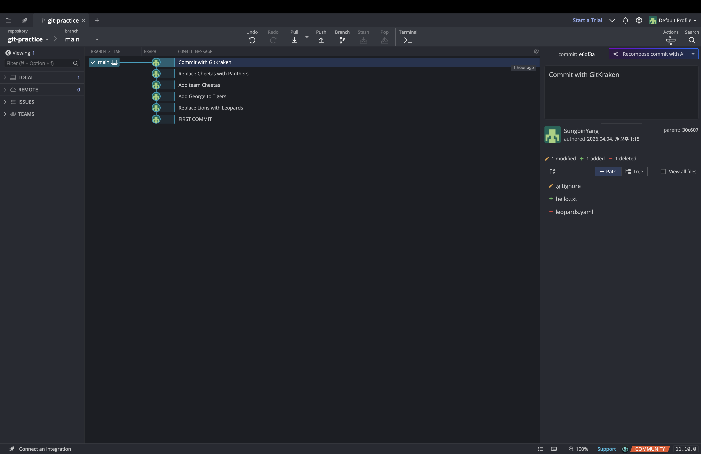

이제 다음으로 `revert`를 해보자. 원하는 커밋의 우측 클릭을 하고 revert로 시작하는 버튼을 클릭하자. 그러면 아래와 같이 나올 것이다.

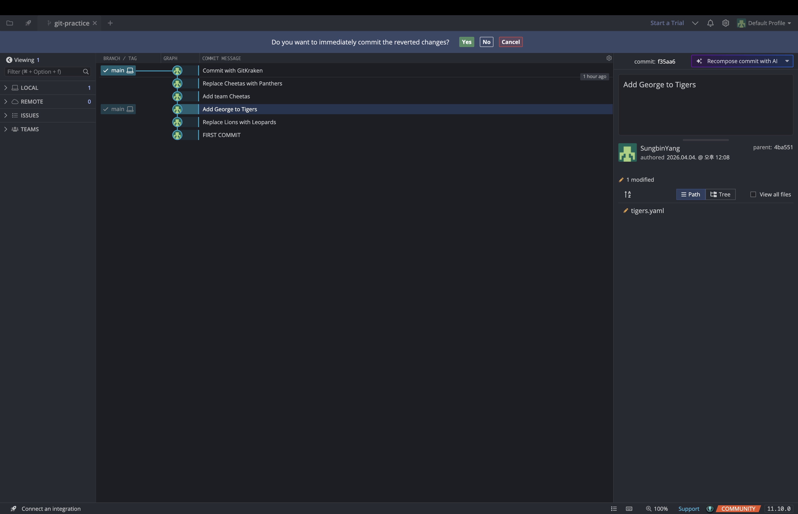

yes를 클릭하면 revert가 된다.

reset도 마찬가지다. 원하는 시점을 우측 클릭한 후 `reset`으로 시작하는 버튼을 누르면 soft, mixed, hard 옵션을 고르는데 hard 옵션을 택하면 바로 반영되는 것을 알 수 있을 것이다.

이 작업들도 전부 Claude Code한테 위임 시킬 수도 있다. 적절한 프롬프트를 이용하면 가능하니 한번 직접 해보자.