> 해당 포스팅은 인프런의 [제대로 파는 Git & GitHub - by 얄코(Yalco)](https://inf.run/VyuWK) 강의를 참조하여 작성한 글입니다.

## 여러 브랜치 만들어보기

우리가 소프트웨어를 만들면서 혼자서 개발하는게 아니라면 팀원들과 같이 개발을 진행할 것이다. 그러면 각기 다른 팀원들이 작업을 하다보면 실제 배포되는 버전들에 많은 영향을 미칠 것이다. 만약 `main` 브랜치에서
작업을 한다고 하면 충돌도 많이 발생하고 버그들도 사용자들에게 노출 될 위험이 존재한다. 이를 위해 깃에서는 멀티버스를 만드는 기능을 제공한다. 이것이 바로 **브랜치** 이다. 현재의 시간 선에서는 정식으로 안정된
버전들만 출시하고 새로운 기능을 개발하는 과정은 평행 우주의 다른 차원에서 진행을 하는 것이다. 이렇게 새롭게 개발한 기능이 완성되고 QA도 거치면 이를 정식 버전 출시 우주세계로 가져와 적용하는것이다. 사용자들은
이런 정식 버전 우주에서 살고 있기 때문에 미완성이거나 문제가 있는 버전을 마주할 가능성이
적어지는 것이다.

신규 기능뿐만 아니라 버그 해결, 성능 개선, 리팩토링등 다양한 기능들이 다른 우주, 즉 다른 브랜치에서 진행되고 정식 버전으로 출시되어도 문제가 없을지 검증과정까지 거친 다음 메인 브랜치로 병합되거나 옮겨지게
된다. 이 모든 과정을 프로젝트 폴더를 별도로 복사하지 않고도 해결할 수 있는 것이 git 브랜치의 개념이다.

### 브랜치 생성 / 이동 / 삭제하기

그러면 실습으로 브랜치를 생성부터 해보도록 하겠다. 먼저 `add-coach`라는 브랜치를 만들어보도록 하겠다. 명령어는 아래와 같다.

```shell
git branch add-coach
```

그리고 정말 브랜치가 잘 만들어졌는지 확인하는 명령어를 보겠다. 아래의 명령어를 입력하여 확인하거나 깃 크라켄으로 손쉽게 확인이 가능하다.

```shell
git branch
```

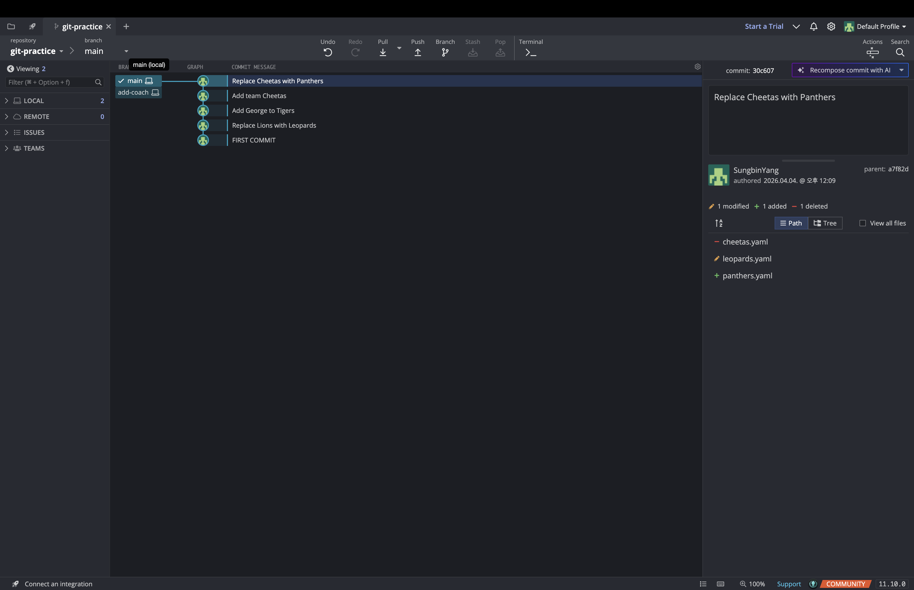

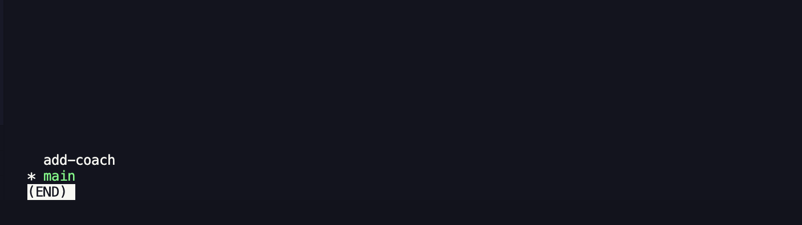

이제 `add-coach`라는 새로운 차원을 만들었으니 그 차원으로 이동하는 명령어를 보도록 하겠다. 아래의 명령어를 입력하면 해당 브랜치로 이동을 하게 된다.

```shell
git switch add-coach
```

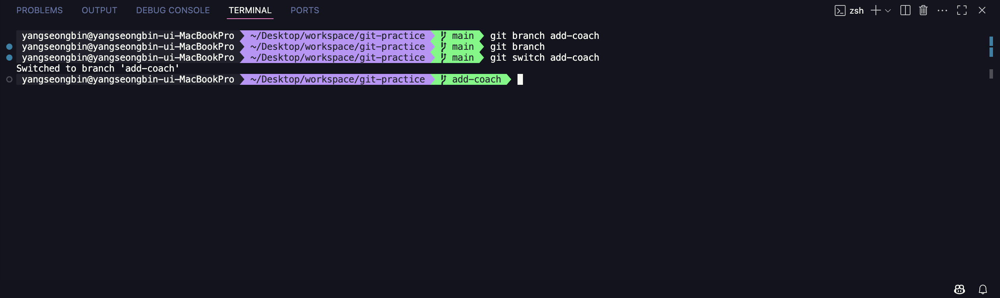

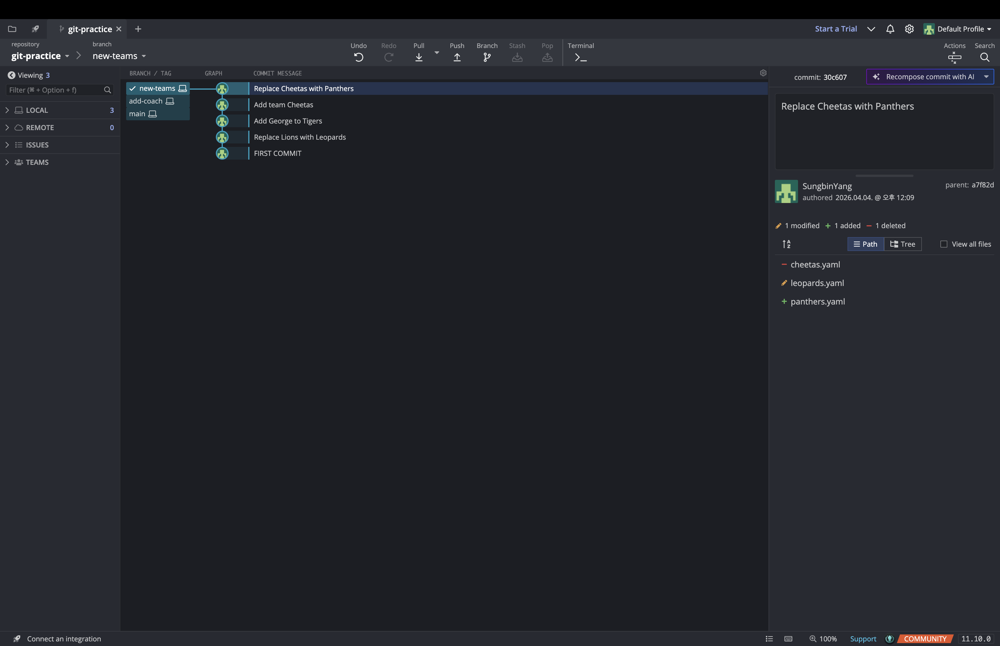

> 기존에는 checkout 명령어인데 checkout 명령어가 Git 2.23 버전부터 switch, restore로 분리되었다.

### 브랜치 생성과 동시에 이동하기

다음으로 해당 브랜치를 생성함과 동시에 이동하는 명령어를 알아보도록 하겠다. 아래의 `switch` 명령어에 c 옵션을 추가해주면 된다.

```shell
git switch -c new-teams
```

> 기존의 `git checkout -b (새 브랜치명)`

### 브랜치 삭제하기

다음으로 브랜치를 삭제해보는 실습을 해보겠다. 먼저 삭제할 브랜치를 생성하고 이동하지 않은 채 그 브랜치를 아래의 명령어를 통해 삭제를 하면 된다. 여기서 주의 점은 삭제할 브랜치로 이동하면 안 된다는 것이다.

```shell
git branch -d "(삭제할 브랜치명)"
```

### 브랜치 이름 바꾸기

브랜치 이름을 바꾸는 것도 간단하다. 기존 브랜치나 새로 만든 브랜치를 아래의 명령어를 통해 변경이 가능하다.

```shell
git branch -m "(기존 브랜치명)" "(새 브랜치명)"
```

### 브랜치 강제삭제

다음으로 브랜치를 강제 삭제하는 방법을 알아보자. 강제 삭제를 하는 경우는 다음과 같다. 새 브랜치를 만들고 변경사항을 만들어 커밋까지 진행한 경우이다. 그리고 해당 브랜치를 삭제하려고 하면 이미 커밋된 브랜치라고
경고 에러창이 나온다. 변경사항이 발생한 브랜치는 이전에 배운 `git branch -d 삭제할 브랜치`로 작업을 할 수 없다. 그러면 이런 경우에 삭제를 하고 싶은 경우는 어떻게 할까? 바로 아래와 같은 명령어를
치면 강제 삭제가 가능하다.

```shell
git branch -D "(강제삭제할 브랜치명)"
```

이제 각자 여러 변경사항을 브랜치별로 만들어서 진행해보자. 필자도 다양하게 해보았고 깃 크라켄으로 본 결과 아래와 같이 나왔다.

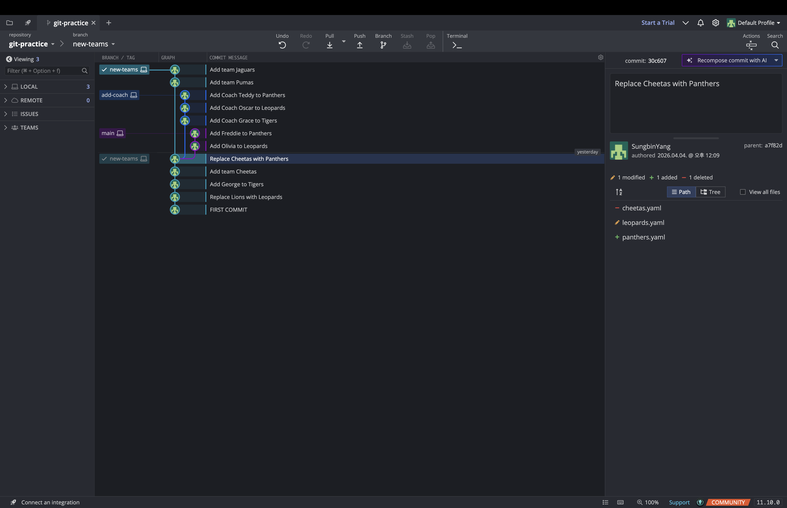

실무에서는 크게 많이 사용할 일은 없지만 모든 브랜치의 깃 로그들을 이쁘게 볼 상황도 있을 것이다. 그럴 경우 아래의 명령어를 치면 다음과 같이 나온다.

```shell
git log --all --decorate --oneline --graph
```

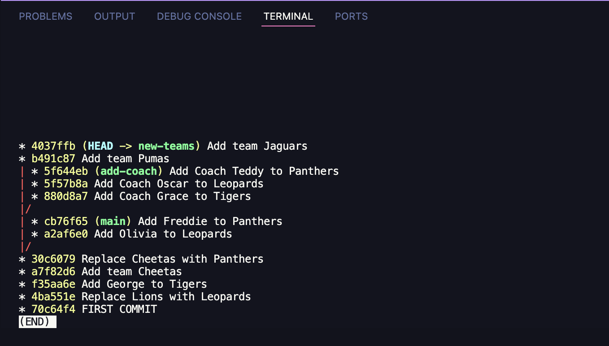

## 브랜치를 합치는 두 가지 방법

이제 여러 브랜치에서 만든 각 작업 사항들을 다시 한군데로 합치는 2가지 방법에 대해 알아보도록 하겠다. 두 브랜치를 하나로 병합하는 'merge'와 한 가지 브랜치를 다른 가지로 재 배치하는 'rebase'에 대해
알아 볼 것이다.

먼저 merge를 살펴보자. merge는 분기된 브랜치에서 만들어진 변경사항들이 하나의 새로운 지점으로 모이는 것이 merge이다. 다음으로 rebase이다. rebase는 기존 분기된 브랜치의 작업 내역들을 대상
브랜치로 옮겨 붙이는 재배치 방식이다. 그 결과로 기존 브랜치에서 옮겨온 커밋과 같은 작업들을 추가로 진행한 것과 같은 결과물이 만들어진다.

즉, merge와 rebase는 하나의 브랜치로 옮겨진다라는 관점에서 같은 역할이다. 차이가 있다면 merge의 경우 이를 실행한 뒤에도 해당 브랜치의 흔적의 내역이 남는 반면 rebase는 대상 브랜치에서 커밋한
것과 같은 모습이 되므로 이전에 어떤 브랜치를 했든지 보이지 않게 된다는 점이다.

브랜치들의 기록을 남기면 이후 유용할 수도 있지만 실무에서 무수히 많은 브랜치들이 사용될 경우 내역이 매우 복잡해질 수도 있다. 이러한 점을 인지하고 두 방법들 중에 상황에 적절한 것을 이용하면 좋을 것이다.

### merge로 합치기

그러면 실습을 진행해보도록 하겠다. 먼저 `add-coach` 브랜치를 `main` 브랜치로 merge를 해보도록 하겠다. 먼저 `main` 브랜치로 이동을 한 뒤에 아래의 명령어로 병합하면 되는 것이다.

```shell
git merge add-coach
```

그러면 아래와 같은 vi창이 나올 것이다.

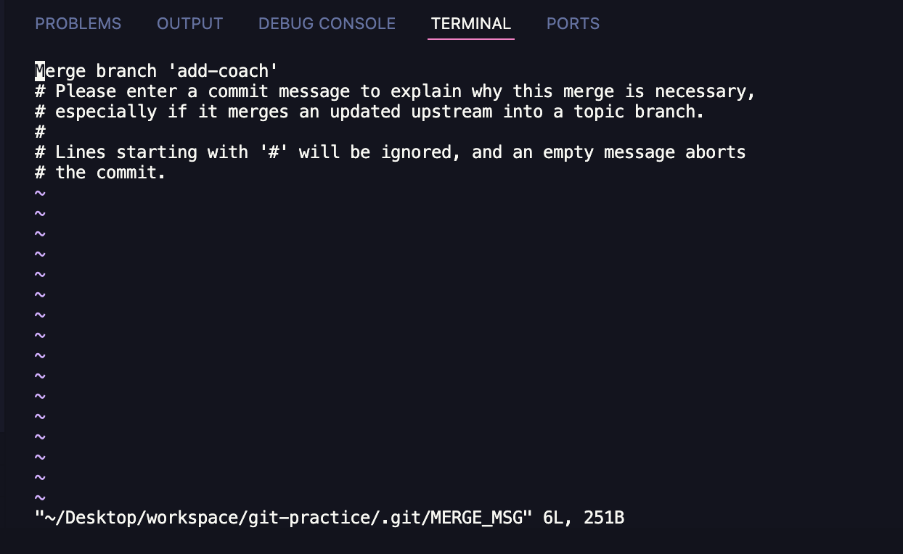

`:wq`를 입력하고 자동입력된 커밋 메시지 저장하여 마무리하면 된다. 그리고 깃 크라켄을 확인해보면 아래와 같다.

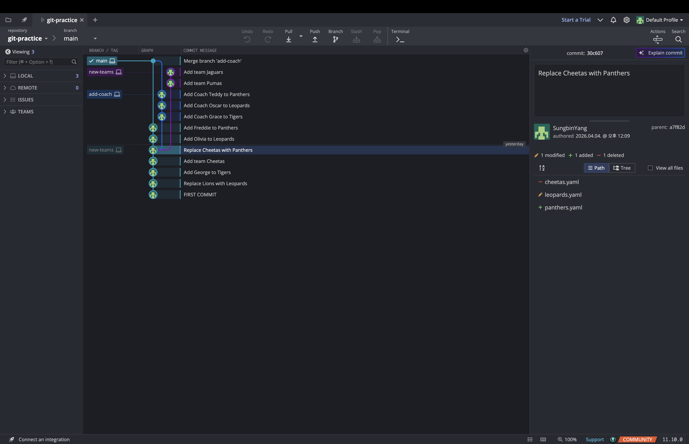

깃 크라켄을 보면 알겠지만 합쳐짐과 동시에 새로운 커밋이 생김을 볼 수 있다. 이는 즉, 해당 머지 커밋도 `reset`을 통해 되돌릴 수 있다는 것이다.

```shell
git reset --hard "돌리고 싶은 커밋 해시"
```

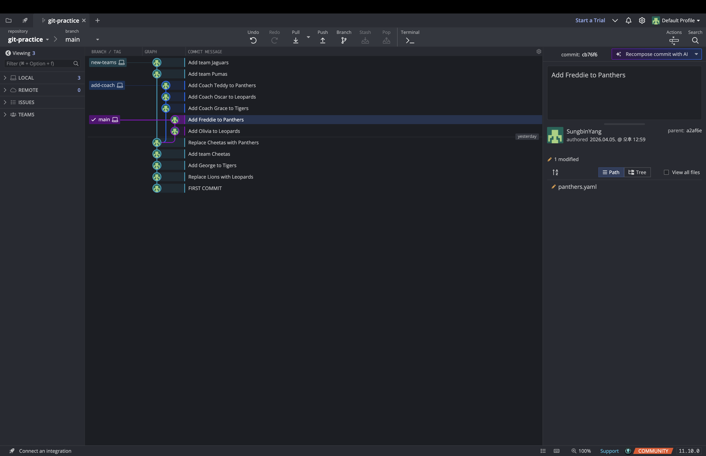

이제 `add-coach` 브랜치는 삭제를 해보도록 하자. 기존 커밋들이 합쳐졌으므로 아래의 명령어로 브랜치를 삭제해보자.

```shell
git branch -d add-coach
```

### rebase로 합치기

이제 `rebase`로 합쳐보자. `new-teams` 브랜치를 `main` 브랜치로 rebase를 해보자. 이는 merge와 다르게 `new-teams` 브랜치로 이동을 한 뒤에 아래의 명령어를 수행하자.

```shell
git rebase main
```

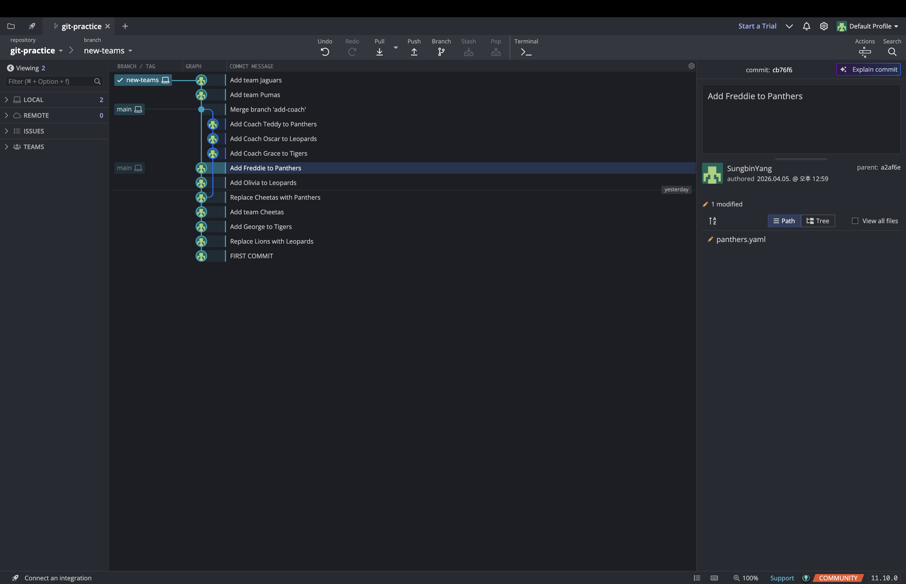

깃 크라켄을 확인해보면 main 브랜치는 뒤쳐져 있는 상황이다. 이를 위해 `fast-forward`를 해줘야 한다. 이는 나중에 한번 학습하니 이런게 있구나라고 넘어가자. `fast-forward`를 해주려면
방법은 아래와 같이 merge를 하면 된다.

> main 브랜치로 일단 이동은 해야 한다.

```shell
git merge new-teams
```

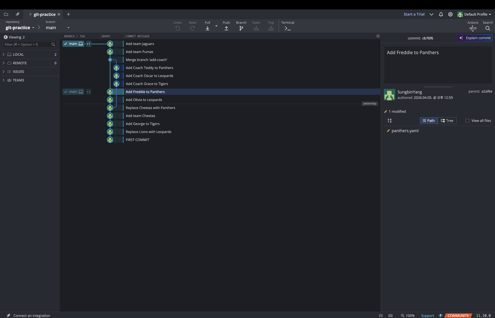

## 충돌 해결하기

merge와 rebase가 위의 실습처럼 항상 순조롭게 이루어지지는 않는다. 이번에는 merge 및 rebase 과정에서 충돌이 발생하도록 만든 다음에 이를 해결해보도록 하겠다.

### merge 충돌하기

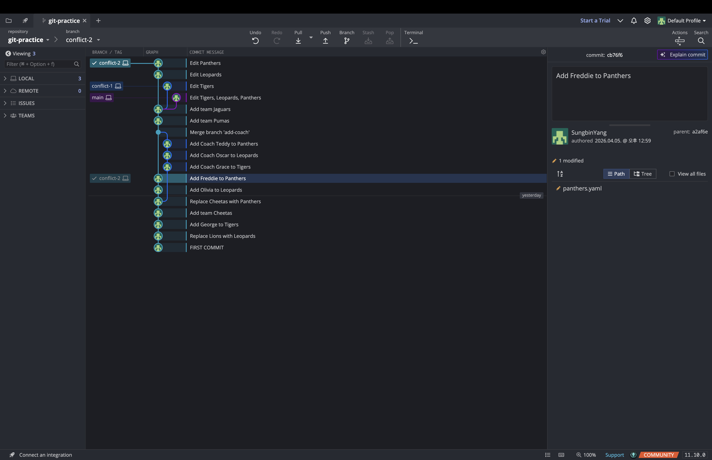

이제 위와 같은 상황을 만들어보자. 이후 merge 충돌을 만들어보겠다. 아래의 명령어를 실행해보자.

```shell
git switch main
git merge confilct-1
```

그러면 아래와 같은 화면이 나올 것이다.

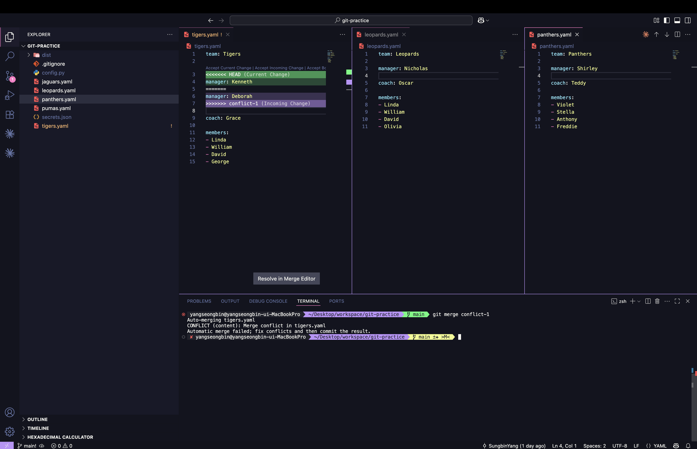

바로 충돌이 발생한 것이다. 오류 메시지와 `git status` 확인을 해보자. 그러면 아래와 같이 뜨는 것을 볼 수 있을 것이다.

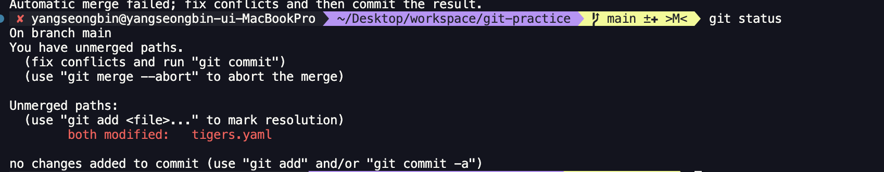

이렇게 충돌이 발생하면 반드시 해결을 해야한다. 만약 해당 충돌이 당장 해결하기 어렵다면 아래의 명령어로 merge를 중단해야 한다.

```shell
git merge --abort
```

해결 가능 시 충돌 부분을 수정한 뒤 `git add .` , `git commit`으로 병합 완료하면 된다. 해결 방법은 다양한데 아래처럼 IDE에서 많은 도움을 주니 원하는 것을 선택해서 진행을 하면 된다.

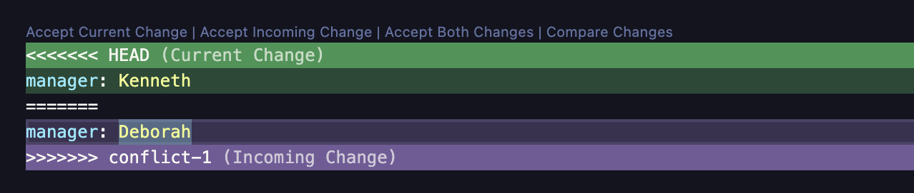

### rebase 충돌 해결하기

다음으로 rebase 충돌을 살펴보자. `conflict-2`에서 `git rebase main`로 리베이스 시도하면 충돌 발생한다.

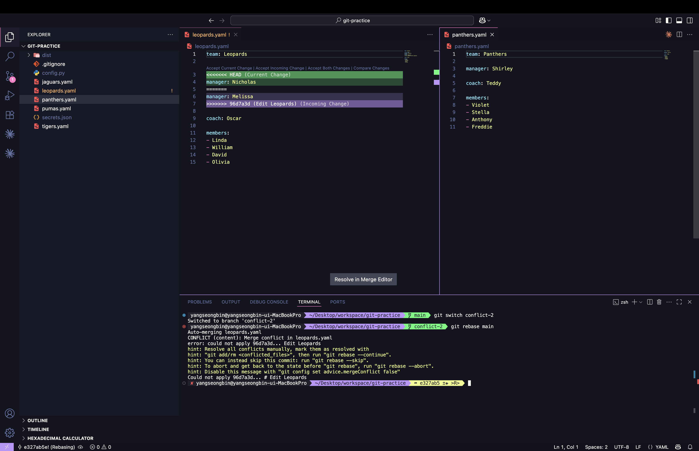

이것도 머지와 다를 것 없이 충돌을 해결해야 한다. 하지만 차이가 있다면 커밋마다 rebase 충돌이 발생한다면 매번 해결을 해줘야 한다는 점이 있다.

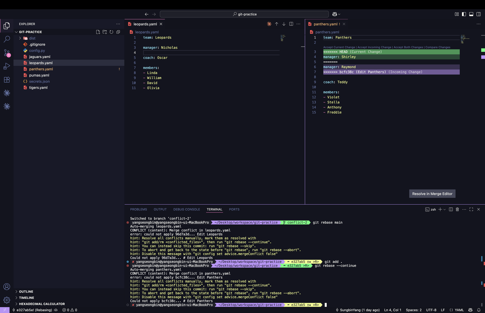

물론 당장 해결이 어렵다면 아래의 명령어로 중단도 가능은 하다.

```shell
git rebase --abort
```

해결이 가능 시, `git add .`를 진행하고 아래의 명령어로 계속 커밋마다 진행하면 된다.

```shell
git rebase --continue
```

충돌이 모두 해결될 때까지 반복하면 되는 것이다. 이후 모두 해결이 되었다면 `git commit`을 입력하여 자동 생성되는 커밋을 반영하면 된다.

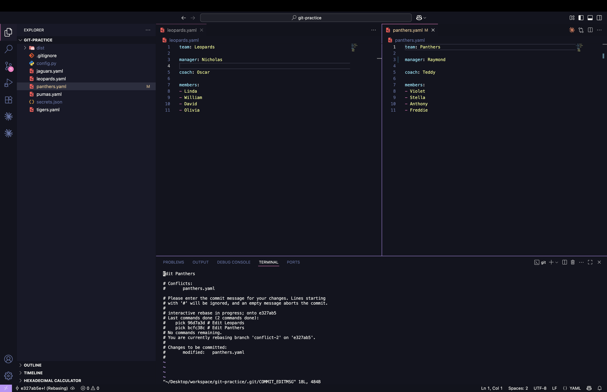

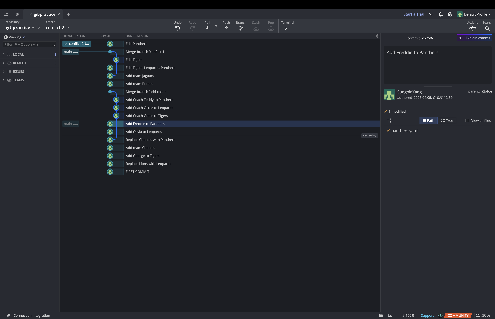