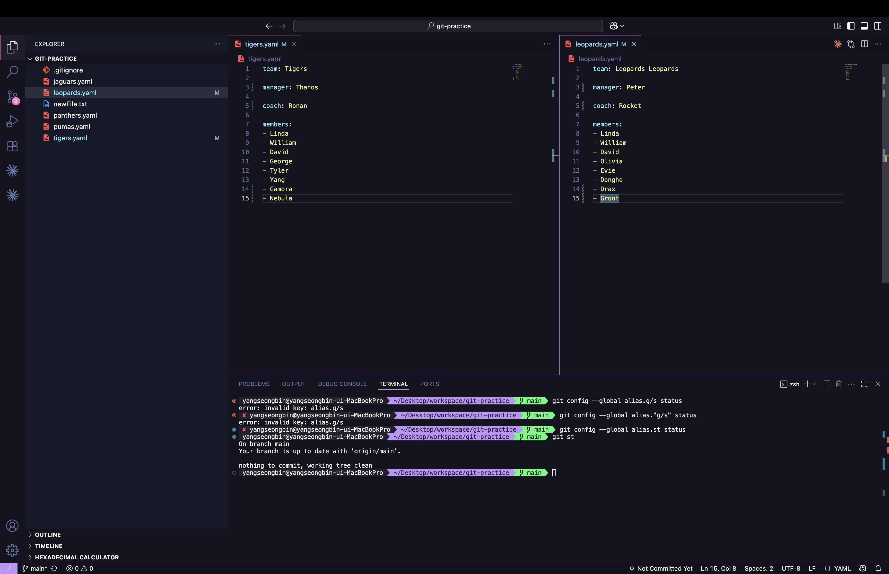
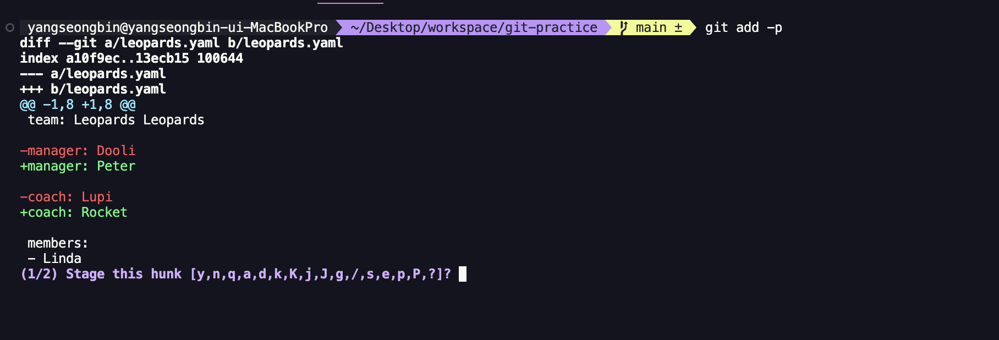
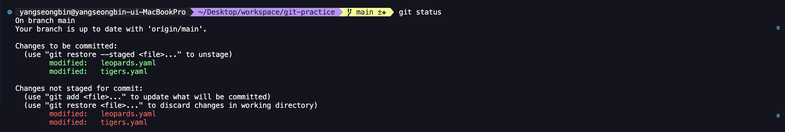
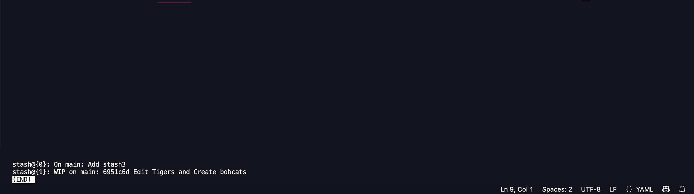

> 해당 포스팅은 인프런의 [제대로 파는 Git & GitHub - by 얄코(Yalco)](https://inf.run/VyuWK) 강의를 참조하여 작성한 글입니다.

## 어떻게 커밋하는게 좋을까요?

이번에는 깃에서 커밋을 할 때 유의할 점 및 실무에서 유용한 전략들을 알아보자.

첫번째로 **원자적이고 집중된 커밋** 원칙이 존재한다. 쉽게 말해 한 커밋에는 하나의 작업만 담아야 하는 원칙이다. 원자적이라는 것은 둘로 쪼갤 수 없다라는 것이다. 한 커밋에는 독립된 작업들을 포함해서는 안된다는
것이다. 그리고 커밋은 오직 하나의 논리적인 변경만을 나타내야 한다. 이렇게 하면 변경 사항을 이해하기 쉽고 필요한 경우 해당 커밋만 되돌리기 쉽다. 즉, 커밋은 단위가 작을수록 좋다. 너무 큰 커밋은 리뷰와
되돌리기가 너무 쉽지 않기 때문이다. 작은 단위로 쪼개면 작업 흐름도 자연스럽게 정리된다. 그렇다고 세이브 버튼 누르듯이 너무 자주 커밋하는 것도 좋지 않다. 커밋은 특별한 경우가 아닌 이상 완전한 빌드 및 실행이
가능한 상태로 만들어야 한다.

또한 커밋 메세지들은 각 커밋에서 어떤 작업들이 이루어져 있는지 명확히 설명해야 한다.

이러한 점들만 기억해도 깃을 효율적이고 체계적으로 이용이 가능하다.

개발 업계에서는 깃 메세지들을 작성하는데 널리 사용되는 여러 스타일들이 존재한다. 재직중인 회사에서 이미 사용 중인 스타일이 존재한다면 그에 따르면 되고 아직 합의된 형식이 존재하지 않는다면 지금부터 다룰 스타일
중에 하나를 선택해서 사용하면 된다.

첫번째로 **Conventional** 스타일이다. 가장 널리 사용되는 스타일이다. 바로 아래와 같이 각 작업의 종류가 적히게 된다.

| 타입       | 설명                           |
|----------|------------------------------|
| feat     | 새로운 기능 추가                    |
| fix      | 버그 수정                        |
| docs     | 문서 수정                        |
| style    | 공백, 세미콜론 등 스타일 수정            |
| refactor | 코드 리팩토링                      |
| perf     | 성능 개선                        |
| test     | 테스트 추가                       |
| chore    | 빌드 과정 또는 보조 기능(문서 생성기능 등) 수정 |

앞에 붙은 이런 타입 정보를 통해 각 커밋에서 어떤 카테고리 작업들이 이루어졌는지 파악이 쉽게 가능하다. 필수는 아니지만 타입 종류 옆에 ()를 통해 각 작업이 어느 범위에 이루어졌는지 명시할 수 있다. 이것이
현업에서 가장 널리 사용되는 스타일이다.

팀원들의 취향에 맞다면 아래와 같이 **Emoji Commits** 스타일도 존재한다. 각 타입들에 해당하는 이모지를 이용하는 방식이다.

| 이모지 | 설명                                 |
|-----|------------------------------------|
| ✨   | 새로운 기능 추가 (`feat`)                 |
| 🐛  | 버그 수정 (`fix`)                      |
| 📚  | 문서 수정 (`docs`)                     |
| 🎨  | 코드 구조/스타일 개선 (`style`, `refactor`) |
| ✅   | 테스트 관련 (`test`)                    |
| 📦  | 종속성/빌드 관련 (`chore`)                |

만약 이러한 스타일이 너무 번거롭게 느껴지고 특히 커밋 메세지를 영어로 작성하는 팀은 **Subject-Only** 스타일도 고려해볼 수 있다. 각 메세지는 영어로 명령형 문장을 작성해주면 좋을 것 같다.

오늘날에는 커밋 메세지 작성에 AI 도움을 받을 수 있다. 특히 커서와 같은 AI 에디터들은 프로젝트의 변경사항을 파악하고 메세지를 생성해주는 기능들을 제공한다. 그래서 적절하게 AI 도움을 이용해도 무방할 것이다.

## 보다 세심하게 스테이징하고 커밋하기

### 내용 확인하며 hunk별로 스테이징하기

이번에는 수정된 파일에서 원하는 부분만 따로 스테이징하는 방법에 대해 알아보도록 하겠다. 바로 실습을 해보자.



위와 같이 파일에 변경사항을 만들어보도록 하자. 여기서 우리는 각 파일에 여러 변경사항을 별도 커밋으로 담고 싶은 욕구가 생길 수 있다. 이런 변경사항들을 일종의 그룹단위로 커밋을 하고 싶은 경우인데 이 때 그룹
단위를 hunk라고 한다. hunk별 스테이징 진행을 하려면 아래의 명령어를 입력해주면 된다.

```shell
git add -p
```

그러면 아래와 같이 나올 것이다.



여기서 각 파일의 변경사항들이 diff로 나오고 이상한 알파벳들을 입력하라고 나온다. 이 알파벳이 어떤 것인지 궁금하면 `?`를 눌러보면 상세하게 어떤 것인지 나온다. 그래서 간단하게 해당 변경사항을 반영하고 싶으면
`y`를 아니면 `n`을 입력하자. 또한 종료하고 싶다면 `q`를 입력해주면 된다. 이렇게 일부만 스테이징하고 `git status`를 하면 아래와 같이 나옴을 알 수 있다.



이렇게 일부만 스테이징을 할 수 있었다.

### 변경사항을 확인하고 커밋하기

다음으로 변경사항을 확인하고 신중하게 커밋하는 방법을 알아보자. 스테이징 상태로 올라오면 아래의 명령어를 통해 기존과 얼마나 달라졌는지 `diff`를 통해 확인이 가능하다. 이를 통해 변경사항을 확인하고 신중하게
커밋이 가능하다.

```shell
git diff --staged
```

또 다른 방법은 확인을 즉시 하고 바로 커밋하는 방법이 존재한다. 바로 아래의 명령어를 이용하면 vi창으로 커밋 메세지 입력칸이 나오고 아래로 변경사항들이 쭉 나온다. 이렇게 신중하게 변경사항들을 다 확인하고 커밋
진행이 가능하다.

```shell
git commit -v
```

## 커밋하기 애매한 변화 치워두기

이번에는 커밋하기 애매한 것을 잠시 치워두는 방법을 알아보자. 어떤 작업을 하던 중에 버그 해결등 급한 다른 일이 들어와서 그 건부터 처리할 때 사용한다. 한번 바로 실습을 해보자.

일단 파일에 아무 변경사항을 만들어보자. 이제 해당 변경사항을 아래 명령어로 치울 수 있다.

```shell
git stash
```

그리고 긴급한 건이 완료되었다면 일단 치워뒀던 것을 다시 가져와야 할텐데 아래의 명령어로 가져올 수 있다.

```shell
git stash pop
```

또한, `git add -p`와 같이 원하는 것만 stash를 할 수 있다. 바로 아래의 명령어로 적용할 수 있다.

```shell
git stash -p
```

또한, 아래와 같이 메세지와 함께 stash가 가능하다.

```shell
git stash -m 'Add Stash3'
```

그리고 아래의 명령어로 stash를 했던 list들을 볼 수 있다.

```shell
git stash list
```



위와 같이 나온 리스트 번호상으로 `apply`, `drop`, `pop`이 가능하다.

> e.g. `git stash apply stash@{1}`

이 외에도 다양한 stash 사용법이 있는데 아래의 표를 참고해보자.

| 명령어                        | 설명                          | 비고                |
|----------------------------|-----------------------------|-------------------|
| git stash                  | 현 작업들 치워두기                  | 끝에 save 생략        |
| git stash apply            | 치워둔 마지막 항목(번호 없을 시) 적용      | 끝에 번호로 항목 지정 가능   |
| git stash drop             | 치워둔 마지막 항목(번호 없을 시) 삭제      | 끝에 번호로 항목 지정 가능   |
| git stash pop              | 치워둔 마지막 항목(번호 없을 시) 적용 및 삭제 | apply + drop      |
| 💡 git stash branch (브랜치명) | 새 브랜치를 생성하여 pop             | 충돌사항이 있는 상황 등에 유용 |
| git stash clear            | 치워둔 모든 항목들 비우기              |                   |

## 커밋 수정하기

이번에 학습할 것은 커밋을 수정하는 방법이다. 간혹, 잘못된 커밋을 올린다거나 커밋 메세지를 잘못 적었을 경우에 유용하다. 물론 `git reset --soft`로 리셋을 하고 다시 커밋을 이용해도 되지만 해당
방법을 사용하면 매우 유용할 것이다. 바로 `commit`에 `--amend` 옵션을 아래와 같이 하는 것이다.

```shell
git commit --amend
```

해당 명령어는 가장 마지막 커밋을 수정하는 역할을 한다. 이를 통해 원하는 변경사항을 가장 마지막 커밋에 합쳐서 넣을 수 있고 커밋 메세지도 변경을 할 수 있다. 물론 커밋 메세지 변경은 아래와 같이 한번에
메세지까지 입력을 하게 할 수 있다.

```shell
git commit --amend -m '원하는 메시지'
```

또한 커밋 메세지 변경 없이 내용만 추가하고 싶다면 아래와 같이 간편하게 하는 것도 가능하다.

```shell
git commit --amend --no-edit
```

## 과거의 커밋들을 수정, 삭제, 병합, 붙여넣기

이번에는 가장 최신 커밋이 아닌 그 이전의 커밋들도 포함한 커밋 히스토리들을 원하느데로 편집하는 방법에 대해 알아보자. 바로 아래의 명령어를 입력하면 된다. 여기서 유의할 점은 **"바로 이전의 커밋"** 이라는
점이다.

```shell
git rebase -i "(대상 바로 이전 커밋)"
```

해당 방법을 이용하면 커밋 내역들이 나오는데 기본적으로 pick이라고 되어 있을 것이다. 이것을 아래의 표와 같은 옵션들을 이용하여 다양하게 할 수 있다.

| 명령어       | 설명                            |
|-----------|-------------------------------|
| p, pick   | 커밋 그대로 두기                     |
| r, reword | 커밋 메시지 변경                     |
| e, edit   | 수정을 위해 정지                     |
| d, drop   | 커밋 삭제                         |
| s, squash | 이전 커밋에 합치기 (메시지 새로 작성)        |
| f, fixup  | 이전 커밋에 합치기 (메시지 이전 커밋 것으로 통일) |

여기서 가장 복잡한것은 e 옵션인데 이것은 기존 커밋을 수정하고 나누는데 유용하다. 그래서 e 옵션을 이용하면 해당 커밋으로 돌아가는데 잘못된 사항이라면 reset을 하여 돌린 다음에 커밋을 진행해주면 된다. 이후
반영이 완료되었다면 `git rebase --continue`로 진행을 해주면 정상 반영이 되는 것을 알 수 있다. 독자가 한번 직접 실습해보면 확실히 체감이 올 것이다.