> 해당 포스팅은 인프런의 [IntelliJ를 시작하시는 분들을 위한 IntelliJ 가이드](https://inf.run/doaZn) 강의를 참조하여 작성한 글입니다.

## 들어가며

이번 편의 주제는 조금 특별하다. 지금까지는 "코드를 어떻게 다룰 것인가"에 대한 이야기였다면, 이번에는 **"코드의 변경 이력을 어떻게 관리할 것인가"** 에 대한 이야기이기 때문이다.

그런데 여기서 자연스럽게 이런 의문이 들 수 있다. "Git은 터미널로 쓰면 되는데 굳이 IDE에서 해야 하나?" 강사님도 이 지점을 정확히 짚는다.

> "생각보다 많은 분들이 Git을 사용했다는 걸 알고 있었고, 근데 사용하는 게 대부분이 소스트리나 Git 터미널이었어요."
>
> "근데 사용해보시면 아시겠지만, 개발을 막 하다가 갑자기 소스트리로 넘어간다거나 Git 터미널로 넘어가면 **의식이 끊기게 됩니다.**"

이 "의식이 끊긴다"는 표현이 이번 편의 핵심이다. 사실 이건 시리즈 내내 반복된 주제이기도 하다. 코드 Edit 편에서 "마우스로 손이 옮겨가는 순간 흐름이 끊긴다"고 했던 것과 정확히 같은 이야기다.

코드를 짜다가 → 터미널을 열고 → `git status`를 치고 → `git add .`을 하고 → `git commit -m "..."`을 치고 → 다시 IDE로 돌아오는 이 왕복은, 단순히 시간을 잡아먹는 것을
넘어 **작업 맥락을 끊어버린다.**

그리고 IDE로 Git을 쓰면 터미널로는 어려운 것들이 가능해진다.

- 변경 내용을 **좌우 비교 화면 (Diff)** 으로 보고, **그 화면에서 바로 수정**할 수 있다.
- 커밋 그래프를 **시각적으로** 보면서 어느 브랜치에서 갈라졌는지 파악할 수 있다.
- 이 코드 한 줄을 **누가 언제 왜 바꿨는지** 클릭 한 번으로 확인할 수 있다.
- 커밋 직전에 **코드 포맷팅과 검사**를 자동으로 돌릴 수 있다.

그렇다고 터미널 Git을 몰라도 된다는 뜻은 아니다. 오히려 **Git의 개념 (스테이징, 커밋, 브랜치, 리베이스)을 이해하고 있는 상태에서 IDE를 쓸 때** 가장 강력하다. IDE는 그 개념을 더 편하게
실행하는 도구일 뿐이다.

## Git 기본 기능 사용하기

인텔리제이에서 Git을 사용하는 방법에 대해 살펴보도록 하자.

### Git View On

먼저, Git에 대한 기본적인 기능들이 있는 UI를 어떻게 볼 수 있는지 살펴보도록 하자. 그것을 우리는 Git View On이라고 한다. 인텔리제이 상단에 `View`탭에 들어가서 `Top Window`를 클릭하면
여러가지 기능들이 있는 메뉴바가 나오는데 여기서 Git을 선택하거나 혹은 단축키로 맥 기준 `command + 9`(윈도우/리눅스 `Alt + 9`)를 클릭하면 아래와 같이 Git 터미널 창같은 것이 나온다.

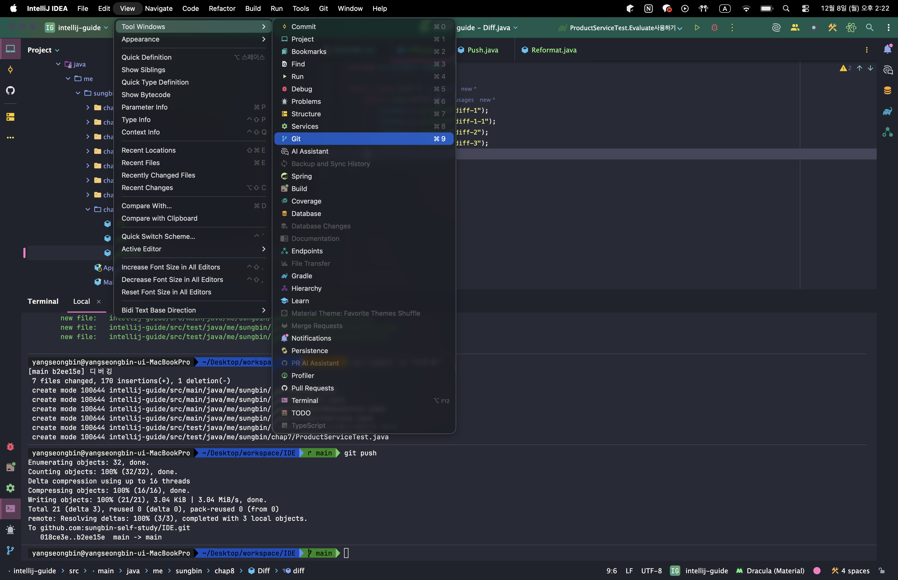

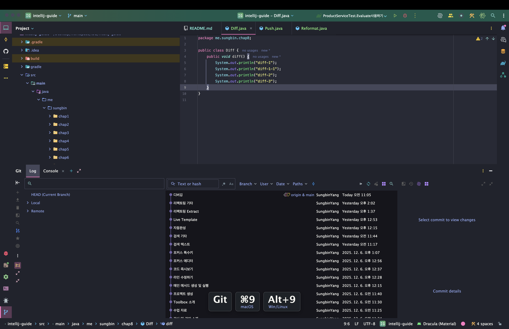

> 참고로 이 도구 창의 이름은 IntelliJ 버전에 따라 조금씩 달랐다. 예전에는 `Version Control`이었고 최근 버전에서는 `Git`으로 표시된다. 단축키 `command + 9`는 그대로다.
>
> 포커스 편에서 배운 도구 창 번호를 떠올려보자. `command + 1`이 Project였고, 여기 `command + 9`가 Git이다. 그리고 확인이 끝나면 **`Esc`로 에디터에 바로 돌아올 수 있다.**

위의 화면을 보면 다양한 기능들을 제공해주는데 먼저 로컬 저장소의 브랜치와 원격 저장소의 브랜치 목록을 볼 수 있으며 git graph처럼 그래프도 이쁘게 보여준다.

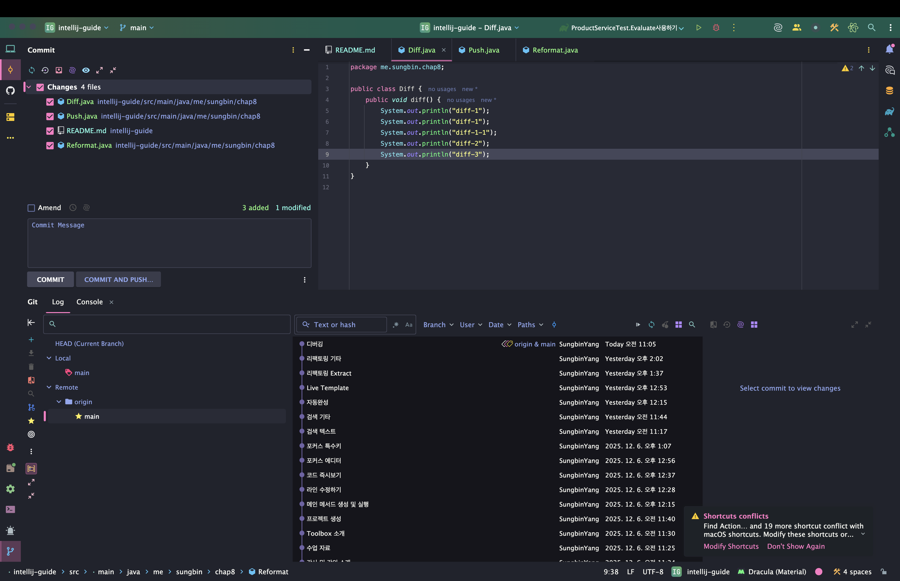

이 창은 크게 세 개의 탭으로 나뉘는데, 각각의 역할을 정리하면 다음과 같다.

| 탭                         | 대응하는 명령어   | 무엇을 보여주나                          |
|----------------------------|-------------------|------------------------------------------|
| **Local Changes** (Commit) | `git status`      | 아직 커밋하지 않은 변경 파일 목록        |
| **Log**                    | `git log --graph` | 커밋 히스토리를 그래프로                 |
| **Console**                | -                 | IntelliJ가 실제로 실행한 Git 명령어 로그 |

또한, 뭔가 로컬 저장소에 변화가 생기면 왼쪽 탭의 깃 관련 버튼을 누르면 위와 같이 저장소에 대한 변화도 한번에 확인이 가능하다.

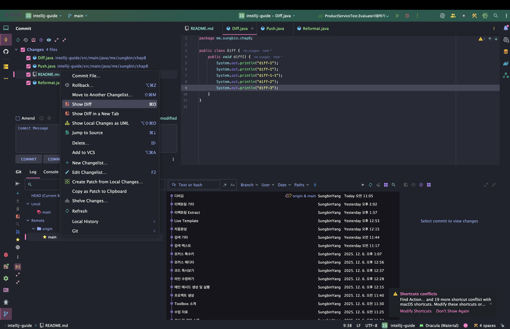

이런 로컬 저장소 변화 탭에서 파일 하나를 오른쪽 마우스 클릭을 하면 여러가지 기능을 할 수 있는데 여기서 `show diff`를 클릭하면 아래와 같이 변경점을 UI상으로 확인이 가능하다.

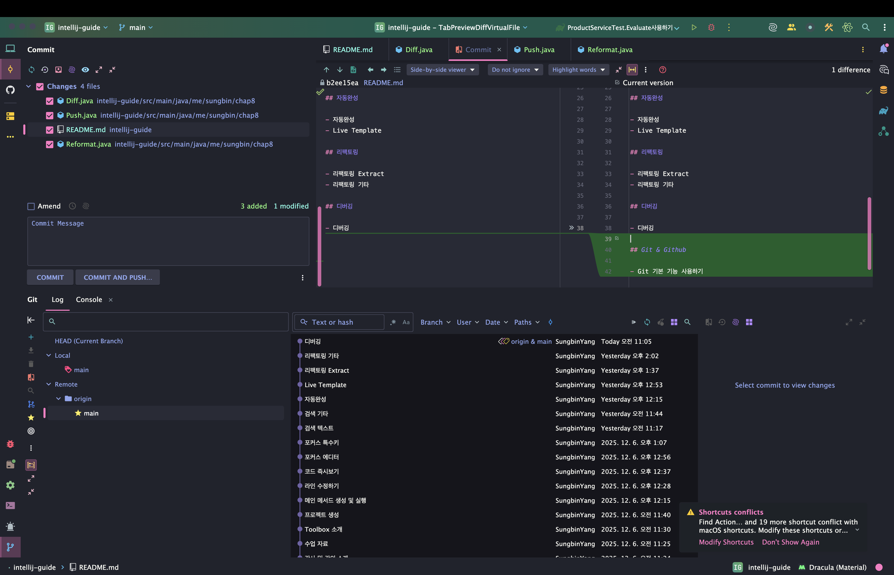

> **[중요] Diff 화면에서 바로 수정할 수 있다**
>
> 강사님이 IntelliJ Git의 장점으로 특히 강조하는 부분이 바로 이것이다.
>
> > "IntelliJ 같은 경우에는 디프 (diff) 화면에서 바로 수정이 가능하고, 그 수정한 내용은 그대로 원본 파일에 반영이 됩니다."
>
> 이게 왜 좋으냐면, 커밋 직전에 변경 내용을 훑어보다가 **"어 이거 디버깅용 출력문 지우는 걸 깜빡했네"** 를 발견했을 때, 파일을 다시 찾아가서 고치고 돌아올 필요가 없기 때문이다. Diff 화면 오른쪽
> (내 변경본)에서 그 자리에서 지우면 실제 파일에 그대로 반영된다.
>
> 소스트리 같은 별도 Git 클라이언트는 대부분 diff를 **보여주기만** 하기 때문에, 이 차이는 생각보다 크게 다가온다.
>
> 참고로 Diff 화면을 여는 단축키는 맥 `command + d`, 윈도우/리눅스 `Ctrl + d`다. 변경된 파일을 선택하고 누르면 된다. 그리고 diff 화면 안에서는 `F7`(다음 변경점) /
> `shift + F7`(이전 변경점)으로 변경 지점 사이를 이동할 수 있다.

또한, Git Graph에 커밋 하나를 클릭하면 왼쪽 창에 해당 커밋에 어떤 파일이 변경이 되었고 누가 작업을 했으며 해당 커밋에 대한 정보가 상세하게 잘 나온다.

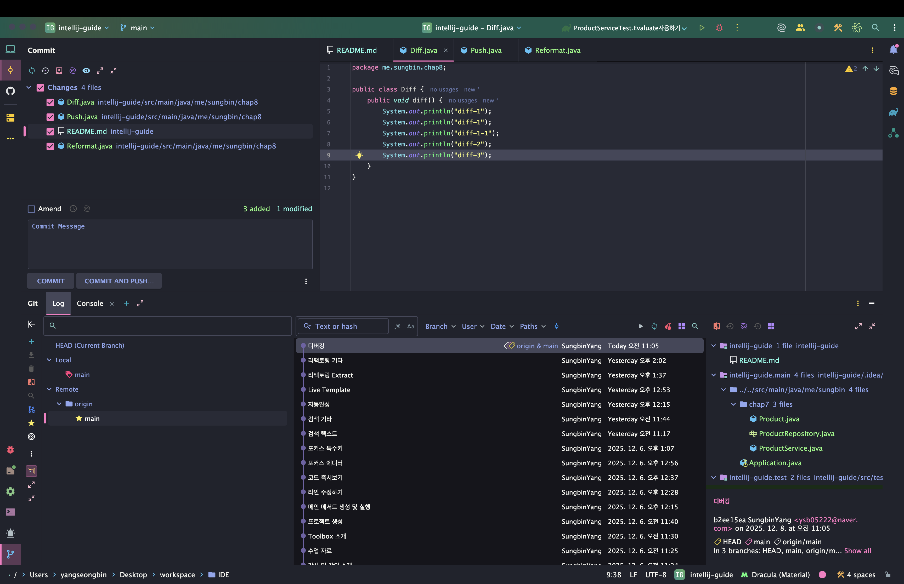

또한, 해당 커밋에 대해 다양한 기능도 제공하니 한번씩 실습을 해보면 좋을 것 같다.

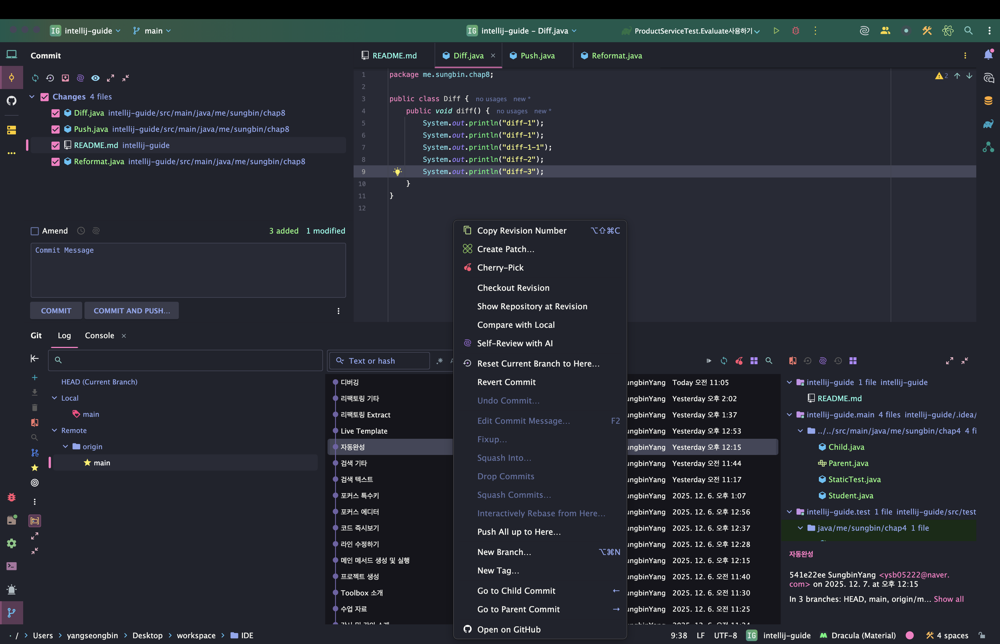

여기 우클릭 메뉴에 있는 것들 중 자주 쓰는 것을 정리하면 다음과 같다.

- **Checkout Revision**: 그 시점의 코드로 이동해본다
- **Cherry-Pick**: 그 커밋만 골라서 현재 브랜치에 가져온다
- **Revert Commit**: 그 커밋을 되돌리는 **새 커밋**을 만든다 (이력은 남는다)
- **Reset Current Branch to Here**: 브랜치를 그 시점으로 되돌린다 (뒤에서 자세히 설명)
- **Copy Revision Number**: 커밋 해시를 복사한다

다음으로, 깃 관련 터미널에 콘솔 버튼을 눌러보자. 그러면 내가 해당 프로젝트에 어떤 작업을 했는데 git 관련 로그가 나오는 것을 볼 수 있다.

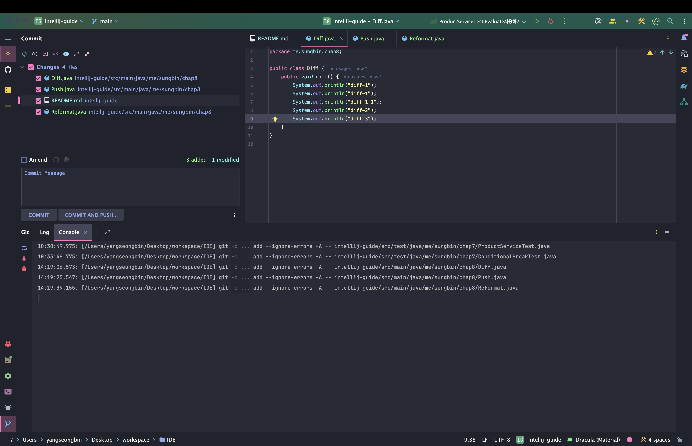

이 Console 탭은 평소에는 잘 안 보게 되지만 **문제가 생겼을 때 가장 먼저 봐야 할 곳**이다. 강사님도 이렇게 조언한다.

> "만약에 오류가 났을 때는 이쪽 콘솔 탭을 가서 보시면 됩니다."

IntelliJ가 버튼 뒤에서 실제로 어떤 `git` 명령어를 실행했고 어떤 응답이 돌아왔는지 그대로 나오기 때문에, 에러 메시지를 그대로 검색해서 해결할 수 있다. 그리고 **IDE가 하는 일이 결국 우리가
터미널에서 치던 명령어와 같다**는 것을 확인할 수 있어서, Git을 배우는 입장에서도 도움이 된다.

### Git Option Popup

다음으로 Git에 대하여 보다 상세한 기능들에 대해 살펴보도록 하자. 맥 기준 `Ctrl + v`(윈도우/리눅스 `Alt + 백틱`)를 입력하면 아래와 같은 팝업창이 나오고 해당 팝업 메뉴를 보면 우리가 익숙하게
사용한 Git관련 작업들이 나오는 것을 볼 수 있다.

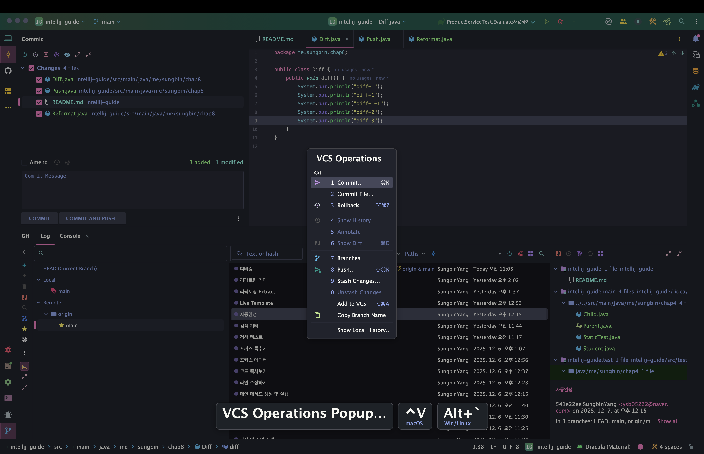

이 팝업의 정식 명칭은 **VCS Operations Popup**이다. Git과 관련된 거의 모든 작업이 여기 모여 있기 때문에, **다른 Git 단축키를 하나도 몰라도 이것 하나면 다 된다.** 검색 편의
`command + shift + a`(Action 검색)나 리팩토링 편의 `Ctrl + t`(Refactor This)와 같은 역할이라고 보면 된다.

여기서 편리한 점은 각 항목 앞에 **번호가 붙어 있다는 것**이다. 팝업을 띄운 뒤 숫자만 누르면 바로 실행되므로 마우스를 쓸 필요가 없다.

> 다만 이 번호는 **IntelliJ 버전이나 프로젝트 상태에 따라 달라질 수 있다.** 아래에서 "4번은 History", "7번은 Branch"라고 소개하지만, 여러분 화면에서는 다를 수 있으니 **번호를
외우기보다 항목 이름을 보고 누르는 습관**을 들이는 편이 안전하다.

### Git History

여기서 4번째의 History를 살펴보면 해당 파일에 대한 Git에 대한 history를 볼 수 있다.

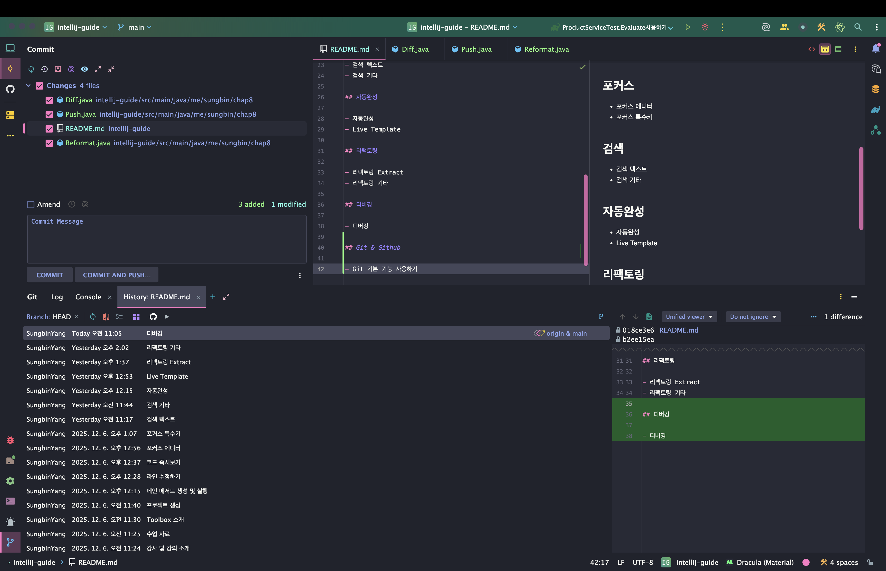

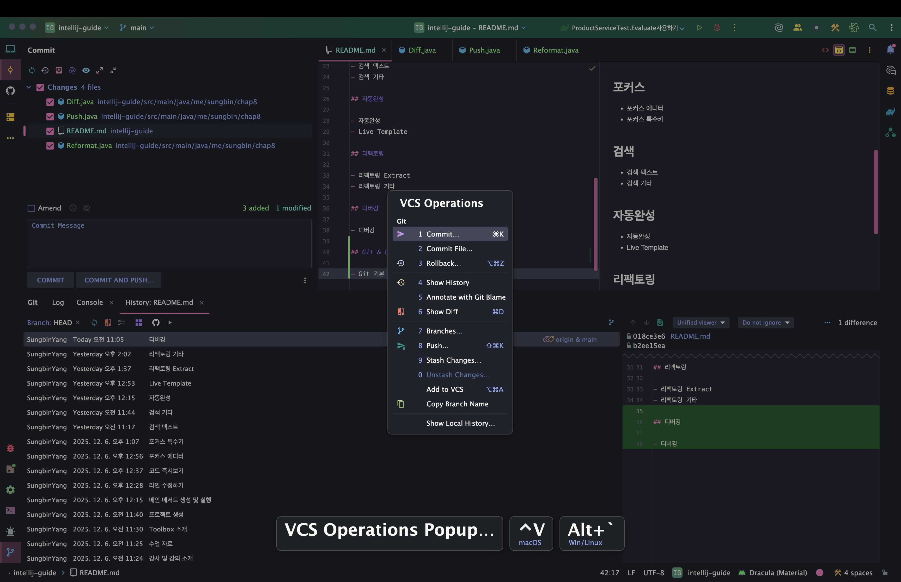

여기서 중요한 것은 이게 **"프로젝트 전체"가 아니라 "지금 이 파일"의 히스토리**라는 점이다. `git log -- 파일명`에 해당한다.

"이 클래스가 언제부터 이상해졌지?"를 추적할 때 아주 유용하다. 커밋을 하나씩 클릭하면서 그 시점의 변경 내용을 볼 수 있고, 두 커밋을 선택해 비교할 수도 있다.

> **[추가] 이 줄은 누가 바꿨을까 - Annotate (Git Blame)**
>
> 파일 단위 히스토리보다 더 자주 쓰게 되는 기능이 하나 있다. 바로 **Annotate**다.
>
> 사용법은 간단하다. 에디터에서 **좌측 라인 번호 부분을 우클릭**하고 `Annotate with Git Blame`을 선택하면 된다. 그러면 라인 번호 옆에 **각 줄을 마지막으로 수정한 커밋의 작성자와
날짜**가 표시된다.
>
> 이게 왜 유용하냐면, 이해가 안 되는 코드를 만났을 때 아래 흐름으로 맥락을 파악할 수 있기 때문이다.
>
> 1. 그 줄을 Annotate로 확인한다 → 누가 언제 썼는지 나온다
> 2. 그 부분을 클릭하면 해당 커밋으로 이동한다 → **커밋 메시지에서 "왜" 그렇게 했는지** 알 수 있다
> 3. 필요하면 그 사람에게 물어본다
>
> 남이 짠 코드를 읽어야 하는 상황 (= 실무의 대부분)에서 정말 자주 쓰게 된다. 참고로 "왜"를 알 수 있으려면 커밋 메시지가 잘 쓰여 있어야 하는데, 이건 우리가 커밋할 때 신경 써야 할 부분이기도 하다.

### Git Branch

다음으로 `Ctrl + v`를 입력하고 브랜치 관련 메뉴를 클릭하면 아래와 같이 브랜치들이 쭉 나오는 것을 볼 수 있다.

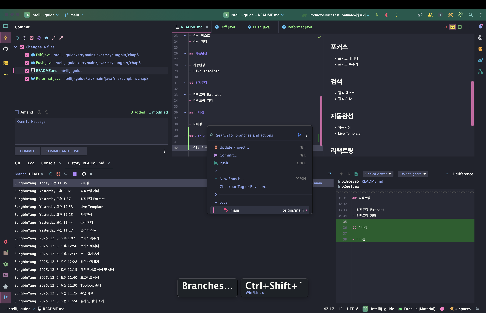

다음으로 `New Branch`를 클릭하면 새로운 브랜치를 만들 수 있다. 아래처럼 `checkout branch`옵션을 체크하면 브랜치를 만듬과 동시에 체크아웃이 가능하다.

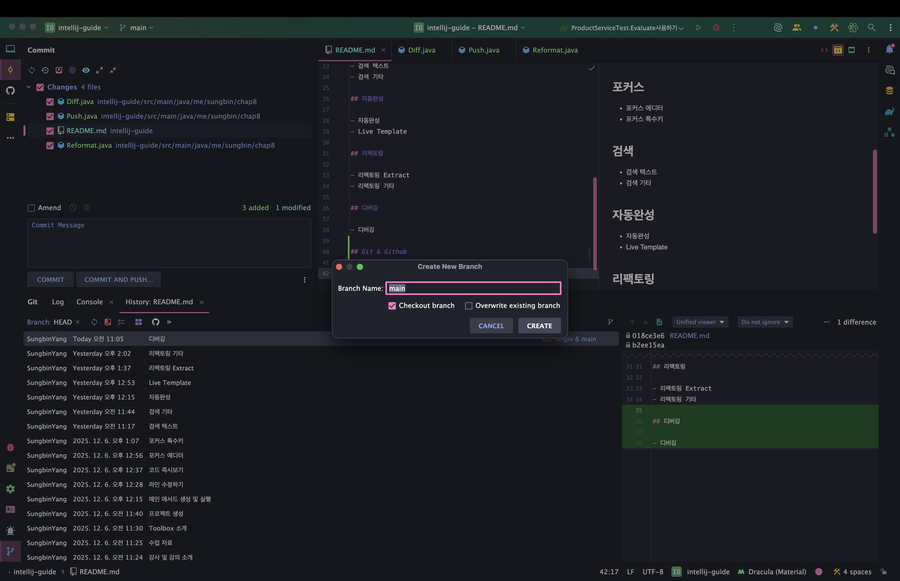

> 이 옵션은 터미널의 `git switch -c 브랜치명`(예전 방식으로는 `git checkout -b 브랜치명`)과 같다. 브랜치를 만들기만 하고 옮겨가지 않는 경우는 거의 없으므로, 보통은 체크한 채로 쓰게
> 된다.

브랜치를 만들고 나서 Git 콘솔창을 보면 정상적으로 만들어짐을 볼 수 있다.

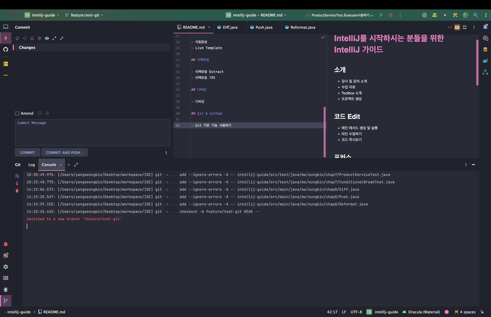

이후에 `main`브랜치로 체크아웃을 하고 싶다면 `Ctrl + v`를 입력 후, 브랜치 메뉴로 가서 브랜치 목록에 아래와 같이 `main` 브랜치를 클릭 후, 체크아웃을 진행하면 쉽게 가능하다.

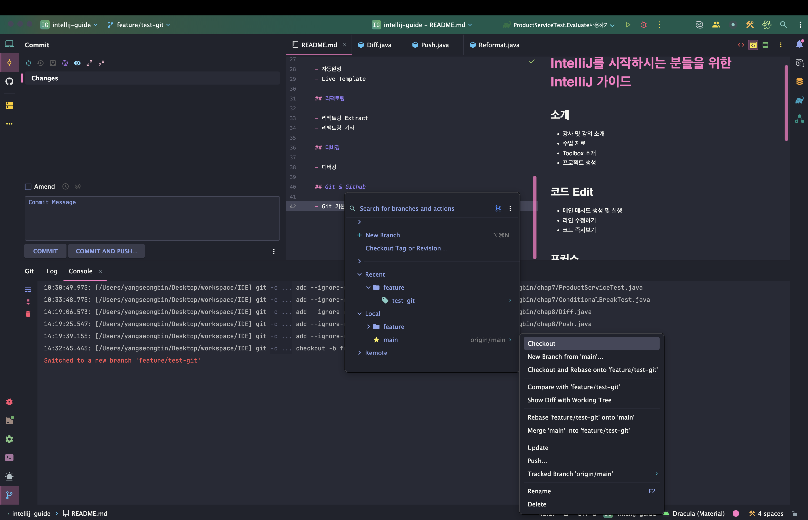

> **[팁] 브랜치 팝업은 더 빠른 길이 있다**
>
> 브랜치 작업은 워낙 자주 하기 때문에 **전용 단축키**가 따로 있다.
>
> - **윈도우/리눅스**: `Ctrl + shift + 백틱`
> - **맥**: IDE 우측 하단 (또는 상단 우측)의 **브랜치 이름 위젯을 클릭**해도 같은 팝업이 뜬다
>
> 그리고 브랜치 목록에서 특정 브랜치에 마우스를 올리면 아래 기능들이 함께 나온다. 알아두면 유용하다.
>
> - **Checkout**: 그 브랜치로 이동
> - **Compare with Current**: 현재 브랜치와 무엇이 다른지 비교
> - **Merge into Current** / **Rebase Current onto Selected**: 병합 또는 리베이스
> - **Rename** / **Delete**: 이름 변경, 삭제
>
> 특히 **Compare with Current**는 PR을 올리기 전에 "내가 뭘 바꿨더라?"를 확인할 때 아주 좋다.

### Commit

다음으로 커밋을 진행해보자. 커밋을 진행하기 위해서는 `Ctrl + v`를 통해 메뉴창을 열고 Commit을 누르면 왼쪽처럼 메뉴바가 나오지만 더 쉬운 방법으로는 맥 기준 `command + k`(윈도우/리눅스
`Ctrl + k`)를 누르면 자동 커밋창이 열린다.

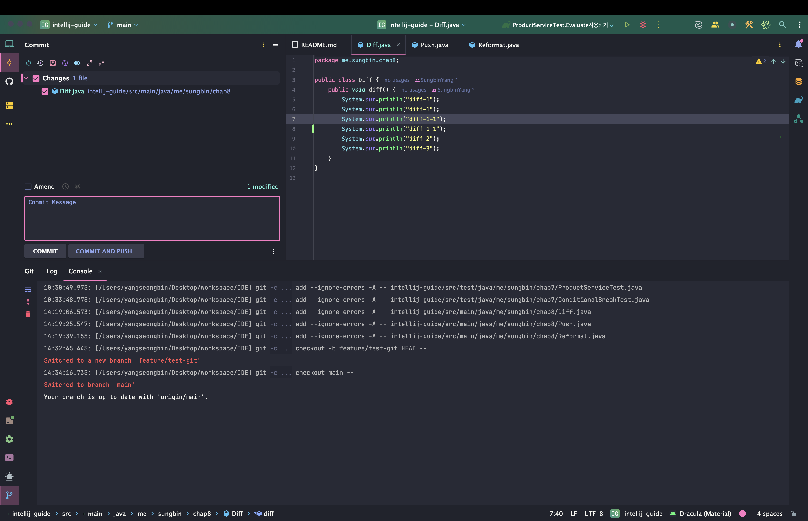

그리고 아래와 같이 커밋 메세지를 작성하고 `commit anyway and push` 버튼을 클릭한다.

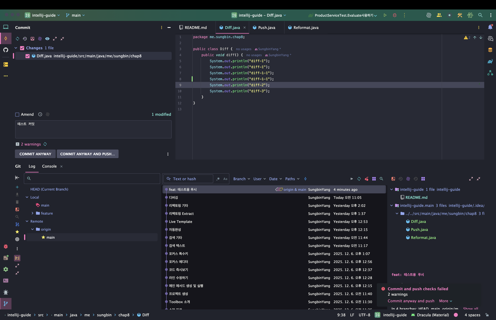

그러면 push에 대한 팝업이 나올 것이고 push를 진행해주면 자동으로 원격저장소에 반영이 된다.

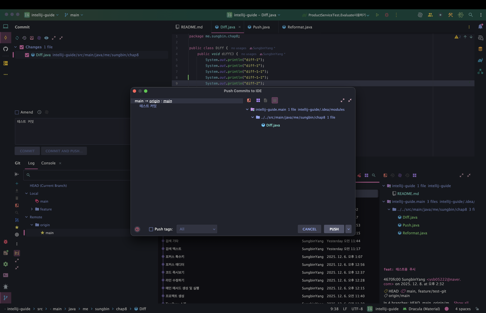

> **[알아두면 좋은 것] 스테이징 (add) 개념은 체크박스로 대체된다**
>
> 터미널에서는 `git add`로 커밋할 파일을 고르고, `git commit`으로 확정한다. IntelliJ의 커밋 창에서는 이 `add` 과정이 **파일 목록의 체크박스**로 대체된다. 체크한 파일만 커밋에
> 포함된다.
>
> 더 나아가 **한 파일 안에서 일부 변경만 커밋**할 수도 있다. Diff 화면에서 특정 변경 덩어리 (chunk)만 골라서 포함시키는 방식인데, 터미널의 `git add -p`에 해당한다. "이번 커밋에는 이
> 기능만 넣고 싶은데 다른 수정이 섞여 있을 때" 유용하다.

또한, 커밋을 진행할 때 다양한 옵션을 줄 수 있다. 인텔리제이에서는 아래와 같은 옵션을 주며 실무에서는 보통 `reformat`이나 `rearrange`를 사용한다.

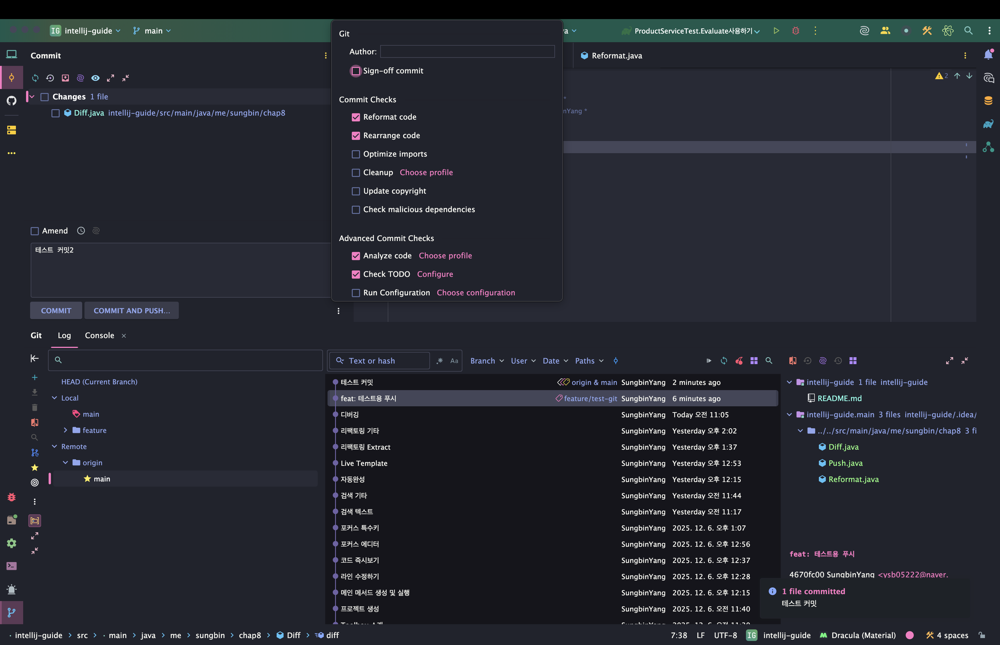

각 옵션이 하는 일을 정리하면 다음과 같다.

| 옵션                 | 하는 일                                                             | 추천                          |
|----------------------|---------------------------------------------------------------------|-------------------------------|
| **Reformat code**    | 코드 스타일에 맞게 자동 정렬 (리팩토링 편의 `command + option + l`) | 팀 스타일이 통일되어 있다면 O |
| **Rearrange code**   | 필드·메서드 순서를 규칙에 맞게 재배치                               | 상황에 따라                   |
| **Optimize imports** | 사용하지 않는 import 제거                                           | **O (강력 추천)**             |
| **Analyze code**     | 커밋 전 코드 검사 실행 (경고·잠재 버그 탐지)                        | 시간이 걸리니 선택적으로      |
| **Check TODO**       | `TODO` 주석이 남아 있는지 확인                                      | 선택적으로                    |

특히 **Optimize imports**는 켜두는 것을 추천한다. 리팩토링 편에서 다뤘듯이 불필요한 import 변경이 diff에 섞이면 코드 리뷰가 불편해지는데, 커밋 시점에 자동으로 정리되면 그럴 일이
없어진다.

> **⚠️ 다만 Reformat code는 팀과 합의가 필요하다**
>
> 코드 스타일 설정이 팀원마다 다르면, 이 옵션을 켠 사람이 커밋할 때마다 **자기가 건드리지도 않은 줄까지 전부 변경된 것으로 잡힌다.** 그러면 diff가 수백 줄로 부풀어 실제 변경 사항을 알아볼 수 없게
> 된다.
>
> 리팩토링 편에서 소개한 `.editorconfig`로 팀 스타일을 통일해뒀다면 안심하고 켜도 되지만, 그렇지 않다면 **내가 수정한 부분만 선택해서 수동으로 포맷**하는 편이 안전하다.

### Push

> ⚠️ 주의
>
> 여기서 주의 할 점은 파일을 생성되면 commit과 push를 동시에 진행이 안된다. 이 점은 유의해야 하며 push와 commit을 따로 진행해야 한다. push의 단축키는 맥 기준
> `command + shift + k`(윈도우/리눅스 `Ctrl + shift + k`)이다.

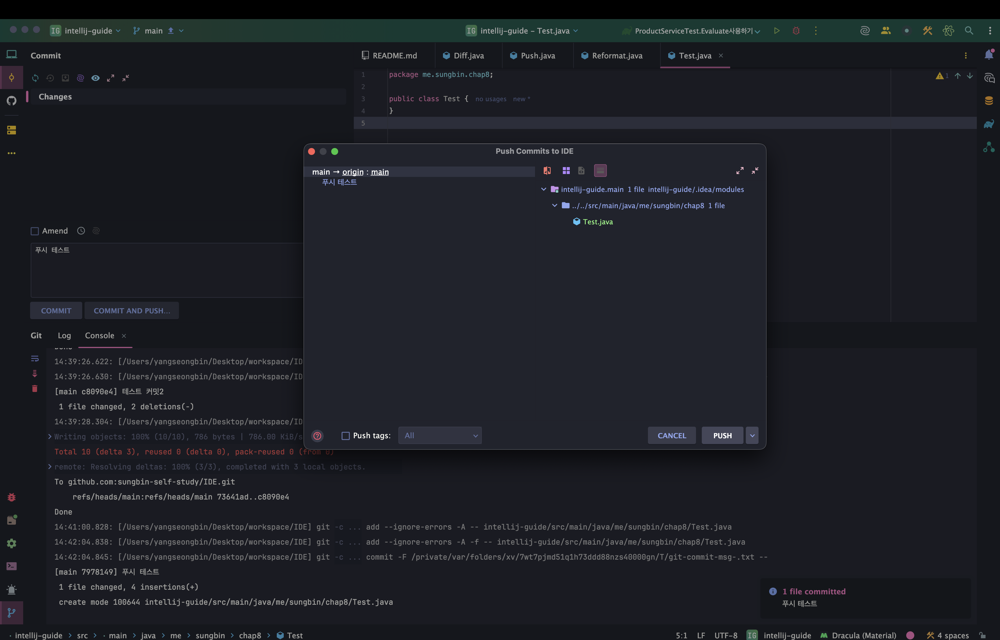

> **왜 새 파일은 commit과 push를 동시에 못 할까?**
>
> 이유를 알면 덜 당황하게 된다. Git은 파일을 아래 상태로 구분한다.
>
> - **Untracked**: Git이 아직 모르는 새 파일
> - **Tracked**: Git이 추적 중인 파일 (수정하면 변경으로 잡힌다)
>
> 새로 만든 파일은 **Untracked** 상태이기 때문에, 먼저 Git에게 "이 파일도 관리해줘"라고 알려주는 `git add` 과정이 필요하다. IntelliJ는 보통 새 파일을 만들면 "Add File to
> Git?" 하고 물어보는데, 이때 `Add`를 누르지 않았거나 나중에 처리하기로 했다면 커밋 대상에서 빠져 있는 것이다.
>
> 그래서 커밋 창 (`command + k`)에서 **Unversioned Files 목록에 있는 새 파일의 체크박스를 켜주면** 그다음부터는 정상적으로 커밋과 푸시가 함께 진행된다.

> **[주의] Force Push는 정말 조심하자**
>
> Push 다이얼로그에는 `Force Push` 옵션도 있다. 이건 원격 저장소의 이력을 **내 로컬 이력으로 덮어쓰는** 명령이라, 다른 사람이 그 브랜치에서 작업 중이었다면 **그 사람의 커밋이 사라질 수
있다.**
>
> 혼자 쓰는 개인 브랜치에서 리베이스 후 정리할 때가 아니라면, 특히 `main`이나 `develop` 같은 공용 브랜치에서는 절대 쓰지 말자.

### pull

우리가 실무에서 작업을 하다보면 다른 작업자들과 작업을 같이 한다. 하지만 경우에 따라 다른 사람이 작업한 것을 내려받아서 사용해야 할 때가 존재한다. 그럴 때는 우리는 `git pull`을 이용하고, 강의에서는
해당 기능에 단축키가 없어서 Action 검색을 통해 git pull이라고 검색해서 사용한다고 소개한다.

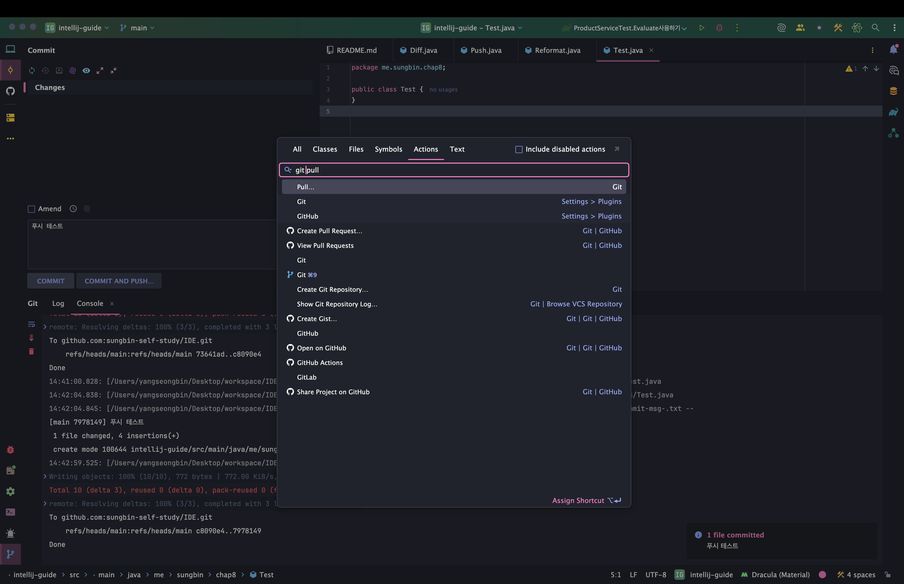

> **[보강] 사실 단축키가 있다 - Update Project (`command + t`)**
>
> `Git → Pull` 메뉴 자체에는 기본 단축키가 없는 것이 맞다. 하지만 IntelliJ에는 **실질적으로 같은 일을 하는 `Update Project`** 라는 기능이 있고, 여기에는 단축키가 할당되어
> 있다.
>
> - **맥**: `command + t`
> - **윈도우/리눅스**: `Ctrl + t`
>
> Update Project는 내부적으로 **`git fetch` 후 `git merge` 또는 `git rebase`** 를 수행한다. 즉 `git pull`이 하는 일과 같고, 여기에 더해 **여러 프로젝트
루트와 브랜치를 한꺼번에** 처리해준다.
>
> 그리고 이 단축키를 누르면 나오는 다이얼로그에서 **업데이트 방식**을 고를 수 있다.
>
> | 방식 | 동작 | 언제 쓰나 |
> | --- | --- | --- |
> | **Merge** | 원격 변경 사항을 현재 브랜치로 병합 (`git pull`) | 기본값. 안전하다 |
> | **Rebase** | 내 커밋을 원격 변경 사항 **위로** 옮긴다 (`git pull --rebase`) | 커밋 이력을 깔끔하게 유지하고 싶을 때 |
>
> Rebase 방식을 쓰면 불필요한 병합 커밋 ("Merge branch 'main' of...")이 생기지 않아서 이력이 깔끔해진다. 다만 이미 push한 커밋을 rebase하면 문제가 되므로, **아직
push하지 않은 로컬 커밋에 대해서만** 쓰는 것이 원칙이다.
>
> 정리하면 **작업 시작 전에 `command + t` 한 번**이 습관이 되면 좋다. 최신 코드를 받아둔 상태에서 작업해야 나중에 충돌이 적다.

### 정리

- Git View On
    - 맥: `command + 9`
    - 윈도우/리눅스: `Alt + 9`
- Git Option Popup (VCS Operations Popup)
    - 맥: `Ctrl + v`
    - 윈도우/리눅스: `Alt + 백틱`
- Git History
    - 맥: `Ctrl + v => 4`
    - 윈도우/리눅스: `Alt + 백틱 => 4`
- Branch
    - 맥: `Ctrl + v => 7`
    - 윈도우/리눅스: `Alt + 백틱 => 7` (또는 `Ctrl + shift + 백틱`)
- Show Diff (변경점 비교)
    - 맥: `command + d`
    - 윈도우/리눅스: `Ctrl + d`
- Commit
    - 맥: `command + k`
    - 윈도우/리눅스: `Ctrl + k`
- Push
    - 맥: `command + shift + k`
    - 윈도우/리눅스: `Ctrl + shift + k`
- pull (Update Project)
    - 맥: `command + t`
    - 윈도우/리눅스: `Ctrl + t`
    - `git pull` 액션 자체는 `Ctrl + shift + a => git pull`로도 실행 가능
- 변경 되돌리기 (Rollback)
    - 맥: `command + option + z`
    - 윈도우/리눅스: `Ctrl + Alt + z`

## 되돌리기, 그리고 안전망

Git을 쓰다 보면 가장 자주 필요하면서 동시에 가장 무서운 작업이 **되돌리기**다. 강의에는 자세히 나오지 않지만, 실무에서 반드시 필요한 부분이라 정리해두려고 한다.

### 아직 커밋 안 한 변경 되돌리기 - Rollback

수정하다가 "아 그냥 원래대로 돌리자" 싶을 때 쓴다.

- **맥**: `command + option + z`
- **윈도우/리눅스**: `Ctrl + Alt + z`

파일 전체를 되돌릴 수도 있고, **Diff 화면에서 특정 변경 덩어리만 골라서** 되돌릴 수도 있다. 터미널의 `git restore 파일명`에 해당한다.

### 방금 한 커밋 취소하기 - Undo Commit

커밋 메시지를 잘못 썼거나, 넣지 말아야 할 파일이 섞여 들어갔을 때 쓴다. Git 도구 창의 Log 탭에서 **가장 최근 커밋을 우클릭 → `Undo Commit`** 을 고르면 된다.

이건 내부적으로 **soft reset**이라, **커밋만 취소되고 변경 내용은 그대로 남는다.** 그래서 다시 정리해서 커밋하면 된다.

> 참고로 커밋 메시지만 고치고 싶다면 커밋 창에서 `Amend` 체크박스를 켜면 된다. 터미널의 `git commit --amend`에 해당한다. 단, **이미 push한 커밋을 amend하면** 이력이 바뀌므로
> force push가 필요해진다. push 전에만 쓰자.

### Reset의 4가지 모드

Log 탭에서 특정 커밋을 우클릭하고 `Reset Current Branch to Here`를 고르면 모드를 선택하게 되는데, 이 차이를 모르면 작업 내용을 통째로 날릴 수 있다.

| 모드               | 커밋 이력 | 작업 내용(파일)                 | 설명                                        |
|--------------------|-----------|---------------------------------|---------------------------------------------|
| **Soft**           | 되돌아감  | **그대로 유지** (스테이징 상태) | 커밋만 취소, 가장 안전                      |
| **Mixed** (기본값) | 되돌아감  | **그대로 유지** (스테이징 해제) | 커밋과 add를 취소                           |
| **Hard**           | 되돌아감  | **전부 삭제**                   | ⚠️ 변경 내용이 사라진다                     |
| **Keep**           | 되돌아감  | 수정한 파일은 보존              | Hard와 비슷하지만 로컬 수정은 건드리지 않음 |

**Hard는 정말 조심해야 한다.** 커밋하지 않은 작업이 있다면 그대로 사라진다. 되돌리고 싶을 뿐이라면 대부분 `Soft`나 `Mixed`로 충분하다.

### IntelliJ만의 안전망 - Local History

여기서 정말 알아두면 좋은 기능이 하나 있다. **Local History**는 Git과 완전히 무관하게 **IntelliJ가 자체적으로 파일 변경 이력을 기록**하는 기능이다.

무엇이 좋냐면 이렇다.

- **커밋하지 않은 변경도 복구할 수 있다.** Git은 커밋한 것만 되돌릴 수 있지만, Local History는 저장할 때마다 스냅샷을 남긴다.
- **Git 저장소가 아니어도 동작한다.**
- 실수로 Rollback을 눌러 날린 코드도 여기서 되살릴 수 있는 경우가 많다.

사용법은 파일이나 디렉토리를 **우클릭 → `Local History` → `Show History`** 다. 그러면 시간순으로 변경 이력이 나오고, 원하는 시점의 내용을 되돌릴 수 있다.

> "몇 시간 작업한 걸 실수로 날렸다" 싶을 때 **가장 먼저 시도해봐야 할 곳**이 여기다. Git만 알고 있으면 절대 떠올릴 수 없는 IntelliJ 고유의 기능이니 꼭 기억해두자. (다만 보관 기간에 제한이
> 있으므로 며칠 지난 것은 남아 있지 않을 수 있다.)

### 작업을 잠시 치워두기 - Shelve

"급한 버그 수정 요청이 왔는데 지금 하던 작업이 커밋하기엔 애매한 상태"일 때가 있다. 이럴 때 쓰는 것이 **Shelve**다.

Local Changes에서 **우클릭 → `Shelve Changes`** 를 하면 현재 변경 사항이 따로 보관되고 작업 디렉토리는 깨끗해진다. 나중에 `Unshelve`로 되돌리면 된다. 터미널의
`git stash`와 비슷한 개념인데, **Shelve는 IntelliJ가 관리하고 Stash는 Git이 관리한다**는 차이가 있다. IntelliJ에서는 둘 다 지원하므로 편한 쪽을 쓰면 된다.

## Github 연동하기

그러면 만약 새로운 환경에서 인텔리제이와 내 프로젝트와 Github을 연동하는 방법에 대해 살펴보도록 하겠다.

### 기존 프로젝트 Github에 연동하기

먼저 Action 검색을 열어서 `share project on Github`을 검색한다.

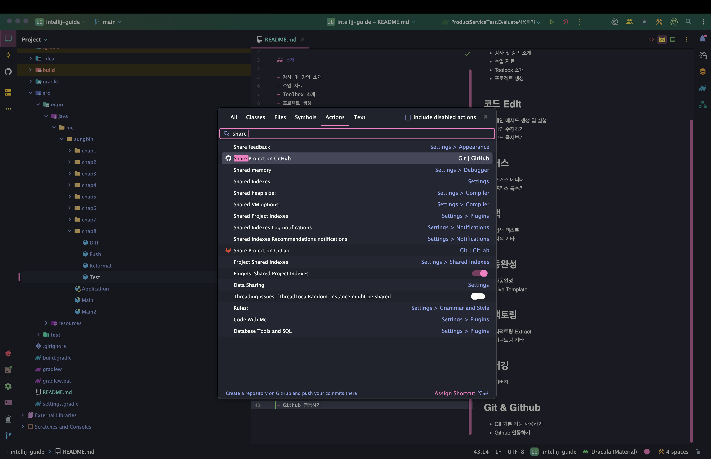

그리고 연동을 진행하면 된다. 만약 이미 연동이 되어 있다면 아래와 같이 나올 것이다.

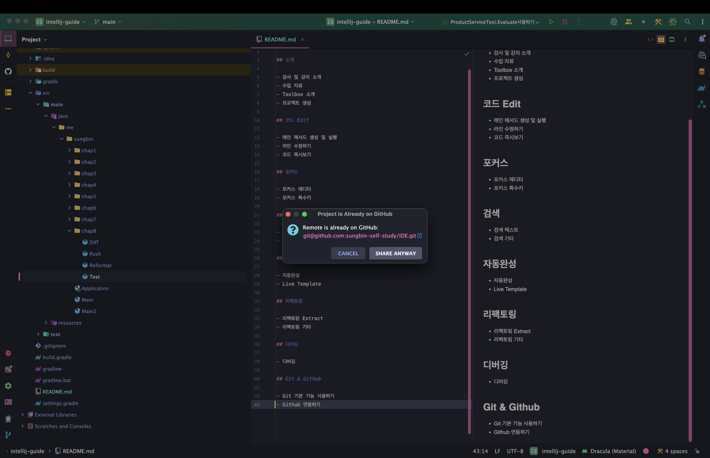

필자는 독자들을 위해 어떻게 화면이 나오는지 보여주기 위해 새로운 프로젝트를 만들어서 진행해보도록 하겠다. 먼저 Action 검색을 해서 `share project on Github`을 입력하면 아래와 같이 나올
것이다.

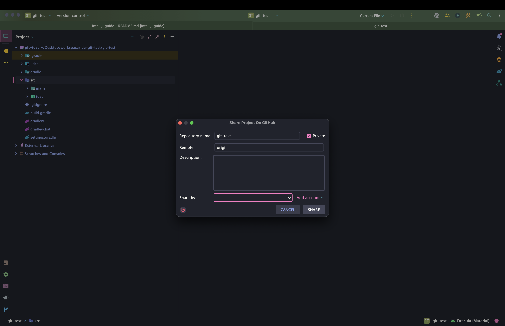

여기에 repository 이름과 설명을 작성하고 `Add Account` 버튼을 클릭한다.

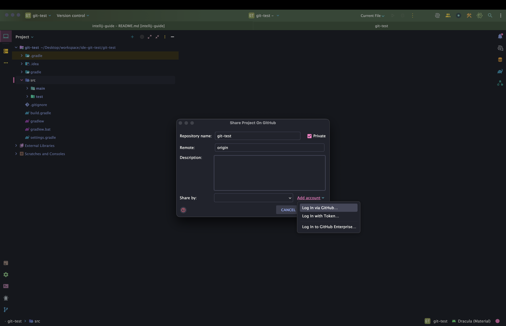

> **⚠️ [중요] GitHub 비밀번호 로그인은 더 이상 불가능하다**
>
> 강의 시점에는 토큰 방식과 아이디/비밀번호 방식 중에 고를 수 있었다. 그런데 **GitHub이 2021년 8월 13일부로 Git 작업에 대한 비밀번호 인증을 완전히 폐지**했다. 지금 비밀번호로 시도하면 아래
> 오류를 만나게 된다.
>
> ```
> remote: Support for password authentication was removed.
> Please use a personal access token instead.
> ```
>
> 그래서 현재 선택 가능한 방법은 아래 세 가지다.
>
> | 방식 | 설명 | 추천도 |
> | --- | --- | --- |
> | **Log in with GitHub** (OAuth) | 브라우저가 열리고 GitHub에서 승인만 하면 끝난다 | **가장 간편, 추천** |
> | **Personal Access Token** | GitHub에서 토큰을 발급받아 붙여넣는다 | 세밀한 권한 제어가 필요할 때 |
> | **SSH 키** | 공개키를 GitHub에 등록해두고 사용한다 | 보안상 권장, 여러 계정 관리에 유리 |
>
> 처음이라면 **`Log in with GitHub`** 을 쓰는 것이 가장 쉽다. 브라우저에서 승인 버튼 한 번이면 IntelliJ가 알아서 토큰을 발급받아 저장한다.
>
> 토큰을 직접 발급받고 싶다면 GitHub의 `Settings` → `Developer settings` → `Personal access tokens`에서 만들면 되고, 이때 최소한 **`repo` 권한**은
> 체크해야 저장소를 읽고 쓸 수 있다. (Gist 연동이 필요하면 `gist`, GitHub Actions 파일을 수정하려면 `workflow` 권한도 필요하다.)
>
> 참고로 강의에 나오는 **`Save Credential`(인증 정보 저장)** 옵션은 지금도 유효하다. 강사님 표현으로는 "인증 정보를 계속 기록을 할 거냐는 거예요"인데, 켜두면 매번 인증하지 않아도 된다.

이렇게 인증을 하면 아래와 같이 나올 것이고 share 버튼을 클릭한다.

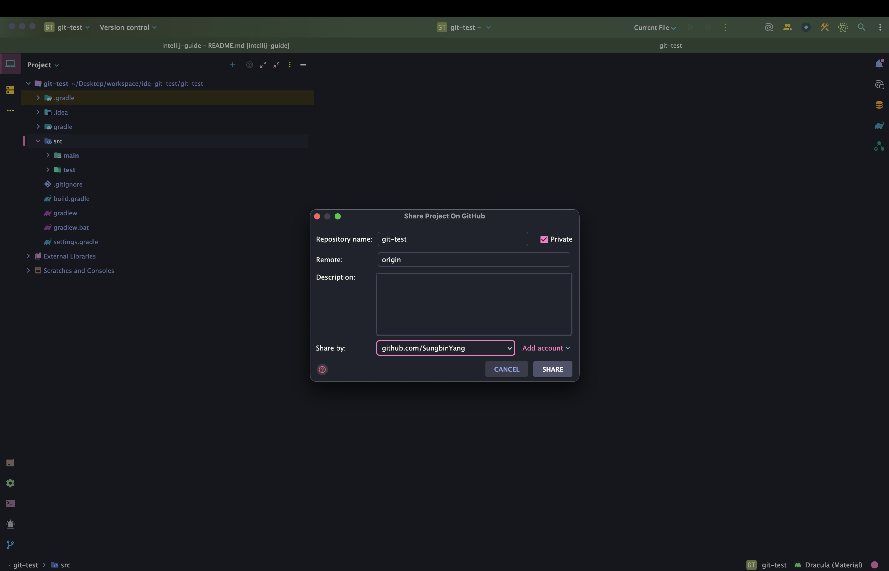

그러면 바로 커밋을 진행할 지 물어본다. 필자는 바로 커밋을 진행해볼려고 한다. 바로 커밋 메세지를 작성해주고 add를 눌러주면 자동으로 커밋을 진행해주고 원격 repository가 생성되고 push가 됨을 알 수
있다.

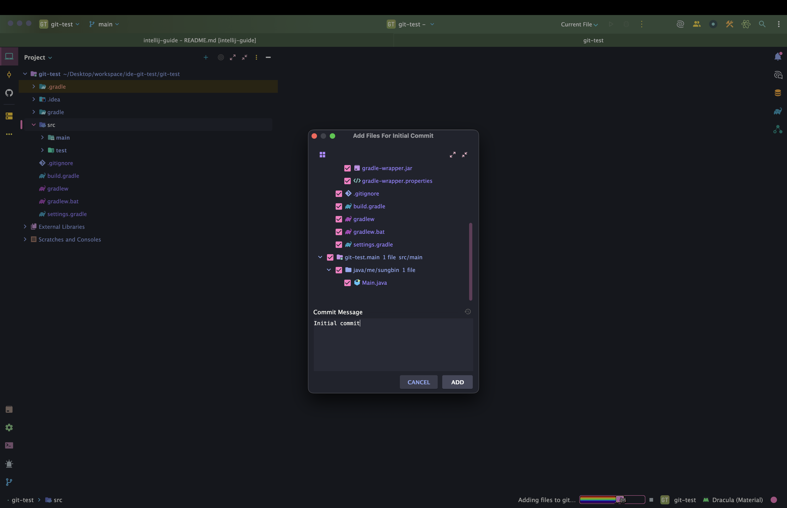

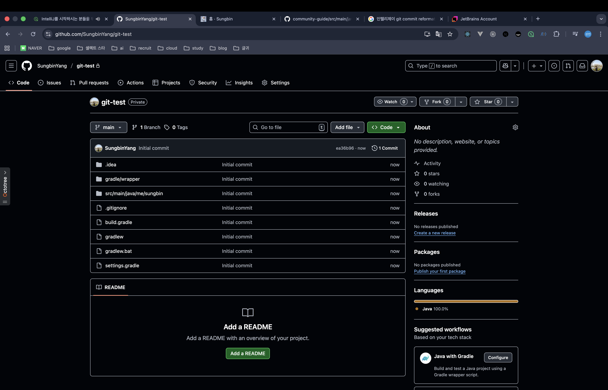

강사님이 이 과정에서 짚어주는 포인트가 하나 있다.

> "GitHub과 연동이 된다는 건 이 프로젝트가 **Git 프로젝트로 변환이 되었다**는 거예요."

즉 `Share Project on GitHub` 하나로 아래 작업이 한꺼번에 처리된다.

1. 로컬에 Git 저장소 생성 (`git init`)
2. GitHub에 원격 저장소 생성
3. 원격 저장소 연결 (`git remote add origin ...`)
4. 첫 커밋 생성 및 푸시 (`git commit`, `git push -u origin main`)

터미널로 하면 네 단계인 것이 클릭 몇 번으로 끝나는 셈이다.

> **[팁] 커밋 전에 `.gitignore`를 먼저 확인하자**
>
> 이 과정에서 놓치기 쉬운 부분이 있다. 커밋 대상 파일 목록에 **`.idea/` 디렉토리나 `build/`, `out/` 같은 빌드 결과물**이 섞여 있는지 확인해야 한다. 이런 파일들은 저장소에 올리지 않는
> 것이 관례다.
>
> IntelliJ가 자동으로 `.gitignore`를 만들어주기도 하지만, 없다면 아래 정도는 넣어두자.
>
> ```
> .idea/
> build/
> out/
> *.iml
> .gradle/
> ```

### Github 프로젝트 clone 받기

깃헙 프로젝트 클론 받는 법은 간단하다. 인텔리제이 창을 열어서 clone repository 버튼을 클릭한다. 그리고 url 방식으로 다운 받을지 혹은 자기 깃헙의 repo에 클론을 받을지 선택하고 클론을 진행하면
된다.

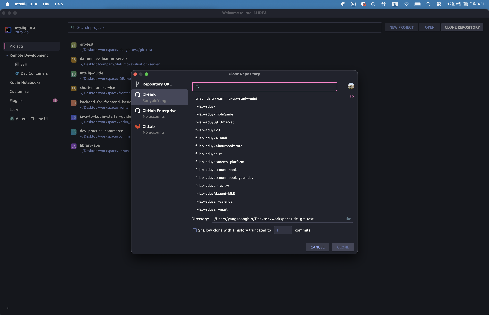

> 이 메뉴는 IntelliJ 버전에 따라 이름이 조금씩 달랐다. 강의 시점에는 `Check out from Version Control`이었고, 최근 버전에서는 시작 화면의 **`Clone Repository`**
> 또는 메뉴의 **`File` → `New` → `Project from Version Control`** 이다. 하는 일은 같다.
>
> GitHub 계정을 이미 등록해뒀다면 **URL을 복사해올 필요 없이 내 저장소 목록에서 바로 고를 수 있다**는 점도 편리하다.

클론한 뒤에 알아두면 좋은 것이 하나 있다. 강사님이 강조하는 부분인데, Gradle 프로젝트를 열면 어떤 Gradle을 쓸지 물어본다.

> "여기 있는 이 Gradle 래퍼가 보이죠? 이 Gradle 래퍼를 통해서 빌드하도록 해놨고"

**Gradle Wrapper**를 선택하는 것이 정답이다. 프로젝트 안에 포함된 `gradlew` 파일을 사용하는 방식인데, 이렇게 하면 **내 컴퓨터에 설치된 Gradle 버전과 무관하게 프로젝트가 지정한
버전으로 빌드**된다. 팀원 모두가 같은 결과를 얻으려면 이게 중요하다. 소개 편에서 다룬 빌드 도구 이야기와 이어지는 부분이다.

## 마무리

이번 편에서 다룬 내용을 작업 흐름 순서로 정리해보면 이렇다.

| 상황                        | 기능                 | 단축키 (맥)            |
|-----------------------------|----------------------|------------------------|
| 작업 시작 전 최신 코드 받기 | Update Project       | `command + t`          |
| 브랜치 만들고 이동          | Branch 팝업          | `Ctrl + v` → Branch    |
| 뭘 바꿨는지 확인            | Show Diff            | `command + d`          |
| 커밋하기                    | Commit               | `command + k`          |
| 원격에 올리기               | Push                 | `command + shift + k`  |
| 전체 상황 보기              | Git 도구 창          | `command + 9`          |
| 뭘 해야 할지 모르겠을 때    | VCS Operations Popup | `Ctrl + v`             |
| 잘못 건드렸을 때            | Rollback             | `command + option + z` |
| 커밋 안 한 것까지 날렸을 때 | **Local History**    | 우클릭 메뉴            |

우선순위를 매겨보자면 아래 네 개다.

1. **`command + k` (Commit)** — 가장 많이 쓴다.
2. **`command + t` (Update Project)** — 작업 시작 전 습관으로 만들자.
3. **`Ctrl + v` (VCS Operations Popup)** — 나머지를 몰라도 여기서 다 찾을 수 있다.
4. **Local History** — 언젠가 여러분을 구해줄 기능이다.

그리고 이번 편에서 전하고 싶은 메시지는 이것이다.

> **IDE의 Git 기능은 터미널 Git을 대체하는 것이 아니라, 흐름을 끊지 않게 해주는 것이다.**

Git의 개념 자체 (스테이징, 브랜치, 머지, 리베이스)는 여전히 공부해야 한다. 다만 그 개념을 실행하는 순간에 IDE를 벗어나지 않아도 된다는 것, 그리고 diff와 히스토리를 눈으로 확인하면서 작업할 수
있다는 것이 IntelliJ가 주는 이점이다.

드디어 다음 편이 이 시리즈의 마지막이다. **플러그인** 편에서는 지금까지 배운 기본 기능들 위에 얹어서 생산성을 더 끌어올려주는 유용한 플러그인들을 소개하도록 하겠다. 첫 편에서 언급했던 **Key
Promoter X**처럼, 단축키를 익히는 것 자체를 도와주는 플러그인도 함께 다룰 예정이다.
