> 해당 포스팅은 인프런의 [IntelliJ를 시작하시는 분들을 위한 IntelliJ 가이드](https://inf.run/doaZn) 강의를 참조하여 작성한 글입니다.

## 검색 텍스트

### 현재 파일에서 검색

현재 파일에서 우리가 원하는 검색을 하려면 일반 IDE처럼 맥 기준 `command + f`를 누르면 된다. 그러면 아래와 같이 나올 것이다.


### 현재 파일에서 교체

현채 파일에서 특정 검색어를 특정 단어로 변경하고 싶은 경우도 있을 것이다. 이런 경우 맥 기준 `command + r`을 눌러주면 아래와 같이 변경하고 싶은 검색어를 입력하고 하단에 변경하고 싶은 단어를 입력해주면 변경이 가능하다.

여기서 replace버튼을 누르면 찾은 순서대로 변경이 되고 전체를 한번에 바꾸고 싶다면 replace all 버튼을 클릭하면 된다.

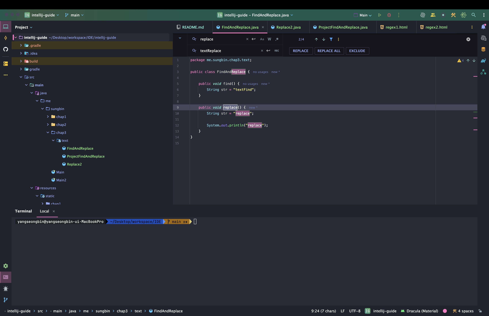

### 전체에서 검색

전체 프로젝트에서 우리가 원하는 검색을 하려면 맥 기준 `command + shift + f`를 누르면 된다. 그러면 아래와 같이 특정 검색어를 전체 프로젝트에서 찾을 수 있다.

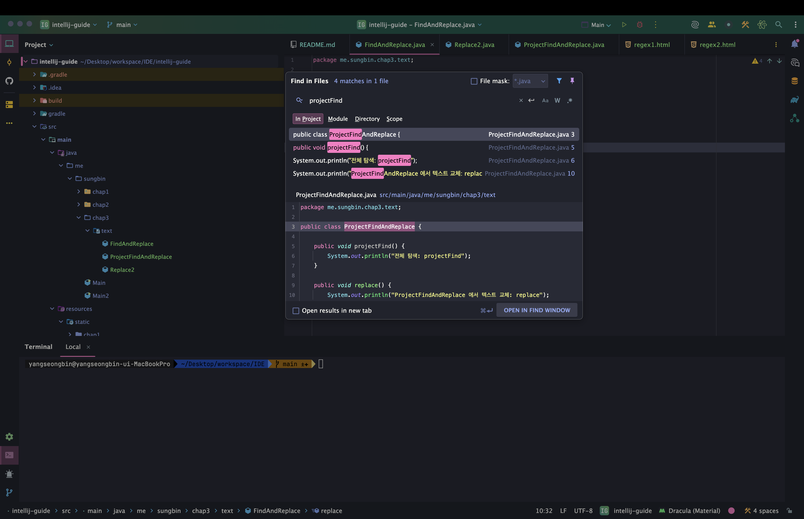

### 전체에서 교체

전체 프로젝트에서 특정 검색어를 특정 단어로 변경하고 싶은 경우도 존재할 것이다. 이런 경우 맥 기준 `command + shift + r`을 누르면 된다. 그러면 현재 파일에서 교체처럼 변경하고자 하는 검색어를 입력하고 변경하고 싶은 검색어로 한 후에 검색을 해주면 된다.

여기서 replace버튼을 누르면 찾은 순서대로 변경이 되고 전체를 한번에 바꾸고 싶다면 replace all 버튼을 클릭하면 된다.

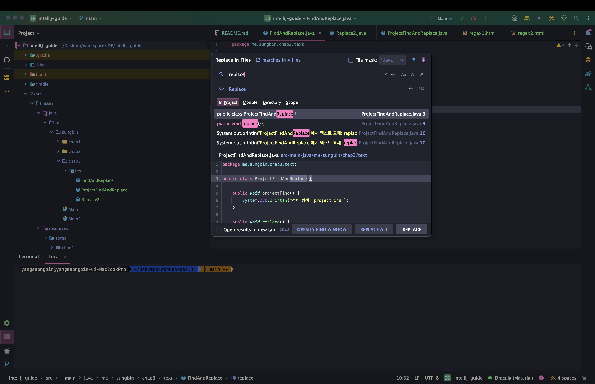

### 정규 표현식으로 검색, 교체

아래와 같은 코드가 있다고 해보자.

``` html
<!DOCTYPE html>
<html lang="ko">
<head>
    <meta charset="UTF-8">
    <title>Title</title>
</head>
<body>
<h1 id="titleId" name="titleName">This is a Heading</h1>

<script type="application/javascript" src="/robert/main/app.js"></script>
<script type="application/javascript" src="/robert/board/app.js"></script>

<script type="application/javascript" src="/robert/comment/app2.js"></script>
<script type="application/javascript" src="/robert/member/app2.js"></script>
</body>
</html>
```

``` html
<!DOCTYPE html>
<html lang="ko">
<head>
    <meta charset="UTF-8">
    <title>Title</title>
</head>
<body>
<h1 id="titleId" name="titleName">This is a Heading</h1>

<script type="application/javascript" src="/robert/main/app.js"></script>
<script type="application/javascript" src="/robert/board/app.js"></script>

<script type="application/javascript" src="/robert/comment/app2.js"></script>
<script type="application/javascript" src="/robert/member/app2.js"></script>
</body>
</html>
```

여기서 우리는 app.js의 경로가 변경되서 robert라는 디렉토리 대신에 inflearn이라는 경로로 변경하고자 한다고 해보자. 그런 경우 어떻게 변경이 가능할까? 심지어 위의 2개의 파일은 다른 경로에 있다고 가정해보자.

바로 정규식을 이용하면 된다. 일단 정규식으로 전체 검색부터 알아보자. 위에서 학습했듯이 `command + shift + f`를 통해 전체 검색을 한다. 그리고 우측에 `*`표시를 클릭해서 활성화 해준다. 해당 버튼은 바로 정규식을 쓸 것이다라고 IDE가 인식하게 해주는 기능이라 생각하면 된다.

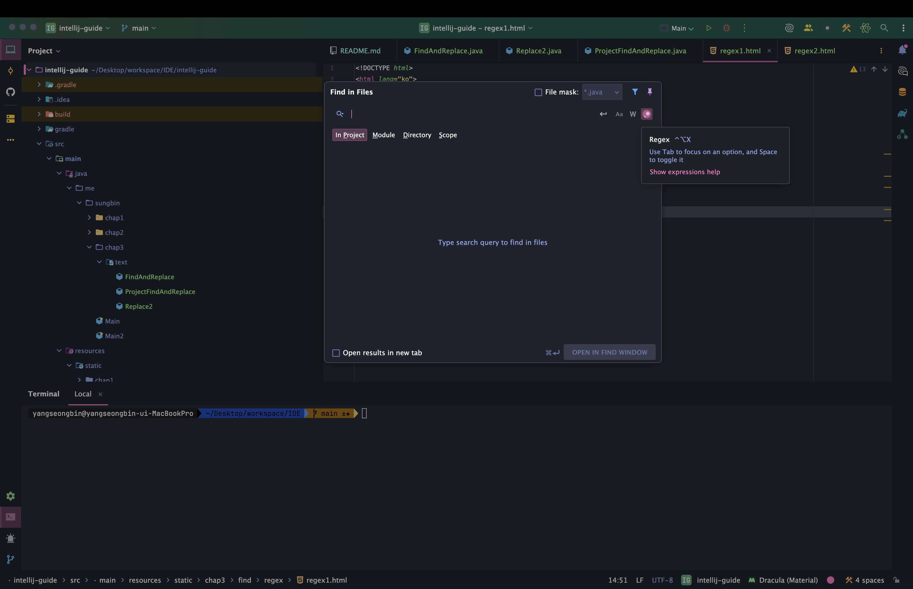

이후 정규식을 작성해주면 된다. 바로 아래와 같이 말이다.

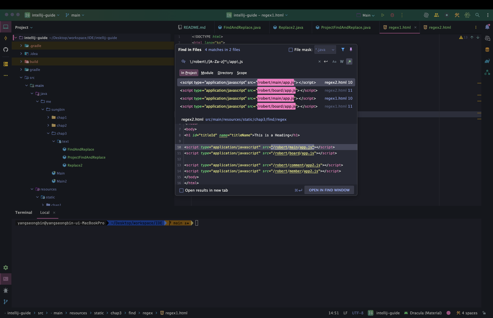

이제 교체를 해보자. `command + shift + r`을 누르고 이전에 작성했던 정규식을 입력하자. 그리고 바꾸고 싶은 형태를 정규식 형태로 작성하면 된다. 여기서 검색과 다른 점이 있는데 `[A-Za-z]*`를 하나의 단위로 뭔가 인식하고 싶을 때는 `([A-Za-z]*)`처럼 가로로 묶어주고 변경하고자 하는 단어 입력하는 창에 `$1`로 해주면 해당 값을 인식해준다. 굳이 우리가 이것을 복붙해서 할 필요가 없게 정규식 차원에서 제공해준다.

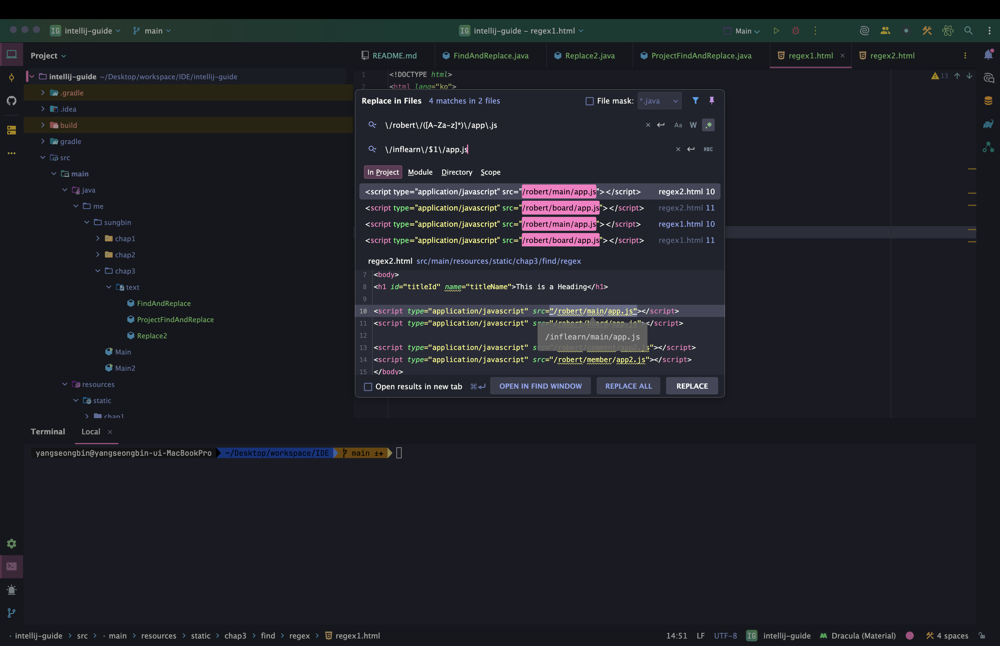

### 정리

그러면 이제 정리를 해보자.

- 현재 파일에서 검색
  - 맥: `command + f`
  - 윈도우/리눅스: `Ctrl + f`
- 현재 파일에서 교체
  - 맥: `command + r`
  - 윈도우/리눅스: `Ctrl + r`
- 전체에서 검색
  - 맥: `command + shift + f`
  - 윈도우/리눅스: `Ctrl + shift + f`
- 전체에서 교체
  - 맥: `command + shift + r`
  - 윈도우/리눅스: `Ctrl + shift + r`
- 정규표현식으로 검색, 교체
  - 맥: 정규표현식 체크
  - 윈도우/리눅스: 정규표현식 체크

또한, 자세한 정규식 관련된 내용은 [향로님 블로그](https://jojoldu.tistory.com/160)를 참고 바란다.

## 검색 기타

### 파일 검색

우리는 특정 파일에 대한 검색을 하고 싶을 때가 있을 것이다. 인텔리제이에서는 해당 기능을 제공해준다. 맥 기준 단축키 `command + shift + o`를 입력하면 아래와 같이 파일을 검색할 수 있는 창이 나온다.

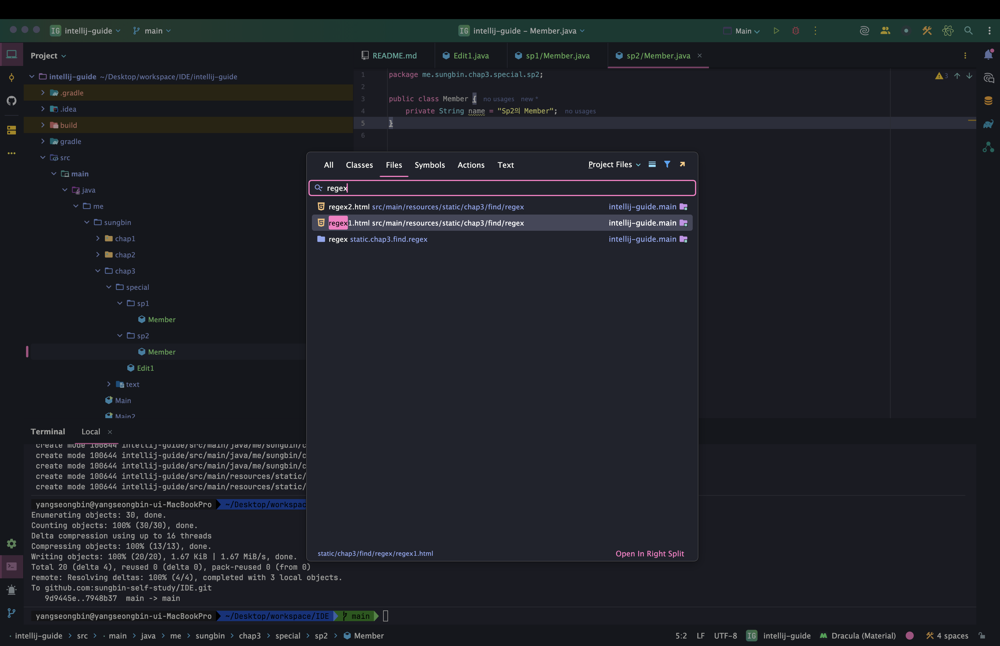

또한, 같은 파일의 이름이더라도 패키지가 다른 경우도 존재할 것이다. 이럴 때는 패키지명을 명시해서 파일을 검색하면 해당 파일만 검색되는 것을 볼 수 있을 것이다.

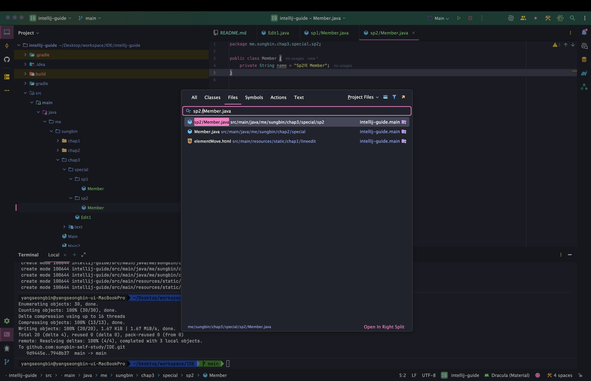

### 메서드 검색

다음으로 메서드 검색을 알아보자. 클래스명은 정확히 기억이 나지 않지만 메서드 이름만 기억나는 경우도 존재할 것이다. 그럴 때는 맥 기준 `command + option + o`이다. 그러면 아래와 같이 symbol 검색창이 열릴 것이고 여기서 원하는 메서드 이름을 검색해주면 된다.

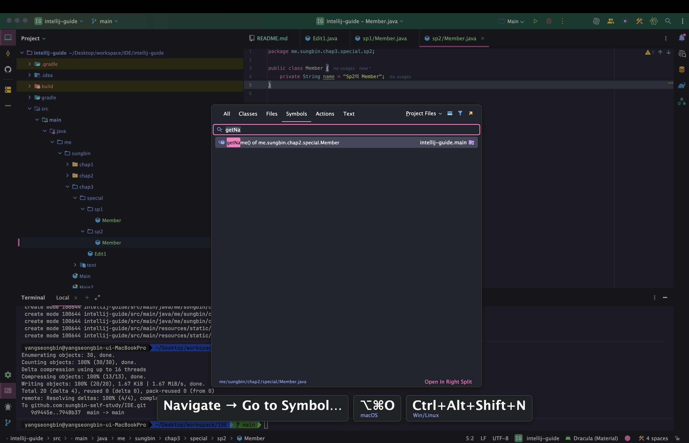

### Action 검색

인텔리제이에서 뭔가 다양한 세팅과 기능들이 많이 존재한다. 하지만 이 기능이 어디에 있는지 알고 싶은 경우가 존재한다. 그럴때는 우리는 하나하나 인텔리제이 메뉴창을 다 열어보면서 찾아야 하지만 시간도 오래 걸리고 매우 귀찮은 작업이다. 이런 문제로 인텔리제이에서는 Action 검색 기능을 제공해준다. 맥 기준 단축키로 `command + shift + a`로 Action 검색 창을 띄울 수 있다.

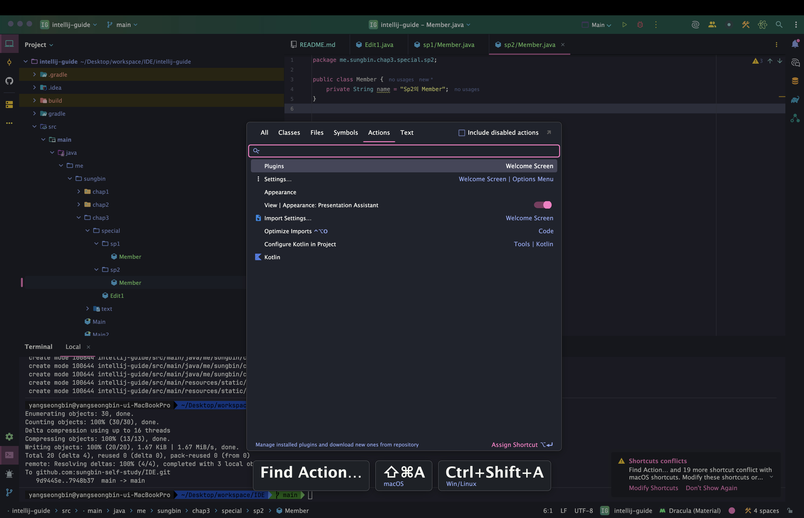

### 최근에 열었던 파일 목록 보기

우리가 작업을 하다가 최근에 열어본 파일의 목록을 보고 싶은 경우가 존재할 것이다. 이럴 때 인텔리제이에서는 맥 기준 단축키로 `command + e`를 사용하면 아래와 같이 최근에 열어보았던 파일의 목록을 볼 수 있다.

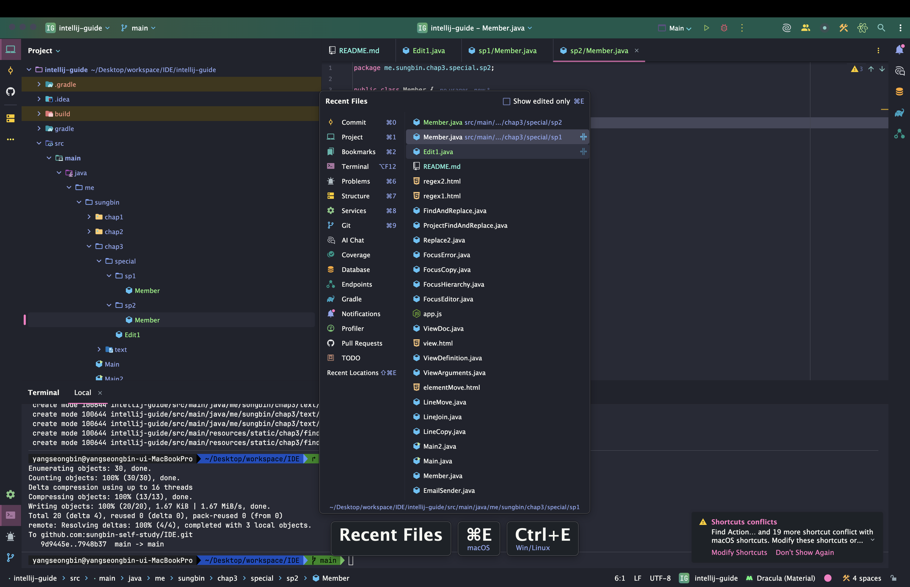

### 최근에 수정한 파일 목록 보기

또한, 우리가 최근에 수정했던 파일들의 목록을 볼 수 있는 기능을 인텔리제이에서는 제공한다. 맥 기준 단축키 `command + shift + e`를 사용하면 아래와 같이 최근에 수정했던 파일의 목록들을 볼 수 있다.

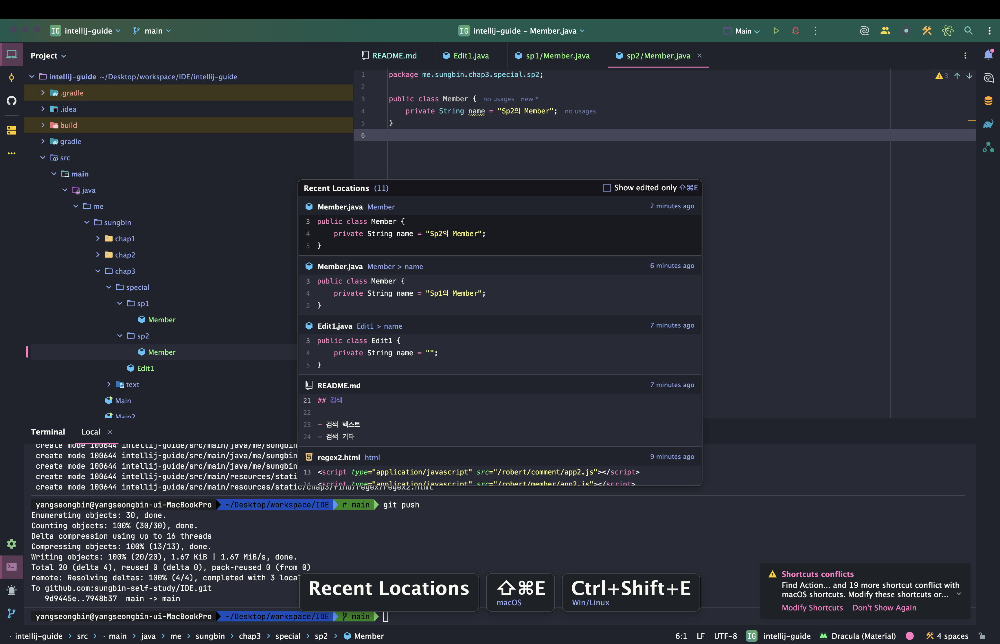

### 정리

- 파일 검색
  - 맥: `command + shift + o`
  - 윈도우/리눅스: `Ctrl + shift + n`
- 메서드 검색
  - 맥: `command + option + o`
  - 윈도우/리눅스: `Ctrl + shift + alt + n`
- Action 검색
  - 맥: `command + shift + a`
  - 윈도우/리눅스: `Ctrl + shift + a`
- 최근에 열었던 파일 목록 보기
  - 맥: `command + e`
  - 윈도우/리눅스: `Ctrl + e`
- 최근에 수정했던 파일 목록 보기
  - 맥: `command + shift + e`
  - 윈도우/리눅스: `Ctrl + shift + e`