> 해당 포스팅은 인프런의 [IntelliJ를 시작하시는 분들을 위한 IntelliJ 가이드](https://inf.run/doaZn) 강의를 참조하여 작성한 글입니다.

## 들어가며

이전 편에서 다룬 포커스는 **"어디에 있는지 아는 곳으로 가는 방법"** 이었다. 화면에 보이는 코드, 지금 열려 있는 파일 안에서의 이동이었으니까.

그런데 실제 프로젝트는 파일이 수백, 수천 개다. 이런 상황에서 우리가 자주 마주치는 질문은 이렇다.

- "이 메서드를 도대체 어디서 호출하고 있지?"
- "설정 파일에 이 값이 어디에 박혀 있더라?"
- "클래스 이름이 `Member`였나 `Members`였나... 어느 패키지였지?"
- "IntelliJ에서 이 기능 켜는 설정이 대체 어느 메뉴에 있지?"

이번 편은 이 질문들에 대한 답이다. 즉 **"어디 있는지 모르는 것을 찾아가는 방법"** 이다.

그리고 이번 편에는 아주 편리한 규칙이 하나 있다. 강사님이 짚어주는 부분인데, 이걸 알면 단축키 절반은 그냥 따라온다.

> "보통 Shift라는 단축키가 포함되어 있으면 얘는 기본 단축키에서 좀 더 향상된 단축키라는 걸 알 수가 있고요."

무슨 말이냐면 검색 계열 단축키가 아래처럼 짝을 이루고 있다는 뜻이다.

| 기본 (현재 파일)                   | Shift 추가 (프로젝트 전체)            |
|------------------------------------|---------------------------------------|
| `command + f` — 현재 파일에서 검색 | `command + shift + f` — 전체에서 검색 |
| `command + r` — 현재 파일에서 교체 | `command + shift + r` — 전체에서 교체 |

즉 **"Shift = 범위 확대"** 라고 기억하면 된다. 이 규칙 하나만 알아도 네 개를 두 개로 줄여서 외울 수 있다.

## 검색 텍스트

### 현재 파일에서 검색

현재 파일에서 우리가 원하는 검색을 하려면 일반 IDE처럼 맥 기준 `command + f`를 누르면 된다. 윈도우/리눅스 기준으로는 `Ctrl + f`이다. 그러면 아래와 같이 나올 것이다.

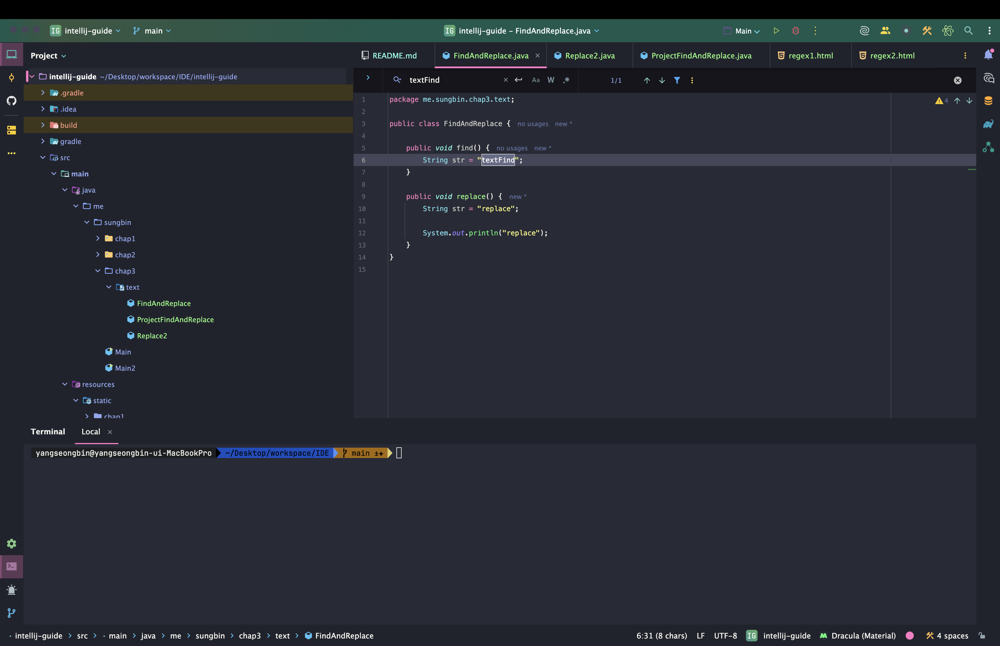

여기서 그냥 검색만 하고 끝내면 이 기능의 절반도 쓰지 못하는 것이다. 알아두면 좋은 것들을 정리해보자.

**검색 결과 사이를 이동하기**

검색어를 입력하면 일치하는 항목이 여러 개 나오는데, 이걸 마우스로 클릭하며 볼 필요가 없다.

- **다음 결과**: 맥 `command + g`, 윈도우/리눅스 `F3`
- **이전 결과**: 맥 `command + shift + g`, 윈도우/리눅스 `Shift + F3`

검색창 안에서 그냥 `Enter`를 눌러도 다음 결과로 넘어간다. 중요한 것은 **검색창을 닫은 뒤에도 (`Esc`) 이 단축키가 동작한다**는 점이다. 즉 검색창을 띄워둔 채로 볼 필요가 없다.

**검색 옵션 3종**

검색창 오른쪽에 붙어 있는 작은 아이콘들인데, 각각의 의미는 다음과 같다.

| 옵션                  | 의미                                                                |
|-----------------------|---------------------------------------------------------------------|
| **Match case** (`Cc`) | 대소문자를 구분한다. 켜면 `member`와 `Member`를 다르게 본다         |
| **Words** (`W`)       | 단어 단위로만 찾는다. 켜면 `name`을 검색해도 `userName`은 안 걸린다 |
| **Regex** (`.*`)      | 정규표현식으로 검색한다. 뒤에서 자세히 다룬다                       |

이 중 **Words 옵션**은 은근히 유용하다. 예를 들어 `id`처럼 짧은 단어를 검색하면 `void`, `valid`, `identity` 같은 것까지 전부 걸려서 결과가 수백 개가 된다. 이때 Words를
켜면 딱 `id`인 것만 나온다.

**그 외 알아두면 좋은 것들**

- **검색어 히스토리**: 검색창에서 `option + ↓`(윈도우/리눅스 `Alt + ↓`)를 누르면 이전에 검색했던 단어 목록이 나온다. 같은 단어를 반복해서 칠 필요가 없다.
- **선택 영역 안에서만 검색**: 여러 줄을 선택한 상태로 `command + f`를 누른 뒤, 필터 아이콘에서 `Search In Selection`을 켜면 선택한 범위 안에서만 검색한다. 긴 파일의 특정
  메서드 안만 뒤지고 싶을 때 유용하다.
- **찾은 것 전부 선택**: 검색 결과 전부를 한 번에 수정하고 싶다면 `Ctrl + command + g`(윈도우/리눅스 `Ctrl + Alt + Shift + j`)를 누르면 된다. 이전 편에서 배운 멀티
  커서 상태가 되어 동시에 편집할 수 있다.
- **단어 위에서 바로 검색**: 검색하고 싶은 단어에 커서를 두고 `command + f`를 누르면 그 단어가 자동으로 검색창에 입력된다. 복사해서 붙여넣을 필요가 없다.

### 현재 파일에서 교체

현재 파일에서 특정 검색어를 특정 단어로 변경하고 싶은 경우도 있을 것이다. 이런 경우 맥 기준 `command + r`(윈도우/리눅스 `Ctrl + r`)을 눌러주면 아래와 같이 변경하고 싶은 검색어를 입력하고
하단에 변경하고 싶은 단어를 입력해주면 변경이 가능하다.

여기서 replace버튼을 누르면 찾은 순서대로 변경이 되고 전체를 한번에 바꾸고 싶다면 replace all 버튼을 클릭하면 된다.

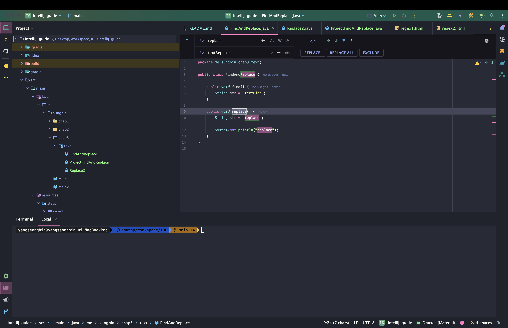

> **⚠️ 맥 사용자 주의: `command + r`과 `Ctrl + r`은 완전히 다르다**
>
> 이전 편에서 우리는 **재실행** 단축키로 맥의 `Ctrl + r`을 배웠다. 그리고 이번에 배우는 **교체**는 맥의 `command + r`이다. 키 하나 차이인데 하는 일이 전혀 다르다.
>
> - `command + r`(⌘R): Replace, 교체
> - `Ctrl + r`(⌃R): Run, 재실행
>
> 코드를 고치다가 실행하려고 `command + r`을 눌러서 교체창이 뜨는 경험을 누구나 한 번쯤 하게 된다. 참고로 윈도우/리눅스에서는 이 혼란이 없다. 교체는 `Ctrl + r`, 실행은
> `Shift + F10`으로 아예 다르기 때문이다.

교체할 때 알아두면 좋은 옵션이 두 가지 더 있다.

- **Preserve Case**: 대소문자 형태를 유지한 채 바꿔준다. 예를 들어 `member` → `user`로 교체할 때 이 옵션을 켜면 `Member`는 `User`로, `MEMBER`는 `USER`로
  각각의 형태를 지켜서 바꿔준다. 켜지 않으면 전부 소문자 `user`가 되어버린다.
- **Exclude**: 교체 결과 중 특정 항목만 제외하고 싶을 때 쓴다. Replace All을 누르기 전에 "이건 빼고"를 지정할 수 있다.

### 전체에서 검색

전체 프로젝트에서 우리가 원하는 검색을 하려면 맥 기준 `command + shift + f`(윈도우/리눅스 `Ctrl + shift + f`)를 누르면 된다. 그러면 아래와 같이 특정 검색어를 전체 프로젝트에서
찾을 수 있다.

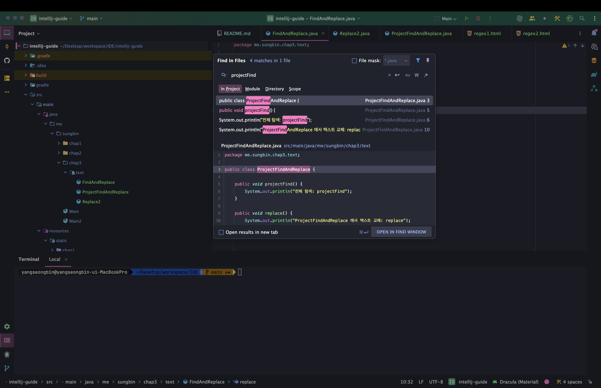

그런데 프로젝트가 커지면 전체 검색은 결과가 수백 개씩 쏟아져서 오히려 못 쓰게 된다. 그래서 **범위를 좁히는 방법**을 아는 것이 이 기능의 핵심이다.

**1. 검색 범위 (Scope) 지정**

검색창 상단에 있는 탭들로 범위를 고를 수 있다.

| 범위           | 설명                                                                                   |
|----------------|----------------------------------------------------------------------------------------|
| **In Project** | 프로젝트 전체 (기본값)                                                                 |
| **Module**     | 특정 모듈 안에서만. 멀티모듈 프로젝트에서 유용하다                                     |
| **Directory**  | 특정 디렉토리 아래에서만                                                               |
| **Scope**      | 미리 정의된 범위. 예를 들어 "열려 있는 파일들", "최근 변경된 파일들" 등을 고를 수 있다 |

**2. 파일 마스크 (File mask)**

이게 정말 유용하다. `File mask` 체크박스를 켜면 **특정 확장자나 이름 패턴의 파일만** 검색 대상으로 삼을 수 있다. 문법은 다음과 같다.

| 기호 | 의미           | 예시                                              |
|------|----------------|---------------------------------------------------|
| `*`  | 여러 글자      | `*.java` → 자바 파일만                            |
| `?`  | 한 글자        | `?.txt`                                           |
| `,`  | 여러 패턴 나열 | `*.java,*.kt` → 자바와 코틀린 파일                |
| `!`  | 제외           | `*.java,!*Test.java` → 테스트 파일을 뺀 자바 파일 |

예를 들어 설정 값을 찾을 때 `*.yml,*.properties`로 마스크를 걸면 자바 코드는 전부 제외되고 설정 파일만 뒤진다. 반대로 `!*Test*`로 테스트 코드를 제외하는 것도 자주 쓰인다. 이 두 가지만
익혀도 전체 검색의 체감 품질이 완전히 달라진다.

### 전체에서 교체

전체 프로젝트에서 특정 검색어를 특정 단어로 변경하고 싶은 경우도 존재할 것이다. 이런 경우 맥 기준 `command + shift + r`(윈도우/리눅스 `Ctrl + shift + r`)을 누르면 된다. 그러면
현재 파일에서 교체처럼 변경하고자 하는 검색어를 입력하고 변경하고 싶은 검색어로 한 후에 검색을 해주면 된다.

여기서 replace버튼을 누르면 찾은 순서대로 변경이 되고 전체를 한번에 바꾸고 싶다면 replace all 버튼을 클릭하면 된다.

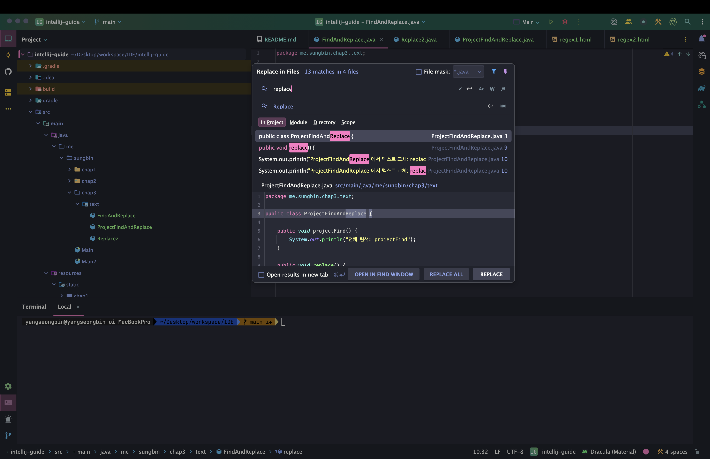

> **⚠️ 전체 교체는 항상 조심스럽게**
>
> 전체 교체 (Replace All)는 이번 시리즈에서 소개하는 기능 중 **가장 위험한 축에 속한다.** 프로젝트 전체를 한 번에 바꿔버리기 때문이다.
>
> 그래서 필자는 아래 습관을 권한다.
>
> 1. **교체 전에 반드시 검색 (`command + shift + f`)으로 먼저 확인**한다. 몇 개가 걸리는지, 엉뚱한 것이 걸리지는 않는지 눈으로 본다.
> 2. **File mask나 Scope로 범위를 좁힌 뒤** 교체한다.
> 3. 교체 후 뭔가 잘못됐다면 **`command + z`(실행 취소)가 전체 교체에도 동작한다.** 파일을 여러 개 바꿨어도 한 번에 되돌려준다. 당황하지 말자.
> 4. 애초에 Git으로 커밋해둔 상태에서 하는 게 가장 안전하다.
>
> 그리고 하나 더 중요한 것이 있는데, **변수명이나 클래스명을 바꾸는 것이라면 전체 교체를 쓰면 안 된다.** 그건 리팩토링 Rename (`shift + F6`)의 영역이다. 자세한 이유는 이전 편의 멀티 커서
> 주의사항과 동일하며, 리팩토링 편에서 다시 다룰 예정이다.

### 정규 표현식으로 검색, 교체

아래와 같은 코드가 있다고 해보자. 두 파일은 서로 다른 경로에 있는 별개의 HTML 파일이라고 가정한다.

``` html
<!-- /templates/main.html -->
<!DOCTYPE html>
<html lang="ko">
<head>
    <meta charset="UTF-8">
    <title>Title</title>
</head>
<body>
<h1 id="titleId" name="titleName">This is a Heading</h1>

<script type="application/javascript" src="/robert/main/app.js"></script>
<script type="application/javascript" src="/robert/board/app.js"></script>

<script type="application/javascript" src="/robert/comment/app2.js"></script>
<script type="application/javascript" src="/robert/member/app2.js"></script>
</body>
</html>
```

``` html
<!-- /templates/sub.html -->
<!DOCTYPE html>
<html lang="ko">
<head>
    <meta charset="UTF-8">
    <title>Title</title>
</head>
<body>
<h1 id="titleId" name="titleName">This is a Heading</h1>

<script type="application/javascript" src="/robert/main/app.js"></script>
<script type="application/javascript" src="/robert/board/app.js"></script>

<script type="application/javascript" src="/robert/comment/app2.js"></script>
<script type="application/javascript" src="/robert/member/app2.js"></script>
</body>
</html>
```

여기서 우리는 app.js의 경로가 변경되서 robert라는 디렉토리 대신에 inflearn이라는 경로로 변경하고자 한다고 해보자. 그런 경우 어떻게 변경이 가능할까? 심지어 위의 2개의 파일은 다른 경로에 있다고
가정해보자.

물론 `/robert/`를 `/inflearn/`으로 단순 교체해도 될 것 같지만, 실제 상황은 보통 이렇게 단순하지 않다. 중간 디렉토리 이름 (`main`, `board`, `comment`, `member`)이
제각각이고 파일명도 `app.js`와 `app2.js`로 다르다. **"바뀌는 부분은 그대로 두고 특정 부분만 바꾸고 싶을 때"** 필요한 것이 바로 정규식이다.

일단 정규식으로 전체 검색부터 알아보자. 위에서 학습했듯이 `command + shift + f`를 통해 전체 검색을 한다. 그리고 우측에 `*`표시를 클릭해서 활성화 해준다. 해당 버튼은 바로 정규식을 쓸
것이다라고 IDE가 인식하게 해주는 기능이라 생각하면 된다.

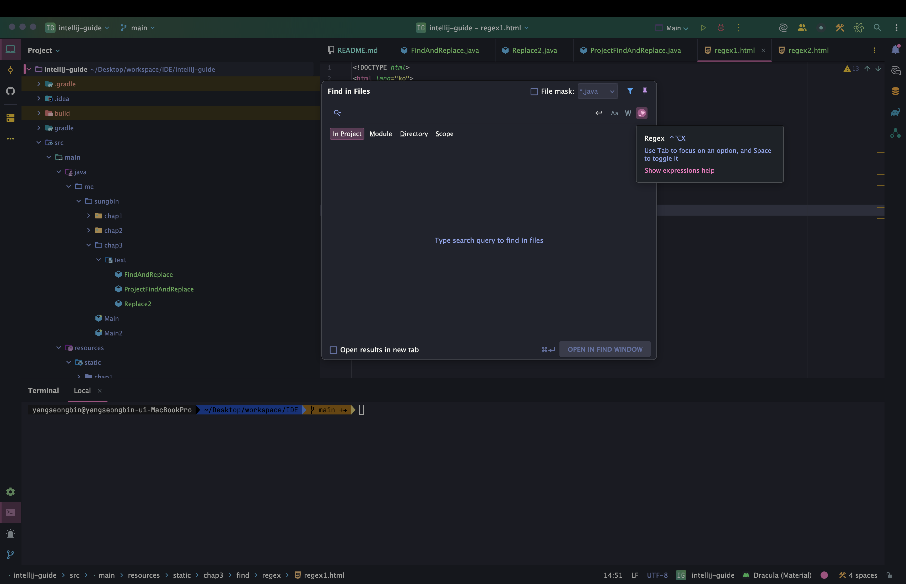

이후 정규식을 작성해주면 된다. 바로 아래와 같이 말이다.

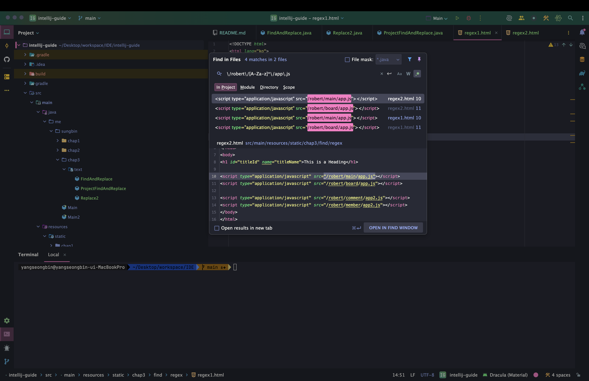

글로도 남겨두면 이런 형태의 패턴이 된다.

```
/robert/([A-Za-z]*)/(app[0-9]*\.js)
```

각 부분이 무슨 의미인지 하나씩 뜯어보자.

| 조각              | 의미                                                                                             |
|-------------------|--------------------------------------------------------------------------------------------------|
| `/robert/`        | 글자 그대로 `/robert/`를 찾는다                                                                  |
| `([A-Za-z]*)`     | 영문자가 0개 이상 반복되는 부분. `main`, `board`, `comment`, `member`가 여기 걸린다              |
| `(app[0-9]*\.js)` | `app` + 숫자 0개 이상 + `.js`. `app.js`와 `app2.js`가 모두 걸린다                                |
| `\.`              | 정규식에서 `.`은 "아무 글자 하나"라는 뜻이므로, 진짜 마침표를 찾으려면 `\`로 이스케이프해야 한다 |

이제 교체를 해보자. `command + shift + r`을 누르고 이전에 작성했던 정규식을 입력하자. 그리고 바꾸고 싶은 형태를 정규식 형태로 작성하면 된다. 여기서 검색과 다른 점이 있는데 `[A-Za-z]*`
를 하나의 단위로 뭔가 인식하고 싶을 때는 `([A-Za-z]*)`처럼 괄호로 묶어주고, 변경하고자 하는 단어 입력하는 창에 `$1`로 해주면 해당 값을 인식해준다. 굳이 우리가 이것을 복붙해서 할 필요가 없게
정규식 차원에서 제공해준다.

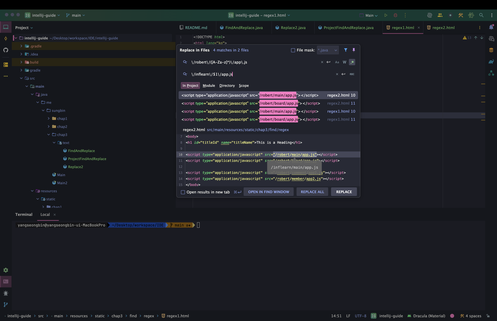

정리하면 이렇게 된다.

```
찾을 내용:   /robert/([A-Za-z]*)/(app[0-9]*\.js)
바꿀 내용:   /inflearn/$1/$2
```

여기서 핵심이 되는 개념이 **캡처 그룹 (Capture Group)** 이다.

- 찾을 내용에서 **괄호 `()`로 묶은 부분**이 그룹이 된다.
- 앞에서부터 순서대로 `$1`, `$2`, `$3`... 번호가 매겨진다.
- 바꿀 내용에서 `$1`이라고 쓰면 **"첫 번째 괄호에 걸렸던 그 값을 그대로 여기에 넣어라"** 는 뜻이 된다.

그래서 위 패턴을 실행하면 결과가 이렇게 된다.

``` html
<!-- 실행 전 -->
<script src="/robert/main/app.js"></script>
<script src="/robert/comment/app2.js"></script>

<!-- 실행 후 -->
<script src="/inflearn/main/app.js"></script>
<script src="/inflearn/comment/app2.js"></script>
```

`main`, `comment` 같은 중간 경로와 `app.js`, `app2.js` 같은 파일명은 **각자 원래 값을 유지한 채** `robert`만 `inflearn`으로 바뀐 것을 볼 수 있다. 이게 정규식
교체의 힘이다.

**자주 쓰는 정규식 조각들**

정규식을 전부 외울 필요는 없지만, 아래 정도만 알아도 실무에서 마주치는 상황의 대부분을 해결할 수 있다.

| 패턴    | 의미                       | 예시                              |
|---------|----------------------------|-----------------------------------|
| `.`     | 아무 글자 하나             | `a.c` → `abc`, `axc`              |
| `*`     | 앞의 것이 0개 이상         | `ab*` → `a`, `ab`, `abb`          |
| `+`     | 앞의 것이 1개 이상         | `ab+` → `ab`, `abb` (`a`는 안 됨) |
| `?`     | 앞의 것이 0개 또는 1개     | `colou?r` → `color`, `colour`     |
| `[abc]` | a, b, c 중 하나            | `[0-9]` → 숫자 하나               |
| `\d`    | 숫자 하나 (`[0-9]`와 같음) |                                   |
| `\w`    | 영문자, 숫자, `_` 중 하나  |                                   |
| `\s`    | 공백 문자                  |                                   |
| `^`     | 줄의 시작                  | `^import` → import로 시작하는 줄  |
| `$`     | 줄의 끝                    | `;$` → 세미콜론으로 끝나는 줄     |
| `()`    | 캡처 그룹                  | 교체할 때 `$1`로 참조             |
| `\`     | 특수문자 이스케이프        | `\.` → 진짜 마침표                |

> 참고로 IntelliJ의 검색창에 정규식을 입력하면 **실시간으로 유효성을 검사**해준다. 패턴이 잘못되면 검색창이 빨갛게 변하면서 무엇이 잘못됐는지 알려주므로, 정규식을 잘 몰라도 조금씩 고쳐가며 완성할 수
> 있다.

### [추가] 텍스트 검색 대신 써야 할 때가 있다 - Find Usages

지금까지 배운 검색은 전부 **텍스트 기반**이다. 즉 IntelliJ가 코드의 의미를 이해하는 게 아니라 그냥 글자가 같은 것을 찾는다. 그런데 개발하면서 정말 자주 하는 질문은 이런 것이다.

> "이 메서드를 도대체 어디서 호출하고 있지?"

이걸 텍스트 검색으로 하면 문제가 생긴다. 예를 들어 `getName`을 전체 검색하면 **전혀 다른 클래스의 `getName`까지 전부** 걸린다. 문자열 안의 `"getName"`도 걸린다. 반대로 상속받아
오버라이드한 경우는 놓칠 수도 있다.

그래서 이럴 때는 **Find Usages**를 써야 한다. 이건 IntelliJ가 코드의 의미를 이해하고 **정말로 그 메서드를 가리키는 곳만** 찾아준다.

| 기능                | 맥                      | 윈도우/리눅스     | 설명                                      |
|---------------------|-------------------------|-------------------|-------------------------------------------|
| Find Usages         | `option + F7`           | `Alt + F7`        | 사용처를 하단 도구 창에 목록으로 보여준다 |
| Show Usages         | `command + option + F7` | `Ctrl + Alt + F7` | 현재 위치에 작은 팝업으로 보여준다        |
| Find Usages in File | `command + F7`          | `Ctrl + F7`       | 현재 파일 안에서만 찾는다                 |

실무에서는 **Show Usages (`command + option + F7`)** 를 더 자주 쓰게 된다. 팝업이라 화면을 가리지 않고, 목록에서 바로 엔터를 치면 그 위치로 이동하기 때문이다.

> 정리하면 이렇게 구분하면 된다.
>
> - **"이 글자"를 찾는다** → 텍스트 검색 (`command + shift + f`)
> - **"이 코드 요소"를 찾는다** → Find Usages (`option + F7`)
>
> 메서드, 클래스, 변수, 필드를 찾을 때는 거의 항상 후자가 정답이다.

### 정리

그러면 이제 정리를 해보자.

- 현재 파일에서 검색
    - 맥: `command + f`
    - 윈도우/리눅스: `Ctrl + f`
- 현재 파일에서 교체
    - 맥: `command + r`
    - 윈도우/리눅스: `Ctrl + r`
- 전체에서 검색
    - 맥: `command + shift + f`
    - 윈도우/리눅스: `Ctrl + shift + f`
- 전체에서 교체
    - 맥: `command + shift + r`
    - 윈도우/리눅스: `Ctrl + shift + r`
- 다음/이전 검색 결과로 이동
    - 맥: `command + g` / `command + shift + g`
    - 윈도우/리눅스: `F3` / `Shift + F3`
- 사용처 찾기 (Find Usages)
    - 맥: `option + F7` (팝업은 `command + option + F7`)
    - 윈도우/리눅스: `Alt + F7` (팝업은 `Ctrl + Alt + F7`)
- 정규표현식으로 검색, 교체
    - 맥/윈도우/리눅스: 검색창에서 정규표현식 (Regex) 체크

또한, 자세한 정규식 관련된 내용은 [향로님 블로그](https://jojoldu.tistory.com/160)를 참고 바란다.

## 검색 기타

이번 절은 텍스트가 아니라 **"대상"을 찾는** 검색이다. 파일, 클래스, 메서드, 그리고 IDE의 기능 자체를 찾는 방법을 다룬다.

### [먼저 알아둘 것] Search Everywhere - 더블 Shift

강의에는 나오지 않지만, 사실 이번 절의 모든 기능을 하나로 합쳐놓은 관문이 있다. 바로 **Search Everywhere**다.

- **맥/윈도우/리눅스 공통**: `Shift`를 **두 번 연속** 누르기

이걸 누르면 하나의 검색창이 뜨는데, 여기서는 **클래스, 파일, 메서드 (심볼), 액션, 설정, 최근 파일까지 전부 한꺼번에** 검색된다. 즉 "무엇을 찾는지 정확히 모르겠지만 일단 이 이름으로 뭔가 있었다" 싶을
때 이것부터 누르면 된다.

창이 열린 상태에서 알아두면 좋은 조작은 다음과 같다.

- **`Tab`**: All → Classes → Files → Symbols → Actions 순으로 탭이 전환된다. 즉 결과가 너무 많으면 탭을 좁히면 된다.
- **더블 Shift를 한 번 더**: 프로젝트 외부 (라이브러리 등)까지 검색 범위를 넓힌다.

그래서 이번 절에서 소개할 개별 단축키들은 사실 **"Search Everywhere의 특정 탭으로 바로 들어가는 지름길"** 이라고 이해하면 딱 맞다. 처음에는 더블 Shift만 쓰다가, 자주 쓰는 것부터 개별
단축키로 넘어가는 것을 추천한다.

### 파일 검색

우리는 특정 파일에 대한 검색을 하고 싶을 때가 있을 것이다. 인텔리제이에서는 해당 기능을 제공해준다. 맥 기준 단축키 `command + shift + o`(윈도우/리눅스 `Ctrl + shift + n`)를
입력하면 아래와 같이 파일을 검색할 수 있는 창이 나온다.

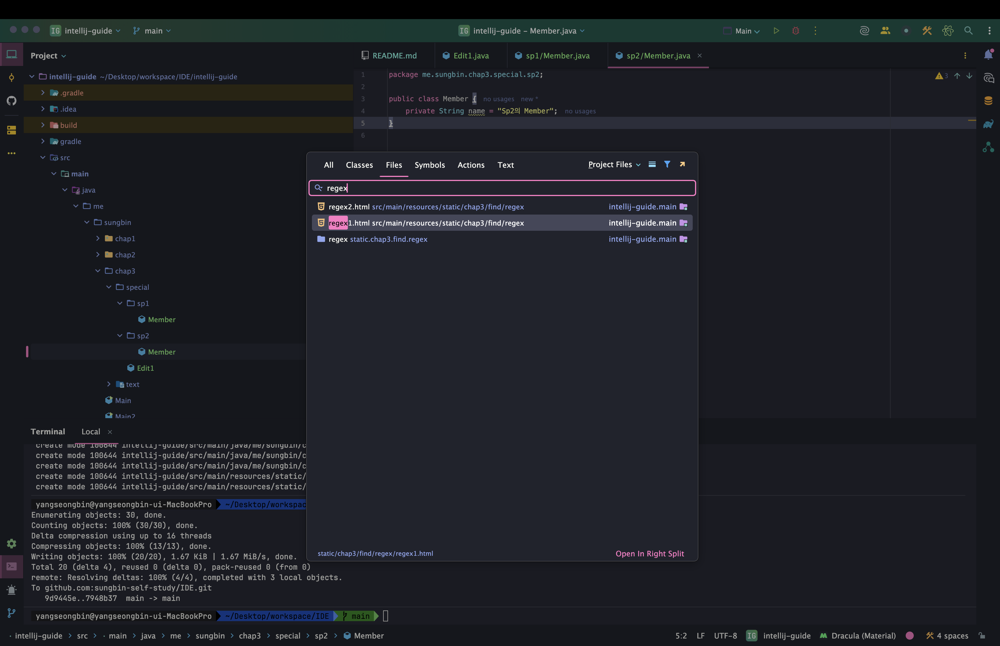

또한, 같은 파일의 이름이더라도 패키지가 다른 경우도 존재할 것이다. 이럴 때는 패키지명을 명시해서 파일을 검색하면 해당 파일만 검색되는 것을 볼 수 있을 것이다.

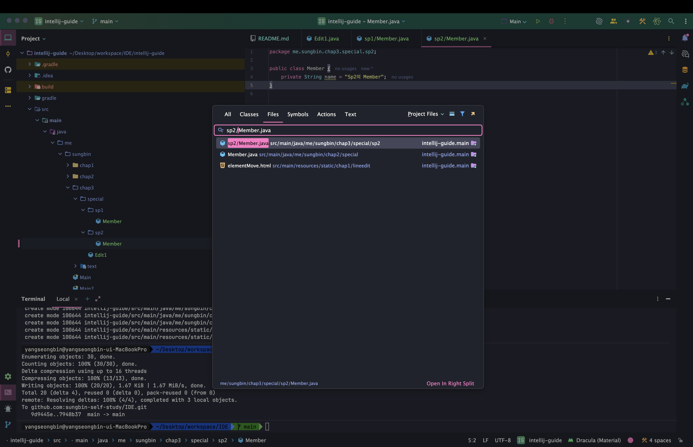

강의에서 든 예시처럼 `sp2` 패키지 아래의 `member` 파일을 찾고 싶다면 `sp2 member`처럼 **띄어쓰기로 이어서** 입력하면 된다. 그 외에도 아래 방법들이 통한다.

- **경로로 찾기**: `service/Member`처럼 `/`를 써서 디렉토리 경로를 포함해 검색할 수 있다.
- **줄 번호까지 지정**: `MemberService:42`처럼 뒤에 `:줄번호`를 붙이면 그 파일의 해당 줄로 바로 이동한다.
- **와일드카드**: `*Service`처럼 `*`를 쓸 수 있다. 이름 앞부분이 기억나지 않을 때 유용하다.

### [추가] 클래스 검색

강의에서는 파일 검색을 먼저 소개하지만, 사실 자바 개발자가 가장 많이 쓰는 것은 **클래스 검색**이다.

- **맥**: `command + o`
- **윈도우/리눅스**: `Ctrl + n`

파일 검색과 무엇이 다르냐면, 파일 검색은 `.yml`, `.html`, `.md` 같은 **모든 파일**을 대상으로 하지만 클래스 검색은 **클래스·인터페이스·enum만** 찾는다. 그래서 자바 코드를 찾을 때는
결과가 훨씬 깔끔하다.

그리고 파일 검색과 클래스 검색 모두에서 아주 유용한 팁이 하나 있다.

> **카멜케이스 약어로 검색하기**
>
> `EmailSenderService`라는 클래스를 찾고 싶을 때 이름을 다 칠 필요가 없다. 대문자만 따서 **`ESS`** 라고 입력하면 바로 찾아준다. 마찬가지로 `MemberRepository`는 `MR`,
> `OrderServiceImpl`은 `OSI`로 찾을 수 있다.
>
> 클래스 이름이 길수록 효과가 크기 때문에, 이것만 익혀도 파일 찾는 속도가 눈에 띄게 빨라진다.

### 메서드 검색

다음으로 메서드 검색을 알아보자. 클래스명은 정확히 기억이 나지 않지만 메서드 이름만 기억나는 경우도 존재할 것이다. 그럴 때는 맥 기준 `command + option + o`(윈도우/리눅스
`Ctrl + shift + alt + n`)이다. 그러면 아래와 같이 symbol 검색창이 열릴 것이고 여기서 원하는 메서드 이름을 검색해주면 된다.

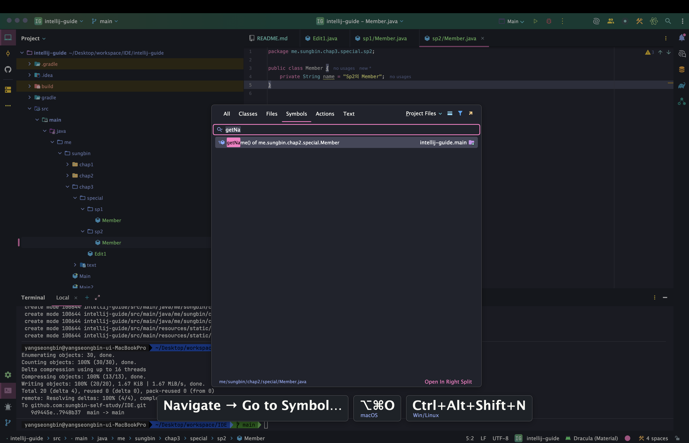

여기서 **심볼 (Symbol)** 이라는 표현이 나오는데, 메서드만 찾는 게 아니라 **메서드·필드·변수·상수 등 이름이 붙은 모든 코드 요소**를 찾는다는 의미다. 그래서 강의에서 설명하듯 `get`이라고만
입력해도 프로젝트 안의 모든 getter가 쭉 나온다.

이 기능은 특히 이럴 때 빛을 발한다.

- 남이 만든 코드에서 "분명 이런 이름의 메서드가 있었는데 어느 클래스였지?" 싶을 때
- 상수 값을 어디에 정의해뒀는지 찾을 때

### Action 검색

인텔리제이에서 뭔가 다양한 세팅과 기능들이 많이 존재한다. 하지만 이 기능이 어디에 있는지 알고 싶은 경우가 존재한다. 그럴때는 우리는 하나하나 인텔리제이 메뉴창을 다 열어보면서 찾아야 하지만 시간도 오래 걸리고
매우 귀찮은 작업이다. 이런 문제로 인텔리제이에서는 Action 검색 기능을 제공해준다. 맥 기준 단축키로 `command + shift + a`(윈도우/리눅스 `Ctrl + shift + a`)로 Action 검색
창을 띄울 수 있다.

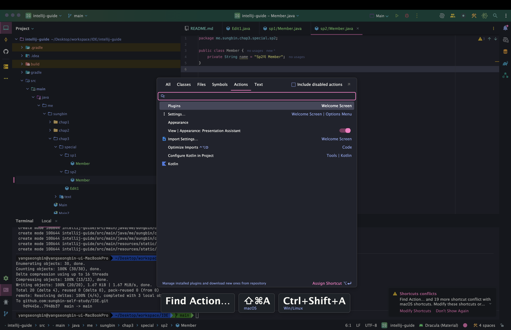

강사님은 이 절에서 유독 이 기능을 강조한다.

> "여기에서는 IntelliJ로 할 수 있는 모든 이벤트와 옵션들을 다 찾아낼 수가 있어요."
>
> "Command-Shift-A로 액션을 검색하는 것을 꼭 기억해 주세요."

필자도 여기에 완전히 동의한다. 이유는 단순하다. **이 단축키 하나만 알면 나머지 단축키를 몰라도 되기 때문이다.**

예를 들어 "라인 합치기 단축키가 뭐였더라?" 싶을 때, 굳이 검색해볼 필요 없이 Action 검색에서 `Join Lines`를 치면 된다. 그러면 기능이 실행될 뿐 아니라 **오른쪽에 그 기능의 단축키까지 같이
표시**된다. 즉 쓰면서 자연스럽게 단축키를 익히게 된다.

여기서 찾을 수 있는 것들을 정리하면 다음과 같다.

- **기능 (액션)**: `Reformat Code`, `Rename`, `Optimize Imports` 등
- **설정 (Settings)**: `Theme`, `Font Size`, `Live Templates` 등 설정 항목으로 바로 진입
- **도구 창 토글**: `Terminal`, `Project`, `Structure` 등
- **플러그인이 추가한 기능**: 설치한 플러그인의 기능도 전부 검색된다

> 만약 어떤 기능이 있는지조차 모르겠다면, 일단 떠오르는 영어 단어를 쳐보는 것만으로도 꽤 자주 원하는 것을 찾게 된다. IntelliJ의 기능 이름은 대체로 직관적이기 때문이다.

### [추가] 줄 번호로 이동

스택 트레이스나 에러 로그를 보다 보면 "`MemberService.java`의 128번째 줄"처럼 위치가 찍혀 있는 경우가 많다. 이럴 때 파일을 연 다음 스크롤로 찾아 내려갈 필요가 없다.

- **맥**: `command + l`
- **윈도우/리눅스**: `Ctrl + g`

이 단축키를 누르고 줄 번호를 입력하면 바로 그 줄로 이동한다. `128:5`처럼 `줄:칸` 형태로도 입력할 수 있다.

### 최근에 열었던 파일 목록 보기

우리가 작업을 하다가 최근에 열어본 파일의 목록을 보고 싶은 경우가 존재할 것이다. 이럴 때 인텔리제이에서는 맥 기준 단축키로 `command + e`(윈도우/리눅스 `Ctrl + e`)를 사용하면 아래와 같이
최근에 열어보았던 파일의 목록을 볼 수 있다.

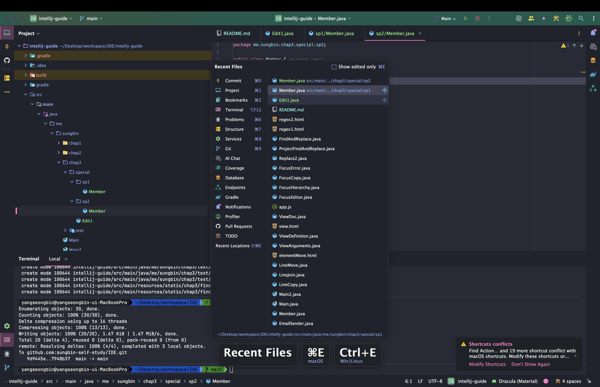

이 기능이 유용한 이유는 강의에서 설명하듯 **탭이 너무 많아졌을 때**다. 파일을 스무 개쯤 열어두면 탭에서 원하는 파일을 눈으로 찾는 것이 오히려 더 느려진다. 그럴 때 `command + e`를 누르고 파일
이름 몇 글자만 치면 바로 걸러진다.

> **팁**: 이 팝업이 뜬 상태에서 목록의 좌측에는 도구 창 (Project, Structure, Terminal 등)도 함께 표시된다. 즉 이전 편에서 배운 도구 창 이동도 여기서 할 수 있다. 그리고 팝업에서
> 파일을 선택한 뒤 `Delete` 키를 누르면 그 파일 탭을 닫을 수도 있다.

### 최근에 수정한 파일 목록 보기

또한, 우리가 최근에 수정했던 파일들의 목록을 볼 수 있는 기능을 인텔리제이에서는 제공한다. 맥 기준 단축키 `command + shift + e`(윈도우/리눅스 `Ctrl + shift + e`)를 사용하면 아래와
같이 최근에 수정했던 파일의 목록들을 볼 수 있다.

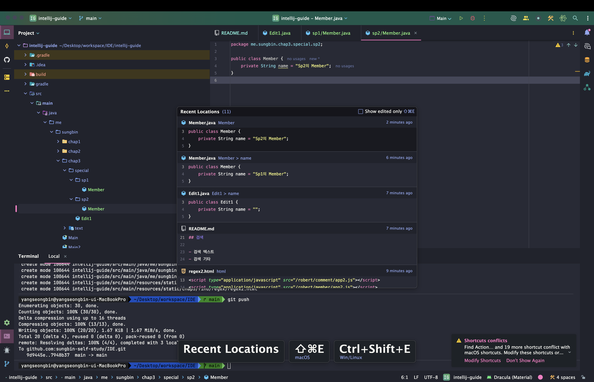

> **[중요] 이 단축키는 강의 이후 동작이 바뀌었다**
>
> 강의 시점에는 `command + shift + e`가 **"최근에 수정한 파일 목록 (Recently Edited Files)"** 이었다. 그런데 현재 버전의 IntelliJ에서 이 단축키는 **Recent
Locations (최근 위치)** 를 연다.
>
> 무엇이 다르냐면 이렇다.
>
> | | Recent Files (`command + e`) | Recent Locations (`command + shift + e`) |
> | --- | --- | --- |
> | 단위 | **파일** | **코드 위치(스니펫)** |
> | 보여주는 것 | 최근 접근한 파일 이름 목록 | 최근에 보거나 편집한 **코드 조각을 미리보기와 함께** |
> | 용도 | 파일 사이 이동 | "아까 그 코드 어디였지?" |
>
> 즉 Recent Locations는 파일 이름이 아니라 **코드 조각 자체를 보여준다.** 파일 이름은 기억 안 나는데 코드 모양은 기억날 때 아주 강력하다. 목록 위에서 검색어를 입력하면 그 코드 조각들 안에서
> 필터링도 된다.
>
> 그리고 이 팝업 안에서 **`command + shift + e`를 한 번 더 누르면 "Changed only"** 로 전환되어, 최근에 **수정한** 위치만 볼 수 있다. 강의에서 말한 "최근 수정한 파일"에
> 해당하는 기능은 지금은 여기에 들어와 있다고 보면 된다.
>
> 정리하면 강의 내용이 틀린 것이 아니라, IDE가 더 세밀한 기능으로 발전한 것이다.

### 정리

- 통합 검색 (Search Everywhere)
    - 맥/윈도우/리눅스: `Shift` 두 번
- 파일 검색
    - 맥: `command + shift + o`
    - 윈도우/리눅스: `Ctrl + shift + n`
- 클래스 검색
    - 맥: `command + o`
    - 윈도우/리눅스: `Ctrl + n`
- 메서드 (심볼) 검색
    - 맥: `command + option + o`
    - 윈도우/리눅스: `Ctrl + shift + alt + n`
- Action 검색
    - 맥: `command + shift + a`
    - 윈도우/리눅스: `Ctrl + shift + a`
- 줄 번호로 이동
    - 맥: `command + l`
    - 윈도우/리눅스: `Ctrl + g`
- 최근에 열었던 파일 목록 보기
    - 맥: `command + e`
    - 윈도우/리눅스: `Ctrl + e`
- 최근 위치 (수정 포함) 목록 보기
    - 맥: `command + shift + e`
    - 윈도우/리눅스: `Ctrl + shift + e`

## 마무리

이번 편에서는 검색 기능을 살펴봤다. 종류가 많다 보니 오히려 "어떤 상황에 무엇을 써야 하지?"가 헷갈릴 수 있어서, 상황별로 정리해보면 다음과 같다.

| 이런 상황이라면                          | 이 단축키를 쓰자                                  |
|------------------------------------------|---------------------------------------------------|
| 뭘 찾는지 애매하다                       | **더블 Shift** (Search Everywhere)                |
| 클래스 이름을 안다                       | `command + o` / `Ctrl + n`                        |
| 파일 이름을 안다 (설정 파일 등)          | `command + shift + o` / `Ctrl + shift + n`        |
| 메서드 이름만 안다                       | `command + option + o` / `Ctrl + shift + alt + n` |
| 이 메서드를 누가 쓰는지 알고 싶다        | `option + F7` (Find Usages)                       |
| 특정 문자열이 어디 박혀 있는지 알고 싶다 | `command + shift + f` (전체 검색)                 |
| IDE 기능·설정을 찾고 싶다                | `command + shift + a` (Action 검색)               |
| 아까 보던 코드로 돌아가고 싶다           | `command + e` / `command + shift + e`             |

이번에도 우선순위를 매겨보자면 아래 세 개부터 익히는 것을 추천한다.

1. **더블 Shift** — 나머지를 몰라도 이것 하나로 대부분 해결된다.
2. **`command + shift + a` (Action 검색)** — 강사님이 "꼭 기억해 달라"고 강조한 이유가 있다. 모르는 단축키를 찾는 단축키다.
3. **`option + F7` (Find Usages)** — 남의 코드를 읽을 때 이것만큼 자주 쓰는 기능이 없다.

그리고 전체 교체 (`command + shift + r`)를 쓸 때는 **범위를 좁히고, 검색으로 먼저 확인하고, 커밋해둔 상태에서** 하는 습관을 들이자. 이 세 가지만 지켜도 사고가 날 일이 거의 없다.

다음 편에서는 **자동완성**을 다룬다. 지금까지가 "이미 있는 코드를 찾는" 이야기였다면, 다음은 "새 코드를 덜 치고 만드는" 이야기다. 앞선 편에서 잠깐 언급했던 라이브 템플릿을 직접 만드는 방법과, 후위 완성
(Postfix Completion) 같은 기능들을 알아보도록 하겠다.
