> 해당 포스팅은 인프런의 [IntelliJ를 시작하시는 분들을 위한 IntelliJ 가이드](https://inf.run/doaZn) 강의를 참조하여 작성한 글입니다.

## 디버깅

디버깅이란, 우리가 작성한 코드의 흐름이나 혹은 외부 라이브러리를 파볼때 유용한 기능이다. 그러면 인텔레지이에서 본격적으로 디버깅 기능에 대해 알아보도록 하겠다. 디버깅을 하기 위해서는 먼저 Break Point를 찍어야 한다. 그러면 코드의 흐름이 쭉 이어지다가 해당 포인트에 멈추게 된다. 인텔리제이에서 찍는 방법은 라인 넘버를 클릭하면 빨간 색 점이 생길 텐데 그것이 브레이크 포인트가 생긴 것이다.

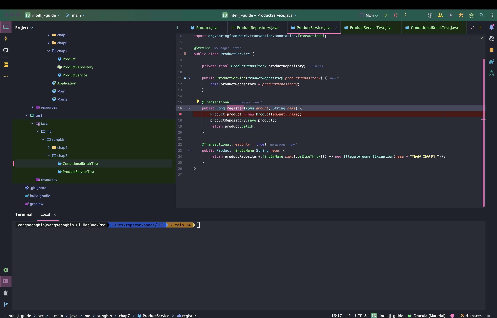

### 디버그 모드로 실행하기 - 즉시 실행

이제 디버그 모드로 실행하는 방법을 알아보자. 디버그 모드는 디버그하려는 해당 메서드를 실행할 때 찾을 수 있는데 아래의 테스트 코드처럼 해당 테스트 코드의 실행 버튼을 클릭하면 2번째 항목에 디버깅 모드로 실행한다라는 옵션창이 있을 것이다. 그것을 클릭하면 된다. 단축키로는 `command + shift + d`이다.

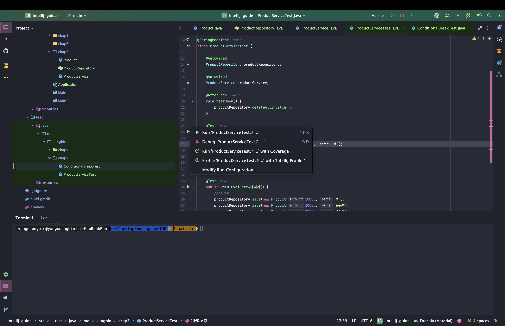

이렇게 실행하면 아래와 같이 코드의 흐름이 브레이크 포인트에 멈춰서 아래 무언가가 나오는 것을 볼 수 있다.

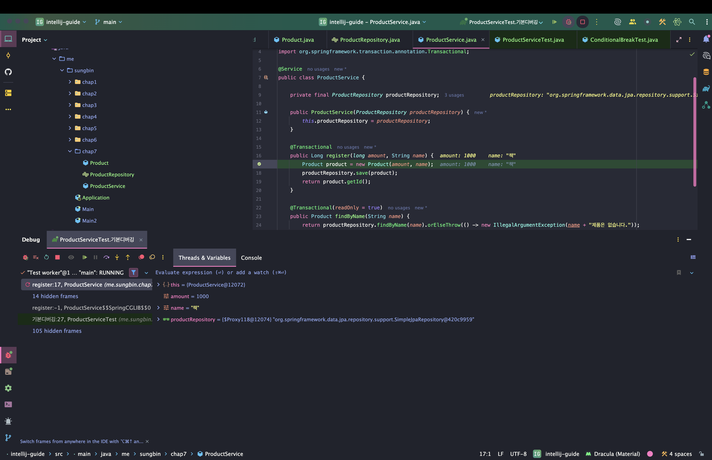

### 디버그 모드로 실행하기 - 이전 실행

그러면 만약 다른 함수로 포커스를 두고 이전에 실행한 코드를 디버그 모드로 실행하려면 어떻게 해야할까? 이건 이전에 이전 실행과 같다. 단축키로 `command + d`를 누르거나 IDE의 우측 상단의 빨간색 버튼을 클릭하면 된다.

### Resume

그러면 디버그 모드의 창에 대해 살펴보도록 하자. 위의 사진에 우측을 보면 이것을 우리는 stack trace라고 한다. 즉, 해당 break point까지 코드 흐름이 흐르기까지 어떻게 코드가 변경되고 거쳐왔는지 알 수 있는 역사라고 보면 좋을 것 같다.

다음으로 Thread&Variable이라는 창이 있는데 우리는 회사 코드라던지 외부 라이브러리를 분석해볼 때 해당 창을 보고 코드가 어떻게 변화하는지 쉽게 알 수 있다.

그러면 이제 디버그 모드만의 기능을 알아보도록 하겠다. 먼저, Resume기능이다. 해당 기능은 아래의 사진처럼 초록색 버튼을 클릭하면 되는데 해당 기능은 다음 break point로 이동하는 기능이다.

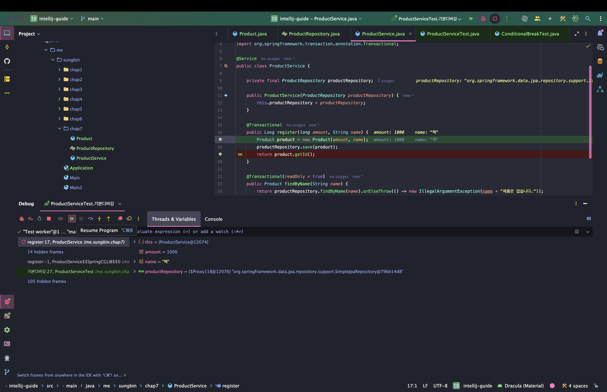

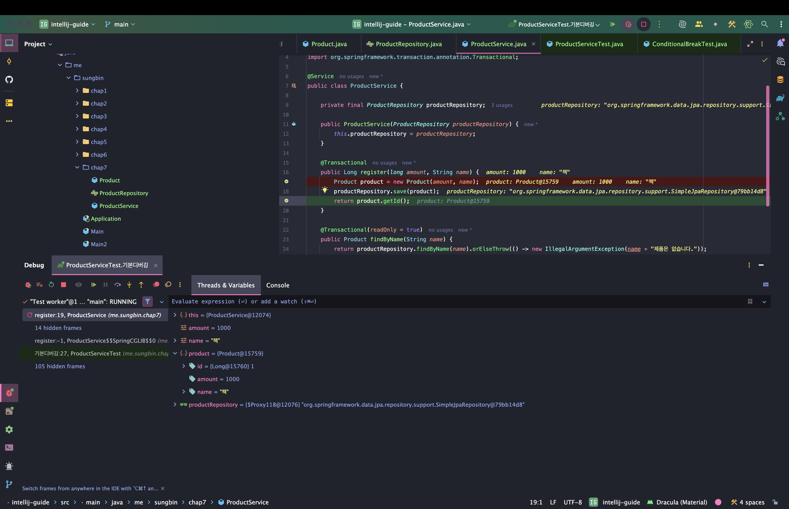

### Step Over

다음은 Step Over이다. 해당 기능은 아래 사진처럼 보라색 화살표 버튼을 클릭하면 되고 해당 기능은 다음 라인으로 넘어가는 기능이다. 즉, break point를 찍지 않더라도 다음 라인으로 넘어가서 코드의 흐름을 볼 수 있는 기능이다.

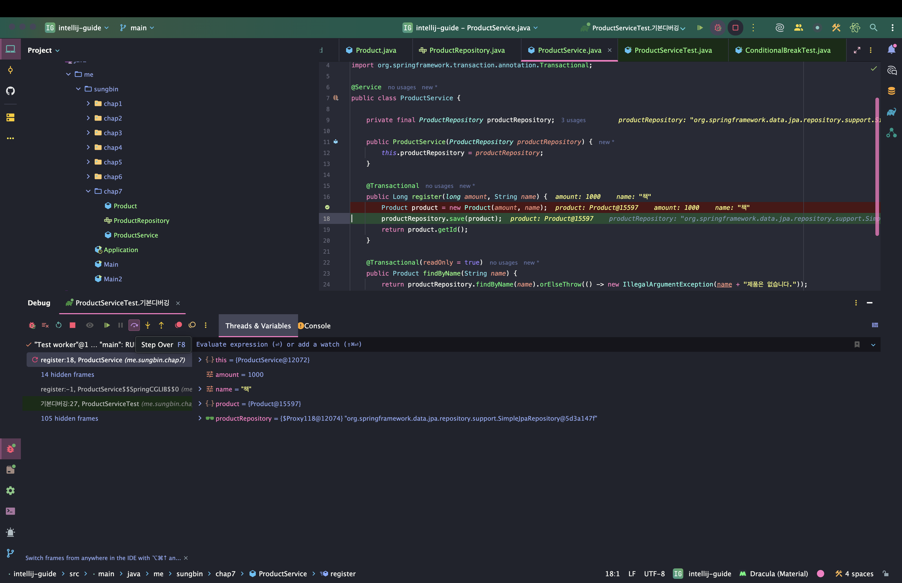

### Step Into

다음은 Step Into 기능이다. 해당 기능은 break point를 찍지는 않았지만 해당 코드 내부로 들어가서 어떻게 동작이 이루어지는지 궁금할 때 사용하는 기능이다. 해당 기능은 아래의 사진처럼 노란색 버튼을 클릭하면 된다.

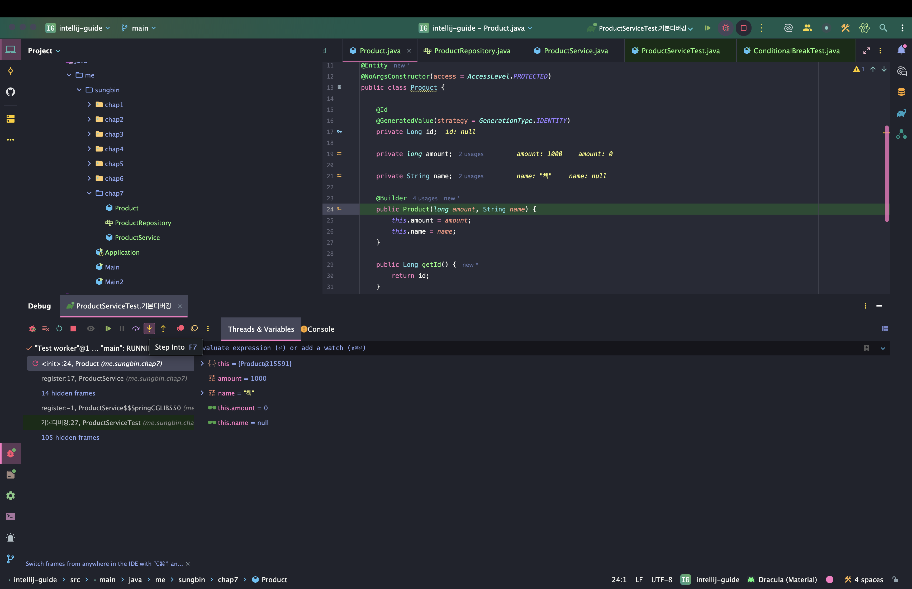

### Step Out

다음은 Step Out이다. 해당 기능은 안으로 들어와서 내부 동작을 확인했고 이제 나가고 다시 원래 break point로 돌아가고 싶을 때 사용하며 Step Into 버튼 바로 옆의 버튼을 클릭하면 된다.

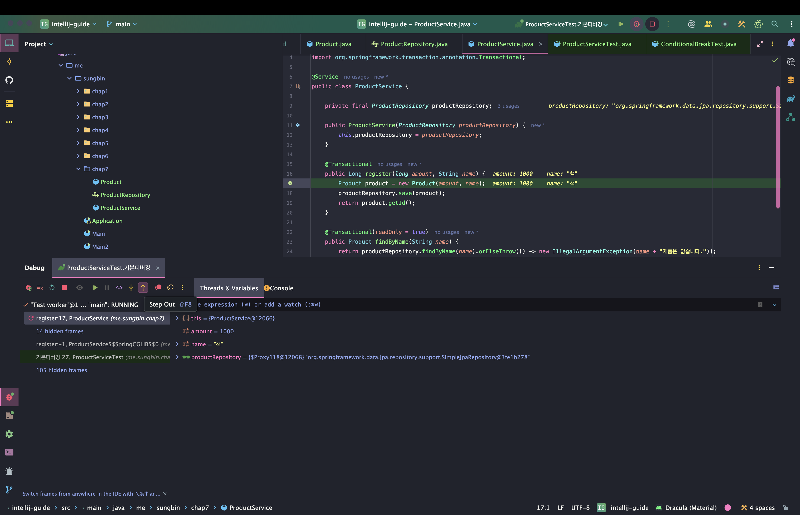

그 외의 다양한 기능들이 있다. 그것은 Step Out의 햄버거 버튼을 누르면 다양한 기능이 있으니 한번씩 사용 바란다.

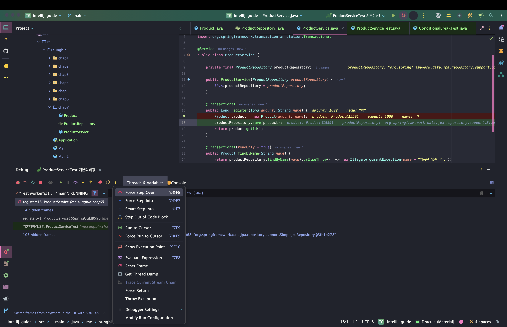

### Conditional Expression

해당 기능은 아래의 사진처럼 반복문의 특정 값에 디버깅을 보고 싶을 경우를 사용한다. 원하는 디버깅 포인트를 찍고 그 디버깅 포인트를 오른쪽 마우스 클릭을 하면 아래와 같이 나온다.

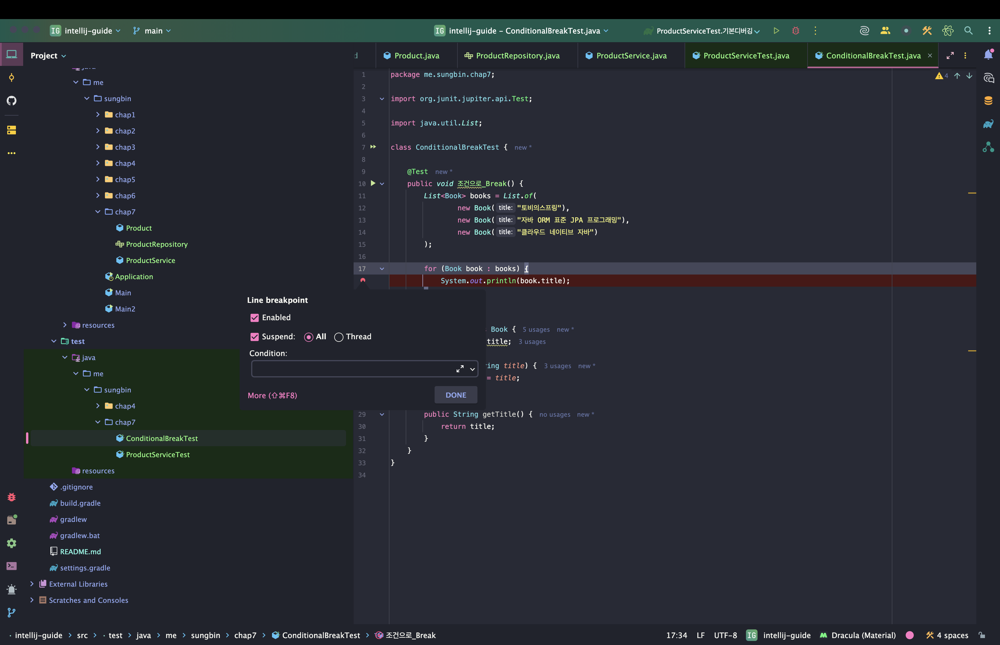

그리고 여기서 마치 자바코드를 작성하듯이 사용하면 되는데 여기서 사용할 수 있는 scope는 디버깅 포인트로 찍은 그 라인에서 접근이 가능한 변수, 메서드, 객체등 모두 사용이 가능하다.

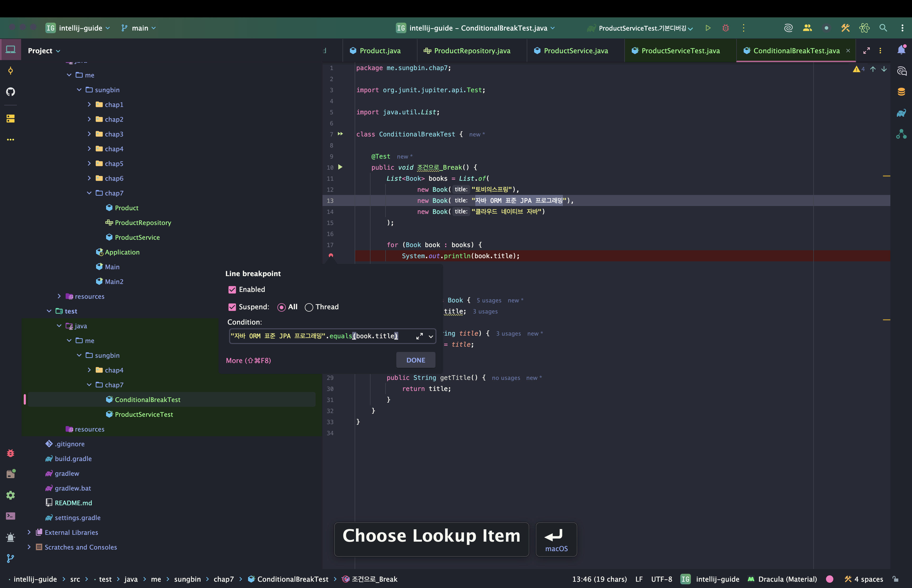

### Evaluate Expression

다음은 Evaluate Expression 기능이다. 아래와 같이 햄버거 버튼을 클릭하면 아래와 같이 창이 뜨는데 여기서 Evaluate Expression 버튼을 클릭하면 된다.

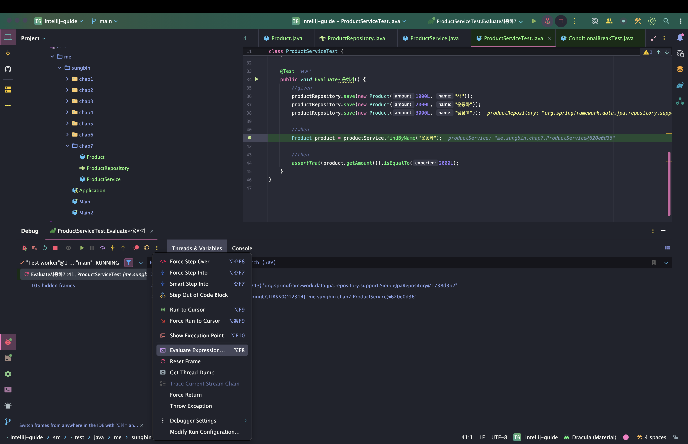

그것을 클릭하면 아래와 같이 나오는데

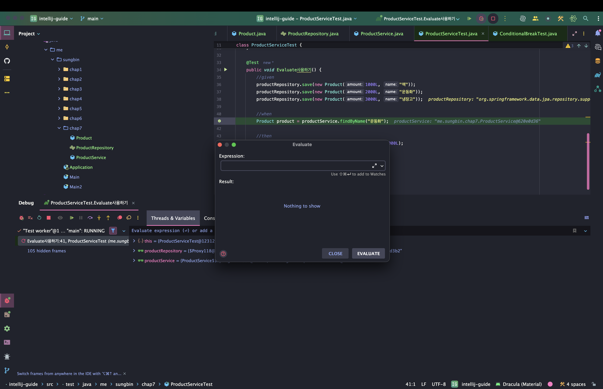

여기서 해당 브레이크 포인트에서 연산이 가능한 코드들을 통해 확인이 가능하다. 아래의 예시는 진짜 데이터가 잘 들어갔는지 조회해보는 기능이다.

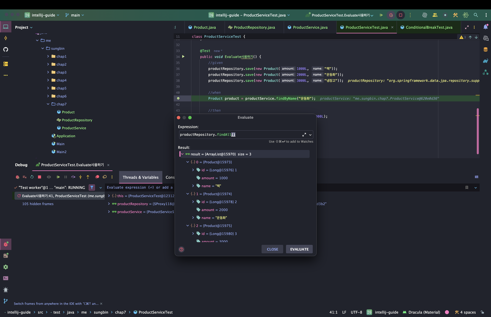

### Watch

다음은 watch기능이다. Evaluate Expression은 어플리케이션을 다시 시작하면 기존에 작성했던 것이 날라가는 단점이 존재한다. 그래서 뭔가 실시간으로 변화되는 모습이 보기 힘들다. 이것을 위해 만들어진 것이 watch 기능이다. 아래와 같이 우측 하단에 버튼을 클릭해 watch를 클릭한다.

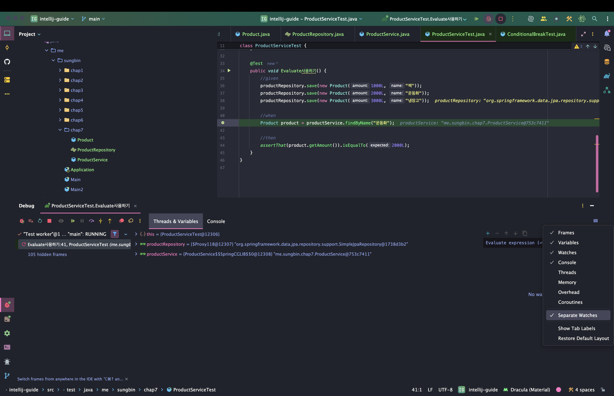

그리고 우리가 실시간으로 변화되는 것을 보고 싶은 변수나 객체를 적어준다. 그러면 실시간으로 확인이 가능하다.

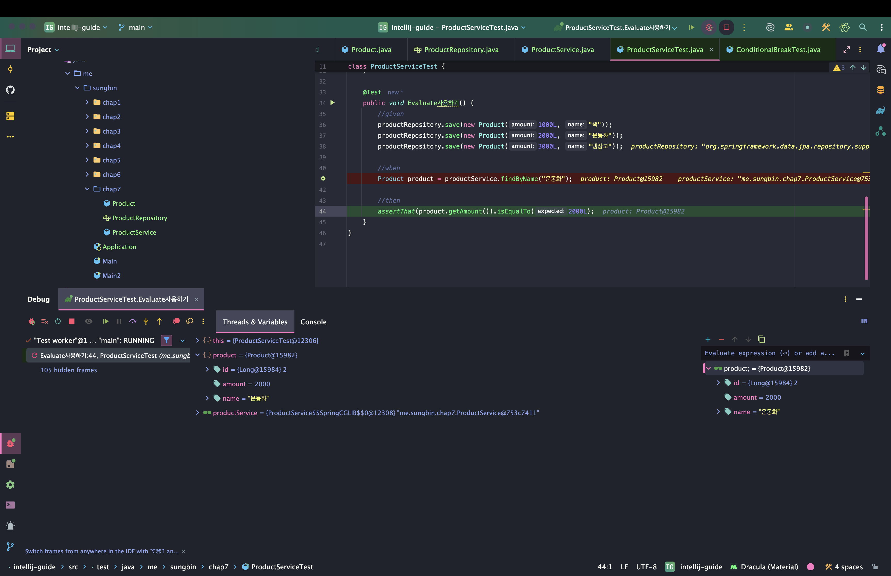

### 정리

- Debug 모드로 실행하기 (현재 위치의 메서드)
    - 맥: `Ctrl + shift + d`
    - 윈도우/리눅스: 없음
- Debug 모드로 실행하기 (이전에 실행한 메서드)
    - 맥: `Ctrl + d`
    - 윈도우/리눅스: 없음
- Resume
    - 맥: `command + option + r`
    - 윈도우/리눅스: `F9`
- Step Over
    - 맥: `F8`
    - 윈도우/리눅스: `F8`
- Step Into
    - 맥: `F7`
    - 윈도우/리눅스: `F7`
- Step Out
    - 맥: `shift + F8`
    - 윈도우/리눅스: `shift + F8`
- Evaluate Expression(브레이크된 상태에서 코드 사용하기)
    - 맥: `option + F8`
    - 윈도우/리눅스: `Alt + F8`
- watch (브레이크 이후의 코드 변경 확인하기)
    - 맥: 없음
    - 윈도우/리눅스: 없음