> 해당 포스팅은 인프런의 [IntelliJ를 시작하시는 분들을 위한 IntelliJ 가이드](https://inf.run/doaZn) 강의를 참조하여 작성한 글입니다.

## 들어가며

이번 편은 이 시리즈에서 가장 중요한 편이라고 해도 과언이 아니다. 강사님도 이 챕터를 이렇게 열었다.

> "안녕하세요 여러분, 이번 시간에는 IDE를 쓰시는 모든 분들이 꼭 아시면 좋을 디버깅 기능을 진행해 볼 거고요."

왜 중요할까? 우리가 코드를 짜다가 문제가 생겼을 때 보통 이렇게 한다.

``` java
public void calculate(List<Order> orders) {
    System.out.println("여기까지는 왔음");        // ①
    long total = 0;
    for (Order order : orders) {
        System.out.println("order = " + order);  // ②
        total += order.getPrice();
        System.out.println("total = " + total);  // ③
    }
    System.out.println("최종 = " + total);       // ④
}
```

익숙한 풍경이다. 그런데 이 방식에는 문제가 있다.

- 값을 하나 더 보고 싶으면 **코드를 고치고 다시 컴파일해서 다시 실행**해야 한다.
- 출력문을 지우는 것을 깜빡하면 그대로 커밋된다.
- 반복문이 1000번 돌면 콘솔이 1000줄로 도배된다.
- **외부 라이브러리 내부**는 애초에 출력문을 넣을 수도 없다.

디버깅은 이 모든 문제를 해결한다. **코드를 전혀 건드리지 않고, 프로그램이 실행되는 도중에 멈춰서, 그 시점의 모든 변수를 들여다보고, 심지어 값을 바꿔볼 수도 있다.**

그리고 강사님이 마무리에서 강조하듯, 이건 IntelliJ만의 이야기가 아니다.

> IntelliJ뿐만 아니라 Node.js, Python, Android 등 다양한 환경에서 활용 가능한 보편적인 기술이다.

브레이크포인트, Step Over, Step Into 같은 개념은 WebStorm, PyCharm, Android Studio는 물론이고 VS Code나 Chrome 개발자 도구에서도 똑같이 통한다. 한 번 익히면
평생 쓰는 지식이다.

## 디버깅

디버깅이란, 우리가 작성한 코드의 흐름이나 혹은 외부 라이브러리를 파볼때 유용한 기능이다. 그러면 인텔레지이에서 본격적으로 디버깅 기능에 대해 알아보도록 하겠다. 디버깅을 하기 위해서는 먼저 Break Point를
찍어야 한다. 그러면 코드의 흐름이 쭉 이어지다가 해당 포인트에 멈추게 된다. 인텔리제이에서 찍는 방법은 라인 넘버를 클릭하면 빨간 색 점이 생길 텐데 그것이 브레이크 포인트가 생긴 것이다.

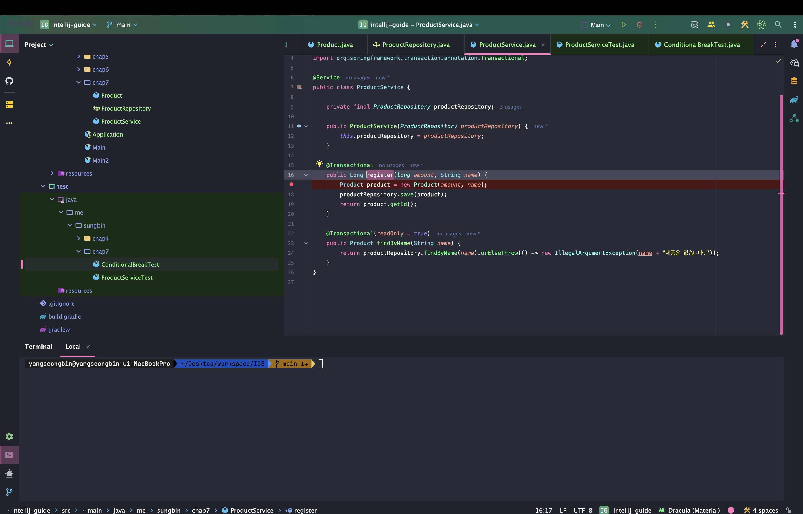

강사님도 이 부분을 이렇게 설명한다.

> "이게 뭐냐면 우클릭을 하지 않고 빈 곳에 클릭을 하게 되면 이렇게 브레이크 포인트가 걸리고, 이건 디버그 모드로 실행을 할 때 언제든지 여기에서 멈추게 된다는 걸 의미합니다."

> **[팁] 브레이크포인트도 단축키로 찍을 수 있다**
>
> 마우스로 라인 번호 옆을 클릭하는 것도 좋지만, 커서가 이미 그 줄에 있다면 단축키가 더 빠르다.
>
> - **브레이크포인트 토글**: 맥 `command + F8`, 윈도우/리눅스 `Ctrl + F8`
> - **모든 브레이크포인트 목록 보기**: 맥 `command + shift + F8`, 윈도우/리눅스 `Ctrl + shift + F8`
>
> 특히 두 번째 단축키는 꽤 중요하다. 디버깅하다 보면 브레이크포인트를 여기저기 찍어놓고 어디에 찍었는지 잊어버리는 일이 잦은데, 이 목록에서 전부 확인하고 한 번에 지울 수 있다. 뒤에서 다룰 조건 설정도 여기서
> 할 수 있다.

### 브레이크포인트에도 종류가 있다

원글에서는 라인 브레이크포인트만 다뤘지만, IntelliJ에는 네 가지 종류가 있다. 상황에 따라 골라 쓰면 디버깅이 훨씬 수월해진다.

| 종류                     | 언제 멈추나                 | 찍는 방법                     |
|--------------------------|-----------------------------|-------------------------------|
| **Line Breakpoint**      | 그 줄에 도달했을 때         | 라인 번호 옆 클릭 (가장 기본) |
| **Method Breakpoint**    | 메서드에 들어가거나 나갈 때 | 메서드 선언부 옆 클릭         |
| **Field Watchpoint**     | 그 필드를 읽거나 쓸 때      | 필드 선언부 옆 클릭           |
| **Exception Breakpoint** | 특정 예외가 발생했을 때     | 브레이크포인트 목록에서 `+`   |

이 중에서 실무에서 진가를 발휘하는 것은 단연 **Exception Breakpoint**다.

> **NullPointerException이 어디서 터지는지 모르겠다면**
>
> 로그에 스택 트레이스가 찍혔는데도 원인을 못 찾을 때가 있다. 이럴 때 Exception Breakpoint를 쓰면 **예외가 던져지는 바로 그 순간에** 프로그램이 멈춘다. 그 시점의 모든 변수 값을 볼 수
> 있으니 원인을 바로 알 수 있다.
>
> 설정 방법은 이렇다.
>
> 1. `command + shift + F8`로 브레이크포인트 목록을 연다.
> 2. 좌측 상단 `+` 버튼 → `Java Exception Breakpoints`를 고른다.
> 3. `NullPointerException`처럼 잡고 싶은 예외 클래스를 입력한다.
>
> 특히 **내 코드가 아니라 프레임워크 안쪽에서 예외가 나는 경우**에 이만한 방법이 없다. 스택 트레이스만 보고 추측하는 것과 실제 그 순간의 변수를 보는 것은 차원이 다르다.

그리고 하나 더, **Mute Breakpoints** 기능도 알아두면 좋다. 디버깅 도구 창에 있는 이 버튼을 누르면 **디버그 세션은 유지한 채 모든 브레이크포인트를 잠시 무시**한다. "지금은 그냥 끝까지
돌려보고 싶은데 브레이크포인트를 다 지우기는 아깝다" 싶을 때 쓰면 된다.

### 디버그 모드로 실행하기 - 즉시 실행

이제 디버그 모드로 실행하는 방법을 알아보자. 디버그 모드는 디버그하려는 해당 메서드를 실행할 때 찾을 수 있는데 아래의 테스트 코드처럼 해당 테스트 코드의 실행 버튼을 클릭하면 2번째 항목에 디버깅 모드로
실행한다라는 옵션창이 있을 것이다. 그것을 클릭하면 된다. 단축키로는 맥 기준 `Ctrl + shift + d`이다.

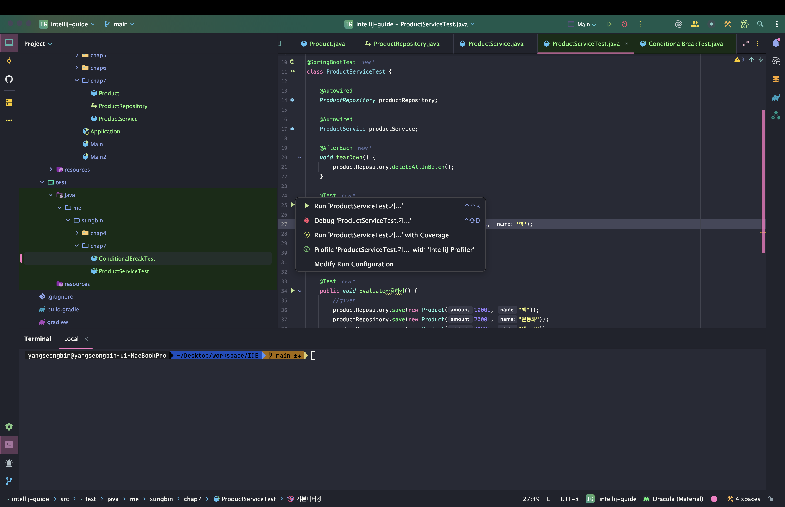

이렇게 실행하면 아래와 같이 코드의 흐름이 브레이크 포인트에 멈춰서 아래 무언가가 나오는 것을 볼 수 있다.

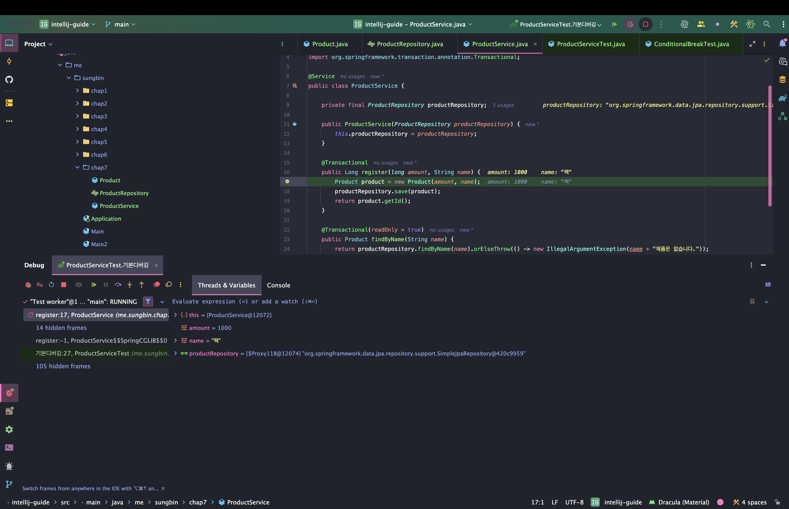

### 디버그 모드로 실행하기 - 이전 실행

그러면 만약 다른 함수로 포커스를 두고 이전에 실행한 코드를 디버그 모드로 실행하려면 어떻게 해야할까? 이건 이전에 이전 실행과 같다. 단축키로 맥 기준 `Ctrl + d`를 누르거나 IDE의 우측 상단의 빨간색
버튼을 클릭하면 된다.

강사님도 두 단축키의 차이를 이렇게 정리해준다.

> "자 그러면 방금 제가 두 가지를 보여드렸어요. Ctrl + Shift + D 는 현재 포커스가 있는 곳을 디버그 모드로 실행을 하는 거고요. Ctrl + D 는 이전에 실행했던, 현재 여기 남아있는 메소드를
> 디버그 모드로 실행을 하는 겁니다."

> **[핵심] Run과 Debug는 완벽하게 대칭이다**
>
> 사실 이 두 단축키는 새로 외울 필요가 거의 없다. **코드 Edit 편에서 배운 실행 단축키에서 알파벳만 바꾼 것**이기 때문이다.
>
> | | 실행 (Run) | 디버그 (Debug) |
> | --- | --- | --- |
> | **현재 커서 위치 기준** | `Ctrl + shift + r` | `Ctrl + shift + d` |
> | **이전에 실행한 것 재실행** | `Ctrl + r` | `Ctrl + d` |
>
> **`r`은 Run, `d`는 Debug.** 그리고 `shift`가 붙으면 "지금 커서가 있는 곳을 새로 잡아서" 실행한다는 의미다. 검색 편에서 배운 "shift = 향상된 버전" 규칙이 여기서도 비슷하게
> 통한다.
>
> 참고로 여기서 맥의 `Ctrl`을 `command`로 잘못 누르면 전혀 다른 일이 벌어진다. `command + d`는 라인 복사, `command + shift + d`는 다른 기능이니 주의하자.

윈도우/리눅스는 사정이 조금 다르다.

- **디버그 (현재 구성 재실행)**: `Shift + F9`
- **현재 커서 위치 기준 디버그**: 기본 단축키가 따로 없다. 에디터 좌측의 초록색 실행 아이콘을 클릭해서 `Debug`를 고르거나, `Alt + Shift + F9`로 구성 목록에서 선택하면 된다.

### 디버그 창 읽는 법

그러면 디버그 모드의 창에 대해 살펴보도록 하자. 위의 사진에 우측을 보면 이것을 우리는 stack trace라고 한다. 즉, 해당 break point까지 코드 흐름이 흐르기까지 어떻게 코드가 변경되고 거쳐왔는지
알 수 있는 역사라고 보면 좋을 것 같다.

> 참고로 IntelliJ 화면에서 이 영역의 정식 명칭은 **Frames**이고, 여기 쌓여 있는 것을 **콜 스택 (Call Stack)** 이라고 부른다. 우리가 흔히 말하는 "스택 트레이스"는 예외가 터졌을
> 때 로그에 찍히는 텍스트를 가리키는 경우가 많은데, 둘은 같은 개념을 다른 형태로 보여주는 것이라고 이해하면 된다.
>
> 이 콜 스택은 **위에서 아래로 읽으면 "누가 나를 호출했는지"** 를 거슬러 올라가는 순서다. 각 항목을 클릭하면 그 시점의 변수 상태로 화면이 바뀌기 때문에, **"이 값이 대체 어디서부터 잘못 들어온
거지?"** 를 추적할 때 아주 유용하다. 프레임워크나 라이브러리 내부에서 문제가 생겼을 때 특히 그렇다.

다음으로 Thread&Variable이라는 창이 있는데 우리는 회사 코드라던지 외부 라이브러리를 분석해볼 때 해당 창을 보고 코드가 어떻게 변화하는지 쉽게 알 수 있다.

**Variables** 창에는 현재 멈춘 지점에서 접근 가능한 모든 것이 나온다. 지역 변수, 메서드 파라미터, `this`(현재 객체의 필드까지) 등이다. 화살표를 펼치면 객체 안의 객체까지 계속 파고들 수
있다.

> **[알아두면 좋은 것] 인라인 디버깅**
>
> 최근 IntelliJ는 디버그 모드로 멈췄을 때 **에디터 코드 오른쪽에 회색 글씨로 변수 값을 직접 표시**해준다. 그래서 Variables 창을 보지 않아도 코드를 읽으면서 바로 값을 확인할 수 있다.
>
> ``` java
> long total = 0;              // total: 0
> for (Order order : orders) { // order: Order@1234
>     total += order.getPrice(); // total: 15000
> }
> ```
>
> 처음에는 이게 눈에 잘 안 들어오는데, 익숙해지면 디버그 창을 거의 안 보게 될 정도로 편하다.

### Resume

그러면 이제 디버그 모드만의 기능을 알아보도록 하겠다. 먼저, Resume기능이다. 해당 기능은 아래의 사진처럼 초록색 버튼을 클릭하면 되는데 해당 기능은 다음 break point로 이동하는 기능이다.

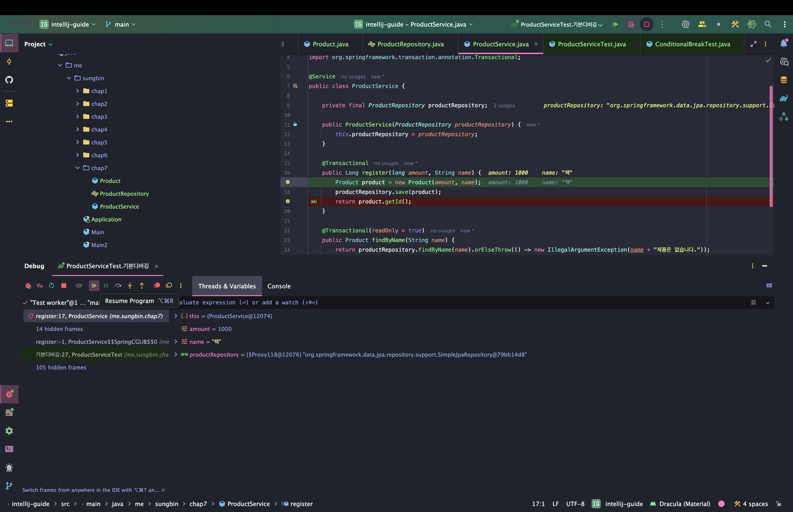

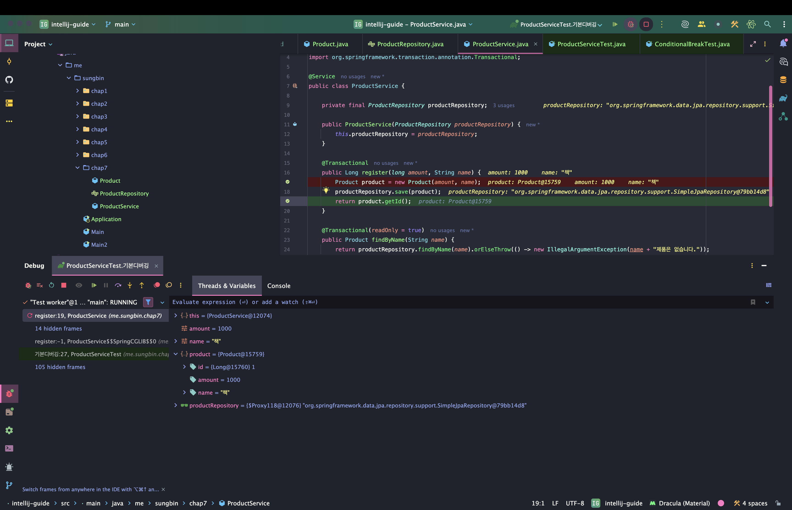

단축키는 맥 기준 `command + option + r`, 윈도우/리눅스 기준 `F9`다. 강의에서도 가장 자주 쓰는 기능으로 소개되는데, **"여기부터 저기까지는 관심 없으니 그냥 가라"** 는 뜻이기 때문이다.

브레이크포인트를 여러 개 찍어두고 Resume를 반복해서 누르면, 코드가 어떤 순서로 흘러가는지 큰 그림을 빠르게 파악할 수 있다.

### Step Over

다음은 Step Over이다. 해당 기능은 아래 사진처럼 보라색 화살표 버튼을 클릭하면 되고 해당 기능은 다음 라인으로 넘어가는 기능이다. 즉, break point를 찍지 않더라도 다음 라인으로 넘어가서 코드의
흐름을 볼 수 있는 기능이다.

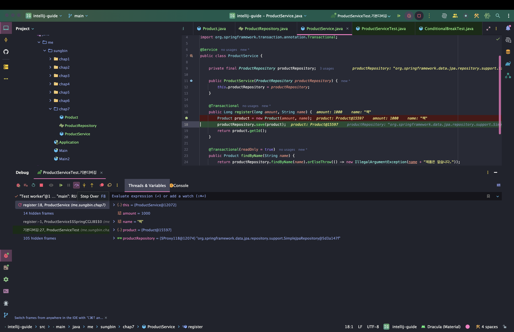

단축키는 맥/윈도우/리눅스 공통으로 `F8`이다.

여기서 **Over**라는 이름의 의미를 짚고 넘어가자. "넘어간다"는 뜻인데, 무엇을 넘어가느냐면 **그 줄에 있는 메서드 호출을 통째로 넘어간다.**

``` java
long price = order.getPrice();   // ← 여기서 Step Over를 누르면
System.out.println(price);       // ← getPrice() 내부는 안 들어가고 바로 여기로 온다
```

즉 `getPrice()`가 실행되긴 하지만 그 안을 들여다보지는 않는다. **"이 메서드는 잘 동작할 거라 믿고 결과만 볼래"** 라고 할 때 쓴다. 디버깅할 때 가장 많이 누르게 되는 버튼이다.

### Step Into

다음은 Step Into 기능이다. 해당 기능은 break point를 찍지는 않았지만 해당 코드 내부로 들어가서 어떻게 동작이 이루어지는지 궁금할 때 사용하는 기능이다. 해당 기능은 아래의 사진처럼 노란색 버튼을
클릭하면 된다.

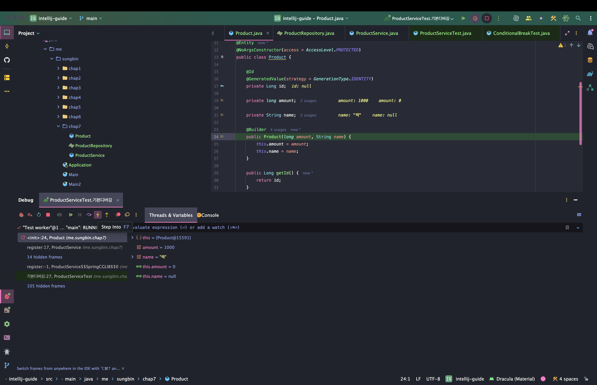

단축키는 맥/윈도우/리눅스 공통으로 `F7`이다. Step Over와 반대로, **그 줄의 메서드 안으로 들어간다.**

``` java
long price = order.getPrice();   // ← 여기서 Step Into를 누르면
                                 //   getPrice() 메서드 안으로 들어간다
```

> **[중요] 한 줄에 메서드가 여러 개라면 - Smart Step Into**
>
> 실제 코드는 이렇게 단순하지 않다.
>
> ``` java
> int result = calculate(getPrice(order), getDiscount(member));
> ```
>
> 이 줄에서 그냥 Step Into (`F7`)를 누르면 IntelliJ가 **자기 마음대로 첫 번째 메서드부터** 들어간다. 내가 보고 싶은 게 `getDiscount()`인데 `getPrice()`로
> 들어가버리면 다시 Step Out으로 나와야 한다.
>
> 이때 쓰는 것이 **Smart Step Into**다.
>
> - **맥/윈도우/리눅스 공통**: `shift + F7`
>
> 이걸 누르면 그 줄에 있는 메서드 호출들이 화면에 표시되고, **어디로 들어갈지 직접 고를 수 있다.** 메서드 체이닝이나 중첩 호출이 많은 코드에서는 이게 사실상 기본이 된다.

> **[참고] 라이브러리 안으로 못 들어갈 때 - Force Step Into**
>
> `System.out.println()` 같은 자바 표준 라이브러리는 Step Into를 눌러도 들어가지지 않는다. IntelliJ가 "여기는 볼 필요 없다"고 판단해서 기본적으로 건너뛰기 때문이다.
>
> 정말로 안을 봐야 한다면 **Force Step Into**를 쓰면 된다.
>
> - **맥**: `option + shift + F7`
> - **윈도우/리눅스**: `Alt + shift + F7`

### Step Out

다음은 Step Out이다. 해당 기능은 안으로 들어와서 내부 동작을 확인했고 이제 나가고 다시 원래 break point로 돌아가고 싶을 때 사용하며 Step Into 버튼 바로 옆의 버튼을 클릭하면 된다.

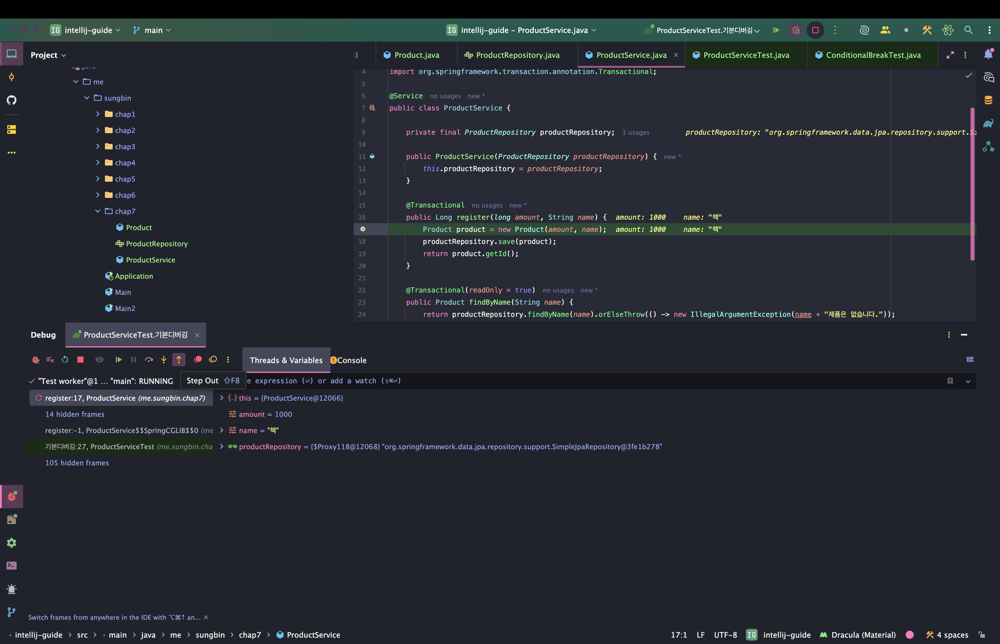

단축키는 맥/윈도우/리눅스 공통으로 `shift + F8`이다. 현재 메서드를 **끝까지 실행한 뒤 호출한 곳으로 돌아온다.**

Step Into로 잘못 들어갔거나, 안을 다 봤으니 이제 나가고 싶을 때 쓰면 된다.

그 외의 다양한 기능들이 있다. 그것은 Step Out의 햄버거 버튼을 누르면 다양한 기능이 있으니 한번씩 사용 바란다.

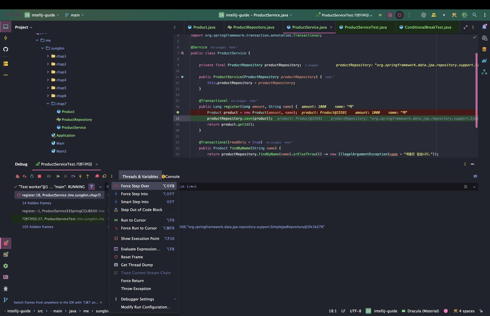

여기 숨어 있는 것들 중 알아두면 좋은 두 가지를 소개한다.

**Run to Cursor (`option + F9` / `Alt + F9`)**

`F8`을 스무 번 누르는 대신, **보고 싶은 줄에 커서를 두고 이 단축키를 누르면 거기까지 한 번에 실행**된다. 브레이크포인트를 새로 찍고 Resume하는 것과 같은 효과인데 훨씬 간편하다. 반복문 안에서 특정
지점까지 건너뛸 때 유용하다.

**Drop Frame**

**"아, 방금 Step Over를 잘못 눌렀다"** 싶을 때 쓰는 기능이다. 현재 메서드 호출을 통째로 취소하고 **그 메서드를 호출하기 직전 상태로 되돌린다.** 다시 처음부터 디버깅을 시작할 필요가 없어진다.

다만 완벽한 되돌리기는 아니다. **지역 변수는 복구되지만 전역 상태나 이미 발생한 부수 효과 (DB 저장, 파일 쓰기, 콘솔 출력 등)는 되돌아가지 않는다.** 이 점만 이해하고 쓰면 아주 유용하다.

**Show Execution Point (`option + F10` / `Alt + F10`)**

디버깅 중에 다른 파일을 이리저리 열어보다가 "지금 어디서 멈춰 있었지?"를 잃어버렸을 때, 이 단축키를 누르면 **현재 멈춰 있는 그 줄로 즉시 돌아간다.**

### Conditional Expression

해당 기능은 아래의 사진처럼 반복문의 특정 값에 디버깅을 보고 싶을 경우를 사용한다. 원하는 디버깅 포인트를 찍고 그 디버깅 포인트를 오른쪽 마우스 클릭을 하면 아래와 같이 나온다.

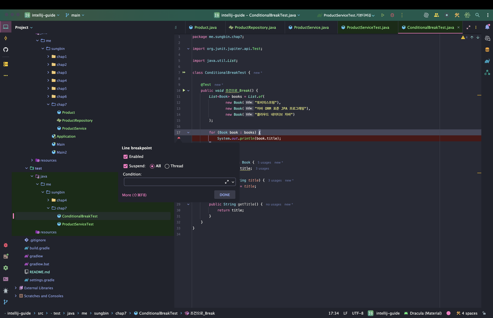

그리고 여기서 마치 자바코드를 작성하듯이 사용하면 되는데 여기서 사용할 수 있는 scope는 디버깅 포인트로 찍은 그 라인에서 접근이 가능한 변수, 메서드, 객체등 모두 사용이 가능하다.

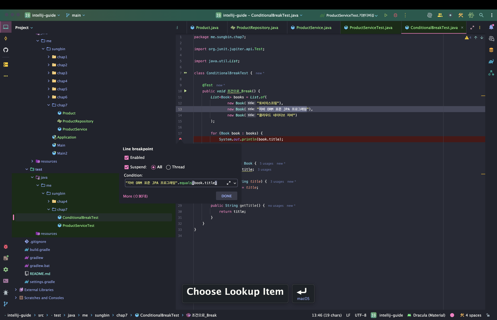

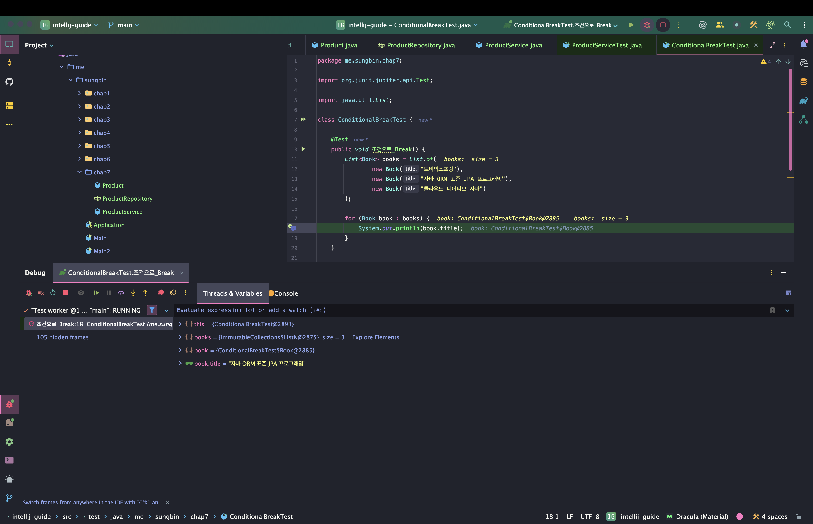

이 기능이 왜 필요한지는 상황을 그려보면 명확하다. 주문이 1000건 들어 있는 리스트를 도는 반복문에서, **문제가 되는 것은 987번째 주문 하나뿐**이라고 해보자. 조건 없이 브레이크포인트를 찍으면
Resume를 986번 눌러야 한다.

조건식을 걸면 이 문제가 사라진다.

``` java
// 조건식 예시
order.getId() == 987L
order.getPrice() < 0
"robert".equals(member.getName())
list.size() > 100
```

조건식은 **결과가 `boolean`이기만 하면** 무엇이든 쓸 수 있다. 그 줄에서 접근 가능한 변수와 메서드를 자유롭게 호출할 수 있으니, 사실상 자바 코드 한 줄을 쓰는 것과 같다.

### 조건식 말고도 알아두면 좋은 브레이크포인트 옵션들

브레이크포인트를 우클릭한 뒤 `More` 를 누르거나 `command + shift + F8`로 목록을 열면 조건식 외에도 여러 옵션이 나온다. 이 중 실무에서 유용한 것들을 정리하면 다음과 같다.

**1. 멈추지 않고 로그만 남기기 (가장 추천)**

`Suspend` 체크를 **해제**하고 아래 옵션을 켜면, 프로그램을 멈추지 않고 지나가면서 로그만 콘솔에 남긴다.

- **`Log message to console`**: "여기를 지나갔다"는 사실만 기록
- **`Evaluate and log`**: **원하는 표현식의 값을 계산해서 기록**

이게 왜 중요하냐면, 글 서두에서 이야기한 `System.out.println` 디버깅을 **코드를 전혀 건드리지 않고** 그대로 대체할 수 있기 때문이다.

``` java
// 이렇게 코드를 고치는 대신
System.out.println("total = " + total);

// 브레이크포인트의 Evaluate and log 칸에 이렇게 적으면 된다
"total = " + total
```

코드를 수정하지 않으니 컴파일도 다시 안 해도 되고, 지우는 것을 깜빡해서 커밋할 일도 없다. 반복문 안의 값 변화를 훑어볼 때 특히 좋다.

**2. Suspend policy (멈추는 범위)**

- **All**: 모든 스레드를 멈춘다 (기본값)
- **Thread**: 브레이크포인트에 걸린 스레드만 멈춘다
- **None**: 멈추지 않는다 (위의 로그 용도)

멀티스레드 환경을 디버깅할 때 `All`로 두면 다른 스레드까지 전부 멈춰서 상황 파악이 어려울 수 있다. 그럴 때 `Thread`로 바꾸면 된다.

**3. Hit count (통과 횟수)**

"N번째로 걸릴 때만 멈춰라"를 지정할 수 있다. 조건식을 쓰기 애매한데 **"몇 번째 반복인지"만 알고 있을 때** 편하다.

**4. 의존 브레이크포인트 (Disable until hitting the following breakpoint)**

"A 브레이크포인트를 거친 뒤에만 B에서 멈춰라"를 설정할 수 있다. 여러 곳에서 호출되는 공통 메서드를 디버깅할 때, **특정 경로로 들어온 경우만** 잡고 싶을 때 아주 유용하다.

### Evaluate Expression

다음은 Evaluate Expression 기능이다. 아래와 같이 햄버거 버튼을 클릭하면 아래와 같이 창이 뜨는데 여기서 Evaluate Expression 버튼을 클릭하면 된다.

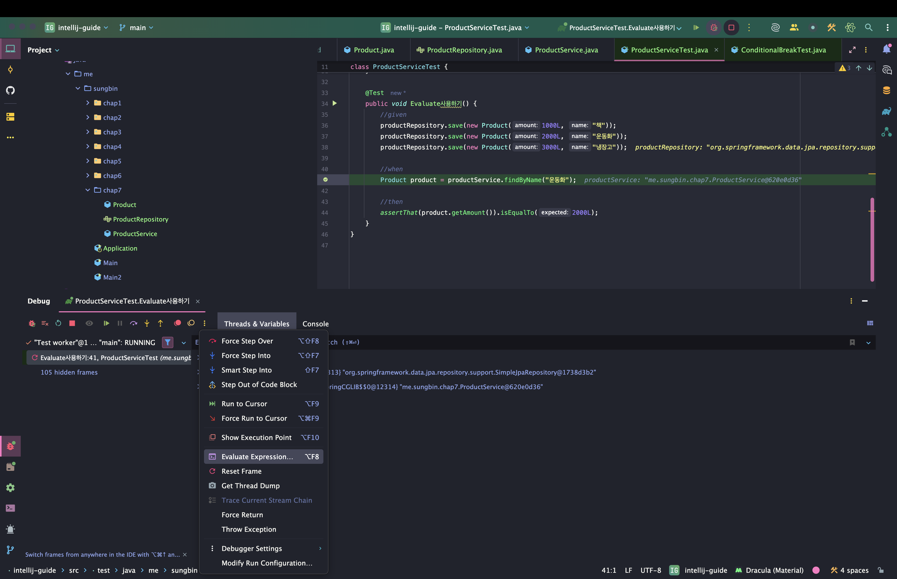

단축키는 맥 기준 `option + F8`, 윈도우/리눅스 기준 `Alt + F8`이다. 그것을 클릭하면 아래와 같이 나오는데

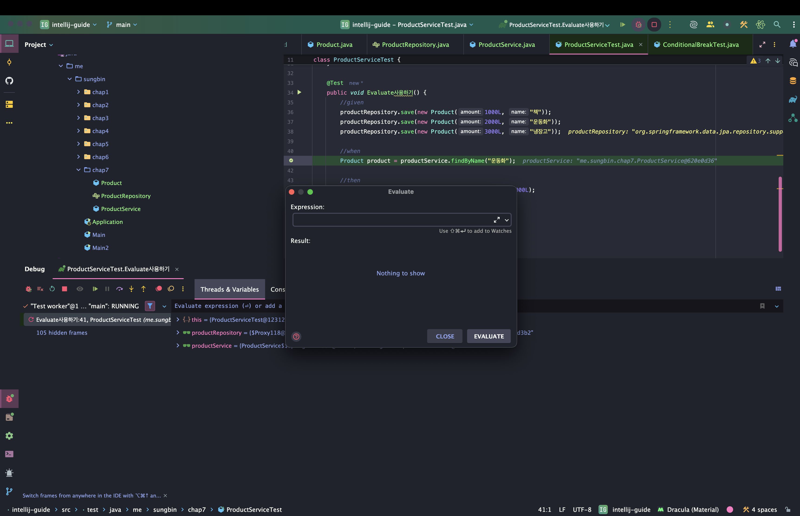

여기서 해당 브레이크 포인트에서 연산이 가능한 코드들을 통해 확인이 가능하다. 아래의 예시는 진짜 데이터가 잘 들어갔는지 조회해보는 기능이다.

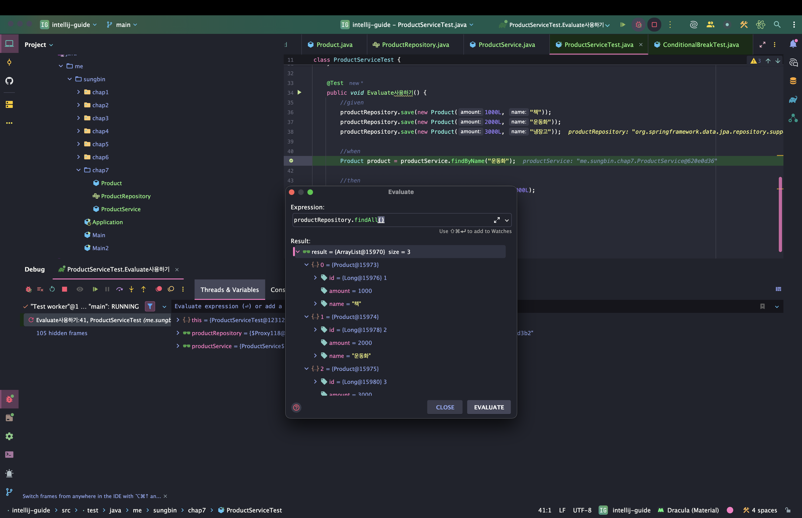

이 기능의 강력함은 **"멈춘 그 시점에서 아무 코드나 실행해볼 수 있다"** 는 데 있다. 단순히 변수 값을 보는 것을 넘어서 아래 같은 일이 가능하다.

``` java
// 변수 값 확인
order.getPrice()

// 메서드 호출해보기
memberRepository.findById(1L)

// 계산해보기
orders.stream().mapToLong(Order::getPrice).sum()

// 조건 검증해보기
orders.size() > 0 && orders.get(0).getPrice() > 1000
```

강사님도 이 부분을 "불필요한 테스트 코드를 작성하지 않고도 코드의 동작을 검증할 수 있다"고 설명한다. 정확히 그렇다. **"이렇게 하면 될까?"를 확인하려고 테스트 코드를 새로 짜는 대신, 디버거를 멈춰두고
여기서 바로 실험해볼 수 있다.**

> **[주의] 부수 효과가 있는 코드는 조심하자**
>
> Evaluate Expression에서 실행한 코드도 **실제로 실행된다.** 즉 `memberRepository.save(member)`를 입력하면 진짜로 DB에 저장된다.
>
> 조회 같은 안전한 코드는 마음껏 써도 되지만, 데이터를 변경하거나 외부 API를 호출하는 코드를 실행할 때는 그 결과가 실제로 반영된다는 점을 기억하자.

> **[팁] 여러 줄 코드도 실행할 수 있다**
>
> Evaluate 창에는 한 줄짜리 표현식만 넣을 수 있는 게 아니다. 창을 확장하는 아이콘 (또는 `Code Fragment Mode`)을 누르면 **여러 줄짜리 코드 블록**을 작성해서 실행할 수 있다.
> 반복문이나 조건문을 포함한 로직도 그 자리에서 돌려볼 수 있다.

### Watch

다음은 watch기능이다. Evaluate Expression은 어플리케이션을 다시 시작하면 기존에 작성했던 것이 날라가는 단점이 존재한다. 그래서 뭔가 실시간으로 변화되는 모습이 보기 힘들다. 이것을 위해 만들어진
것이 watch 기능이다. 아래와 같이 우측 하단에 버튼을 클릭해 watch를 클릭한다.

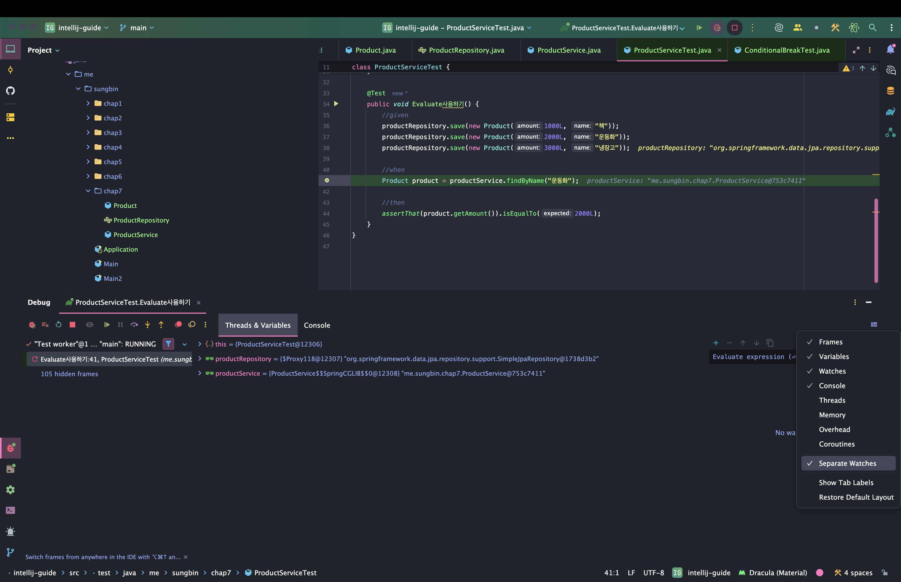

그리고 우리가 실시간으로 변화되는 것을 보고 싶은 변수나 객체를 적어준다. 그러면 실시간으로 확인이 가능하다.

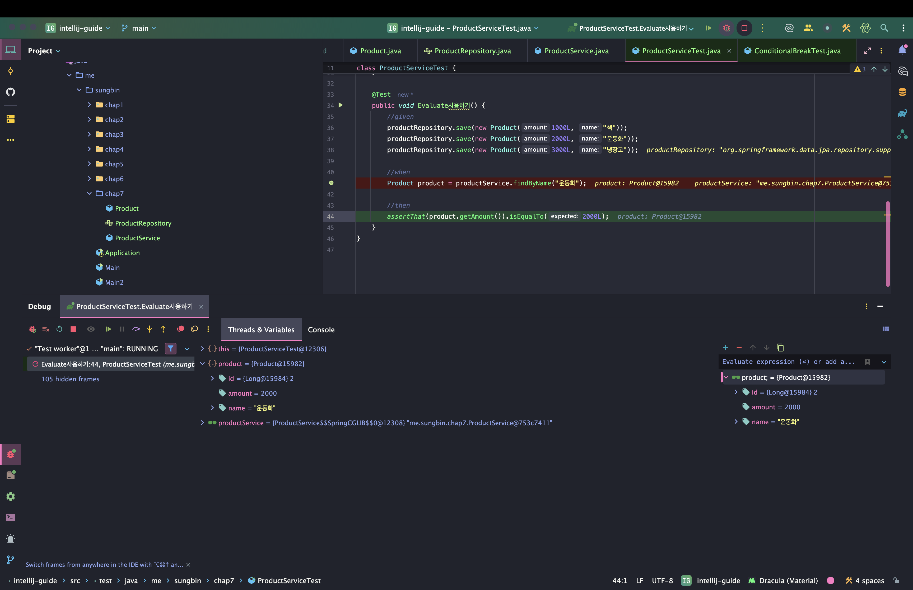

강사님이 이 기능을 도입하는 맥락이 정확히 원글의 설명과 같다.

> "방금 제가 했던 이 Evaluate Expression은 항상 켤 때마다 초기화가 돼요. 그러면 문제가, '어 이상하다 이거 나는 프로덕트라는 코드가 혹은 지역 변수가 값이 어떻게 변한지를 라인별로 실시간으로
> 확인을 하고 싶다.'"

두 기능의 차이를 표로 정리하면 이렇다.

|                      | Evaluate Expression          | Watch                              |
|----------------------|------------------------------|------------------------------------|
| 성격                 | **일회성 계산기**            | **고정 관찰 목록**                 |
| 언제 계산되나        | 내가 실행 버튼을 누를 때     | **매 스텝마다 자동으로**           |
| 세션을 다시 시작하면 | 초기화된다                   | **유지된다**                       |
| 적합한 용도          | "지금 이거 한 번 확인해보자" | "이 값이 어떻게 변하는지 지켜보자" |

즉 `F8`을 연타하면서 **값이 한 줄 한 줄 어떻게 바뀌는지 추적**하고 싶을 때는 Watch가 정답이다.

> **[팁] 더 빠르게 Watch 추가하기**
>
> Variables 창에서 보고 있는 변수를 우클릭하고 `Add to Watches`를 고르면 바로 등록된다. 그리고 에디터에서 표현식을 선택한 뒤 우클릭 → `Add to Watches`로도 추가할 수 있다.
>
> 최근 버전에는 **인라인 워치**라는 것도 있는데, 코드 특정 줄에 워치를 고정해두면 그 줄 옆에 값이 계속 표시된다.

## [추가] 알아두면 좋은 고급 기능

강의에는 나오지 않지만, 알아두면 디버깅이 훨씬 강력해지는 기능 몇 가지를 소개한다.

### 1. 변수 값을 직접 바꿔보기

이건 디버거의 기능 중 가장 과소평가되어 있다고 생각한다. Variables 창에서 **변수를 우클릭하고 `Set Value`(또는 `F2`)를 누르면 그 자리에서 값을 바꿀 수 있다.**

왜 유용한지 예를 들어보자.

- "재고가 0일 때 어떻게 되는지 보고 싶은데, DB 데이터를 바꾸기는 번거롭다" → 그냥 디버깅 중에 `stock` 값을 0으로 바꿔본다.
- "이 조건문의 else 분기를 타는 상황을 재현하고 싶다" → 조건 변수를 반대로 바꾼다.
- "예외 상황을 테스트하고 싶다" → 값을 `null`로 바꿔본다.

**재현하기 어려운 상황을 강제로 만들어낼 수 있다**는 점에서 아주 강력하다.

### 2. 스트림 디버깅 (Java Stream Debugger)

자바 개발자라면 이건 꼭 알아두자. 스트림 체이닝은 디버깅이 어렵기로 악명 높다.

``` java
List<String> result = orders.stream()
        .filter(o -> o.getPrice() > 1000)
        .map(Order::getName)
        .distinct()
        .sorted()
        .collect(Collectors.toList());
```

중간에 어디서 데이터가 걸러졌는지 확인하려면 보통 `peek()`를 끼워넣거나 단계별로 쪼개야 했다. 그런데 IntelliJ에는 **Stream Debugger**가 내장되어 있다.

스트림 코드에 브레이크포인트를 걸고 멈춘 뒤, 디버그 도구 창에서 **`Trace Current Stream Chain`** 버튼을 누르면 된다. 그러면 **각 단계마다 원소가 어떻게 걸러지고 변환되는지를
시각적으로** 보여준다. 어느 `filter`에서 데이터가 다 날아갔는지 한눈에 파악할 수 있다.

### 3. 이미 돌고 있는 프로그램에 붙기 (Attach to Process)

디버그 모드로 시작하지 않았는데 문제가 생긴 경우도 있다. 이럴 때는 **이미 실행 중인 JVM 프로세스에 디버거를 붙일 수 있다.**

- 메뉴에서 `Run` → `Attach to Process`를 고르면 현재 실행 중인 자바 프로세스 목록이 나온다.

여기서 더 나아가면 **원격 디버깅 (Remote Debug)** 도 가능하다. 개발 서버에서 돌고 있는 애플리케이션에 내 로컬 IDE를 연결해서 디버깅하는 방식인데, 실무에서 "로컬에서는 재현이 안 되는 문제"를
잡을 때 쓰인다. 다만 운영 환경에 붙이는 것은 서비스가 멈출 수 있어 매우 조심해야 한다.

### 정리

- Debug 모드로 실행하기 (현재 위치의 메서드)
    - 맥: `Ctrl + shift + d`
    - 윈도우/리눅스: 기본 단축키 없음 (거터 아이콘 또는 `Alt + shift + F9`)
- Debug 모드로 실행하기 (이전에 실행한 메서드)
    - 맥: `Ctrl + d`
    - 윈도우/리눅스: `Shift + F9`
- 브레이크포인트 찍기/지우기
    - 맥: `command + F8`
    - 윈도우/리눅스: `Ctrl + F8`
- 브레이크포인트 목록 보기 (조건 설정도 여기서)
    - 맥: `command + shift + F8`
    - 윈도우/리눅스: `Ctrl + shift + F8`
- Resume
    - 맥: `command + option + r`
    - 윈도우/리눅스: `F9`
- Step Over
    - 맥: `F8`
    - 윈도우/리눅스: `F8`
- Step Into
    - 맥: `F7`
    - 윈도우/리눅스: `F7`
- Smart Step Into (들어갈 메서드 고르기)
    - 맥: `shift + F7`
    - 윈도우/리눅스: `shift + F7`
- Force Step Into (라이브러리 내부까지)
    - 맥: `option + shift + F7`
    - 윈도우/리눅스: `Alt + shift + F7`
- Step Out
    - 맥: `shift + F8`
    - 윈도우/리눅스: `shift + F8`
- Run to Cursor (커서 위치까지 실행)
    - 맥: `option + F9`
    - 윈도우/리눅스: `Alt + F9`
- 현재 실행 위치로 돌아가기
    - 맥: `option + F10`
    - 윈도우/리눅스: `Alt + F10`
- Evaluate Expression (브레이크된 상태에서 코드 사용하기)
    - 맥: `option + F8`
    - 윈도우/리눅스: `Alt + F8`
- 디버깅 중지
    - 맥: `command + F2`
    - 윈도우/리눅스: `Ctrl + F2`
- watch (브레이크 이후의 코드 변경 확인하기)
    - 맥: 없음 (Variables 창에서 `Add to Watches`)
    - 윈도우/리눅스: 없음 (Variables 창에서 `Add to Watches`)

## 마무리

이번 편의 내용을 상황별로 정리하면 이렇다.

| 이런 상황이라면                         | 이렇게 하자                                |
|-----------------------------------------|--------------------------------------------|
| 여기부터 저기까지는 관심 없다           | **Resume** (`command + option + r` / `F9`) |
| 이 메서드 결과만 보면 된다              | **Step Over** (`F8`)                       |
| 이 메서드 안이 궁금하다                 | **Step Into** (`F7`)                       |
| 한 줄에 메서드가 여러 개다              | **Smart Step Into** (`shift + F7`)         |
| 잘못 들어왔다                           | **Step Out** (`shift + F8`)                |
| 1000번 중 987번째만 보고 싶다           | **조건부 브레이크포인트**                  |
| 값을 찍어보고 싶은데 코드는 고치기 싫다 | 브레이크포인트의 **Evaluate and log**      |
| 이 코드가 되는지 실험해보고 싶다        | **Evaluate Expression** (`option + F8`)    |
| 값이 변하는 과정을 지켜보고 싶다        | **Watch**                                  |
| 예외가 어디서 터지는지 모르겠다         | **Exception Breakpoint**                   |
| 스트림 중간이 궁금하다                  | **Trace Current Stream Chain**             |

우선순위를 매겨보자면 아래 네 가지부터 익히는 것을 추천한다.

1. **브레이크포인트 + `Ctrl + shift + d`** — 일단 멈춰봐야 시작된다.
2. **`F8` / `F7` / `shift + F8`** — 이 세 개가 스테핑의 전부다.
3. **조건부 브레이크포인트** — 반복문 디버깅의 난이도가 완전히 달라진다.
4. **Evaluate Expression (`option + F8`)** — 테스트 코드를 짜기 전에 여기서 먼저 실험해보자.

그리고 이번 편에서 가장 전하고 싶은 메시지는 이것이다.

> **`System.out.println`을 추가하려고 손이 움직인다면, 그 순간 브레이크포인트를 대신 찍어보자.**

처음에는 출력문을 찍는 게 더 빠르게 느껴진다. 하지만 디버거에 익숙해지면, 코드를 고치고 다시 빌드하고 다시 실행하는 왕복이 사라지기 때문에 비교가 안 되게 빨라진다. 그리고 강사님 말대로 이 기술은 다른 언어와
다른 IDE에서도 그대로 통한다.

다음 편에서는 **Git & Github**를 다룬다. 터미널로 하던 `git add`, `git commit`, `git push`를 IDE 안에서 처리하는 방법과, 변경 이력을 시각적으로 확인하는 방법을
알아보도록 하겠다.
