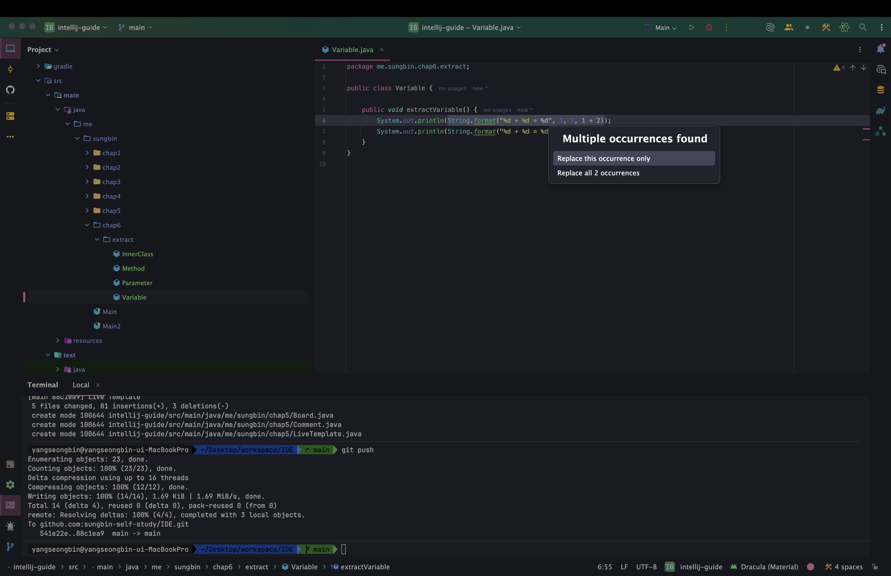
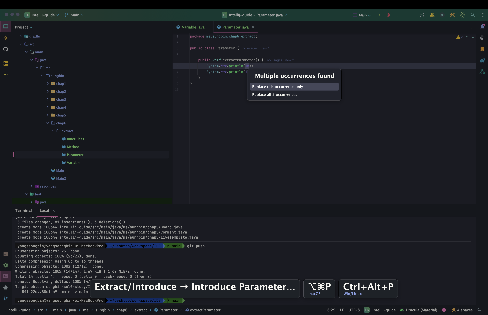
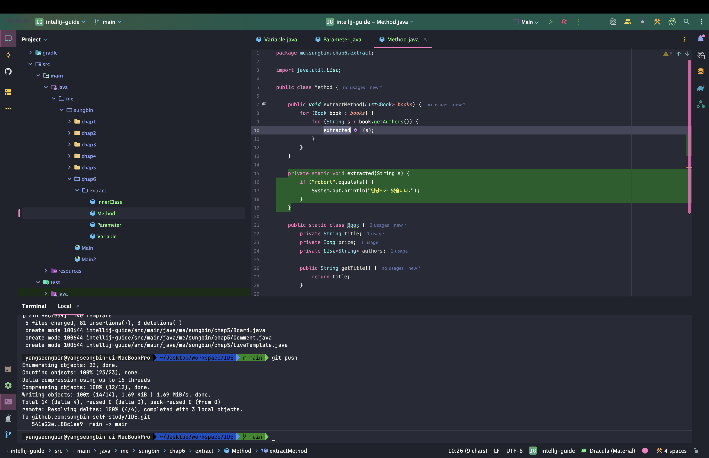
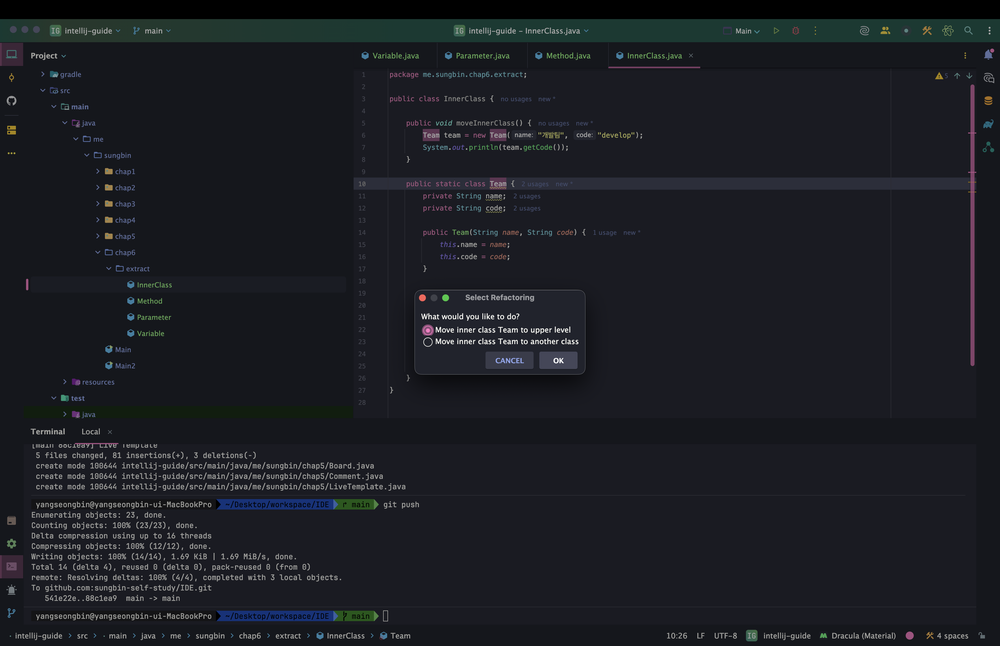
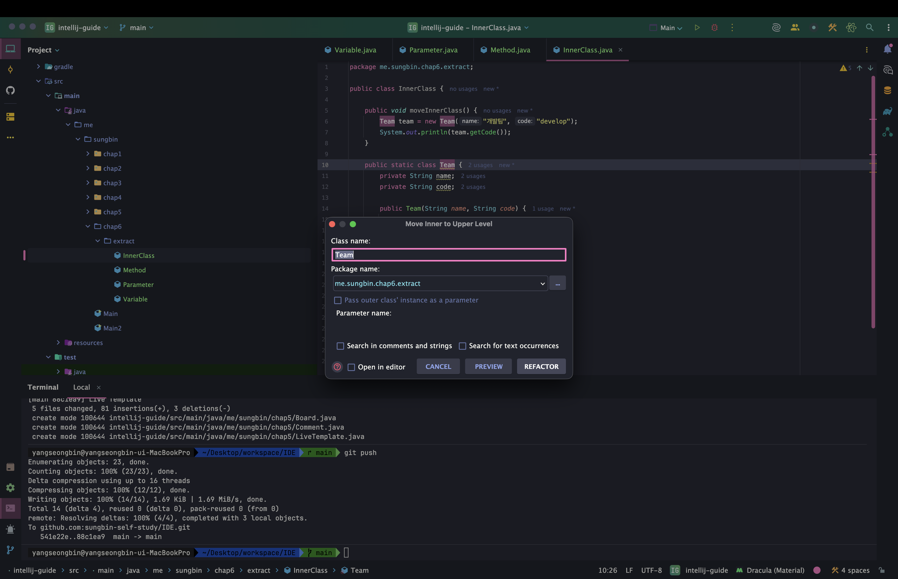
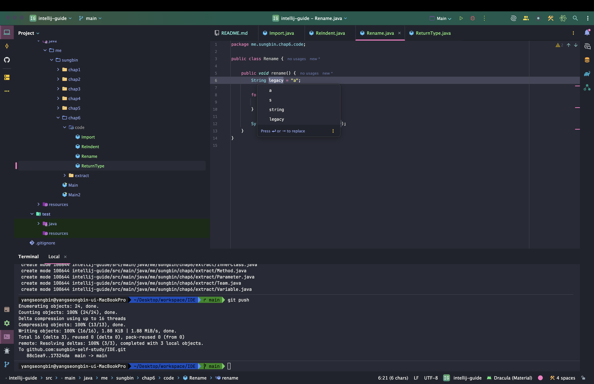
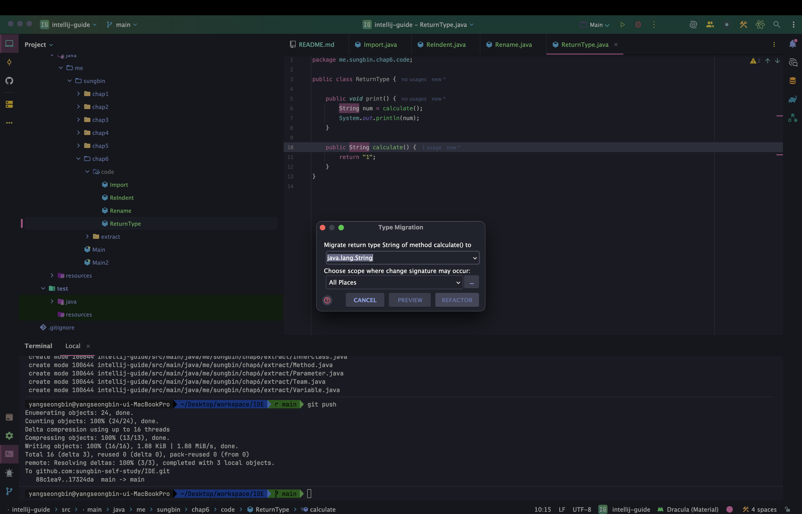
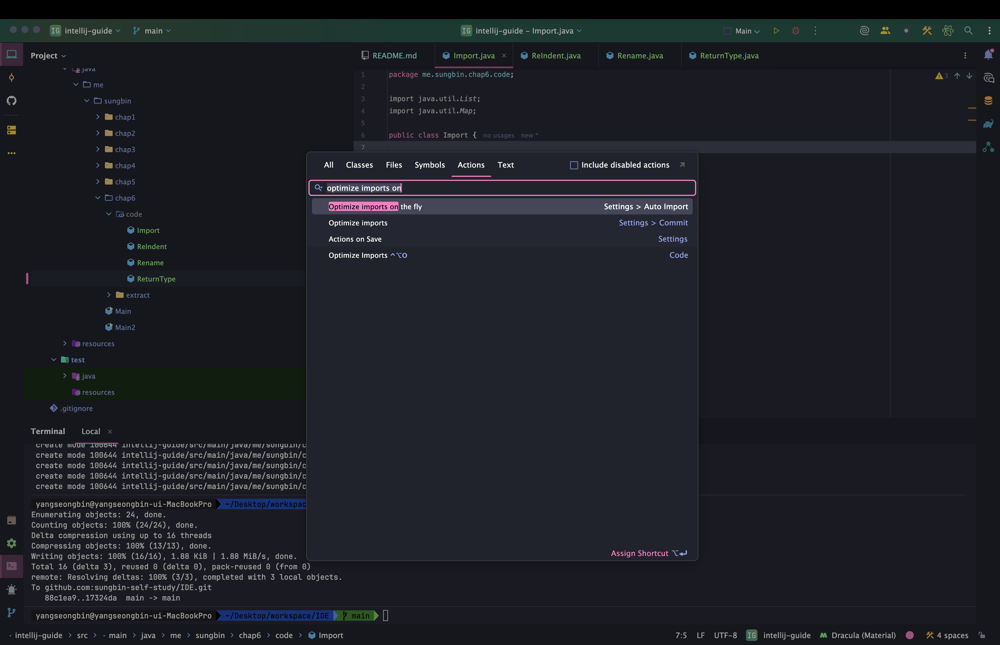
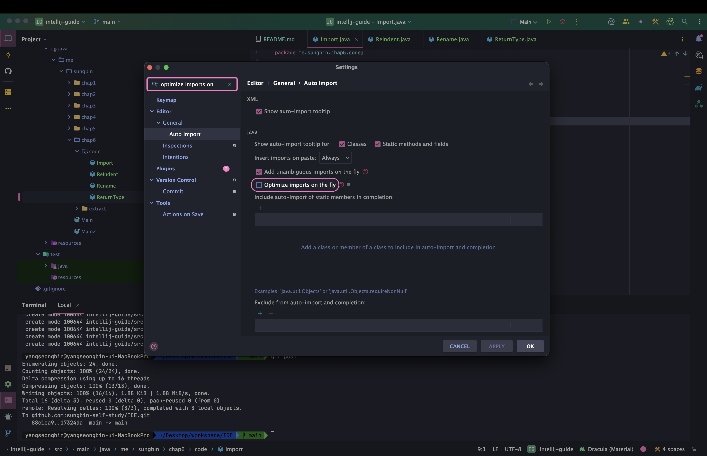

> 해당 포스팅은 인프런의 [IntelliJ를 시작하시는 분들을 위한 IntelliJ 가이드](https://inf.run/doaZn) 강의를 참조하여 작성한 글입니다.

## 리팩토링 - Extract

우리가 코드를 작성하다보면 리팩토링 과정에서 중복된 것을 하나의 변수 혹은 메서드등으로 추출하곤 한다. 이것을 인텔리제이에서는 단축키로 제공한다.

### 변수 추출하기

먼저 변수부터 살펴보도록 하자.

``` java
package me.sungbin.chap6.extract;

public class Variable {

    public void extractVariable() {
        System.out.println(String.format("%d + %d = %d", 1, 2, 1 + 2));
        System.out.println(String.format("%d + %d = %d", 1, 2, 1 + 2));
    }
}
```

위와 같은 코드가 존재한다고 해보자. 지금 딱 봐도 `String.format`이라는 구문이 중복이라는 것을 알 수 있다. 이것을 우리는 변수로 추출해볼 것이다. 만약 단축키 없이 진행을 하려면 해당 구문을 복사해서 변수를 선언하여 대입하고 그 변수를 각각 `println` 구문에 적어줘야 할 것이다. 하지만 이것은 매우 번거로운 작업이다. 이를 위해 인텔리제이에서 단축키를 제공한다. 추출할 구문을 선택 후, 맥 기준 `command + option + v`를 입력하면 변수로 추출이 된다. 여기서 2가지 선택을 할 수 있는데 선택한 구문 하나만 변경할 것인지 전체 변경을 할 것인지 고를 수 있다.



진행을 하면 아래와 같이 리팩토링을 할 수 있을 것이다.

``` java
package me.sungbin.chap6.extract;

public class Variable {

    public void extractVariable() {
        String message = String.format("%d + %d = %d", 1, 2, 1 + 2);
        
        System.out.println(message);
        System.out.println(message);
    }
}
```

### 파라미터 추출하기

아래와 같은 코드가 존재한다고 해보자.

``` java
package me.sungbin.chap6.extract;

public class Parameter {

    public void extractParameter() {
        System.out.println(10);
        System.out.println(10);
    }
}
```

지금 10이라는 숫자가 공통적으로 들어가져 있음을 알 수 있고 리팩토링 포인트가 바로 보이는 것을 알 수 있다. 해당 10을 선택 후 맥 기준 `command + option + p`를 입력하면 파라미터로 추출을 할 수 있다.



파라미터 추출도 선택한 부분만 추출을 할 지 혹은 전체 추출을 할지를 선택할 수 있다. 이렇게 추출을 하여 리팩토링을 거치면 아래와 같이 리팩토링이 가능할 것이다.

``` java
package me.sungbin.chap6.extract;

public class Parameter {

    public void extractParameter(int num) {
        System.out.println(num);
        System.out.println(num);
    }
}
```

### 메서드 추출하기

이제 메서드 추출을 해보자. 아래의 코드가 있다고 해보자.

``` java
package me.sungbin.chap6.extract;

import java.util.List;

public class Method {

    public void extractMethod(List<Book> books) {
        for (Book book : books) {
            for (String s : book.getAuthors()) {
                if ("robert".equals(s)) {
                    System.out.println("담당자가 맞습니다.");
                }
            }
        }
    }

    public static class Book {
        private String title;
        private long price;
        private List<String> authors;

        public String getTitle() {
            return title;
        }

        public long getPrice() {
            return price;
        }

        public List<String> getAuthors() {
            return authors;
        }
    }
}
```

우리가 클린코드 원칙을 보면 하나의 메서드에는 하나의 책임만이 존재해야 한다. 하지만 지금 `extractMethod`는 여러 책임이 존재한다. 먼저 출력하는 기능부터 추출을 해보자. 추출하고 싶은 영역을 선택 후, 맥 기준 `command + option + m`을 입력하면 메서드가 추출됨을 알 수 있다.

> 아쉽게도 접근제어자도 선택하면 좋겠지만 어느순간부터 접근제어자는 `private`으로 고정이 되어 있다. 이 부분은 참고 바란다.



이렇게 리팩토링을 거치면 바로 아래와 같은 코드로 리팩토링이 가능하다.

``` java
package me.sungbin.chap6.extract;

import java.util.List;

public class Method {

    public void extractMethod(List<Book> books) {
        for (Book book : books) {
            getAuthor(book);
        }
    }

    private static void getAuthor(Book book) {
        for (String s : book.getAuthors()) {
            print(s);
        }
    }

    private static void print(String s) {
        if ("robert".equals(s)) {
            System.out.println("담당자가 맞습니다.");
        }
    }

    public static class Book {
        private String title;
        private long price;
        private List<String> authors;

        public String getTitle() {
            return title;
        }

        public long getPrice() {
            return price;
        }

        public List<String> getAuthors() {
            return authors;
        }
    }
}
```

### 이너 클래스 추출하기

아래와 같은 이너 클래스가 존재한다고 해보자.

``` java
package me.sungbin.chap6.extract;

public class InnerClass {

    public void moveInnerClass() {
        Team team = new Team("개발팀", "develop");
        System.out.println(team.getCode());
    }

    public static class Team {
        private String name;
        private String code;

        public Team(String name, String code) {
            this.name = name;
            this.code = code;
        }

        public String getName() {
            return name;
        }

        public String getCode() {
            return code;
        }
    }
}
```

해당 코드를 작성할 때는 `Team`이라는 이너 클래스가 해당 클래스에만 쓰여서 이너 클래스로 만들어두었지만 리팩토링을 하고자 하니 여러 군데에서 사용하는 것을 볼 수 있다. 이때 우리는 단축키가 없이 진행하려면 새로운 클래스를 만들고 내용을 복붙을 해야 할 것이다. 하지만 단축키를 이용하면 해당 번거로운 작업을 안 해도 된다. 맥 기준 `F6`을 누르면 아래와 같은 팝업이 나온다.



여기서 물어보는 것은 아예 다른 클래스로 뺄 것인지 혹은 다른 클래스의 이너 클래스로 둘지를 물어보는 것이다. 우리는 일단 다른 클래스로 빼보기 위해 첫번째 옵션을 선택해보자. 그러면 아래와 같이 또 물어 볼 것이다.



클래스 명을 어떤 걸로 할지와 패키지는 어디로 옮길지 물어본다. 그것을 선택해주면 자동으로 코드가 반영되어서 리팩토링이 됨을 알 수 있다.

### 정리

- 변수 추출하기
  - 맥: `command + option + v`
  - 윈도우/리눅스: `Ctrl + Alt + v`
- 파라미터 추출하기
  - 맥: `command + option + p`
  - 윈도우/리눅스: `Ctrl + Alt + p`
- 메서드 추출하기
  - 맥: `command + option + m`
  - 윈도우/리눅스: `Ctrl + Alt + m`
- 이너클래스 추출하기
  - 맥: `F6`
  - 윈도우/리눅스: `F6`

## 리팩토링 기타

### 이름 일괄 변경하기

아래의 코드가 존재한다고 해보자.

``` java
package me.sungbin.chap6.code;

public class Rename {

    public void rename() {
        String legacy = "a";

        for (int i = 0; i < 10; i++) {
            System.out.println(legacy);
        }

        System.out.println("변수값: " + legacy);
    }
}
```

여기에 변수이름이 `legacy`라고 되어 있는데 코드리뷰로 뭔가 해당 변수 명을 더 명확한 이름으로 변경해야 한다고 해보자. 그럴 때 우리는 손수 직접 변경하게 할 수 있지만 단축키로 시간 절약을 할 수 있다. 맥 기준 `shift + f6`을 누르면 해당 변수의 이름을 일괄 변경이 가능하다.



### 타입 일괄 변경하기

아래의 코드가 있다고 해보자.

``` java
package me.sungbin.chap6.code;

public class ReturnType {

    public void print() {
        String num = calculate();
        System.out.println(num);
    }

    public String calculate() {
        return "1";
    }
}
```

`calculate`라는 메서드의 타입이 문자열인데 이것을 정수형으로 변경해야 한다고 해보자. 하지만 해당 `calculate` 메서드는 다른 모듈에서도 쓰고 있다고 해보자. 그러면 손수 변경하기 매우 힘들 것이다. 그럴 때 메서드 시그니쳐 타입에 포커스를 두고 맥 기준 `command + shift + f6`을 하면 아래와 같은 화면이 나올 것이다.



여기서 원하는 타입을 입력 후 적용을 해주면 변경이 된다. 단, 해당 메서드의 반환 값은 변경이 안되서 그것은 수동으로 변경을 해줘야 한다.

### Import 정리하기

아래와 같이 사용되지 않는 import문이 있다고 해보자.

``` java
package me.sungbin.chap6.code;

import java.util.List;
import java.util.Map;

public class Import {

}
```

사용되지 않는 import문을 한번에 지우려면 맥 기준 `command + option + o`를 누르면 자동 반영이 된다. 하지만 이 단축키도 매번 할때만다 눌러주는게 불편하다. 그럴 때 자동으로 없애주는 기능이 존재한다. Action 검색을 진행 후, 아래와 같이 `optimize imports on`이라고 입력 후 아래와 같이 선택을 하면 해당 세팅 창으로 넘어간다.



이후, `optimize imports on the fly`의 체크박스를 체크해주면 자동으로 사용되지 않는 import문은 IDE에서 제거해준다.



### 코드 자동 정렬하기

아래처럼 정렬되지 않는 코드가 있다고 해보자.

``` java
package me.sungbin.chap6.code;

public class ReIndent {
    public void rename() {
        String legacy = "a";for (int i = 0; i < 10; i++) {System.out.println(legacy);} System.out.println("한번더: "+legacy);
    }
}
```

해당 코드는 가독성이 떨어져서 정렬을 해줘야 하는데 손수 하기 쉽지 않다. 그래서 인텔리제이에서 단축키를 제공해주는데 맥 기준 `command + option + l`을 입력하면 자동 정렬을 해준다.

### 정리

- 이름 일괄 변경하기
  - 맥: `shift + F6`
  - 윈도우/리눅스: `shift + F6`
- 타입 일괄 변경하기
  - 맥: `command + shift + F6`
  - 윈도우/리눅스: `Ctrl + shift + F6`
- Import 정리하기
  - 맥: `command + option + o`
  - 윈도우/리눅스: `Ctrl + Alt + o`
- 코드 자동 정렬
  - 맥: `command + option + l`
  - 윈도우/리눅스: `Ctrl + Alt + l`