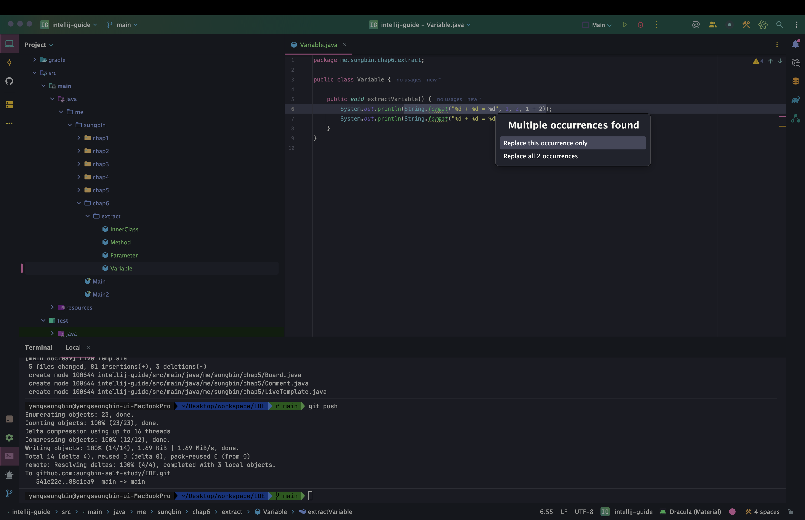
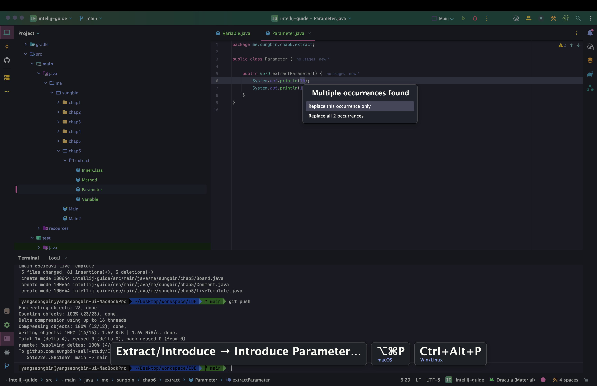
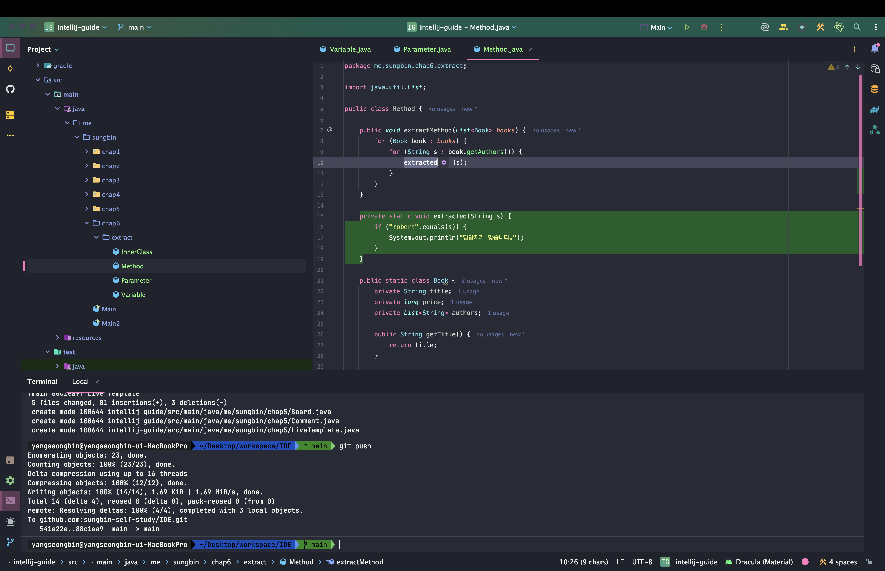
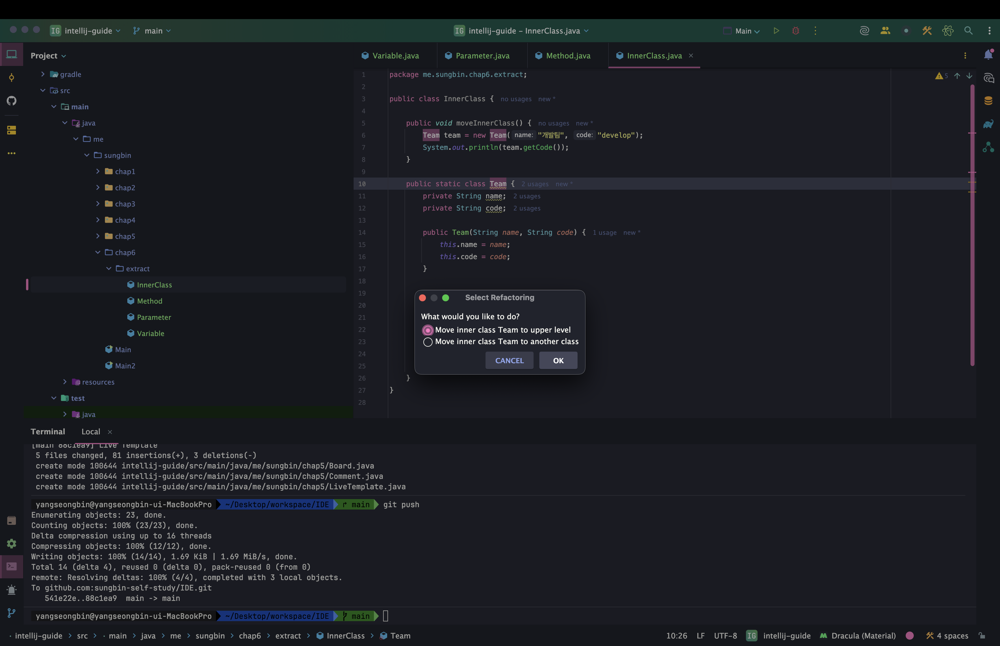
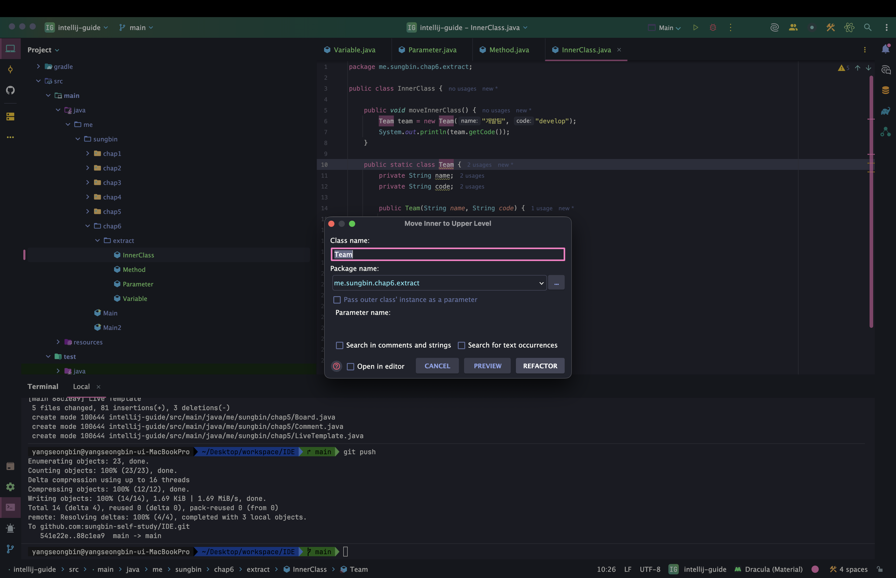
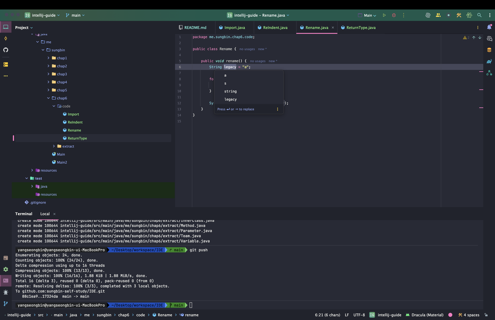
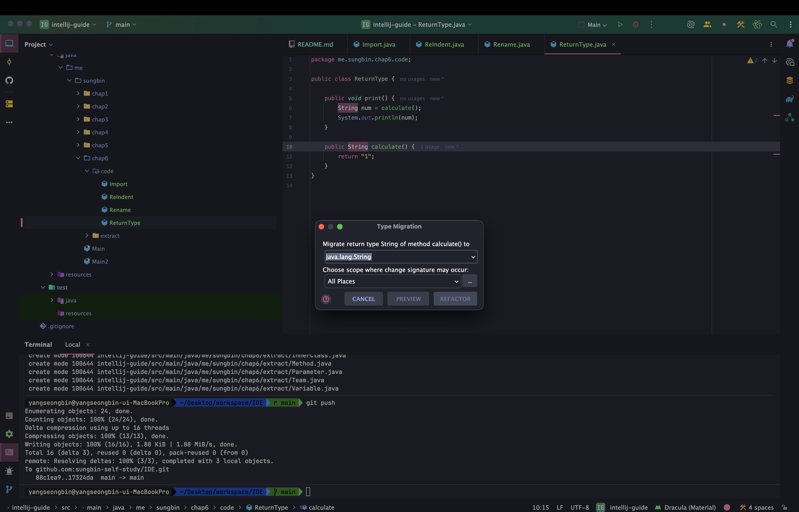
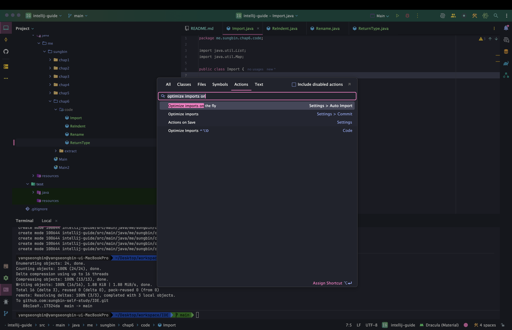
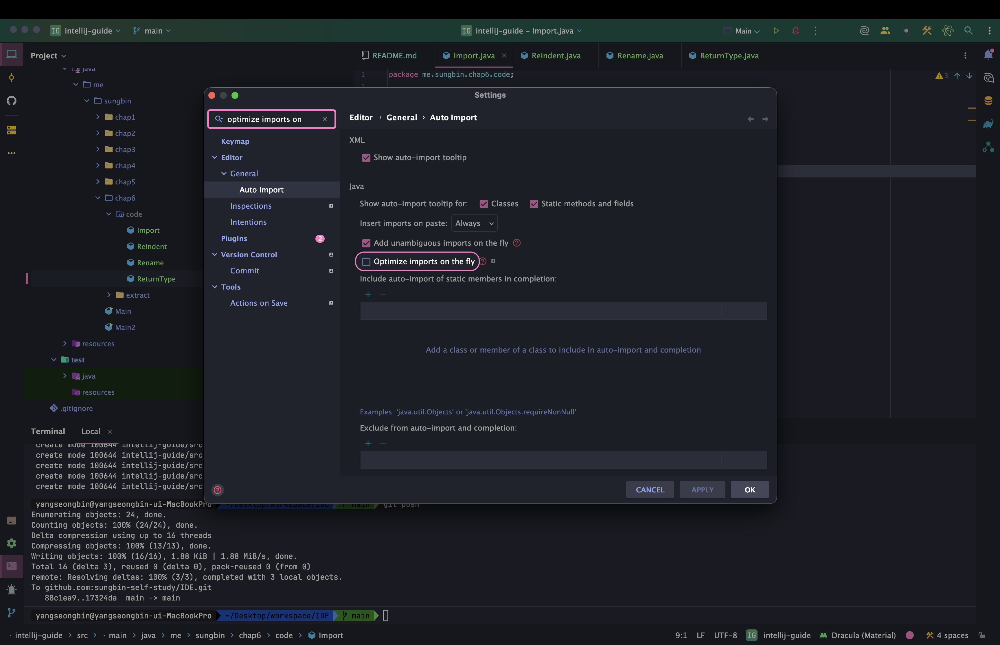

> 해당 포스팅은 인프런의 [IntelliJ를 시작하시는 분들을 위한 IntelliJ 가이드](https://inf.run/doaZn) 강의를 참조하여 작성한 글입니다.

## 들어가며

지난 편에서 "새 코드를 덜 치고 만드는 방법"을 다뤘다면, 이번 편은 **"이미 만든 코드의 구조를 안전하게 바꾸는 방법"** 이다.

리팩토링의 정의부터 짚고 가자. **리팩토링은 외부 동작을 바꾸지 않으면서 내부 구조를 개선하는 것**이다. 즉 프로그램이 하는 일은 그대로인데, 코드가 더 읽기 좋고 고치기 쉬워지는 작업을 말한다.

그런데 여기서 중요한 지점이 있다. 리팩토링은 "동작이 바뀌지 않아야 한다"는 전제가 붙기 때문에, **손으로 하면 위험하다.** 변수 이름 하나 바꾸는 것도 열 군데 중 아홉 군데만 바꾸면 그 순간 버그가 된다.

사실 이 시리즈에서 필자는 같은 이야기를 계속 미뤄왔다.

- 포커스 편에서: "멀티 커서로 이름을 바꾸지 말자. 리팩토링 Rename을 쓰자"
- 검색 편에서: "변수명·클래스명을 전체 교체로 바꾸면 안 된다. 그건 리팩토링의 영역이다"

그 답이 바로 이번 편이다. IDE의 리팩토링 기능은 **텍스트를 바꾸는 것이 아니라 코드의 의미를 이해하고 바꾼다.** 그래서 문자열 안의 같은 단어는 건드리지 않고, 다른 파일에 있는 참조는 빠짐없이 찾아서
바꿔준다. 강사님의 표현을 빌리면 이렇다.

> "즉, 우리가 실수할 여지 없이 모든 코드들을 변경할 수 있게 된다는 거죠."

### 단축키를 모르겠다면: Refactor This

본격적으로 들어가기 전에 하나만 먼저 알려주고 싶은 것이 있다. 이번 편에는 단축키가 정말 많이 나오는데, **전부 외울 필요가 없다.** 리팩토링 기능을 한곳에 모아놓은 메뉴가 있기 때문이다.

- **맥**: `Ctrl + t`
- **윈도우/리눅스**: `Ctrl + Alt + Shift + t`

리팩토링하고 싶은 코드에 커서를 두고 이 단축키를 누르면 **지금 이 자리에서 할 수 있는 리팩토링 목록**이 전부 나온다. 그리고 각 항목 옆에 단축키까지 같이 표시되기 때문에, 쓰면서 자연스럽게 익히게 된다.

강사님도 비슷한 조언을 남긴다.

> "즉 이게 뭐냐, 단축키가 잘 모르겠다. 그러면은 내가 뽑고 싶은 게 베리어블인지 파라미터인지 혹은 필드인지 혹은 메소드인지 등등의 이름으로 찾으시면 된다는 거예요."

즉 **`Ctrl + t` 하나만 기억하면 나머지는 몰라도 된다.** 이 점을 염두에 두고 편하게 읽어나가자.

## 리팩토링 - Extract

우리가 코드를 작성하다보면 리팩토링 과정에서 중복된 것을 하나의 변수 혹은 메서드등으로 추출하곤 한다. 이것을 인텔리제이에서는 단축키로 제공한다.

강사님은 이 기능을 이렇게 정의한다.

> "익스트랙트는 말 그대로 추출하는 기능이구요. 지정한 코드를 별도의 메소드나 파라미터, 변수 등등으로 뽑아내는 기능을 얘기합니다."

그리고 이 절의 단축키들에는 **아주 깔끔한 규칙**이 하나 있다.

> **`command/Ctrl` + `option/alt` + `추출할 대상의 첫 글자`**

| 추출 대상                | 첫 글자 | 맥                     | 윈도우/리눅스    |
|--------------------------|---------|------------------------|------------------|
| **V**ariable (변수)      | v       | `command + option + v` | `Ctrl + Alt + v` |
| **P**arameter (파라미터) | p       | `command + option + p` | `Ctrl + Alt + p` |
| **M**ethod (메서드)      | m       | `command + option + m` | `Ctrl + Alt + m` |
| **F**ield (필드)         | f       | `command + option + f` | `Ctrl + Alt + f` |
| **C**onstant (상수)      | c       | `command + option + c` | `Ctrl + Alt + c` |

이 규칙만 알면 다섯 개를 따로 외울 필요가 없다.

### 변수 추출하기

먼저 변수부터 살펴보도록 하자.

``` java
package me.sungbin.chap6.extract;

public class Variable {

    public void extractVariable() {
        System.out.println(String.format("%d + %d = %d", 1, 2, 1 + 2));
        System.out.println(String.format("%d + %d = %d", 1, 2, 1 + 2));
    }
}
```

위와 같은 코드가 존재한다고 해보자. 지금 딱 봐도 `String.format`이라는 구문이 중복이라는 것을 알 수 있다. 이것을 우리는 변수로 추출해볼 것이다. 만약 단축키 없이 진행을 하려면 해당 구문을 복사해서
변수를 선언하여 대입하고 그 변수를 각각 `println` 구문에 적어줘야 할 것이다. 하지만 이것은 매우 번거로운 작업이다. 이를 위해 인텔리제이에서 단축키를 제공한다. 추출할 구문을 선택 후, 맥 기준
`command + option + v`(윈도우/리눅스 `Ctrl + Alt + v`)를 입력하면 변수로 추출이 된다. 여기서 2가지 선택을 할 수 있는데 선택한 구문 하나만 변경할 것인지 전체 변경을 할 것인지
고를 수 있다.



진행을 하면 아래와 같이 리팩토링을 할 수 있을 것이다.

``` java
package me.sungbin.chap6.extract;

public class Variable {

    public void extractVariable() {
        String message = String.format("%d + %d = %d", 1, 2, 1 + 2);
        
        System.out.println(message);
        System.out.println(message);
    }
}
```

여기서 **Replace All / Replace This** 선택지가 왜 중요한지 강사님이 잘 설명해준다.

> "이렇게 해서 우리가 하나 하는데, 만약에 이게 이렇게 단순히 두 줄의 코드가 아니라 50줄, 100줄짜리 메소드 안에서 같은 값을 변수로 뽑아낸다고 생각해보면 되게 아찔해요."

정확히 그렇다. 예제는 두 줄이라 손으로 해도 될 것 같지만, 실무 코드에서는 같은 표현식이 메서드 전역에 흩어져 있다. 이때 **Replace All을 고르면 IntelliJ가 그 표현식을 전부 찾아서 한 번에
변수로 치환**해준다. 눈으로 찾아 헤맬 필요가 없다.

> **[팁] 선택하지 않고도 추출할 수 있다**
>
> 사실 추출할 영역을 마우스로 정확히 드래그하지 않아도 된다. 표현식 안 어딘가에 커서만 두고 단축키를 누르면 **"어느 범위를 추출할지" 후보 목록**이 뜬다. 위 예제라면 `1 + 2` /
> `String.format(...)` / `System.out.println(...)` 중에 고를 수 있다.
>
> 그리고 포커스 편에서 배운 **범위 확장 (`option + ↑`)** 으로 먼저 정확한 범위를 잡고 추출 단축키를 누르는 것도 좋은 조합이다.
>
> 변수 이름도 IntelliJ가 문맥을 보고 몇 가지 제안해준다. `↓` 키를 눌러 제안된 이름 중에 고르면 된다.

### 파라미터 추출하기

아래와 같은 코드가 존재한다고 해보자.

``` java
package me.sungbin.chap6.extract;

public class Parameter {

    public void extractParameter() {
        System.out.println(10);
        System.out.println(10);
    }
}
```

지금 10이라는 숫자가 공통적으로 들어가져 있음을 알 수 있고 리팩토링 포인트가 바로 보이는 것을 알 수 있다. 해당 10을 선택 후 맥 기준 `command + option + p`(윈도우/리눅스
`Ctrl + Alt + p`)를 입력하면 파라미터로 추출을 할 수 있다.



파라미터 추출도 선택한 부분만 추출을 할 지 혹은 전체 추출을 할지를 선택할 수 있다. 이렇게 추출을 하여 리팩토링을 거치면 아래와 같이 리팩토링이 가능할 것이다.

``` java
package me.sungbin.chap6.extract;

public class Parameter {

    public void extractParameter(int num) {
        System.out.println(num);
        System.out.println(num);
    }
}
```

여기서 하드코딩된 값 (매직 넘버)을 파라미터로 빼면, 이 메서드는 **10이라는 특정 값에만 쓸 수 있는 메서드에서 어떤 숫자에도 쓸 수 있는 메서드로** 바뀐다. 재사용성이 생기는 것이다.

> **[중요] Delegate via Overloading 옵션**
>
> 파라미터 추출 팝업에는 원글에서 다루지 않은 유용한 옵션이 하나 있다. 바로 **`Delegate via overloading method`** 다.
>
> 이걸 체크하면 어떻게 되냐면, **기존 메서드를 그대로 남겨둔 채** 파라미터를 받는 새 메서드를 만들고, 기존 메서드가 새 메서드를 호출하도록 연결해준다.
>
> ``` java
> // 체크했을 때의 결과
> public void extractParameter() {
>     extractParameter(10);        // 기존 시그니처 유지 → 기존 호출부는 그대로 동작
> }
>
> public void extractParameter(int num) {
>     System.out.println(num);
>     System.out.println(num);
> }
> ```
>
> 이게 왜 중요하냐면, **이미 다른 곳에서 이 메서드를 호출하고 있을 때** 시그니처를 바꿔버리면 그 호출부가 전부 깨지기 때문이다. 특히 라이브러리를 만들거나 다른 팀이 쓰는 공용 코드를 다룰 때는 이 옵션이
> 사실상 필수다.

### 메서드 추출하기

이제 메서드 추출을 해보자. 아래의 코드가 있다고 해보자.

``` java
package me.sungbin.chap6.extract;

import java.util.List;

public class Method {

    public void extractMethod(List<Book> books) {
        for (Book book : books) {
            for (String s : book.getAuthors()) {
                if ("robert".equals(s)) {
                    System.out.println("담당자가 맞습니다.");
                }
            }
        }
    }

    public static class Book {
        private String title;
        private long price;
        private List<String> authors;

        public String getTitle() {
            return title;
        }

        public long getPrice() {
            return price;
        }

        public List<String> getAuthors() {
            return authors;
        }
    }
}
```

우리가 클린코드 원칙을 보면 하나의 메서드에는 하나의 책임만이 존재해야 한다. 하지만 지금 `extractMethod`는 여러 책임이 존재한다. 먼저 출력하는 기능부터 추출을 해보자. 추출하고 싶은 영역을 선택 후,
맥 기준 `command + option + m`(윈도우/리눅스 `Ctrl + Alt + m`)을 입력하면 메서드가 추출됨을 알 수 있다.

강사님도 이 지점을 이렇게 설명한다.

> "하나의 메소드가 하나의 기능을 가진다고 얘기를 해요. 그러면 이 코드를 한번 리팩토링 해보고 싶으면, 하나의 메소드가 하나의 기능만 하도록 뽑아내야 되잖아요."



> **접근제어자가 private으로 고정된 것처럼 보인다면**
>
> 최근 버전의 IntelliJ는 메서드 추출을 **인라인 방식**으로 처리한다. 즉 별도 창이 뜨지 않고 에디터 안에서 바로 이름만 입력하는 형태다. 그래서 접근제어자를 고를 수 없는 것처럼 보이고, 기본값인
> `private`으로 만들어진다.
>
> 하지만 방법이 있다. `Settings` → `Editor` → `Code Editing` → `Refactorings` 항목에서 **`In modal dialogs`** 를 선택하면 예전처럼 다이얼로그가 뜨고,
> 여기서 **Visibility (private / package-private / protected / public)** 를 직접 고를 수 있다.
>
> 물론 매번 다이얼로그를 띄우는 게 번거로울 수도 있다. 그럴 때는 그냥 인라인으로 추출한 뒤, 만들어진 메서드 이름에 커서를 두고 `Ctrl + t`(Refactor This)에서 **Change
Signature**로 접근제어자만 바꿔도 된다.
>
> 참고로 실무 관점에서는 **추출한 메서드가 `private`인 것이 오히려 자연스러운 경우가 많다.** 클래스 내부의 구현 세부사항을 쪼갠 것이니 외부에 노출할 이유가 없기 때문이다.

이렇게 리팩토링을 거치면 바로 아래와 같은 코드로 리팩토링이 가능하다.

``` java
package me.sungbin.chap6.extract;

import java.util.List;

public class Method {

    public void extractMethod(List<Book> books) {
        for (Book book : books) {
            getAuthor(book);
        }
    }

    private static void getAuthor(Book book) {
        for (String s : book.getAuthors()) {
            print(s);
        }
    }

    private static void print(String s) {
        if ("robert".equals(s)) {
            System.out.println("담당자가 맞습니다.");
        }
    }

    public static class Book {
        private String title;
        private long price;
        private List<String> authors;

        public String getTitle() {
            return title;
        }

        public long getPrice() {
            return price;
        }

        public List<String> getAuthors() {
            return authors;
        }
    }
}
```

> **메서드 추출이 똑똑한 이유**
>
> 이 기능은 단순히 코드를 잘라내서 옮기는 게 아니다. IntelliJ가 아래 것들을 알아서 판단해준다.
>
> - **필요한 파라미터를 자동으로 계산한다.** 추출한 코드가 바깥의 어떤 변수를 쓰고 있는지 분석해서 파라미터로 만들어준다. (위 예제의 `Book book`, `String s`가 그렇게 만들어졌다)
> - **반환 타입을 자동으로 결정한다.** 추출한 코드가 만들어낸 값을 바깥에서 쓰고 있다면 그것을 반환값으로 잡아준다.
> - **`static` 여부를 판단한다.** 인스턴스 필드를 안 쓴다면 `static`으로 만들어준다.
> - **같은 코드가 다른 곳에도 있으면 알려준다.** "이것과 똑같은 코드가 N군데 더 있는데 같이 바꿀까요?"라고 물어보고, 승낙하면 그곳들도 전부 새 메서드 호출로 바꿔준다. 중복 제거에 아주 강력하다.

### [추가] 필드 추출하기와 상수 추출하기

강의에는 없지만 같은 계열로 자주 쓰는 두 가지가 더 있다.

**필드 추출 (`command + option + f` / `Ctrl + Alt + f`)**

지역 변수를 클래스의 필드로 승격시킨다. 여러 메서드에서 공유해야 하는 값이 생겼을 때 쓴다.

**상수 추출 (`command + option + c` / `Ctrl + Alt + c`)**

값을 `private static final` 상수로 뽑아낸다. 코드 안에 흩어진 **매직 넘버나 매직 스트링을 정리할 때** 특히 유용하다.

``` java
// 이런 코드가 있을 때 "robert"에 커서를 두고 command + option + c
if ("robert".equals(s)) { ... }

// 이렇게 바뀐다
private static final String MANAGER_NAME = "robert";

if (MANAGER_NAME.equals(s)) { ... }
```

코드 리뷰에서 "매직 넘버를 상수로 빼주세요"라는 지적을 받았을 때, 이 단축키 하나면 끝난다.

### 이너 클래스 추출하기

아래와 같은 이너 클래스가 존재한다고 해보자.

``` java
package me.sungbin.chap6.extract;

public class InnerClass {

    public void moveInnerClass() {
        Team team = new Team("개발팀", "develop");
        System.out.println(team.getCode());
    }

    public static class Team {
        private String name;
        private String code;

        public Team(String name, String code) {
            this.name = name;
            this.code = code;
        }

        public String getName() {
            return name;
        }

        public String getCode() {
            return code;
        }
    }
}
```

해당 코드를 작성할 때는 `Team`이라는 이너 클래스가 해당 클래스에만 쓰여서 이너 클래스로 만들어두었지만 리팩토링을 하고자 하니 여러 군데에서 사용하는 것을 볼 수 있다. 이때 우리는 단축키가 없이 진행하려면
새로운 클래스를 만들고 내용을 복붙을 해야 할 것이다. 하지만 단축키를 이용하면 해당 번거로운 작업을 안 해도 된다. 맥/윈도우/리눅스 공통으로 `F6`을 누르면 아래와 같은 팝업이 나온다.



여기서 물어보는 것은 아예 다른 클래스로 뺄 것인지 혹은 다른 클래스의 이너 클래스로 둘지를 물어보는 것이다. 우리는 일단 다른 클래스로 빼보기 위해 첫번째 옵션을 선택해보자. 그러면 아래와 같이 또 물어 볼
것이다.



클래스 명을 어떤 걸로 할지와 패키지는 어디로 옮길지 물어본다. 그것을 선택해주면 자동으로 코드가 반영되어서 리팩토링이 됨을 알 수 있다.

이 기능의 정식 이름은 **Move**이며, 이너 클래스뿐 아니라 아래 것들에도 전부 통한다.

- **클래스를 다른 패키지로** 옮기기
- **메서드나 필드를 다른 클래스로** 옮기기
- **파일이나 디렉토리 자체를** 옮기기 (Project 창에서 `F6`)

그리고 중요한 것은 **옮긴 뒤에 참조가 전부 자동으로 갱신된다**는 점이다. 다른 파일에 있던 import 문도 알아서 추가되고, 패키지 선언도 바뀐다. 파일 탐색기에서 드래그해서 옮기면 이런 처리가 전혀 안
되므로, 클래스 이동은 반드시 IDE 안에서 하자.

> **[추가] 복사는 `F5`**
>
> `F6`이 이동이라면 `F5`는 **Copy**다. 기존 클래스를 남겨둔 채 이름만 다른 복사본을 만들 때 쓴다. 비슷한 구조의 클래스를 하나 더 만들어야 할 때 유용하다.

### [추가] Extract의 반대, Inline

지금까지는 "뽑아내는" 이야기였는데, 반대로 **"도로 집어넣는"** 기능도 있다.

- **맥**: `command + option + n`
- **윈도우/리눅스**: `Ctrl + Alt + n`

예를 들어 변수를 하나 만들어뒀는데 결국 한 번밖에 안 쓰여서 굳이 변수로 둘 필요가 없어졌다면, 그 변수에 커서를 두고 Inline을 누르면 사용처에 값이 직접 들어가고 변수 선언은 사라진다.

``` java
// Inline 전
String message = String.format("%d + %d = %d", 1, 2, 1 + 2);
System.out.println(message);

// Inline 후
System.out.println(String.format("%d + %d = %d", 1, 2, 1 + 2));
```

메서드에도 쓸 수 있다. 남이 만든 코드를 읽을 때 **"이 메서드가 뭘 하는지 펼쳐서 보고 싶다"** 싶을 때 Inline으로 펼쳐본 뒤 `command + z`로 되돌리는 식으로도 활용할 수 있다.

### 정리

- 변수 추출하기
    - 맥: `command + option + v`
    - 윈도우/리눅스: `Ctrl + Alt + v`
- 파라미터 추출하기
    - 맥: `command + option + p`
    - 윈도우/리눅스: `Ctrl + Alt + p`
- 메서드 추출하기
    - 맥: `command + option + m`
    - 윈도우/리눅스: `Ctrl + Alt + m`
- 필드 추출하기
    - 맥: `command + option + f`
    - 윈도우/리눅스: `Ctrl + Alt + f`
- 상수 추출하기
    - 맥: `command + option + c`
    - 윈도우/리눅스: `Ctrl + Alt + c`
- 이너클래스 추출하기 (Move)
    - 맥/윈도우/리눅스: `F6`
- 복사하기 (Copy)
    - 맥/윈도우/리눅스: `F5`
- 인라인 (추출의 반대)
    - 맥: `command + option + n`
    - 윈도우/리눅스: `Ctrl + Alt + n`

## 리팩토링 기타

강사님은 이 절을 이렇게 소개한다.

> "기타 기능들은 앞에 했었던 Extract, 즉 추출 기능을 제외한 나머지 리팩토링에 도움이 되는 기능들을 모아놓은 것이구요."

### 이름 일괄 변경하기

아래의 코드가 존재한다고 해보자.

``` java
package me.sungbin.chap6.code;

public class Rename {

    public void rename() {
        String legacy = "a";

        for (int i = 0; i < 10; i++) {
            System.out.println(legacy);
        }

        System.out.println("변수값: " + legacy);
    }
}
```

여기에 변수이름이 `legacy`라고 되어 있는데 코드리뷰로 뭔가 해당 변수 명을 더 명확한 이름으로 변경해야 한다고 해보자. 그럴 때 우리는 손수 직접 변경하게 할 수 있지만 단축키로 시간 절약을 할 수 있다.
맥/윈도우/리눅스 공통으로 `shift + F6`을 누르면 해당 변수의 이름을 일괄 변경이 가능하다.



여기서 강사님이 특히 강조하는 부분이 있다.

> "이 기능은 변수명에서만 통하는 건 아니고요. 클래스나 메소드 혹은 필드, 파라미터 모두에게 통하기 때문에, 어디서든지 내가 사용하고 있는 이 이름을 일괄적으로 변경하고 싶다고 하면 Shift F6번을 사용하시면
> 됩니다."

정리하면 `shift + F6`은 아래 모든 것에 통한다.

| 대상                | 동작                                                             |
|---------------------|------------------------------------------------------------------|
| **변수 / 파라미터** | 해당 스코프 안의 모든 사용처                                     |
| **필드**            | 프로젝트 전체의 사용처 + getter/setter 이름도 함께 바꿀지 물어봄 |
| **메서드**          | 프로젝트 전체의 호출부. **오버라이드한 자식 클래스까지**         |
| **클래스**          | 모든 참조 + **파일명까지** 함께 변경                             |
| **패키지**          | 하위 모든 파일의 package 선언과 import 문                        |
| **파일 / 디렉토리** | Project 창에서 선택 후 실행                                      |

이게 바로 이 시리즈에서 계속 "이름 변경은 Rename을 쓰라"고 말해온 이유다. 전체 교체 (`command + shift + r`)와 비교하면 차이가 명확하다.

|                           | 전체 교체          | Rename 리팩토링    |
|---------------------------|--------------------|--------------------|
| 기준                      | **글자가 같은 것** | **의미가 같은 것** |
| 문자열 안의 같은 단어     | 바뀐다 (사고)      | 안 바뀐다          |
| 주석 안의 같은 단어       | 바뀐다             | 옵션으로 선택      |
| 다른 클래스의 동명 메서드 | 바뀐다 (사고)      | 안 바뀐다          |
| 상속 계층의 오버라이드    | 안 바뀐다 (누락)   | 바뀐다             |

> **[팁] 주석과 문자열까지 함께 바꾸고 싶다면**
>
> `shift + F6`을 누른 뒤 곧바로 다시 `shift + F6`을 누르면 상세 다이얼로그가 열린다. 여기서 **`Search in comments and strings`** 를 체크하면 주석과 문자열 안의
> 같은 단어까지 함께 바꿀 수 있다.
>
> 예를 들어 클래스 이름을 `Member`에서 `User`로 바꿀 때, 주석에 적힌 "Member 정보를 조회한다" 같은 문장까지 같이 정리하고 싶다면 이 옵션을 쓰면 된다. 다만 의도치 않은 곳이 바뀔 수 있으니
> **Preview로 먼저 확인**하는 것을 추천한다.

### 타입 일괄 변경하기

아래의 코드가 있다고 해보자.

``` java
package me.sungbin.chap6.code;

public class ReturnType {

    public void print() {
        String num = calculate();
        System.out.println(num);
    }

    public String calculate() {
        return "1";
    }
}
```

`calculate`라는 메서드의 타입이 문자열인데 이것을 정수형으로 변경해야 한다고 해보자. 하지만 해당 `calculate` 메서드는 다른 모듈에서도 쓰고 있다고 해보자. 그러면 손수 변경하기 매우 힘들 것이다.
그럴 때 메서드 시그니쳐 타입에 포커스를 두고 맥 기준 `command + shift + F6`(윈도우/리눅스 `Ctrl + shift + F6`)을 하면 아래와 같은 화면이 나올 것이다.



여기서 원하는 타입을 입력 후 적용을 해주면 변경이 된다. 단, 해당 메서드의 반환 값은 변경이 안되서 그것은 수동으로 변경을 해줘야 한다.

이 기능의 정식 명칭은 **Type Migration**이다. 이름 그대로 "타입을 이주시킨다"는 뜻인데, 핵심은 **이 타입을 받아 쓰는 쪽의 선언까지 연쇄적으로 바꿔준다**는 점이다.

``` java
// Type Migration 실행 후
public void print() {
    int num = calculate();       // ← 받는 쪽 변수 타입도 자동으로 int로 바뀐다
    System.out.println(num);
}

public int calculate() {         // ← 반환 타입 변경
    return "1";                  // ← 여기는 컴파일 에러. 직접 고쳐야 한다
}
```

원글에서 언급한 대로 **메서드 본문 안의 실제 반환 값은 바뀌지 않는다.** 이건 IDE의 한계라기보다는 당연한 일이다. `"1"`이라는 문자열을 `1`로 바꿀지, `Integer.parseInt("1")`로
감쌀지는 **개발자의 의도**에 달린 문제라 IDE가 마음대로 정할 수 없기 때문이다.

그래서 실무에서는 이런 순서로 작업하게 된다.

1. `command + shift + F6`으로 타입을 일괄 변경한다.
2. 컴파일 에러가 나는 곳들을 **`F2`(다음 오류로 이동)** 로 순회하며 고친다.
3. `option + Enter`로 IDE가 제안하는 수정안을 적용한다.

포커스 편에서 배운 `F2` → `option + Enter` 조합이 여기서 그대로 쓰인다.

> **[구분] Change Signature (`command + F6`)와 헷갈리지 말자**
>
> 이름도 비슷하고 단축키도 한 끗 차이라 정말 헷갈리는 기능이 하나 더 있다.
>
> | | Type Migration | Change Signature |
> | --- | --- | --- |
> | 맥 | `command + shift + F6` | `command + F6` |
> | 윈도우/리눅스 | `Ctrl + shift + F6` | `Ctrl + F6` |
> | 하는 일 | **타입 하나**를 다른 타입으로 연쇄 변경 | 메서드 **시그니처 전체**를 편집 |
> | 할 수 있는 것 | 변수·필드·반환 타입의 타입 교체 | 이름·반환타입·**파라미터 추가/삭제/순서 변경**·접근제어자 |
>
> 특히 **Change Signature는 파라미터를 추가할 때 진가를 발휘한다.** 파라미터를 하나 추가하면서 "기존 호출부에는 이 기본값을 넣어줘"라고 지정할 수 있기 때문이다. 그러면 프로젝트 전체의 호출부가
> 자동으로 갱신된다.
>
> 앞에서 다룬 "메서드 접근제어자 바꾸기"도 이 기능으로 하면 된다.

### Import 정리하기

아래와 같이 사용되지 않는 import문이 있다고 해보자.

``` java
package me.sungbin.chap6.code;

import java.util.List;
import java.util.Map;

public class Import {

}
```

사용되지 않는 import문을 한번에 지우려면 맥 기준 `Ctrl + option + o`(윈도우/리눅스 `Ctrl + Alt + o`)를 누르면 자동 반영이 된다.

> **⚠️ 맥 단축키 주의: `command`가 아니라 `Ctrl`이다**
>
> 이 단축키는 맥에서 **`Ctrl + option + o`(⌃⌥O)** 이지 `command + option + o`가 아니다. 헷갈리기 쉬운 이유가 있는데, **`command + option + o`(⌘⌥O)
는 이전 편 (검색)에서 배운 메서드 (심볼) 검색**이기 때문이다.
>
> | 단축키 | 기능 |
> | --- | --- |
> | `command + option + o` (⌘⌥O) | 메서드·심볼 검색 (Go to Symbol) |
> | `Ctrl + option + o` (⌃⌥O) | Import 정리 (Optimize Imports) |
>
> 윈도우/리눅스는 `Ctrl + Alt + o` 하나뿐이라 이런 혼동이 없다. 맥에서 import를 정리하려다 검색창이 뜬다면 `command`를 눌렀기 때문이니 `Ctrl`로 바꿔서 눌러보자.

하지만 이 단축키도 매번 할때마다 눌러주는게 불편하다. 그럴 때 자동으로 없애주는 기능이 존재한다. Action 검색을 진행 후, 아래와 같이 `optimize imports on`이라고 입력 후 아래와 같이 선택을
하면 해당 세팅 창으로 넘어간다.



이후, `optimize imports on the fly`의 체크박스를 체크해주면 자동으로 사용되지 않는 import문은 IDE에서 제거해준다.



이 설정의 정확한 위치는 **`Settings` → `Editor` → `General` → `Auto Import`** 이다. 여기에는 함께 켜두면 좋은 옵션이 하나 더 있다.

- **`Add unambiguous imports on the fly`**: 후보가 하나뿐인 클래스는 **import 문을 자동으로 추가**해준다. `option + Enter`를 눌러 import를 추가하는
  수고를 덜어준다.

강사님도 이 설정의 효용을 이렇게 정리한다.

> "그래서 여러분들이 파일을 열 때 그때그때 사용하지 않는 임포트 문은 자동으로 정리가 되기 때문에, 굳이 단축키 사용하실 필요가 없는 거예요."

> **[팁] 커밋할 때 자동으로 정리하기**
>
> 팀 프로젝트에서는 **커밋 시점에 일괄 정리**하는 방법도 있다. Commit 도구 창의 설정 (톱니바퀴) 버튼을 누르면 `Optimize imports` 체크박스가 있는데, 이걸 켜두면 커밋할 때마다 자동으로
> import가 정리된다.
>
> 불필요한 import 변경이 diff에 섞여 코드 리뷰를 방해하는 일이 줄어든다. 참고로 이 기능은 Git과 Mercurial에서만 지원된다.

### 코드 자동 정렬하기

아래처럼 정렬되지 않는 코드가 있다고 해보자.

``` java
package me.sungbin.chap6.code;

public class ReIndent {
    public void rename() {
        String legacy = "a";for (int i = 0; i < 10; i++) {System.out.println(legacy);} System.out.println("한번더: "+legacy);
    }
}
```

해당 코드는 가독성이 떨어져서 정렬을 해줘야 하는데 손수 하기 쉽지 않다. 그래서 인텔리제이에서 단축키를 제공해주는데 맥 기준 `command + option + l`(윈도우/리눅스 `Ctrl + Alt + l`)을
입력하면 자동 정렬을 해준다.

이 기능의 이름은 **Reformat Code**이며, 알아두면 좋은 점이 몇 가지 있다.

- **선택 영역만 정렬할 수 있다.** 코드를 선택한 상태에서 누르면 그 부분만 정렬된다. 아무것도 선택하지 않으면 파일 전체가 정렬된다.
- **Project 창에서 디렉토리를 선택하고 눌러도 된다.** 그러면 그 아래 모든 파일이 한 번에 정렬된다.
- **정렬 기준은 설정에서 바꿀 수 있다.** `Settings` → `Editor` → `Code Style`에서 들여쓰기 칸 수, 줄바꿈 규칙, 공백 처리 등을 프로젝트에 맞게 조정할 수 있다.

> **[구분] Auto-Indent Lines (`Ctrl + option + i`)**
>
> 비슷하지만 더 가벼운 기능도 있다. 맥은 `Ctrl + option + i`, 윈도우/리눅스는 `Ctrl + Alt + i`다.
>
> - **Reformat Code**: 들여쓰기 + 줄바꿈 + 공백 + 괄호 위치까지 **전면 재정렬**
> - **Auto-Indent Lines**: **들여쓰기만** 맞춰준다
>
> 남의 코드를 건드릴 때 Reformat을 돌리면 diff가 크게 생겨서 코드 리뷰가 어려워질 수 있다. 그럴 때는 Auto-Indent만 쓰거나, 내가 수정한 부분만 선택해서 Reformat하는 편이 낫다.

> **[실무 팁] 팀과 코드 스타일 맞추기**
>
> 각자 IDE 설정이 다르면 같은 파일을 저장할 때마다 포맷이 왔다 갔다 해서 diff가 지저분해진다. 그래서 실무에서는 아래 방법으로 스타일을 통일한다.
>
> - **`.editorconfig`**: 프로젝트 루트에 이 파일을 두면 IntelliJ가 자동으로 인식해서 그 규칙을 따른다. IDE 종류와 무관하게 동작하므로 가장 범용적이다.
> - **Code Style Scheme 공유**: `Settings` → `Editor` → `Code Style`에서 설정을 XML로 내보내 팀원과 공유할 수 있다.
> - **린터 도구**: 자바는 Checkstyle, 코틀린은 ktlint 같은 도구를 빌드에 붙여 강제하기도 한다.

### [추가] 안전하게 삭제하기 - Safe Delete

마지막으로 삭제에 관한 이야기다. 클래스나 메서드를 지울 때 그냥 `Delete`를 누르면, **어딘가에서 그걸 쓰고 있어도 그냥 지워지고** 컴파일 에러로 나중에야 알게 된다.

- **맥**: `command + delete` (Project 창에서)
- **윈도우/리눅스**: `Alt + Delete`

**Safe Delete**를 쓰면 삭제 전에 **"이걸 사용하는 곳이 N군데 있는데 정말 지울까요?"** 라고 알려준다. 사용처가 없으면 조용히 지워지고, 있으면 목록을 보여준다.

특히 **"이 클래스 이제 안 쓰는 것 같은데 지워도 되나?"** 를 확인할 때 유용하다. 실행해보고 "사용처 없음"이 나오면 안심하고 지우면 되고, 목록이 뜨면 취소하면 된다.

### 정리

- 이름 일괄 변경하기
    - 맥: `shift + F6`
    - 윈도우/리눅스: `shift + F6`
- 시그니처 변경하기 (파라미터 추가·삭제 등)
    - 맥: `command + F6`
    - 윈도우/리눅스: `Ctrl + F6`
- 타입 일괄 변경하기
    - 맥: `command + shift + F6`
    - 윈도우/리눅스: `Ctrl + shift + F6`
- Import 정리하기
    - 맥: `Ctrl + option + o`
    - 윈도우/리눅스: `Ctrl + Alt + o`
- 코드 자동 정렬
    - 맥: `command + option + l`
    - 윈도우/리눅스: `Ctrl + Alt + l`
- 들여쓰기만 정렬
    - 맥: `Ctrl + option + i`
    - 윈도우/리눅스: `Ctrl + Alt + i`
- 안전하게 삭제하기
    - 맥: `command + delete`
    - 윈도우/리눅스: `Alt + Delete`

## 리팩토링을 안전하게 하는 법

리팩토링은 "동작이 안 바뀌어야 한다"는 전제가 있는 작업이라, 마지막으로 안전장치 이야기를 하고 마무리하려고 한다.

**1. Preview로 먼저 확인하자**

Rename, Move, Change Signature 같은 리팩토링 다이얼로그에는 대부분 **`Preview` 버튼**이 있다. 이걸 누르면 바로 적용하지 않고 **"어떤 파일의 어떤 줄이 바뀔 예정인지"** 를
하단 도구 창에 목록으로 보여준다.

확인한 뒤 `Do Refactor`를 누르면 그때 적용된다. 범위가 넓은 리팩토링일수록 이 습관이 중요하다.

**2. 되돌리기는 언제나 가능하다**

리팩토링도 `command + z`(윈도우/리눅스 `Ctrl + z`)로 되돌릴 수 있다. **여러 파일이 한꺼번에 바뀌었어도 한 번에 되돌아간다.** 그러니 "잘못되면 어쩌지"라는 걱정 때문에 리팩토링을 주저할
필요는 없다.

**3. 그래도 가장 확실한 것은 테스트와 커밋이다**

IDE의 리팩토링은 매우 정확하지만 만능은 아니다. 리플렉션으로 문자열을 통해 클래스나 메서드를 참조하는 코드, 설정 파일 (`application.yml`)에 문자열로 적힌 클래스명, 프레임워크가 이름 규칙으로
찾아 쓰는 코드 등은 IDE가 알아채지 못할 수 있다.

그래서 규모가 큰 리팩토링을 하기 전에는 이 두 가지를 권한다.

- **깨끗한 상태로 커밋해두기**: 언제든 되돌아갈 지점을 만들어둔다.
- **테스트 코드 돌려보기**: 리팩토링 후 테스트가 통과하면 "동작이 안 바뀌었다"는 것을 확인할 수 있다. 사실 이게 리팩토링의 안전장치로서 테스트 코드가 존재하는 가장 큰 이유이기도 하다.

## 마무리

이번 편에서 다룬 리팩토링을 성격별로 묶어보면 이렇다.

| 하고 싶은 일                       | 기능              | 단축키 (맥)            |
|------------------------------------|-------------------|------------------------|
| 중복되는 표현식을 정리하고 싶다    | 변수 추출         | `command + option + v` |
| 매직 넘버를 없애고 싶다            | 상수 추출         | `command + option + c` |
| 메서드가 너무 길다                 | 메서드 추출       | `command + option + m` |
| 이름이 마음에 안 든다              | Rename            | `shift + F6`           |
| 파라미터를 추가해야 한다           | Change Signature  | `command + F6`         |
| 클래스를 다른 패키지로 옮겨야 한다 | Move              | `F6`                   |
| 이거 지워도 되나 확인하고 싶다     | Safe Delete       | `command + delete`     |
| 코드가 지저분하다                  | Reformat Code     | `command + option + l` |
| **뭘 써야 할지 모르겠다**          | **Refactor This** | **`Ctrl + t`**         |

우선순위를 매겨보자면 아래 네 개를 추천한다.

1. **`shift + F6` (Rename)** — 리팩토링 기능 중 압도적으로 많이 쓴다. 이름 바꿀 때 절대 손으로 하지 말자.
2. **`command + option + v` (변수 추출)** — 코드를 읽기 좋게 만드는 가장 값싼 방법이다.
3. **`command + option + m` (메서드 추출)** — 긴 메서드를 쪼갤 때 필수다.
4. **`Ctrl + t` (Refactor This)** — 나머지를 몰라도 여기서 다 찾을 수 있다.

그리고 이번 편에서 가장 기억했으면 하는 것은 단축키가 아니라 이 원칙이다.

> **코드의 "글자"를 바꾸는 일과 "의미"를 바꾸는 일은 다르다. 후자는 반드시 리팩토링 기능으로 하자.**

다음 편에서는 **디버깅**을 다룬다. 지금까지가 "코드를 쓰고 고치는" 이야기였다면, 다음은 **"코드가 실제로 어떻게 도는지 들여다보는"** 이야기다. `System.out.println`으로 값을 찍어보는
습관에서 벗어나, 브레이크포인트를 걸고 실행 중인 프로그램의 내부를 직접 확인하는 방법을 알아보도록 하겠다.
