> 해당 포스팅은 인프런의 [IntelliJ를 시작하시는 분들을 위한 IntelliJ 가이드](https://inf.run/doaZn) 강의를 참조하여 작성한 글입니다.

## 강의 소개

우리는 공부라는 것을 할 때 새로운 기술을 도입하기 위해서 공부를 하는 경우도 존재하고 내가 부족한 지식들을 학습할 때 많이 공부를 하곤 한다. 하지만 해당 포스팅은 조금 관점을 바꿔보려고 한다. 단순히 새로운 기술과 지식들을 학습하기 위해서가 아닌 생산성을 높이기 위한 포스팅으로 보면 좋을 것 같다.

해당 포스팅은 jetbrains사에서 제작한 IDE 중에 IntelliJ IDE에 대한 단축키 및 각 종 꿀팁에 대한 학습을 진행할 것이다. 단순히 기술을 학습하는게 아닌 유용한 꿀팁과 단축키를 통해 기존 1시간 작업할 분량을 30분으로 단축하는 생산성을 도와주기 위한 포스팅이라고 생각하면 좋을 것 같다.

## Toolbox 소개

아마 독자들은 IntelliJ를 설치하려고 할 때 직접 IDE를 설치하는 독자분들이 계셨을 것이다. 이렇게 직접 설치를 해줘도 되지만 더 유용한 꿀팁을 소개하려고 한다. 젯브레인에는 젯브레인이 만든 IDE를 편리하게 설치할 수 있는 Toolbox를 제공한다. 이 Toolbox를 설치하고 해당 Toolbox를 통해 IntelliJ를 설치하는 과정을 한번 보여주고 어떤 장점이 있는지 살펴보자.

먼저, [젯브레인 공식 홈페이지](https://www.jetbrains.com/)를 접속한다. 이후에, [Toolbox 설치 페이지](https://www.jetbrains.com/toolbox-app/)로 가서 자기에 운영체제에 맞는 버전을 골라서 설치한다. 필자는 M4 맥북 Max를 사용하고 있어서 아래 화면처럼 나오는 것이다.

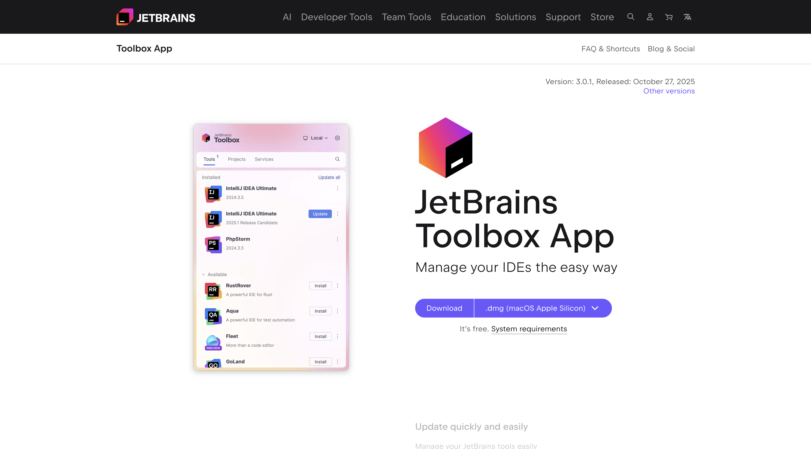

아마 독자들의 운영체제 시스템에 따라 자동으로 다운로드 받을 목록이 나오겠지만 만약 다르다면 위의 화면에 아래 화살표 버튼을 눌러서 선택해주면 된다. 그리고 Toolbox가 설치가 완료되고 실행을 하면 아래와 같은 화면이 나오는 것을 볼 수 있다. 필자는 기존에 설치한 IDE들이 있어서 이렇게 나오지만 처음 설치한 독자들은 아마 빈 화면이 나오고 설치할 목록들이 나올 것이다.

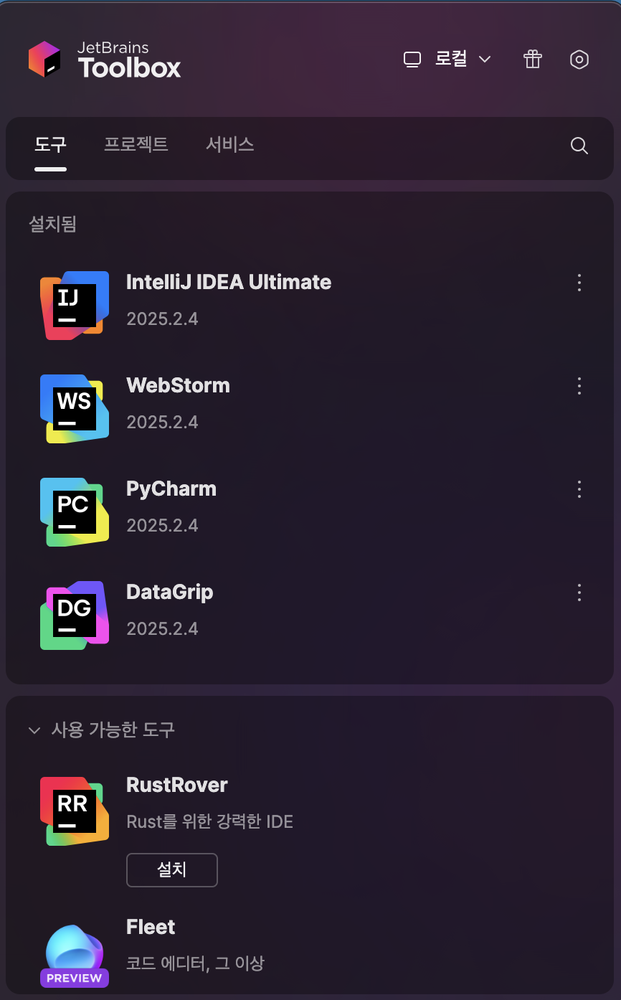

여기서 우리는 IntelliJ IDE를 설치하면 된다. 그런데 아마 설치하려고 보면 Community 버전과 Ultimate 버전 2개가 존재할 것이다. 둘의 차이가 무엇일까? 쉽게 말하면 Community 버전은 무료버전이고 Ultimate 버전은 유료 버전이다. 상세하게 보면 Community 버전은 Java, Groovy등과 같은 스크립트 언어들을 이용한 프로젝트들을 생성하는 기능을 지원하지만 Ultimate은 Javascript라던지, Spring이라던지 웹에 관련된 기능들을 추가 지원이 가능하다. 앞으로 필자는 Ultimate 버전을 사용허겠지만 따라하시는 독자들은 Community 버전을 사용하셔도 무방하다. 단, Ultimate 버전의 특수 기능들은 앞으로 포스팅에서 언급을 한 차례 한번 할 예정이다.

또한 Toolbox를 설치하면 각 IDE마다 Heap 사이즈를 조절할 수 있다. 예전 Eclipse를 사용할 때를 생각해보면 Eclipse가 메모리가 부족해서 프로그램이 죽는 경험을 해보았다. 이런 것을 젯브레인에서는 IntelliJ에 힙 사이즈를 조절하게끔 Toolbox 차원에서 지원을 해주는 것이다. 설정 방법은 간단하다. 아래 IDE를 Toolbox를 통해 설치하고 우측 상단의 햄버거 버튼을 눌러서 설정을 들어가면 된다.

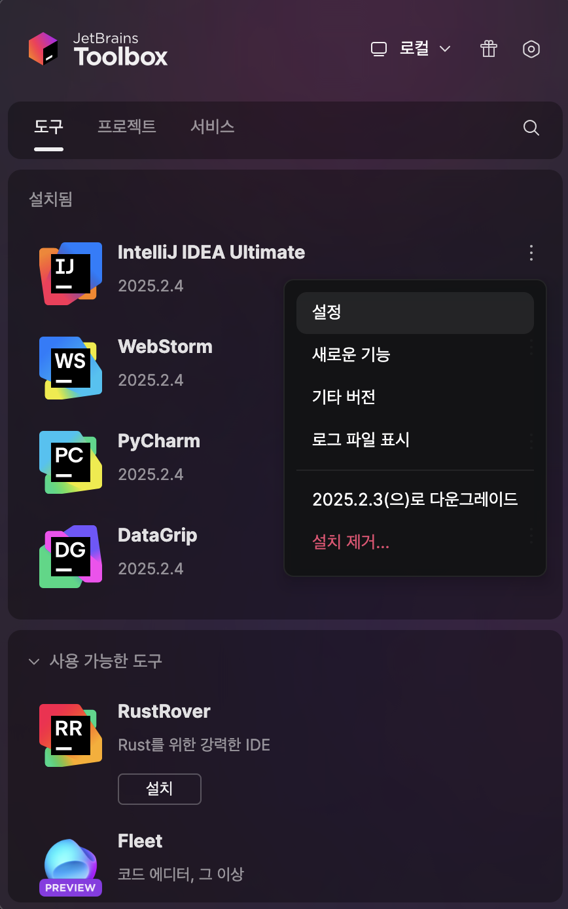

그러면 아래와 같은 화면이 나올텐데 여기서 구성 버튼을 클릭하면 메모리를 설정하는 부분이 나오는데 여기서 자신이 원하는 힙 사이즈로 변경해주면 된다. 보통은 자동으로 설정되는 것을 사용하지만 뭔가 IDE가 느려졌다라고 느끼면 메모리를 늘려주는 것이 좋다.

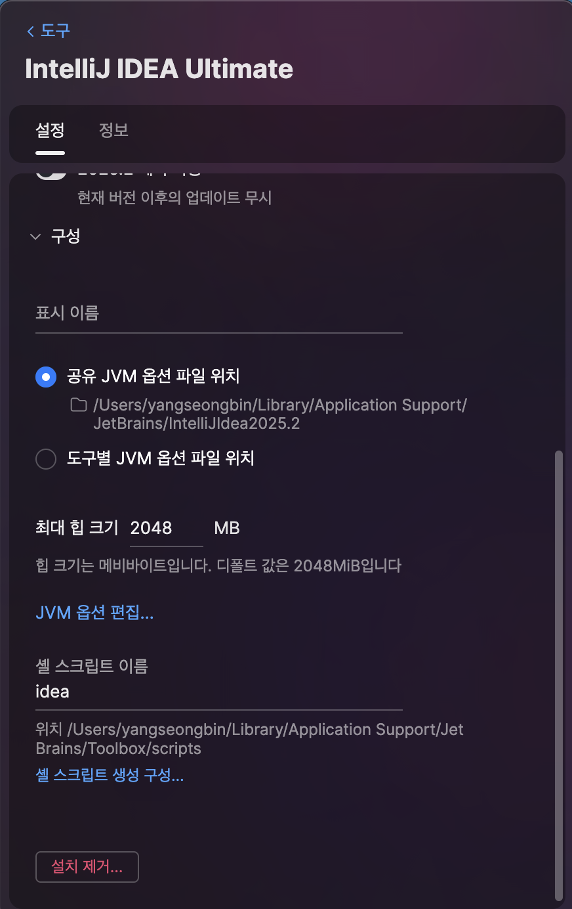

또한, IDE 버전 업데이트를 EAP(실험 버전)을 사용하게 할 수도 있다. 특정 신규 기능을 미리 써보고 싶을 때 아래 화면에서 비활성화 된 버튼을 클릭해주면 자동 반영이 되니 궁금하면 한번 해보시길 바란다.

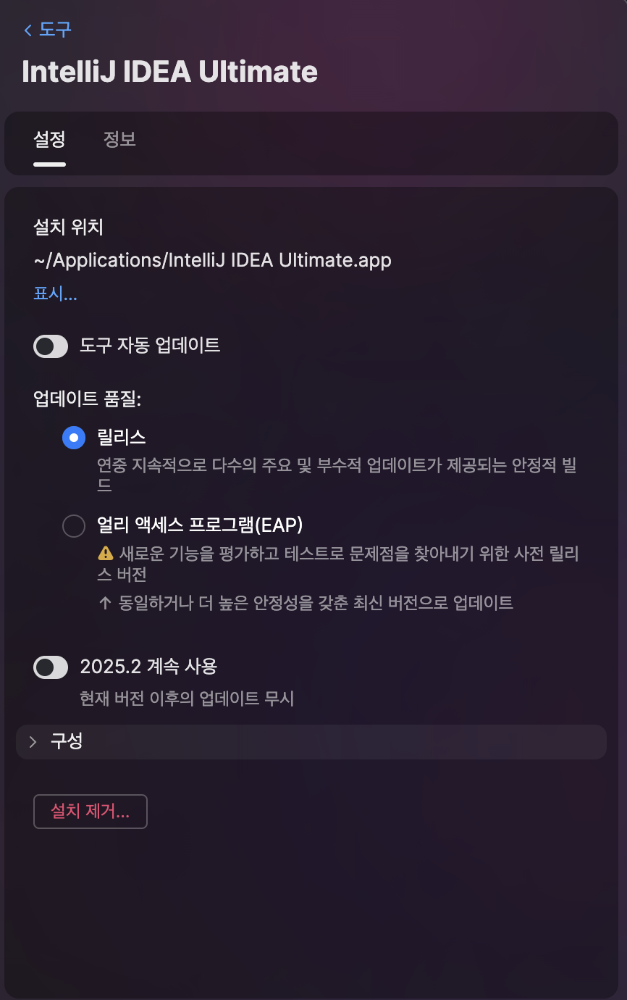

## 프로젝트 생성

이제 Toolbox 앱에서 인텔리제이를 실행 시켜서 프로젝트를 생성하는 것을 해보겠다. 인텔리제이를 Toolbox 앱에서 실행시켜보자. 필자는 기존에 했던 프로젝트가 있어서 아래와 같이 나오겠지만 아마 독자들은 빈 화면이 나올 것이다.

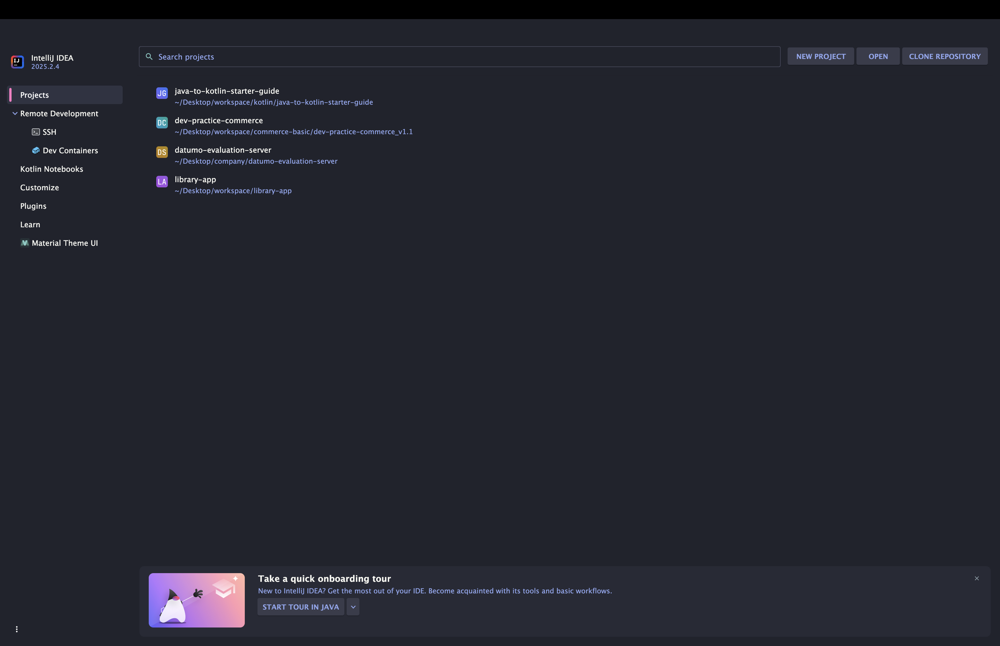

여기서 New Project 버튼을 클릭하면 아래와 같은 팝업이 나올텐데 여기서 아래와 같이 적어주면 좋을 것 같다.

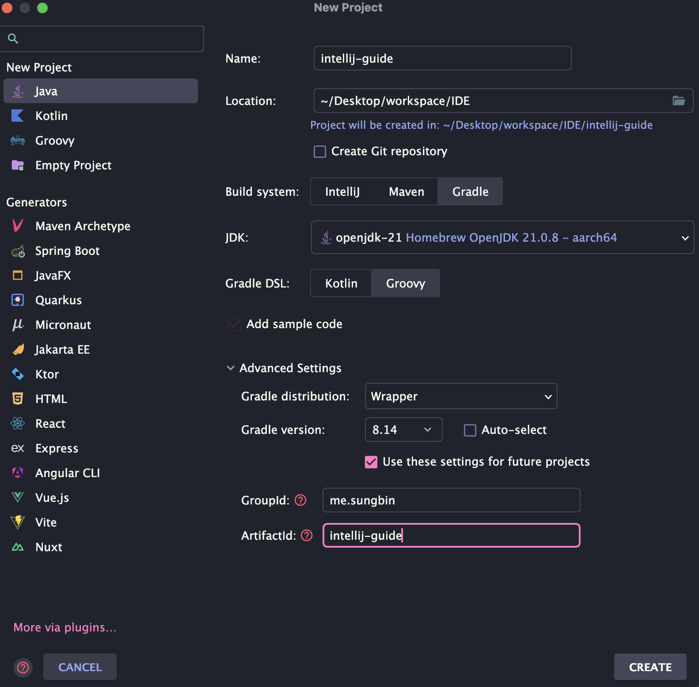

Name에는 본인이 원하는 프로젝트 이름을 적어주고 Location에는 해당 프로젝트를 설치할 경로를 적어주면 된다. Build System이라고 있는데 이것은 현재 잘 몰라도 되고 일단은 Gradle을 선택해준다. IntelliJ를 선택해줄 수도 있고 maven을 선택해줄 수 있지만 IntelliJ는 특정 라이브러리를 설치하기 힘들다는 단점이 있다. 반면에 maven이나 gradle은 원하는 라이브러리를 설정으로 자동으로 받아오게끔 할 수 있다. 하지만 maven은 xml기반이기도 하고 매우 느리기에 gradle을 사용할 것이다. 물론 실무에서도 신규 프로젝트 같은 경우에 gradle을 사용한다.

다음으로 JDK는 현재 가장 최신 JDK를 설정해주면 된다. 만약 안 깔려 있는 경우는 아래 처럼 Download JDK를 눌러서 원하는 버전과 회사의 JDK를 설치해주면 된다.

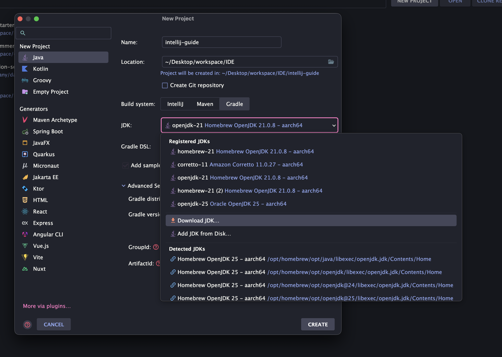

다음으로 Advance Setting을 클릭하여 눌러보면 뭔가 groupId와 artifactId를 적는게 나오는데 예를 들어서 이야기하면 groupId는 spring-project를 의미하고 artifactId는 spring-batch를 이해하면 좋을 것이다. 필자는 group-id에 패키지 명을 적어주었고 artifactId에는 프로젝트 네임을 적어주었다. 그리고 create 버튼을 누르면 아래와 같은 화면이 나올 것이다.

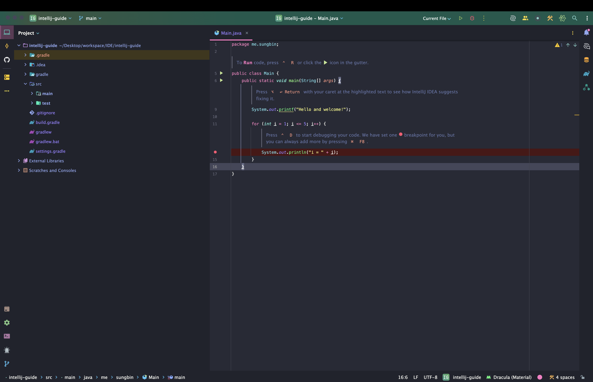

이제 간단한 설정을 한번 해보겠다. 이번 설정은 화면에 단축키를 입력하면 다른 OS에는 어떤 단축키인지 보여주는 기능으로 mac/window/linux로 다 알려준다. 기존에는 플러그인 형태로 존재하였지만 IntelliJ 2023.03버전부터 플러그인 Presentation Assistant 기능이 인텔리제이로 내장되었다고 한다. 혹시 플러그인에서 검색이 안 되시는 분들은 settings에서 검색해보시면 찾아 볼 수 있다.

간단히 방법을 알려드리자면 맥 기준 `command + shift + a`를 입력하면 아래와 같은 창이 나올 것이다.

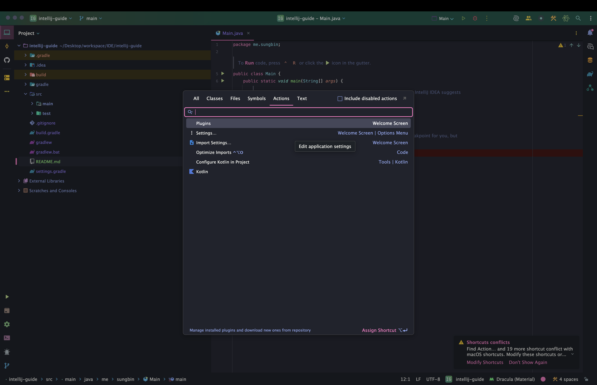

그리고 검색창에 presentation Assiatant를 검색하면 아래와 같이 나올텐데 여기에 토글 버튼을 켜주면 된다. 필자는 이미 진행하여 켜져있지만 독자들은 꺼져 있을 것이다.

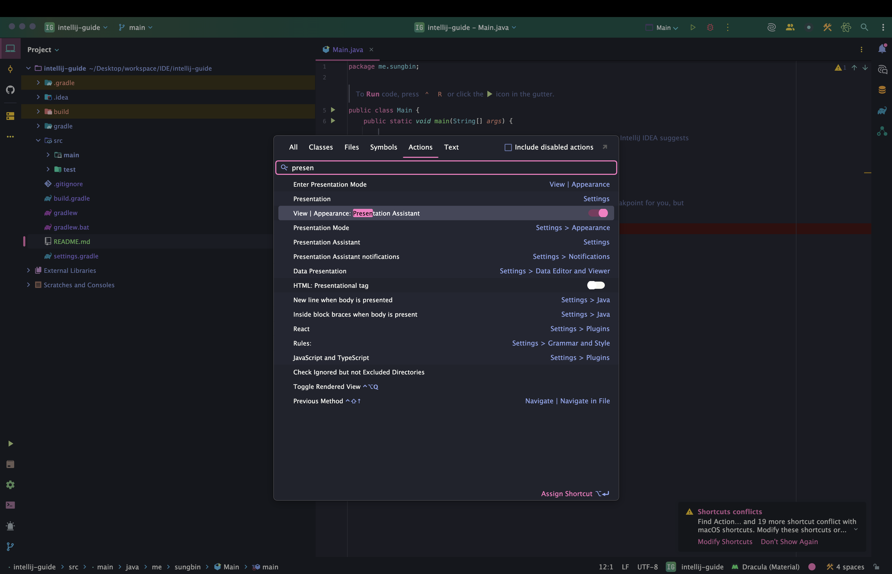

여기서 활성화를 하면 해당 OS의 단축키만 보일텐데 만약 다른 OS의 단축키도 보고 싶다면 `command + shift + a`를 입력 후, settings를 입력하고 엔터를 누르면 아래와 같은 화면이 나올 것이다.

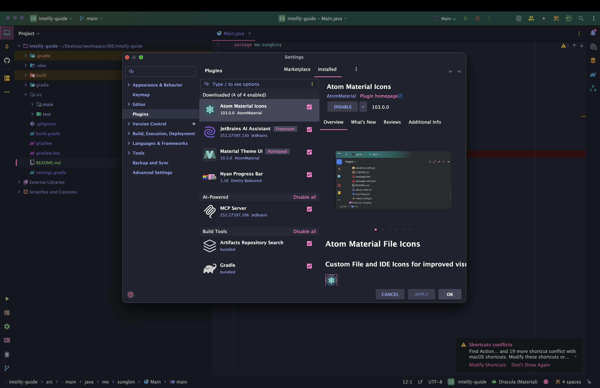

해당 화면에 좌측 검색창에 Presentation Assistant를 검색하여 Appereance 안에 Presentation Assistant를 찾으면 KeyMap 세팅에 다른 운영체제를 추가할 수 있다.

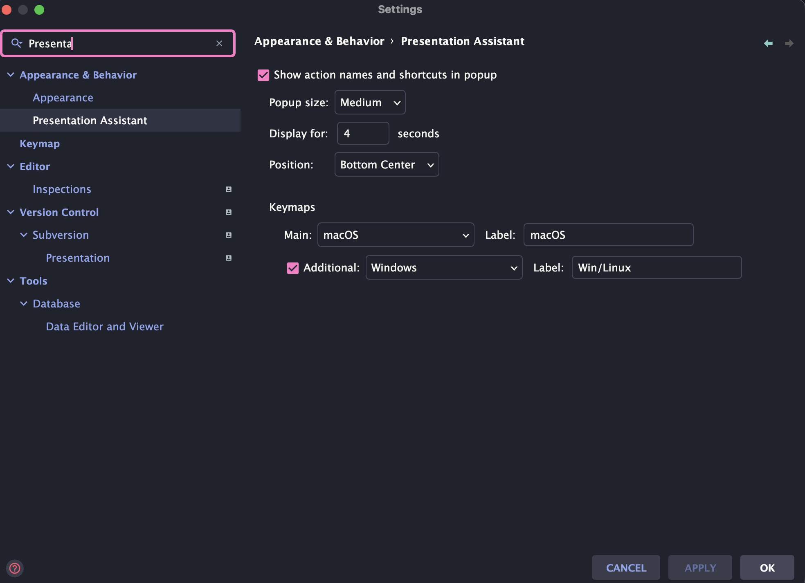