> 해당 포스팅은 인프런의 [IntelliJ를 시작하시는 분들을 위한 IntelliJ 가이드](https://inf.run/doaZn) 강의를 참조하여 작성한 글입니다.

## 강의 소개

우리는 공부라는 것을 할 때 새로운 기술을 도입하기 위해서 공부를 하는 경우도 존재하고 내가 부족한 지식들을 학습할 때 많이 공부를 하곤 한다. 하지만 해당 포스팅은 조금 관점을 바꿔보려고 한다. 단순히 새로운
기술과 지식들을 학습하기 위해서가 아닌 생산성을 높이기 위한 포스팅으로 보면 좋을 것 같다.

해당 포스팅은 jetbrains사에서 제작한 IDE 중에 IntelliJ IDE에 대한 단축키 및 각 종 꿀팁에 대한 학습을 진행할 것이다. 단순히 기술을 학습하는게 아닌 유용한 꿀팁과 단축키를 통해 기존 1시간
작업할 분량을 30분으로 단축하는 생산성을 도와주기 위한 포스팅이라고 생각하면 좋을 것 같다.

### 왜 IDE를 공부해야 할까?

참조한 강의의 향로 (이동욱) 강사님은 JetBrains Korea User Group의 운영진을 맡고 있는 분인데, 강의 첫 마디에서 이런 이야기를 한다.

> "다만 이런 트렌드만 쫓고 본인의 생산성이 낮은 상황이라면 공부 방향을 조금은 우회해도 괜찮지 않을까 라는 게 저의 생각이고요."
>
> "만약에 내가 사용하고 있는 IDE에서 1시간 동안 작업하는 양이 이 강의를 통해서 30분 만에 끝낼 수 있다면 조금 더 공부할 수 있는 양이 많지 않을까 이런 생각이 조금 들었어요."

필자도 이 말에 깊게 공감한다. 개발자의 자기 개발이라고 하면 보통 사이드 프로젝트, 새로운 언어, 새로운 프레임워크를 떠올린다. 그런데 정작 매일 8시간 이상 붙잡고 있는 도구인 IDE는 "그냥 쓰면 되는 것"
정도로 취급하는 경우가 많다. 하지만 생각해보면 우리가 코드를 작성하는 모든 순간은 IDE 위에서 벌어지는 일이다. 여기서 발생하는 비효율은 하루, 한 달, 1년 단위로 누적된다.

그래서 향로 강사님은 이 강의의 목적을 아주 명확하게 정의한다.

> "그래서 이 강좌의 목적은 여러분들의 실력 향상이나 이런 게 주 목적이 아니라 여러분들의 시간을 아껴 드리고 싶어요."

즉, 이 시리즈는 **실력을 올려주는 글이 아니라 시간을 벌어주는 글**이다. 마우스로 5초 걸리던 작업을 단축키로 0.5초에 끝내고, 손으로 일일이 고치던 변수명을 리팩토링 기능으로 한 번에 바꾸는 것. 이런
사소해 보이는 것들이 쌓여서 "생산성"이 된다.

### 이 시리즈는 누구를 위한 글인가?

이 시리즈는 IntelliJ를 이제 막 시작하는 개발자를 대상으로 한다. 이미 IntelliJ를 오랫동안 사용해온 개발자라면 익숙한 내용이 대부분일 수 있다. 다만 여기서 하나 강조하고 싶은 점이 있는데, 여기서
다루는 내용은 **IntelliJ IDEA에만 국한된 것이 아니다.**

젯브레인은 IntelliJ Platform이라는 공통 기반 위에 여러 IDE를 만든다. 그래서 아래 제품들은 대부분 동일한 단축키와 동일한 기능 체계를 공유한다.

- **IntelliJ IDEA**: Java / Kotlin
- **Android Studio**: 안드로이드 (구글이 IntelliJ 기반으로 만든 공식 IDE)
- **PyCharm**: Python
- **WebStorm**: JavaScript / TypeScript
- **PhpStorm**: PHP
- **GoLand**: Go
- **RubyMine**: Ruby
- **CLion**: C / C++
- **DataGrip**: DB 전용 클라이언트
- **Rider**: .NET

즉, 여기서 익힌 단축키 하나가 나중에 안드로이드를 하든 파이썬을 하든 그대로 재사용된다. 한 번 투자해서 평생 써먹는 지식인 셈이다.

### 앞으로 다룰 내용

이 시리즈는 아래와 같은 순서로 진행될 예정이다.

1. **소개** (현재 글) - Toolbox 설치와 프로젝트 생성
2. **코드 Edit** - 메인 메서드 생성 및 실행, 라인 수정, 코드 즉시 보기
3. **포커스** - 에디터 포커스 이동과 특수키를 활용한 선택 영역 확장
4. **검색** - 텍스트 검색, 클래스/파일/액션 검색
5. **자동완성** - 자동완성과 Live Template
6. **리팩토링** - Extract 계열 리팩토링과 기타 리팩토링
7. **디버깅** - 브레이크포인트와 디버깅 도구 활용
8. **Git & Github** - IDE 안에서 Git 사용하기, Github 연동
9. **플러그인** - 생산성을 높여주는 유용한 플러그인

### 학습 방법에 대한 조언

단축키를 학습할 때 가장 흔한 실패 패턴은 **한 번에 다 외우려고 하는 것**이다. 단축키는 암기 과목이 아니라 운동 신경에 가깝다. 필자가 추천하는 방법은 다음과 같다.

- 한 번에 2~3개씩만 목표로 잡고, 그 주에는 그 단축키만 의식적으로 사용한다.
- 마우스로 손이 가는 순간이 있다면 "이거 단축키가 있지 않을까?"를 먼저 의심한다.
- 나중에 소개할 **Key Promoter X** 같은 플러그인을 사용하면 마우스로 클릭할 때마다 "이 동작의 단축키는 이것이다"라고 알려준다.
- 무엇보다 **손에 익을 때까지 반복**하는 것이 중요하다. 머리로 아는 단축키는 실무에서 절대 쓰지 않게 된다.

## Toolbox 소개

아마 독자들은 IntelliJ를 설치하려고 할 때 직접 IDE를 설치하는 독자분들이 계셨을 것이다. 이렇게 직접 설치를 해줘도 되지만 더 유용한 꿀팁을 소개하려고 한다. 젯브레인에는 젯브레인이 만든 IDE를 편리하게
설치할 수 있는 Toolbox를 제공한다. 이 Toolbox를 설치하고 해당 Toolbox를 통해 IntelliJ를 설치하는 과정을 한번 보여주고 어떤 장점이 있는지 살펴보자.

### Toolbox를 써야 하는 이유

향로 강사님도 강의에서 "저는 그 방법 (직접 설치)보다는 이렇게 툴박스 앱을 통해서 설치하는 것을 추천드립니다"라고 명확하게 이야기한다. 그 이유를 정리하면 다음과 같다.

- **여러 IDE를 한 곳에서 관리**: IntelliJ IDEA, DataGrip, WebStorm 등 여러 제품을 쓰게 되면 각각 홈페이지에서 받고 각각 업데이트해야 한다. Toolbox는 이걸 한 화면에서
  처리한다.
- **업데이트 자동화**: 새 버전이 나오면 알림을 주고, 클릭 한 번으로 패치 업데이트가 된다.
- **이전 버전 롤백**: 새 버전에서 문제가 생겼을 때 이전 버전을 다시 설치할 수 있다. 이건 직접 설치로는 상당히 번거로운 작업이다.
- **JVM 옵션 (힙 사이즈) 관리**: 뒤에서 자세히 다루겠지만, 설정 파일을 직접 건드리지 않고 GUI로 메모리를 조정할 수 있다.
- **최근 프로젝트 바로 열기**: Toolbox 화면에서 최근에 작업한 프로젝트를 바로 열 수 있다.
- **커맨드라인 실행 스크립트 생성**: 터미널에서 `idea .` 같은 명령으로 IDE를 바로 열 수 있도록 셸 스크립트를 자동으로 만들어준다.

### Toolbox 설치하기

먼저, [젯브레인 공식 홈페이지](https://www.jetbrains.com/)를 접속한다. 이후에, [Toolbox 설치 페이지](https://www.jetbrains.com/toolbox-app/)로 가서
자기에 운영체제에 맞는 버전을 골라서 설치한다. 필자는 M4 맥북 Max를 사용하고 있어서 아래 화면처럼 나오는 것이다.

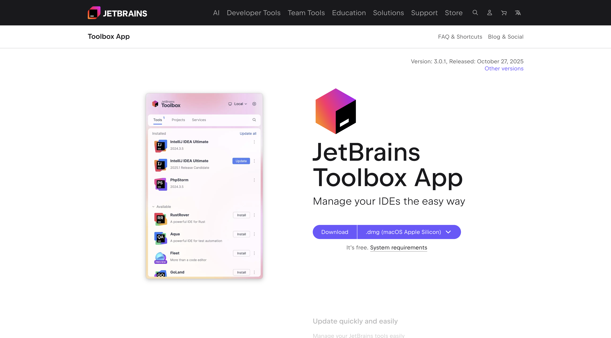

아마 독자들의 운영체제 시스템에 따라 자동으로 다운로드 받을 목록이 나오겠지만 만약 다르다면 위의 화면에 아래 화살표 버튼을 눌러서 선택해주면 된다.

> 맥 사용자라면 자신의 칩셋에 맞는 버전을 골라야 한다. M 시리즈 (Apple Silicon)를 쓴다면 `Apple Silicon` 버전을, 인텔 맥을 쓴다면 `Intel` 버전을 받아야 성능 손해를 보지
> 않는다. 참고로 `brew install --cask jetbrains-toolbox` 명령으로 설치하는 방법도 있다.

그리고 Toolbox가 설치가 완료되고 실행을 하면 아래와 같은 화면이 나오는 것을 볼 수 있다. 필자는 기존에 설치한 IDE들이 있어서 이렇게 나오지만 처음 설치한 독자들은 아마 빈 화면이 나오고 설치할 목록들이
나올 것이다.

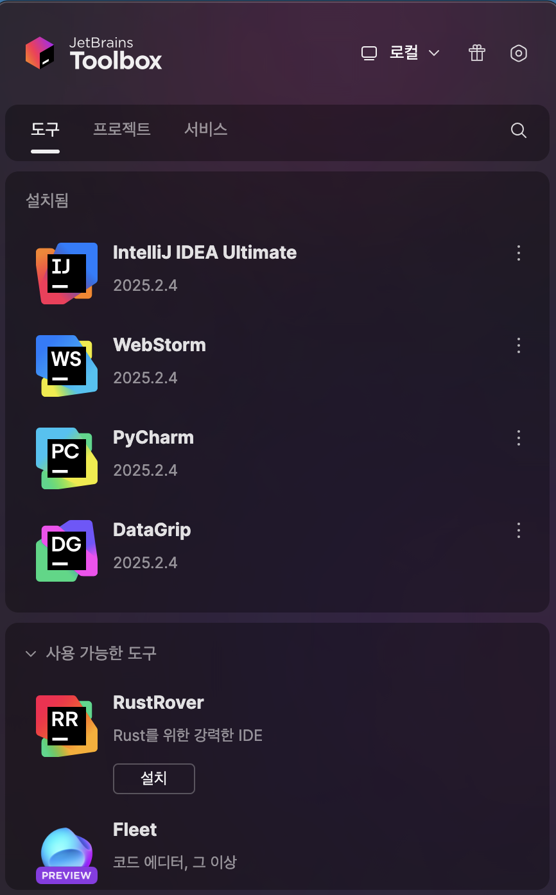

### Community 버전과 Ultimate 버전

여기서 우리는 IntelliJ IDE를 설치하면 된다. 그런데 아마 설치하려고 보면 Community 버전과 Ultimate 버전 2개가 존재할 것이다. 둘의 차이가 무엇일까? 쉽게 말하면 Community 버전은
무료 버전이고 Ultimate 버전은 유료 버전이다.

조금 더 상세하게 보면 다음과 같다.

| 구분         | Community                               | Ultimate                                  |
|--------------|-----------------------------------------|-------------------------------------------|
| 가격         | 무료 (오픈소스)                         | 유료 (구독형)                             |
| 언어         | Java, Kotlin, Groovy, Scala 등 JVM 계열 | JVM 계열 + JavaScript, TypeScript, SQL 등 |
| 빌드 도구    | Maven, Gradle                           | Maven, Gradle                             |
| 버전 관리    | Git, GitHub, SVN 등                     | 동일                                      |
| 테스트       | JUnit, TestNG                           | 동일                                      |
| 웹 / 서버    | 미지원                                  | Servlet, Tomcat, JSP, Spring, Spring Boot |
| 데이터베이스 | 미지원                                  | 내장 DB 클라이언트 (DataGrip 수준)        |
| 기타         | -                                       | 프로파일러, HTTP Client 등                |

강의에서도 이 부분을 짚고 넘어가는데, 커뮤니티 버전은 자바, 그루비, 그래들, 깃 등은 지원하지만 서블릿, 톰캣, 스프링, 스프링부트, JSP, 자바스크립트 같은 **웹 관련 기능은 지원하지 않는다.** 반대로
유료인 얼티메이트 버전은 이 웹 관련 기능을 모두 지원한다.

그러면 "나는 학생인데 유료 버전을 써야 하나?"라는 고민이 들 수 있다. 결론부터 말하면 대부분의 회사는 얼티메이트 계정을 구매해서 지원해주기 때문에 취업 후에는 자연스럽게 얼티메이트를 쓰게 된다. 그리고
학생이거나 교직원이라면 젯브레인에서 **학생 인증을 통해 얼티메이트를 무료로 제공**하니 재학 중이라면 꼭 신청해보길 바란다.

앞으로 필자는 Ultimate 버전을 사용하겠지만 따라하시는 독자들은 Community 버전을 사용하셔도 무방하다. 단, Ultimate 버전의 특수 기능들은 앞으로 포스팅에서 언급을 한 차례 한번 할 예정이다.

> **[2026년 현재 기준 중요한 변화] 통합 배포판 (Unified Distribution)**
>
> 위 내용은 강의 시점 기준의 설명이다. 그런데 **IntelliJ IDEA 2025.3부터 Community Edition과 Ultimate가 하나의 배포판으로 통합**되었다. 즉 지금 젯브레인 홈페이지나
> Toolbox에서 IntelliJ를 설치하려고 하면 예전처럼 두 개의 설치 파일이 나뉘어 있지 않고 **IntelliJ IDEA 하나만 존재한다.**
>
> 정리하면 이렇다.
>
> - 설치 파일은 **하나**이고, 구독 없이도 IDE는 완전히 동작한다. 이때 사용 가능한 범위는 기존 Community Edition보다 오히려 넓어졌다.
> - 무료 범위에 새로 포함된 것: 기본 데이터베이스 연결 및 스키마 조회, 전체 SQL 언어 지원, Spring Boot 프로젝트 마법사, 기본 Spring / Jakarta EE / Thymeleaf 구문
    강조, Kubernetes 통합, 비 JVM 언어 지원 등
> - 여전히 Ultimate 구독이 필요한 것: 고급 Spring 개발 도구, IntelliJ Profiler, HTTP Client, AI Assistant, 통합 데이터 도구 등
> - 신규 사용자에게는 **30일 무료 트라이얼**이 주어지며, 트라이얼이 끝나면 구독하거나 무료 상태로 계속 사용하면 된다.
> - 기존 Community Edition 사용자는 일반적인 패치 업데이트 과정에서 자동으로 통합 배포판으로 전환된다.
>
> 그래서 지금 이 글을 따라 하는 독자라면 "Community를 받을까 Ultimate를 받을까"를 고민할 필요 없이 그냥 IntelliJ IDEA를 설치하면 된다. 다만 앞으로의 포스팅에서 "이건 Ultimate
> 기능이다"라고 언급되는 부분은 여전히 구독이 필요한 영역이라고 이해하면 된다.

### 힙 사이즈 조절

또한 Toolbox를 설치하면 각 IDE마다 Heap 사이즈를 조절할 수 있다. 예전 Eclipse를 사용할 때를 생각해보면 Eclipse가 메모리가 부족해서 프로그램이 죽는 경험을 해보았다. 이런 것을
젯브레인에서는 IntelliJ에 힙 사이즈를 조절하게끔 Toolbox 차원에서 지원을 해주는 것이다.

여기서 말하는 힙 사이즈는 IDE 자체가 사용하는 JVM 메모리를 의미한다. IntelliJ는 그 자체가 자바로 만들어진 프로그램이기 때문에 JVM 위에서 동작하고, 따라서 `-Xmx` 옵션의 영향을 받는다. 원래는
`idea.vmoptions` 파일을 직접 열어서 수정해야 하는데, 향로 강사님의 표현을 빌리면 이렇다.

> "인텔리제이에서는 툴박스를 사용하시면 터미널이나 혹은 XML 코드를 직접 짜시지 않고 이 안에서 힙 사이즈를 마음대로 조정할 수가 있습니다."

설정 방법은 간단하다. 아래 IDE를 Toolbox를 통해 설치하고 우측 상단의 햄버거 버튼을 눌러서 설정을 들어가면 된다.

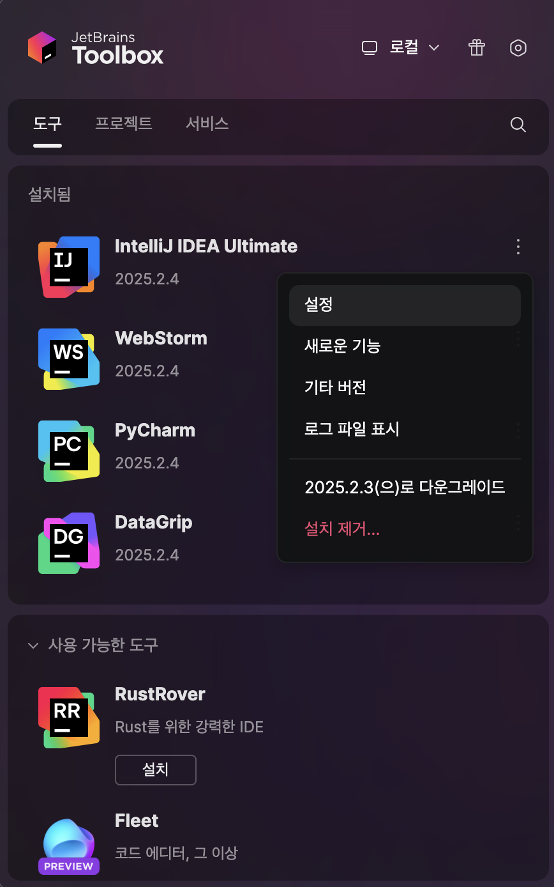

그러면 아래와 같은 화면이 나올텐데 여기서 구성 버튼을 클릭하면 메모리를 설정하는 부분이 나오는데 여기서 자신이 원하는 힙 사이즈로 변경해주면 된다. 보통은 자동으로 설정되는 것을 사용하지만 뭔가 IDE가
느려졌다라고 느끼면 메모리를 늘려주는 것이 좋다.

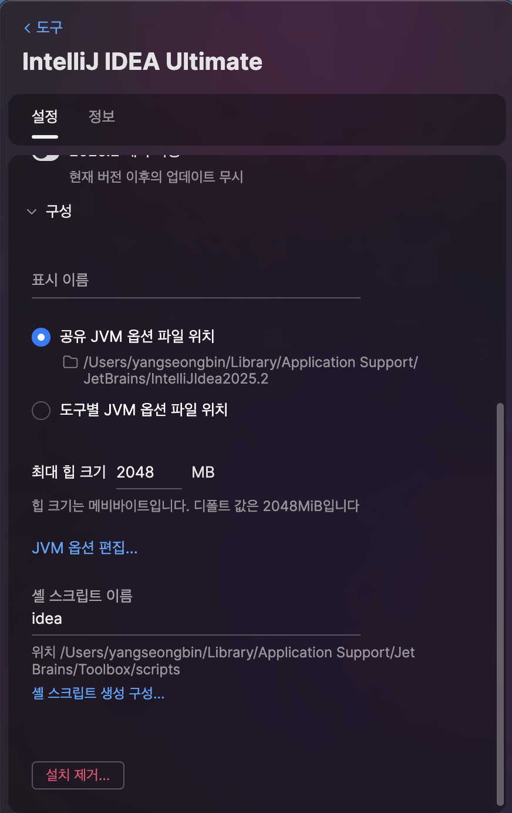

권장값을 정리하면 다음과 같다. 강의에서는 8GB PC는 1GB, 16GB PC는 2~4GB를 추천하는데, 이는 강의 시점의 기본 힙 사이즈가 750MB였기 때문이다. 현재 IntelliJ IDEA의 기본 최대 힙
사이즈는 **2048MB (2GB)** 로 올라갔으므로 요즘 기준으로는 아래 정도가 적당하다.

| PC 메모리 | 권장 힙 사이즈 |
|-----------|----------------|
| 8GB       | 1GB ~ 2GB      |
| 16GB      | 2GB ~ 4GB      |
| 32GB 이상 | 4GB ~ 8GB      |

여기서 주의할 점이 하나 있다. **힙 사이즈를 무작정 크게 잡는다고 IDE가 빨라지지는 않는다.** 오히려 물리 메모리보다 과하게 잡으면 스와핑이 발생해서 더 느려질 수 있고, GC가 한 번에 처리해야 할 영역이
커져서 순간적으로 멈추는 현상이 발생할 수도 있다. 멀티모듈 프로젝트처럼 규모가 큰 프로젝트를 다룰 때, 혹은 IDE가 눈에 띄게 버벅일 때 단계적으로 올려보는 것을 추천한다.

참고로 Toolbox 없이 IDE 안에서 조정하고 싶다면 `Help → Change Memory Settings` 메뉴를 이용하면 된다.

### EAP (Early Access Program)

또한, IDE 버전 업데이트를 EAP (실험 버전)을 사용하게 할 수도 있다. 특정 신규 기능을 미리 써보고 싶을 때 아래 화면에서 비활성화 된 버튼을 클릭해주면 자동 반영이 되니 궁금하면 한번 해보시길 바란다.

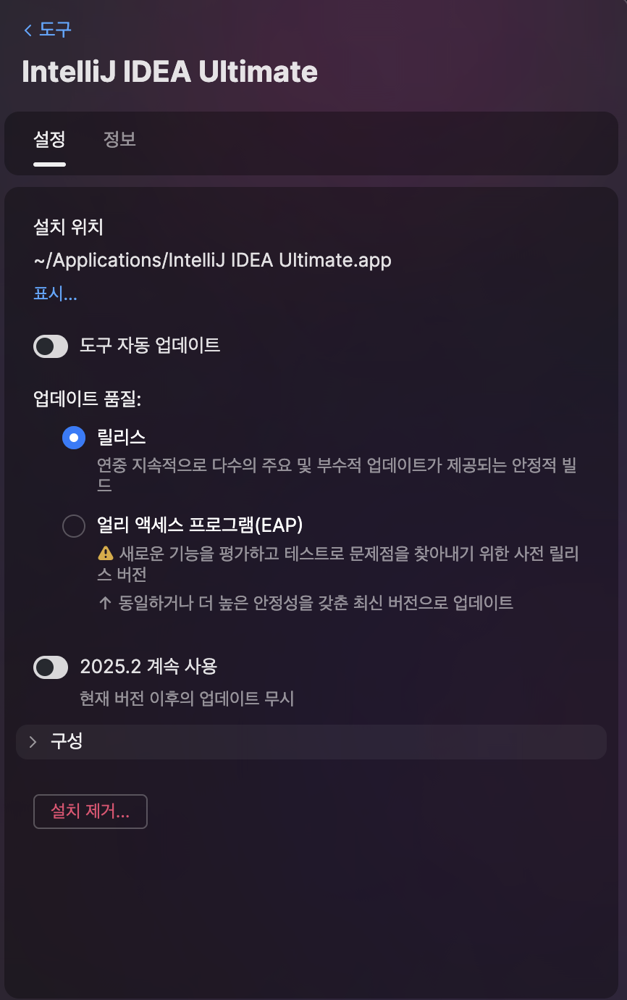

EAP는 Early Access Program의 약자로, 정식 출시 전의 프리뷰 버전을 의미한다. 강의에서도 "인텔리제이는 사실 버전업이 될 때마다 제품 내에서 버전업 할 게 있다라는 메시지를 자동으로 줍니다"라고
설명하는데, 이 업데이트의 기준을 **정식 버전 (Release)** 으로 할지 **프리뷰 버전 (EAP)** 까지 포함할지를 여기서 결정하는 것이다.

각각의 특징은 다음과 같다.

- **Release**: 정식으로 출시된 안정 버전. 실무 개발이라면 이 옵션을 사용해야 한다.
- **EAP**: 정식 출시 전 미리 써보는 버전. 신규 기능을 가장 먼저 경험할 수 있고 **EAP 기간 동안은 무료로 사용**할 수 있다는 장점이 있다. 다만 **안정성이 보장되지 않고, 플러그인 호환이 깨질
  수 있다.**

정리하면 회사 업무나 중요한 프로젝트를 진행하는 환경에서는 반드시 Release를 쓰고, 신규 기능이 궁금해서 구경해보고 싶을 때만 EAP를 켜는 것이 좋다. 필자의 경험상 EAP는 별도의 사이드 환경에서 잠깐
써보는 용도로만 사용하는 것이 마음이 편하다.

## 프로젝트 생성

이제 Toolbox 앱에서 인텔리제이를 실행 시켜서 프로젝트를 생성하는 것을 해보겠다. 인텔리제이를 Toolbox 앱에서 실행시켜보자. 필자는 기존에 했던 프로젝트가 있어서 아래와 같이 나오겠지만 아마 독자들은 빈
화면이 나올 것이다.

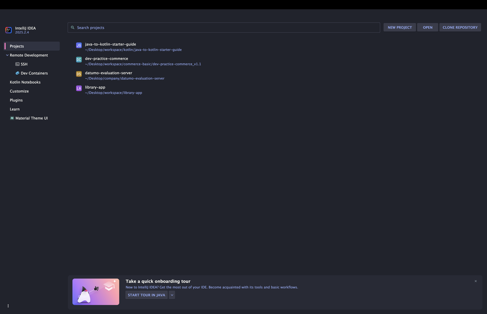

> 만약 IntelliJ를 처음 설치한 것이라면 실행 시 몇 가지를 물어본다. 기존 설정을 가져올지 묻는 화면에서는 `Do not import settings`를 선택하면 되고, 테마는 취향에 따라 고르면 된다
> (나중에 언제든 바꿀 수 있다). 키맵은 자신의 운영체제에 맞는 기본값을 그대로 두면 된다.

여기서 New Project 버튼을 클릭하면 아래와 같은 팝업이 나올텐데 여기서 아래와 같이 적어주면 좋을 것 같다.

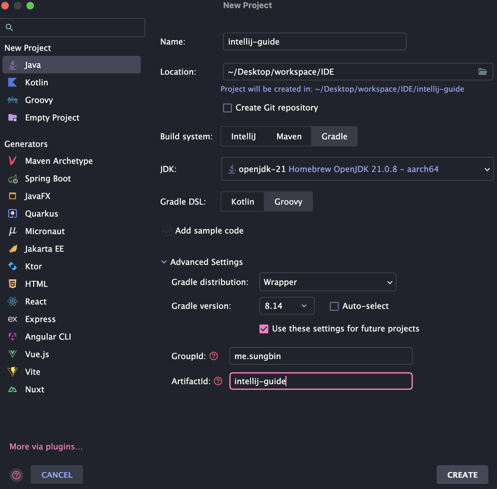

Name에는 본인이 원하는 프로젝트 이름을 적어주고 Location에는 해당 프로젝트를 설치할 경로를 적어주면 된다.

> 여기서 작은 팁을 하나 주자면, Location은 기본값인 `IdeaProjects` 디렉토리를 그대로 쓰기보다는 자신만의 규칙을 만들어두는 것이 좋다. 강의에서도 강사님이 기본 경로 대신 `인프런` 이라는
> 디렉토리를 따로 만들어서 그 하위에 프로젝트를 생성한다. 나중에 프로젝트가 수십 개로 늘어나면 이 습관의 유무가 큰 차이를 만든다.

### Build System은 왜 Gradle을 선택할까?

Build System이라고 있는데 이것은 현재 잘 몰라도 되고 일단은 Gradle을 선택해준다. IntelliJ를 선택해줄 수도 있고 maven을 선택해줄 수 있지만 IntelliJ는 특정 라이브러리를 설치하기
힘들다는 단점이 있다. 반면에 maven이나 gradle은 원하는 라이브러리를 설정으로 자동으로 받아오게끔 할 수 있다. 하지만 maven은 xml 기반이기도 하고 매우 느리기에 gradle을 사용할 것이다. 물론
실무에서도 신규 프로젝트 같은 경우에 gradle을 사용한다.

조금 더 풀어서 설명하면 이렇다. 세 가지 선택지의 차이는 결국 **의존성 (라이브러리)을 어떻게 관리하느냐**의 문제다.

- **IntelliJ**: 빌드 도구 없이 IDE가 직접 컴파일한다. 라이브러리를 추가하려면 JAR 파일을 직접 다운로드해서 프로젝트에 넣고 클래스패스에 등록해야 한다. 그 라이브러리가 또 다른 라이브러리를 필요로
  하면 (전이 의존성) 그것마저 손으로 찾아 넣어야 한다.
- **Maven**: `pom.xml`에 의존성을 선언하면 자동으로 내려받는다. 표준화가 잘 되어 있어 레거시 프로젝트에서 여전히 많이 쓰이지만, XML 기반이라 설정이 장황하고 빌드 속도도 상대적으로 느리다.
- **Gradle**: Groovy 또는 Kotlin DSL로 의존성을 선언한다. 빌드 캐시와 증분 빌드를 지원해 속도가 빠르고, 스크립트 언어 기반이라 유연하다. 최근 신규 프로젝트는 대부분 Gradle을
  선택한다.

향로 강사님도 이 부분을 강조한다.

> "자바를 개발한다 하시더라도 메이븐이나 그래들을 선택하시는 걸 추천드리고요."

단순히 자바 파일 하나만 만들어서 실행할 목적이라도 빌드 도구를 쓰는 습관을 들이는 것이 좋다. 왜냐하면 우리는 결국 JUnit으로 테스트 코드를 작성하게 되고, Apache Commons 같은 유틸리티 라이브러리를
쓰게 되기 때문이다. 그때마다 JAR 파일을 직접 관리하는 것은 상당히 고통스러운 일이다.

> 참고로 최근 버전의 IntelliJ에서는 Gradle을 선택하면 **Gradle DSL**을 Kotlin과 Groovy 중에 고르라는 항목이 추가로 나온다. 기본값은 Kotlin이며, Kotlin DSL을
> 선택하면 빌드 스크립트 파일이 `build.gradle.kts`로 만들어지고 IDE의 자동완성과 타입 체크를 그대로 받을 수 있다. 처음이라면 기본값인 Kotlin을 그대로 두면 된다.

### JDK 선택

다음으로 JDK는 현재 가장 최신 JDK를 설정해주면 된다. 만약 안 깔려 있는 경우는 아래 처럼 Download JDK를 눌러서 원하는 버전과 회사의 JDK를 설치해주면 된다.

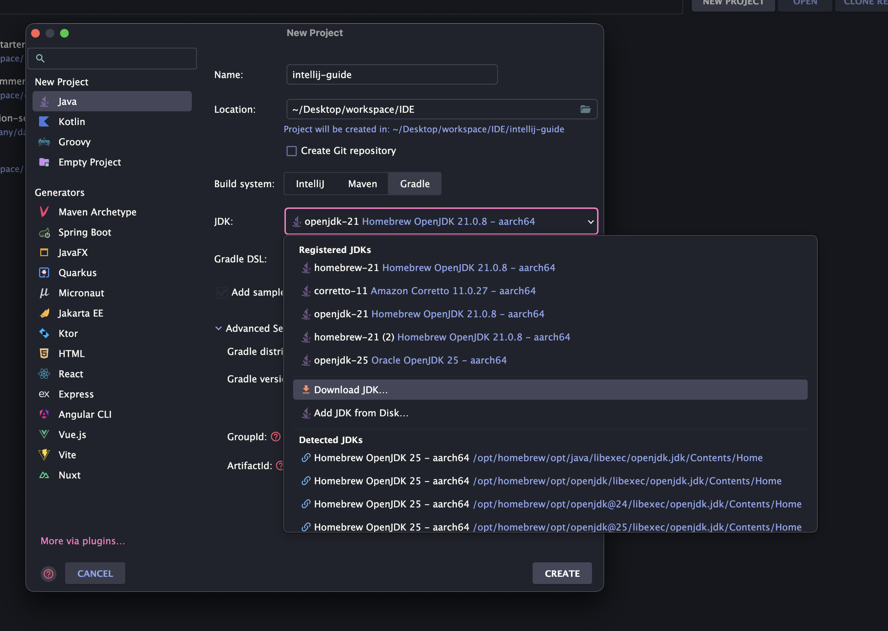

여기서 조금 더 부연 설명을 하자면, 자바는 6개월마다 새 버전이 나오지만 그중 일부만 **LTS (Long Term Support)** 버전으로 지정되어 장기간 지원을 받는다. 실무에서는 거의 대부분 LTS 버전을
사용한다.

- 대표적인 LTS: **8, 11, 17, 21, 25**
- 25는 2025년 9월에 정식 출시된 가장 최신 LTS 버전이다.
- 학습 목적이라면 최신 LTS인 **21 또는 25**를 선택하면 무난하다.

그리고 `Download JDK`를 누르면 버전뿐만 아니라 **벤더 (회사)** 도 함께 고르게 되어 있다. Oracle OpenJDK, Amazon Corretto, Eclipse Temurin, Azul Zulu
등이 나오는데 처음이라면 라이선스 걱정이 없는 **Temurin**이나 **Corretto**를 선택하는 것을 추천한다. 참고로 Oracle JDK는 상용 환경에서 라이선스 이슈가 있을 수 있으니 회사 환경이라면
반드시 확인이 필요하다.

### groupId와 artifactId

다음으로 Advanced Settings를 클릭하여 눌러보면 뭔가 groupId와 artifactId를 적는 게 나오는데 예를 들어서 이야기하면 groupId는 spring-project를 의미하고
artifactId는 spring-batch를 이해하면 좋을 것이다. 필자는 groupId에 패키지 명을 적어주었고 artifactId에는 프로젝트 네임을 적어주었다.

이 개념은 처음 접하면 헷갈리기 쉬운데, 강의에서는 이렇게 설명한다.

> "그룹은 프로젝트 그룹을 얘기합니다. 예를 들면 스프링 프로젝트가 그룹으로 될 수 있겠죠? 그러면 아티팩트는 뭐냐? 아티팩트는 그룹의 하위 모듈을 얘기해요."

조금 더 정확하게 이야기하면 이 두 값은 Gradle과 Maven이 라이브러리를 식별할 때 쓰는 **좌표 (coordinates)** 다. Gradle 공식 문서에서는 의존성을 `group:name:version`
형태로 표기하는데, 우리가 여기서 입력하는 값이 바로 그 group과 name (= artifactId)이다.

```groovy
dependencies {
    // group : name(artifactId) : version
    implementation('org.springframework.boot:spring-boot-starter-web:3.5.0')
}
```

위 예시를 뜯어보면 이런 구조다.

- **group**: `org.springframework.boot` → 스프링 부트라는 프로젝트 그룹
- **name (artifact)**: `spring-boot-starter-web` → 그 그룹 안의 개별 모듈
- **version**: `3.5.0` → 해당 모듈의 버전

즉 우리가 만든 프로젝트도 언젠가 라이브러리로 배포된다면 다른 사람이 이 좌표로 우리 프로젝트를 가져다 쓰게 된다. 그래서 groupId는 **자신이 소유한 도메인을 역순으로 적는 것**이 관례다. 예를 들어
`sungbin.me`라는 도메인을 가지고 있다면 `me.sungbin`이 되는 식이다. 도메인이 없다면 `com.github.{깃허브아이디}` 형태를 쓰기도 한다.

버전은 기본값인 `1.0-SNAPSHOT`을 그대로 두면 된다. 여기서 SNAPSHOT은 "아직 개발 중이라 언제든 바뀔 수 있는 버전"이라는 의미다.

그리고 create 버튼을 누르면 아래와 같은 화면이 나올 것이다.

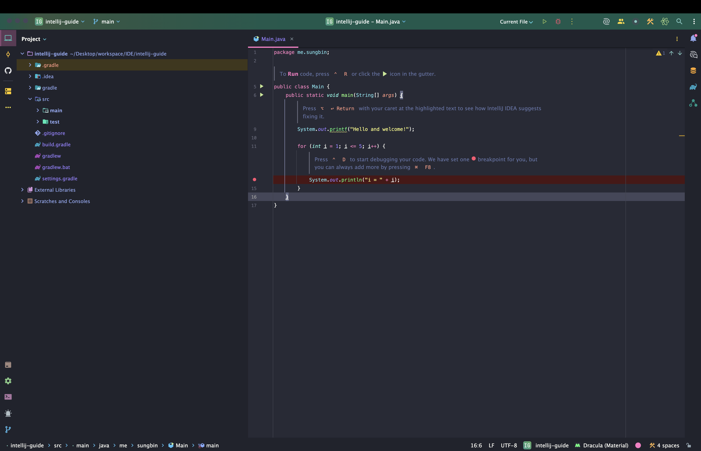

### Gradle 자동 리로드 설정

프로젝트를 생성하고 나면 `build.gradle.kts` (혹은 `build.gradle`) 파일이 만들어진다. 앞으로 우리는 여기에 라이브러리를 추가하게 될 텐데, 이때 알아두면 좋은 설정이 하나 있다.

빌드 스크립트를 수정하면 IntelliJ가 그 변경 사항을 인식해서 의존성을 다시 내려받아야 한다. 이걸 **리로드 (Reload)** 라고 하는데, 기본적으로는 파일을 수정하면 우측 상단에 코끼리 모양의 새로고침
아이콘이 뜨고 이걸 직접 눌러줘야 한다. 강의에서는 이 부분을 이렇게 설명한다.

> "이게 뭐냐면 그래들 프로젝트가 어떨 때 새로 고침을 할 건지를 물어보는 거예요. (중략) 매번 할 때마다 임포트하기가 귀찮기 때문에 저는 오토로 변경해 놓겠습니다."

이걸 자동으로 바꾸고 싶다면 설정에서 아래 경로로 들어가면 된다.

- `Settings(Preferences)` → `Build, Execution, Deployment` → `Build Tools` → `Gradle`
- `Reload project after changes in the build scripts` 항목을 `Any changes`로 변경

이렇게 해두면 빌드 스크립트를 저장하는 순간 자동으로 의존성이 반영된다. 다만 프로젝트 규모가 크면 저장할 때마다 리로드가 걸려서 오히려 답답할 수 있으니, 그런 경우에는 기본값인 `External changes`로
두고 필요할 때 수동으로 눌러주는 편이 나을 수도 있다.

### Presentation Assistant 설정

이제 간단한 설정을 한번 해보겠다. 이번 설정은 화면에 단축키를 입력하면 다른 OS에는 어떤 단축키인지 보여주는 기능으로 mac/window/linux로 다 알려준다.

이 기능이 왜 필요한지는 강의를 들어보면 바로 이해가 된다. 강사님은 맥으로 강의를 진행하는데, 이 강의를 보는 윈도우나 리눅스 사용자들은 단축키가 다르기 때문이다.

> "이게 뭐냐면 단축키를 누르면 이게 윈도우나 리눅스에서는 어떻게 나오는지, 반대로 윈도우 개발자가 개발을 할 때 맥에서는 어떻게 나오는지를 자동으로 보여주는 거예요."

원래 이 기능은 **Presentation Assistant**라는 별도 플러그인으로 존재했지만, **IntelliJ 2023.3 버전부터 IntelliJ Platform에 기본 내장**되었다. 그래서 요즘 버전을
쓰는 독자라면 플러그인 마켓플레이스에서 검색해도 나오지 않을 수 있는데, 이럴 때는 설정 (Settings)에서 검색해보면 찾을 수 있다.

간단히 방법을 알려드리자면 맥 기준 `command + shift + a` (윈도우/리눅스는 `ctrl + shift + a`)를 입력하면 아래와 같은 창이 나올 것이다. 이 창은 **Find Action**이라고
부르는 기능인데, IDE의 모든 기능을 이름으로 검색해서 실행할 수 있는 아주 강력한 단축키다. 앞으로도 자주 등장할 예정이니 이번 기회에 손에 익혀두면 좋다.

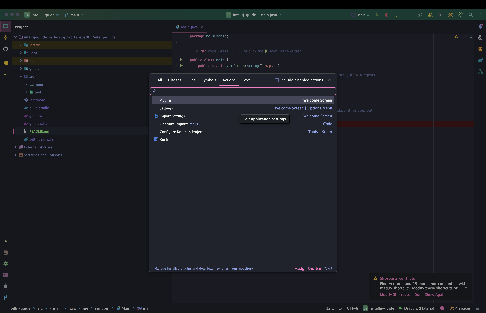

그리고 검색창에 Presentation Assistant를 검색하면 아래와 같이 나올텐데 여기에 토글 버튼을 켜주면 된다. 필자는 이미 진행하여 켜져있지만 독자들은 꺼져 있을 것이다.

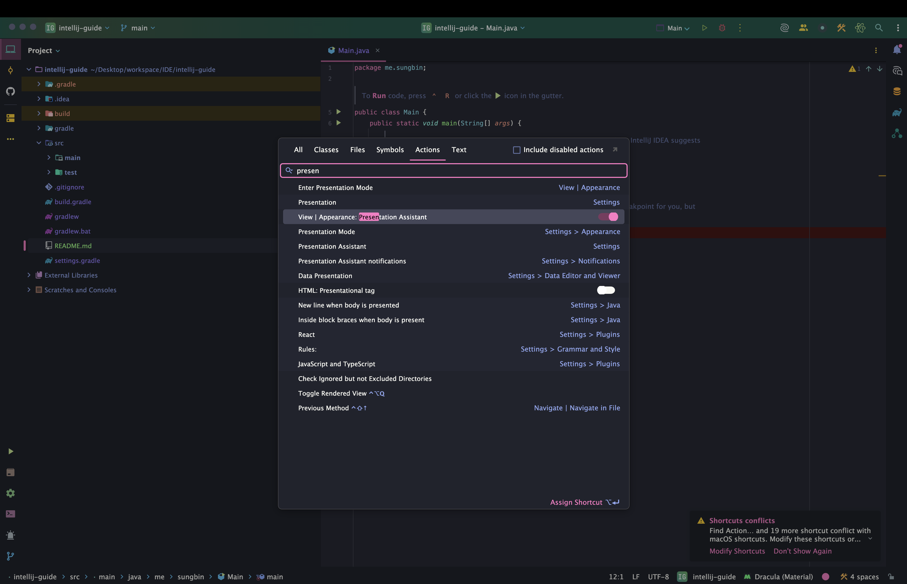

> 메뉴를 통해 켜고 싶다면 `View` → `Appearance` → `Presentation Assistant` 경로로 들어가서 활성화해도 동일하다.

여기서 활성화를 하면 해당 OS의 단축키만 보일텐데 만약 다른 OS의 단축키도 보고 싶다면 `command + shift + a`를 입력 후, settings를 입력하고 엔터를 누르면 아래와 같은 화면이 나올
것이다.

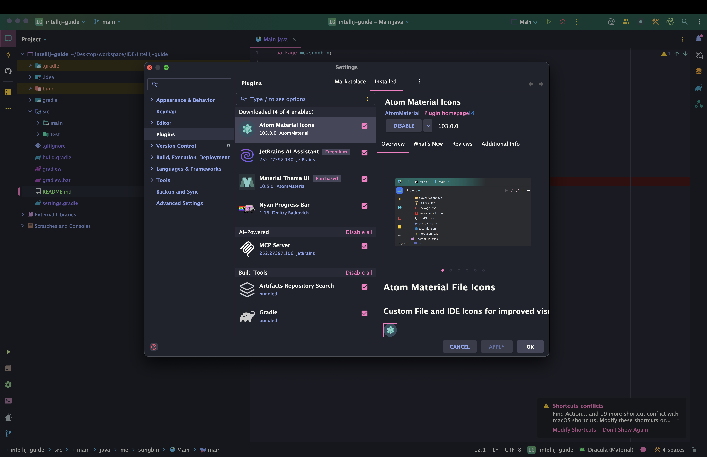

> 설정 창은 단축키로 바로 열 수도 있다. 맥은 `command + ,`, 윈도우/리눅스는 `ctrl + alt + s`다.

해당 화면에 좌측 검색창에 Presentation Assistant를 검색하여 Appearance 안에 Presentation Assistant를 찾으면 KeyMap 세팅에 다른 운영체제를 추가할 수 있다.

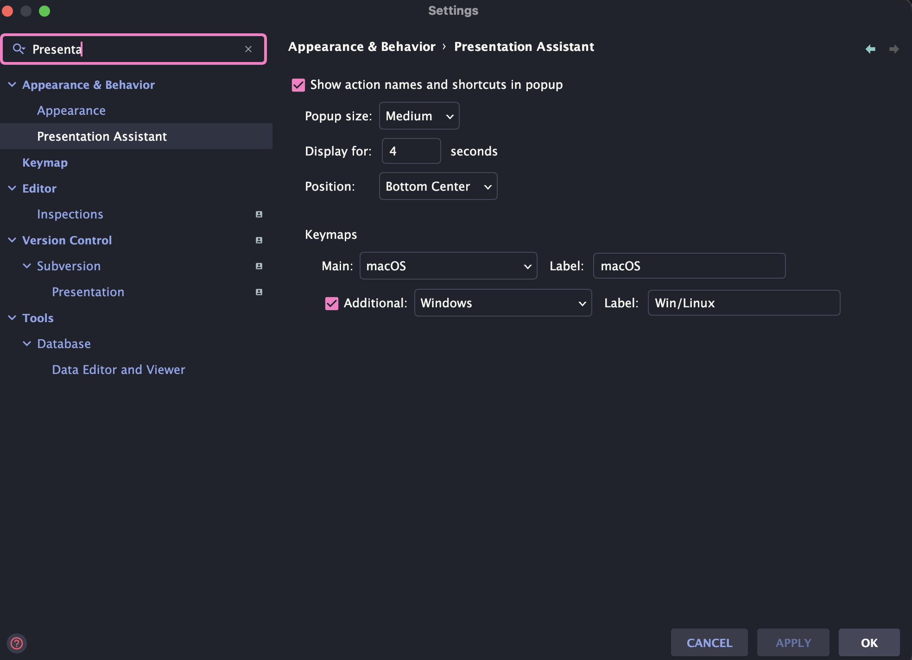

정확한 경로는 `Appearance & Behavior` → `Presentation Assistant`이며, 여기서 `Main` 항목이 메인으로 표시할 키맵이고 `Additional` 항목을 활성화하면 보조 키맵
(예: 맥을 쓰면서 Windows 키맵도 같이 보기)을 추가로 표시할 수 있다. 각 키맵에 라벨을 붙일 수도 있어서, 화면에 `⌘⇧A (Win: Ctrl+Shift+A)` 같은 식으로 함께 노출된다.

이 설정을 해두면 앞으로의 포스팅을 따라 하면서 자신의 OS 단축키를 자연스럽게 확인할 수 있으니 꼭 켜두길 추천한다.

## 정리

이번 편에서 다룬 내용을 정리해보자.

**설치 및 환경**

- IntelliJ는 Toolbox 앱을 통해 설치하는 것을 추천한다. (버전 관리, 롤백, 힙 사이즈 조정이 편하다)
- 2025.3부터 Community와 Ultimate가 하나의 배포판으로 통합되었으므로, 지금은 에디션을 고민할 필요 없이 IntelliJ IDEA를 설치하면 된다.
- 힙 사이즈는 Toolbox의 IDE 설정에서 조정할 수 있으며, 무작정 크게 잡는다고 빨라지지 않는다.
- 실무 개발 환경은 Release 채널을 사용하고, EAP는 신규 기능 체험용으로만 사용한다.

**프로젝트 생성**

- Build System은 Gradle을 선택한다. (의존성 관리 + 빌드 속도)
- JDK는 최신 LTS (21 또는 25)를 선택하고, 벤더는 Temurin이나 Corretto를 추천한다.
- groupId는 도메인 역순, artifactId는 프로젝트 (모듈) 이름이며, 이 둘은 `group:name:version` 좌표의 일부다.
- 빌드 스크립트 자동 리로드는 `Build Tools → Gradle → Reload project after changes in the build scripts`에서 설정한다.

**이번 편에 등장한 단축키**

- Find Action (모든 기능 검색)
    - 맥: `command + shift + a`
    - 윈도우/리눅스: `ctrl + shift + a`
- Settings (Preferences) 열기
    - 맥: `command + ,`
    - 윈도우/리눅스: `ctrl + alt + s`

**추천 설정**

- Presentation Assistant를 켜두면 자신이 누른 단축키와 다른 OS에서의 단축키를 화면에 표시해준다. (2023.3부터 IDE 내장)

다음 편에서는 실제로 메인 메서드를 생성하고 실행해보면서, 코드를 편집할 때 쓰는 단축키들을 하나씩 익혀보도록 하겠다.
