> 해당 포스팅은 인프런의 [IntelliJ를 시작하시는 분들을 위한 IntelliJ 가이드](https://inf.run/doaZn) 강의를 참조하여 작성한 글입니다.

## 자동완성

### 스마트 자동완성

우리는 코딩을 하다가 뭔가 자동으로 완성되는 기능도 필요함이 느껴질 때가 있을 것이다. 바로 아래와 같이 특정 인스턴스 타입의 변수를 선언했는데 해당 타입의 생성자를 어떤걸 쓸지 고민일 경우가 대표적이다. 그럴 때는 우리는 맥 기준 `Ctrl + space`를 입력했는데 이것은 해당 문법에 해당하지 않는 다양한 케이스들이 나와서 선택하기 난감할 때가 존재한다. 그럴 때는 스마트 자동완성 기능을 사용하면 되는데 맥 기준 `Ctrl + shift + space`를 사용하면 된다.

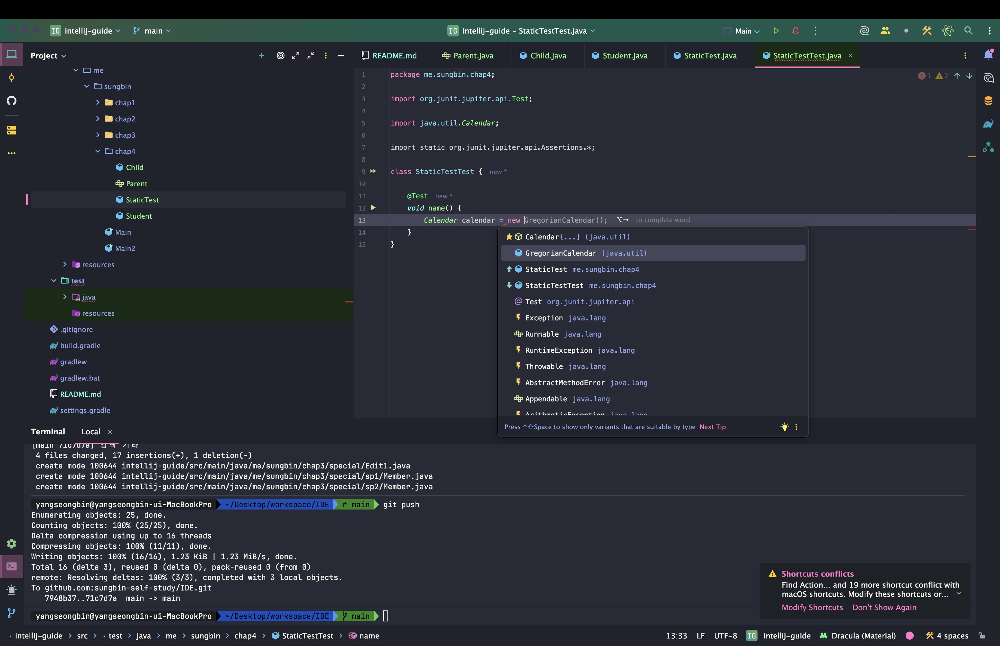

### 스태틱 메서드 자동 완성

우리는 스태틱 메서드를 사용할 때도 뭔가 자동완성이 되면 좋겠다라는 욕구가 생길 때가 있다. 대표적으로 `assertThat`이라는 테스트 코드의 스태틱 메서드를 작성할 때가 그런데 그럴 때는 맥 기준 `Ctrl + space`를 2번 입력해주면 자동으로 완성을 해준다.

### Getter/Setter/생성자 자동완성

우리는 엔티티와 같은 클래스를 만들 때 `getter/setter/생성자`를 만들어야 하는 경우가 많다. 그럴 때 우리는 한땀 한땀 만들지 않고 인텔리제이의 기능을 이용하면 된다. 먼저 `command + n`을 입력하면 아래와 같이 무엇을 만들지 선택하는 팝업이 나온다.

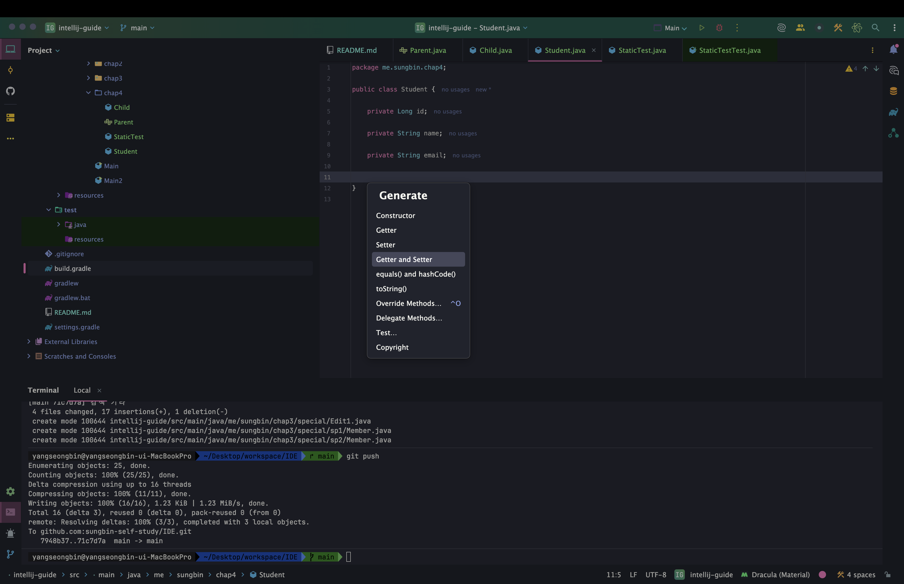

여기서 먼저 `getter/setter`를 선택하면 아래와 같이 나오는데

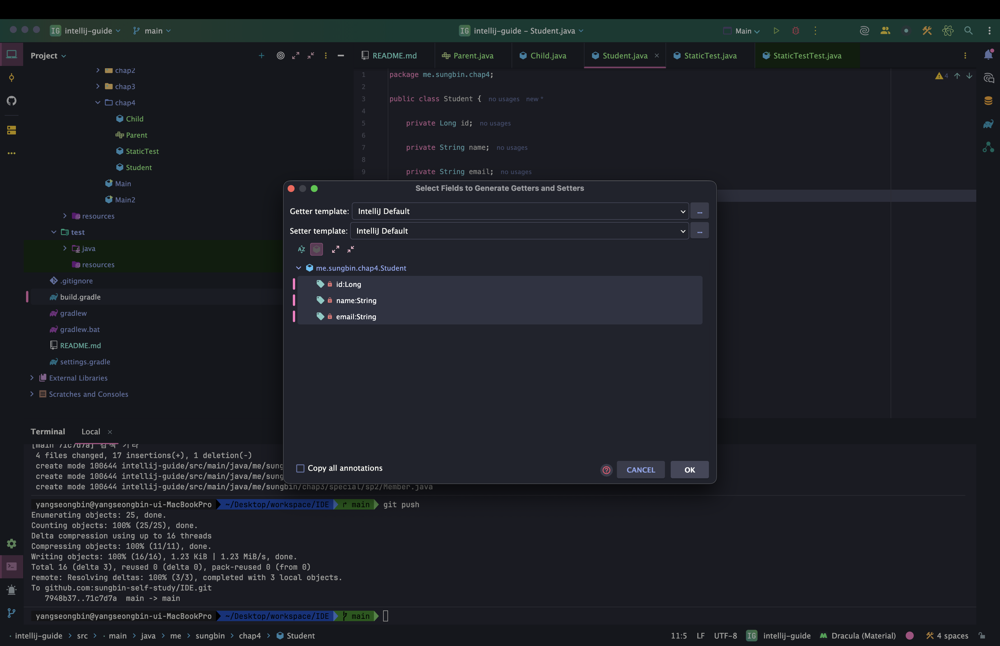

원하는 필드를 선택 후 ok를 클릭하면 자동으로 생성을 해준다.

다음으로 생성자를 만들어보자. 생성자도 `command + n`을 입력하여 Constructor를 클릭해준다.

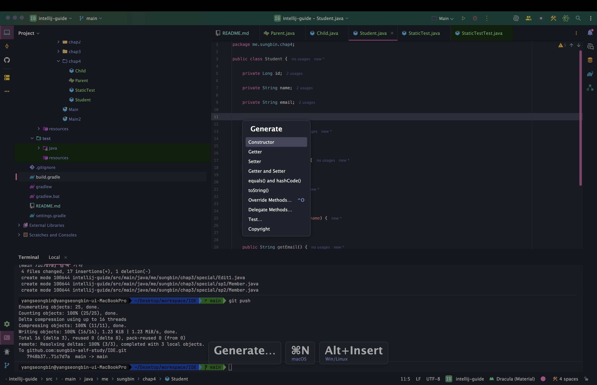

그리고 원하는 필드를 선택해서 다중 생성자를 만들수도 있고 선택을 하나도 하지 않고 select none을 클릭하면 기본 생성자를 만들어 준다.

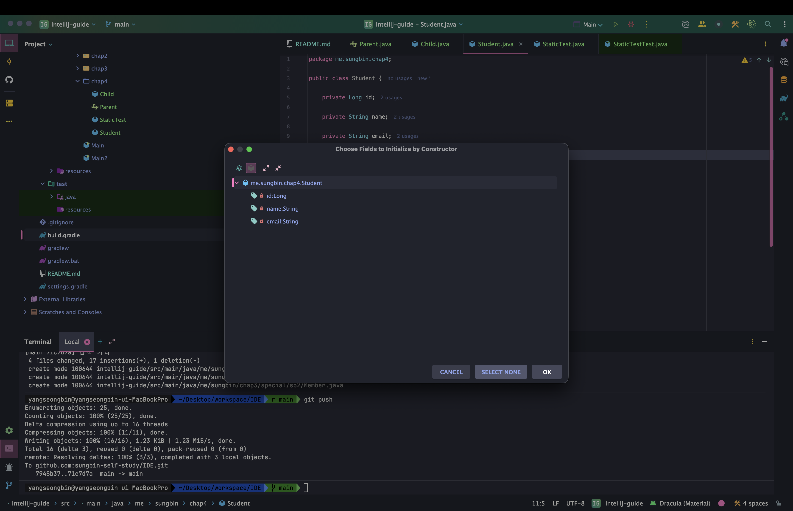

### Override 메서드 자동완성

아래와 같은 인터페이스가 있다고 해보자.

``` java
package me.sungbin.chap4;

public interface Parent {
    void buy(Long amount);

    void drive(String name);

    boolean isWishList(String item);
}
```

그리고 아래와 같이 `Child` 클래스를 만들어서 `Parent` 인터페이스를 구현해보자. 그러면 인터페이스에서 정의한 메서드 시그니쳐를 구현해야 하는데 이것을 일일이 적으면서 하면 매우 비효율적이다.

``` java
package me.sungbin.chap4;

public class Child implements Parent {
    
}
```

그럴 때 인텔리제이에서 단축키를 제공해주는데 맥 기준 `Ctrl + i`를 입력하면 아래와 같이 오버라이딩할 메서드를 선택할 수 있고 선택하여 구현해주면 된다.

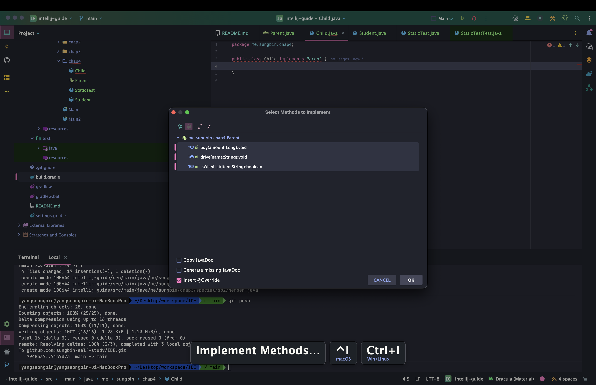

### 정리

- 스마트 자동완성
  - 맥: `Ctrl + shift + space`
  - 윈도우/리눅스: `Ctrl + shift + space`
- 스태틱 메서드 자동완성
  - 맥: `Ctrl + space * 2`
  - 윈도우/리눅스: `Ctrl + space * 2`
- Getter/Setter/생성자 자동완성
  - 맥: `command + n`
  - 윈도우/리눅스: `Alt + Insert`
- Override 메서드 자동완성
  - 맥: `Ctrl + i`
  - 윈도우/리눅스: `Ctrl + i`

## Live Template

### Live Template 소개

우리는 지금까지 인텔리제이를 학습하면서 Live Template 기능을 사용했다. 바로 `sout`이나 `main`같은 것으로 말이다. 이렇게 단축어를 몇개 입력하여 자동완성을 해주는 것을 LiveTemplate이라고 한다.

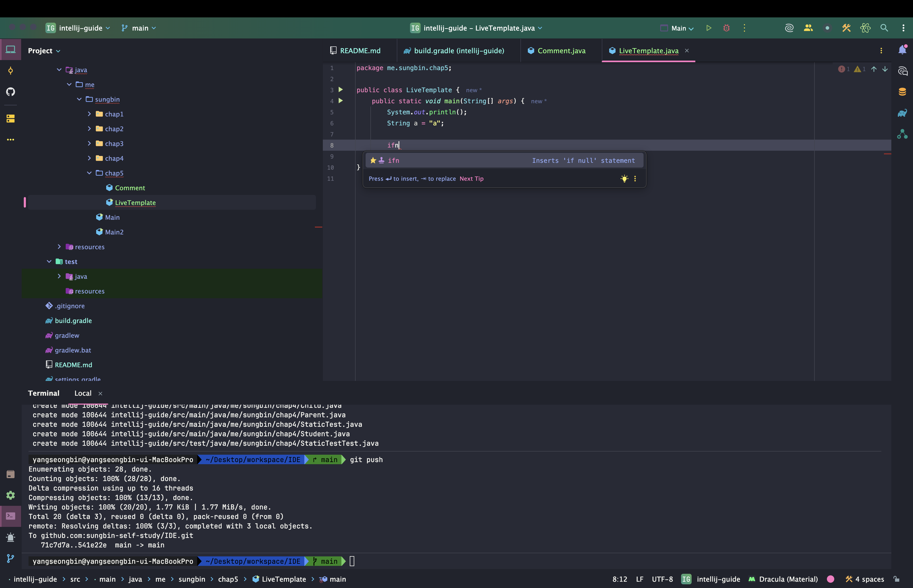

또한 해당 문맥에 사용이 가능한 Live Template 목록을 볼 수 있는 단축키가 존재하는데 맥 기준 `command + j`를 눌러주면 목록을 볼 수 있다.

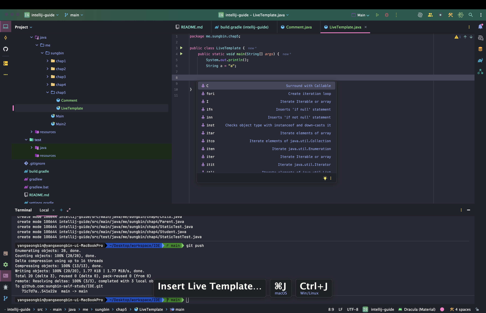

### Live Template 추가하기

그러면 우리가 실제로 커스텀하게 라이브 템플릿을 등록해보도록 하자.

``` java
package me.sungbin.chap5;

import jakarta.persistence.Entity;
import jakarta.persistence.GeneratedValue;
import jakarta.persistence.GenerationType;
import jakarta.persistence.Id;
import lombok.AccessLevel;
import lombok.Getter;
import lombok.NoArgsConstructor;

@Entity
@Getter
@NoArgsConstructor(access = AccessLevel.PROTECTED)
public class Comment {

    @Id
    @GeneratedValue(strategy = GenerationType.IDENTITY)
    private Long id;
}
```

우리가 엔티티 클래스를 정의할 때 클래스 위에 정의한 어노테이션들을 반드시 정의해줘야 한다. 반드시까지는 아니지만 자주 사용하는 어노테이션이다. 이것을 라이브 템플릿에 한번 등록해보도록 해보자.

먼저 `command + shift + a`를 사용해 Action 검색 창을 띄우고 Live Templates라고 검색하여 들어가도록 하자.

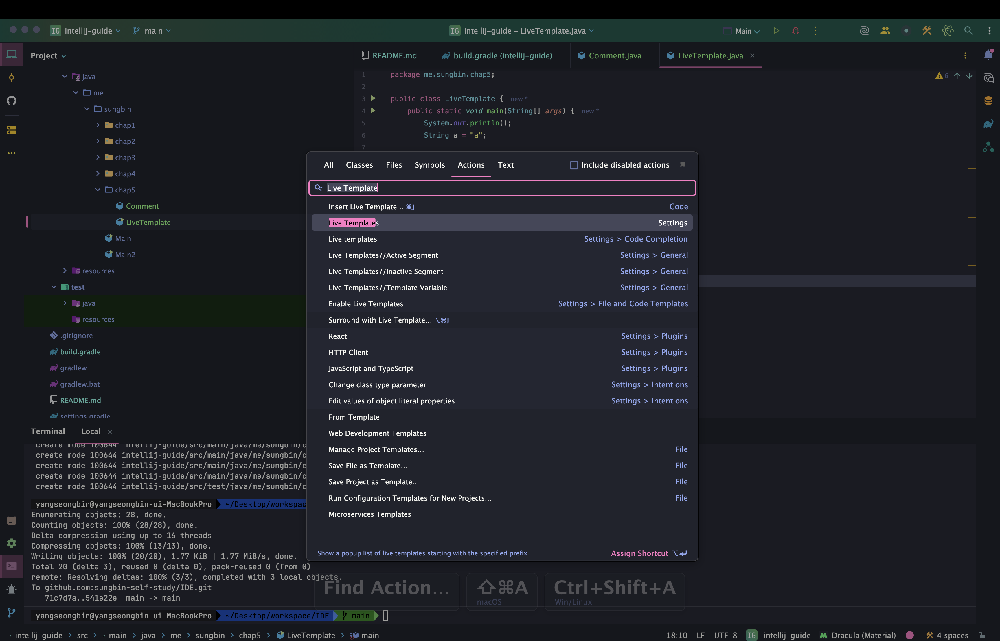

그러면 다양한 Live Template 목록들이 그룹핑되어서 나온다.

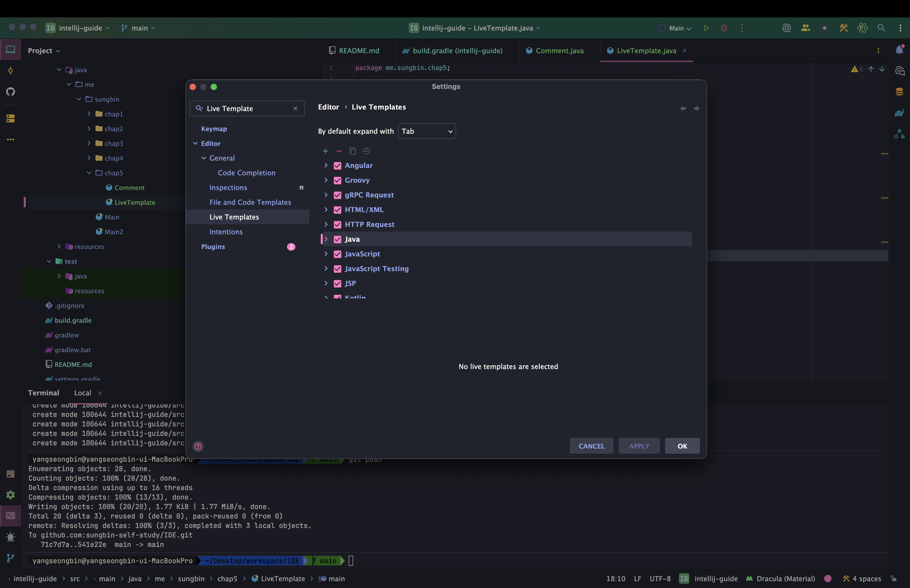

우리도 일단 그룹을 만들고 거기다가 커스텀 Live Template을 등록해보자. 위의 + 버튼을 클릭 후 2번째 그룹을 만드는 창을 클릭한다.

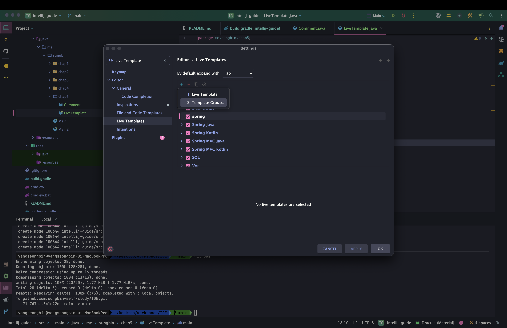

필자는 spring이라는 그룹을 만들었고 해당 그룹에 라이브 템플릿을 등록하자. 똑같이 + 버튼을 클릭하여 Live Template을 등록하고 엔티티 헤더에 들어갈 어노테이션을 등록하자. 이후에 해당 라이브 템플릿을 어느 환경에서 사용할지를 선택해준다. 하단의 Define 버튼을 눌러주면 된다.

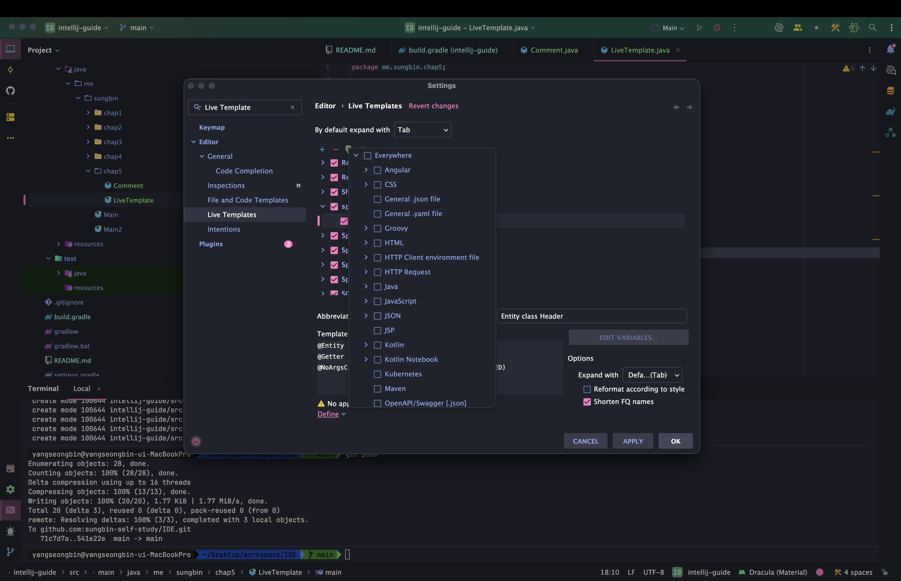

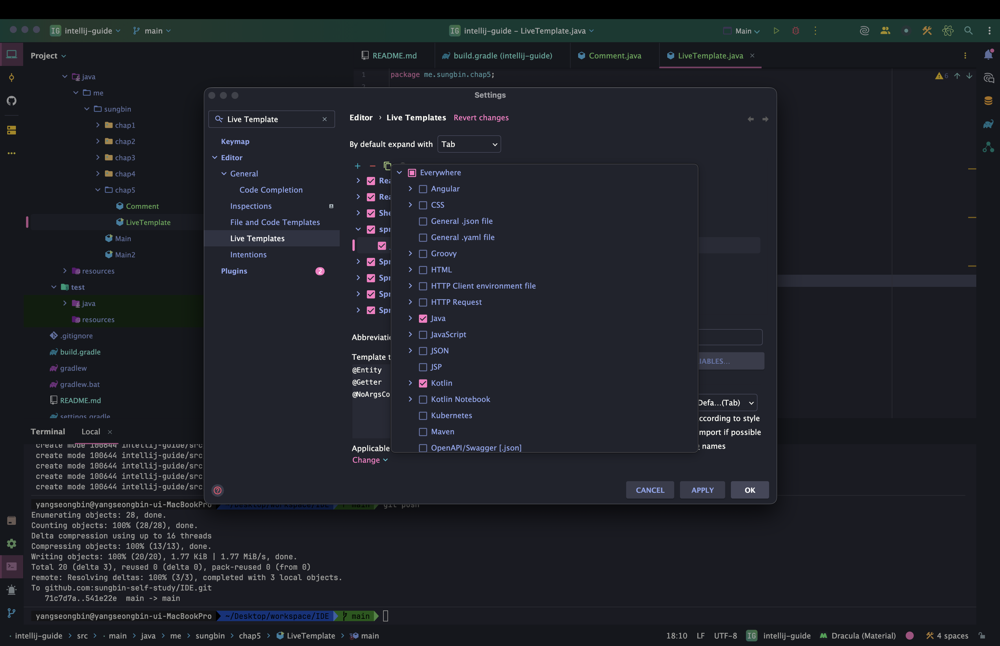

이후 적용하면 우리가 설정한 Live Template이 잘 적용됨을 알 수 있다.

### 정리

- Live Template 목록보기
  - 맥: `command + j`
  - 윈도우/리눅스: `Ctrl + j`