> 해당 포스팅은 인프런의 [IntelliJ를 시작하시는 분들을 위한 IntelliJ 가이드](https://inf.run/doaZn) 강의를 참조하여 작성한 글입니다.

## 들어가며

지금까지의 편들을 돌아보면 이런 흐름이었다.

- **코드 Edit**: 이미 있는 코드를 고치는 방법
- **포커스**: 원하는 위치로 가는 방법
- **검색**: 어디 있는지 모르는 것을 찾는 방법

그리고 이번 편은 **"새 코드를 최대한 덜 쳐서 만드는 방법"** 이다. 사실 IDE를 쓰는 가장 직접적인 이유가 바로 이것이라고 봐도 무방하다.

강사님은 이 챕터를 시작하면서 이렇게 이야기한다.

> "그래서 여러분들이 모든 자동완성 기능을 알 필요는 없지만, 최소한 이번 시간에 나오는 자동완성까지는 꼭 기억하셨으면 좋겠습니다."

자동완성은 종류가 정말 많다. 하지만 전부 알 필요는 없고, **"내가 지금 치고 있는 이 코드, 자동으로 만들 수 있지 않을까?"** 라는 의심을 습관화하는 것이 더 중요하다. 그 의심이 들 때마다 이 글을 다시
열어보면 된다.

## 자동완성

### 기본 자동완성

본격적으로 들어가기 전에 가장 기본이 되는 자동완성부터 정리하고 넘어가자.

- **맥/윈도우/리눅스 공통**: `Ctrl + space`

사실 IntelliJ는 우리가 타이핑하는 동안 알아서 자동완성 목록을 띄워준다. 그래서 이 단축키를 직접 누를 일이 없다고 생각할 수 있는데, **목록이 사라졌을 때 다시 부르거나 아무것도 안 친 상태에서 뭘 쓸 수
있는지 보고 싶을 때** 유용하다.

그런데 여기서 정말 중요한 특징이 하나 있다. **이 단축키는 누르는 횟수에 따라 검색 범위가 넓어진다.**

| 호출 횟수 | 동작                                                           |
|-----------|----------------------------------------------------------------|
| **1번**   | 현재 문맥에서 접근 가능한 클래스·메서드·필드·키워드            |
| **2번**   | 여기에 더해 **import되지 않은 클래스와 정적(static) 멤버**까지 |
| **3번**   | 의존성과 무관하게 프로젝트 전체의 클래스·인터페이스까지        |

이 표를 기억해두자. 바로 뒤에 나올 "스태틱 메서드 자동완성"의 정체가 사실 여기 2번 항목이기 때문이다.

> **[팁] `Enter`와 `Tab`의 차이**
>
> 자동완성 목록에서 항목을 고를 때 대부분 `Enter`를 누르는데, `Tab`도 쓸 수 있고 동작이 다르다.
>
> - **`Enter`**: 커서 위치에 **삽입**한다. 뒤에 있던 글자는 그대로 남는다.
> - **`Tab`**: 커서 뒤에 있던 식별자를 **덮어쓴다.**
>
> 예를 들어 `getName()`을 `getEmail()`로 바꾸고 싶을 때, `get` 앞에 커서를 두고 자동완성한 뒤 `Tab`을 누르면 기존 `getName`이 사라지고 `getEmail`로 교체된다.
> `Enter`를 눌렀다면 `getEmailgetName()`이라는 이상한 결과가 나온다.
>
> 즉 **새로 쓸 때는 `Enter`, 바꿔 쓸 때는 `Tab`** 이라고 기억하면 된다.

### 스마트 자동완성

우리는 코딩을 하다가 뭔가 자동으로 완성되는 기능도 필요함이 느껴질 때가 있을 것이다. 바로 아래와 같이 특정 인스턴스 타입의 변수를 선언했는데 해당 타입의 생성자를 어떤걸 쓸지 고민일 경우가 대표적이다. 그럴 때는
우리는 맥 기준 `Ctrl + space`를 입력했는데 이것은 해당 문법에 해당하지 않는 다양한 케이스들이 나와서 선택하기 난감할 때가 존재한다. 그럴 때는 스마트 자동완성 기능을 사용하면 되는데 맥 기준
`Ctrl + shift + space`를 사용하면 된다.

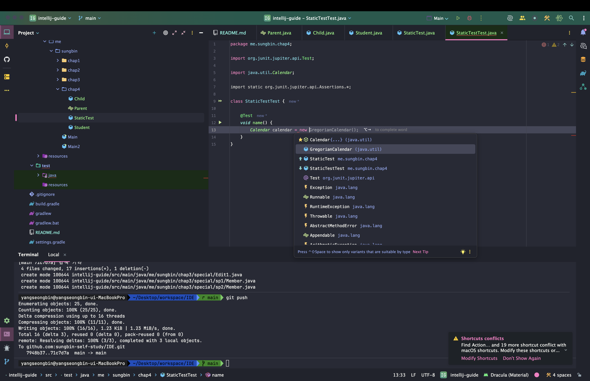

이 기능의 정식 명칭은 **Type-Matching Completion**이다. 이름 그대로 **"지금 이 자리에 들어갈 수 있는 타입"만 골라서** 보여준다.

강사님이 든 예시를 코드로 옮겨보면 이런 상황이다.

``` java
// Calendar 타입 변수에 넣을 값을 찾는 중
Calendar calendar = |
```

여기서 그냥 `Ctrl + space`를 누르면 프로젝트 안의 온갖 것들이 다 나온다. 하지만 `Ctrl + shift + space`를 누르면 **`Calendar` 타입으로 대입 가능한 것들만** 나온다.
`GregorianCalendar` 같은 것들 말이다.

메서드 인자를 넣을 때도 마찬가지다.

``` java
// Locale 타입 인자가 필요한 자리
calendar.getDisplayName(Calendar.MONTH, Calendar.LONG, |)
```

여기서 스마트 자동완성을 누르면 `Locale.KOREAN`, `Locale.US`처럼 **실제로 넣을 수 있는 값들만** 제안해준다. 강사님도 이 부분을 이렇게 정리한다.

> "그래서 우리가 이제 착각할 수 있기 때문에, 보통 자동완성 기능은 대부분 일반 자동완성을 쓰지 않고 스마트 자동완성을 많이 사용합니다."

> **여기서도 두 번 누르면 범위가 넓어진다**
>
> 스마트 자동완성도 두 번 누르면 한 단계 더 나아간다. **메서드 체이닝을 거쳐야 원하는 타입이 나오는 경우**나 **배열·컬렉션 형태**까지 제안해준다.
>
> 예를 들어 `String` 타입이 필요한 자리에서 두 번 누르면, 단순히 String 변수뿐 아니라 `someObject.getName()`처럼 **호출하면 String이 나오는 메서드**까지 찾아서 보여준다.
> 알아두면 꽤 유용하다.

### 스태틱 메서드 자동 완성

우리는 스태틱 메서드를 사용할 때도 뭔가 자동완성이 되면 좋겠다라는 욕구가 생길 때가 있다. 대표적으로 `assertThat`이라는 테스트 코드의 스태틱 메서드를 작성할 때가 그런데 그럴 때는 맥 기준
`Ctrl + space`를 2번 입력해주면 자동으로 완성을 해준다.

여기서 앞에서 정리한 표를 다시 떠올려보자. **`Ctrl + space` 두 번 = import되지 않은 클래스와 정적 멤버까지 검색**이었다. 즉 이건 별개의 새로운 기능이 아니라, **기본 자동완성을 한 번 더
누른 것**이다.

왜 이게 필요한지 상황으로 보면 명확하다.

``` java
// 테스트 코드에서 assertThat을 쓰고 싶은데
// 아직 import 문이 없는 상태
class MemberTest {
    @Test
    void 이름_검증() {
        Member member = new Member("robert");

        assertT|  // 여기서 Ctrl + space 한 번 → 아무것도 안 나온다
                  // Ctrl + space 두 번 → assertThat이 나온다!
    }
}
```

정적 메서드는 클래스 이름 없이 바로 호출하는 형태 (`assertThat(...)`)라서, **import가 되어 있지 않으면 IDE가 후보로 올리지 않는다.** 그래서 한 번 더 눌러서 "import 안 된
것까지 보여줘"라고 알려주는 것이다.

그리고 선택하면 IntelliJ가 **`import static org.assertj.core.api.Assertions.assertThat;` 을 알아서 추가해준다.** 이게 이 기능의 진짜 편리한 부분이다.

> 이 패턴은 테스트 코드를 짤 때 정말 자주 쓰인다. `assertThat`, `assertEquals`, `mock`, `when`, `verify`, `given` 같은 것들이 전부 정적 메서드이기 때문이다.
> 테스트 코드를 본격적으로 작성하기 시작하면 이 단축키를 하루에도 수십 번 누르게 된다.

### [추가] 문장 완성하기

강의에는 나오지 않지만 자동완성 계열에서 반드시 알아야 할 기능이 하나 더 있다.

- **맥**: `command + shift + enter`
- **윈도우/리눅스**: `Ctrl + shift + enter`

이 기능의 이름은 **Complete Current Statement**로, **지금 쓰다 만 문장을 문법적으로 완성**해준다. 무슨 말인지는 예시를 보면 바로 이해된다.

``` java
// 이렇게 쓰다가 (커서가 | 위치)
System.out.println("hello"|

// command + shift + enter 를 누르면
System.out.println("hello");|   // 닫는 괄호 + 세미콜론이 붙고 커서가 줄 끝으로
```

``` java
// if문을 쓰다가
if (member != null|

// command + shift + enter 를 누르면
if (member != null) {
    |                        // 중괄호가 만들어지고 커서가 안으로 들어간다
}
```

즉 **닫는 괄호를 찾아 오른쪽으로 이동하고, 세미콜론을 찍고, 중괄호를 열고, 줄바꿈하는** 일련의 동작을 한 번에 처리해준다. 특히 괄호가 여러 겹 중첩된 코드에서 "닫는 괄호 몇 개 쳐야 하지?"를 고민할
필요가 없어진다.

필자 개인적으로는 이번 편에서 소개하는 것들 중 **체감 효과가 가장 큰 단축키**라고 생각한다.

### Getter/Setter/생성자 자동완성

우리는 엔티티와 같은 클래스를 만들 때 `getter/setter/생성자`를 만들어야 하는 경우가 많다. 그럴 때 우리는 한땀 한땀 만들지 않고 인텔리제이의 기능을 이용하면 된다. 먼저 `command + n`
(윈도우/리눅스 `Alt + Insert`)을 입력하면 아래와 같이 무엇을 만들지 선택하는 팝업이 나온다.

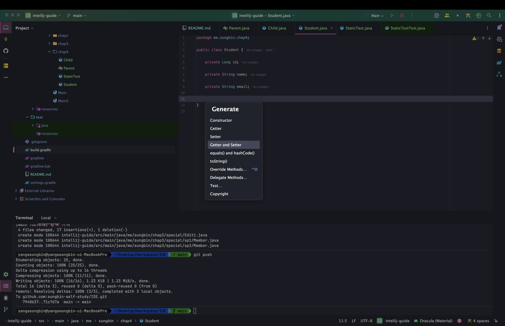

> 이전 편에서 다뤘듯이 `command + n`은 **포커스가 에디터 안에 있을 때** Generate 메뉴가 뜬다. 만약 파일 생성 메뉴가 나온다면 포커스가 좌측 파일 트리에 있는 것이니 에디터를 한 번
> 클릭하거나 `Esc`를 눌러 돌아온 뒤 다시 시도하자.

여기서 먼저 `getter/setter`를 선택하면 아래와 같이 나오는데

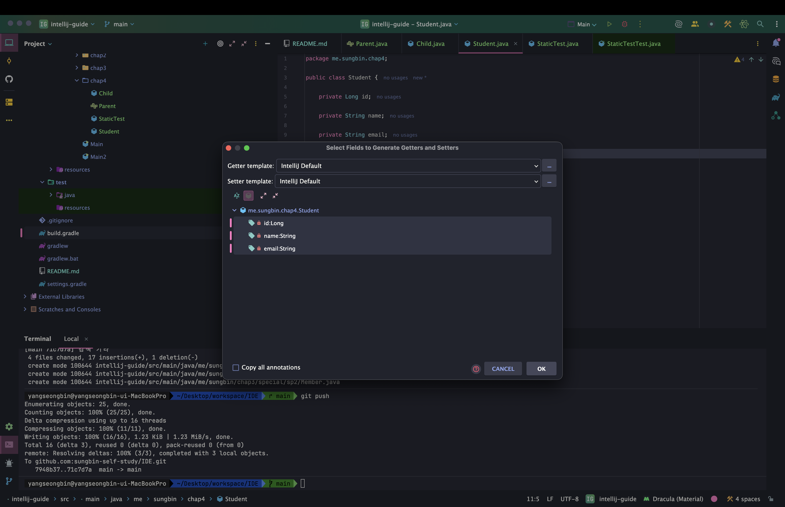

원하는 필드를 선택 후 ok를 클릭하면 자동으로 생성을 해준다.

다음으로 생성자를 만들어보자. 생성자도 `command + n`을 입력하여 Constructor를 클릭해준다.

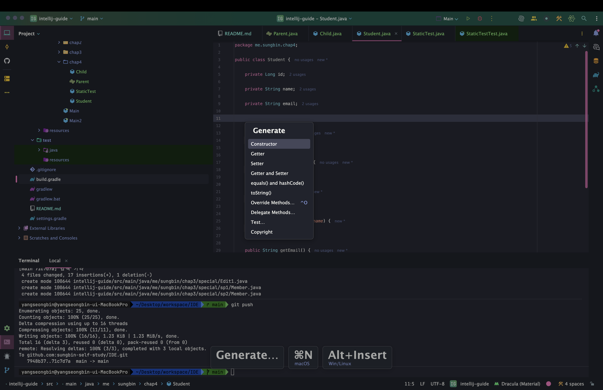

그리고 원하는 필드를 선택해서 다중 생성자를 만들수도 있고 선택을 하나도 하지 않고 select none을 클릭하면 기본 생성자를 만들어 준다.

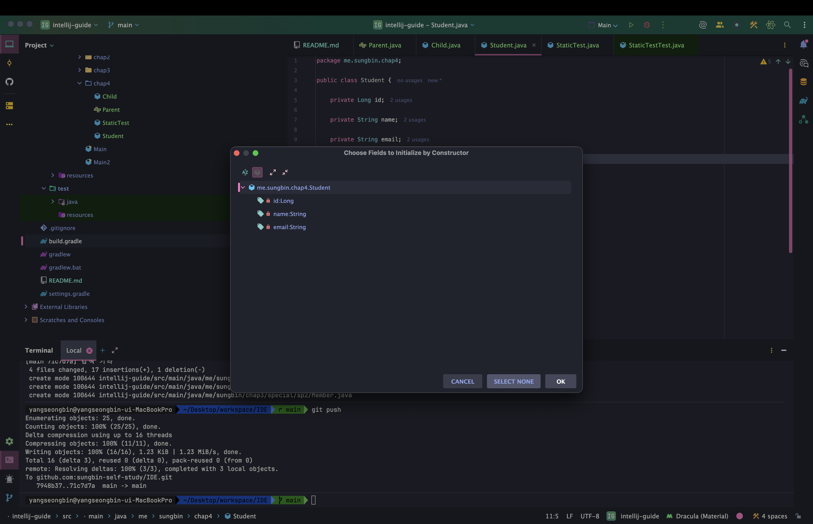

**Generate 메뉴에는 이것 말고도 유용한 것들이 많다**

`command + n`으로 뜨는 메뉴를 자세히 보면 Getter/Setter/Constructor 말고도 여러 항목이 있다. 자주 쓰는 것들만 정리하면 다음과 같다.

| 항목                                    | 설명                                                         |
|-----------------------------------------|--------------------------------------------------------------|
| **Constructor**                         | 생성자. 필드를 선택해 여러 개 만들 수 있다                   |
| **Getter / Setter / Getter and Setter** | 접근자 메서드                                                |
| **equals() and hashCode()**             | 동등성 비교 메서드. 어떤 필드를 기준으로 할지 선택할 수 있다 |
| **toString()**                          | 문자열 표현. 템플릿도 고를 수 있다                           |
| **Override Methods**                    | 부모의 메서드를 재정의                                       |
| **Delegate Methods**                    | 필드가 가진 메서드를 위임 형태로 노출                        |
| **Test**                                | 이 클래스의 테스트 클래스를 만들어준다                       |

특히 **equals/hashCode**는 손으로 짜면 실수하기 딱 좋은 코드인데, IntelliJ가 만들어주면 `null` 체크와 타입 검사까지 정석대로 넣어준다. 직접 짜지 말자.

> **실무 이야기: Lombok을 쓰면 이걸 안 써도 되지 않나?**
>
> 맞는 말이다. 실무 스프링 프로젝트에서는 대부분 Lombok을 쓰기 때문에 `@Getter`, `@Setter`, `@NoArgsConstructor` 같은 어노테이션 한 줄로 끝낸다. 뒤에서 다룰 Live
> Template 예제도 Lombok을 쓰고 있다.
>
> 그럼에도 이 기능을 알아야 하는 이유는 이렇다.
>
> - Lombok을 쓰지 않는 프로젝트 (라이브러리, 안드로이드 등)도 많다.
> - **`equals`/`hashCode`, `toString`처럼 세부 조정이 필요한 것**은 직접 생성하는 편이 낫다.
> - 자바 16부터는 `record`가 이 역할을 상당 부분 대체하기도 한다.
>
> 즉 "Lombok이 있으니 몰라도 된다"기보다는, **상황에 따라 골라 쓸 수 있는 카드가 하나 더 있는 것**이라고 생각하면 좋겠다.

### Override 메서드 자동완성

아래와 같은 인터페이스가 있다고 해보자.

``` java
package me.sungbin.chap4;

public interface Parent {
    void buy(Long amount);

    void drive(String name);

    boolean isWishList(String item);
}
```

그리고 아래와 같이 `Child` 클래스를 만들어서 `Parent` 인터페이스를 구현해보자. 그러면 인터페이스에서 정의한 메서드 시그니쳐를 구현해야 하는데 이것을 일일이 적으면서 하면 매우 비효율적이다.

``` java
package me.sungbin.chap4;

public class Child implements Parent {
    
}
```

그럴 때 인텔리제이에서 단축키를 제공해주는데 맥/윈도우/리눅스 공통으로 `Ctrl + i`를 입력하면 아래와 같이 오버라이딩할 메서드를 선택할 수 있고 선택하여 구현해주면 된다.

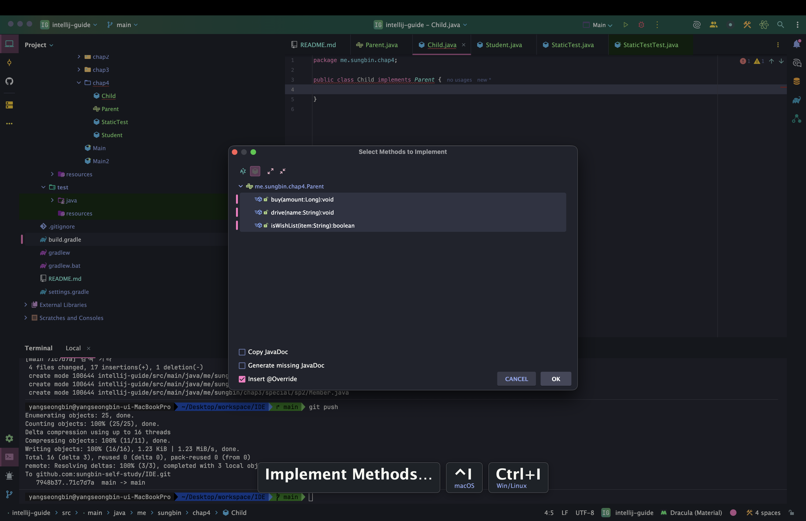

강사님도 이 부분에서 이런 당부를 한다.

> "보통 이걸 만들 때 앞에 있는 부모 클래스에 있는 메소드를 복사해서 붙여넣기 하시는데, 그렇게 하지 마시고요."

복사해서 붙여넣으면 시그니처를 잘못 옮기거나 `@Override` 어노테이션을 빼먹기 쉽다. 이 단축키를 쓰면 **반환 타입, 파라미터, 어노테이션까지 정확하게** 만들어준다.

> **알아두면 좋은 점: `Ctrl + i`와 `Ctrl + o`는 다르다**
>
> 사실 IntelliJ에는 비슷하지만 다른 두 개의 단축키가 있다.
>
> | 단축키 | 이름 | 대상 |
> | --- | --- | --- |
> | **`Ctrl + i`** | Implement Methods | **아직 구현되지 않은** 추상 메서드 (인터페이스 메서드, abstract 메서드) |
> | **`Ctrl + o`** | Override Methods | **이미 구현이 있는** 부모의 메서드를 재정의 |
>
> 위 예제처럼 인터페이스를 구현하는 상황은 `Ctrl + i`가 맞다. 반면 `Object`의 `toString()`을 재정의하거나, 부모 클래스의 기본 동작을 바꾸고 싶을 때는 `Ctrl + o`를 쓴다.
>
> 헷갈린다면 이렇게 기억하자. **"없는 걸 만들면 i (Implement), 있는 걸 바꾸면 o (Override)"** 다.
>
> 참고로 두 기능 모두 `command + n`(Generate) 메뉴 안에도 들어 있으니, 단축키가 기억나지 않으면 거기서 찾아도 된다.

### [추가] 후위 완성 (Postfix Completion)

앞선 편들에서 몇 번 언급하고 넘어갔던 기능이다. 이제 제대로 다뤄보자.

**후위 완성**은 지금까지의 자동완성과 발상이 반대다. 일반 자동완성이 "약어를 먼저 치고 코드를 만드는" 방식이라면, 후위 완성은 **이미 써놓은 표현식 뒤에 `.`을 찍어서 그 표현식을 감싸는** 방식이다.

말로 하면 어려우니 예시를 보자.

``` java
// 이렇게 쓰고
"hello".sout

// Tab 을 누르면
System.out.println("hello");
```

``` java
// 이렇게 쓰고
memberRepository.findById(id).var

// Tab 을 누르면 (변수 이름도 알아서 제안해준다)
Optional<Member> member = memberRepository.findById(id);
```

``` java
// 이렇게 쓰고
member.nn

// Tab 을 누르면
if (member != null) {
    
}
```

이게 왜 좋으냐면, **우리가 생각하는 순서와 타이핑 순서가 일치하기 때문**이다. 보통 우리는 "member가 null이 아니면..."이라고 생각하지, "if문을 쓰고 그 안에 member를 넣고..."라고
생각하지 않는다. 후위 완성은 그 생각의 순서를 그대로 코드로 옮길 수 있게 해준다.

자바에서 자주 쓰는 후위 템플릿을 정리하면 다음과 같다.

| 템플릿             | 결과                             |
|--------------------|----------------------------------|
| `.var`             | 표현식을 지역 변수로 추출        |
| `.field`           | 표현식을 필드로 추출             |
| `.sout`            | `System.out.println(표현식);`    |
| `.return`          | `return 표현식;`                 |
| `.if`              | `if (표현식) { }`                |
| `.null`            | `if (표현식 == null) { }`        |
| `.nn` / `.notnull` | `if (표현식 != null) { }`        |
| `.not`             | `!표현식`                        |
| `.for`             | `for (T item : 표현식) { }`      |
| `.fori`            | 인덱스 기반 for 루프             |
| `.while`           | `while (표현식) { }`             |
| `.switch`          | `switch (표현식) { }`            |
| `.try`             | `try { 표현식 } catch (...) { }` |
| `.throw`           | `throw 표현식;`                  |
| `.cast`            | `((타입) 표현식)`                |
| `.new`             | `new 표현식()`                   |
| `.opt`             | `Optional.ofNullable(표현식)`    |

전체 목록과 활성화 여부는 `Settings` → `Editor` → `General` → `Postfix Completion`에서 확인할 수 있다. 여기서 각 템플릿을 클릭하면 **변환 전후 예시를 오른쪽에서
보여주기 때문에**, 한 번쯤 쭉 훑어보는 것을 추천한다. 확장 키도 `Tab` / `Enter` / `Space` 중에 고를 수 있다.

> **Live Template과 무엇이 다른가?**
>
> | | Live Template | Postfix Completion |
> | --- | --- | --- |
> | 입력 위치 | 빈 곳에서 약어 입력 | **표현식 뒤에** `.약어` 입력 |
> | 예시 | `sout` → `System.out.println()` | `"hello".sout` → `System.out.println("hello")` |
> | 발상 | 코드를 **만든다** | 이미 쓴 코드를 **감싼다** |
>
> 둘 다 알아두면 상황에 따라 편한 쪽을 쓸 수 있다. 참고로 `sout`처럼 이름이 같은 것도 많은데, 앞에 표현식이 있으면 후위 완성으로, 없으면 라이브 템플릿으로 동작한다고 이해하면 된다.

### [추가] AI 기반 자동완성 - Full Line Code Completion

강의 시점 이후에 생긴 기능이라 짚고 넘어가려고 한다.

**IntelliJ IDEA 2024.1부터 Full Line Code Completion**이라는 기능이 IDE에 기본 번들되어 있다. 지금까지 소개한 자동완성이 "이 자리에 올 수 있는 후보 목록"을 보여주는
것이었다면, 이건 **한 줄 전체를 회색 글씨로 미리 제안**해준다. `Tab`을 누르면 그대로 입력된다.

여기서 중요한 특징이 하나 있다.

> **모델이 로컬에서 동작한다. 즉 코드가 외부로 전송되지 않는다.**

JetBrains가 언어별로 학습시킨 소형 모델 (2024.1 기준 약 1억 파라미터)을 **사용자 컴퓨터에서 직접 실행**하는 방식이다. 그래서 보안 정책상 외부 AI 도구를 쓸 수 없는 회사 환경에서도 사용할 수
있다는 것이 큰 장점이다. 자바와 코틀린을 포함해 파이썬, 자바스크립트, 타입스크립트, Go 등 주요 언어를 지원한다.

설정은 `Settings` → `Editor` → `General` → `Inline Completion`에서 켜고 끌 수 있다.

> 다만 이것이 앞에서 배운 단축키들을 대체하지는 않는다. AI 제안은 어디까지나 **확률적으로 그럴듯한 코드**를 보여주는 것이고, `Ctrl + shift + space`나 `Ctrl + i` 같은 기능은
> **문법적으로 정확한 코드**를 만들어준다. 후자를 알고 있어야 전자의 제안이 맞는지 판단할 수 있다.

### 정리

- 기본 자동완성
    - 맥/윈도우/리눅스: `Ctrl + space`
    - 두 번 누르면 import 안 된 클래스·정적 멤버까지 검색
- 스마트 자동완성
    - 맥: `Ctrl + shift + space`
    - 윈도우/리눅스: `Ctrl + shift + space`
- 스태틱 메서드 자동완성
    - 맥: `Ctrl + space * 2`
    - 윈도우/리눅스: `Ctrl + space * 2`
- 문장 완성하기
    - 맥: `command + shift + enter`
    - 윈도우/리눅스: `Ctrl + shift + enter`
- Getter/Setter/생성자 자동완성
    - 맥: `command + n`
    - 윈도우/리눅스: `Alt + Insert`
- 인터페이스 메서드 구현 (Implement)
    - 맥/윈도우/리눅스: `Ctrl + i`
- 부모 메서드 재정의 (Override)
    - 맥/윈도우/리눅스: `Ctrl + o`
- 후위 완성
    - 표현식 뒤에 `.var`, `.sout`, `.nn` 등을 입력 후 `Tab`

## Live Template

### Live Template 소개

우리는 지금까지 인텔리제이를 학습하면서 Live Template 기능을 사용했다. 바로 `sout`이나 `main`같은 것으로 말이다. 이렇게 단축어를 몇개 입력하여 자동완성을 해주는 것을
LiveTemplate이라고 한다.

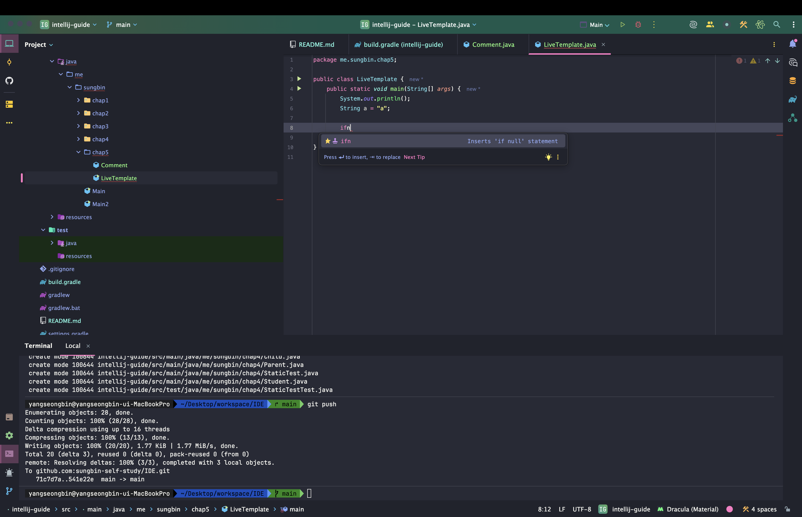

강사님은 이 기능을 이렇게 소개한다.

> "한 번만 설명을 들으시면 활용도가 굉장히 높습니다. 저도 굉장히 많이 사용하는 기능이고요. 그래서 꼭 들으셨으면 좋겠습니다."

기본으로 제공되는 것 중 자주 쓰는 것들을 정리하면 다음과 같다.

| 약어            | 결과                                         |
|-----------------|----------------------------------------------|
| `psvm` / `main` | `public static void main(String[] args) { }` |
| `sout`          | `System.out.println();`                      |
| `soutv`         | 변수를 이름과 함께 출력                      |
| `ifn`           | `if (변수 == null) { }`                      |
| `inn`           | `if (변수 != null) { }`                      |
| `iter`          | 향상된 for 루프 (for-each)                   |
| `itar`          | 인덱스 기반 for 루프                         |
| `psfs`          | `public static final String`                 |
| `thr`           | `throw new ...`                              |

또한 해당 문맥에 사용이 가능한 Live Template 목록을 볼 수 있는 단축키가 존재하는데 맥 기준 `command + j`(윈도우/리눅스 `Ctrl + j`)를 눌러주면 목록을 볼 수 있다.

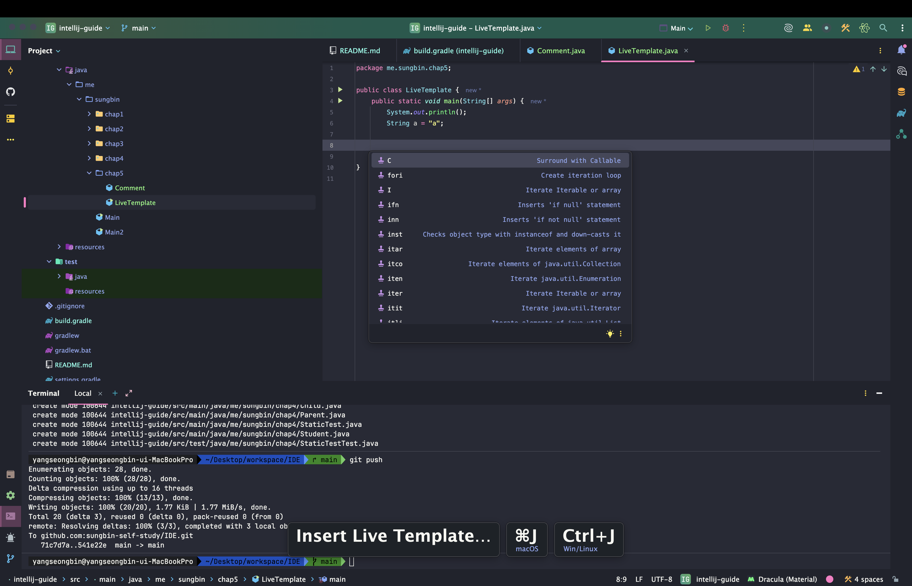

여기서 **"해당 문맥에 사용 가능한"** 이라는 부분이 핵심이다. 강사님의 표현을 빌리면 이렇다.

> "그러면 여기서 이 메인 메소드 안에서 나올 수 있는 모든 축약어가 나온 거예요."

즉 클래스 바깥에서 누른 것과 메서드 안에서 누른 것의 목록이 다르다. IntelliJ가 지금 위치에서 문법적으로 가능한 것만 걸러주기 때문이다. 그래서 **약어를 외우지 못했어도 이 단축키만 누르면 쓸 수 있는
것들을 볼 수 있다.**

> **[추가] 선택한 코드를 감싸는 Live Template**
>
> 이미 작성한 코드를 `try-catch`나 `if`로 감싸고 싶을 때가 있다. 그럴 때는 감쌀 코드를 선택한 뒤 아래 단축키를 누르면 된다.
>
> - **맥**: `command + option + j`
> - **윈도우/리눅스**: `Ctrl + Alt + j`
>
> 그러면 `try / catch`, `if`, `for`, `synchronized`, `Runnable` 등으로 감쌀 수 있는 목록이 나온다. 참고로 이것보다 조금 더 넓은 범위의 기능으로 **Surround
With (`command + option + t` / `Ctrl + Alt + t`)** 도 있으니 함께 알아두면 좋다.

### Live Template 추가하기

그러면 우리가 실제로 커스텀하게 라이브 템플릿을 등록해보도록 하자.

``` java
package me.sungbin.chap5;

import jakarta.persistence.Entity;
import jakarta.persistence.GeneratedValue;
import jakarta.persistence.GenerationType;
import jakarta.persistence.Id;
import lombok.AccessLevel;
import lombok.Getter;
import lombok.NoArgsConstructor;

@Entity
@Getter
@NoArgsConstructor(access = AccessLevel.PROTECTED)
public class Comment {

    @Id
    @GeneratedValue(strategy = GenerationType.IDENTITY)
    private Long id;
}
```

우리가 엔티티 클래스를 정의할 때 클래스 위에 정의한 어노테이션들을 반드시 정의해줘야 한다. 반드시까지는 아니지만 자주 사용하는 어노테이션이다. 이것을 라이브 템플릿에 한번 등록해보도록 해보자.

강사님이 이 기능을 소개하는 맥락도 정확히 여기에 있다.

> "이거 외에도 우리가 내가 쓰고 싶은 혹은 자주 쓰는 코드들이 있는데, 이걸 라이브 템플릿으로 만들 수 없을까라고 고민을 하실 수 있어요."

먼저 `command + shift + a`를 사용해 Action 검색 창을 띄우고 Live Templates라고 검색하여 들어가도록 하자. (이전 편에서 배운 Action 검색이 여기서 바로 쓰인다.)

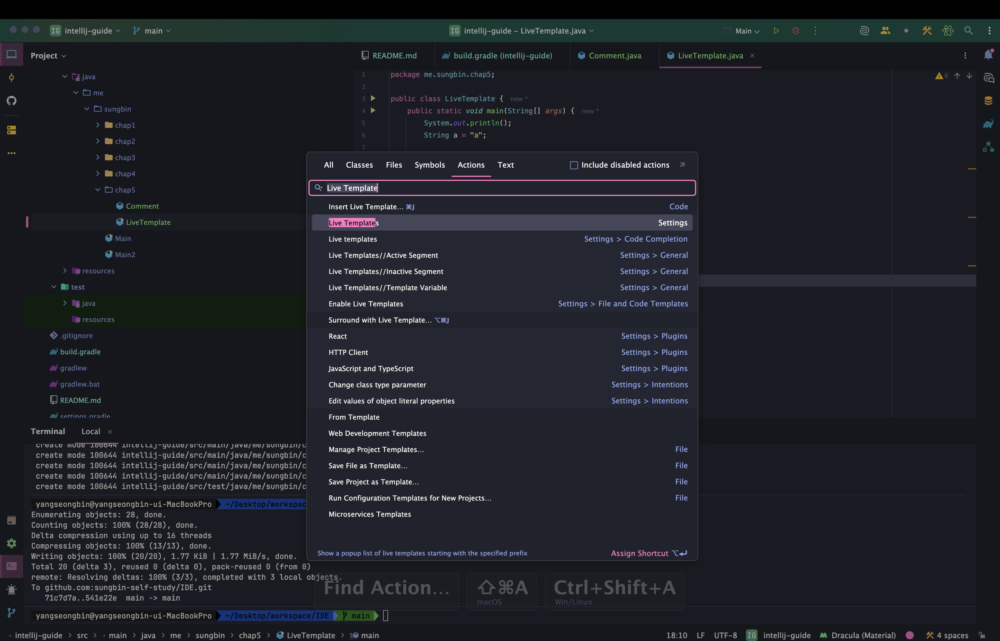

그러면 다양한 Live Template 목록들이 그룹핑되어서 나온다.

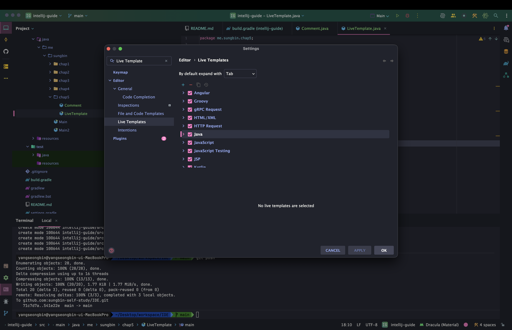

우리도 일단 그룹을 만들고 거기다가 커스텀 Live Template을 등록해보자. 위의 + 버튼을 클릭 후 2번째 그룹을 만드는 창을 클릭한다.

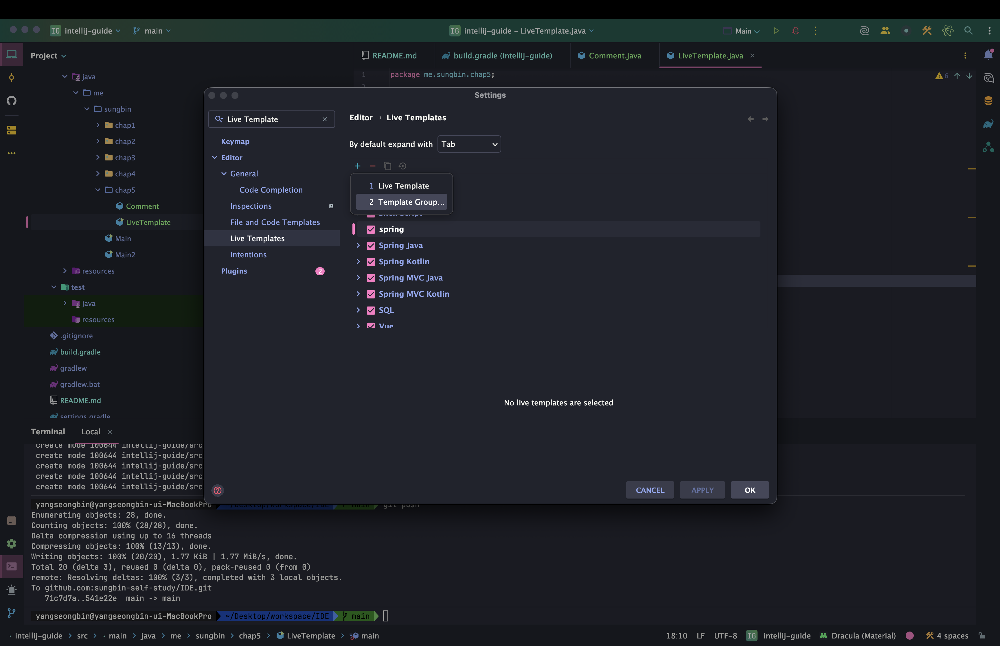

필자는 spring이라는 그룹을 만들었고 해당 그룹에 라이브 템플릿을 등록하자. 똑같이 + 버튼을 클릭하여 Live Template을 등록하고 엔티티 헤더에 들어갈 어노테이션을 등록하자.

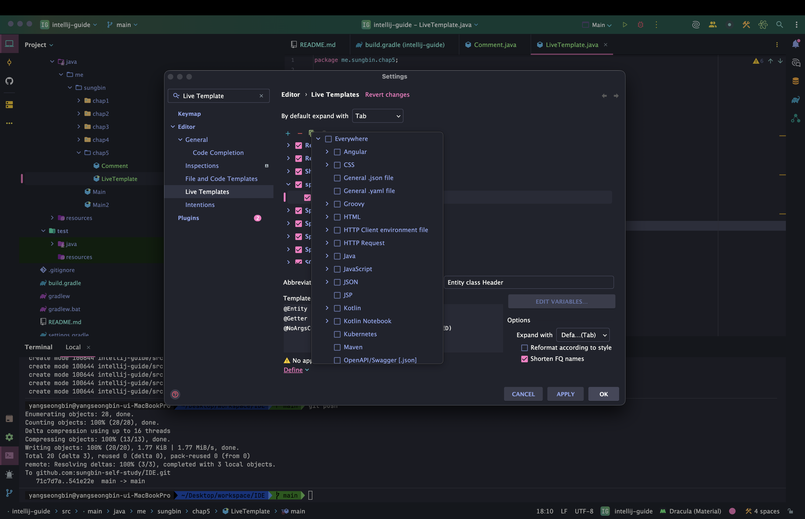

이때 입력해야 하는 항목이 세 가지인데, 각각의 의미는 다음과 같다.

| 항목              | 의미                                                            | 예시                   |
|-------------------|-----------------------------------------------------------------|------------------------|
| **Abbreviation**  | 실제로 입력할 약어                                              | `ent`                  |
| **Description**   | 이 템플릿이 무엇인지에 대한 설명. 자동완성 목록에 함께 표시된다 | `entity 클래스 header` |
| **Template text** | 실제로 만들어질 코드                                            | 아래 참고              |

이후에 해당 라이브 템플릿을 어느 환경에서 사용할지를 선택해준다. 하단의 Define 버튼을 눌러주면 된다.

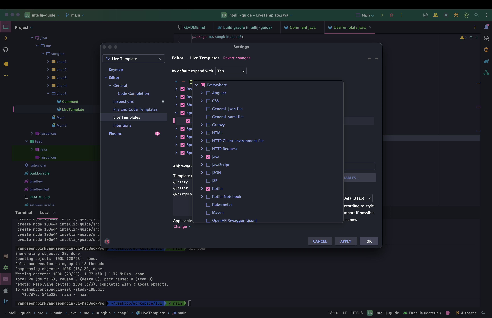

> **⚠️ Define을 빼먹으면 동작하지 않는다**
>
> 이 단계가 가장 많이 실수하는 부분이다. Template text를 다 작성하고 저장했는데 막상 약어를 쳐도 아무 일이 안 일어난다면, 십중팔구 **컨텍스트 (Applicable context)를 지정하지 않은
것**이다.
>
> 템플릿 편집 화면 하단에 노란 경고와 함께 `Define` 링크가 보이는데, 이걸 눌러서 **Java**를 체크해줘야 한다. 자바 안에서도 더 좁게 지정할 수 있다.
>
> - **Java → Declaration**: 클래스 선언부 위치에서 동작 (어노테이션·필드·메서드 선언 자리)
> - **Java → Statement**: 메서드 안의 실행문 위치에서 동작
> - **Java → Expression**: 표현식 자리에서 동작
>
> 위 엔티티 헤더 예제처럼 클래스 선언 위에 쓰는 것이라면 **Declaration**을 선택하는 것이 적절하다.

이후 적용하면 우리가 설정한 Live Template이 잘 적용됨을 알 수 있다.

### [핵심] 템플릿 변수 사용하기

여기까지만 하면 "고정된 코드 덩어리"를 넣는 것에 그친다. 라이브 템플릿이 진짜 강력해지는 것은 **변수**를 쓸 때부터다.

Template text에서 `$변수명$`처럼 달러 기호로 감싸면 그 자리가 **입력 칸**이 된다. 템플릿을 확장한 뒤 `Tab`을 누르면 변수 자리를 차례대로 이동하며 값을 채워 넣을 수 있다.

특별한 의미를 가진 변수도 몇 개 있다.

| 변수            | 의미                                                           |
|-----------------|----------------------------------------------------------------|
| `$END$`         | 모든 입력이 끝난 뒤 **커서가 최종적으로 놓일 위치**            |
| `$SELECTION$`   | Surround 형태로 쓸 때 **선택했던 코드가 들어갈 자리**          |
| 임의의 `$이름$` | 사용자가 입력할 자리. 같은 이름을 여러 번 쓰면 동시에 입력된다 |

앞의 엔티티 예제를 변수를 써서 개선하면 이렇게 된다.

```
@Entity
@Getter
@NoArgsConstructor(access = AccessLevel.PROTECTED)
public class $NAME$ {

    @Id
    @GeneratedValue(strategy = GenerationType.IDENTITY)
    private Long id;

    $END$
}
```

이제 `ent`를 입력하고 확장하면 클래스 이름 자리에 커서가 먼저 가고, 이름을 입력한 뒤 `Tab`이나 `Enter`를 누르면 본문 안쪽으로 커서가 이동한다. 훨씬 쓸 만해졌다.

**Edit variables로 자동 입력까지**

변수 자리에 미리 정해진 값을 자동으로 채우게 할 수도 있다. 템플릿 편집 화면의 `Edit variables` 버튼을 누르면 각 변수에 **함수**를 지정할 수 있다.

자주 쓰는 함수 몇 개만 소개하면 이렇다.

| 함수                    | 결과                         |
|-------------------------|------------------------------|
| `className()`           | 현재 클래스 이름             |
| `methodName()`          | 현재 메서드 이름             |
| `date()` / `time()`     | 현재 날짜 / 시간             |
| `user()`                | 현재 사용자 이름             |
| `suggestVariableName()` | 문맥에 맞는 변수 이름을 제안 |

예를 들어 로거 필드를 만드는 템플릿이라면 이렇게 쓸 수 있다.

```
private static final Logger log = LoggerFactory.getLogger($CLASS$.class);$END$
```

여기서 `Edit variables`로 `$CLASS$` 변수에 `className()` 함수를 지정해두면, 약어를 치는 순간 **현재 클래스 이름이 자동으로 채워진다.**

**두 개의 유용한 체크박스**

템플릿 편집 화면 오른쪽에 있는 옵션 중 아래 두 개는 켜두는 것을 추천한다.

- **Reformat according to style**: 삽입된 코드를 프로젝트의 코드 스타일에 맞게 자동 정렬해준다.
- **Shorten FQ names**: 템플릿에 `java.util.List`처럼 전체 경로를 써두면, 삽입할 때 `List`로 줄이고 **import 문을 자동으로 추가**해준다. 어노테이션이나 클래스를 쓰는
  템플릿이라면 사실상 필수다.

### 실전에서 등록해두면 좋은 템플릿들

필자가 실제로 등록해두고 쓰는 것들을 예시로 몇 개 남겨둔다. 각자의 프로젝트 스타일에 맞춰 바꿔 쓰면 된다.

**1. 테스트 메서드 (약어: `tm`, 컨텍스트: Java Declaration)**

```
@Test
@DisplayName("$DESCRIPTION$")
void $METHOD_NAME$() {
    // given
    $END$

    // when

    // then
}
```

**2. 로거 선언 (약어: `logger`, 컨텍스트: Java Declaration)**

```
private static final Logger log = LoggerFactory.getLogger($CLASS$.class);
```

**3. 스프링 REST 컨트롤러 헤더 (약어: `rest`, 컨텍스트: Java Declaration)**

```
@RestController
@RequiredArgsConstructor
@RequestMapping("/api/$PATH$")
public class $NAME$Controller {

    $END$
}
```

이런 식으로 **"내가 이번 주에 세 번 이상 똑같이 친 코드"** 를 발견하면 그때마다 하나씩 등록해두자. 처음부터 많이 만들 필요는 없고, 그렇게 쌓인 것들이 나중에 큰 차이를 만든다.

> **참고: Live Template과 File Template은 다르다**
>
> 비슷해 보이지만 다른 기능이 하나 더 있다. **File Template**은 "새 파일을 만들 때 기본으로 들어가는 내용"을 정하는 기능이다. 예를 들어 새 자바 클래스를 만들 때마다 상단에 저작권 주석을 넣고
> 싶다면 File Template을 수정하면 된다.
>
> - **Live Template**: 파일 **안에서** 약어를 쳐서 코드 조각을 넣는다
> - **File Template**: 파일을 **만들 때** 기본 내용이 채워진다
>
> File Template은 `Settings` → `Editor` → `File and Code Templates`에서 설정할 수 있다.

### 정리

- Live Template 목록보기
    - 맥: `command + j`
    - 윈도우/리눅스: `Ctrl + j`
- 선택 영역을 Live Template으로 감싸기
    - 맥: `command + option + j`
    - 윈도우/리눅스: `Ctrl + Alt + j`
- Live Template 설정 열기
    - Action 검색 (`command + shift + a`)에서 `Live Templates`
    - 또는 `Settings` → `Editor` → `Live Templates`
- 커스텀 템플릿 등록 시 체크할 것
    - Abbreviation (약어), Description (설명), Template text (코드)
    - **Define으로 컨텍스트 (Java 등) 반드시 지정**
    - 변수는 `$이름$`, 최종 커서 위치는 `$END$`
    - `Shorten FQ names` 옵션을 켜면 import를 자동으로 처리해준다

## 마무리

이번 편에서 다룬 것들을 성격별로 묶어보면 이렇게 정리된다.

| 분류            | 기능                         | 언제 쓰나                        |
|-----------------|------------------------------|----------------------------------|
| **후보 좁히기** | 스마트 자동완성              | 타입이 정해진 자리를 채울 때     |
| **범위 넓히기** | `Ctrl + space` 두 번         | import 안 된 정적 메서드를 쓸 때 |
| **문법 채우기** | 문장 완성                    | 괄호·세미콜론이 귀찮을 때        |
| **뼈대 만들기** | Generate, Implement/Override | 클래스 구조를 만들 때            |
| **감싸기**      | 후위 완성                    | 이미 쓴 표현식을 활용할 때       |
| **반복 줄이기** | Live Template                | 매번 똑같이 치는 코드가 있을 때  |

이번 편도 우선순위를 매겨보자면 아래 네 개를 추천한다.

1. **`Ctrl + space` 두 번** — 테스트 코드를 짜기 시작하면 없으면 안 된다.
2. **`command + shift + enter` (문장 완성)** — 익히면 타이핑이 눈에 띄게 줄어든다.
3. **후위 완성 `.var` / `.nn` / `.sout`** — 생각하는 순서대로 코드를 쓸 수 있게 해준다.
4. **`command + n` (Generate)** — equals/hashCode는 절대 손으로 짜지 말자.

그리고 Live Template은 **당장 많이 만들려고 하지 말자.** 대신 앞으로 코딩하다가 "이거 지난주에도 똑같이 쳤는데?" 싶은 순간이 오면, 그때 하나씩 등록하면 된다. 그게 가장 오래 가는 방법이다.

다음 편에서는 **리팩토링**을 다룬다. 지금까지가 "코드를 만드는" 이야기였다면, 다음은 **"이미 만든 코드의 구조를 안전하게 바꾸는"** 이야기다. 앞선 편들에서 "이건 리팩토링 편에서 다룬다"고 미뤄뒀던
Rename을 비롯해, 변수·메서드 추출 같은 기능들을 알아보도록 하겠다.
