> 해당 포스팅은 인프런의 [IntelliJ를 시작하시는 분들을 위한 IntelliJ 가이드](https://inf.run/doaZn) 강의를 참조하여 작성한 글입니다.

## 메인 메서드 생성 및 실행

먼저 우리는 자바 어플리케이션을 만들기 위해서는 자바 파일을 생성해야 하며, 자바 파일을 생성하기 위한 디렉토리 세팅을 해줘야 한다. 아마 이전 포스팅을 만들었다면 자바에서 실행하는 디렉토리 환경인 `src` 디렉토리가 있겠으나 혹시 몰라서 해당 환경부터 같이 만들어 보려고 한다. 루트 프로젝트 경로에다가 단축키로 맥 기준 `command + n` 혹은 윈도우나 리눅스 기준 `alt + insert`키를 입력하면 아래 화면처럼 나올 것이다.

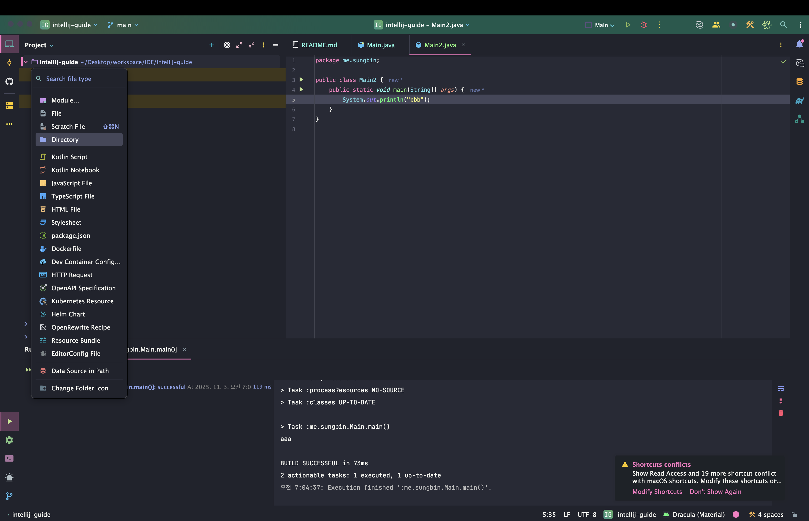

이제 자바의 기본 경로인 `src/main/java`를 입력하면 자동으로 생성해준다. 여기서 /는 하위 디렉토리를 의미하며 인텔리제이에서 /를 인식하여 자동으로 하위 디렉토리로 만들어 준다. 이미 필자는 만들어져 있어서 IDE에서 이미 존재한다라고 뜨지만 독자들은 경고문이 안 뜰테니 걱정하지 않았으면 좋겠다.

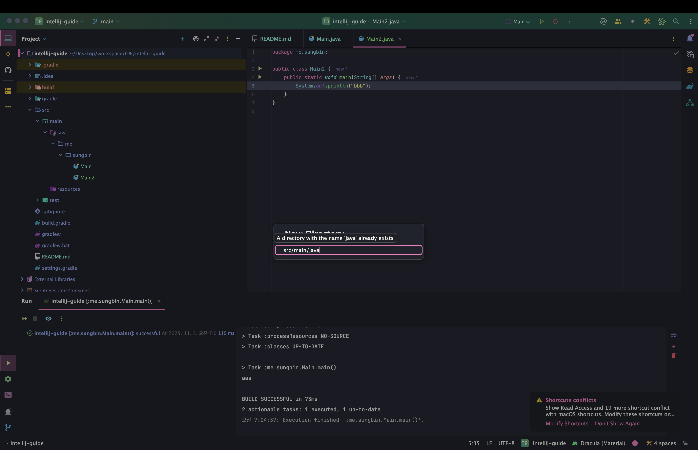

이후에 자바 어플리케이션을 만들 때 패키지라는 것을 만들어야 한다. 안 만들어도 무방하지만 실무에서는 패키지를 많이 만든다. 패키지도 디렉토리를 생성하는 것과 같이 맥 기준 `command + n` 혹은 윈도우나 리눅스 기준 `alt + insert`키를 입력하여 package를 찾아서 엔터를 눌러주면 아래와 같은 화면이 나온다.

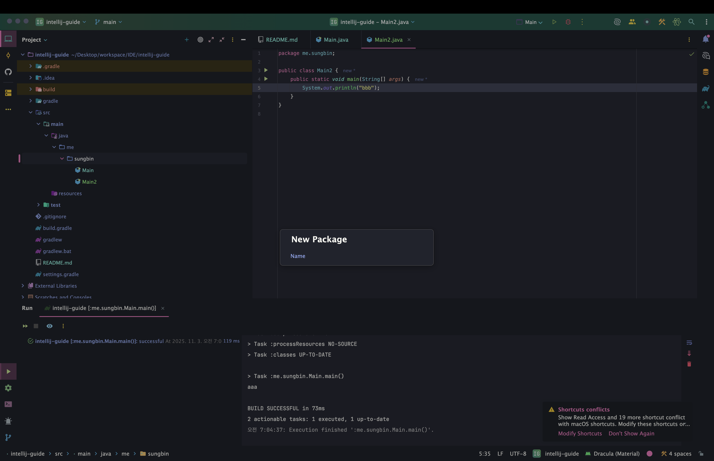

여기서 우리는 원하는 패키지명을 입력해주면 된다. 필자는 `me.sungbin`이라는 패키지로 진행을 할 예정이다. 여기서 `.`단위로 디렉토리를 생성해준다라고 보면 되고 패키지에 대한 자세한 개념은 자바 학습을 할 때 학습해보기로 하자. 일단은 지금은 디렉토리를 생성해준다라고만 생각하자.

그리고 이제 `Main.java`를 만들어보자. 이것도 원하는 경로에 맥 기준 `command + n` 혹은 윈도우나 리눅스 기준 `alt + insert`키를 입력하여 class를 입력하면 아래와 같이 나올 것이다.

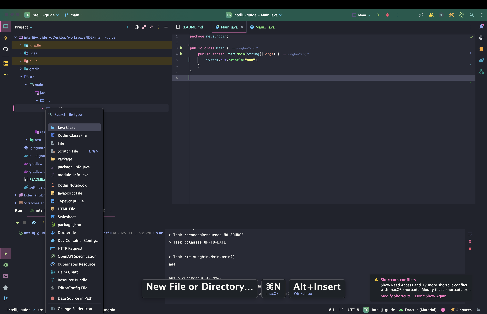

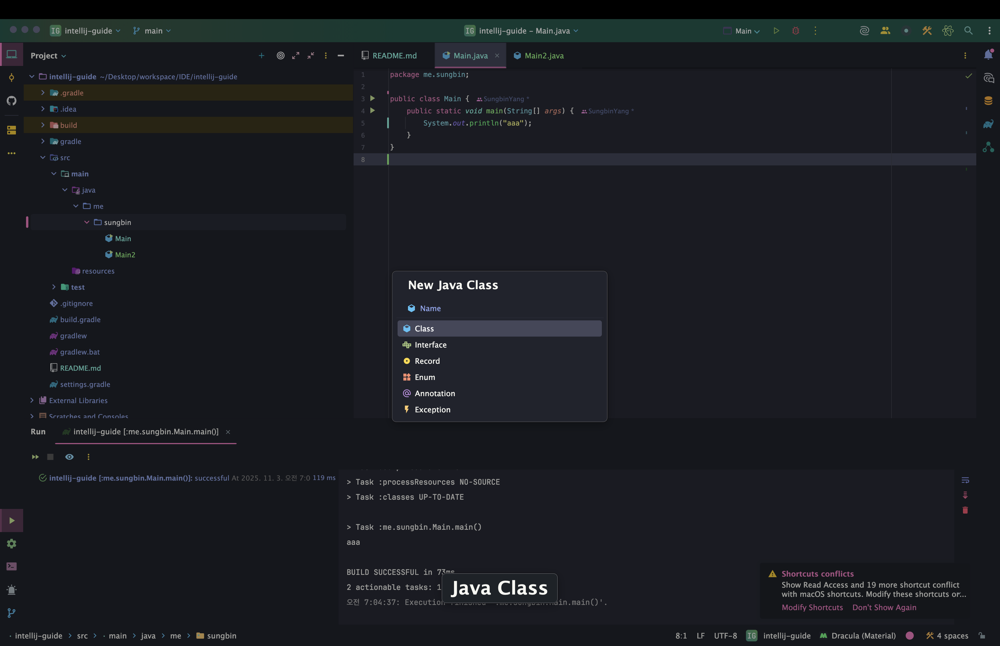

클래스 이름에 Main을 입력하면 새로운 자바 클래스 파일이 생성된다. 여기서 우리는 해당 파일을 실행시키려면 `main` 메서드를 생성해야 한다. 보통은 `public static void main(String[] args)`를 직접 입력하는 방법도 있지만 인텔리제이의 **라이브 템플릿** 기능을 통하여 쉽게 만들 수 있다. `psvm` 혹은 `main`이라고 입력하면 자동으로 main 메서드를 만들어준다. 아래 화면처럼 입력하면 툴팁처럼 뭔가 뜰텐데 엔터를 눌러주면 자동으로 생성이 되는 것이다.

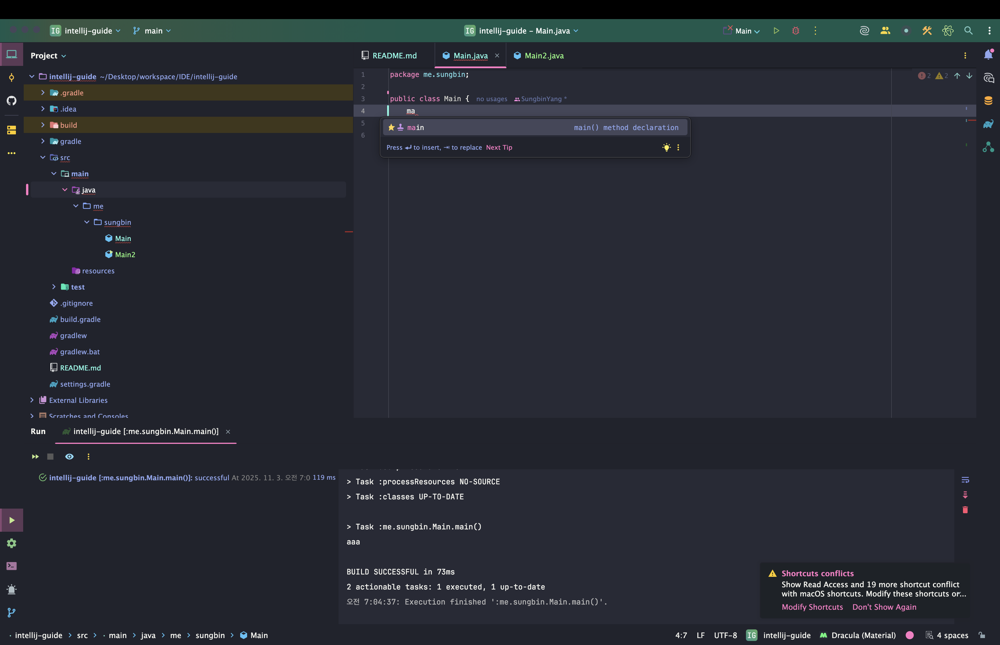


다음으로 `println`을 만들어 보자. 보통은 `System.out.println`을 직접 입력할 수 있지만 `sout`이라고 입력하면 자동으로 만들어준다. 바로 아래처럼 말이다.

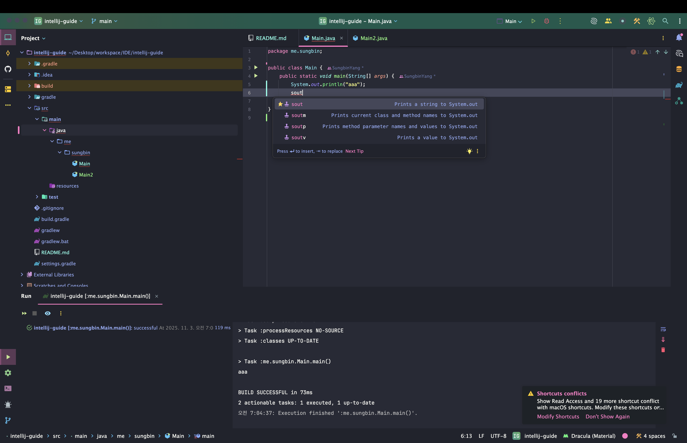

이제 메인 메서드를 실행해보자. 메인 메서드를 실행하는 방법은 2가지가 존재한다. 아래 화면에서 초록색 버튼을 직접 마우스로 클릭하는 방법이 존재하지만 이것은 매우 불편하다. 그래서 또 다른 방법은 맥 기준 `Ctrl + Shift + R`을 입력하면 된다. 참고로 윈도우/리눅스 기준은 `Ctrl + Shift + F10`이다.

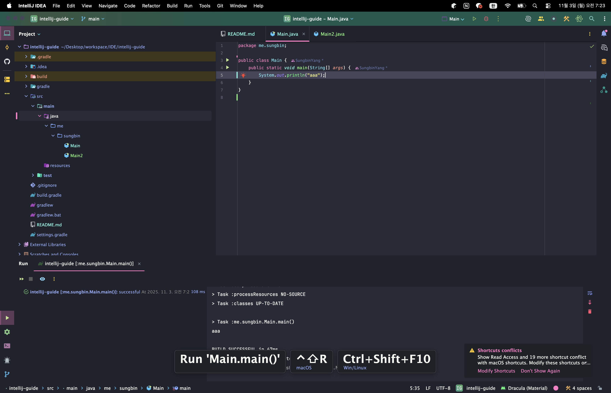

그러면 1가지 방법을 더 알아보자. 만약 우리가 `Main2`라는 클래스 파일을 아래와 같이 만들었다고 해보자. 그런데 이전 실행한 결과가 어떤지 궁금할 때가 있다. 그럴 때는 맥 기준 `Ctrl + R`을 입력하면 된다. 참고로 윈도우/리눅스 기준은 `Shift + F10`이다. 여기서 우리는 1가지 놀라운 사실을 알 수 있다. 놀랍다기 보단은 새로운 사실인데 아까 `Ctrl + Shift + R`은 현재 포커스 되어 있는 파일에 대한 실행임을 알 수 있고 `Ctrl + R`은 이전 실행한 파일을 실행함을 알 수 있다. 그러면 IDE는 이전 실행 파일을 어떻게 실행할 수 있었을까? 위의 사진에 우측 상단에 파일 이름이 저장되어 있는게 보일 것이다. 이것을 클릭하면 아래와 같이 나올 것이다.

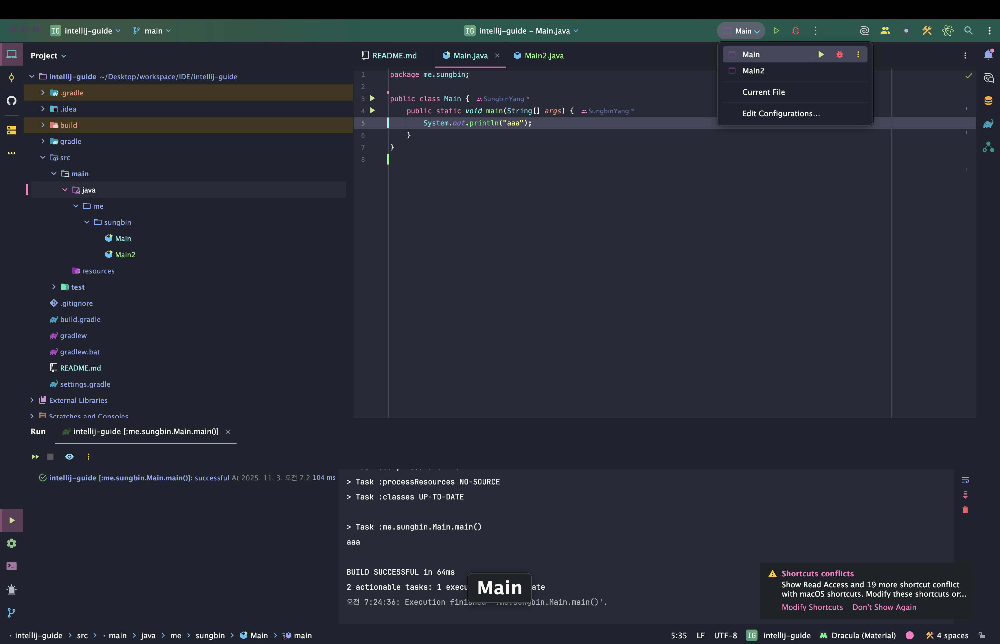

이것을 셀렉트 박스라고 하는데 여기에 기준으로 이전 실행 파일을 실행함을 알 수 있다. 또한 이 셀렉트 박스에는 자바 어플리케이션뿐만 아니라 다양한 파일들이 들어올 수 있는데 상세하게 볼 수 있게 Edit Configuration을 클릭하면 아래의 팝업이 나올 것이다.

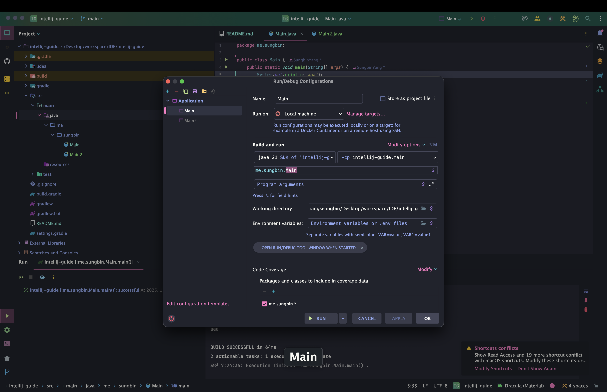

여기서 좌측 상단에 + 버튼을 클릭하면 Groovy, gradle, maven, kotlin등 다양한 것들이 셀렉트 박스에 들어갈 수 있다. 필자는 얼티밋 버전이라 Javascript, Spring등이 존재하지만 만약 커뮤니티 버전이라면 해당 기능을 이용할 수 없어서 나오지 않을 것이다.

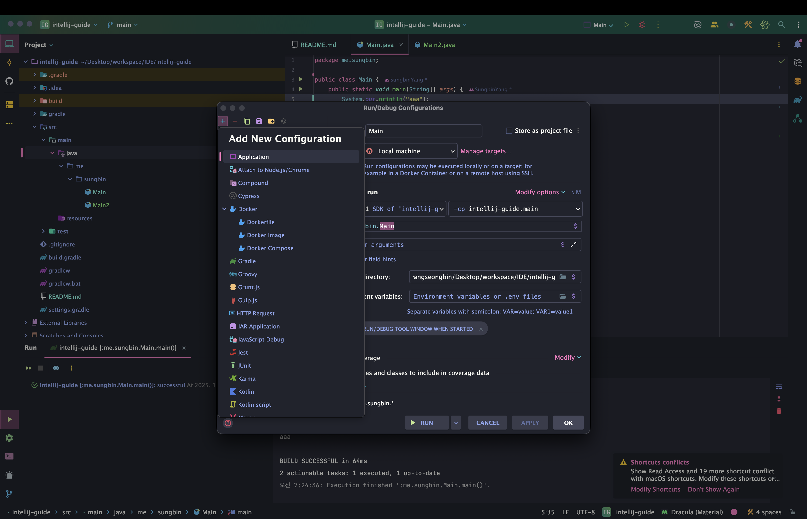

그러면 한번 정리해보는 시간을 가져보자.

- 디렉토리, 패키지, 클래스 등 생성 목록 보기
  - 맥: `command + n`
  - 윈도우/리눅스: `alt + insert`
- 코드 템플릿
  - 메인 메서드 생성: `psvm` or `main`
  - System.out.println(): `sout`
- 실행 환경 실행
  - 현재 포커스
    - 맥: `Ctrl + Shift + R`
    - 윈도우/리눅스: `Ctrl + Shift + F10`
  - 이전 실행
    - 맥: `Ctrl + R`
    - 윈도우/리눅스: `Shift + F10`

## 라인 수정하기

### 라인 복사 및 삭제

아래의 코드가 있다고 해보자.

``` java
package me.sungbin.chap1.lineedit;

public class LineCopy {
    public void lineCopy() {
        System.out.println("현재 줄을 복사합니다.");
    }
}
```

여기서 출력 문을 복사하고 싶다고 해보자. 그러면 우리는 해당 줄을 복사하여 다음 줄로 이동 후, 붙여넣기를 해야하는 3가지 공정을 거쳐야 한다. 하지만 인텔리제이에서는 해당 기능을 단축키로 제공한다. 맥 기준 `command + d`를 입력하거나 윈도우/리눅스 기준은 `Ctrl + d`를 입력해주면 해당 줄이 복사가 된다.


그러면 반대로 해당 줄을 삭제하려면 어떻게 해야할까? 우리는 해당 줄을 드래그 한 후에 백스페이스를 눌러서 삭제를 할 것이다. 하지만 이것도 인텔리제이에서는 단축키를 지원해준다. 맥 기준 `command + backspace`를 입력하거나 윈도우/리눅스 기준은 `Ctrl + y`를 입력해주면 해당 줄이 삭제가 된다.

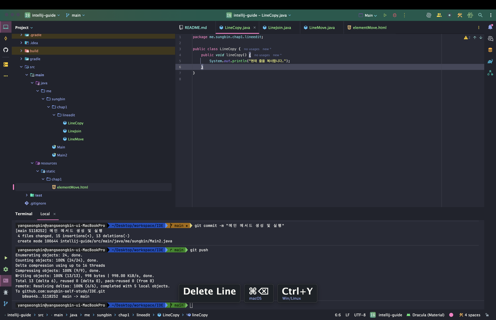

### 라인 합치기

아래의 코드가 있다고 해보자.

``` java
package me.sungbin.chap1.lineedit;

public class LineJoin {
    public String joinString() {
        String profile = "안녕하세요. " +
                "IntelliJ 강의에 오신 것을 " +
                "환영합니다.";

        return profile;
    }

    public String createQuery() {
        String query = "SELECT * FROM " +
                "member " +
                "WHERE member.name = 'robert'";

        return query;
    }
}
```

이렇게 문자열이 존재할 때 해당 문자열을 하나의 라인으로 뭔가 합치고 싶을 때가 있을 것이다. 이런 경우 우리는 합치고자 하는 문자열을 복사해서 첫번째 문자열 라인에 붙여 넣기를 하고 컴파일 에러를 제거하기 위해 복사한 문자열을 제거할 것이다. 하지만 이것도 인텔리제이에서 단축키를 제공헤준다. 합치고자 하는 라인에 포커스를 두고 맥/윈도우/리눅스 기준으로 단축키 `Ctrl + Shift + J`를 입력해주면 자동으로 합쳐준다.

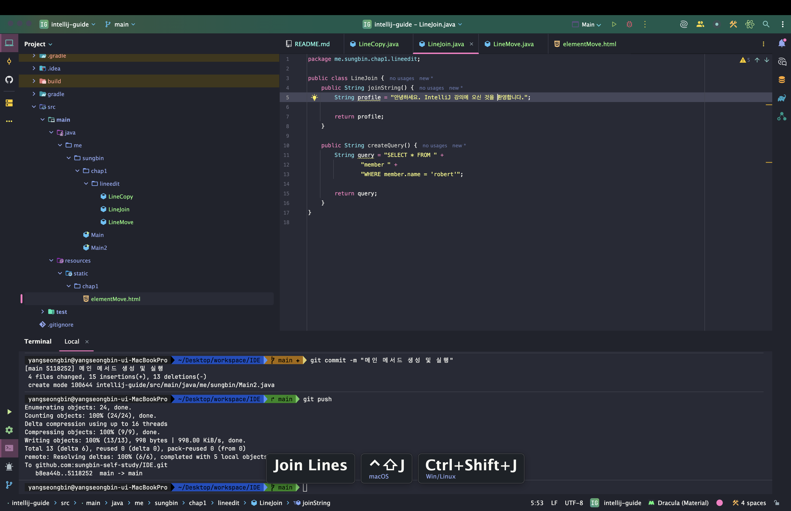

### 라인 단위로 옮기기

아래의 코드가 있다고 하자.

``` java
package me.sungbin.chap1.lineedit;

public class LineMove {
    public void moveLineAndStatement() {
        System.out.println("라인 혹은 구문 단위로 이동시킵니다.");

        for (int i = 0; i < 10; i++) {
            System.out.println(i);
        }
    }
}
```

만약 해당 출력문을 원하는 곳으로 이동하고 싶다면 어떻게 할까? 해당 출력문을 복사해서 원하는 라인으로 붙여넣고 이전 출력문을 삭제해야 할 것이다. 하지만 이것도 인텔리제이에서 단축키로 제공을 해준다. 맥 기준 `option + shift + 위/아래` 혹은 윈도우/리눅스 기준 `alt + shift + 위/아래`를 눌러주면 자유롭게 해당 라인이 이동이 가능하다.

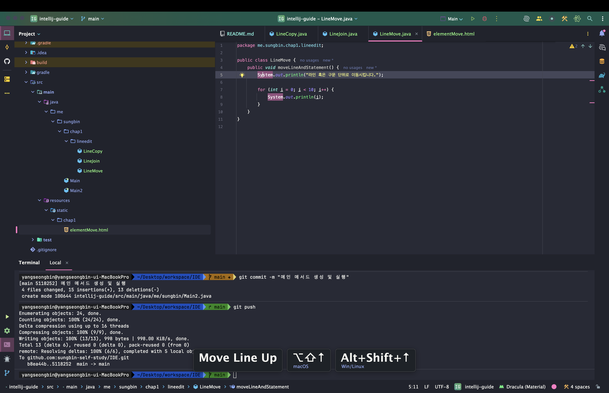

하지만 이런 단축키를 이동하면 원하는 라인으로 마음대로 이동이 가능하기에 컴파일 에러가 발생할 가능성이 있다. 이를 위해 구문에 맞게 라인 이동을 할 수 있게 해주는 단축키를 제공해주는데 맥 기준 `command + shift + 위/아래` 혹은 윈도우/리눅스 기준 `Ctrl + Shift + 위/아래`를 눌러주면 된다.

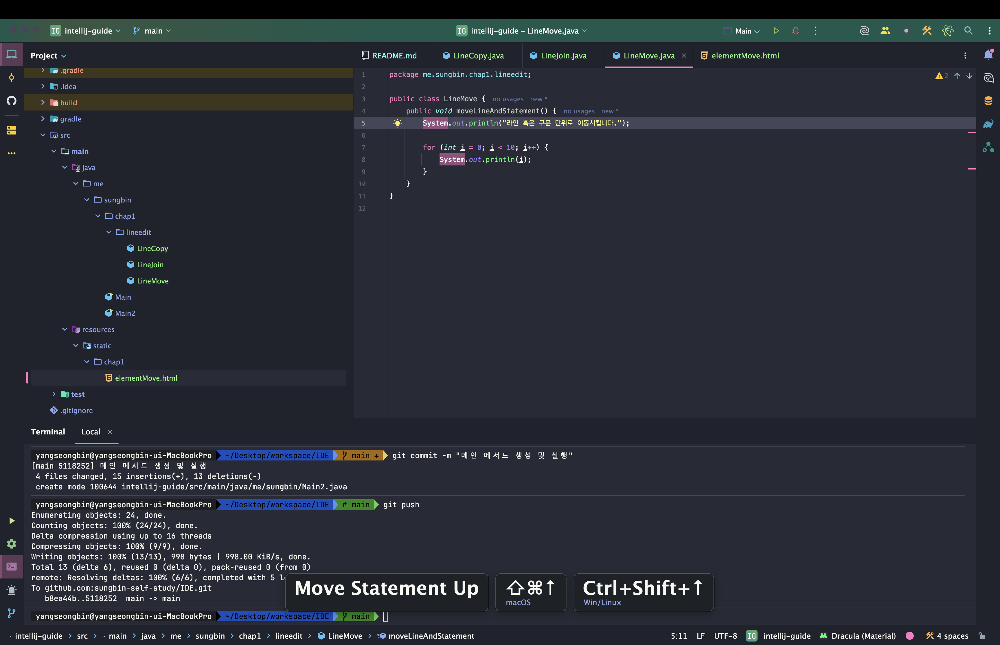

### Element 단위로 옮기기

이제 위의 단축키를 응용한 단축키를 알아보자. 아래의 html 코드가 있다고 해보자.

``` html
<!DOCTYPE html>
<html lang="en">
<head>
    <meta charset="UTF-8">
    <title>Title</title>
</head>
<body>
<h1 id="titleId" name="titleName">This is a Heading</h1>
</body>
</html>
```

h1 태그의 속성 name을 id 옆에 두고 싶을 때가 있다. 이럴 때 맥 기준 `command + option + shift + 좌/우` 버튼을 누르거나 윈도우 기준 `Ctrl + Alt + Shift + 좌/우` 버튼을 누르면 된다.

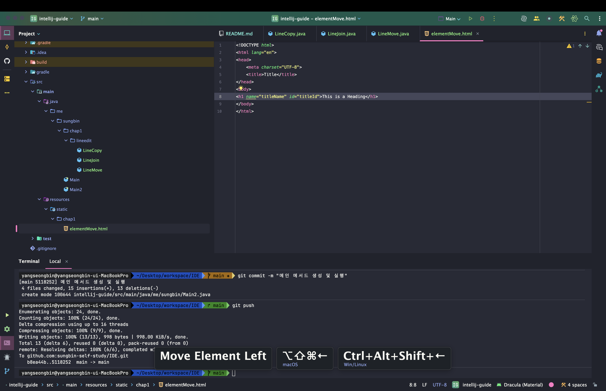

그러면 단축키들을 한번 정리해보자.

- 라인 복사
  - 맥: `command + d`
  - 윈도우/리눅스: `Ctrl + d`
- 라인 삭제
  - 맥: `command + backspace`
  - 윈도우/리눅스: `Ctrl + y`
- 라인 합치기
  - 맥: `Ctrl + Shift + J`
  - 윈도우/리눅스: `Ctrl + Shift + J`
- 구문 이동
  - 맥: `command + shift + 위/아래`
  - 윈도우/리눅스: `Ctrl + shift + 위/아래`
- 라인 이동
  - 맥: `option + shift + 위/아래`
  - 윈도우/리눅스: `alt + shift + 위/아래`
- element 단위로 옮기기
  - 맥: `option + command + shift + 좌/우`
  - 윈도우/리눅스: `alt + ctrl + shift + 좌/우`

## 코드 즉시보기

### 인자 값 즉시 보기

아래의 클래스 파일이 있다고 해보자.

``` java
package me.sungbin.chap1.view;

public class EmailSender {
    private Long id;

    private String name;

    private String email;

    public EmailSender(Long id, String name, String email) {
        this.id = id;
        this.name = name;
        this.email = email;
    }

    public String getEmail() {
        return email;
    }

    public void send(String to) {
        System.out.println(this.email + "님이 " + to + "님에게 메일을 보냈습니다.");
    }

    public static void receive(String from, String to) {
        System.out.println(from + "님으로부터 " + to + "님이 메일을 받았습니다.");
    }
}
```

그리고 이 클래스 파일을 작성하고 아래처럼 클래스 파일을 사용하려고 한다. 하지만 뭔가 인자 값을 까먹을 수도 있을 것이다. 그럴 때 어떻게 확인을 할까? 지금까지는 해당 클래스 파일로 가서 확인을 한 후에 적어야 할 것이다. 하지만 인텔리제이에서는 단축키를 제공해준다. 맥은 `command + p`이고 윈도우/리눅스는 `Ctrl + p`이다.

``` java
package me.sungbin.chap1.view;

public class ViewArguments {
    public void viewArguments() {
        EmailSender emailSender = new EmailSender(1L, "", "");
        EmailSender.receive("", "");
    }
}
```

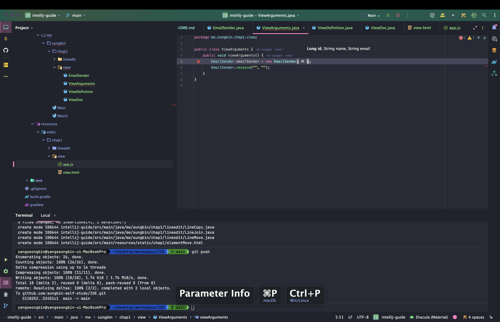

### 코드 구현부 즉시 보기

만약에 아래의 코드를 작성하다가 send 메서드 구현부라던지 생성자 혹은 해당 클래스가 어떻게 구현되었는지 궁금할 수도 있을 것이다. 그럴 때 우리는 해당 파일로 가서 구현부를 확인 후에 돌아가야하는 작업을 거쳤어야 한다. 하지만 이것은 매우 비효율적이다. 그래서 인텔리제이에서는 해당 기능을 단축키로 제공해준다. 구현부가 궁금한 부분에 커서를 두고 맥은 `option + space`, 윈도우/리눅스는 `Ctrl + Shift + i`를 입력하면 구현부를 즉시 확인할 수 있다.

``` java
package me.sungbin.chap1.view;

public class ViewDefinition {
    public void viewDefinition() {
        EmailSender emailSender = new EmailSender(1L, "robert", "robert@email.com");
        emailSender.send("test@test.com");
    }
}
```

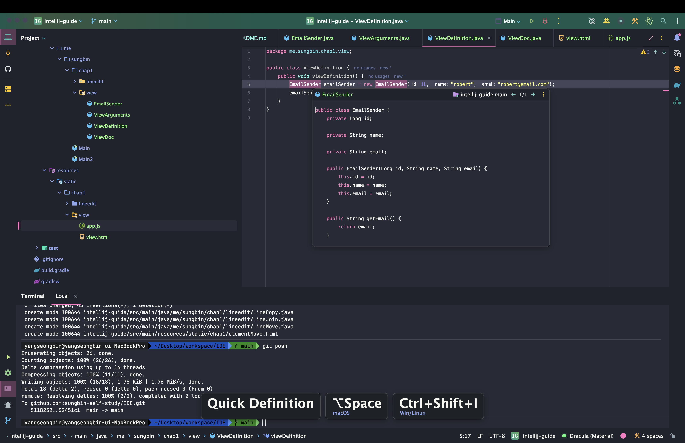

이것을 더 나아가서 얼티밋 버전에서는 html 파일에 import 시킨 javascript 구현부도 즉시 확인이 가능하다.

``` html
<!DOCTYPE html>
<html lang="en">
<head>
    <script src="./app.js"></script>

    <meta charset="UTF-8">
    <title>Title</title>
</head>
<body>
<h1 id="titleId" name="titleName">This is a Heading</h1>
</body>
</html>
```

``` javascript
console.log('aaa');
```

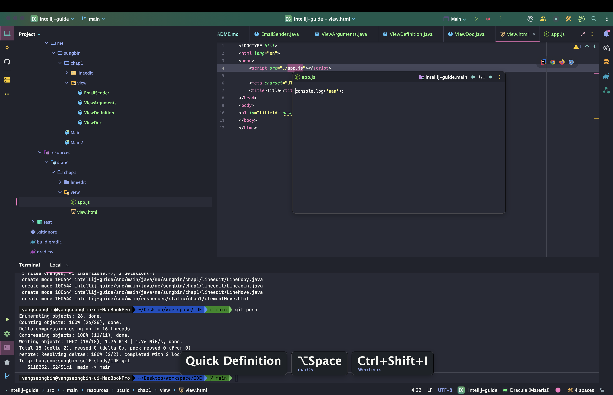

### Doc 바로 보기

우리가 개발을 하다가 해당 docs가 어떤지 궁금할 경우가 있을 것이다. 그러면 우리는 해당 홈페이지로 접속해서 궁금한 것을 검색해서 docs를 볼 것이다. 하지만 이것조차도 인텔리제이에서 단축키를 제공해준다. docs가 궁금한 부분에 커서를 두고 맥은 `F1`, 윈도우/리눅스는 `Ctrl + q`를 입력해주면 된다.

``` java
package me.sungbin.chap1.view;

public class ViewDoc {
    public void viewDoc() {
        double random = Math.random();
        System.out.println("현재 줄을 복사합니다.");
    }
}
```

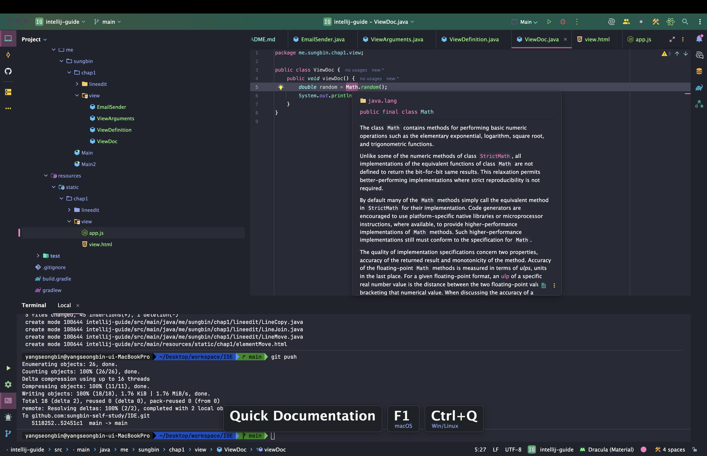

그러면 이제 정리를 해보자.

- 인자 값 즉시 보기
  - 맥: `command + p`
  - 윈도우/리눅스: `Ctrl + p`
- 코드 구현부 즉시 보기
  - 맥: `option + space`
  - 윈도우/리눅스: `Ctrl + Shift + i`
- Doc 보기
  - 맥: `F1`
  - 윈도우/리눅스: `Ctrl + q`