> 해당 포스팅은 인프런의 [IntelliJ를 시작하시는 분들을 위한 IntelliJ 가이드](https://inf.run/doaZn) 강의를 참조하여 작성한 글입니다.

## 들어가며

이전 포스팅에서 우리는 Toolbox를 통해 IntelliJ를 설치하고 프로젝트를 생성하는 것까지 진행했다. 이제부터는 본격적으로 코드를 다루는 이야기를 해보려고 한다.

이번 편의 주제는 **코드 Edit**이다. 즉, 코드를 만들고 고치고 확인하는 가장 기본적인 행위들을 어떻게 하면 마우스 없이, 더 적은 동작으로 해낼 수 있는지에 대한 이야기다.

참조한 강의에서 향로 강사님은 이 시리즈의 진행 방식을 이렇게 설명한다.

> "자꾸 익숙한 방법을 쓰게 되는데, 그래서 이 강좌에서는 여러분들과 같이 프로젝트를 만들기보다는 하나하나씩 '이런 상황이 있고, 이 코드가 있는데 이걸 어떻게 하면 내가 좀 더 편하게 고칠 수 있고, 옮길 수
> 있고, 작성할 수 있는지' 이렇게 끊어서 기능을 하나하나씩 설명을 드리겠습니다."

이 말이 중요한 이유가 있다. 우리는 이미 "복사해서 붙여넣고 지우는" 방식에 익숙하다. 그리고 익숙한 방식은 아무리 비효율적이어도 손이 먼저 나간다. 그래서 이번 편은 **"이 상황에서 당신은 아마 이렇게 하고
있을 것이다"** 를 먼저 짚고, 그것을 단축키 하나로 대체하는 방식으로 진행된다. 읽으면서 "아, 나 이거 지금까지 손으로 했는데"라는 생각이 든다면 그게 바로 시간을 아낄 수 있는 지점이다.

## 메인 메서드 생성 및 실행

먼저 우리는 자바 어플리케이션을 만들기 위해서는 자바 파일을 생성해야 하며, 자바 파일을 생성하기 위한 디렉토리 세팅을 해줘야 한다. 아마 이전 포스팅을 만들었다면 자바에서 실행하는 디렉토리 환경인 `src`
디렉토리가 있겠으나 혹시 몰라서 해당 환경부터 같이 만들어 보려고 한다. 루트 프로젝트 경로에다가 단축키로 맥 기준 `command + n` 혹은 윈도우나 리눅스 기준 `alt + insert`키를 입력하면 아래
화면처럼 나올 것이다.

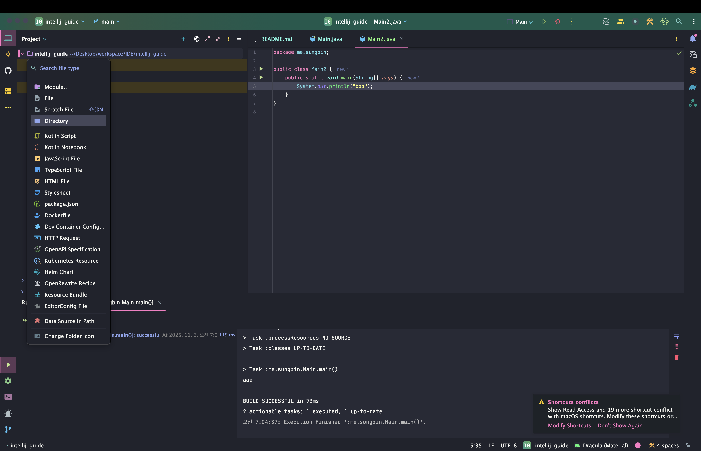

여기서 강사님이 강조하는 부분이 있다.

> "우리가 할 때마다 마우스를 쓰는 건 좋은 습관이 아니기 때문에 단축키를 사용을 해보겠습니다."

사실 디렉토리 하나 만드는 데 마우스 우클릭 → New → Directory를 거치는 것과 단축키 한 번을 누르는 것의 차이는 3초 정도밖에 안 된다. 하지만 이 3초는 하루에도 수십 번 반복된다. 그리고 더 중요한
것은 **마우스로 손이 옮겨가는 순간 코딩의 흐름이 끊긴다**는 점이다. 단축키를 쓰는 진짜 이유는 시간보다도 이 "흐름 유지"에 있다.

> **알아두면 좋은 점: `command + n`은 상황에 따라 다르게 동작한다**
>
> 이 단축키는 처음 쓰는 사람이 가장 많이 헷갈려 하는 부분인데, **현재 포커스가 어디에 있느냐에 따라 완전히 다른 메뉴가 뜬다.**
>
> - **Project 도구 창 (좌측 파일 트리)에 포커스가 있을 때**: `New` 메뉴가 뜬다. 디렉토리, 패키지, 클래스, 파일 등을 생성할 수 있다.
> - **에디터 (코드 창) 안에 포커스가 있을 때**: `Generate` 메뉴가 뜬다. Getter/Setter, 생성자, `toString()`, `equals()/hashCode()` 등을 자동 생성할 수
    있다.
>
> 즉 "생성한다"는 의미는 같은데 대상이 다른 것이다. 만약 디렉토리를 만들려고 단축키를 눌렀는데 Getter/Setter 목록이 나온다면 포커스가 에디터에 있다는 뜻이니 당황하지 말고 좌측 파일 트리를 클릭한 뒤
> 다시 눌러보자. (포커스를 단축키로 옮기는 방법은 다음 편인 **포커스**에서 다룰 예정이다.)

이제 자바의 기본 경로인 `src/main/java`를 입력하면 자동으로 생성해준다. 여기서 /는 하위 디렉토리를 의미하며 인텔리제이에서 /를 인식하여 자동으로 하위 디렉토리로 만들어 준다. 이미 필자는 만들어져
있어서 IDE에서 이미 존재한다라고 뜨지만 독자들은 경고문이 안 뜰테니 걱정하지 않았으면 좋겠다.

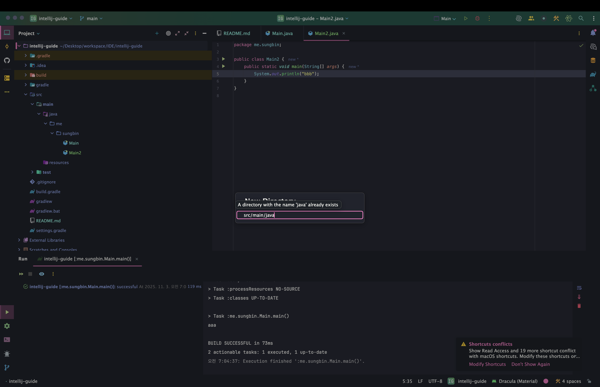

> **왜 하필 `src/main/java`인가?**
>
> 이 경로는 자바의 문법이 아니라 **Maven과 Gradle이 정한 표준 디렉토리 구조**다. 빌드 도구는 별도 설정이 없으면 아래 규칙대로 동작한다.
>
> - `src/main/java`: 실제 애플리케이션 소스 코드
> - `src/main/resources`: 설정 파일, 정적 리소스 (`application.yml`, `.properties` 등)
> - `src/test/java`: 테스트 코드
> - `src/test/resources`: 테스트용 리소스
>
> 이걸 "설정보다 관례 (Convention over Configuration)"라고 부른다. 정해진 위치에 파일을 두기만 하면 빌드 도구가 알아서 찾아가기 때문에 별도 설정이 필요 없다. 그래서 이 경로를 지키지
> 않으면 컴파일이 되지 않거나 리소스를 못 읽는 문제가 생긴다. IntelliJ에서도 이 경로를 인식하면 `java` 디렉토리 아이콘이 파란색으로, `resources`는 주황색으로 바뀌는데, 색이 안 바뀌었다면
> 경로를 잘못 만들었을 확률이 높다.

이후에 자바 어플리케이션을 만들 때 패키지라는 것을 만들어야 한다. 안 만들어도 무방하지만 실무에서는 패키지를 많이 만든다. 패키지도 디렉토리를 생성하는 것과 같이 맥 기준 `command + n` 혹은 윈도우나
리눅스 기준 `alt + insert`키를 입력하여 package를 찾아서 엔터를 눌러주면 아래와 같은 화면이 나온다.

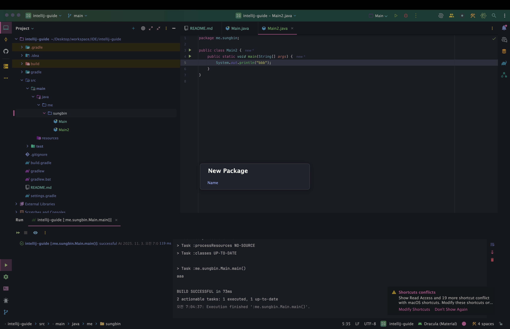

여기서 우리는 원하는 패키지명을 입력해주면 된다. 필자는 `me.sungbin`이라는 패키지로 진행을 할 예정이다. 여기서 `.`단위로 디렉토리를 생성해준다라고 보면 되고 패키지에 대한 자세한 개념은 자바 학습을 할
때 학습해보기로 하자. 일단은 지금은 디렉토리를 생성해준다라고만 생각하자.

> 참고로 디렉토리는 `/`로 계층을 구분하고 패키지는 `.`으로 계층을 구분한다. 즉 `me.sungbin.chap1`이라고 입력하면 실제 파일 시스템에는 `me/sungbin/chap1` 디렉토리가 만들어진다.
> 이전 편에서 다룬 groupId를 그대로 패키지명으로 쓰는 경우가 많은데, 이게 자바의 관례다.

그리고 이제 `Main.java`를 만들어보자. 이것도 원하는 경로에 맥 기준 `command + n` 혹은 윈도우나 리눅스 기준 `alt + insert`키를 입력하여 class를 입력하면 아래와 같이 나올
것이다.

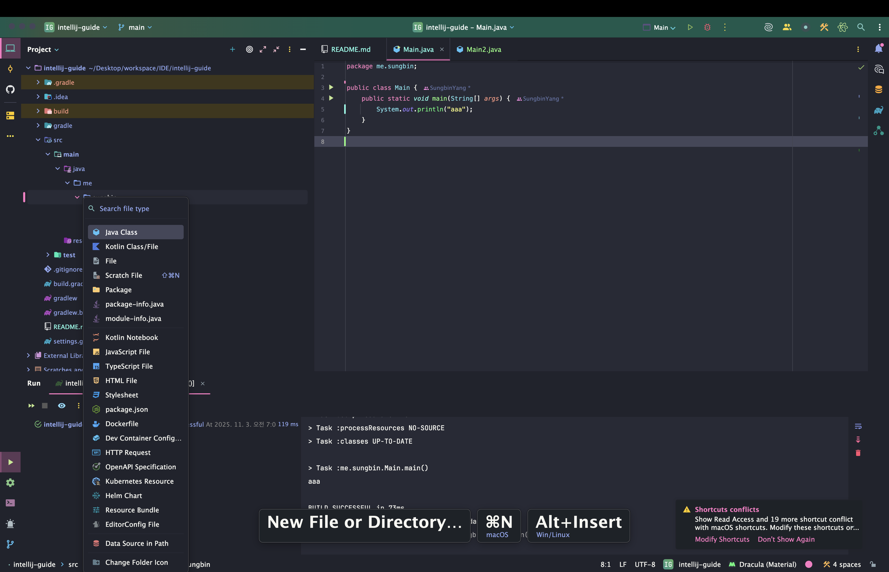

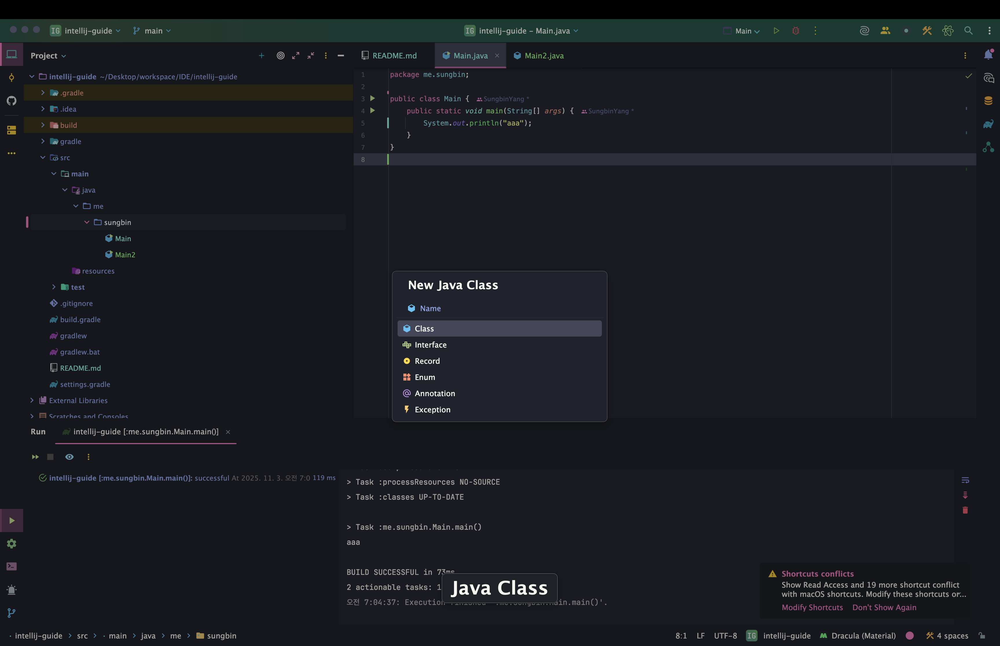

> 여기서 종류를 선택할 수 있는데 Class, Interface, Record, Enum, Annotation 등이 나온다. 지금은 일반적인 클래스를 만들 것이므로 `Class`를 선택하면 된다. 참고로 이름을
> 입력할 때 `me.sungbin.chap1.Main`처럼 **패키지 경로를 포함해서 한 번에 입력**하면 패키지까지 알아서 만들어주기 때문에, 익숙해지면 패키지 생성 단계를 건너뛸 수도 있다.

### 라이브 템플릿으로 메인 메서드 만들기

클래스 이름에 Main을 입력하면 새로운 자바 클래스 파일이 생성된다. 여기서 우리는 해당 파일을 실행시키려면 `main` 메서드를 생성해야 한다. 보통은
`public static void main(String[] args)`를 직접 입력하는 방법도 있지만 인텔리제이의 **라이브 템플릿** 기능을 통하여 쉽게 만들 수 있다. `psvm` 혹은 `main`이라고
입력하면 자동으로 main 메서드를 만들어준다. 아래 화면처럼 입력하면 툴팁처럼 뭔가 뜰텐데 엔터를 눌러주면 자동으로 생성이 되는 것이다.


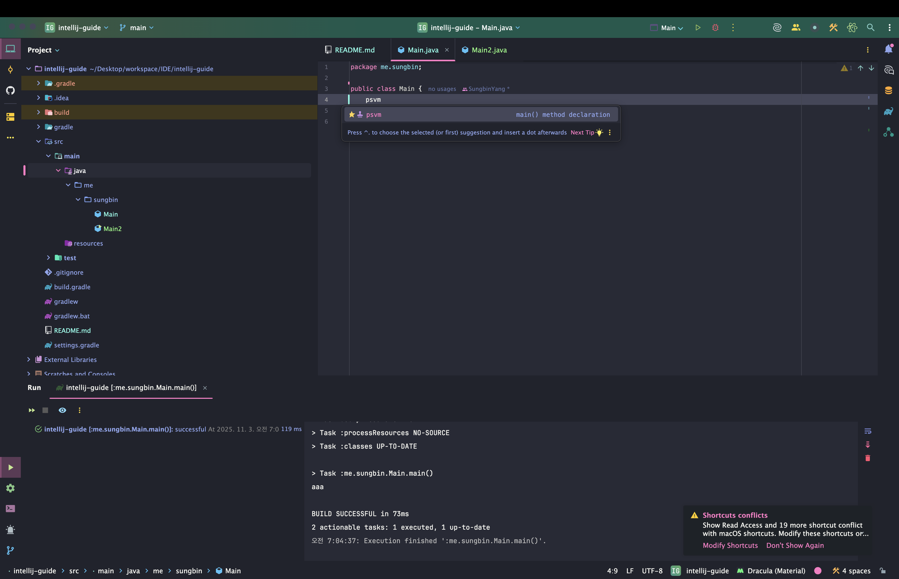

여기서 **라이브 템플릿 (Live Template)** 이라는 개념을 조금만 짚고 넘어가자. 라이브 템플릿은 짧은 약어 (abbreviation)를 입력하면 미리 정의된 코드 조각으로 확장해주는 기능이다.
`psvm`은 `public static void main`의 앞글자를 딴 것이다.

- 확장하는 키는 기본적으로 **`Tab`** 이다. 자동완성 목록이 떠 있는 상태라면 `Enter`로도 확장된다.
- 어떤 템플릿들이 있는지 궁금하다면 맥 기준 `command + j`, 윈도우/리눅스 기준 `ctrl + j`를 눌러보자. 현재 위치에서 사용 가능한 라이브 템플릿 목록이 전부 나온다.
- 전체 목록과 커스텀 등록은 `Settings` → `Editor` → `Live Templates`에서 확인할 수 있다.

강사님도 이 부분에서 이런 말을 남긴다.

> "기존에 IntelliJ를 조금 써보셨던 분들이더라도 마우스를 사용하시거나 메인 메소드나 println 같은 메소드를 직접 다 치신 분들이라면 꼭 보셨으면 좋겠습니다."

라이브 템플릿은 뒤에 나올 **자동완성** 편에서 커스텀 템플릿을 직접 만드는 것까지 다룰 예정이니, 지금은 "약어를 치면 코드가 튀어나온다" 정도만 이해하고 넘어가도 충분하다.

> **[참고] Java 25부터는 `psvm`조차 필요 없어졌다**
>
> 자바를 처음 배울 때 `public static void main(String[] args)`라는 주문 같은 문장을 외워야 하는 것이 오랜 진입 장벽이었다. 그런데 **Java 25에서 JEP 512 (
Compact Source Files and Instance Main Methods)가 정식 기능으로 확정**되면서 아래 코드만으로도 실행이 가능해졌다.
>
> ```java
> void main() {
>     System.out.println("Hello World!");
> }
> ```
>
> 클래스 선언도 생략할 수 있고 (컴파일러가 암묵적으로 감싸준다), `main`은 더 이상 `static`일 필요가 없으며, `String[] args`도 선택 사항이 되었다. Java 21에서 프리뷰로 처음
> 등장해 22·23·24를 거쳐 다듬어진 뒤 25에서 정식화된 기능이다.
>
> 다만 이 문법은 어디까지나 학습용·스크립트용 성격이 강하고, 실무 프로젝트에서는 여전히 명시적인 클래스와 `public static void main`을 사용한다. 그러니 `psvm`은 지금도 앞으로도 유효한
> 단축 입력이다.

### sout, 그리고 그 형제들

다음으로 `println`을 만들어 보자. 보통은 `System.out.println`을 직접 입력할 수 있지만 `sout`이라고 입력하면 자동으로 만들어준다. 바로 아래처럼 말이다.

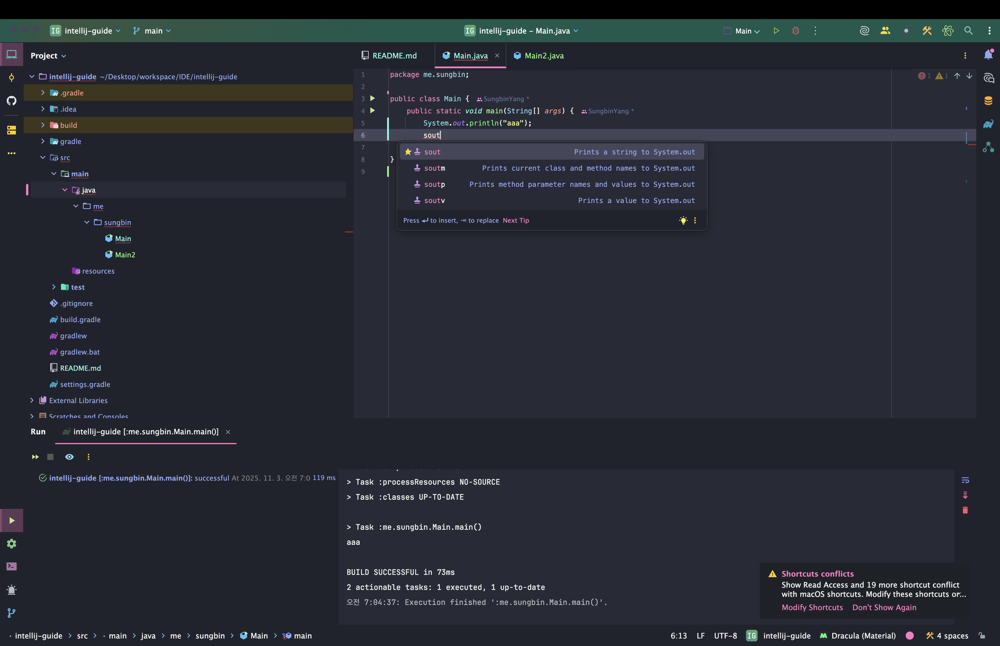

그런데 사실 `sout` 하나만 아는 것은 조금 아깝다. IntelliJ에는 `sout` 계열의 변형들이 준비되어 있는데, 디버깅용 출력문을 찍을 때 이걸 알고 모르고의 차이가 꽤 크다.

| 약어    | 확장 결과                                       | 설명                                       |
|---------|-------------------------------------------------|--------------------------------------------|
| `sout`  | `System.out.println();`                         | 가장 기본                                  |
| `soutv` | `System.out.println("변수명 = " + 변수);`       | **바로 위에 있는 변수**를 이름과 함께 출력 |
| `soutp` | `System.out.println("파라미터 = " + 파라미터);` | 현재 메서드의 파라미터를 전부 출력         |
| `soutm` | `System.out.println("클래스.메서드명");`        | 현재 클래스와 메서드 이름을 출력           |
| `serr`  | `System.err.println();`                         | 에러 스트림으로 출력                       |

이 중에서도 `soutv`는 정말 자주 쓰게 된다. 우리가 디버깅용 출력을 찍을 때 `System.out.println(name)`처럼만 찍으면 콘솔에 값만 덜렁 나와서 어떤 변수인지 알기 어렵다. 그래서 보통
`System.out.println("name = " + name)`처럼 손으로 변수명을 적어주는데, `soutv`는 이걸 알아서 만들어준다.

``` java
public void example() {
    String name = "robert";
    // 여기서 soutv + Tab 을 입력하면
    // System.out.println("name = " + name); 이 자동 생성된다.
}
```

그 외에도 자주 쓰이는 자바 라이브 템플릿을 몇 개만 더 소개하면 다음과 같다.

| 약어   | 설명                         |
|--------|------------------------------|
| `psfs` | `public static final String` |
| `fori` | 인덱스 기반 for 루프         |
| `iter` | 향상된 for 루프 (for-each)   |
| `ifn`  | `if (x == null) { ... }`     |
| `inn`  | `if (x != null) { ... }`     |
| `thr`  | `throw new ...`              |

버전이나 플러그인에 따라 목록이 조금씩 다를 수 있으니, 정확한 목록은 앞서 말한 `Settings` → `Editor` → `Live Templates` → `Java`에서 직접 확인하는 것을 추천한다.

> 참고로 라이브 템플릿과 비슷하지만 다른 개념으로 **후위 완성 (Postfix Completion)** 이라는 것도 있다. 라이브 템플릿이 "약어를 먼저 치고 코드를 만드는" 방식이라면, 후위 완성은 이미 작성한
> 표현식 뒤에 `.` 을 찍어서 변환하는 방식이다. 예를 들어 `name.sout`이라고 입력하면 `System.out.println(name);`으로 바뀐다. 이 내용은 **자동완성** 편에서 자세히 다룰 예정이다.

### 실행하기

이제 메인 메서드를 실행해보자. 메인 메서드를 실행하는 방법은 2가지가 존재한다. 아래 화면에서 초록색 버튼을 직접 마우스로 클릭하는 방법이 존재하지만 이것은 매우 불편하다. 그래서 또 다른 방법은 맥 기준
`Ctrl + Shift + R`을 입력하면 된다. 참고로 윈도우/리눅스 기준은 `Ctrl + Shift + F10`이다.

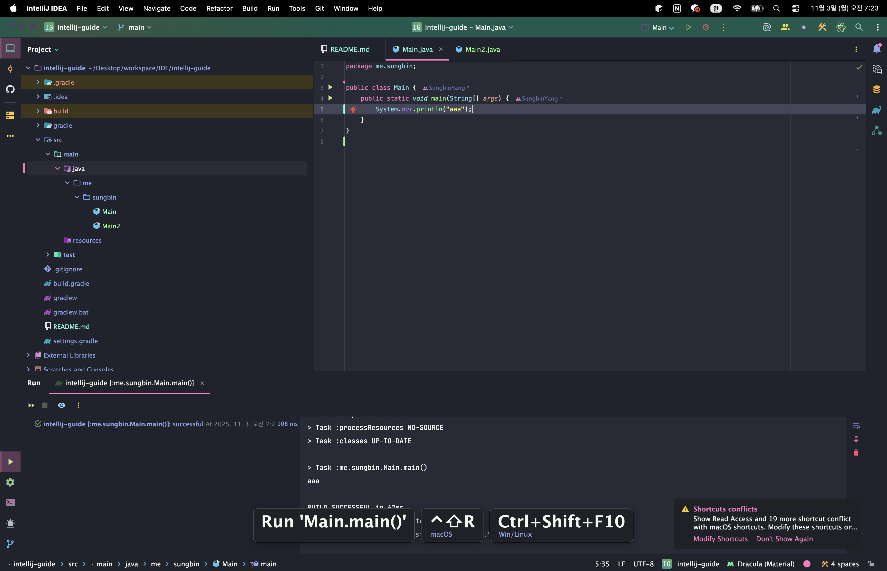

> 이 단축키의 정확한 이름은 **Run context configuration**이다. "현재 파일을 실행한다"기보다는 **"커서가 놓인 위치를 기준으로 실행할 수 있는 것을 찾아 실행한다"** 가 더 정확한
> 표현이다. 그래서 나중에 테스트 코드를 작성할 때 이 차이가 드러나는데, 테스트 클래스의 특정 메서드 안에 커서를 두고 누르면 **그 메서드 하나만** 실행되고, 클래스 선언부에 커서를 두고 누르면 **클래스 전체
테스트**가 실행된다. 상당히 유용하니 기억해두자.

그러면 1가지 방법을 더 알아보자. 만약 우리가 `Main2`라는 클래스 파일을 아래와 같이 만들었다고 해보자. 그런데 이전 실행한 결과가 어떤지 궁금할 때가 있다. 그럴 때는 맥 기준 `Ctrl + R`을 입력하면
된다. 참고로 윈도우/리눅스 기준은 `Shift + F10`이다. 여기서 우리는 1가지 놀라운 사실을 알 수 있다. 놀랍다기 보단은 새로운 사실인데 아까 `Ctrl + Shift + R`은 현재 포커스 되어 있는
파일에 대한 실행임을 알 수 있고 `Ctrl + R`은 이전 실행한 파일을 실행함을 알 수 있다.

강사님도 이 두 단축키를 소개하면서 "Ctrl + R이에요. 좀 헷갈리시죠?"라고 이야기하는데, 실제로 처음에는 정말 헷갈린다. 그래서 필자는 이렇게 외웠다.

- **`Ctrl + Shift + R` (Shift가 붙은 쪽)**: "지금 여기 있는 걸" 실행 → **새로 실행할 대상을 찾는다**
- **`Ctrl + R` (짧은 쪽)**: "아까 그거 다시" 실행 → **재실행 (Re-run)**

실무에서 어떤 것을 더 많이 쓰냐고 하면 압도적으로 `Ctrl + R`이다. 왜냐하면 우리는 보통 하나의 애플리케이션을 켜두고 코드를 고치면서 계속 다시 실행하기 때문이다. 즉 **처음 한 번만
`Ctrl + Shift + R`로 실행 대상을 잡아두고, 그 이후로는 계속 `Ctrl + R`로 재실행**하는 패턴이 가장 흔하다.

그러면 IDE는 이전 실행 파일을 어떻게 실행할 수 있었을까? 위의 사진에 우측 상단에 파일 이름이 저장되어 있는게 보일 것이다. 이것을 클릭하면 아래와 같이 나올 것이다.

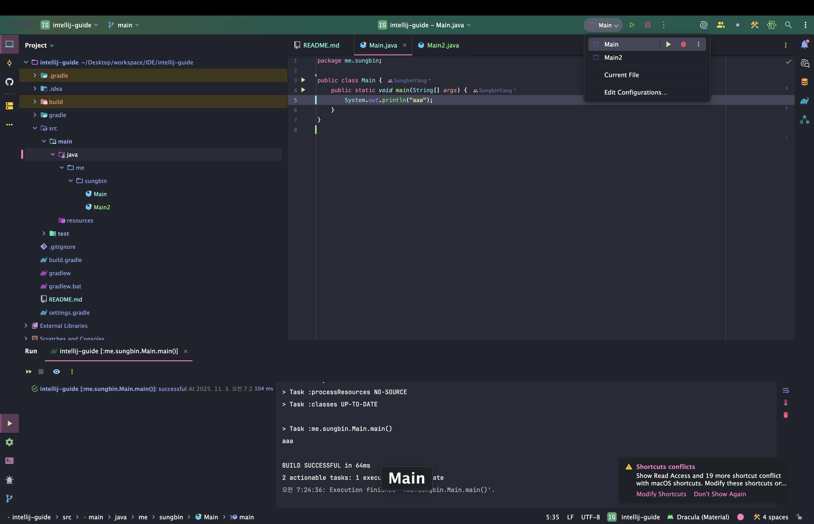

이것을 셀렉트 박스라고 하는데 여기에 기준으로 이전 실행 파일을 실행함을 알 수 있다. 또한 이 셀렉트 박스에는 자바 어플리케이션뿐만 아니라 다양한 파일들이 들어올 수 있는데 상세하게 볼 수 있게 Edit
Configuration을 클릭하면 아래의 팝업이 나올 것이다.

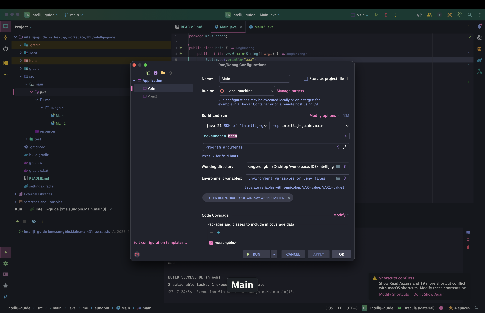

여기서 좌측 상단에 + 버튼을 클릭하면 Groovy, gradle, maven, kotlin등 다양한 것들이 셀렉트 박스에 들어갈 수 있다. 필자는 얼티메이트 버전이라 Javascript, Spring등이 존재하지만
만약 커뮤니티 버전이라면 해당 기능을 이용할 수 없어서 나오지 않을 것이다.

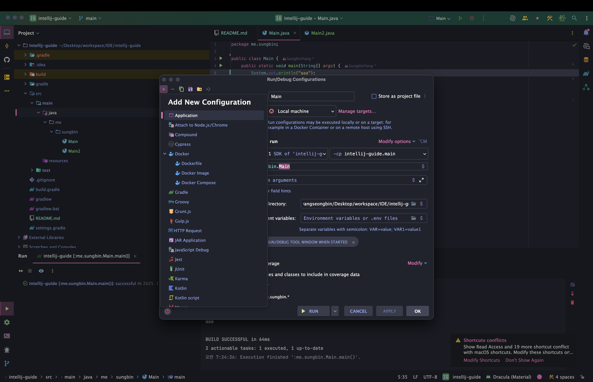

### Run Configuration을 조금 더 알아보자

여기서 말하는 이 셀렉트 박스의 정체는 **Run/Debug Configuration**이다. 우리말로 하면 "실행 설정" 정도가 되는데, **무엇을 어떤 옵션으로 실행할지를 정의해둔 이름 붙은 설정 묶음**이라고
이해하면 된다. JVM 옵션, 환경 변수, 프로그램 인자, 작업 디렉토리 같은 것들이 여기에 들어간다.

그리고 이 Configuration에는 두 가지 종류가 있는데, 이걸 알아두면 나중에 "분명히 만들어놨던 실행 설정이 사라졌다"는 상황을 이해할 수 있다.

- **임시 (Temporary) 설정**: 우리가 `Ctrl + Shift + R`로 그냥 실행했을 때 IntelliJ가 **자동으로 만들어주는** 설정이다. 목록에서 아이콘이 반투명하게 표시된다. 중요한 점은
  **최대 5개까지만 유지되고, 그 이상 생기면 오래된 것부터 자동으로 삭제된다**는 것이다.
- **영구 (Permanent) 설정**: `Edit Configurations`에서 직접 `+` 버튼으로 만들거나, 임시 설정을 저장 (Save)한 것이다. 아이콘이 불투명하게 표시되며 프로젝트에서 직접 지우기
  전까지 남아 있다.

즉 특정 JVM 옵션이나 환경 변수를 넣어서 실행하는 설정을 만들어뒀는데 자꾸 사라진다면, 그건 임시 설정 상태로 두었기 때문이다. 자주 쓰는 실행 설정이라면 반드시 영구 설정으로 저장해두자. 참고로 임시 설정 보관
개수는 `Settings` → `Advanced Settings`에서 늘릴 수도 있다.

그러면 한번 정리해보는 시간을 가져보자.

- 디렉토리, 패키지, 클래스 등 생성 목록 보기
    - 맥: `command + n`
    - 윈도우/리눅스: `alt + insert`
- 라이브 템플릿 목록 보기
    - 맥: `command + j`
    - 윈도우/리눅스: `Ctrl + j`
- 코드 템플릿
    - 메인 메서드 생성: `psvm` or `main`
    - System.out.println (): `sout`
    - 변수를 이름과 함께 출력: `soutv`
    - 메서드 파라미터 출력: `soutp`
    - 클래스/메서드명 출력: `soutm`
- 실행 환경 실행
    - 현재 포커스
        - 맥: `Ctrl + Shift + R`
        - 윈도우/리눅스: `Ctrl + Shift + F10`
    - 이전 실행
        - 맥: `Ctrl + R`
        - 윈도우/리눅스: `Shift + F10`

## 라인 수정하기

여기서부터는 이미 작성된 코드를 **고치는** 이야기다. 강사님은 이 챕터를 시작하면서 중요한 전제를 하나 던진다.

> "코드 단위가 아니라 라인 단위입니다."

무슨 뜻이냐면, 우리는 보통 코드를 고칠 때 마우스로 드래그해서 **문자 단위로** 영역을 잡는다. 그런데 실제로 우리가 하고 싶은 작업의 대부분은 "이 **줄**을 복사", "이 **줄**을 삭제", "이
**줄**을 위로"처럼 라인 단위다. 그렇다면 굳이 드래그로 영역을 잡을 필요 없이, **커서만 그 줄 어딘가에 두면 되는** 기능이 있으면 훨씬 편할 것이다. 이번 챕터에서 소개할 기능들이 정확히 그것이다.

### 라인 복사 및 삭제

아래의 코드가 있다고 해보자.

``` java
package me.sungbin.chap1.lineedit;

public class LineCopy {
    public void lineCopy() {
        System.out.println("현재 줄을 복사합니다.");
    }
}
```

여기서 출력 문을 복사하고 싶다고 해보자. 그러면 우리는 해당 줄을 복사하여 다음 줄로 이동 후, 붙여넣기를 해야하는 3가지 공정을 거쳐야 한다. 하지만 인텔리제이에서는 해당 기능을 단축키로 제공한다. 맥 기준
`command + d`를 입력하거나 윈도우/리눅스 기준은 `Ctrl + d`를 입력해주면 해당 줄이 복사가 된다.


여기서 알아두면 좋은 특징이 몇 가지 있다.

- **커서 위치는 상관없다.** 그 줄 안 어디에 있든 줄 전체가 복제된다. 굳이 줄 맨 앞이나 맨 뒤로 갈 필요가 없다.
- **선택 영역이 있으면 그 영역만 복제된다.** 여러 줄을 드래그한 상태에서 누르면 그 여러 줄이 통째로 복제되고, 단어 하나만 선택한 상태라면 그 단어만 복제된다. 즉 상황에 따라 알아서 동작한다.
- **문법적으로 올바른 코드가 아니어도 된다.** 이건 텍스트 단위의 동작이기 때문에 작성 중인 미완성 코드에서도 그대로 쓸 수 있다.

그러면 반대로 해당 줄을 삭제하려면 어떻게 해야할까? 우리는 해당 줄을 드래그 한 후에 백스페이스를 눌러서 삭제를 할 것이다. 하지만 이것도 인텔리제이에서는 단축키를 지원해준다. 맥 기준
`command + backspace`를 입력하거나 윈도우/리눅스 기준은 `Ctrl + y`를 입력해주면 해당 줄이 삭제가 된다.

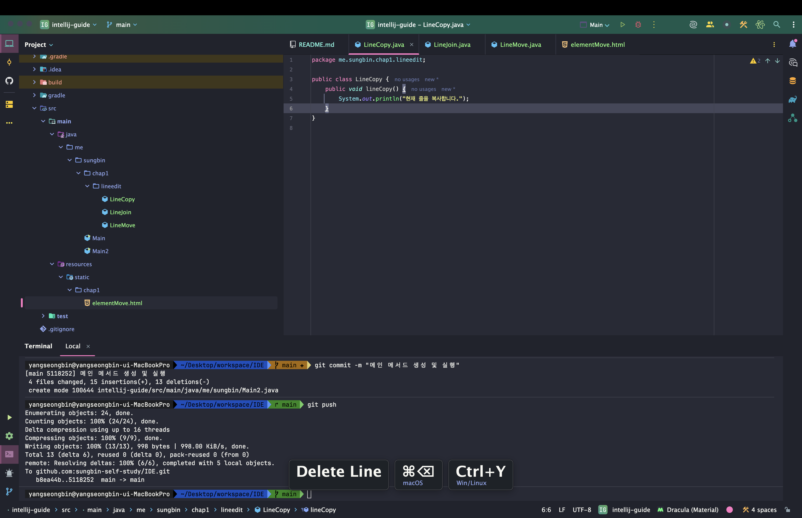

> **윈도우 사용자를 위한 주의사항**
>
> 윈도우/리눅스의 `Ctrl + Y`는 다른 에디터에서 보통 **다시 실행 (Redo)** 에 할당된 단축키다. 그래서 Eclipse나 VS Code를 쓰다가 넘어온 사람은 "왜 다시 실행이 안 되고 줄이
> 지워지지?"라며 당황하는 경우가 많다.
>
> IntelliJ 기본 키맵에서 실행 취소/다시 실행은 다음과 같다.
>
> - 실행 취소 (Undo): `Ctrl + Z` (맥은 `command + z`)
> - 다시 실행 (Redo): `Ctrl + Shift + Z` (맥은 `command + shift + z`)
>
> 만약 이 배치가 너무 불편하다면 `Settings` → `Keymap`에서 Eclipse나 Visual Studio 키맵으로 통째로 바꿀 수도 있다. 다만 필자 개인적으로는 **IntelliJ의 기본 키맵을
그대로 쓰는 것**을 추천한다. 인터넷에 있는 대부분의 자료와 이 시리즈를 포함한 강의 자료들이 기본 키맵을 기준으로 설명하기 때문이다.

### 라인 합치기

아래의 코드가 있다고 해보자.

``` java
package me.sungbin.chap1.lineedit;

public class LineJoin {
    public String joinString() {
        String profile = "안녕하세요. " +
                "IntelliJ 강의에 오신 것을 " +
                "환영합니다.";

        return profile;
    }

    public String createQuery() {
        String query = "SELECT * FROM " +
                "member " +
                "WHERE member.name = 'robert'";

        return query;
    }
}
```

이렇게 문자열이 존재할 때 해당 문자열을 하나의 라인으로 뭔가 합치고 싶을 때가 있을 것이다. 이런 경우 우리는 합치고자 하는 문자열을 복사해서 첫번째 문자열 라인에 붙여 넣기를 하고 컴파일 에러를 제거하기 위해
복사한 문자열을 제거할 것이다. 하지만 이것도 인텔리제이에서 단축키를 제공해준다. 합치고자 하는 라인에 포커스를 두고 맥/윈도우/리눅스 기준으로 단축키 `Ctrl + Shift + J`를 입력해주면 자동으로
합쳐준다.

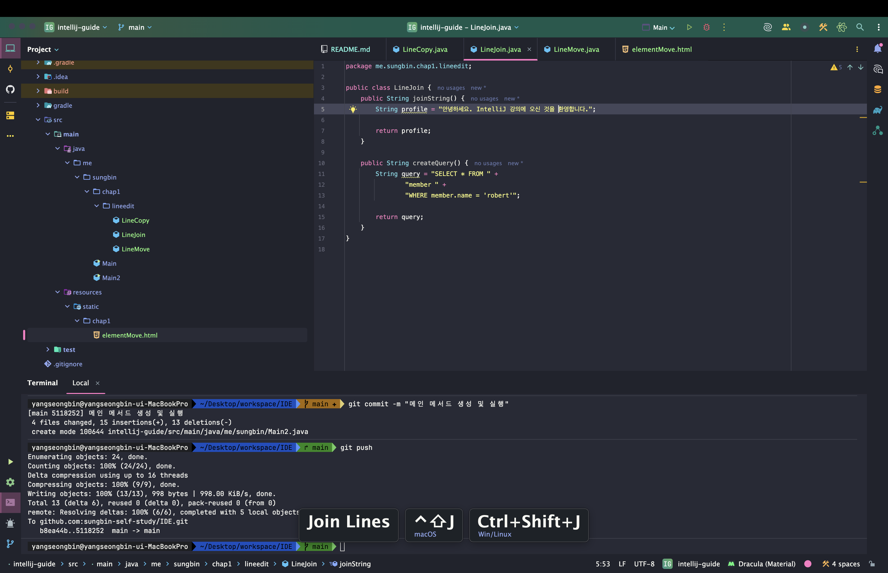

이 기능의 정식 명칭은 **Join Lines**이고, `J`는 Join의 약자다. 그래서 맥과 윈도우가 동일한 단축키를 쓴다.

동작 방식에서 몇 가지 짚어둘 부분이 있다.

- **합쳐지는 기준은 "현재 커서가 있는 라인의 다음 줄"** 이다. 즉 커서를 둔 줄에 아랫줄이 딸려 올라온다. 그래서 세 줄을 합치고 싶다면 첫 줄에 커서를 두고 두 번 누르면 된다.
- **단순히 붙이는 게 아니라 문법을 이해하고 정리해준다.** 위 예시처럼 문자열이 `+` 로 연결되어 있으면 `+` 와 불필요한 따옴표를 알아서 제거하고 하나의 문자열로 만들어준다. 코드 스타일 설정을 참고해서
  불필요한 공백까지 정리한다.
- **문자열만 되는 게 아니다.** 공식 문서 기준으로 Join Lines는 아래 것들을 모두 처리한다.
    - 여러 줄로 나뉜 **문자열 리터럴**
    - **필드나 변수 선언과 그 초기화** (예: `int i;` 와 `i = 10;` → `int i = 10;`)
    - 일반적인 **명령문 (statement)**
    - 여러 줄 **주석**

이 기능을 어디에 가장 많이 쓰는지에 대해 강사님은 이렇게 이야기한다.

> "이걸 어디다 쓰냐면 대부분 제일 많이 쓰는 거는 SQL 쿼리를 짤 때예요."

정말 공감되는 부분이다. 자바에서 긴 SQL을 문자열로 작성하다 보면 가독성 때문에 여러 줄로 쪼개게 되는데, 이걸 DB 툴에 복사해서 실행해보려면 한 줄로 합쳐야 한다. 그때마다 손으로 `+` 와 따옴표를 지우는
것은 정말 고통스러운 일이다.

> 참고로 반대 기능도 있다. 한 줄을 문법에 맞게 여러 줄로 쪼개는 **Split Line**은 `Ctrl + Enter`(맥은 `command + Enter`)다. 다만 Join Lines만큼 자주 쓰이지는
> 않는다.

### 라인 단위로 옮기기

아래의 코드가 있다고 하자.

``` java
package me.sungbin.chap1.lineedit;

public class LineMove {
    public void moveLineAndStatement() {
        System.out.println("라인 혹은 구문 단위로 이동시킵니다.");

        for (int i = 0; i < 10; i++) {
            System.out.println(i);
        }
    }
}
```

만약 해당 출력문을 원하는 곳으로 이동하고 싶다면 어떻게 할까? 해당 출력문을 복사해서 원하는 라인으로 붙여넣고 이전 출력문을 삭제해야 할 것이다. 하지만 이것도 인텔리제이에서 단축키로 제공을 해준다. 맥 기준
`option + shift + 위/아래` 혹은 윈도우/리눅스 기준 `alt + shift + 위/아래`를 눌러주면 자유롭게 해당 라인이 이동이 가능하다.

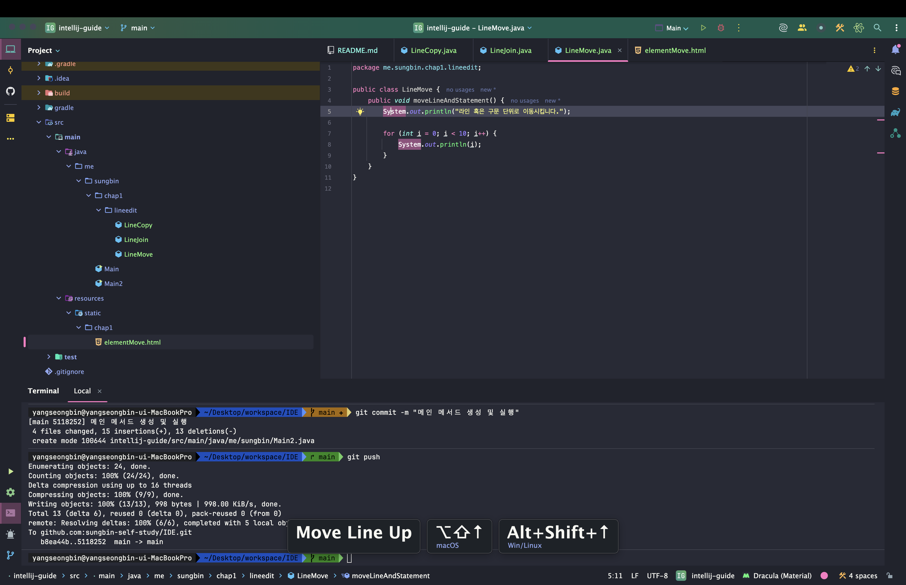

하지만 이런 단축키를 이동하면 원하는 라인으로 마음대로 이동이 가능하기에 컴파일 에러가 발생할 가능성이 있다. 이를 위해 구문에 맞게 라인 이동을 할 수 있게 해주는 단축키를 제공해주는데 맥 기준
`command + shift + 위/아래` 혹은 윈도우/리눅스 기준 `Ctrl + Shift + 위/아래`를 눌러주면 된다.

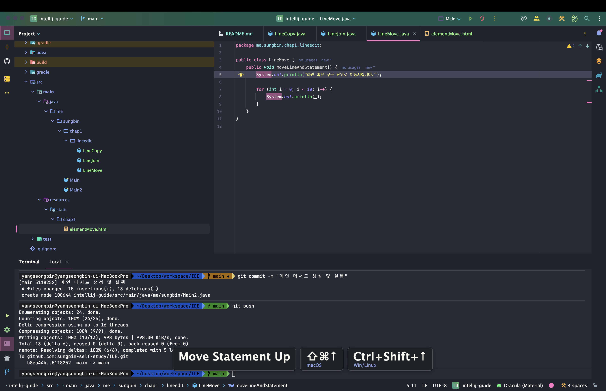

이 두 개가 어떻게 다른지 조금 더 명확하게 정리해보자. 사실 이름부터 다르다.

| 구분          | Move Line (라인 이동)                        | Move Statement (구문 이동)    |
|---------------|----------------------------------------------|-------------------------------|
| 맥            | `option + shift + ↑/↓`                       | `command + shift + ↑/↓`       |
| 윈도우/리눅스 | `alt + shift + ↑/↓`                          | `Ctrl + Shift + ↑/↓`          |
| 동작          | 문법과 무관하게 **텍스트 줄 그 자체**를 이동 | **문법 구조를 인식해서** 이동 |
| 특징          | 어디로든 갈 수 있다 (블록 밖으로도)          | 유효한 위치까지만 이동한다    |
| 결과          | 컴파일 에러가 날 수 있다                     | 컴파일 에러가 나지 않는다     |

예를 들어 위 코드의 출력문에 커서를 두고 **Move Line**을 아래로 계속 누르면 `for` 블록 안으로 쑥 들어가 버린다. 반면 **Move Statement**를 누르면 for문 전체를 하나의 덩어리로
인식해서 그 아래로 통째로 건너뛴다. 심지어 메서드 선언부에 커서를 두고 Move Statement를 누르면 **메서드 전체가 통째로** 위아래로 이동한다.

그래서 실무에서는 이렇게 쓰는 것을 추천한다.

- **Move Statement (`command/Ctrl + shift + ↑↓`)**: 기본으로 이걸 쓴다. 메서드 순서를 바꾸거나, 변수 선언 위치를 조정할 때 안전하다.
- **Move Line (`option/alt + shift + ↑↓`)**: 주석이나 어노테이션처럼 문법 덩어리로 인식되지 않는 것을 옮기거나, 일부러 블록 안팎으로 넣고 뺄 때 쓴다.

그리고 여기서 강사님이 말한 팁 하나를 기억해두면 단축키 외우기가 훨씬 편해진다.

> "맥북에서 커맨드와 컨트롤의 기능을 합친 게 윈도우나 리눅스에서 컨트롤일 때가 많아요."

즉 맥의 `command`와 `control`이 윈도우에서는 대체로 `Ctrl` 하나로 합쳐지고, 맥의 `option`은 윈도우의 `alt`에 대응된다고 이해하면 대부분의 단축키를 유추할 수 있다.

### Element 단위로 옮기기

이제 위의 단축키를 응용한 단축키를 알아보자. 아래의 html 코드가 있다고 해보자.

``` html
<!DOCTYPE html>
<html lang="en">
<head>
    <meta charset="UTF-8">
    <title>Title</title>
</head>
<body>
<h1 id="titleId" name="titleName">This is a Heading</h1>
</body>
</html>
```

h1 태그의 속성 name을 id 옆에 두고 싶을 때가 있다. 이럴 때 맥 기준 `command + option + shift + 좌/우` 버튼을 누르거나 윈도우 기준 `Ctrl + Alt + Shift + 좌/우`
버튼을 누르면 된다.

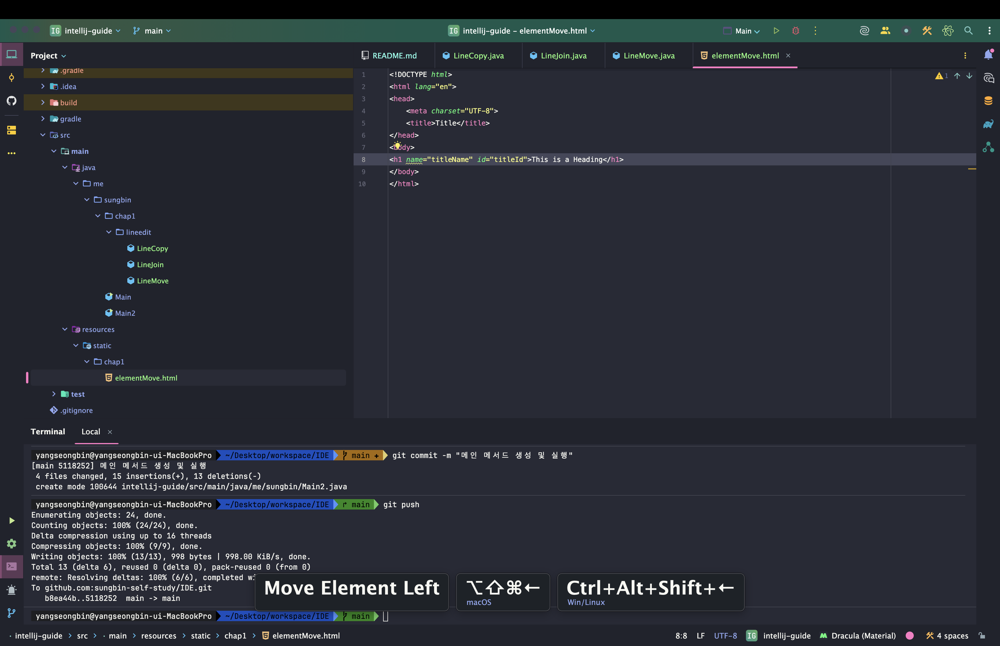

여기서 하나 짚고 싶은 것이 있다. 이 기능을 HTML 속성 전용으로 기억하는 경우가 많은데, **자바에서도 아주 유용하게 쓰인다.** 공식 문서 기준으로 이 기능 (Move Element Left/Right)이
동작하는 대상은 다음과 같다.

- **Java**: 메서드 **호출 및 선언의 인자 (파라미터)**, **enum 상수**, **배열 초기화식의 요소**
- **XML / HTML**: 태그의 속성

즉 아래와 같은 상황에서 그대로 쓸 수 있다.

``` java
// 메서드 파라미터 순서를 바꾸고 싶을 때
// email에 커서를 두고 command + option + shift + 좌 를 누르면
public void send(String to, String from, String email) { ... }

// 이렇게 바뀐다
public void send(String to, String email, String from) { ... }
```

``` java
// 배열 초기화식의 요소 순서도 바꿀 수 있다
String[] names = {"robert", "sungbin", "jane"};
```

메서드 파라미터 순서를 바꾸는 것은 실제로 자주 있는 일인데, 이걸 손으로 하면 잘라내기와 붙여넣기를 반복하다가 쉼표를 빼먹기 십상이다. 이 단축키는 쉼표까지 알아서 정리해준다.

> 다만 이 단축키는 손가락 네 개를 동시에 써야 해서 상당히 어렵다. 자주 쓰지 않는다면 굳이 외우지 말고 "이런 게 있다"는 것만 기억해뒀다가, 필요할 때 이전 편에서 배운 Find Action
> (`command/ctrl + shift + a`)에서 `Move Element`를 검색해서 쓰는 것도 좋은 방법이다.
>
> 참고로 리눅스 GNOME 환경에서는 이 단축키가 시스템 워크스페이스 전환 단축키와 충돌할 수 있으니, 동작하지 않는다면 OS 단축키를 먼저 확인해보자.

그러면 단축키들을 한번 정리해보자.

- 라인 복사
    - 맥: `command + d`
    - 윈도우/리눅스: `Ctrl + d`
- 라인 삭제
    - 맥: `command + backspace`
    - 윈도우/리눅스: `Ctrl + y`
- 라인 합치기
    - 맥: `Ctrl + Shift + J`
    - 윈도우/리눅스: `Ctrl + Shift + J`
- 구문 이동
    - 맥: `command + shift + 위/아래`
    - 윈도우/리눅스: `Ctrl + shift + 위/아래`
- 라인 이동
    - 맥: `option + shift + 위/아래`
    - 윈도우/리눅스: `alt + shift + 위/아래`
- element 단위로 옮기기
    - 맥: `option + command + shift + 좌/우`
    - 윈도우/리눅스: `alt + ctrl + shift + 좌/우`

## 코드 즉시보기

이번 챕터의 주제는 **"확인하려고 다른 파일로 갔다가 돌아오는 왕복 이동을 없애는 것"** 이다. 강사님의 표현을 빌리면 이렇다.

> "우리가 빠르게 개발해야 되는 상황에서 매번 이렇게 클래스를 직접 찾아가서 인자값이 뭔지를 확인해야 되는 상황은 굉장히 불편해요."

생각해보면 이 왕복 이동에는 숨은 비용이 있다. 단순히 파일을 여는 시간뿐만 아니라, **내가 원래 뭘 하려고 했는지에 대한 맥락이 흐려진다**는 점이 진짜 손해다. 그래서 IntelliJ는 "지금 있는 자리에서
팝업으로 잠깐 보여주고 사라지는" 기능들을 제공한다.

### 인자 값 즉시 보기

아래의 클래스 파일이 있다고 해보자.

``` java
package me.sungbin.chap1.view;

public class EmailSender {
    private Long id;

    private String name;

    private String email;

    public EmailSender(Long id, String name, String email) {
        this.id = id;
        this.name = name;
        this.email = email;
    }

    public String getEmail() {
        return email;
    }

    public void send(String to) {
        System.out.println(this.email + "님이 " + to + "님에게 메일을 보냈습니다.");
    }

    public static void receive(String from, String to) {
        System.out.println(from + "님으로부터 " + to + "님이 메일을 받았습니다.");
    }
}
```

그리고 이 클래스 파일을 작성하고 아래처럼 클래스 파일을 사용하려고 한다. 하지만 뭔가 인자 값을 까먹을 수도 있을 것이다. 그럴 때 어떻게 확인을 할까? 지금까지는 해당 클래스 파일로 가서 확인을 한 후에 적어야
할 것이다. 하지만 인텔리제이에서는 단축키를 제공해준다. 맥은 `command + p`이고 윈도우/리눅스는 `Ctrl + p`이다.

``` java
package me.sungbin.chap1.view;

public class ViewArguments {
    public void viewArguments() {
        EmailSender emailSender = new EmailSender(1L, "", "");
        EmailSender.receive("", "");
    }
}
```

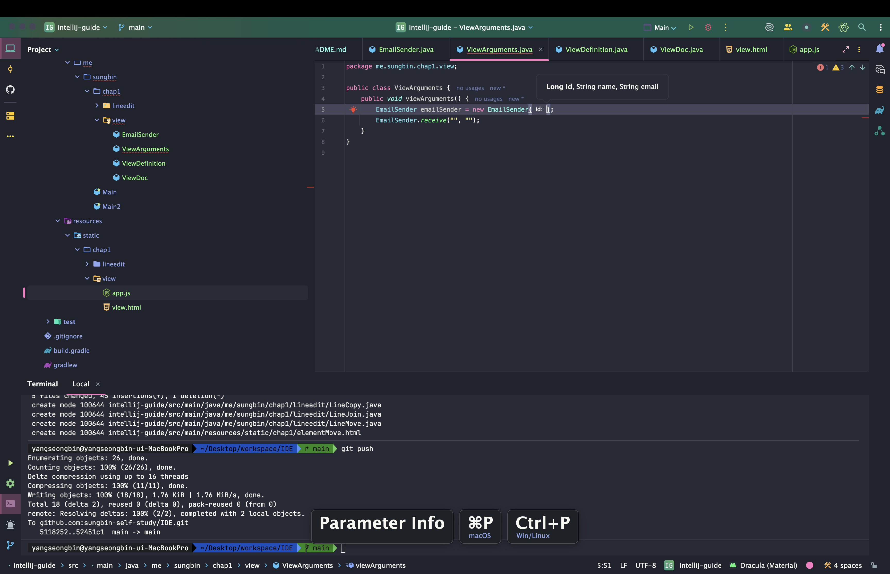

이 기능의 이름은 **Parameter Info**다. 몇 가지 알아두면 좋은 점이 있다.

- **괄호를 열면 약 1초 뒤에 자동으로 뜬다.** 즉 `new EmailSender(` 까지만 쳐도 잠시 기다리면 알아서 나타난다. 단축키는 팝업이 사라졌거나 중간에 다시 확인하고 싶을 때 쓰는 것이다.
- **현재 입력 중인 위치의 파라미터가 굵게 강조된다.** 위 예시에서 두 번째 인자를 입력 중이라면 `String name` 부분이 강조되므로, 지금 뭘 넣어야 하는지 헷갈릴 일이 없다.
- **오버로딩된 메서드라면 가능한 시그니처가 전부 나열된다.** 인자 개수와 타입이 다른 여러 버전이 있을 때, 그중 현재 입력값과 맞는 것이 활성화되어 표시된다.
- 파라미터 이름만이 아니라 메서드명과 반환 타입까지 보고 싶다면 `Settings` → `Editor` → `General` → `Code Completion`에서 전체 시그니처 표시 옵션을 켜면 된다.

### 코드 구현부 즉시 보기

만약에 아래의 코드를 작성하다가 send 메서드 구현부라던지 생성자 혹은 해당 클래스가 어떻게 구현되었는지 궁금할 수도 있을 것이다. 그럴 때 우리는 해당 파일로 가서 구현부를 확인 후에 돌아가야하는 작업을 거쳤어야
한다. 하지만 이것은 매우 비효율적이다. 그래서 인텔리제이에서는 해당 기능을 단축키로 제공해준다. 구현부가 궁금한 부분에 커서를 두고 맥은 `option + space`, 윈도우/리눅스는
`Ctrl + Shift + i`를 입력하면 구현부를 즉시 확인할 수 있다.

``` java
package me.sungbin.chap1.view;

public class ViewDefinition {
    public void viewDefinition() {
        EmailSender emailSender = new EmailSender(1L, "robert", "robert@email.com");
        emailSender.send("test@test.com");
    }
}
```

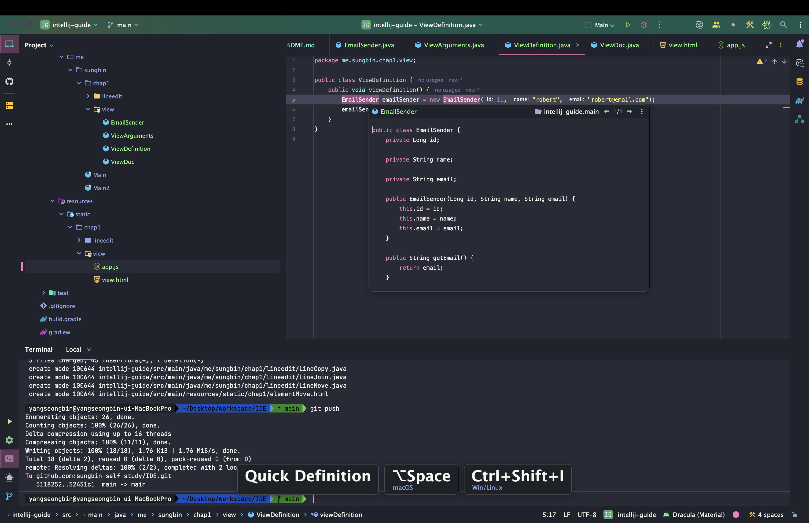

이 기능의 이름은 **Quick Definition**이다. 여기서 중요한 포인트는 **파일을 열지 않는다**는 것이다. 즉 에디터 탭이 늘어나지 않고, 지금 보고 있던 코드에서 시선을 떼지 않아도 된다.

확인할 수 있는 대상도 메서드에 한정되지 않는다.

- **메서드**: 실제 구현 코드
- **클래스**: 클래스 전체 코드
- **생성자**: 생성자가 어떤 필드를 초기화하는지
- **변수/필드**: 어디서 어떻게 선언되었는지
- **상수**: 실제 값이 무엇인지

특히 남이 만든 라이브러리 코드를 볼 때 진가를 발휘한다. 예를 들어 스프링의 어떤 어노테이션이 내부적으로 무엇을 하는지 궁금할 때, 파일을 열지 않고도 바로 들여다볼 수 있다.

> 만약 "잠깐 보는 것"이 아니라 아예 그 코드로 이동하고 싶다면 `command + b`(윈도우/리눅스는 `Ctrl + b`)를 쓰면 된다. 이건 선언부로 **이동**하는 Go to Declaration
> 기능이다. 상황에 따라 두 가지를 구분해서 쓰면 좋다.
>
> - 값만 슬쩍 확인하고 싶다 → **Quick Definition** (`option + space`)
> - 그 코드를 본격적으로 읽거나 수정하겠다 → **Go to Declaration** (`command + b`)

이것을 더 나아가서 얼티메이트 버전에서는 html 파일에 import 시킨 javascript 구현부도 즉시 확인이 가능하다.

``` html
<!DOCTYPE html>
<html lang="en">
<head>
    <script src="./app.js"></script>

    <meta charset="UTF-8">
    <title>Title</title>
</head>
<body>
<h1 id="titleId" name="titleName">This is a Heading</h1>
</body>
</html>
```

``` javascript
console.log('aaa');
```

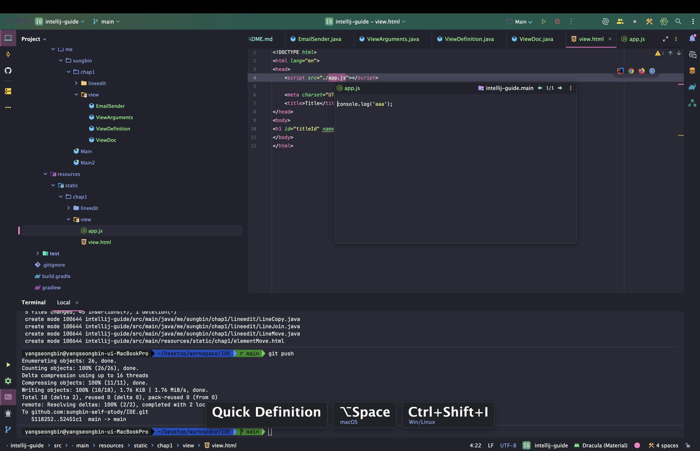

즉 커뮤니티 버전에서는 이 기능이 자바 코드에 한정되지만, 얼티메이트 버전에서는 HTML, JavaScript, CSS 같은 정적 파일까지 서로 연결해서 보여준다. 웹 개발을 병행한다면 이 차이가 꽤 크게 느껴질
것이다.

### Doc 바로 보기

우리가 개발을 하다가 해당 docs가 어떤지 궁금할 경우가 있을 것이다. 그러면 우리는 해당 홈페이지로 접속해서 궁금한 것을 검색해서 docs를 볼 것이다. 하지만 이것조차도 인텔리제이에서 단축키를 제공해준다.
docs가 궁금한 부분에 커서를 두고 맥은 `F1`, 윈도우/리눅스는 `Ctrl + q`를 입력해주면 된다.

``` java
package me.sungbin.chap1.view;

public class ViewDoc {
    public void viewDoc() {
        double random = Math.random();
        System.out.println("현재 줄을 복사합니다.");
    }
}
```

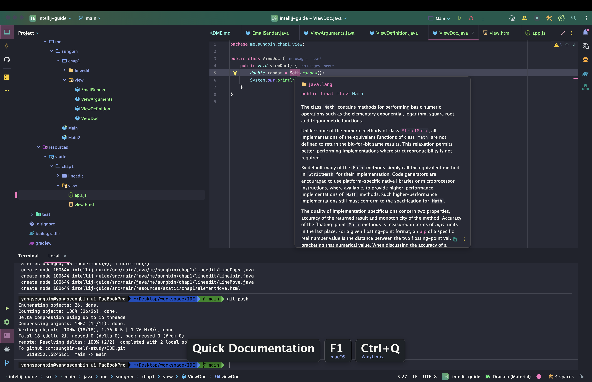

강사님도 이 부분을 이렇게 설명한다.

> "자바 독을 보려면 보통 우리가 오라클 홈페이지를 찾아가서 보는데요, 그럴 필요 없이 IntelliJ에서 바로 볼 수 있는 방법이 있습니다."

이 기능의 이름은 **Quick Documentation**이며, 여기에 알아두면 좋은 동작이 몇 가지 더 있다.

- **한 번 더 누르면 도구 창 (Tool Window)으로 전환된다.** 팝업은 다른 곳을 클릭하면 사라지는데, 문서를 계속 띄워두고 코드를 작성하고 싶을 때 유용하다. 도구 창 탭을 우클릭해서 고정해둘 수도
  있다.
- **마우스를 올리기만 해도 문서가 뜨는 설정**이 있다. 이게 거슬린다면 팝업의 옵션 메뉴에서 `Show on Mouse Move`를 꺼주면 된다. 반대로 켜두면 마우스만 올려도 확인이 가능하다.
- **`Shift + F1`을 누르면 외부 브라우저로 공식 문서가 열린다.** IDE 안의 요약만으로 부족할 때 쓰면 된다.
- 자바뿐 아니라 얼티메이트 버전에서는 자바스크립트의 MDN 문서까지 같은 방식으로 볼 수 있다.

> **보너스: 이 표현식의 타입이 뭐지? (Type Info)**
>
> 강의에는 나오지 않지만 같은 계열로 아주 유용한 기능이 하나 더 있다. 복잡한 스트림 체이닝이나 제네릭이 잔뜩 들어간 코드를 보다 보면 "지금 이 표현식의 실제 타입이 뭐지?"가 궁금할 때가 있는데, 이때
> `Ctrl + Shift + P`를 누르면 커서가 놓인 표현식의 타입을 알려준다.
>
> ``` java
> // 이 부분에 커서를 두고 Ctrl + Shift + P 를 누르면
> // Map<Boolean, List<String>> 이라고 알려준다
> names.stream().collect(Collectors.partitioningBy(name -> name.length() > 5));
> ```

그러면 이제 정리를 해보자.

- 인자 값 즉시 보기
    - 맥: `command + p`
    - 윈도우/리눅스: `Ctrl + p`
- 코드 구현부 즉시 보기
    - 맥: `option + space`
    - 윈도우/리눅스: `Ctrl + Shift + i`
- 선언부로 이동
    - 맥: `command + b`
    - 윈도우/리눅스: `Ctrl + b`
- Doc 보기
    - 맥: `F1`
    - 윈도우/리눅스: `Ctrl + q`
- 외부 문서 (브라우저)로 보기
    - 맥/윈도우/리눅스: `Shift + F1`
- 타입 정보 보기
    - 맥/윈도우/리눅스: `Ctrl + Shift + P`

## 마무리

이번 편에서는 코드를 **만들고 (생성) → 고치고 (라인 편집) → 확인하는 (즉시 보기)** 가장 기본적인 흐름을 단축키로 처리하는 방법을 살펴봤다.

여기서 소개한 단축키가 스무 개 가까이 되는데, 이걸 한 번에 다 외우려고 하면 십중팔구 실패한다. 그래서 우선순위를 매겨보자면 필자는 아래 다섯 개부터 손에 익히는 것을 추천한다.

1. **라인 복사** (`command/Ctrl + d`) — 사용 빈도가 압도적으로 높다.
2. **라인 삭제** (`command + backspace` / `Ctrl + y`)
3. **구문 이동** (`command/Ctrl + shift + ↑↓`)
4. **재실행** (`Ctrl + r` / `Shift + F10`)
5. **구현부 즉시 보기** (`option + space` / `Ctrl + Shift + i`)

이 다섯 개만 몸에 익혀도 코드를 만지는 속도가 눈에 띄게 달라진다. 나머지는 "그런 게 있었지"라고 기억해뒀다가 필요한 순간에 이 글을 다시 찾아보면 된다.

다음 편에서는 **포커스**를 다룬다. 지금까지는 "커서가 이미 원하는 위치에 있다"는 전제로 이야기했는데, 사실 그 위치까지 커서를 옮기는 것 자체도 마우스 없이 할 수 있다. 에디터와 도구 창 사이를 오가는
방법, 그리고 선택 영역을 문법 단위로 확장하는 방법을 알아보도록 하겠다.
