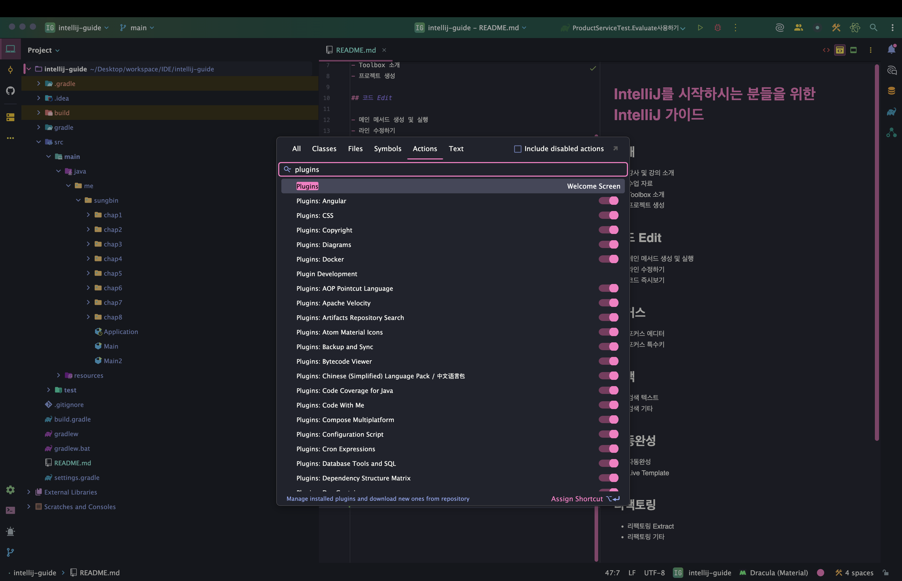
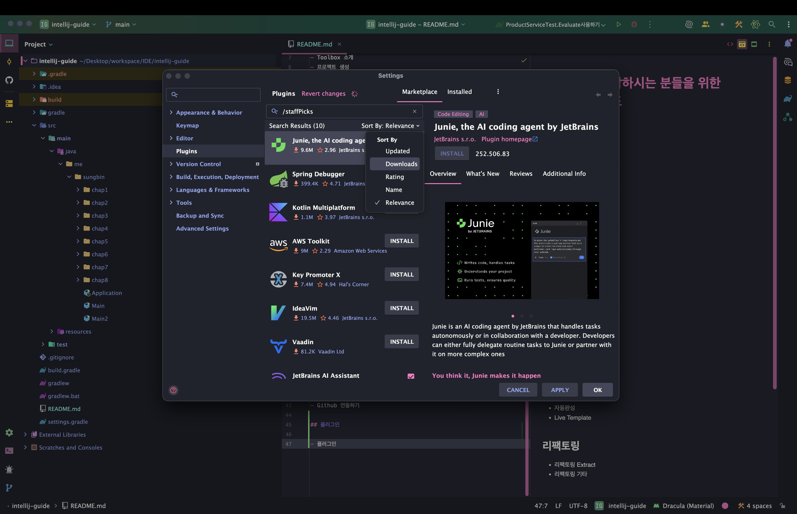
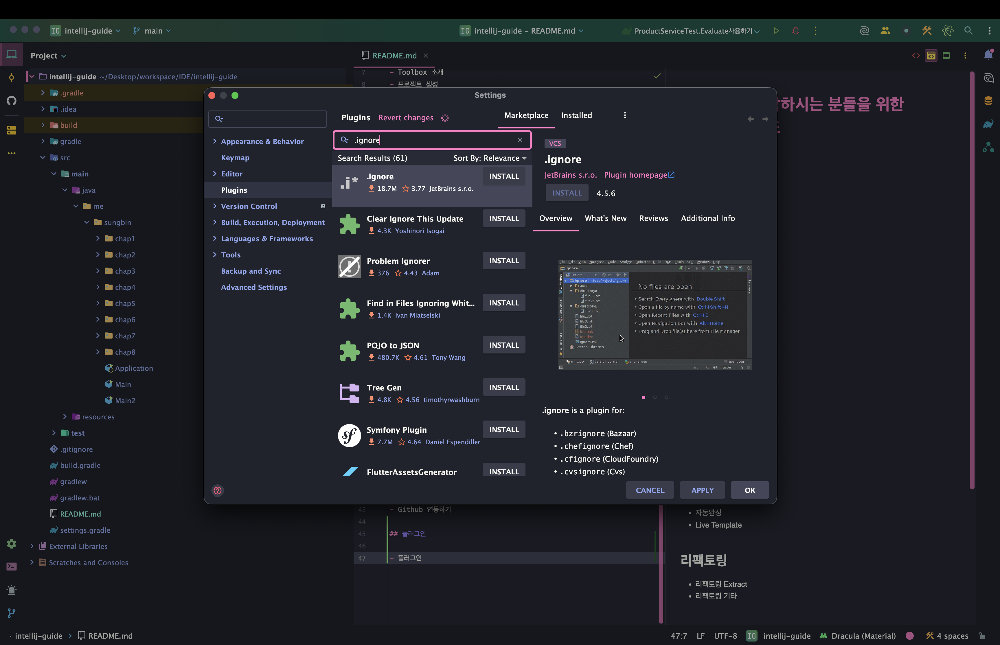
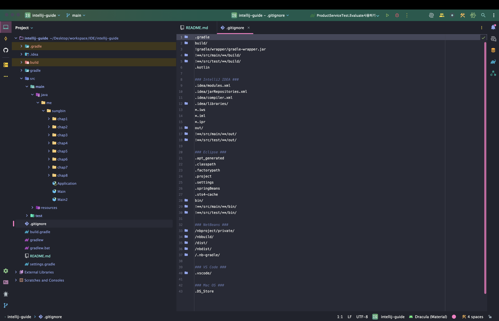
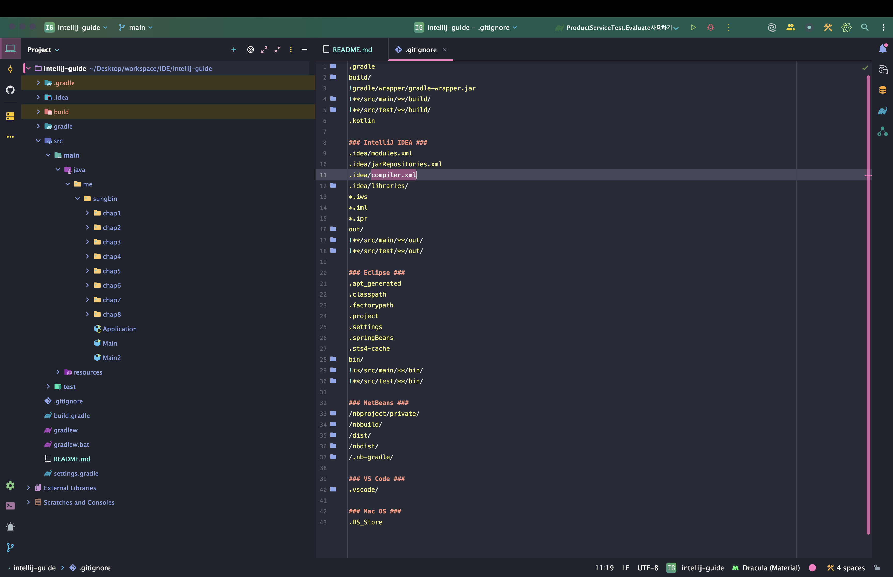
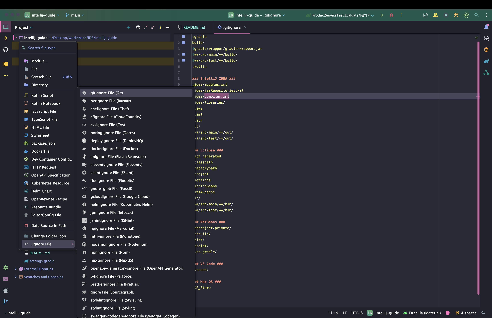
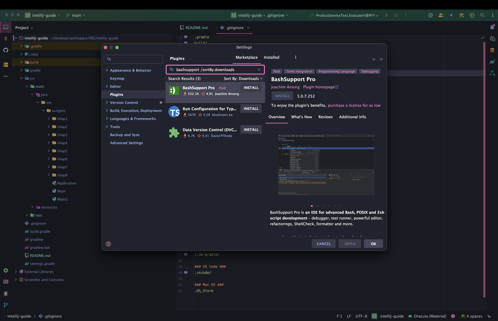
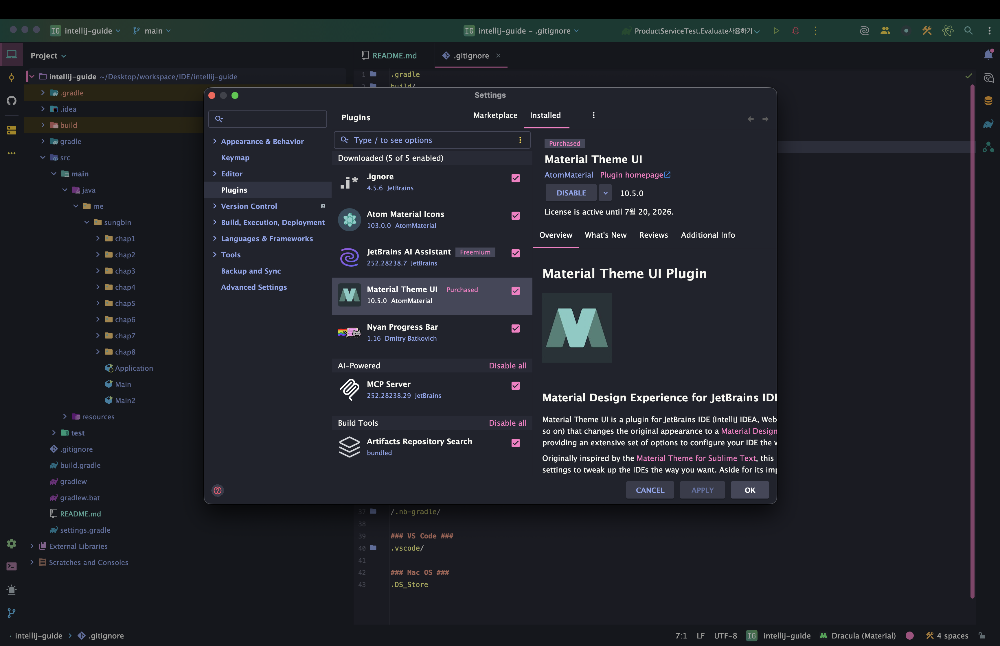
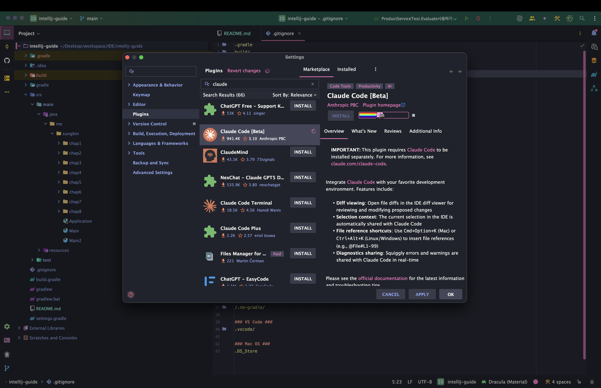
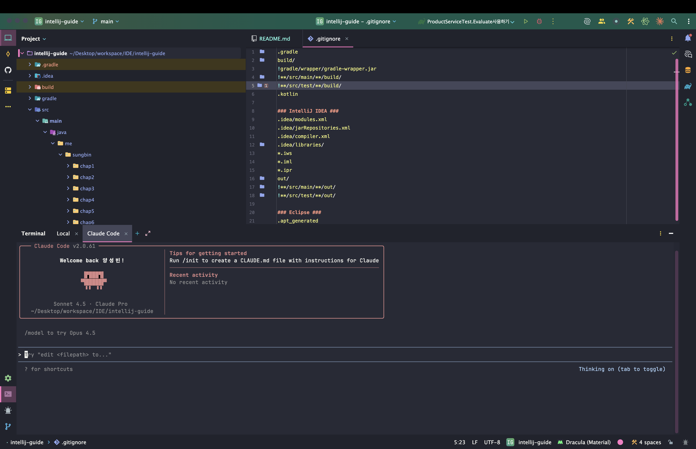

> 해당 포스팅은 인프런의 [IntelliJ를 시작하시는 분들을 위한 IntelliJ 가이드](https://inf.run/doaZn) 강의를 참조하여 작성한 글입니다.

## 플러그인

인텔리제이에는 진짜 막강한 플러그인들이 존재한다. 그런 플러그인을 어떻게 검색하고 설치하고 추천 플러그인들에 대해 살펴보자.

### 플러그인 설치

Action 검색을 하여 `plugins`라고 검색을 해보자.



그러면 이미 설치된 플러그인들과 Maretplace로 검색을 해볼 수 있다.


마켓플레이스에서 검색해보면 수 많은 플러그인들이 존재하는데 여기서 어떤 플러그인들이 좋은지 확인하려면 `show all` 버튼을 클릭하고 sort by라는 팔터에서 다운로드를 누르면 어느 플러그인이 많이 설치가 되었고 검증이 되었는지도 확인이 가능하다.



### 추천 플러그인

그러면 대표적으로 플러그인 몇개를 설치해보도록 하겠다. 먼저 설치할 플러그인은 `ignore`이다. 해당 플러그인은 .gitignore파일과 같이 ignore파일에서 뭔가 자동완성 및 사용자가 보기 편한 UI까지 제공해주는 플러그인이다.



기존 플러그인 설치 전은 아래와 같이 되어 있었다.



하지만 플러그인을 설치하면 아래와 같이 UI자체에서도 바뀐 것을 알 수 있을 것이다.



또한, ignore파일을 직접 만드는 기능도 생기며 다양한 종류의 ignore파일을 만들 수 있다.



다음으로 살펴 볼 플러그인은 `bashSupport`라는 플러그인이다. 해당 플러그인을 설치하면 shell 파일에서 자동 완성 기능과 실행 기능을 제공해준다. 물론 UI도 사용자가 보기 편하게 확인할 수 있다. 하지만 문제는 해당 플러그인이 어느순간부터 유료로 변경이 되었다. 필자는 구매를 하지 않았지만 구매를 해보고 싶다면 구매를 해도 좋을 것 같다.



다음은 `Material Theme`이다. 해당 테마는 IDE의 기본 테마를 이쁜 테마로 변경을 할 수 있다. 하지만 이 플러그인도 유료이다. 필자는 구매해서 사용을 하였고 `Draculra` 테마로 변경을 해서 사용 중이니 참고 바란다.



다음 추천 할 플러그인은 `Claude Code`이다. 요즘 AI 시대인 만큼 AI Agent들을 많이 사용한다. 필자는 특히 `Claude`를 많이 이용하는 중인데 인텔리제이에서도 이것을 인지하고 베타버전으로 Claude Code 플러그인을 제공해준다.



설치를 진행하면 아래와 같이 사용이 가능한데 단순히 플러그인만 설치한다고 되는 것은 아니고 아래와 같이 `npm`으로 설치를 진행해야 한다.

``` bash
npm install -g @anthropic-ai/claude-code
```

그리고나서 설치한 플러그인으로 열어야 하는데 IDE의 우측 상단에 클로드 아이콘을 클릭하면 아래와 같은 화면이 나올 것이다.

> 물론 아이콘을 누르고 설정 및 인증을 해줘야 한다.



그 외의 수많은 플러그인들이 존재하는데 독자가 검색을 해서 본인과 맞는 플러그인 설치를 해보면 좋을 것 같다. 플러그인 추천 모음집과 같은 블로그도 많으니 하단의 블로그도 참고해보면 좋을 것 같다.

> ✅ 참고
>
> https://be-a-developer.tistory.com/entry/%EC%9D%B8%ED%85%94%EB%A6%AC%EC%A0%9C%EC%9D%B4IntelliJ-IDEA-%ED%94%8C%EB%9F%AC%EA%B7%B8%EC%9D%B8-%EC%B6%94%EC%B2%9C-%EB%AA%A8%EC%9D%8C#google_vignette