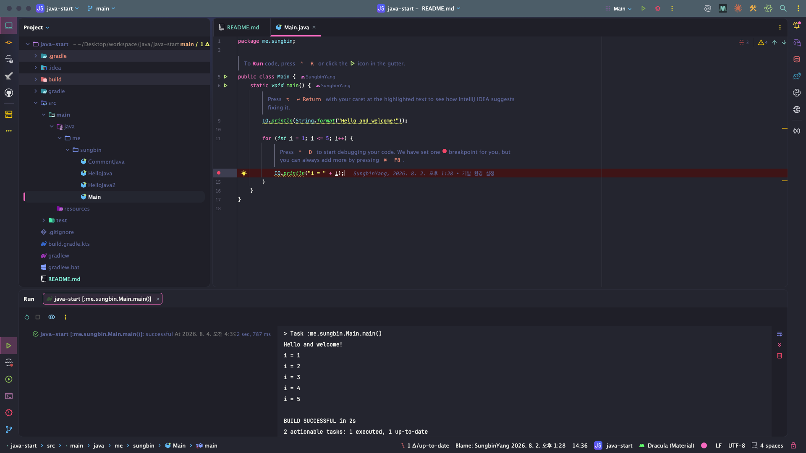

> 해당 포스팅은 [김영한의 자바 입문 - 코드로 시작하는 자바 첫걸음](https://inf.run/QrDnN) 강의를 참고로 하여 작성된 블로그입니다.

## ☕ 개발 환경 설정

자바 학습의 첫 관문은 코드가 아니라 **개발 환경** 이다. 프로그램을 한 줄이라도 실행해보려면 *자바를 실행할 도구* 와 *코드를 작성할 편집기* 가 먼저 갖춰져 있어야 하기 때문이다.

이번 글에서는 [김영한 강사님의 개발 환경 설정 강의](https://www.inflearn.com/courses/lecture?courseId=332505&unitId=194537)를 따라, **IntelliJ
IDEA 설치 → JDK 설치 → 프로젝트 생성 → 실행** 까지의 과정을 처음부터 끝까지 정리해본다.

### 어떤 개발 툴을 써야 할까: IntelliJ vs Eclipse

> 여러분들이 자바로 프로그램을 개발할 때 어떤 개발 툴을 쓰는 게 좋지? 이런 고민이 있으실 거에요.

자바를 시작하는 사람이라면 누구나 한 번쯤 하는 고민이다. 자바 진영의 대표적인 **IDE (통합 개발 환경)** 는 크게 두 가지, **IntelliJ IDEA** 와 **Eclipse** 다.

| 구분      | IntelliJ IDEA                        | Eclipse                                |
|-----------|--------------------------------------|----------------------------------------|
| 현재 위상 | *현재 대세*, 메이저 회사 대부분 사용 | 과거에 널리 쓰였고, 지금은 레거시 위주 |
| 속도      | 빠름                                 | 상대적으로 느림                        |
| 편의 기능 | 자동 완성·리팩터링 등이 강력         | 기본기는 충실하나 편의성은 아쉬움      |
| 비용      | Community 무료 / Ultimate 유료       | 무료                                   |

과거에는 Eclipse를 정말 많이 썼지만, 최근에는 **빠른 속도와 개발 편의성** 덕분에 IntelliJ가 사실상 표준이 되었다. 강사님도 이렇게 정리한다.

> 과거에는 Eclipse 를 정말 많이 썼어요. 근데 최근에는 이 빠른 속도와 사용자의 개발 편의성 때문에 IntelliJ 를 주로 많이 사용합니다.

물론 오래된 레거시 프로젝트에서는 여전히 Eclipse를 쓰는 경우도 있다. 하지만 *지금 새로 시작한다면* IntelliJ를 고르는 것이 맞다. 이 시리즈도 IntelliJ 기준으로 진행한다.

### 운영체제는 Mac이어야 할까: Mac vs Windows

두 번째 고민은 운영체제다. 결론부터 말하면 **아무거나 써도 된다.**

자바로 개발하는 메이저 회사 대부분이 Mac을 사용하는 건 사실이다. 하지만 *자바는 어떤 운영체제에서도 똑같이 동작* 하고, IntelliJ 역시 Mac과 Windows 버전의 화면이 거의 같다.

> 윈도우랑 맥이랑 두개 막 다르게 만들지 않을 거잖아요. 본인 툴을 만드는 거기 때문에 거의 똑같습니다.

강의는 Mac 기준으로 진행되지만, 학생이나 입문자 중에는 Windows 사용자가 훨씬 많다. 이 글에서도 *Windows에서 달라지는 지점* 은 따로 짚어두었으니, Windows를 쓴다고 위축될 필요는 전혀 없다.

### 자바 (JDK)를 따로 설치하지 않아도 되는 이유

보통 "자바 개발을 시작하자"고 하면 이런 순서를 떠올린다.

1. 자바 공식 사이트에 접속한다
2. JDK를 내려받아 설치한다
3. 환경 변수 (`JAVA_HOME`, `PATH`)를 잡는다
4. 그제야 IDE를 설치한다

**하지만 이 과정을 전부 건너뛸 수 있다.** IntelliJ는 *IDE 안에서 JDK 다운로드와 설정까지 한 번에* 처리해주기 때문이다.

> 이 IntelliJ 개발 툴을 쓰면 여기 IntelliJ 안에서 자바 설치도 함께 되게 편리하게 진행할 수 있거든요.

즉, 우리가 할 일은 **IntelliJ 하나만 설치하는 것** 이다. 입문자가 가장 많이 좌절하는 *환경 변수 설정* 이라는 벽이 아예 사라지는 셈이다.

### 📢 새로운 소식 — 무료 버전과 유료 버전이 통합되었다

> **인텔리제이 무료 버전과 유료 버전이 통합되었습니다.**

과거에는 무료 버전 (Community Edition)과 유료 버전 (Ultimate Edition)이 **별도의 제품으로 분리** 되어 있었지만, 최근에 **하나로 통합** 되었다.

통합된 인텔리제이도 **자바와 관련된 핵심 기능은 여전히 무료로 제공** 된다. 따라서 다운로드 링크에서 보이는 제품을 그대로 받아서 사용하면 된다. 아래 다운로드 안내에서 `Community Edition` 을
아무리 찾아도 보이지 않는다면, 바로 이 통합 때문이니 당황하지 않아도 된다.

### IntelliJ IDEA 다운로드

[JetBrains IntelliJ IDEA 다운로드 페이지](https://www.jetbrains.com/idea/download/)에 접속한 뒤, 본인의 운영체제 탭을 선택한다. 여기서 **주의할 점이 하나**
있다.

페이지 상단에는 유료 버전인 **Ultimate** 가 크게 노출된다. 우리가 받아야 할 것은 그 아래로 스크롤해야 나오는 **IntelliJ IDEA Community Edition** 이다.

> 무료 버전인 여기 내려가시면 Community Edition이라고 있거든요. 요거를 받아서 쓰시면 됩니다.

운영체제별로 받을 파일은 다음과 같다.

| 운영체제 | 선택할 항목                                                   |
|----------|---------------------------------------------------------------|
| Windows  | `.exe` 설치 파일                                              |
| macOS    | CPU 아키텍처에 맞는 `.dmg` — **Apple Silicon** 또는 **Intel** |

macOS 사용자는 *CPU 아키텍처* 를 반드시 확인하자. M1 이후 맥북이라면 **Apple Silicon**, 그 이전 모델이라면 **Intel** 을 선택해야 한다. (헷갈린다면 좌측 상단 Apple 메뉴 →
`이 Mac에 관하여` 에서 칩 정보를 확인할 수 있다.)

내려받은 뒤에는 평소 프로그램을 설치하듯 진행하면 된다. 특별히 건드릴 옵션은 없다.

### Community Edition vs Ultimate Edition

"무료 버전을 쓰면 뭔가 부족하지 않을까?" 하는 걱정이 들 수 있다. **자바를 학습하는 단계에서는 두 버전의 차이가 거의 없다.**

| 구분        | Community Edition | Ultimate Edition                 |
|-------------|-------------------|----------------------------------|
| 가격        | **무료**          | 유료 (구독)                      |
| 자바 개발   | 문제없이 가능     | 가능                             |
| 주요 차이   | —                 | 웹·스프링·DB 등 *추가 편의 기능* |
| 입문자 권장 | ✅                | 굳이 필요 없음                   |

Ultimate의 장점은 대부분 *스프링이나 데이터베이스 연동 같은 실무 영역* 에서 드러난다. 순수 자바 문법을 익히는 지금 단계에서는 Community Edition으로 충분하고, 강의도 Community
Edition으로 진행된다.

> 자바 언어를 여러분들이 처음 학습한다고 가정을 하기 때문에 툴도 가급적이면 맞춰야 되겠다 생각해서 저도 무료 버전인 커뮤니티 에디션으로 자바 강의를 진행을 할 겁니다.

### 첫 프로젝트 생성하기

설치가 끝났다면 IntelliJ를 실행하고 **New Project** 를 선택한다. 그러면 프로젝트 설정 화면이 나오는데, 항목이 많아 보여도 실제로 신경 쓸 것은 몇 개 되지 않는다.

| 항목                      | 설정 값                                 | 비고                                    |
|---------------------------|-----------------------------------------|-----------------------------------------|
| **Name**                  | 원하는 프로젝트 이름 (예: `java-start`) | 영문 소문자 권장                        |
| **Location**              | 프로젝트를 저장할 경로                  | 한글·공백이 없는 경로가 안전하다        |
| **Create Git repository** | *체크 해제*                             | 지금은 필요 없다                        |
| **Language**              | `Java`                                  | —                                       |
| **Build system**          | `IntelliJ`                              | Maven·Gradle은 아직 필요 없다           |
| **JDK**                   | `21` 버전                               | 아래에서 자세히 설명                    |
| **Add sample code**       | *체크*                                  | 실행 확인용 예제 코드를 자동 생성해준다 |

여기서 **Build system** 을 `IntelliJ` 로 두는 것이 포인트다. Maven이나 Gradle은 라이브러리 의존성을 관리하는 *빌드 도구* 인데, 입문 단계에서는 오히려 이해할 것만 늘어난다.
IntelliJ 자체 빌드를 쓰면 코드 작성과 실행에만 집중할 수 있다.

#### JDK 설치하기

JDK 항목의 드롭다운을 열면 **Download JDK...** (또는 `Add SDK` → `Download JDK`) 메뉴가 보인다. 이걸 선택하면 IntelliJ가 알아서 JDK를 내려받아 설정까지 마쳐준다.

| 항목         | 선택 값          |
|--------------|------------------|
| **Version**  | `21`             |
| **Vendor**   | `Oracle OpenJDK` |
| **Location** | 기본값 그대로    |

**21 버전** 은 자바의 **LTS (Long Term Support, 장기 지원)** 버전이라 안정적이고 자료도 풍부하다. 벤더는 `Oracle OpenJDK` 를 권장한다.

> 만약 목록에 `Oracle OpenJDK 21` 이 보이지 않는다면? 그럴 때는 `Eclipse Temurin`, `Amazon Corretto` 등 **다른 벤더의 21 버전** 을 선택해도 학습에는 아무
> 문제가 없다. JDK는 표준 스펙을 따르는 구현체라서, *벤더가 달라도 자바 문법과 동작은 동일* 하다.

macOS 사용자라면 목록에 `aarch64` 와 `x86_64` 가 함께 보일 수 있다. **Apple Silicon 맥북은 `aarch64`**, Intel 맥북은 `x86_64` 를 고르면 된다.

설정을 마쳤다면 **Create** 를 눌러 프로젝트를 생성한다.

### 실행해서 확인하기

`Add sample code` 를 체크했다면, 프로젝트가 열리면서 `src` 폴더 아래에 `Main.java` 파일이 생성되어 있을 것이다. 대략 아래와 같은 코드다.

```java
public class Main {
    public static void main(String[] args) {
        System.out.println("Hello and welcome!");

        for (int i = 1; i <= 5; i++) {
            System.out.println("i = " + i);
        }
    }
}
```

에디터 상단 (또는 코드 왼쪽 줄 번호 옆)의 **초록색 ▶ Run 버튼** 을 누르면 프로그램이 실행된다. 화면 아래 콘솔 창에 이런 결과가 나오면 성공이다.

```text
Hello and welcome!
i = 1
i = 2
i = 3
i = 4
i = 5
```

이 출력이 보인다면 **JDK 설치, 컴파일, 실행까지 모든 환경이 정상** 이라는 뜻이다. 여기까지 왔다면 개발 환경 설정은 끝났다.

#### 📢 새로운 소식 — 자바 25부터는 `IO.println()`

> 자바 25부터는 사용자의 편의를 위해서 **`IO.println()`** 기능을 제공한다.

만약 JDK를 **25 버전 이상** 으로 설치했다면, 자동 생성되는 기본 코드가 위와 다르게 보일 수 있다. `System.out.println()` 대신 **`IO.println()`** 을 사용하도록 코드가
제공되기 때문이다.

```java
// 자바 21 — 기존 방식
System.out.println("Hello and welcome!");

// 자바 25 이상 — 새로 제공되는 방식
IO.println("Hello and welcome!");
```

이름부터 훨씬 짧아졌다. **`System` 의 `out` 을 거치지 않고 곧바로 출력** 할 수 있으니, 입문자 입장에서는 외울 것이 하나 줄어드는 셈이다.

다만 이 기능은 **자바 25 이상에서만 동작** 한다. 이 글에서는 LTS 버전인 **21 버전** 을 기준으로 진행하므로, 앞으로 나오는 모든 예제는 `System.out.println()` 을 사용한다.



### Windows 사용자를 위한 추가 안내

앞서 말했듯 Mac과 Windows의 IntelliJ는 거의 같지만, **메뉴 위치가 다른 곳이 하나** 있다. 바로 *설정 (Settings)* 이다.

| 운영체제 | 설정 메뉴 경로                           |
|----------|------------------------------------------|
| macOS    | `IntelliJ IDEA` → `Settings` (`Cmd + ,`) |
| Windows  | `File` → `Settings` (`Ctrl + Alt + S`)   |

> 맥과 다르게 설정 메뉴가 파일에 있다. 요 부분이 맥과 다르니까 유의하자.

강의 영상에서 "IntelliJ IDEA 메뉴에서 설정을 여세요"라는 말이 나올 때, Windows에서는 **File 메뉴** 를 보면 된다. 그리고 설정 창 왼쪽의 메뉴 트리가 접혀 있어 항목이 안 보이는 경우가
있는데, 이때는 *펼침 아이콘을 클릭* 해서 하위 항목을 열면 된다.

### IntelliJ가 한글로 보인다면

최근 IntelliJ는 설치 시 **한국어 언어팩** 이 기본으로 켜져 있는 경우가 있다. 한글 메뉴가 편할 것 같지만, 실제로는 *강의 화면이나 구글링 결과와 메뉴 이름이 달라져* 오히려 헷갈린다. 영문으로
바꿔두는 편을 추천한다.

1. `File` → `Settings` (macOS는 `IntelliJ IDEA` → `Settings`) 로 이동
2. **Plugins** 메뉴 선택
3. **Korean Language Pack / 한국어 언어팩** 을 찾아 *체크 해제*
4. `OK` 를 누르면 재시작 안내가 뜨고, 재시작 후 영문으로 바뀐다

> 한국어 언어팩. 이게 체크가 되어 있으실 거에요. 이 체크를 풀고 OK를 누르면 재시작이 되면서 다시 영문으로 바뀌게 됩니다.

### 자바 버전에 대한 참고 사항

입문 과정에서 헷갈리기 쉬운 버전 이슈를 미리 짚어둔다.

- **JDK 21을 쓰는 이유** — LTS 버전이라 지원 기간이 길고, 관련 자료와 예제가 가장 풍부하다
- **`IO.println()` 은 자바 25 이상** — 최근 자바에서는 `System.out.println()` 대신 `IO.println()` 을 쓸 수 있다는 이야기를 볼 수 있는데, 이는 **자바 25
  버전 이상** 에서만 동작한다. 21 버전을 쓰는 이 강의에서는 `System.out.println()` 을 사용한다
- **벤더는 크게 중요하지 않다** — Oracle OpenJDK, Eclipse Temurin, Amazon Corretto 모두 같은 표준을 구현한 JDK다

## 📦 다운로드 소스 코드 실행 방법

인프런 강의 페이지에서는 **강의 소스 코드** 를 내려받을 수 있다. 직접 만든 프로젝트와는 별개로, 이 코드를 IntelliJ에서 열어보는 방법도 알아두면 좋다.

1. 강의 페이지에서 소스 코드를 다운로드하고 **압축을 해제** 한다 (`src` 폴더가 보인다)
2. IntelliJ에서 `File` → `New` → **Project from Existing Sources...** 를 선택한다
3. 압축을 푼 **최상위 폴더** 를 선택한다
4. 이후 창에서는 계속 `Next` 를 누르며 진행한다
5. JDK 선택 단계에서 **OpenJDK 21** 을 고른다. 목록에 없다면 `Download JDK` 로 설치한다
6. 프로젝트가 열리면 `src` 폴더의 코드를 열고 **초록색 ▶ Run 버튼** 으로 실행한다

> 무조건 next next 하고, 혹시 뭐 막 중간에 물어볼 수 있어요. 그러면은 그냥 긍정적인 대답을 하시면 됩니다.

여기서 **중요한 건 이 소스 코드를 대하는 태도** 다. 다운로드한 코드는 *답안지* 가 아니라 *참고서* 다.

> 이게 프로그램 언어는 머리로 배우는 게 아니라 진짜 손으로 배우는 거거든요. 가급적이면 모든 예제를 다 꼭 따라 해보세요.

강사님은 이 부분을 여러 번 강조한다. 다운로드 코드는 **직접 코딩하다 오타나 오류로 도저히 막혔을 때만** 열어보는 용도로 쓰고, 나머지는 처음부터 끝까지 손으로 직접 타이핑하자.

> 이거는 딱 진짜 참고용, 진짜 안될 때만 사용하시라고 전달을 해드린 겁니다.

그래서 프로젝트도 **직접 만든 것과 다운로드한 것을 폴더부터 구분해서 관리** 하는 편이 좋다. 실습은 내 프로젝트에서, 확인은 다운로드 프로젝트에서 하는 식이다.

## 🚀 자바 프로그램 실행

환경 설정이 끝났으니, 이제 **내 손으로 직접** 자바 프로그램을 만들어 실행할 차례다. 앞서 실행한 샘플 코드는 IntelliJ가 만들어준 것이었지만, 이번에는 파일 생성부터 코드 작성, 실행까지 전부 직접
해본다.

> 이번 시간에는 Java 프로그램을 직접 만들고 실행해 보겠습니다.

### 새 자바 파일 만들기

프로젝트 왼쪽 트리에서 **`src`** 폴더를 찾자. 이름 그대로 *source (소스 코드)* 가 들어가는 폴더다.

> src 이게 소스 코드가 있다는 곳이거든요?

`src` 폴더에서 **마우스 우클릭 → `New` → `Java Class`** 를 선택한 뒤, 이름을 **`HelloJava`** 로 입력하고 엔터를 누른다. 그러면 `HelloJava.java` 파일이
만들어지면서 아래와 같은 뼈대가 자동으로 생성된다.

```java
public class HelloJava {
}
```

> 파일을 만들 때 확장자 `.java` 는 직접 붙이지 않아도 된다. IntelliJ가 알아서 붙여준다.

### 첫 코드 작성하고 실행하기

생성된 클래스 안에 아래 코드를 채워 넣는다.

```java
public class HelloJava {
    public static void main(String[] args) {
        System.out.println("Hello Java");
    }
}
```

작성이 끝났다면 코드 왼쪽 줄 번호 옆이나 에디터 상단의 **초록색 ▶ Run 버튼** 을 눌러 실행한다. 아래쪽 콘솔 창에 이렇게 출력되면 성공이다.

```text
Hello Java
```

**축하한다. 방금 자바 프로그램을 처음으로 직접 만들어 실행한 것이다.**

### 코드 한 줄씩 뜯어보기

지금 작성한 코드는 짧지만, 자바 프로그램의 **필수 구성 요소가 전부 담겨 있다.** 하나씩 살펴보자.

| 코드 요소                                | 이름               | 역할                           |
|------------------------------------------|--------------------|--------------------------------|
| `public class HelloJava`                 | **클래스 (Class)** | 코드를 담는 가장 큰 단위       |
| `{ ... }`                                | **블록 (Block)**   | 클래스·메서드의 *범위* 를 지정 |
| `public static void main(String[] args)` | **main 메서드**    | 프로그램의 **시작점**          |
| `System.out.println("...")`              | **콘솔 출력**      | 값을 화면 (콘솔)에 출력        |
| `;`                                      | **세미콜론**       | *한 문장의 끝* 을 표시 (필수)  |

#### 클래스 — 이름과 파일명은 반드시 같아야 한다

`public class HelloJava` 는 **`HelloJava` 라는 이름의 클래스를 정의한다** 는 뜻이다. 여기서 입문자가 가장 많이 걸리는 규칙이 하나 있다.

> **클래스 이름과 파일 이름은 반드시 같아야 한다.**

즉, 클래스 이름이 `HelloJava` 라면 파일 이름도 `HelloJava.java` 여야 한다. 파일명을 바꾸거나 클래스명만 수정하면 컴파일 오류가 나니 주의하자. (클래스가 정확히 무엇인지는 뒤에서 훨씬
자세히 다룬다. 지금은 *코드를 담는 그릇* 정도로만 이해해도 충분하다.)

#### 블록 — 중괄호가 범위를 만든다

중괄호 `{` 와 `}` 로 둘러싸인 영역을 **블록 (Block)** 이라고 한다. 블록은 *어디부터 어디까지가 이 클래스 (또는 메서드)에 속하는지* 를 정해준다.

```java
public class HelloJava {   // ← 클래스 블록 시작
    public static void main(String[] args) {   // ← 메서드 블록 시작
        System.out.println("Hello Java");
    }   // ← 메서드 블록 끝
}   // ← 클래스 블록 끝
```

여는 중괄호와 닫는 중괄호는 **항상 짝을 이룬다.** 하나라도 빠지면 오류가 나므로, 오류가 났을 때 가장 먼저 확인해볼 지점이기도 하다.

#### main 메서드 — 프로그램은 여기서 시작한다

```java
public static void main(String[] args)
```

이 한 줄은 자바 프로그램에서 **가장 특별한 존재** 다. 프로그램을 실행하면 자바는 *가장 먼저 `main` 메서드를 찾아서* 그 안의 코드부터 실행하기 때문이다. 즉, **모든 자바 프로그램의 출발점** 이다.

지금은 `public`, `static`, `void`, `String[] args` 각각이 무슨 의미인지 몰라도 괜찮다. **일단은 통째로 외워서 쓰는 약속** 이라고 생각하고 넘어가면 된다. 각 키워드의 의미는
학습이 진행되면서 자연스럽게 이해하게 된다.

> 참고로 IntelliJ에서는 `main` 까지만 입력하고 **`Tab` 키 또는 엔터** 를 누르면 이 구문이 자동 완성된다. 매번 타이핑할 필요가 없다.

#### System.out.println () — 화면에 출력하기

```java
System.out.println("Hello Java");
```

**`System.out.println()`** 은 괄호 안의 값을 *콘솔에 출력* 하는 기능이다. 강사님은 이렇게 감을 잡아준다.

> System.out.println. 뭔가를 시스템 바깥에 출력을 한다는 느낌 들죠.

`System` (시스템)의 `out` (바깥)으로 `println` (줄 단위 출력)한다는 조합이니, 외우기보다 *의미로 기억* 하는 편이 낫다. 그리고 출력할 텍스트, 즉 **문자열은 반드시 쌍따옴표 `"` 로
감싸야**
한다.

#### 세미콜론 — 문장의 끝을 알리는 마침표

자바에서는 **한 문장이 끝날 때마다 세미콜론 `;` 을 붙여야 한다.** 우리가 글을 쓸 때 마침표를 찍는 것과 같다. 빼먹으면 곧바로 컴파일 오류가 나므로, 입문 단계에서 가장 자주 만나는 오류 원인 중 하나다.

### 자바는 대소문자를 구분한다

**꼭 기억해야 할 자바의 특징** 이 하나 있다.

> Java 언어는 대소문자를 구분해요.

`System` 을 `system` 으로 쓰면 **완전히 다른 것으로 취급되어 오류가 난다.** 아래처럼 첫 글자가 대문자인 것들을 특히 조심하자.

| 올바른 표기 | 흔한 실수   | 비고                      |
|-------------|-------------|---------------------------|
| `System`    | `system`    | 첫 글자 대문자            |
| `String`    | `string`    | 첫 글자 대문자            |
| `HelloJava` | `hellojava` | 클래스명은 첫 글자 대문자 |
| `main`      | `Main`      | 메서드명은 소문자로 시작  |
| `println`   | `printLn`   | 전부 소문자               |

### 들여쓰기 — 필수는 아니지만 지켜야 하는 관례

자바 코드는 **클래스 안에 메서드가 있고, 메서드 안에 실행 코드가 있는** 중첩 구조다. 이 구조를 눈으로 알아보기 쉽게 만드는 것이 **들여쓰기 (Indentation)** 다.

- 관례는 **스페이스 4칸** (`Tab` 키 한 번)
- 블록이 한 겹 중첩될 때마다 들여쓰기도 한 단계씩 깊어진다
- **문법적으로 필수는 아니다.** 들여쓰기가 없어도 프로그램은 정상 동작한다

하지만 대부분의 자바 개발자가 이 규칙을 따르기 때문에, 처음부터 습관을 들이는 편이 좋다. 들여쓰기가 무너진 코드는 *블록의 시작과 끝을 파악하기 어려워* 오류를 찾기도 힘들어진다.

> IntelliJ에서는 `Cmd + Option + L` (Windows는 `Ctrl + Alt + L`)을 누르면 들여쓰기를 포함한 코드 정렬을 자동으로 해준다.

### 프로그램은 위에서 아래로, 한 줄씩 실행된다

이번에는 출력을 여러 줄로 늘려보자. `src` 폴더에 **`HelloJava2`** 클래스를 새로 만들고 아래처럼 작성한다.

```java
public class HelloJava2 {
    public static void main(String[] args) {
        System.out.println("Hello Java 1");
        System.out.println("Hello Java 2");
        System.out.println("Hello Java 3");
    }
}
```

실행하면 결과는 이렇다.

```text
Hello Java 1
Hello Java 2
Hello Java 3
```

여기서 확인할 수 있는 **자바 프로그램의 실행 흐름** 은 다음과 같다.

1. 프로그램을 실행하면 자바가 **`main` 메서드를 찾는다**
2. `main` 블록 안의 코드를 **위에서부터 한 줄씩 순서대로** 실행한다
3. 마지막 줄까지 모두 실행하면 **프로그램이 종료된다**

작성한 순서 그대로 출력된다는 점을 눈으로 확인해두자. 앞으로 배울 조건문·반복문은 결국 *이 순서를 바꾸거나 반복시키는* 장치들이다.

## 💬 주석 (comment)

코드를 작성하다 보면 이런 상황을 만나게 된다.

- 이 코드가 **무슨 일을 하는지 설명** 을 남겨두고 싶다
- 코드를 **지우기는 아깝고, 잠깐만 실행을 막아두고** 싶다

> 자 그리고 뭔가 코드를 안 지우고 잠깐 실행을 막아두고 싶을 때가 있습니다.

이럴 때 사용하는 것이 **주석 (comment)** 이다.

### 주석이란?

주석은 **자바가 읽지 않고 그냥 무시하고 넘어가는 영역** 이다.

> 자 이럴 때 주석이라는 걸 사용하면 되는데요. 주석은 뭐냐면 Java가 이 주석이 있는 곳은 그냥 무시하고 넘어가요.

즉, 주석은 *컴퓨터가 아니라 사람을 위한 글* 이다. 컴파일러는 주석을 완전히 건너뛰기 때문에 프로그램 동작에는 아무 영향이 없고, 그 안에는 한글이든 영어든 어떤 내용을 적어도 문제가 되지 않는다.

주석은 두 가지가 있다.

| 종류             | 표기        | 범위                         |
|------------------|-------------|------------------------------|
| **한 줄 주석**   | `//`        | `//` 부터 **그 줄 끝까지**   |
| **여러 줄 주석** | `/*` ~ `*/` | `/*` 부터 `*/` 까지 **전부** |

### 실습 준비 — IntelliJ 자동 완성 활용하기

`src` 폴더에 **`Comment1`** 클래스를 만들어보자. 이번에는 IntelliJ의 **라이브 템플릿 (자동 완성)** 을 써서 타이핑을 줄여본다.

| 입력   | 자동 완성 결과                              |
|--------|---------------------------------------------|
| `psvm` | `public static void main(String[] args) {}` |
| `sout` | `System.out.println();`                     |

에디터에 `psvm` 을 치고 `Tab` 이나 엔터를 누르면 main 메서드가 통째로 완성된다. `sout` 도 마찬가지다. **자주 쓰는 코드일수록 손이 아니라 단축키로 치는 습관** 을 들여두면 좋다.

### 한 줄 주석 — `//`

```java
public class Comment1 {
    public static void main(String[] args) {
        // 여기에 설명을 적는다
        System.out.println("Hello Java 1");
        System.out.println("Hello Java 2");   // 줄 뒤에도 붙일 수 있다
    }
}
```

`//` 를 만나면 자바는 **그 줄의 끝까지** 를 통째로 무시한다. 코드 위에 따로 적어도 되고, 코드 뒤에 이어 붙여도 된다.

그리고 앞서 말한 **"코드를 지우지 않고 잠깐 막아두는"** 용도로도 쓸 수 있다.

```java
public class Comment1 {
    public static void main(String[] args) {
        System.out.println("Hello Java 1");
        // System.out.println("Hello Java 2");
        System.out.println("Hello Java 3");
    }
}
```

실행하면 결과는 이렇다.

```text
Hello Java 1
Hello Java 3
```

`Hello Java 2` 는 **코드가 그대로 남아 있는데도 실행되지 않았다.** 주석 처리된 줄을 자바가 아예 읽지 않았기 때문이다.

### 여러 줄 주석 — `/* */`

주석으로 막을 코드가 여러 줄이라면, 매번 `//` 를 붙이는 대신 **`/*` 와 `*/`** 로 범위를 감싸면 된다.

```java
public class Comment2 {
    public static void main(String[] args) {
        /*
        System.out.println("Hello Java 1");
        System.out.println("Hello Java 2");
        */
        System.out.println("Hello Java 3");
    }
}
```

```text
Hello Java 3
```

`/*` 부터 `*/` 까지의 **모든 내용** 이 무시된다. 참고로 IntelliJ에서는 `/*` 를 입력하고 엔터를 치면 닫는 `*/` 를 자동으로 만들어준다.

> 여러 줄 주석은 요렇게 하시면 되요. 슬래시 별 하고... 반대는 똑똑하게 해주네요. 인텔리제이가 똑똑해요.

### 주석 단축키

주석은 워낙 자주 쓰기 때문에 **단축키로 처리하는 것이 훨씬 빠르다.** 주석 처리할 줄에 커서를 두거나 여러 줄을 드래그한 뒤 아래 키를 누르면 된다.

| 기능              | macOS             | Windows            |
|-------------------|-------------------|--------------------|
| 한 줄 주석 토글   | `Cmd + /`         | `Ctrl + /`         |
| 여러 줄 주석 토글 | `Cmd + Shift + /` | `Ctrl + Shift + /` |

**토글** 이라는 점이 편리하다. 같은 키를 한 번 더 누르면 주석이 해제된다.

### 주석은 왜 필요할까

지금처럼 코드가 짧을 때는 주석의 필요성이 잘 와닿지 않을 수 있다. 하지만 **코드가 길고 복잡해질수록** 이야기가 달라진다.

- 몇 달 뒤의 나는 **내가 짠 코드도 기억하지 못한다**
- 다른 개발자가 내 코드를 읽을 때, *이 코드가 왜 여기 있는지* 를 알려주는 단서가 된다
- 특정 로직에 담긴 **의도와 목적** 은 코드만 봐서는 드러나지 않는 경우가 많다

그래서 주석은 *무엇을 하는지* 보다 **왜 그렇게 했는지** 를 남길 때 가장 값어치가 있다. 코드가 이미 말해주는 내용을 그대로 반복하는 주석은 오히려 관리 부담만 늘린다.

## 🔍 자바란?

코드를 직접 쳐보고 결과까지 확인했으니, 이제 **자바라는 언어 자체** 를 들여다볼 차례다. 지금까지 아무 생각 없이 눌렀던 *초록색 실행 버튼* 뒤에서 무슨 일이 벌어지는지 알게 되면, 앞으로 만날 오류 메시지도
훨씬 덜 무섭게 느껴진다.

### 자바는 "표준 스펙"과 "구현체"로 나뉜다

자바를 처음 설치할 때 `Oracle OpenJDK`, `Eclipse Temurin`, `Amazon Corretto` 같은 낯선 이름들이 줄줄이 나와 당황했을 것이다. **왜 자바를 만드는 회사가 이렇게
많을까?**

답은 자바가 **두 층으로 나뉘어 있기** 때문이다.

| 구분          | 정체                                        | 예시                                                |
|---------------|---------------------------------------------|-----------------------------------------------------|
| **표준 스펙** | *"자바는 이렇게 만들어야 한다"* 는 **문서** | JCP (Java Community Process)에서 관리               |
| **구현체**    | 그 문서대로 만든 **실제 동작하는 자바**     | Oracle OpenJDK, Eclipse Temurin, Amazon Corretto 등 |

> 자바는 이렇게 만들어야 된다는 설계도이며 문서라고 보시면 돼요. 그러니까 이거는 그냥 문서예요.

표준 스펙은 **설계도** 일 뿐, 그 자체로는 아무것도 실행하지 못한다. 여러 회사가 이 설계도를 보고 각자 자바를 만들어내는데, 그것이 바로 **구현체** 다.

건축에 비유하면 **표준 스펙은 설계도, 구현체는 그 설계도로 지은 건물** 이다. 같은 설계도를 썼으니 구조는 동일하고, 시공사에 따라 마감이 조금씩 다른 셈이다.

> 실제 동작하는 건 똑같은데 약간 최적화나 뭐 이런 것들이 조금씩 차이가 있습니다.

**그래서 학습 단계에서는 어떤 구현체를 골라도 상관없다.** 앞서 JDK를 설치할 때 "벤더는 크게 중요하지 않다"고 했던 이유가 바로 이것이다. 문법도, 동작도, 결과도 모두 같다.

### 자바 프로그램은 어떻게 실행될까

우리가 작성한 `HelloJava.java` 파일은 사람이 읽으라고 만든 텍스트다. **컴퓨터는 이 파일을 그대로 실행하지 못한다.** 그래서 자바는 실행까지 **두 단계** 를 거친다.

```text
HelloJava.java  ──[ javac ]──▶  HelloJava.class  ──[ java ]──▶  실행
   소스 코드         컴파일          바이트코드         JVM
```

| 단계         | 사용하는 프로그램 | 하는 일                                          |
|--------------|-------------------|--------------------------------------------------|
| **① 컴파일** | `javac`           | `.java` → `.class` (바이트코드) 변환             |
| **② 실행**   | `java`            | `.class` 를 **JVM (자바 가상 머신)** 위에서 실행 |

#### ① 컴파일 — 문법을 검사하고 최적화한다

**컴파일 (Compile)** 은 소스 코드를 컴퓨터가 다루기 좋은 형태인 **바이트코드 (`.class`)** 로 바꾸는 과정이다. 단순 변환만 하는 게 아니라 두 가지 중요한 일을 함께 처리한다.

- **문법 오류 검출** — 세미콜론 누락, 오타 같은 실수를 이 단계에서 잡아낸다
- **최적화** — 실행에 필요 없는 정보를 정리한다. *앞서 배운 주석이 여기서 제거된다*

주석이 프로그램 동작에 아무 영향을 주지 않는 이유가 바로 여기 있다. **컴파일 결과물에는 주석이 아예 남지 않는다.**

#### ② 실행 — JVM이 바이트코드를 돌린다

컴파일된 `.class` 파일은 **JVM (Java Virtual Machine, 자바 가상 머신)** 위에서 실행된다. `java` 명령이 JVM을 띄우고, 그 안에서 바이트코드가 동작하는 구조다.

#### IntelliJ가 이 모든 걸 대신해준다

원래대로라면 터미널에서 이런 명령을 직접 쳐야 한다.

```bash
javac HelloJava.java   # 컴파일 → HelloJava.class 생성
java HelloJava         # 실행
```

하지만 우리는 이런 걸 친 적이 없다. **초록색 ▶ 버튼 하나만 눌렀을 뿐이다.**

> 인텔리제이가 그걸 다 자동으로 해줘요.

실제로 IntelliJ는 실행 버튼을 누를 때마다 *컴파일 → 실행* 을 자동으로 수행한다. 결과물이 궁금하다면 프로젝트의 **`out` 폴더** 를 열어보자. 우리가 만든 `.class` 파일이 그대로 들어 있다.
(IntelliJ에서
`.class` 파일을 클릭하면 사람이 읽을 수 있게 **디컴파일** 해서 보여준다.)

### 자바의 최대 강점 — 운영체제 독립성

자바가 오랫동안 사랑받아온 가장 큰 이유는 **운영체제에 독립적** 이라는 점이다.

일반적인 프로그램은 만들어진 운영체제에서만 동작한다. Windows용 프로그램을 macOS에서 그냥 실행할 수 없는 것처럼 말이다. **하지만 자바는 다르다.**

| 구분                | 일반적인 프로그램     | 자바 프로그램                        |
|---------------------|-----------------------|--------------------------------------|
| 실행 대상           | 특정 OS 전용          | **자바가 설치된 모든 OS**            |
| OS를 바꾸면?        | 다시 만들어야 한다    | **같은 `.class` 파일을 그대로 실행** |
| 개발자가 신경 쓸 것 | OS별 차이를 직접 대응 | **자바 표준에만 맞춰 개발**          |

비결은 **OS별로 최적화된 자바 구현체가 따로 존재** 한다는 데 있다. Windows용 자바, macOS용 자바, Linux용 자바가 각각 있고, 이들이 *OS마다 다른 명령어 차이를 대신 흡수* 해준다.

```text
                        ┌──▶  Windows용 JVM  ──▶ Windows
HelloJava.class  ───────┼──▶  macOS용 JVM    ──▶ macOS
   (동일한 파일)         └──▶  Linux용 JVM    ──▶ Linux
```

덕분에 개발자는 **자바 표준에 맞춰 코드를 작성하기만 하면 되고, OS 호환성 문제는 자바가 알아서 해결해준다.**

이 특징은 실무에서 특히 빛을 발한다. 개발자는 각자 편한 **Mac이나 Windows에서 개발** 하지만, 실제 서비스는 대부분 **Linux 서버에서 운영** 되기 때문이다. 개발 환경과 운영 환경이 완전히
다른데도 문제가 없는 이유가 바로 자바의 이 이식성이다.

## ✅ 정리

**개발 환경 설정**

- 자바 IDE는 **IntelliJ IDEA** 가 대세이고, 입문 단계에서는 **Community Edition (무료)** 으로 충분하다
- 운영체제는 **Mac이든 Windows든 상관없다**. 다만 Windows는 설정 메뉴가 `File` 아래에 있다는 점만 기억하자
- **JDK를 따로 설치하고 환경 변수를 잡을 필요가 없다.** IntelliJ의 `Download JDK` 로 **21 버전** 을 설치하면 끝난다
- 프로젝트 생성 시 **Build system은 `IntelliJ`**, **`Add sample code` 는 체크** 하면 실행 확인이 쉽다
- 다운로드한 소스 코드는 *답안지가 아니라 참고서* 다. 막혔을 때만 열어보고, 코드는 직접 타이핑하자

**자바 프로그램 실행**

- 소스 코드는 **`src` 폴더** 안에 만들며, **클래스 이름과 파일 이름은 반드시 같아야** 한다
- 모든 자바 프로그램은 **`main` 메서드에서 시작** 해, **위에서 아래로 한 줄씩** 실행된다
- **`System.out.println()`** 으로 콘솔에 값을 출력하고, 문자열은 **쌍따옴표** 로 감싼다
- **한 문장이 끝나면 세미콜론 `;`**, **블록은 중괄호 `{}`** 로 범위를 지정한다
- 자바는 **대소문자를 구분** 한다. `System`, `String` 처럼 첫 글자가 대문자인 것들을 조심하자

**주석**

- 주석은 **자바가 무시하고 넘어가는 영역** 으로, 컴퓨터가 아닌 *사람을 위한 글* 이다
- **한 줄 주석은 `//`**, **여러 줄 주석은 `/* */`** 로 작성한다
- 코드를 **지우지 않고 잠깐 실행만 막아두는** 용도로도 쓸 수 있다
- 단축키는 `Cmd + /` (Windows는 `Ctrl + /`), 한 번 더 누르면 해제되는 **토글** 방식이다
- `psvm`, `sout` 같은 **라이브 템플릿** 을 쓰면 자주 쓰는 코드를 빠르게 작성할 수 있다

**자바란?**

- 자바는 **표준 스펙 (설계도 문서)** 과 **구현체 (실제 동작하는 자바)** 로 나뉜다. 학습 단계에서는 어떤 구현체를 써도 무방하다
- 자바 프로그램은 **① 컴파일 (`javac`) → ② 실행 (`java`, JVM)** 두 단계를 거친다
- 컴파일 과정에서 **문법 오류를 검출하고 주석을 제거** 한다. 결과물은 `out` 폴더의 `.class` 파일이다
- 이 모든 과정을 **IntelliJ가 실행 버튼 하나로 자동 처리** 해준다
- 자바는 **운영체제에 독립적** 이다. 같은 `.class` 파일이 Windows·macOS·Linux 어디서든 동작한다

강사님은 자바가 무엇인지에 대한 설명을 일부러 맨 뒤로 미뤘다고 말한다.

> 왜 이렇게 순서를 바꿨냐면, 처음부터 자바가 뭔지 설명하면 여러분 되게 안 와닿을 거란 말이에요. 그래도 최소한 이렇게 실행을 해보고, 뭔가 실행이 된 걸 콘솔 창으로 결과를 보고, 이렇게 한 다음에 자바란 뭔지
> 설명을 드려야 "아 이게 이 얘기구나" 라고 더 이해가 잘 되실 것 같아서 순서를 뒤로 했습니다.

실제로 직접 코드를 쳐보고 결과를 확인한 뒤에 컴파일과 JVM 이야기를 들으니, *추상적으로만 들렸을 개념들이* 훨씬 선명하게 다가온다. **프로그래밍은 머리가 아니라 손으로 배운다** 는 말이 그래서 나오는
것이다.

이것으로 **Hello World** 섹션이 마무리되었다. 다음 글에서는 프로그래밍의 가장 기본이 되는 **변수 (variable)** 에 대해 알아보도록 하겠다.