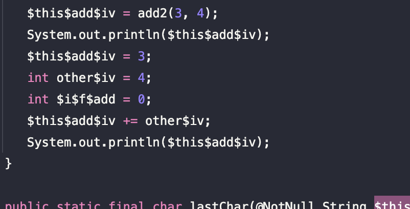
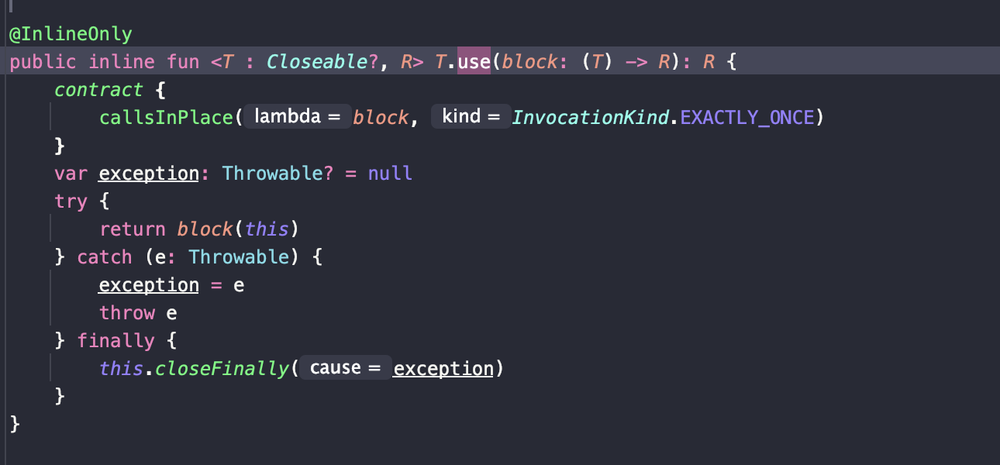

> 해당 포스팅은 인프런의 [자바 개발자를 위한 코틀린 입문(Java to Kotlin Starter Guide)](https://inf.run/yusn4) 강의를 참조하여 작성한 글입니다.

## 코틀린에서 배열과 컬렉션을 다루는 방법

### 배열

사실 실무에서는 배열을 잘 사용하지 않는다. 이펙티브 자바와 같은 책에서도 배열 대신에 `List`와 같은 컬렉션 객체를 사용하라고 권장한다. 하지만 문법조차도 모를 수는 없기에 문법적인 요소에 대한 설명만 짚고 넘어가겠다.

아래와 같은 자바 코드가 있다고 해보자.

``` java
int[] arr = {100, 200};

for (int i = 0; i < arr.length; i++) {
    System.out.printf("%s %s ", i, arr[i]);
}
```

이것을 코틀린 코드로 어떻게 변경이 가능할까? 여러가지 방법이 존재한다. 첫번째 방법부터 살펴보자.

``` kotlin
val arr = arrayOf(100, 200)
for (i in arr.indices) {
    println("$i ${arr[i]}")
}
```

배열을 만들 때는 `arrayof`라는 것을 사용해서 만들며, 배열의 원소들을 출력하거나 할 때는 위와 같이 `arr.indices`를 이용해서 사용해주면 된다. `arr.indices`는 배열의 첫번째부터 마지막 원소까지 범위 객체(위에서는 `IntRange`)를 만들어준다. 혹은 아래와 같이 index와 value값을 같이 가져오고 싶다면 `arr.withIndex()`를 사용하면 편리하게 index값과 value값을 가져올 수 있다.

``` kotlin
for ((index, value) in arr.withIndex()) {
    println("$index: $value")
}
```

또한, 자바의 배열과 다르게 `plus` 메서드로 배열의 원소를 쉽게 추가할 수 있다. 해당 메서드는 배열 자기 자신을 반환하는 타입을 가지기에 반드시 값을 받아서 사용해야 반영됨을 알 수 있다.

### 코틀린에서 Collection

코틀린에서 Collection을 만들어 줄 때 불변인지 가변인지를 결정해줘야 한다.


코틀린에서는 자바와 다르게 `List`, `Set`, `Map`과 같은 인터페이스의 구현체들이 불변 컬렉션이다. 그럼 여기서 가변 컬렉션과 불변 컬렉션의 차이는 무엇일지 한번 살펴보자.

- 가변 컬렉션: 컬렉션에 element를 추가, 삭제할 수 있다.
- 불변 컬렉션: 컬렉션에 element를 추가, 삭제를 할 수 없다.

즉, 코틀린은 기본적으로 불변 컬렉션이다. 자바로 치면 `Colections.unmodifiableList()`를 해주는 행위와 같은 것이다. 단, 불변 컬렉션이라고 하더라도 Reference Type인 Element 필드는 바꿀 수 있다. 그러면 이 내용들을 잘 생각하고 `List`부터 하나하나씩 살펴보자.

자바에서 불면 `List`를 만들어주려면 아래와 같이 하는 것이 일반적이다.

``` java
final List<Integer> numbers = List.of(100, 200);
```

위의 코드를 코틀린으로 변경하면 다음과 같다.

``` kotlin
val numbers = listOf(100, 200)
```

또한, 코틀린에서는 빈 리스트를 만들 수도 있다. 바로 아래와 같이 말이다.

``` kotlin
val emptyList = emptyList<Int>()
```

단, 빈 리스트를 만들 때는 코틀린이 해당 원소에 어떤 타입이 들어갈지를 모르니까 제네릭에 타입을 지정해줘야 한다. `listof`같은 경우도 제네릭으로 타입을 지정해줘야 하지만 안의 원소들의 타입을 보고 추론하기에 생략이 가능한 것이다.

그런데 이런 `emptyList`도 타입을 생략할 수 있는 경우가 있는데 바로 타입을 추론할 수 있는 경우이다. 바로 아래와 같은 경우가 `emptyList`의 타입 생략이 가능하다.

``` kotlin
fun main() {
    printNumbers(emptyList())
}

private fun printNumbers(numbers: List<Int>) {
    TODO()
}
```

그러면 생성한 `List`의 원소를 출력하는 방법에 대해 알아보자. 먼저, 자바 코드부터 살펴보자.

``` java
final List<Integer> numbers = List.of(100, 200);

// 첫번째 원소 가져오기
System.out.println(numbers.getFirst());

// for-each
for (int number : numbers) {
    System.out.println(number);
}

// 전통적인 for문
for (int i = 0; i < numbers.size(); i++) {
    System.out.printf("%s %s ", i, numbers.get(i));
}
```

위의 코드를 코틀린으로 변경하면 다음과 같다.

``` kotlin
val numbers = listOf(100, 200)

println(numbers[0])

for (number in numbers) {
    println(number)
}

for ((index, value) in numbers.withIndex()) {
    println("$index: $value")
}
```

코틀린에서 n번째 인덱스를 가져오고 싶을 때 자바처럼 `.get(인덱스 번호)`로 사용이 가능하지만 코틀린은 언어 차원에서 인덱싱을 해주기 때문에 마치 배열처럼 `[인덱스 번호]`로 가져올 수 있다. 그 외의 for-each와 전통적인 for문은 자바와 유사하다.

그러면 코틀린에서 만약 가변 리스트를 만들고 싶다면 어떻게 할까? 바로 아래와 같이 작성하면 된다.

``` kotlin
val mutableNumbers = mutableListOf(100, 200)
mutableNumbers.add(300)
```

`mutableListOf`는 가변 리스트이고 기본 구현체는 `ArrayList`이다. 기타 사용법은 자바와 동일하다.

> ✅ Tip
>
> 실무에서 리스트를 사용할 때 먼저, 불변 리스트로 만들어보고 만약 원소를 추가해야하거나 삭제해야 할 일이 있을 때 가변 리스트로 만들자.

다음으로 `Set`에 대해 알아보자. `Set`은 `List`와 다르게 순서가 없고, 같은 element는 하나만 존재할 수 있다. 자료구조적 의미만 제외하면 `List`와 완전히 동일하다. 그럼 바로 코틀린 코드를 살펴보자.

``` kotlin
val numberSet = setOf(100, 200)

for (number in numberSet) {
    println(number)
}

for ((index, value) in numberSet.withIndex()) {
    println("$index: $value")
}
```

코틀린에서 불변 set을 만들때는 `setOf`를 사용하면 되고 사용법은 `List`와 동일하다. 만약 가변 set을 만들려면 아래와 같이 해주면 된다.

``` kotlin
val mutableNumbersSet = mutableSetOf(100, 200)
```

기본 구현체는 `LinkedHashSet`이다.

다음으로 `Map`에 대해 살펴보자. 자바에서는 JDK8버전과 이후 버전에 따라 `Map`을 만드는 방법이 2가지 존재한다.

``` java
// JDK 8
Map<Integer, String> oldMap = new HashMap<>();
oldMap.put(1, "MONDAY");
oldMap.put(2, "TUESDAY");

// JDK 9+
Map<Integer, String> map = Map.of(1, "MONDAY", 2, "TUESDAY");
```

코틀린도 동일하게 `MutableMap`을 만들어 원소를 넣을 수도 있고 정적 팩토리 메서드를 활용하여 바로 만들 수도 있다.

``` kotlin
val oldMap = mutableMapOf<Int, String>()
oldMap[1] = "MONDAY"
oldMap[2] = "TUESDAY"

val map = mapOf(1 to "MONDAY", 2 to "TUESDAY")
```

`MutalbeMap`을 만들 때는 타입을 추론할 수 없어서 제네릭 타입을 붙여줬고 자바와 다르게 `put` 메서드로 key, value값을 넣어주는 것이 아니라 인덱싱을 활용하여 인덱스 번호에 key값을 넣어서 매핑이 가능하다. 물론 자바처럼 `put` 메서드를 사용이 가능하다. 또한, `mapOf(key to value)`를 활용하여 불변 `Map`을 만들 수도 있다.

이제 생성한 `Map`의 내용을 출력하는 방법에 대해 알아보자. 자바에서는 key 집합들을 전부 가져와서 key, value를 출력하는 방법도 있지만 entrySet이라는 key, value쌍을 한번에 가져와 그대로 출력하는 방법 2가지가 존재한다.

``` java
Map<Integer, String> map = Map.of(1, "MONDAY", 2, "TUESDAY");
for (int key : map.keySet()) {
    System.out.println(key);
    System.out.println(map.get(key));
}

for (Map.Entry<Integer, String> entry : map.entrySet()) {
    System.out.println(entry.getKey());
    System.out.println(entry.getValue());
}
```

코틀린도 자바처럼 2가지 방법이 존재하고 아래와 같이 변경이 가능하다.

``` kotlin
val map = mapOf(1 to "MONDAY", 2 to "TUESDAY")

for (key in map.keys) {
    println(key)
    println(map[key])
}

for ((key, value) in map.entries) {
    println("$key: $value")
}
```

### 컬렉션의 null 가능성, 자바와 함께 사용하기

코틀린에서는 nullable한 타입인지, non-nullable한 타입인지 구분을 따로 한다. 그래서 컬렉션에도 아래와 같이 3가지 타입이 존재할 수 있다.

- `List<Int?>`: 리스트에는 null이 들어갈 수 있지만, 리스트는 절대 null이 아님.
- `List<Int>?`: 리스트에는 null이 들어갈 수 없지만, 리스트는 null이 가능함.
- `List<Int?>?`: 리스트에도 null이 들어갈 수 있고, 리스트 자체도 null일 수 있음.

하지만 이런 경우때문에 자바 코드와 같이 쓰는 경우에서 많이 고생을 한다. 왜냐하면 자바에서는 읽기 전용 컬렉션과 변경 가능 컬렉션을 따로 구분하지 않기 때문이다. 그래서 만약 코틀린에서 만든 불변 컬렉션을 자바에서 가져오면 자바는 해당 컬렉션이 불변인지 아닌지를 구분하지 않기에 원소들을 막 추가할 수 있다. 하지만 이것을 다시 코틀린 코드로 전달하면 에러가 팡팡 터지게 되는 것이다.

또한, 코틀린에서 만든 non-nullable한 컬렉션이 있고 이것을 자바에서 가져와서 null을 추가하게 되고 다시 코틀린으로 전달하면 에러가 팡팡 터진다. 이런 이슈들을 막기위해서 코틀린쪽에서 `Collections.unmodifableXXX()`와 같은 것을 활용한 방어코드를 작성해줘야 한다.

그리고 코틀린에서 자바 컬렉션을 가져다 쓸 때 **플랫폼 타입**에 신경을 써야 한다. 자바에서는 non-nullable인지 아닌지를 구분하지 않기에 코틀린에서는 어떤 타입의로 컬렉션을 해야 할지 모른다. 이런 경우는 자바 코드를 보면서 맥락을 확인하고 자바 코드를 가져오는 지점을 wrapping 해야 한다.

## 코틀린에서 다양한 함수를 다루는 방법

### 확장 함수

확장 함수를 배우기 전에 왜 확장 함수가 나오게 되었는지 살펴보자. 코틀린은 자바와 100% 호환하는 것을 목표로 두고 있다. 그런 목표로 코틀린을 개발하던 중에 이런 의문점이 들었다고 한다.

> 기존 자바 코드 위에 **자연스럽게 코틀린 코드를 추가**할 수는 없을까?

즉, 자바로 만들어진 라이브러리를 유지보수, 확장할 때, 코틀린 코드를 덧붙이고 싶다는 의미인 것이다. 어떤 클래스안의 있는 메서드처럼 호출은 하되, 추가적인 코틀린 로직은 함수 밖에 만들고 싶은 것이다. 그래서 코틀린은 이러한 이유로 확장 함수를 만들게 되었고 아래와 같은 코드가 확장함수의 예시이다.

``` kotlin
fun String.lastChar(): Char = this[this.length - 1]
```

`fun`이라는 것은 함수를 정의한다고 표시할 때 사용되고, `String`은 해당 클래스를 확장한다는 표시이다. 그리고 `.확장함수 이름`을 작성해준다. 그리고 해당 내용으로 확장함수 내용을 적어주면 되는데 `this`를 통하여 해당 확장하려는 클래스에 접근할 수 있다. 즉, 확장함수의 구조는 아래와 같이 될 것이다.

``` kotlin
fun 확장하려는 클래스.확장 함수 이름(파라미터): 리턴타입 {
    // this를 이용해 실제 클래스 안의 접근 가능
}
```

> 확장 함수 안에서 사용되는 `this`를 수신 객체라고 하며, 확장하려는 클래스를 수신 객체 타입이라고 일컫는다.

이렇게 확장함수를 정의하면 마치 해당 클래스의 메서드를 호출하는 것처럼 사용이 가능하다.

``` kotlin
val str = "ABC"
println(str.lastChar())
```

그런데 문득 이런 질문이 생각 날 수 있을 것이다.

> 확장 함수가 `public`이고 확장 함수에서 수신 객체 클래스의 `private` 함수를 가져온다면 캡슐화가 깨지는 것 아닌가?

확장 함수를 만드신 코틀린 개발자분들이 이런 점을 염두하여 확장 함수는 클래스에 있는 `private`, `protected` 멤버를 가져올 수 없다.

그러면 이런 고민도 있을 것이다.

> 만약 확장 함수 메서드 시그니쳐와 멤버 함수의 메서드 시그니쳐가 같으면 어떻게 될 까?

``` java
package me.sungbin.lec16;

public class Person {

    private final String firstName;

    private final String lastName;

    private int age;

    public Person(String firstName, String lastName, int age) {
        this.firstName = firstName;
        this.lastName = lastName;
        this.age = age;
    }

    public String getFirstName() {
        return firstName;
    }

    public int getAge() {
        return age;
    }

    public int nextYearAge() {
        System.out.println("멤버 함수");
        return age + 1;
    }
}
```

위와 같은 person 클래스가 있다고 하자. 이것을 코틀린에서 확장함수를 만들려고 한다.

``` kotlin
fun Person.nextYearAge(): Int {
    println("확장 함수")
    return this.age + 1
}
```

그리고 코틀린 코드에서 아래와 같이 멤버 함수와 확장 함수 시그니쳐가 같은 메서드를 호출할 때 어느 함수가 호출될까?

``` kotlin
val person = Person("양", "성빈", 30)
println(person.nextYearAge())
```

정답은 멤버 함수가 우선권을 먼저 가진다. 그래서 우리가 확장 함수를 정의했는데 추후에 다른 기능의 똑같은 함수가 멤버함수로 생긴다면 문제가 생길 수 있으니 유의해서 만드는 것이 좋을 것 같다.

그럼 이런 질문도 있을 것이다.

> 만약, 확장 함수가 오버라이딩 된다면?

아래의 코틀린 클래스가 있다고 하자.

``` kotlin
open class Train(
    val name: String = "새마을 기차",
    val price: Long = 5_000,
)

fun Train.isExpensive(): Boolean {
    println("Train의 확장 함수")
    return this.price > 10000
}

class Srt : Train("SRT", 40_000)

fun Srt.isExpensive(): Boolean {
    println("Srt의 확장 함수")
    return this.price > 10000
}
```

위와 같이 `Train`과 `Srt`가 `isExpensive`라는 확장 함수를 동일하게 정의를 하였다. 이럴 때, 아래와 같이 작성하면 어느 확장함수가 호출될까?

``` kotlin
fun main() {
    val train = Train()
    train.isExpensive()

    val srt1: Train = Srt()
    srt1.isExpensive()

    val srt2 = Srt()
    srt2.isExpensive()
}
```

첫번째, train은 Train의 확장함수가 호출되고, srt1도 Train의 확장함수가 호출되며, srt2만 Srt의 확장함수가 호출된다. 즉, 확장함수가 오버라이드 되었을 때는 해당 변수의 **현재 타입**으로 어느 확장 함수가 호출될지를 결정한다. 즉, 정적인 타입에 의해 어떤 확장함수가 호출 될지 결정된다.

그러면 이렇게 만든 확장 함수를 자바 코드에서 가져다 쓸 수 있을까? 물론이다! 아래와 같이 정적 팩토리 메서드처럼 사용이 가능하다.

``` java
System.out.println(StringUtilsKt.lastChar("ABC"));
```

또한, 확장함수라는 개념은 **확장 프로퍼티**하고도 연결된다. 즉, 아래의 코드를 보면 `isLastChar`를 함수 형태처럼 쓸 수 있지만 custom getter를 통해서 프로퍼티 형태로도 사용이 가능하다.

``` kotlin
fun String.lastChar(): Char = this[this.length - 1]

val String.lastChar: Char
    get() = this[this.length - 1]
```

### infinx 함수

다음으로 infix 함수, 우리 말로 중위함수에 대해 알아보자. 중위함수란 이전에 배운 `step`, `downTo`와 같은 방식을 일컬으며 함수를 호출하는 새로운 방법을 의미한다. 중위함수는 `변수.함수이름(argument)`로도 호출이 가능하지만 일반적으로 `변수 함수이름 argument`로 호출을 하는 편이다.

``` kotlin
fun Int.add(other: Int): Int {
    return this + other
}
```

위의 함수를 중위함수로 변경하면 아래와 같다.

``` kotlin
infix fun Int.add(other: Int): Int {
    return this + other
}
```

그래서 사용 법은 아래와 같이 사용할 수 있다.

``` kotlin
println(3 add 4)
```

`infix`는 예시로는 확장함수로 예시를 들었지만 멤버함수에도 붙일 수 있다.

### inline 함수

inline 함수란, 함수가 호출 되는 대신에 함수를 호출하는 지점에 함수 본문을 그대로 복붙하고 싶은 경우에 사용된다.

``` kotlin
inline fun Int.add(other: Int): Int {
    return this + other
}
```

위와 같이 inline 함수를 정의하고 바이트 코드를 보면 바로 해당 함수 로직이 호출 지점에 들어가져 있는 것을 볼 수 있을 것이다.



inline 함수는 함수를 파라미터로 전달할 때, 오버헤드를 줄일 수 있다. 하지만, inline 함수의 사용은 성능 측정과 함께 신중하게 결정해야 한다.

### 지역 함수

지역 함수란, 함수 안에 함수를 선언할 수 있는 구조를 생각하면 된다. 즉, 지역 클래스와 동일한 개념으로 보면 좋을 것 같다. 하지만, 실무에서는 자주 사용하지 않으니 혹시나 사용하게 될 때 검색해서 찾아보면 쉬울 것이다.

## 코틀린에서 람다를 다루는 방법

### 자바에서 람다를 다루기 위한 노력

코틀린에서 람다를 어떻게 다루는지에 대해서 먼저 말하기 전에 자바에서 어떻게 람다가 생겨났고, 그것이 어떻게 코틀린에서 적용되는지에 대해 설명해보도록 하겠다.

아래와 같은 자바 코드가 있다고 하자.

``` java
package me.sungbin.lec17;

public class Fruit {

    private final String name;

    private final int price;

    public Fruit(String name, int price) {
        this.name = name;
        this.price = price;
    }

    public String getName() {
        return name;
    }

    public int getPrice() {
        return price;
    }
}
```

우리는 해당 클래스로 과일 가게 어플리케이션을 만든다고 가정하자. 그러면 일단 데이터를 미리 이렇게 만들어 두었다고 하자.

``` java
List<Fruit> fruits = List.of(
        new Fruit("사과", 1_000),
        new Fruit("사과", 1_200),
        new Fruit("사과", 1_200),
        new Fruit("사과", 1_500),
        new Fruit("바나나", 3_000),
        new Fruit("바나나", 3_200),
        new Fruit("바나나", 2_500),
        new Fruit("수박", 10_000)
);
```

그런데 어느 손님이 오셔서 사과만 보여주는 기능을 만들어달라고 요청이 들어왔다. 그래서 우리는 기깔나게 아래와 같이 작성을 했다고 하자.

``` java
private static List<Fruit> findApples(List<Fruit> fruits) {
    List<Fruit> apples = new ArrayList<>();
    for (Fruit fruit : fruits) {
        if (fruit.getName().equals("사과")) {
            apples.add(fruit);
        }
    }
        
    return apples;
}
```

그런데 다른 손님이 오셔서 바나나만 보여주는 기능을 만들어 달라고 요청을 하셨다. 그래서 우리는 메서드를 하나 더 추가하였다.

``` java
private static List<Fruit> findBananas(List<Fruit> fruits) {
    List<Fruit> bananas = new ArrayList<>();
    for (Fruit fruit : fruits) {
        if (fruit.getName().equals("바나나")) {
            bananas.add(fruit);
        }
    }
        
    return bananas;
}
```

하지만 우리는 개발자니까 중복이 발생한다는 것을 깨닫고 하나의 메서드로 리팩토링을 진행했다.

``` java
private static List<Fruit> findFruits(List<Fruit> fruits, String name) {
    List<Fruit> results = new ArrayList<>();
    for (Fruit fruit : fruits) {
        if (fruit.getName().equals(name)) {
            results.add(fruit);
        }
    }
        
    return results;
}
```

그런데 갑자기 장사가 잘 되어서 여러 손님들이 추가적인 요청을 하는 것이다. 1000원 이상의 과일만 보여달라던지, 사과랑 바나나랑 같이 보여달라던지 많은 요청들이 들어왔다. 그래서 단순히 파라미터를 늘리는 것만으로는 안된다고 판단이 되었다. 그래서 우리가 생각한 것인 인터페이스와 익명 클래스를 이용하는 방식이였다.

``` java
package me.sungbin.lec17;

@FunctionalInterface
public interface FruitFilter {
    boolean isSelected(Fruit fruit);
}

```

위와 같이 함수형 인터페이스를 하나 만들고 메서드를 아래와 같이 리팩토링을 한 것이다.

``` java
private static List<Fruit> filterFruits(List<Fruit> fruits, FruitFilter fruitFilter) {
    List<Fruit> results = new ArrayList<>();

    for (Fruit fruit : fruits) {
        if (fruitFilter.isSelected(fruit)) {
            results.add(fruit);
        }
    }

    return results;
}
```

그리고 해당 메서드를 호출하는 쪽에서는 아래와 같이 작성할 수 있을 것이다.

``` java
filterFruits(fruits, new FruitFilter() {
    @Override
    public boolean isSelected(Fruit fruit) {
        return List.of("사과", "바나나").contains(fruit.getName()) && fruit.getPrice() > 5_000;
    }
});
```

여기까지 정말 잘 해왔다. 하지만 익명 클래스 자체가 조건에 따라 무수히 생길 것이고 익명 클래스 자체가 복잡하기 때문에 우리는 이것을 람다를 이용하려고 결정하고 리팩토링을 시작하려고 한다. 우리가 만들어 둔 `FruitFilter`같은 인터페이스 같은 것을 자바에서 `Predicate`, `Function`등 다양하게 미리 만들어두니 우리는 이것을 사용하면 된다.

``` java
private static List<Fruit> filterFruits(List<Fruit> fruits, Predicate<Fruit> fruitFilter) {
    List<Fruit> results = new ArrayList<>();

    for (Fruit fruit : fruits) {
        if (fruitFilter.test(fruit)) {
            results.add(fruit);
        }
    }

    return results;
}
```

``` java
filterFruits(fruits, fruit -> fruit.getName().equals("사과"));
```

엄청 간결해진 것을 볼 수 있다. 하지만, 메서드 내부 구현 로직도 뭔가 반복문을 이용해서 처리하니 복잡해보인다. 이것을 우리는 자바의 스트림 기능을 이용해서 리팩토링이 가능할 것이다.

``` java
private static List<Fruit> filterFruits(List<Fruit> fruits, Predicate<Fruit> fruitFilter) {
    return fruits.stream()
            .filter(fruitFilter)
            .toList();
}
```

또한 해당 메서드를 사용하는 쪽도 메서드 레퍼런스를 이용하면 더욱 간결하게 줄일 수 있다. 해당 사과 판단 로직을 메서드 내부로 옮기고 메서드 레퍼런스를 적용해보자.

``` java
package me.sungbin.lec17;

public class Fruit {

    private final String name;

    private final int price;

    public Fruit(String name, int price) {
        this.name = name;
        this.price = price;
    }

    public String getName() {
        return name;
    }

    public int getPrice() {
        return price;
    }

    public boolean isApple() {
        return this.name.equals("사과");
    }
}
```

``` java
filterFruits(fruits, Fruit::isApple);
```

이렇게 자바에 람다가 도입되면서 마치 '매서드 자체를 직접 넘겨줘서 사용하는 것처럼' 할 수 있었다. 하지만 실제 자바에서는 직접 넘겨주지는 않는다. 자바는 메서드를 2급 시민으로 바라보면서 메서드가 변수에 할당되거나 파라미터로 전달할 수 없기 때문이다.

### 코틀린에서 람다

코틀린에서 람다는 근본적으로 자바와 다른 점이 한 가지 존재한다. 코틀린에서는 함수가 그 자체 값이 될 수 있다는 것이다. 즉, 1급 시민으로 취급하며 함수가 변수에 할당되거나 파라미터로 넘길 수 있다는 것이다. 그러면 코틀린에서는 람다를 어떻게 만들까? 만드는 방법은 2가지가 존재한다.

``` kotlin
// 방법 1
val isApple = fun(fruit: Fruit): Boolean {
    return fruit.name == "사과"
}

// 방법 2
val isApple2 = { fruit: Fruit -> fruit.name == "사과" }
```

`fun`이라는 키워드를 써서 이름 없는 함수로 변수에 할당하는 방법과 `{}`를 써서 그 안에 내부 로직을 넣고 변수에 할당하는 방법이 존재한다. 실무에서는 방법 2를 많이 쓰는 편이다. 그럼 이렇게 정의한 람다를 어떻게 사용할까? 이것도 2가지 방법이 존재한다.

``` kotlin
isApple(fruits[0]) // 방법 1
isApple.invoke(fruits[0]) // 방법 2
```

해당 변수를 마치 함수처럼 호출하는 방식과 `변수명.invoke(인자)`를 하는 방식이다. 실무에서는 방법 1을 많이 사용한다.

또한, 이렇게 정의한 람다에도 타입이 존재한다. 이전에 만든 isApple에 대한 타입은 이렇게 명시적으로 적어줘도 되고 생략하면 코틀린이 알아서 추론해준다.

``` kotlin
val isApple: (Fruit) -> Boolean = fun(fruit: Fruit): Boolean {
    return fruit.name == "사과"
}
```

코틀린 람다식의 함수 타입은 `(파라미터 타입...) -> 반환 타입`으로 지정할 수 있다. 그럼 기존에 작성한 자바 코드의 `filterFruits` 메서드를 코틀린 함수로 옮겨보자.

``` kotlin
private fun filterFruits(
    fruits: List<Fruit>,
    filter: (Fruit) -> Boolean,
): List<Fruit> {
    val results = mutableListOf<Fruit>()

    for (fruit in fruits) {
        if (filter(fruit)) {
            results.add(fruit)
        }
    }

    return results
}
```

바로 위와 같이 변경이 가능할 것이다. 그러면 호출하는 곳에서는 어떻게 사용할까?

``` kotlin
filterFruits(fruits, isApple2)
```

위와 같이 함수를 직접 변수에 할당에서 전달하는 방법도 있고

``` kotlin
filterFruits(fruits, { fruit: Fruit -> fruit.name == "사과" })
```

위와 같은 방법도 있다. 하지만 위와 같은 방법은 뭔가 불편하다. 그래서 코틀린에서 마지막 파라미터가 함수인 경우는 아래와 같이 쓰도록 허락해주었다.

``` kotlin
filterFruits(fruits) { fruit: Fruit -> fruit.name == "사과" }
```

또한, 전달하는 함수의 fruit 타입은 이미 코틀린쪽에서 추론이 가능하기에 생략도 가능하며, 자바의 메서드 레퍼런스처럼 인지가 1개밖에 없고 하나의 expression만 호출할 때는 아래와 같이 변경이 가능하다.

``` kotlin
filterFruits(fruits) { it.name == "사과" }
```

코틀린 람다식에서는 람다를 여러 줄 작성할 수 있고 마지막 줄의 결과가 람다의 반환 값을 뜻한다. 즉, `return` 키워드를 따로 명시해주지 않아도 괜찮다.

### Closure

자바에서는 아래와 같이 람다식에서 외부 변수를 사용할 때 값을 변경하면 해당 변수를 `final` 혹은 사실상 `final`로 취급해서 제약이 발생한다.

``` java
String targetFruitName = "바나나";
targetFruitName = "수박";

filterFruit(fruits, (fruit) -> targetFruitName.equals(fruit.getName())); // 컴파일 에러
```

하지만 코틀린에서는 아무런 제약 없이 사용이 가능하다.

``` kotlin
var targetFruitName = "바나나"
targetFruitName = "수박"

filterFruits(fruits) { it.name == targetFruitName }
```

이것이 어떻게 가능할까? 코틀린에서는 람다가 시작하는 지점에 참조하고 있는 변수들을 모두 포획하여 그 정보를 가지고 있다. 그래서 위의 코드가 가능한 것이며 이렇게 해야만 진정한 1급 시민이라고 불리는 것이다. 이런 데이터 구조를 우리는 **Closure**라고 한다.

### 다시 try-with-resources

이전에 배운 try-with-resurces 코드를 보자.

``` kotlin
fun readFileV2(path: String) {
    BufferedReader(FileReader(path)).use { reader ->
        println(reader.readLine())
    }
}
```

코틀린에서는 try-with-resources가 없으므로 `use`를 사용하자라고만 넘겼다. 하지만 이제 내부 구조를 보면 이해가 될 것이다.



## 코틀린에서 컬렉션을 함수형으로 다루는 방법

코틀린에는 컬레션 자체를 함수형으로 다르는 방법들이 존재한다. 메서드들이 엄청 많으니 이것을 다 외루려고 하지 말고 이런게 있구나라고만 인지하고 사용할 때 찾아보자!

### 필터와 맵

- `filter`: 자바 스트림에서 필터와 같음
- `filterIndexed`: 필터링을 하는데 인덱싱도 같이 필요한 경우 사용
- `map`: `filter`와 같이 사용하며, 자바 스트림의 `map`과 동일
- `mapIndexed`: 맵에서 인덱스가 필요할 때 사용
- `mapNotNull`: 매핑된 결과 중에 null이 아닌 것만 보고 싶을 때 사용

### 다양한 컬렉션 처리 기능

- `all`: 클로져 안에 있는 조건을 리스트가 모두 만족하면 true, 아니면 false를 반환
- `none`: 조건을 모두 불만족하면 true, 아니면 false를 반환
- `any`: 조건을 하나라도 만족하면 true, 아니면 false를 반환
- `count`: 리스트의 사이즈를 반환
- `sortedBy`: 오름차순 정렬
- `sortedByDescending`: 내림차순 정렬
- `distinctBy`: 변형된 값을 기준으로 중복 제거
- `first`: 첫번째 값을 가져온다. (무조건 null이 아니여야 함 -> null이면 exception 발생)
- `firstOrNull`: 첫번째 값 혹은 null을 반환
- `last`: 마지막 값을 가져온다. (무조건 null이 아니여야 함 -> null이면 exception 발생)
- `lastOrNull`: 마지막 값 혹은 null을 반환
- `groupBy`: List<T> 를 Map<K, List<T>>로 변경하고 싶을 때 사용.
    - 해당 메서드에는 2개 인자를 넣을 수 있으며 두번째 인자로는 Value로 인식함
    - `fruits.groupBy({fruit -> fruit.name}, {fruit -> fruit.price})`
    - 함수가 2개일때는 이렇게 `()`안에 넣는 것이 컨벤션이다.
- `associateBy`: List<T>를 Map<K, T>로 변경하고 싶을 때 사용.
    - `groupBy`와 같이 2개 인자를 받을 수 있음

### 중첩된 컬렉션

- `flatMap`: 자바 스트림의 `flatMap`과 동일
- `flatten`: `List<List<T>>`를 `List<T>`로 변경