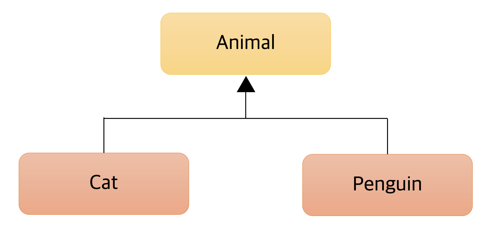
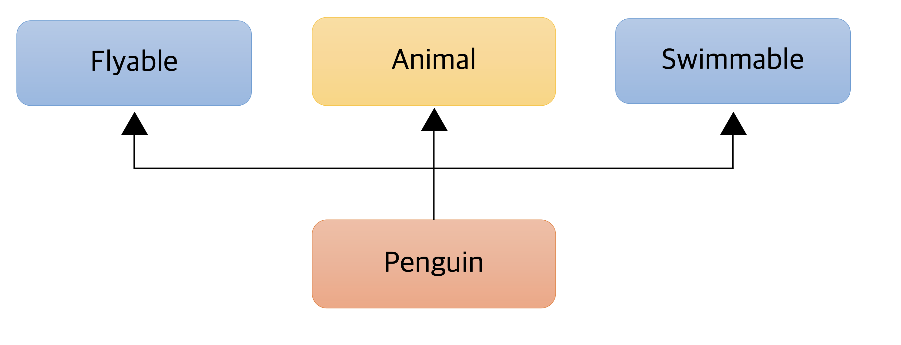

> 해당 포스팅은 인프런의 [자바 개발자를 위한 코틀린 입문(Java to Kotlin Starter Guide)](https://inf.run/yusn4) 강의를 참조하여 작성한 글입니다.

## 코틀린에서 클래스를 다루는 방법

### 클래스와 프로퍼티

아래와 같은 자바 클래스가 있다고 해보자.

``` java
package me.sungbin.lec09;

public class JavaPerson {

    private final String name;

    private int age;

    public JavaPerson(String name, int age) {
        this.name = name;
        this.age = age;
    }

    public String getName() {
        return name;
    }

    public int getAge() {
        return age;
    }

    public void setAge(int age) {
        this.age = age;
    }
}
```

위의 자바 클래스를 코틀린에서는 어떻게 변경이 가능할까? 바로 아래처럼 변경이 가능하다.

``` kotlin
class Person constructor(name: String, age: Int) {
    val name = name
    var age = age
}
```

매우 심플해졌다. 자바에서는 필드를 선언해두고 getter + setter + 생성자를 직접 만들어줘야 한다면 코틀린에서는 클래스에 필드만 만들면 getter + setter + 생성자를 한번에 만들어준다. 심지어 위의 코틀린 코드에서 `constructor` 키워드는 생략이 가능하다. 또한, 클래스의 필드 선언과 생성자를 동시에 선언도 가능하다. 그렇게 되면 위의 코드가 아래처럼 간결해질 수 있다.

``` kotlin
class Person(
    val name: String, 
    var age: Int,
)
```

그리고 자바와 달리, getter와 setter를 호출할 때, **.필드**를 통해서 getter와 setter를 호출할 수 있다.

``` kotlin
val person = Person("양성빈", 100)
println(person.name)
person.age = 30
println(person.age)
```

물론 자바로 만든 클래스를 코틀린 코드에서 호출할 때도 **.필드**를 통해서 getter와 setter를 호출 할 수 있다.

``` kotlin
val javaPerson = JavaPerson("Robert", 100)
println(javaPerson.name)
javaPerson.age = 30
println(javaPerson.age)
```

### 생성자와 init

그러면 만약 객체 생성 시점에 나이를 검증하는 로직을 추가하는 요구사항을 받았다고 가정해보자. 그러면 자바 코드로는 아래와 같이 작성 할 수 있을 것이다.

``` java
package me.sungbin.lec09;

public class JavaPerson {

    private final String name;

    private int age;

    public JavaPerson(String name, int age) {
        if (age <= 0) {
            throw new IllegalArgumentException(String.format("나이는 %s일 수 없습니다.", age));
        }

        this.name = name;
        this.age = age;
    }

    public String getName() {
        return name;
    }

    public int getAge() {
        return age;
    }

    public void setAge(int age) {
        this.age = age;
    }
}
```

그러면 코틀린에서는 생성자에 어떻게 나이 검증 로직을 추가할까? 바로 `init` 블록이라는 키워드를 제공해준다. 해당 블록은 생성자를 호출할 때 딱 한번 호출하여 초기화 해주는 블록을 의미한다. 그러면 나이 검증 로직을 한번 코틀린 코드에 적용해보자.

``` kotlin
package me.sungbin.lec09

class Person(
    val name: String,
    var age: Int,
) {
    init {
        if (age <= 0) {
            throw IllegalArgumentException("나이는 ${age}일 수 없습니다.")
        }
        println("초기화 블록")
    }
}
```

보통 실무에서 해당 블록에는 validation하는 로직이나 값을 적절히 세팅해주는 로직을 넣곤 한다.

그러면 추가사항으로 사람이라는 객체는 생성하면 기본 1살부터 시작이니 나이값을 넣지 않으면 기본 1살로 세팅해주는 생성자를 추가해야한다고 해보자. 자바 코드라면 아래처럼 작성하면 될 것이다.

``` java
package me.sungbin.lec09;

public class JavaPerson {

    private final String name;

    private int age;

    public JavaPerson(String name, int age) {
        if (age <= 0) {
            throw new IllegalArgumentException(String.format("나이는 %s일 수 없습니다.", age));
        }

        this.name = name;
        this.age = age;
    }

    public JavaPerson(String name) {
        this(name, 1);
    }

    public String getName() {
        return name;
    }

    public int getAge() {
        return age;
    }

    public void setAge(int age) {
        this.age = age;
    }
}
```

그러면 코틀린에서는 새로운 생성자를 하나 더 만들 때 어떻게 만들 수 있을까? 이 때 코틀린에서 제공해주는 `constructor(파라미터)`로 부 생성자를 만들 수 있다.

``` kotlin
package me.sungbin.lec09

class Person(
    val name: String,
    var age: Int,
) {
    init {
        if (age <= 0) {
            throw IllegalArgumentException("나이는 ${age}일 수 없습니다.")
        }
        println("초기화 블록")
    }

    constructor(name: String) : this(name, 1) {
        println("첫 번째 부 생성자")
    }

    constructor() : this("양성빈") {
        println("두 번째 부 생성자")
    }
}
```

여기서 **부 생성자**라는 용어가 나왔으니, 한번 짚어가겠다. 코틀린에서 클래스 옆에 생성자를 둔 것을 **주 생성자**라고 부른다. 해당 생성자는 있으면 반드시 존재해야 하며 주 생성자에 파라미터가 없다면 생략이 가능하다. 부 생성자는 optional이며, 있을수도 있고 없을수도 있다. 부 생성자의 목적은 결국 최종적으로 주 생성자를 `this()`를 통해 호출해줘야 하며, 부 생성자에 추가적인 로직이 있을 시, 위와 같이 `{}`를 이용하여 body를 추가할 수 있다.

그런데 사실 실무에서는 부 생성자보다는 default parameter를 권장한다. 그 이유는 부 생성자를 만듬으로써 코드 가시성이 복잡해지고 한 눈에 들어오지 않기 때문이다. 바로 아래처럼 사용하는 것이 실무에서 많이 이용하는 방식이다.

``` kotlin
package me.sungbin.lec09

class Person(
    val name: String = "양성빈",
    var age: Int = 1,
) {
    init {
        if (age <= 0) {
            throw IllegalArgumentException("나이는 ${age}일 수 없습니다.")
        }
        println("초기화 블록")
    }
}
```

Converting과 같은 로직이 필요한 경우라도 부 생성자를 이용할 수도 있지만, 그 보다는 실무에서는 정적 팩토리 메서드를 만들어서 사용하곤 한다. 그래서 일반적으로 부 생성자는 정말 잘 사용되지 않는다.

### 커스텀 getter, setter

기존 로직에 이제 성인인지 아닌지 판별하는 기능을 추가해보자. 만약, 자바 코드라면 아래처럼 작성이 가능할 것이다.

``` java
package me.sungbin.lec09;

public class JavaPerson {

    private final String name;

    private int age;

    public JavaPerson(String name, int age) {
        if (age <= 0) {
            throw new IllegalArgumentException(String.format("나이는 %s일 수 없습니다.", age));
        }

        this.name = name;
        this.age = age;
    }

    public JavaPerson(String name) {
        this(name, 1);
    }

    public String getName() {
        return name;
    }

    public int getAge() {
        return age;
    }

    public void setAge(int age) {
        this.age = age;
    }

    public boolean isAdult() {
        return age >= 20;
    }
}
```

코틀린 코드에서도 이 로직을 적용해보도록 하겠다.

``` kotlin
package me.sungbin.lec09

class Person(
    val name: String = "양성빈",
    var age: Int = 1,
) {
    init {
        if (age <= 0) {
            throw IllegalArgumentException("나이는 ${age}일 수 없습니다.")
        }
        println("초기화 블록")
    }

    fun isAdult(): Boolean {
        return age >= 20
    }
}
```

하지만 코틀린에서는 더욱 간편한 custom getter/setter 기능을 지원한다. 메서드를 마치 필드명처럼 선언하여 사용하는 방식인데 위의 로직을 한번 custom getter를 적용해서 작성해보면 아래와 같이 간결해짐을 알 수 있다.

``` kotlin
package me.sungbin.lec09

class Person(
    val name: String = "양성빈",
    var age: Int = 1,
) {
    init {
        if (age <= 0) {
            throw IllegalArgumentException("나이는 ${age}일 수 없습니다.")
        }
        println("초기화 블록")
    }

    val isAdult: Boolean
        get() = age >= 20
}
```

이렇게 작성한 코틀린 2개의 코드 모두 동일한 기능이며, 차이는 가독성 차이일 뿐이다. 그러면 어떨 때 어떤 경우를 사용할까? 필자가 재직중인 회사의 컨벤션을 빗대서 이야기하자면 만약 해당 기능이 객체 내부 필드로 두어도 괜찮다고 두어지면 custom getter를 만들어서 사용하고 그렇지 않다면 메서드로 사용하는 것이 올바른 선택이라고 생각이 든다.

또한, custom getter를 사용한다면 자기 자신을 변형할 수 있다. 이게 무슨 말일까? 한번 코드로 살펴보도록 하자. 만약 name을 getter를 할 때 무조건 대문자로 변경했으면 한다는 요구사항이 전달되었다고 해보자. 그럴 때 코틀린 코드에서는 아래와 같이 변경이 가능하다.

``` kotlin
package me.sungbin.lec09

class Person(
    name: String = "양성빈",
    var age: Int = 1,
) {
    init {
        if (age <= 0) {
            throw IllegalArgumentException("나이는 ${age}일 수 없습니다.")
        }
        println("초기화 블록")
    }

    val name: String = name
        get() = field.uppercase()

    val isAdult: Boolean
        get() = age >= 20
}
```

위의 코드를 보면 주 생성자로 받은 name을 불변 프로퍼티 name에 바로 대입을 하였다. 왜냐하면 기존처럼 `var`이나 `val`을 선언해두면 코틀린에서 자동으로 getter/setter를 만들어주기 때문이다. 그러면 custom getter를 사용하지 못하기에 해당 키워드를 제외하고 클래스 body에 불변 프로퍼티를 하나 만들고 파라미터 값을 전달시키도록 한 것이다. 그리고 custom getter를 만들 때 `field`라는 키워드를 사용하였다.

왜 `field`라는 키워드를 사용했을까? 한번 `field` 키워드를 사용하지 않고 코드를 작성해보자. 아마 컴파일 에러가 발생하겠지만 설명을 위해 작성해보겠다.

``` kotlin
package me.sungbin.lec09

class Person(
    name: String = "양성빈",
    var age: Int = 1,
) {
    init {
        if (age <= 0) {
            throw IllegalArgumentException("나이는 ${age}일 수 없습니다.")
        }
        println("초기화 블록")
    }

    val name: String = name
        get() = name.uppercase()

    val isAdult: Boolean
        get() = age >= 20
}
```

불변 프로퍼티 name에서 파라미터의 name을 대입 시킨다. 그리고 getter를 호출해서 name을 호출하려고 한다. 하지만 코틀린에서는 name이라는 필드명만 적어줘도 getter가 호출되니 다시 `get()`이 호출되고 다시 name을 부르는 무한루프 문제가 발생하게 된다. 그래서 코틀린에서는 이를 방지하고자 `field`라는 키워드를 두어서 해당 문제를 해결한 것이다. `field`는 자바의 `this`처럼 해당 필드의 네이밍만 가리킨다. 즉, 자기 자신을 가리키고 getter는 호출을 안 하는 예약어라고 생각해두면 좋을 것 같다. 이 예약어를 전문용어로 **backing field**라고 부른다.

하지만 이렇게 custom getter에서 backing field를 쓰는 경우도 실무에서는 매우 드물다. 보통은 아래와 같이 `this` 키워드를 사용해서 해주기 때문이다.

``` kotlin
package me.sungbin.lec09

class Person(
    name: String = "양성빈",
    var age: Int = 1,
) {
    init {
        if (age <= 0) {
            throw IllegalArgumentException("나이는 ${age}일 수 없습니다.")
        }
        println("초기화 블록")
    }

    val name: String = name
        get() = this.name.uppercase()

    val isAdult: Boolean
        get() = age >= 20
}
```

그러면 setter를 호출할 때도 무조건 대문자로 변경해서 set을 해줘야 하는 요구사항이 생겼다고 해보자. 이것을 코틀린 코드에서 어떻게 풀어나갈까?

``` kotlin
package me.sungbin.lec09

class Person(
    name: String = "양성빈",
    var age: Int = 1,
) {
    init {
        if (age <= 0) {
            throw IllegalArgumentException("나이는 ${age}일 수 없습니다.")
        }
        println("초기화 블록")
    }

    val name: String = name
        get() = this.name.uppercase()
    
    var setName = name
        set(value) {
            field = value
        }

    val isAdult: Boolean
        get() = age >= 20
}
```

바로 위와 같이 `set(value)`를 이용하여 사용이 가능하다. 하지만 이것 또한 실무에서 사용되지 않는다. 그 이유는 실무에서 setter 자체를 지양하기 때문이다. 그래서 custom setter도 잘 사용되지 않는다.

## 코틀린에서 상속을 다루는 방법

### 추상 클래스



위의 관계도가 있다고 해보자. `Animal` 클래스는 추상 클래스고 해당 추상 클래스를 상속받은 구체 클래스 `Cat`과 `Penguin` 클래스가 있다고 해보자. 이것을 자바 클래스로 작성해보고 해당 자바 클래스를 코틀린 클래스로 변경해보면서 상속에 관해 이야기 해보고자 한다.

먼저, `Animal` 추상 클래스에 대해 살펴보도록 하자. 자바로 작성된 코드는 아래와 같다.

``` java
package me.sungbin.lec10;

public abstract class JavaAnimal {

    protected final String species;

    protected final int legCount;

    public JavaAnimal(String species, int legCount) {
        this.species = species;
        this.legCount = legCount;
    }

    public abstract void move();

    public String getSpecies() {
        return species;
    }

    public int getLegCount() {
        return legCount;
    }
}
```

위의 코드를 코틀린으로 변경해보자.

``` kotlin
package me.sungbin.lec10

abstract class Animal(
    protected val species: String,
    protected val legCount: Int,
) {
    abstract fun move()
}
```

여기까지는 지금까지 배운 내용 그대로인 듯 보인다. 그러면 `Cat` 클래스를 작성해보자. 먼저 자바 코드는 아래와 같을 것이다.

``` java
package me.sungbin.lec10;

public class JavaCat extends JavaAnimal {

    public JavaCat(String species) {
        super(species, 4);
    }

    @Override
    public void move() {
        System.out.println("고양이가 사뿐 사뿐 걸어가~");
    }
}
```

위의 코드를 코틀린 코드로 변경해보자.

``` kotlin
package me.sungbin.lec10

class Cat(
    species: String,
) : Animal(species, 4) {

    override fun move() {
        println("고양이가 사뿐 사뿐 걸어가~")
    }
}
```

코틀린에서는 상속을 사용할 때, `extends` 키워드를 사용하지 않고 `:` 키워드를 사용한다. 그리고 상위 클래스의 생성자를 바로 호출만 해주면 상속을 해주는 조건을 만족시킨다. 또한, `move` 메서드를 오버라이딩할 때, 자바에서는 `@Override` 어노테이션을 붙여줘야 하나, 코틀린에서는 `override` 키워드를 `fun` 키워드 앞에 붙여주면 해당 함수가 오버라이딩 되었다고 인식해준다.

다음으로 `Penguin` 클래스를 작성해보자.

``` java
package me.sungbin.lec10;

public final class JavaPenguin extends JavaAnimal {

    private final int wingCount;

    public JavaPenguin(String species) {
        super(species, 2);
        this.wingCount = 2;
    }

    @Override
    public void move() {
        System.out.println("펭귄이 움직입니다~ 꿱꿱");
    }

    @Override
    public int getLegCount() {
        return super.legCount + this.wingCount;
    }
}
```

위의 코드를 코틀린 코드로 변경하면 아래와 같이 변경이 가능할 것이다.

``` kotlin
package me.sungbin.lec10

class Penguin(
    species: String,
) : Animal(species, 2) {
    private val wingCount: Int = 2

    override val swimAbility: Int
        get() = 3

    override val legCount: Int
        get() = super.legCount + this.wingCount

    override fun move() {
        println("펭귄이 움직입니다. 꽥꽥!")
    }
}
```

펭귄 클래스는 특별하게 wingCount라는 필드가 있고 `getLegCount`를 오버라이딩 하였다. 그래서 코틀린 코드를 위와 같이 작성한다면 에러가 발생할 것이다. 왜냐하면 코틀린 `Animal` 클래스를 상속받을 때 코틀린은 기본적으로 필드를 상속해주지 않기 때문이다. 만약 상속을 받고 싶다면 아래처럼 `open` 키워드를 붙야줘서 상속을 해줄것이라고 명시해줘야 한다.

``` kotlin
package me.sungbin.lec10

abstract class Animal(
    protected val species: String,
    protected open val legCount: Int,
) {
    abstract fun move()
}
```

### 인터페이스



이제 펭귄 클래스에 위의 도식처럼 `flyable` 인터페이스와 `swimable` 인터페이스를 추가해서 구현해보도록 하자. 자바에서는 인터페이스는 아래와 같이 정의가 가능하다.

``` java
package me.sungbin.lec10;

public interface JavaFlyable {

    default void act() {
        System.out.println("파닥파닥");
    }
}
```

``` java
package me.sungbin.lec10;

public interface JavaSwimable {

    default void act() {
        System.out.println("어푸 어푸");
    }
}
```

> ⚠️ 주의
>
> 만약 독자가 JDK8 버전 이전을 사용한다면 위의 인터페이스 2개의 코드는 에러가 날 것이다. defulat method는 JDK8부터 나왔기 때문이다.

위의 코드를 코틀린으로 변경하면 아래와 같을 것이다.

``` kotlin
package me.sungbin.lec10

interface Flyable {
    fun act() {
        println("파닥 파닥")
    }
}
```

``` kotlin
package me.sungbin.lec10

interface Swimable {
    fun act() {
        println("어푸 어푸")
    }
}
```

코틀린에서는 인터페이스에 default 메서드를 선언할 때 `default` 키워드 없이도 선언이 가능하다. 그럼 이 2개의 인터페이스를 기존에 만들었던 펭귄 클래스에 구현해보도록 하겠다. 먼저 자바 코드부터 살펴보자.

``` java
package me.sungbin.lec10;

public final class JavaPenguin extends JavaAnimal implements JavaSwimable, JavaFlyable {

    private final int wingCount;

    public JavaPenguin(String species) {
        super(species, 2);
        this.wingCount = 2;
    }

    @Override
    public void move() {
        System.out.println("펭귄이 움직입니다~ 꿱꿱");
    }

    @Override
    public int getLegCount() {
        return super.legCount + this.wingCount;
    }

    @Override
    public void act() {
        JavaSwimable.super.act();
        JavaFlyable.super.act();
    }
}
```

위의 코드를 코틀린으로 변경하면 아래와 같다.

``` kotlin
package me.sungbin.lec10

class Penguin(
    species: String,
) : Animal(species, 2), Swimable, Flyable {
    private val wingCount: Int = 2

    override val legCount: Int
        get() = super.legCount + this.wingCount

    override fun move() {
        println("펭귄이 움직입니다. 꽥꽥!")
    }

    override fun act() {
        super<Swimable>.act()
        super<Flyable>.act()
    }
}
```

자바 코드와의 차이점은 구현도 자바에서는 `implements` 키워드를 이용했지만, 코틀린은 상속과 마찬가지로 `:`를 사용한다. 또한, 중복되는 인터페이스의 메서드를 사용할때는 `super<타입>.함수`로 표현을 해야 한다.

추가적으로, 코틀린에서는 backing field가 없는 프로퍼티를 인터페이스에 만들 수 있다. 이게 무슨 말일까? 코드를 통해서 살펴보자. 만약 `Swimable`에 능력치를 필드로 둘 수 있다는 것이다.

``` kotlin
package me.sungbin.lec10

interface Swimable {

    val swimAbility: Int

    fun act() {
        println(swimAbility)
        println("어푸 어푸")
    }
}
```

그리고 해당 구현체에서 `swimAbility`를 오버라이딩을 해주면 된다.

``` kotlin
package me.sungbin.lec10

class Penguin(
    species: String,
) : Animal(species, 2), Swimable, Flyable {
    private val wingCount: Int = 2

    override val swimAbility: Int
        get() = 3

    override val legCount: Int
        get() = super.legCount + this.wingCount

    override fun move() {
        println("펭귄이 움직입니다. 꽥꽥!")
    }

    override fun act() {
        super<Swimable>.act()
        super<Flyable>.act()
    }
}
```

> ✅ 참고
>
> 물론 인터페이스 자체에서 기본 값을 세팅해주면 반드시 구현할 필요는 없다.

### 클래스를 상속받을 때 주의할 점

코틀린에서 클래스를 상속 받을 때 주의할 점을 살펴보도록 하자. 아래의 코드들이 있다고 해보자.

``` kotlin
package me.sungbin.lec10

open class Base(
    open val number: Int = 100,
) {
    init {
        println("Base Class")
        println(number)
    }
}
```

``` kotlin
package me.sungbin.lec10

class Derived(
    override val number: Int,
) : Base() {
    init {
        println("Derived Class")
    }
}
```

이렇게 되어 있을 때, 아래처럼 하위 클래스의 `Derived` 생성자를 호출하면 어떤 결과가 나올까? 독자들이 예상하기에는 "Base Class"라고 호출되고 number값으로 300이 찍히고 "Derived Class"가 찍힐 것으로 예상이 될 것이다.

``` kotlin
package me.sungbin.lec10

fun main() {
    Derived(300)
}
```

하지만 실제 결과는 이렇다.

``` bash
Base Class
0
Derived Class
```

왜 0이 나온걸까? 그 이유는 바로 하위 클래스의 생성자를 호출 할 때, 상위 클래스 생성자가 호출되고 거기서 number라는 값을 출력하려고 할 때, 오버라이딩 된 필드이므로 하위 클래스에 접근하려고 한다. 단, 해당 하위 클래스 생성자가 호출되기 전이므로 이 값은 알 수 없는 값이기에 기본 값이 출력이 된 것이다. 따라서 상위클래스를 설계할 때 생성자 또는 초기화 블록에 사용되는 프로퍼티에는 `open`을 피해야한다.

## 코틀린에서 접근 제어를 다루는 방법

### 자바와 코틀린의 가시성 제어

자바의 접근 제어자와 코틀린의 접근 제어자에는 조금 차이가 존재한다. 한번 살펴보도록 하자. 먼저 자바의 접근 제어자에 대해 살펴보자.

<table style="border-collapse: collapse; width: 100%; background-color: #ffe4e1; color: #000; border: 2px solid #ff7f50;">
  <thead>
    <tr>
      <th style="border: 1px solid #ff7f50; padding: 20px; text-align: left; font-size: 18px; font-weight: normal;">접근 제어자</th>
      <th style="border: 1px solid #ff7f50; padding: 20px; text-align: left; font-size: 18px; font-weight: normal;">설명</th>
    </tr>
  </thead>
  <tbody>
    <tr>
      <td style="border: 1px solid #ff7f50; padding: 20px; font-size: 32px; font-weight: bold;">public</td>
      <td style="border: 1px solid #ff7f50; padding: 20px; font-size: 24px;">모든 곳에서 접근 가능</td>
    </tr>
    <tr>
      <td style="border: 1px solid #ff7f50; padding: 20px; font-size: 32px; font-weight: bold;">protected</td>
      <td style="border: 1px solid #ff7f50; padding: 20px; font-size: 24px; line-height: 1.4;">같은 패키지 또는<br>하위 클래스에서만<br>접근 가능</td>
    </tr>
    <tr>
      <td style="border: 1px solid #ff7f50; padding: 20px; font-size: 32px; font-weight: bold;">default</td>
      <td style="border: 1px solid #ff7f50; padding: 20px; font-size: 24px;">같은 패키지에서만<br>접근 가능</td>
    </tr>
    <tr>
      <td style="border: 1px solid #ff7f50; padding: 20px; font-size: 32px; font-weight: bold;">private</td>
      <td style="border: 1px solid #ff7f50; padding: 20px; font-size: 24px;">선언된 클래스<br>내에서만 접근 가능</td>
    </tr>
  </tbody>
</table>

그러면 코틀린 접근 제어자에 대해서도 살펴보도록 하자.

<table style="border-collapse: collapse; width: 100%; background-color: #e6f3ff; color: #000; border: 2px solid #4682b4;">
  <thead>
    <tr>
      <th style="border: 1px solid #4682b4; padding: 20px; text-align: left; font-size: 18px; font-weight: normal; background-color: #dae8f5;">접근 제어자</th>
      <th style="border: 1px solid #4682b4; padding: 20px; text-align: left; font-size: 18px; font-weight: normal; background-color: #dae8f5;">설명</th>
    </tr>
  </thead>
  <tbody>
    <tr>
      <td style="border: 1px solid #4682b4; padding: 20px; font-size: 32px; font-weight: bold; background-color: #e6f3ff;">public</td>
      <td style="border: 1px solid #4682b4; padding: 20px; font-size: 24px; background-color: #e6f3ff;">모든 곳에서 접근 가능</td>
    </tr>
    <tr>
      <td style="border: 1px solid #4682b4; padding: 20px; font-size: 32px; font-weight: bold; background-color: #d6e9ff;">protected</td>
      <td style="border: 1px solid #4682b4; padding: 20px; font-size: 24px; line-height: 1.4; background-color: #d6e9ff;">선언된 클래스 또는<br>하위 클래스에서만<br>접근 가능</td>
    </tr>
    <tr>
      <td style="border: 1px solid #4682b4; padding: 20px; font-size: 32px; font-weight: bold; background-color: #e6f3ff;">internal</td>
      <td style="border: 1px solid #4682b4; padding: 20px; font-size: 24px; background-color: #e6f3ff;">같은 모듈에서만<br>접근 가능</td>
    </tr>
    <tr>
      <td style="border: 1px solid #4682b4; padding: 20px; font-size: 32px; font-weight: bold; background-color: #d6e9ff;">private</td>
      <td style="border: 1px solid #4682b4; padding: 20px; font-size: 24px; background-color: #d6e9ff;">선언된 클래스<br>내에서만 접근 가능</td>
    </tr>
  </tbody>
</table>

자바와 코틀린의 접근 제어자의 차이를 보면 먼저 `protected` 접근 제어자 차이가 존재한다. 자바에서는 같은 패키지 또는 하위 클래스에서만 접근 가능한 접근 제어자지만 코틀린에서는 선언된 클래스 혹은 하위 클래스에서만 접근 가능한 제어자이다. 왜냐하면 코틀린에서는 패키지 자체를 **namespace**를 관리하기 위한 용도로만 쓰일 뿐 가시성과는 전혀 관련이 없기 때문이다. 따라서 이런 차이가 발생하는 것이다. 그리고 코틀린에서 `default` 접근 제어자가 없는 이유도 위와 같이 패키지가 단순한 namespace용도이기 때문이다. 코틀린에서만 있는 `internal` 접근 제어자는 같은 모듈에서만 접근이 가능한데 여기서 모듈이라고 하면은 Maven Module, Gradle Module같은 모듈의 개념이다.

### 코틀린 파일의 접근 제어

또 자바와 코틀린의 차이로는 자바의 기본 접근 제어자는 `default`이고 코틀린의 기본 접근 제어자는 `public`이다. 그리고 코틀린에서는 `.kt`파일에 변수, 클래스, 함수 여러개를 만들 수 있다. 바로 아래처럼 말이다.

``` kotlin
val a = 3

fun add(a: Int, b: Int): Int {
    return a + b
}

class Cat()
```

하지만 `protected` 접근 제어자로 코틀린 파일의 최상단에 선언할 경우 컴파일 에러가 발생한다. 왜냐하면 `protected`는 선언된 클래스 혹은 하위 클래스에 접근 가능하지만 최상단에는 클래스에 속하지 않기 때문이다.

### 다양한 구성 요소의 접근 제어

코틀린의 클래스 멤버간에 접근 제어자를 붙일 수 있다. 이에 대해 살펴보면 아래와 같다.

<table style="border-collapse: collapse; width: 100%; background-color: #e6f3ff; color: #000; border: 2px solid #4682b4;">
  <thead>
    <tr>
      <th style="border: 1px solid #4682b4; padding: 20px; text-align: left; font-size: 18px; font-weight: normal; background-color: #dae8f5;">접근 제어자</th>
      <th style="border: 1px solid #4682b4; padding: 20px; text-align: left; font-size: 18px; font-weight: normal; background-color: #dae8f5;">설명</th>
    </tr>
  </thead>
  <tbody>
    <tr>
      <td style="border: 1px solid #4682b4; padding: 20px; font-size: 32px; font-weight: bold; background-color: #e6f3ff;">public</td>
      <td style="border: 1px solid #4682b4; padding: 20px; font-size: 24px; background-color: #e6f3ff;">모든 곳에서 접근 가능</td>
    </tr>
    <tr>
      <td style="border: 1px solid #4682b4; padding: 20px; font-size: 32px; font-weight: bold; background-color: #d6e9ff;">protected</td>
      <td style="border: 1px solid #4682b4; padding: 20px; font-size: 24px; line-height: 1.4; background-color: #d6e9ff;">선언된 클래스 또는<br>하위 클래스에서만<br>접근 가능</td>
    </tr>
    <tr>
      <td style="border: 1px solid #4682b4; padding: 20px; font-size: 32px; font-weight: bold; background-color: #e6f3ff;">internal</td>
      <td style="border: 1px solid #4682b4; padding: 20px; font-size: 24px; background-color: #e6f3ff;">같은 모듈에서만<br>접근 가능</td>
    </tr>
    <tr>
      <td style="border: 1px solid #4682b4; padding: 20px; font-size: 32px; font-weight: bold; background-color: #d6e9ff;">private</td>
      <td style="border: 1px solid #4682b4; padding: 20px; font-size: 24px; background-color: #d6e9ff;">선언된 클래스<br>내에서만 접근 가능</td>
    </tr>
  </tbody>
</table>

생성자도 동일하다. 단, 생성자에 접근 제어자를 붙여주려면 아래와 같이 `constructor`를 붙여줘야 한다. 접근제어자가 `public`일때만 생략이 가능하다.

``` kotlin
class Bus internal constructor(
    val price: Int,
)
```

이렇게 생성자에 접근 제어자를 붙여주는 경우는 유틸성 클래스를 사용할 때 많이 이용할 것 같다. 자바 코드는 아래와 같이 작성이 될 것이다.

``` java
package me.sungbin.lec11;

public abstract class StringUtils {

    private StringUtils() {
    }

    public boolean isDirectoryPath(String path) {
        return path.endsWith("/");
    }
}
```

코틀린도 위와 유사하게 작성이 가능하지만, 코틀린에서는 그냥 파일 최상단에 유틸성 함수를 정의만 하면 끝이다.

``` kotlin
package me.sungbin.lec11

fun isDirectoryPath(path: String): Boolean {
    return path.endsWith("/")
}
```

그리고 코틀린 코드에서 해당 함수를 사용할 때는 그냥 함수명만 작성해주면 된다. 단, 자바 코드에서 사용 시에는 아래와 같이 static 메서드를 호출하는 식으로 작성해주면 좋을 것 같다.

``` java
package me.sungbin.lec11;

public class Lec11Main {
    public static void main(String[] args) {
        StringUtilsKt.isDirectoryPath("/");
    }
}
```

다음으로 프로퍼티에 대한 접근 제어자에 대해 알아보자. 프로퍼티도 가시성 제어는 동일하다. 단, 프로퍼티의 가시성 제어를 하는 방법으로는 아래와 같이 getter/setter 동시에 가시성 제어를 하던가 `private set`과 같이 setter에만 private을 지정하는 식으로 작성이 가능하다.

``` kotlin
class Car(
    internal val name: String,
    private var owner: String,
    _price: Int,
) {
    var price = _price
        private set
}
```

### 자바와 코틀린을 함께 사용할 때 주의점

필자는 실무에서 자바와 코틀린을 함께 사용해본 경험이 전무하다. 따라서 해당 부분은 실무 경험은 딱히 없고 강의에서 소개해준 내용을 기반으로 정리를 해보았다.

- Internal은 바이트코드 상 `public`이 된다. 때문에 자바 코드에서는 코틀린 모듈의 `internal` 코드를 가져올수있다.
- 코틀린의 `protected`와 자바의 `protected`는 다르다. 자바의 `protected`는 같은 패지지 내의 클래스는 접근이 가능하다. 따라서, 같은 패키지의 코틀린 `protected` 멤버에 접근이 가능하다.

## 코틀린에서 object 키워드를 다루는 방법

### static 함수와 변수

아래의 자바 코드가 있다.

``` java
package me.sungbin.lec12;

public class JavaPerson {

    private String name;

    private int age;

    private static final int MIN_AGE = 1;

    private JavaPerson(String name, int age) {
        this.name = name;
        this.age = age;
    }

    public static JavaPerson newBaby(String name) {
        return new JavaPerson(name, MIN_AGE);
    }
}
```

위의 코드를 코틀린으로 변경해야 한다는 요구사항이 있다고 해보자. 그런데 우리가 지금까지 배운 내용을 토대로 작성해보려면 `static` 메서드와 필드를 어떻게 작성해야할지 의문일 것이다. 왜냐하면 코틀린에서는 `static` 키워드가 존재하지 않기 때문이다. 코틀린에서는 `static` 키워드 대신에 `companion object`라는 것이 존재한다. 그것을 토대로 변경하면 다음과 같을 것이다.

``` kotlin
package me.sungbin.lec12

class Person private constructor(
    var name: String,
    var age: Int,
) {
    companion object {
        private val MIN_AGE = 1

        fun newBaby(name: String): Person {
            return Person(name, MIN_AGE)
        }
    }
}
```

`companion object`는 동행 객체라는 의미인데, 코틀린은 자바의 `static` 키워드 대신에 `companion object` 키워드를 사용한다라고 생각해보자. 그럼 `static`과 `companion object`에 대해 잠깐 살펴보자.

- `static`: 클래스가 인스턴스화 될 때 새로운 값이 복제되는 것이 아니라 정적으로 인스턴스끼리 값을 공유한다.
- `companion object`: 클래스와 동행하는 유일한 오브젝트

또한, 위의 코드에서 `MIN_AGE`를 작성하면 IDE에서 경고를 띄워줄 것이다. `const`라는 키워드를 붙이라고 말이다. 왜냐하면 위의 코드처럼 작성하면 런타임 시에 변수가 할당된다. 즉, 본연의 `static`처럼 쓰는 변수가 아니라는 것이다. `const`라는 키워드를 붙여주면 정적으로 사용이 가능하며, 컴파일 시, 변수에 할당된다. `const`라는 키워드는 진짜 상수에 붙이기 위한 용도로 써야하며, 기본타입과 `String` 타입에 사용이 가능하다.

``` kotlin
package me.sungbin.lec12

class Person private constructor(
    var name: String,
    var age: Int,
) {
    companion object {
        private const val MIN_AGE = 1

        fun newBaby(name: String): Person {
            return Person(name, MIN_AGE)
        }
    }
}
```

그리고 해당 정적 메서드를 사용하는 방법은 기존 자바와 동일하다.

``` kotlin
println(Person.newBaby("양성빈"))
```

하지만, 여기서 자바와 다른 점이 존재한다. `companion object`는 말 그대로 동반 객체이다. 따라서, 하나의 객체로 간주된다. 때문에 이름을 붙일 수 있고, interface도 구현이 가능하다. 바로 아래처럼 말이다.

``` kotlin
package me.sungbin.lec12

class Person private constructor(
    var name: String,
    var age: Int,
) {
    companion object Factory: Log {
        private const val MIN_AGE = 1

        fun newBaby(name: String): Person {
            return Person(name, MIN_AGE)
        }

        override fun log() {
            println("나는 Person 클래스의 동행 객체입니다.")
        }
    }
}
```

그러면 독자들은 이런 생각이 들 것이다. `companion object`는 굳이 사용하는 예시를 보면, 유틸성 메서드를 만들 때 유용하지 않을까? 물론 유틸성 메서드를 만들 때도 사용이 가능하지만 유틸성 메서드를 만들 때는 그냥 코틀린 파일에 함수를 선언해서 사용하는 것을 추천한다.

그럼 만약 위의 코틀린 코드를 자바에서 사용하면 어떻게 될까? 자바에서 일반 static 메서드처럼 사용은 불가능하다. `companion object`에 이름을 안 붙였다면 `클래스명.Companion.메서드명`으로 작성해야 하며, 이름이 있다면 `클래스명.컴패니언 오브젝트 이름.메서드명`으로 호출을 해야 한다. 위의 코드로 예시를 들어보면 다음과 같다.

``` java
System.out.println(Person.Factory.newBaby("양성빈"));
```

만약, 기존 자바의 static 메서드처럼 사용하고 싶다면 기존 코틀린 코드에 `@JvmStatic` 어노테이션을 붙여줘야 한다.

``` kotlin
package me.sungbin.lec12

class Person private constructor(
    var name: String,
    var age: Int,
) {
    companion object Factory: Log {
        private const val MIN_AGE = 1

        @JvmStatic
        fun newBaby(name: String): Person {
            return Person(name, MIN_AGE)
        }

        override fun log() {
            println("나는 Person 클래스의 동행 객체입니다.")
        }
    }
}
```

### 싱글톤

아래의 싱글톤 패턴을 적용한 자바 코드가 있다.

``` java
package me.sungbin.lec12;

public class JavaSingleton {

    private static final JavaSingleton INSTANCE = new JavaSingleton();

    private JavaSingleton() {
    }

    public static JavaSingleton getInstance() {
        return INSTANCE;
    }
}
```

코틀린에서는 어떻게 변경할 수 있을까? 바로 아래와 같이 `object` 키워드를 쓰면 끝이다.

``` kotlin
objcect Singleton
```

정말 매우 심플해졌다.

### 익명 클래스

익명 클래스란, 특정 인터페이스나 클래스를 상속받은 구현체를 일회성으로 사용할 때 쓰는 클래스이다. 그래서 자바에서 해당 익명 클래스의 예시를 들어보면 아래와 같이 작성이 가능하다.

``` java
package me.sungbin.lec12;

public class Lec12Main {
    public static void main(String[] args) {
        moveSomething(new Movable() {
            @Override
            public void move() {
                System.out.println("움직인다~~~");
            }

            @Override
            public void fly() {
                System.out.println("난다~~");
            }
        });
    }

    private static void moveSomething(Movable movable) {
        movable.move();
        movable.fly();
    }
}
```

이것을 코틀린에서는 어떻게 변경이 가능할까? 바로 아래와 같이 `new 인터페이스명 or 클래스명` 대신에 `object : 인터페이스명 or 클래스명 {}`을 해주면 된다. 그리고 해당 블록 안에서 구현할 메서드들을 재정의해주면 된다.

``` kotlin
package me.sungbin.lec12

fun main() {
    moveSomething(object : Movable {
        override fun move() {
            println("움직인다~~~")
        }

        override fun fly() {
            println("난다~~")
        }

    })
}

private fun moveSomething(movable: Movable) {
    movable.move()
    movable.fly()
}
```

## 코틀린에서 중첩 클래스를 다루는 방법

### 중첩 클래스의 종류

중첩 클래스란, 어딘가에 소속되어 있는 클래스를 의미한다. 종류는 여러가지가 존재한다.

- static을 사용하는 중첩 클래스(내부 클래스)
- static을 사용하지 않는 중첩 클래스
    - 내부 클래스
    - 지역 클래스
    - 익명 클래스

각각의 특징을 보면, static을 사용하는 중첩 클래스는 밖의 클래스를 직접 참조할 수 없다. static을 사용하지 않는 중첩 클래스 같은 경우 밖의 클래스를 직접 참조할 수 있다. 이 중에 우리는 static을 사용하는 중첩 클래스와 static을 사용하지 않는 중첩 클래스 중에 내부 클래스에 대해서 코틀린은 어떻게 표현하는지 알아보자. 왜냐하면 지역 클래스같은 경우는 실제 실무에서 사용해본 경험어 거의 없고 자주 사용되지 않는 듯 하다. 또한, 익명 클래스는 이전에 한번 다룬 적이 있기에 이번에는 생략한다.

아래의 내부 클래스가 있다고 하자.

``` java
package me.sungbin.lec13;

public class JavaHouse {

    private String address;

    private LivingRoom livingRoom;

    public JavaHouse(String address) {
        this.address = address;
        this.livingRoom = new LivingRoom(10);
    }

    public LivingRoom getLivingRoom() {
        return livingRoom;
    }

    public class LivingRoom {
        private double area;

        public LivingRoom(double area) {
            this.area = area;
        }

        public String getAddress() {
            return JavaHouse.this.address;
        }
    }
}
```

내부 클래스를 보면 `getAddress` 메서드에서 바깥 클래스를 직접 참조하고 있는 것을 보고 있다. 그래서 아래와 같이 코드를 사용할 수 있다.

``` java
package me.sungbin.lec13;

public class Lec13Main {
    public static void main(String[] args) {
        JavaHouse house = new JavaHouse("제주도");
        System.out.println(house.getLivingRoom().getAddress());
    }
}
```

하지만 아래의 내부 클래스가 static이 붙인 중첩 클래스로 변경되면 바깥 클래스를 참조할 수 없는 상황이 나온다. 아래처럼 작성하면 컴파일 에러가 발생할 것이다.

``` java
package me.sungbin.lec13;

public class JavaHouse {

    private String address;

    private LivingRoom livingRoom;

    public JavaHouse(String address) {
        this.address = address;
        this.livingRoom = new LivingRoom(10);
    }

    public LivingRoom getLivingRoom() {
        return livingRoom;
    }

    public static class LivingRoom {
        private double area;

        public LivingRoom(double area) {
            this.area = area;
        }

        public String getAddress() {
            return JavaHouse.this.address; // 컴파일 에러
        }
    }
}
```

그런데 실제 실무에서는 내부 클래스를 static이 붙은 내부 클래스를 두기를 권장한다. Effective Java와 같은 곳에서도 아래와 같은 이유로 static 내부 클래스를 두기를 권장한다.

- 내부클래스는 숨겨진 외부클래스 정보를 가지고있어, 참조를 해지하지 못하는 경우 메모리 누수가 생길 수 있고, 이를 디버깅하기 어렵다.
- 내부클래스의 직렬화 형태가 명확하게 정의되지 않아 직렬화에 있어 제한이 있다.

그래서 클래스 안의 클래스를 만들 때는 반드시 static class로 만들어야 한다. 이런 원칙은 코틀린이 잘 준수하고 있다. 자바의 static 중첩 클래스를 코틀린 코드로 변경하면 아래와 같다.

``` kotlin
package me.sungbin.lec13

class House(
    private val address: String,
    private val livingRoom: LivingRoom = LivingRoom(10.0),
) {
    class LivingRoom(
        private val area: Double,
    )
}
```

그냥 클래스 body 블록에 class를 선언해주면 되는 것이다. 그런데 혹여나, static이 붙지 않은 내부 클래스를 사용할 때는 `inner` 키워드만 추가해주면 된다. 그리고 바깥 클래스를 참조할 때는 `this@바깥 클래스 명.필드명`을 적어주면 된다.

``` kotlin
package me.sungbin.lec13

class InnerHouse(
    private val address: String,
    private val livingRoom: LivingRoom,
) {
    inner class LivingRoom(
        private val area: Double,
    ) {
        val address: String
            get() = this@InnerHouse.address
    }
}
```

코틀린은 기본적으로 바깥 클래스를 참조하지 않는다. 바깥클래스를 참조하고 싶다면 `inner` 키워드를 추가해줘야 한다.

## 코틀린에서 다양한 클래스를 다루는 방법

### Data Class

계층 간에 데이터를 주고 받고 싶을 때는 DTO라는 것을 많이 이용하고 자바로는 아래와 같이 보통 작성을 많이 한다.

``` java
package me.sungbin.lec14;

import java.util.Objects;

public class JavaPersonDto {

    private final String name;

    private final int age;

    public JavaPersonDto(String name, int age) {
        this.name = name;
        this.age = age;
    }

    public String getName() {
        return name;
    }

    public int getAge() {
        return age;
    }

    @Override
    public boolean equals(Object object) {
        if (object == null || getClass() != object.getClass()) return false;
        JavaPersonDto that = (JavaPersonDto) object;
        return age == that.age && Objects.equals(name, that.name);
    }

    @Override
    public int hashCode() {
        return Objects.hash(name, age);
    }

    @Override
    public String toString() {
        return "JavaPersonDto{" +
                "name='" + name + '\'' +
                ", age=" + age +
                '}';
    }
}
```

보통은 자바에서 DTO 클래스를 정의할 때, `getter`, `setter`, `equals`, `hashCode`, `toString`을 많이 재정의를 한다. 그래서 보통 위와 같이 정의를 하거나, lombok을 활용하여 코드의 장황함을 줄이곤 한다. 하자민 lombok을 사용한다고 하더라도 클래스를 생성 이후, 어노테이션을 달아주는 행위, 혹은 lombok에 대한 의존성이 생겨버린다. 그래서 코틀린은 이런 문제점을 해결하고자 `data class`라는 것을 만들었다. `data class`로 위의 코드를 변경하면 아래와 같이 심플해진다.

``` kotlin
package me.sungbin.lec14

data class PersonDto(
    val name: String,
    val age: Int,
)
```

이렇게 `data class`로 선언해주면, 코틀린이 알아서 `getter`, `setter`, `equals`, `hashCode`, `toString`을 자동으로 만들어준다. 또한, named argument를 활용하면 builder패턴까지 활용할 수 있으니, lombok을 사용하지 않아도 되면서 간결해지는 장점을 가진다.

> ✅ 참고
>
> JDK16부터 자바에서도 이런 문제를 인식하고 `record`라는 것을 만들었다. 이것도 일종의 `data class`라고 생각하면 좋을 것 같다.

### Enum Class

자바의 enum 클래스를 살펴보자.

``` java
package me.sungbin.lec14;

public enum JavaCountry {
    KOREA("KO"),
    AMERICA("US");

    private final String code;

    JavaCountry(String code) {
        this.code = code;
    }

    public String getCode() {
        return code;
    }
}
```

자바의 enum 클래스는 `Enum`이라는 것을 상속받고 있는 형태이기에 추가적인 상속을 할 수 없으며 인터페이스만 구현 가능하며, 각각이 싱글톤으로 관리되는 클래스이다. 코틀린도 자바랑 다를 것이 없다.

``` kotlin
package me.sungbin.lec14

enum class Country(
    private val code: String,
) {
    KOREA("KO"),
    AMERICA("US")
    ;
}
```

단, 코틀린의 enum class의 장점은 `when`절을 사용할 때 진가를 발휘한다. 아래의 자바 코드를 보자.

``` java
package me.sungbin.lec14;

public class Lec14Main {
    public static void main(String[] args) {
        handleCountry(JavaCountry.KOREA);
    }

    private static void handleCountry(JavaCountry country) {
        if (country == JavaCountry.KOREA) {
            System.out.println("KOREA");
        }

        if (country == JavaCountry.AMERICA) {
            System.out.println("AMERICA");
        }
    }
}
```

자바에서 enum class를 인자로 받을 때는 위와 같이 작성을 할 수 있다. 하지만 만약 `JavaCountry`에 enum이 추가가 된다면 컴파일 타임에 미리 확인 할 수 없는 단점이 있다. 런타임에도 사실 모를 수 있다. 또한, 점점 enum이 많아지면 else 로직에 대한 처리도 애매하다. 하지만 코틀린 같은 경우 `when` 절을 사용하면 컴파일 타임에 확인할 수 있다. 또한, else 로직을 따로 작성 할 필요가 없다. 그래서 enum이 추가가 되더라도 컴파일 타임에서 IDE가 잘 알려주니 정말 강력한 기능인듯 하다.

``` kotlin
package me.sungbin.lec14

fun main() {
    val person1 = PersonDto("양성빈", 30)
    val person2 = PersonDto("양성빈", 30)

    println(person1 == person2)
    println(person1)
    println(person2)

    handleCountry(Country.KOREA)
}

private fun handleCountry(country: Country) {
    when (country) {
        Country.KOREA -> println("Korea")
        Country.AMERICA -> println("America")
    }
}
```

### sealed class, sealed interface

해당 sealed class와 sealed interface가 나온 배경은 `sealed`라는 용어에서 보면 알 수 있다. sealed는 "봉인 된"이라는 의미로 상속이 가능한 추상클래스를 만들까 했었는데 특정 클래스에서는 이 클래스를 상속받지 않게끔 하고 싶은 생각에서 탄생하게 되었다.

sealded class, interface의 장점으로는 컴파일 타임 때 하위 클래스의 타입을 모두 기억한다. 즉, 런타임 때 클래스타입이 추가될 수 없다. 또한, 하위 클래스와 같은 패키지에 존재해야 한다. 여기까지만 보면 enum과 다를께 없지만 차이가 몇가지 존재한다. 첫째로, 상속이 가능한 점이 다르고 둘째로 하위 클래스는 멀티 인스턴스가 가능해진다는 점이다.

``` kotlin
package me.sungbin.lec14

sealed class HyundaiCar(
    val name: String,
    val price: Long,
)

class Avante : HyundaiCar("아반떼", 1_000L)

class Sonata : HyundaiCar("소나타", 2_000L)

class Grandeur : HyundaiCar("그랜져", 3_000L)
```

위와 같이 정의를 하면 컴파일타임 때 하위클래스의 타입을 모두 기억한다. 즉, 런타임 때 클래스 타입이 추가될 수 없다라는 것이다. 그리고 sealed class도 `when`절을 사용해서 enum과 마찬가지로 강력한 효과를 얻을 수 있다.

``` kotlin
package me.sungbin.lec14

fun main() {
    val person1 = PersonDto("양성빈", 30)
    val person2 = PersonDto("양성빈", 30)

    println(person1 == person2)
    println(person1)
    println(person2)

    handleCountry(Country.KOREA)
}

private fun handleCountry(country: Country) {
    when (country) {
        Country.KOREA -> println("Korea")
        Country.AMERICA -> println("America")
    }
}

private fun handleCar(car: HyundaiCar) {
    when (car) {
        is Avante -> TODO()
        is Grandeur -> TODO()
        is Sonata -> TODO()
    }
}
```

> ✅ 참고
>
> 자바도 JDK17부터 sealed class가 추가되었지만 사용 방법이 살짝 다르다.