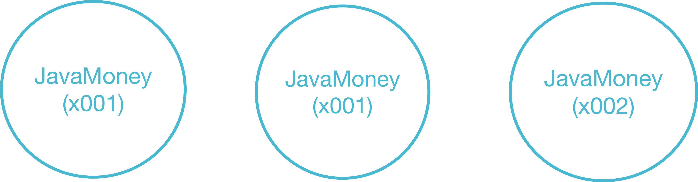

> 해당 포스팅은 인프런의 [자바 개발자를 위한 코틀린 입문(Java to Kotlin Starter Guide)](https://inf.run/yusn4) 강의를 참조하여 작성한 글입니다.

> 해당 포스팅은 기본적으로 자바에 대해서 잘 알고 계신다는 가정하에 작성하는 포스팅입니다.

## 코틀린에서 변수를 다루는 방법

### 변수 선언 키워드 - var과 val의 차이점

코틀린에서 변수를 어떻게 다루는지 자바 코드를 살펴보면서 알아보자. 아래의 자바 코드가 있다고 가정하자.

``` java
long number1 = 10L;
final long number2 = 10L;
```

위 코드의 차이는 잘 알고 있겠지만 가변이냐 불변이냐의 차이가 존재한다. `number1`의 변수는 가변변수이며 값 재할당이 가능하며, `number2`는 `final` 키워드가 붙어서 불변변수로 값 재할당이 불가능하다. 이것을 코틀린에서는 어떻게 표현할까? 바로 아래와 같이 작성이 가능하다.

``` kotlin
var number1 = 10L
val number2 = 10L
```

코틀린에서는 변수를 선언할때 `var` 혹은 `val` 키워드를 붙여서 선언해야 한다. `var`는 값이 재할당이 가능한 가변변수 선언을 할 때 사용하며, `val`은 자바에서 `final` 키워드를 붙인 것처럼 값 재할당이 불가능한 불변 변수를 선언할 때 사용된다. 또한, 자바에서는 값을 할당하는 변수의 타입을 명시적으로 작성해줘야 하지만 코틀린은 할당된 값을 보고 추론이 가능하다. 물론 아래와 같이 명시적으로 작성해줘도 되지만 인텔리제이에서는 회색표시가 나와 제거하는 것을 추천한다고 한다.

``` kotlin
var number1: Long = 10L
val number2: Long = 10L
```

그러면 초기 값을 바로 지정 안하고 선언할 때는 어떻게 될까? 자바에서는 초기값을 할당하지 않고 아래와 같이 선언이 가능하다.

``` java
long number1;
```

물론 `final` 키워드를 붙인 값은 선언할 때 미리 초기 값을 설정해줘야 컴파일 에러를 막을 수 있으며 값을 할당하지 않고 해당 변수를 사용 시에 컴파일 에러가 발생함을 알 수 있다. 코틀린도 마찬가지다.

``` kotlin
var number1: Long
val number2: Long
```

코틀린은 가변이든 불변이든 이렇게 선언을 해둔 상태에서는 컴파일 에러가 발생하지 않는다. 다만, 코틀린이 해당 변수의 타입을 판단할 때 할당된 값을 보고 자동 추론을 해주지만 위의 경우는 할당된 값이 없어서 추론이 힘들다. 그래서 이럴 땐 명시적으로 타입스크립트처럼 명시적으로 값을 선언해줘야 한다.

추가적으로 자바에서 `Collection`관련 타입으로 변수 선언을 할 때를 살펴보자.

``` java
final List<Integer> numbers = Arrays.asList(1, 2, 3, 4, 5);
// numbers = Arrays.asList(100, 200);
numbers.add(6)
```

위의 코드의 경우 `final` 키워드가 붙인 컬렉션 타입 변수에 새로운 컬렉션 타입으로 재할당은 불가능하지만, 내부적인 element를 추가는 가능하다. 코틀린도 마찬가지로 `val`로 선언한 변수에 컬렉션 타입을 선언하고 해당 element를 추가시, 자바와 동일하게 동작한다.

> ✅ 꿀팁
>
> 실무에서 사용되는 꿀팁인데, 일단 `var`, `val` 어떤걸로 선택할지 모를 때는 일단 `val`로 선언하고 재할당이 필요할 때 `var`로 변경하자.

### 코틀린에서의 Primitive Type

아래의 자바 코드를 살펴보자.

``` java
long number1 = 10L;
Long number3 = 1_000L;
```

위 두 변수의 차이는 primitive type이냐, reference type이냐의 차이이다. 그럼 코틀린에서는 어떻게 primitive type이냐 reference type이냐를 구분할까?

``` kotlin
var number1 = 10L
var number3 = 1_000L
```

뭔가 var로 선안할때랑 매우 동일하다. 그런데 코틀린에서는 이 두 타입을 long타입인지 Long타입인지를 어떻게 구별할까? 또한, effective java같은데서 말하길 연산을 수행할 때는 reference type보단, primitive type이 더 좋다고 한다. 왜냐하면 reference type은 boxing과 unboxing이 일어나기 때문이다. 그러면 위의 두 변수로 연산을 수행할 때 코틀린에서는 성능상 이슈는 없을까?

코틀린의 공식문서에서 해답을 얻을 수 있었다.

> Some types can have a special internal representation - for example, numbers, characters and booleans - can be represented as primitive values at runtime - but to the user they look like ordinary classes.

이것을 한글로 풀어보면 아래와 같다.

> 숫자, 문자, 불리언과 같은 몇몇 타입은 내부적으로 특별한 표현을 갖는다. 이 타입들은 실행시에 Primitive Value로 표현되지만, 코드에서는 평범한 클래스 처럼 보인다.

즉, 코틀린에서는 개발자가 boxing/unboxing을 고려하지 않고 코틀린이 알아서 처리해준다는 말이다.

### 코틀린에서 nullable한 변수

``` java
long number1 = 10L;
Long number3 = 1_000L;
```

그러면 다시 자바코드를 살펴보자. 위의 두 코드는 primitive type이냐 reference type이냐의 차이가 존재하지만 또 하나의 차이가 존재한다. 바로 number1은 non-nullable하고 number3는 nullable하다는 말이다. 이것을 코틀린에서는 어떻게 표현할까?

``` kotlin
var number1 = 10L
var number3: Long? = null
```

코틀린에서는 nullable한 변수임을 표기하기 위해 타입을 명시적으로 적어주고 끝에 `?`를 붙여준다. 그러면 코틀린은 해당 타입이 nullable하다고 판단하고 `null`값이 들어갈 수 있다.

> 이렇게 nullable한 타입과 non-nullable한 타입은 서로 다른 타입으로 간주된다.

### 코틀린에서의 인스턴스화

``` java
Person person = new Person("양성빈");
```

객체 인스턴스화를 할 때 자바에서는 위와 같이 `new` 연산자를 통해서 객체 생성을 한다. 그러면 코틀린에서 객체 생성은 어떻게 할까? 바로 아래와 같다.

``` kotlin
val person = Person("양성빈")
```

코틀린에서는 객체를 인스턴스화 할 때, `new` 연산자를 사용하지 않고 인스턴스화를 할 수 있다.

## 코틀린에서 null을 다루는 방법

### 코틀린에서 null 체크

``` java
public boolean startsWith(String str) {
  return str.startsWith("A");
}
```

위의 자바 코드를 살펴보자. 위의 코드는 Null Safe하지가 않다. 파라미터 변수가 null이 들어올 수 있는데 해당 파라미터 변수를 그대로 사용하기 때문이다. 즉, NPE(NullPointerException)이 발생할 수 있다. 그러면 NPE를 어떻게 방지할 수 있을까?

``` java
public boolean startsWithA1(String str) {
    if (str == null) {
        throw new IllegalArgumentException("null이 들어왔습니다.");
    }

    return str.startsWith("A");
}

public Boolean startsWithA2(String str) {
    if (str == null) {
        return null;
    }

    return str.startsWith("A");
}

public boolean startsWithA3(String str) {
    if (str == null) {
        return false;
    }

    return str.startsWith("A");
}
```

필자는 위와 같이 3가지 방법이 떠오른다. 그러면 이것을 코틀린에서는 어떻게 바꿀 수 있을까? 지금까지 배운 내용으로 스스로 변경해보자. 아마 아래와 같이 변경이 될 것이다.

``` kotlin
fun startsWithA1(str: String?): Boolean {
  if (str == null) {
      throw IllegalArgumentException("null이 들어왔습니다.")
  }

  return str.startsWith("A")
}

fun startsWithA2(str: String?): Boolean? {
  if (str == null) {
      return null
  }

  return str.startsWith("A")
}

fun startsWithA3(str: String?): Boolean {
  if (str == null) {
      return false
  }

  return str.startsWith("A")
}
```

아마 지금까지 배운 내용으로 쉽게 변경이 가능할 것이다. 여기서 다시 한번 느낄 수 있는 포인트가 코틀린에서는 null이 가능한 타입을 완전히 다르게 취급한다는 점이다.

### Safe Call과 Elvis 연산자

코틀린에서는 null이 가능한 타입을 완전히 다르게 취급한다. 그러면 코틀린에서는 null이 가능한 타입만의 기능은 없을까? 바로 **Safe Call**과 **Elvis 연산자**가 존재한다.

``` kotlin
val str1: String? = "ABC"
// println(str.length)
println(str1?.length)
```

Safe Call이란, `?.`으로 호출하며, 해당 변수가 null이 가능한 타입일 때 사용이 되며, 해당 변수가 null이면 뒤의 연산을 실행하지 않고 null이 반환되며, null이 아니면 그대로 실행된다.

``` kotlin
val str2: String? = null
println(str2?.length ?: 0)
```

또한, Safe Call을 사용하면서 Elvis 연산자도 같이 사용한다. Elvis 연산자는 `?:`로 사용하며, 앞의 연산 결과가 null이면 뒤의 값을 사용하고 아니면 그대로 해당 값이 이용되는 연산자이다. 그러면 이전에 우리가 작성했던 `startsWith` 3가지 메서드를 Safe Call과 Elvis 연산자를 사용하여 작성하면 아마 아래와 같을 것이다.

``` kotlin
fun startsWithA1(str: String?): Boolean {
  return str?.startsWith("A") ?: throw IllegalArgumentException("null이 들어왔습니다.")
}

fun startsWithA2(str: String?): Boolean? {
  return str?.startsWith("A")
}

fun startsWithA3(str: String?): Boolean {
  return str?.startsWith("A") ?: false
}
```

확실히 코틀린스럽게 간결해진 것을 확인할 수 있다.

### 널 아님 단언 !!

코틀린에서는 널 아님 단언 연산자인 `!!`가 존재한다. 해당 연산자는 애초에 타입이 nullable한 타입이지만 아무리 생각해도 null타입이 될 수 없는 타입일 때 사용한다. 즉, 혹시나 nul이 들어오면 NPE가 나오기 때문에 정말 null이 아닌게 확실한 경우에만 널아님단언 `!!`을 사용해야 한다. 아마 필자가 지금 말한 말이 어떤 말인지 이해가 안 될 수 있다. 예를 들어보자. 학생 엔티티가 있다고 해보자. 그 학생이 입학 전, 예비교육을 위하여 학교에 수업을 진행한다고 해보자. 이때 아직 입학 전이라 그 학생의 학번은 null로 표현하는게 맞을 것이다. 하지만 그 학생이 입학을 하면 학번은 존재해야하며, 그 학번은 더 이상 null이 되면은 안된다. 이럴때 `!!` 연산자를 사용한다.

회사마다 다르겠지만 필자의 회사같은 경우 `!!` 연산자 사용은 지양한다. 왜냐하면 타입의 일관성 때문이고, 제3자가 코드를 읽을때 가독성을 해치기 때문이다. 위와 같은 경우도 필자 회사 같은 경우는 객체를 분리하여 저장한다. 그게 더욱 일관성에 맞기 때문이다.

### 플랫폼 타입

만약 코틀린에서 자바 코드를 가져와 사용할 때 어떻게 처리될까?

``` java
package me.sungbin.lec02;

public class Person {

    private final String name;

    public Person(String name) {
        this.name = name;
    }

    public String getName() {
        return name;
    }
}
```

위와 같은 자바 코드가 있다고 해보자. 그리고 코틀린에서 아래와 같이 Person 객체의 이름을 출력하는 코드를 작성한다고 해보자.

``` kotlin
val person = Person("양성빈")
println(person.name)
```

위와 같이 사용하면 person 객체의 getter가 호출되어 name을 반환한다. 하지만 만약 생성자로 들어가는 이름이 null이면 어떻게 될까? 바로 NPE가 발생하게 된다. 이런 경우를 대비하기 위해 우리는 어노테이션으로 정의를 해주곤 한다. 바로 아래와 같이 말이다.

``` java
package me.sungbin.lec02;

import org.jetbrains.annotations.NotNull;

public class Person {

    private final String name;

    public Person(String name) {
        this.name = name;
    }

    @NotNull
    public String getName() {
        return name;
    }
}
```

이렇게 코틀린이 null 관련 정보를 알 수 없는 타입을 플랫폼 타입이라고 하며, 이를 방지하기 위해 validation 어노테이션을 붙이곤 한다. 자바 코드를 읽으며 널 가능성 확인이 되면 해당 부분을 코틀린으로 wrapping해서 사용하곤 한다. 아래의 예시를 보자.

``` java
public class JavaContext {

  public String getValue(String key) {
    if ("A".equals(key) || "B".equals(key)) {
      return "OK";
    }
    return null;
  }

}
```

위와 같은 자바 코드가 있다고 해보자. key에 어떤 값이 들어오는지에 따라 null이 아닌 문자열을 반환하기도, null인 문자열을 반환하기도 한다. 이 JavaContext의 getValue 함수를 코틀린에서 사용한다고 해보자.

``` kotlin
class A(private val javaContext: JavaContext) {
  fun logic1() {
    val str: String = javaContext.getValue("A")
  }
}

class B(private val javaContext: JavaContext) {
  // logic2, 위와 비슷하다.
}

class C(private val javaContext : JavaContext) {
  // logic3, 위와 비슷하다.
}
```

여기서 문제점은 JavaContext의 의존성이 지나치게 퍼져 있다는 것이다. 바꿔 말하면, JavaContext를 사용하는 클래스가 너무 많다. JavaContext는 Java 라이브러리이고, 지금은 A나 B일 때 non-null String을 반환하지만, 버전이 변경되면서 또 어떻게 될지는 모르는 것이다. 즉, JavaContext라는 클래스 변경에 우리의 프로젝트는 매우 취약한 상태이다. 그래서 만약 JavaContext라는 코드에 문제가 생기면 우리 코틀린 코드에 엄청난 문제가 생길 것이다. 이런 점을 방지하고자 아래와 같이 코틀린 코드로 wrapping을 하는 것이다.

``` kotlin
class JavaContextWrapper(private val javaContext: JavaContext) {
  fun getValue(key: String): String {
    return javaContext.getValue(key)
      ?: throw IllegalArgumentException("key=${key}는 null을 반환했습니다.")
  }
}
```

이렇게 되면 만약 JavaContext가 문제가 생기더라도 해당 부분만 수정하면 되기 때문이다.

## 코틀린에서 Type을 다루는 방법

### 기본 타입

자바에서는 기본 타입 간의 타입 캐스팅은 암시적으로 이루어진다. 즉, 우리가 따로 뭔가를 적어주지 않아도 자바에서 알아서 해준다는 것이다. 하지만 코틀린에서는 명시적으로 이루어진다.

``` java
int number1 = 4;
long number2 = number1;

System.out.println(number1 + number2);
```

위의 자바 코드에서 number1은 `int`타입이고 number2는 `long`타입이다. 원래라면 number2를 `long`타입으로 형변환하여 대입해줘야 하지만 자바에서는 암시적으로 진행되어 개발자가 따로 안 해줘도 된다. 하지만 코틀린에서는 아래와 같이 `to변환타입()` 메서드를 이용하여 형변환을 해줘야 한다.

``` kotlin
val number1 = 3
val number2: Long = number1.toLong()
```

또한, 코틀린에서는 nullable한 타입도 따로 구분하기에 따로 타입캐스팅 해줘야 한다.

``` kotlin
val number1: Int? = 3
val number2: Long = number1?.toLong() ?: 0L
```

### 타입 캐스팅

그러면 기본 타입이 아닌 reference type일 경우 어떻게 할까? 아래의 자바 코드를 살펴보자.

``` java
public static void printAgeIfPerson(Object obj) {
    if (obj instanceof Person) {
        Person person = (Person) obj;
        System.out.println(person.getAge());
    }
}
```

위와 같이 `instanceof` 연산자를 통하여 비교하여 타입 캐스팅을 해줘야 한다. 물론 JDK14 이상을 사용할 경우 아래와 같이도 사용이 가능하다.

``` java
public static void printAgeIfPerson(Object obj) {
    if (obj instanceof Person person) {
        System.out.println(person.getAge());
    }
}
```

하지만, 코틀린에서는 위의 자바 코드를 아래와 같이 변경할 수 있다.

``` kotlin
fun printAgeIfPerson(obj: Any) {
    if (obj is Person) {
        val person = obj as Person
        println(person.age)
    }
}
```

`instanceof` 연산자 대신에 코틀린에서는 `is` 연산자를 사용하며, `()` 연산자 대신에 `as` 연산자를 사용한다. 위와 같은 경우에는 조건문으로 조건을 확인할 경우 `as` 연산자는 생략이 가능하다. 바로 아래와 같이 말이다.

``` kotlin
fun printAgeIfPerson(obj: Any) {
    if (obj is Person) {
        println(obj.age)
    }
}
```

바로 위와 같은 경우를 **스마트 캐스트**했다고 일컫는다. 그러면 `instanceof` 반대일 때는 어떻게 할까?

``` java
public static void printAgeIfPerson(Object obj) {
    if (!(obj instanceof Person)) {
        Person person = (Person) obj;
        System.out.println(person.getAge());
    }
}
```

자바의 경우는 위와 같이 `!`연산자를 붙인다. 코틀린에서도 마찬가지로 `!` 연산자를 붙일 수 있다.

``` kotlin
fun printAgeIfPerson(obj: Any) {
    if (obj !is Person) {
        println("obj is not a person")
    }
}
```

혹은 아래와 같이 `not()` 메서드를 사용할 수 있다.

``` kotlin
fun printAgeIfPerson(obj: Any) {
    if ((obj is Person).not()) {
        println("obj is not a person")
    }
}
```

그러면 만약 obj가 null이 들어올 수 있다면 어떻게 할까? 코틀린 코드에서는 어떻게 대응할까?

``` kotlin
fun printAgeIfPerson(obj: Any?) {
    val person = obj as? Person
    println(person?.age)
}
```

바로 위와 같이 `?`를 `as` 뒤에 붙여줘야 한다. 그럼 이제 정리를 한번 해보자.

- value `is` Type: value가 type이면 true, 아니면 false를 반환한다.
- value `!is` Type: value가 type이면 false, 아니면 true를 반환한다.
- value `as` Type: value가 type이면 Type으로 캐스팅하고 아니면 예외가 발생한다.
- value `as?` Type: value가 type이면 Type으로 캐스팅하고 value가 null이면 null을 반환하고, value가 type이 아니더라도 null을 반환한다.

### 코틀린에서 특이한 타입 3가지

- `Any`
  - 자바에서 `Object`의 역할이다. (모든 객체의 최상위 타입)
  - 모든 Primitive Type의 최상위 타입이기도 하다.
  - `Any` 자체로는 null을 포함할 수 없어 null을 포함하고 싶다면 `Any?`로 표현해야 한다.
  - `Any`에는 `equals()`, `hashCode()`, `toString()` 또한 존재한다.
- `Unit`
  - `Unit`은 자바에서 `void`와 동일한 역할이다.
  - `void`와 다르게 `Unit`은 그 자체로 타입 인자로 사용 가능하다.
  - 함수형 프로그래밍에서 `Unit`은 단 하나의 인스턴스 타입만을 갖는다는 것을 의미한다. 즉, 코틀린에서는 `Unit`은 실제 존재하는 타입이라는 것을 표현하는 것이다.
- `Nothing`
  - `Nothing`은 함수가 정상적으로 끝나지 않았다는 것을 표기하는 타입이다.
  - 무조건 예외를 반환하는 함수나 무한루프 함수를 의미한다.

### String Interpolation / String indexing

자바에서는 문자열에 변수를 넣거나 하고 싶으면 아래와 같이 사용하곤 한다.

``` java
String name = "양성빈";
int age = 30;

System.out.println("이름: " + name + ", 나이: " + age);
System.out.println(String.format("이름: %s, 나이: %d", name, age));
```

하지만 코틀린은 자바스크립트와 유사하게 사용이 가능하다.

``` kotlin
val name = "양성빈"
val age = 30

println("이름: ${name}, 나이: $age")
```

위와 같이 `${}`를 사용한다. 단, 변수가 하나면, `{}`는 생략이 가능하다. 하지만 실무에서는 변수가 하나더라도 `${}`를 명시적으로 작성한다. 그 이유는 아래의 장점때문이다.

- 가독성
- 일괄 변환
- 정규식 활용

다음으로 JDK15부터 들어온 여러 개행으로 문자열 작성이 코틀린에서는 기본으로 들어가져 있다. 바로 아래처럼 말이다.

``` kotlin
val str = """
        ABCD
        EFG
        ${person.age}
    """.trimIndent()
println(str)
```

위와 같이 작성하면 개행이 포함되어 출력을 할 수 있다.

마지막으로 String indexing에 대해 알아보자. 자바 같은 경우 문자열에서 특정 문자를 가져오는 방법은 아래처럼 가져올 수 있었다.

``` java
String str = "ABC";
char ch = str.charAt(0); // 'A'
```

하지만 코틀린에서는 문자열 변수에 바로 인덱싱을 하여 값을 가져올 수 있다.

``` kotlin
val character = "ABC"
println(character[0]) // 'A'
println(character[2]) // 'C'
```

## 코틀린에서 연산자를 다루는 방법

### 단항 연산자 / 산술 연산자

단한 연산자, 산술 연산자, 산술 대입 연산자는 자바와 코틀린 전부 동일하다.

### 비교 연산자와 동등성과 동일성

비교 연산자도 자바와 코틀린 동일하다. 단, 자바와 다르게 객체간 비교를 할 때, 비교 연산자를 사용하면 자동으로 `compareTo`를 호출해준다. 아래 코드를 살펴보면 이해가 될 것이다.

``` java
package me.sungbin.lec04;

import org.jetbrains.annotations.NotNull;

import java.util.Objects;

public class JavaMoney implements Comparable<JavaMoney> {

    private final long amount;

    public JavaMoney(long amount) {
        this.amount = amount;
    }

    public JavaMoney plus(JavaMoney other) {
        return new JavaMoney(amount + other.amount);
    }

    @Override
    public int compareTo(@NotNull JavaMoney o) {
        return Long.compare(amount, o.amount);
    }

    @Override
    public boolean equals(Object object) {
        if (object == null || getClass() != object.getClass()) return false;
        JavaMoney money = (JavaMoney) object;
        return amount == money.amount;
    }

    @Override
    public int hashCode() {
        return Objects.hashCode(amount);
    }

    @Override
    public String toString() {
        return "JavaMoney{" +
                "amount=" + amount +
                '}';
    }
}
```

자바 클래스 객체가 위와 같이 있을 때 자바 코드는 아래와 같이 객체간 비교를 할때 `compareTo` 메서드를 호출해줘야 한다.

``` java
JavaMoney money1 = new JavaMoney(2_000L);
JavaMoney money2 = money1;
JavaMoney money3 = new JavaMoney(1_000L);

if (money1.compareTo(money3) > 0) {
    System.out.println("Money1이 Money3보다 금액이 큽니다.");
}
```

하지만, 코틀린은 아래와 같이 비교 연산자만 해도 자동으로 `compareTo`가 호출해준다.

``` kotlin
package me.sungbin.lec04

class Money(
    private val amount: Long,
): Comparable<Money> {

    override fun compareTo(other: Money): Int {
        return amount.compareTo(other.amount)
    }

    operator fun plus(other: Money): Money {
        return Money(amount + other.amount)
    }

    override fun equals(other: Any?): Boolean {
        if (this === other) return true
        if (javaClass != other?.javaClass) return false

        other as Money

        return amount == other.amount
    }

    override fun hashCode(): Int {
        return amount.hashCode()
    }

    override fun toString(): String {
        return "Money(amount=$amount)"
    }
}
```

``` kotlin
val money1 = Money(2_000L)
val money2 = money1
val money3 = Money(1_000L)

if (money1 > money3) {
    println("Money1이 Money3보다 금액이 큽니다.")
}
```



다음으로 동등성과 동일성에 대해 알아보자. 동등성은 두 객체의 값이 같은가를 판별하는 것이고 동일성은 두 객체의 주소 값이 같은가를 비교한다. 일반적으로 자바에서 `equals`와 `hashCode`를 재정의를 안 해두면 주소값 비교를 하지만 재정의를 해두면 실제 비교하고 싶은 값으로 동등성 비교가 가능하다. 단, `equals` 메서드를 호출해줘야 한다.

``` java
JavaMoney money1 = new JavaMoney(1_000L);
JavaMoney money2 = money1;
JavaMoney money3 = new JavaMoney(1_000L);

System.out.println(money1 == money2);
System.out.println(money1.equals(money3));
```

하지만, 코틀린은 `equals` 메서드를 호출하지 않고 비교 연산자 `==` 만 해주면 자동으로 `equals` 메서드를 호출해준다. 만약 주소 값을 비교하고 싶은 경우 `===`를 해주면 된다.

### 논리 연산자와 코틀린에 있는 특이한 연산자

논리 연산자도 자바와 온전 동일하며, Lazy 연산을 수행한다.

``` kotlin
fun fun1(): Boolean {
    println("fun1")
    return true
}

fun fun2(): Boolean {
    println("fun2")
    return false
}

main() {
  if (fun1() || fun2()) {
    println("본문")
  }
}
```

위의 코드를 실행하면 알겠지만 fun1 함수만 호출됨을 알 수 있다. 즉, OR 연산에는 앞이 참이면 다음 것은 볼 필요도 없기에 실행되지 않는다.

추가적으로 코틀린에는 `in` 연산자가 존재한다. 해당 연산자는 특정 값이 컬렉션이나 범위에 포함되어 있냐 유무를 확인하는데 사용된다. 자세한 것은 반복문때 살펴보자. 다음으로 `a..b`라는 연산자가 존재하는데 해당 연산자는 a부터 b까지의 범위 객체를 생성해주는 역할을 한다.

### 연산자 오버로딩

코틀린에서는 객체마다 연산자를 직접 정의할 수 있다. 바로 아래처럼 말이다.

``` kotlin
package me.sungbin.lec04

class Money(
    private val amount: Long,
): Comparable<Money> {

    override fun compareTo(other: Money): Int {
        return amount.compareTo(other.amount)
    }

    operator fun plus(other: Money): Money {
        return Money(amount + other.amount)
    }

    override fun equals(other: Any?): Boolean {
        if (this === other) return true
        if (javaClass != other?.javaClass) return false

        other as Money

        return amount == other.amount
    }

    override fun hashCode(): Int {
        return amount.hashCode()
    }

    override fun toString(): String {
        return "Money(amount=$amount)"
    }
}
```

``` kotlin
val money1 = Money(1_000L)
val money2 = money1
val money3 = Money(1_000L)

println(money1 + money2)
```

> 잘못된 지식이 존재할 경우 댓글 부탁드립니다.