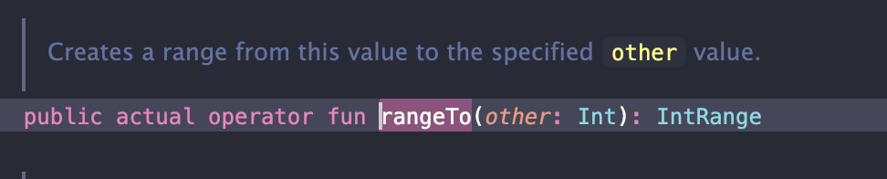
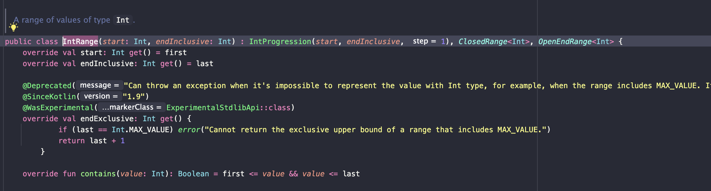

> 해당 포스팅은 인프런의 [자바 개발자를 위한 코틀린 입문(Java to Kotlin Starter Guide)](https://inf.run/yusn4) 강의를 참조하여 작성한 글입니다.

## 코틀린에서 제어문을 다루는 방법

### if문

자바에서 if문이 코틀린에서는 어떻게 되는지 한번 살펴보도록 하겠다. 아래의 자바 코드를 살펴보자.

``` java
private void validateScoreIsNotNegative(int score) {
    if (score < 0) {
        throw new IllegalArgumentException(String.format("%s는 0보다 작을 수 없습니다.", score));
    }
}
```

위의 코드를 코틀린으로 바꾸면 지금까지 학습한 내용을 기반으로 충분히 변경이 가능하다. 바로 아래와 같이 말이다.

``` kotlin
fun validateScoreIsNotNegative(score: Int) {
    if (score < 0) {
        throw IllegalArgumentException("${score}는 0보다 작을 수 없습니다.")
    }
}
```

> 자바에서 해당 메서드는 반환타입이 `void`이므로 코틀린에서는 `Unit`타입이고 해당 코드는 생략을 한 경우이다.

이렇게 보니, if문 자체에서는 자바와 코틀린이 차이가 없다는 것을 알 수 있다. 그러면 if-else문을 한번 살펴보도록 하자. 아래의 자바 코드를 코틀린으로 바꾸면 어떻게 될까?

``` java
private String getPassOrFail(int score) {
    if (score >= 50) {
        return "P";
    } else {
        return "F";
    }
}
```

자바와 거의 동일하게 변경이 가능하다.

``` kotlin
fun getPassOrFailV1(score: Int): String {
    if (score >= 50) {
        return "P"
    } else {
        return "F"
    }
}
```

하지만, 자바와 한 가지 다른점이 존재한다. 자바에서는 if-else문과 같은 조건문이 **Statement**이지만, 코틀린에서는 **Expression**이다.

### Expression & Statement

- Statement: 프로그램의 문장, 하나의 값으로 도출되지 않는다.
- Expression: 하나의 값으로 도출되는 문장

Statement와 Expression 용어 자체가 혼선이 올 수 있는데 쉽게 생각하면 Expression이 Statement의 부분집합인 셈이다. 코드로 한번 예를 들어보자.

``` java
int score = 50 + 20;
```

위의 코드의 `50 + 20`은 Statement면서도 Expression이다. 왜냐하면, 프로그램의 문장이니 Statement지만 하나의 값으로 도출되니 Expression인셈이다. 자바의 if-else문은 Statement지만 Expression이 안된다. 그래서 아래와 같이 작성하면 컴파일 에러가 발생할 것이다.

``` java
String grade = if (score >= 50) {
  "P";
} else {
  "F";
}
```

이런 이유로 자바에서는 위와 같이 작성 안 하고 Statement면서도 Expression이 가능한 3항 연산자를 아래와 같이 사용 할 것이다.

``` java
String grade = score >= 50 ? "P" : "F";
```

하지만 코틀린은 이러한 자바의 불편함을 해결하고자 조건문 자체가 전부 Statement면서도 Expression으로 선언이 가능하다.

``` java
private String getPassOrFail(int score) {
    if (score >= 50) {
        return "P";
    } else {
        return "F";
    }
}
```

자바에서 위와 같이 작성하던 것을 코틀린에서는 아래와 같이 작성이 가능하다.

``` kotlin
fun getPassOrFail(score: Int): String {
    return if (score >= 50) {
        "P"
    } else {
        "F"
    }
}
```

이렇게 코틀린에서는 if-else문을 expression으로 사용가능하기 때문에 3항 연산자가 따로 존재하지 않는다.

그러면 다음으로 if-else if-else문을 살펴보자. 이것도 자바와 코틀린 문법이 동일하다.

``` java
private String getGrade(int score) {
    if (score >= 90) {
        return "A";
    } else if (score >= 80) {
        return "B";
    } else if (score >= 70) {
        return "C";
    } else {
        return "D";
    }
}
```

위와 같은 자바 코드가 존재한다고 하자. 이것을 한번 코틀린으로 변경하면 어떻게 될까? 1분간 고민하고 아래의 필자가 작성한 코드를 살펴보자.

``` kotlin
fun getGrade(score: Int): String {
    return if (score >= 90) {
        "A"
    } else if (score >= 80) {
        "B"
    } else if (score >= 70) {
        "C"
    } else {
        "D"
    }
}
```

그러면 자바에서 범위 표현식을 할 때, 코틀린에서는 어떻게 변경이 가능할까?

``` java
private void validateScoreIsNotNegative(int score) {
    if (!(0 < score && score < 100)) {
        throw new IllegalArgumentException("score의 범위는 0부터 100입니다.");
    }
}
```

위와 같이 score의 값이 0과 100사이가 아닐 때 예외를 던지는 자바 메서드가 존재한다고 해보자. 이것을 코틀린도 똑같은 문법으로 제공을 하지만, 코틀린에서는 `in` 이라는 키워드로 더 간단히 작성이 가능하다. 바로 아래와 같이 말이다.

``` kotlin
fun validateScoreIsNotNegative(score: Int) {
    if (score !in 0..100) {
        throw IllegalArgumentException("score의 범위는 0부터 100입니다.")
    }
}
```

### switch와 when

그럼 이제 자바의 switch문법이 코틀린에서는 어떻게 변경이 되는지 살펴보도록 하자.

``` java
private String getGradeWithSwitch(int score) {
    switch (score / 10) {
        case 9:
            return "A";
        case 8:
            return "B";
        case 7:
            return "C";
        default:
            return "D";
    }
}
```

위와 같이 학점을 구하는 메서드가 있다고 하자. 우리가 아는 자바 문법으로 표현하면 위와 같이 작성하는게 인지상정이다. 단, JDK 17부터 해당 switch문을 lambda expression 형태로 작성이 가능해졌다.

``` java
private String getGradeWithSwitch(int score) {
    return switch (score / 10) {
        case 9 -> "A";
        case 8 -> "B";
        case 7 -> "C";
        default -> "D";
    };
}
```

하지만 코틀린에서는 이 이전부터 다 간편한 문법을 지원했는데 바로 `when` 문법이다. 그래서 자바의 위와 같은 switch문이 아래와 같이 코틀린 코드처럼 변경이 가능하다.

``` kotlin
fun getGradeWithSwitch(score: Int): String {
    return when (score / 10) {
        9 -> "A"
        8 -> "B"
        7 -> "C"
        else -> "D"
    }
}
```

마치 JDK17에서 제공하는 자바의 enhanced switch 문법같다.

> 코틀린에서 when을 지원해주고 나서 자바가 JDK17에 와서 따라했다는 가설도 있음...

`when`절의 형식은 아래와 같이 작성이 가능하다.

```
when (값){
  조건부->어떠한구문
  조건부->어떠한구문
  else -> 어떠한구문
}
```

코틀린 when 절에서는 위와 같이 특정 값만 넣을 수 있는게 아니라, 아까와 같은 범위 연산식인 `in` 연산자도 사용이 가능하다.

``` kotlin
fun getGradeWithSwitch(score: Int): String {
    return when (score) {
        in 90..99 -> "A"
        in 80..89 -> "B"
        in 70..79 -> "C"
        else -> "D"
    }
}
```

또한, type casting때 배운 `is`도 사용이 가능하다.

``` java
private boolean startsWithA(Object obj) {
    if (obj instanceof String) {
        return ((String) obj).startsWith("A");
    } else {
        return false;
    }
}
```

위와 같은 자바 코드를 아래와 같이 코틀린 `when`을 사용하서 간결하게 표현이 가능하다.

``` kotlin
fun startsWithA(obj: Any): Boolean {
    return when (obj) {
        is String -> obj.startsWith("A")
        else -> false
    }
}
```

이처럼 `when`절에는 조건부에 다양한 조건이 가능하다. 일정한 값도 들어갈 수 있고, 특정 범위 연산자라던지, 타입 캐스팅등 다양한 expression을 넣을 수 있으며, 심지어 여러개 조건을 , 기준으로 작성이 가능하다.

``` java
private void judgeNumber1(int number) {
    if (number == 1 || number == 0 || number == -1) {
        System.out.println("어디서 많이 본 숫자입니다.");
    } else {
        System.out.println("1, 0, -1이 아닙니다.");
    }
}
```

위와 같은 자바 메서드를 코틀린의 `when`절을 이용하면 아래와 같이 변경이 가능하다.

``` kotlin
fun judgeNumber1(number: Int) {
    when (number) {
        1, 0, -1 -> println("어디서 많이 본 숫자입니다.")
        else -> println("1, 0, -1이 아닙니다.")
    }
}
```

또한, `when`절에 값 부분이 안 들어가고도 사용이 가능하다. 바로 아래처럼 말이다.

``` kotlin
fun judgeNumber2(number: Int) {
    when {
        number == 0 -> println("주어진 숫자는 0입니다.")
        number % 2 == 0 -> println("주어진 숫자는 짝수입니다.")
        else -> println("주어진 숫자는 홀수입니다.")
    }
}
```

추가적으로, `when`은 Enum class나 Sealed class와 같이 사용 할 경우 진가를 발휘한다. 이 부분은 추후에 다뤄보도록 하겠다.

## 코틀린에서 반복문을 다루는 방법

### for-each문

아래의 리스트의 원소를 하나씩 출력하는 자바 코드가 있다.

``` java
List<Long> numbers = List.of(1L, 2L, 3L);
for (Long number : numbers) {
    System.out.println(number);
}
```

위의 코드를 코틀린으로 변경하면 어떻게 변경이 가능할까? 아마 아래와 같이 변경이 가능할 것이다.

``` kotlin
val numbers = listOf(1L, 2L, 3L)
for (number in numbers) {
    println(number)
}
```

자바 코드와의 차이점은 일단 첫째, 컬렉션 리스트를 만드는 방법이 다르다. 자바에서는 `List.of()`로 만들었다면 코틀린에서는 `listof()`라는 함수가 존재한다. 다음으로 다른 점은 `for-each`문을 작성할 때 자바에서는 `:`을 사용하였다면, 코틀린은 `in` 연산자를 이용한다.

> 컬렉션을 만드는 방법은 추후에 다뤄볼 예정이다. 지금은 그냥 이런게 있구나라고 넘어가자.

자바와 동일하게 `in` 연산자 다음의 값은 `Iterable`이 구현된 객체라면 모든지 들어갈 수 있다.

### 전통적인 for문

1부터 3까지 출력하는 예제가 있다고 하자. 이것을 자바로 작성하면 아래와 같을 것이다.

``` java
for (int i = 1; i <= 3; i++) {
    System.out.println(i);
}
```

이것을 코틀린에서는 아래와 같이 풀어서 쓸 수 있다.

``` kotlin
for (i in 1..3) {
    println(i)
}
```

바로 `..`을 사용하여 범위 객체를 만들고 출력을 해준다. 그러면 만약 3부터 1까지 출력하는 경우라면 어떨까? 자바라면 아래처럼 작성이 가능할 것이다.

``` java
for (int i = 3; i >= 1; i--) {
    System.out.println(i);
}
```

코틀린에서도 아래와 같이 작성이 가능하다. 이번에는 `downTo`라는 함수를 통하여 작성이 가능하다.

``` kotlin
for (i in 3 downTo 1) {
    println(i)
}
```

그러면 만약 1부터 2씩 증가해서 5까지 출력하는 예제는 어떻게 작성할까? 자바라면 아래와 같이 작성이 가능할 것이다.

``` java
for (int i = 1; i <= 5; i += 2) {
    System.out.println(i);
}
```

코틀린에서도 아래와 같이 `step`이라는 함수를 사용해서 작성이 가능하다.

``` kotlin
for (i in 1..5 step 2) {
    println(i)
}
```

### Progression과 Range

그러면 코틀린에서는 단지 이렇게만 적어서 어떻게 동작할까? 동작원리를 한번 살펴보도록 하자. 먼저, `..`은 위에서 언급했듯이 범위를 만들어내는 연산자이다. 해당 연산자를 IDE 창에서 클릭해서 내부 구현을 보면 바로 `IntRange`를 구헌한 메서드가 있는 것을 볼 수 있다.



그리고 해당 `IntRange` 클래스를 가보면 아래와 같이 `IntProgression`을 상속받고 있는 것을 알 수 있을 것이다.



> Progression`이라는 용어를 한글로 하면 등차수열을 뜻한다.

즉, 시작 값과 끝이 존재하면 코틀린에서 반복문은 등차가 1인 등차수열로 만들어준다는 의미이다. 그러면 이것을 응용해서 `downTo`와 `step`을 아래와 같이 풀 수 있을 것이다.

- `3 downTo 1`: 시작 값이 3이고 끝 값이 1이며 공차가 -1인 등차수열
- `1..5 step 2`: 시작 값이 1이고 끝 값이 5이며 공차가 2인 등차수열

또한, 위에서 필자가 작성하면서 힌트를 들였는데 `downTo`와 `step` 또한 함수이다. 키워드로 착각해서는 안된다. 그런데 뭔가 이상할 것이다. 보통의 함수라고 한다면 아래의 형식을 지켜야 하지 않을까?

```
특정_타입_변수.함수명(인자 값)
```

하지만 `downTo`와 `step`은 그러지 않는다. 이것은 코틀린만의 특별한 함수이며 이것을 **중위 함수**라고 일컫는다. 중위 함수는 `특정 타입 변수.함수명(인자값)` 대신에 `특정_타입_변수 함수명 인자값`과 같은 형식으로 이루어진다.

``` kotlin
1..5 step 2
```

만약 위와 같은 식이 있다면 1부터 5까지 공차가 1인 범위 등차수열을 만들고 step 메서드를 호출해서 매개변수로 2를 넣는 행위를 하는 것이다.

### While문

그러면 `while`문을 자바와 코틀린 코드를 비교해보자. 먼저, 자바 코드는 아래와 같이 작성 될 것이다.

``` java
int i = 1;

while (i <= 3) {
    System.out.println(i);
    i++;
}
```

이것을 코틀린 코드로 변경하면 아래와 같이 자바 코드와 거의 동일하게 작성된다.

``` kotlin
var i = 1

while (i <= 3) {
    println(i)
    i++
}
```

`do-while`문도 마찬가지로 자바와 코틀린 문법상으로 동일하다.

## 코틀린에서 예외를 다루는 방법

### try catch finally 구문

주어진 문자열을 숫자로 변경하는 예제를 자바 코드로 살펴보자. 아마 아래와 같이 작성 될 것이다.

``` java
private int parseIntOrThrow(@NotNull String str) {
    try {
        return Integer.parseInt(str);
    } catch (NumberFormatException e) {
        throw new IllegalArgumentException(String.format("주어진 %s는 숫자가 아닙니다.", str));
    }
}
```

이 코드를 코틀린으로 변경하면 어떻게 될까? 아마 아래와 같이 작성이 가능할 것이다.

``` kotlin
fun parseIntOrThrow(str: String): Int {
    try {
        return str.toInt()
    } catch (e: NumberFormatException) {
        throw IllegalArgumentException("주어진 ${str}는 숫자가 아닙니다.")
    }
}
```

자바 코드와 다른 점은 기본 타입간 형 변환은 `Integer.parseInt`같이 wrapper 클래스의 메서드 호출하는 대신에 `toType()` 메서드를 호출한다는 점이다. 그 외에는 거의 유사하다.

그러면 다음 예제로, 주어진 문자열을 정수로 변경하는 예제에서 실패 시, null을 반환하게끔 고쳐보자. 자바 코드는 아래와 같이 작성이 될 것이다.

``` java
private Integer parseIntOrThrow(@NotNull String str) {
    try {
        return Integer.parseInt(str);
    } catch (NumberFormatException e) {
        return null;
    }
}
```

위의 자바 코드를 코틀린으로 변경하면 아래와 같을 것이다.

``` kotlin
fun parseIntOrThrowV2(str: String): Int? {
    return try {
        str.toInt()
    } catch (e: NumberFormatException) {
        null
    }
}
```

여기서 코틀린 코드가 자바와 다른 점은 코틀린은 `try-catch`도 `if-else`문과 동일하기 expression으로 취급한다는 점이다. 그래서 바로 `try-catch`문 자체를 `return`하였다.

> `try-catch-finally` 구문도 자바와 코틀린 문법상 동일하니 생략하겠다.

### Checked Exception과 Unchecked Exception

프로젝트 내의 파일을 읽어오는 예제를 자바 코드로 한번 작성해보자. 그러면 단순하게는 아래와 같이 작성이 가능할 것이다.

``` java
package me.sungbin.lec07;

import java.io.BufferedReader;
import java.io.File;
import java.io.FileReader;
import java.io.IOException;

public class JavaFilePrinter {

    public void readFile() throws IOException {
        File currentFile = new File(".");
        File file = new File(currentFile.getAbsolutePath() + "/a.txt");
        BufferedReader reader = new BufferedReader(new FileReader(file));
        System.out.println(reader.readLine());
        reader.close();
    }
}
```

자바와 같은 경우에는 파일을 읽어들여올 때, 혹은 자원 해제를 할 때 `IOException`이라는 체크 예외가 발생한다. 따라서 메서드 시그니쳐에 명시적으로 적어줘야 했다. 그러면 위의 코드를 코틀린으로 변경하면 어떻게 될까?

``` kotlin
package me.sungbin.lec07

import java.io.BufferedReader
import java.io.File
import java.io.FileReader

class FilePrinter {

    fun readFileV1() {
        val currentFile = File(".")
        val file = File(currentFile.absolutePath + "/a.txt")
        val reader = BufferedReader(FileReader(file))
        println(reader.readLine())
        reader.close()
    }
}
```

오잉? 자바와 뭔가 다른 점이 보일 것이다. 바로 메서드 시그니쳐에 체크 예외를 던진다는 명시를 안 해준다는 점이다. 왜 그럴까? 그 이유는 바로 코틀린에서는 체크 예외와 언체크 예외를 따로 구분하지 않는다. 코틀린에서 모든 예외는 **언체크 예외**이다. 그래서 위의 코드처럼 메서드 시그니쳐에 명시할 이유가 없는 것이다.

### try with resources

JDK7이 들어오면서 자원할당을 자동으로 해줄 수 있게 `try-with-resources` 구문이 존재한다. 그래서 위의 파일을 읽어오는 코드를 `try-with-resources`로 변경하면 아래와 같다.

``` java
package me.sungbin.lec07;

import java.io.BufferedReader;
import java.io.FileReader;
import java.io.IOException;

public class JavaFilePrinter {
    public void readFile(String path) throws IOException {
        try (BufferedReader reader = new BufferedReader(new FileReader(path))) {
            System.out.println(reader.readLine());
        }
    }
}
```

그러면 위의 코드를 코틀린에서는 어떻게 표현할까? 코틀린에서는 `try-with-resources` 구문이 존재하지 않는다. 대신, `use`라는 inline 확장함수를 사용해야 한다. 바로 아래처럼 말이다.

``` kotlin
package me.sungbin.lec07

import java.io.BufferedReader
import java.io.FileReader

class FilePrinter {
    fun readFile(path: String) {
        BufferedReader(FileReader(path)).use { reader ->
            println(reader.readLine())
        }
    }
}
```

## 코틀린에서 함수를 다루는 방법

### 함수 선언 문법

자바에서 두 정수를 받아서 더 큰 정수를 반환하는 메서드를 만들어 보자.

``` java
public int max(int a, int b) {
    if (a > b) {
        return a;
    }

    return b;
}
```

아마 위와 같이 작성 할 수 있을 것이다. 코틀린도 자바 문법과 유사하게 작성이 가능하다. 단, 조금 더 간결하게 작성이 가능하다.

``` kotlin
fun max(a: Int, b: Int): Int {
    return if (a > b) a else b
}
```

코틀린에서 함수를 정의할 때는 `fun` 키워드를 사용하여 작성한다. 또한, 자바에서는 `package-private`한 것이 아니면 전부 명시적으로 접근 제어자를 작성해줘야 하지만 코틀린은 기본이 `public`이기에 생략이 가능하다. 자바에서는 아무것도 반환할 것이 없다면 `void`를 명시적으로 작성해줘야 하지만, 코틀린에서는 `void`와 같은 의미로 쓰이는 `Unit`을 작성해줘야 하는데 생략하면 기본 반환 타입이 `Unit`이므로 생략이 가능하다. 또한 코틀린에서 신기한 기능이 있는데 함수 본문안의 expression이 1개만 존재한다면 아래와 같이 반환타입도 생략하고 마치 변수처럼 작성이 가능하다.

``` kotlin
fun max(a: Int, b: Int) = if (a > b) a else b
```

또한, 자바에서는 클래스 안에서 메서드를 선언해야 하지만, 코틀린은 클래스 안에 함수를 선언할 수도 있고, 파일 최상단에 위치시킬 수 있다. 물론 하나의 파일 안에 여러 함수가 위치시킬 수 있다.

### default parameter

주어진 문자열을 n번 출력하는 예제를 자바 코드로 작성해보자.

``` java
public static void repeat(String str, int num, boolean useNewLine) {
    for (int i = 1; i <= num; i++) {
        if (useNewLine) {
            System.out.println(str);
        } else {
            System.out.print(str);
        }
    }
}
```

아마 위와 같이 작성을 해야 할 것이다. 첫번째 인자로 반복할 문자열을, 두번째 인자로 몇번 반복할지를, 세번째 인자로 개행 유무를 입력받아서 출력해주는 메서드이다. 그런데 만약, 반복하는 횟수가 3번, 개행유무를 true로 하는 곳이 많다면 자바에서는 메서드 오버로딩을 이용하여 3개의 메서드를 만들어서 사용하는 개발자가 편리하게 만들 수 있다.

``` java
public static void repeat(String str, int num, boolean useNewLine) {
    for (int i = 1; i <= num; i++) {
        if (useNewLine) {
            System.out.println(str);
        } else {
            System.out.print(str);
        }
    }
}

public static void repeat(String str, int num) {
    repeat(str, num, true);
}

public static void repeat(String str) {
    repeat(str, 3, true);
}
```

하지만 이런 같은 기능때문에 메서드 3개를 만드는 것은 뭔가 비효율적인 느낌이 든다. 그래서 이러한 문제점을 해결하고자 코틀린에서는 default parameter를 만들었다. 바로 아래와 같이 말이다.

``` kotlin
fun repeat(
    str: String,
    num: Int = 3,
    useNewLine: Boolean = true,
) {
    for (i in 1..num) {
        if (useNewLine) {
            println(str)
        } else {
            print(str)
        }
    }
}

fun main() {
  repeat("Hello World!")
}
```

위와 같이 매개변수에 기본 값을 설정해두면 해당 인자를 작성하지 않으면 자동으로 기본 값이 할당된다. 물론 코틀린에서도 메서드 오버로딩을 지원하지만 이런 경우는 default parameter를 이용하면 훨씬 간결할 것이다.

### named argument

그러면 만약 위의 default parameter로 정의된 `repeat` 함수에서 num 인자는 기본값으로 쓰고 싶고 useNewLine은 false값을 두고 싶다면 어떻게 할까? 우리가 아는 상식 선이라면 아래와 같이 작성해야 할 것이다.

``` kotlin
fun main() {
  repeat("Hello World!", 3, false)
}
```

하지만 굳이 default parameter로 정의된 값도 기본 값으로 다시 매핑을 해주는게 불편할 것이다. 그래서 나온 것이 `named argument`이다. named argument를 이용하면 num 인자를 생략하고 함수 호출이 가능하다. 바로 아래와 같이 말이다.

``` kotlin
fun main() {
  repeat(
      str = "Hello World ",
      useNewLine = false,
  )
}
```

named argument를 사용하면 builder를 직접 만들지 않고도 builder의 장점을 가지게 된다.

> ⚠️ 주의
>
> 코틀린에서 자바 메서드를 가져다 쓸 때는 named argument를 사용이 불가능하니 주의 바란다.

### 같은 타입의 여러 파라미터 받기(가변 인자)

문자열 n개를 받아서 출력하는 예제를 작성해보자. 그러면 자바 코드로 아마 아래와 같이 작성이 될 것이다.

``` java
public static void printAll(String... strs) {
    for (String str : strs) {
        System.out.println(str);
    }
}
```

자바에서는 `...` 연산자를 사용하여 가변인자를 사용할 수 있다. 이를 통해, 배열을 직접 넣거나 콤마를 이용하여 여러 파라미터를 넣을 수 있다. 그러면 코틀린에서는 어떻게 작성할까? 코틀린에서 가변인자를 받을 때는 `vararg`라는 키워드를 작성해야 한다.

``` kotlin
fun printAll(vararg strs: String) {
    for (str in strs) {
        println(str)
    }
}
```

그리고 사용하는 곳에서는 아래와 같이 작성하면 된다.

``` kotlin
printAll("A", "B", "C")
```

하지만 코틀린에서 가변 인자는 콤마 기준으로만 작성이 가능하다. 배열이나, 컬렉션 객체를 바로 넣을 수 없다는 단점이 존재한다. 만약 배열이나 컬렉션 객체를 바로 넣고 싶다면 아래와 같이 스프레드 연산자(`*`)를 넣어줘야 한다.

``` kotlin
val array = arrayOf("A", "B", "C")
printAll(*array)
```