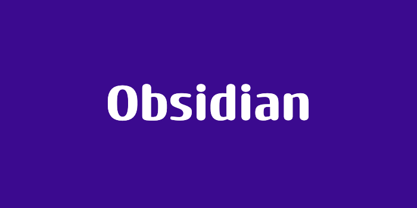

> 해당 포스팅은 [옵시디언 마스터 클래스: PKM·AI Second Brain·LLM WiKi 기초부터 실전까지](https://inf.run/ekDAP)를 참고하여 작성하였습니다.

## Part 9. 6F 저널링 소개 (패트릭 그로브)

이번 섹션부터는 단순한 노트 정리를 넘어, 삶의 방향을 잡아주는 기록 습관을 다뤄보려고 한다. 그 중심에 있는 것이 바로 '6F 저널링'이다. 이 기법은 기업가 패트릭 그로브(Patrick Grove)의 '백만장자가
되기 위한 도구로서의 저널링' 영상에서 영감을 받아 발전된 방법론으로, 목표를 달성할 가능성을 끌어올리는 데 초점이 맞춰져 있다. 이번 파트에서는 본격적인 실습에 앞서, 6F 저널링이 대체 무엇이고 왜 효과가 있는지
그 배경 이야기를 먼저 살펴보자.

### 목표를 '적는다'는 것의 힘

저널링의 출발점은 단순하다. 목표를 글로 적는 사람은, 그렇지 않은 사람보다 그 목표를 달성할 기회가 훨씬 많다는 것이다.

패트릭 그로브가 10년 전 처음 저널링을 시작했을 때는 지금과 사뭇 달랐다고 한다. 처음에는 삶의 부정적인 측면, 즉 불만과 걱정거리를 쏟아내는 데 글을 썼다. 그러다 어느 순간 질문의 방향을 바꿨다. "나는 진짜로
무엇을 원하는가?"를 스스로에게 묻기 시작하면서, 부정적인 토로가 아니라 긍정적인 목표 설정으로 저널링의 성격이 바뀌었다.

### 작은 질문에서 시작된 큰 성과

그가 던진 구체적인 질문은 이것이었다. "12개월 안에 100만 달러를 어떻게 만들 수 있을까?"

처음에는 스스로도 그 가능성을 온전히 믿지 못했다고 한다. 하지만 기존의 방식에 충격을 주고 새로운 시도를 거듭하면서, 점차 방법을 찾아갔다. 이 과정에서 핵심이 된 것이 바로 꾸준한 저널링 세션이었다.

그는 일주일에 4~5번의 세션을 꾸준히 진행했다. 한 세션마다 큰 질문 하나를 붙들고 깊이 파고들어, 4~5페이지 분량의 구체적인 계획을 적고 실행에 옮겼다. 그 결과는 놀라웠다. 처음 목표였던 100만 달러를
넘어, 2년 안에 1,000만 달러(10밀리언 달러)를 달성하는 성과로 이어졌다.

### '절반의 달성'도 충분히 훌륭하다

물론 모든 목표가 100% 달성된 것은 아니다. 저널링 세션에서 얻은 깊은 통찰과 계획을 실행했음에도, 12개월 안에 세운 목표 금액을 완전히 채우지는 못한 경우도 있었다.

하지만 그는 목표의 절반 정도만 달성해도 매우 훌륭한 성적이라고 말한다. 이를 '별을 바라보는 것'에 비유한다. 별처럼 까마득히 높은 목표를 향해 손을 뻗으면, 설령 별에 닿지 못하더라도 그 과정에서 충분히 멀리까지
나아가게 된다는 것이다. 중요한 것은 완벽한 달성 여부가 아니라, 그 방향을 향해 꾸준히 움직였다는 사실이다.

### 돈이 전부가 아니라는 깨달음, 그리고 6F

흥미로운 지점은 여기서부터다. 20대 시절 그는 오로지 돈을 버는 데 몰두했지만, 어느 순간 '계좌에 찍힌 숫자가 곧 행복은 아니다'라는 사실을 깨달았다. 돈을 좇느라 삶의 균형을 잃었고, 가족·친구·자신의 몸과의
관계에서 정작 행복하지 않았던 것이다.

이 깨달음이 6F 저널링의 핵심이다. 삶을 돈 하나에만 집중하지 않고, 여러 영역으로 나누어 균형 있게 관리하자는 것이다. 6F는 다음과 같은 'F'로 시작하는 영역들을 의미한다.

- **Finance(금융)** : 돈과 경제적 목표
- **Family(가족)** : 가족과의 관계
- **Friends(친구)** : 친구 및 인간관계
- **Health(건강)** : 몸과 마음의 건강
- **Fitness(피트니스)** : 운동과 체력 관리

이렇게 삶의 여러 축을 동시에 기록하고 점검함으로써, 한쪽으로 치우치지 않는 균형 잡힌 성장을 추구하는 것이 6F 저널링의 지향점이다.

### 생각에서 멈추지 말고, '행동'으로

마지막으로 그가 강조하는 것은 실천이다. 어떤 삶을 원하는지, 그리고 그 삶을 어떻게 얻을 것인지를 분명히 결심하라고 말한다. 그러면서 좋아하는 음악을 틀어두고, 아름다운 장소에서 편안하게 저널링 세션을 가져보라고
권한다.

핵심은 단순히 '무엇을 원하는가'를 생각하는 데서 멈추지 않는 것이다. "그래서, 어떻게 할 것인가?"라는 질문으로 한 걸음 더 나아가야 한다. 머릿속 생각을 구체적인 계획으로, 다시 실제 행동으로 옮길 때 비로소
내 삶의 이야기가 원하는 방향으로 그려지기 시작한다.

### 마치며

6F 저널링은 단순히 떠오르는 생각을 적어두는 기록을 넘어, 삶이 나아갈 방향을 스스로 설계하고 그것을 실행에 옮기게 만드는 도구다. 목표를 글로 적고, 금융부터 가족·건강까지 삶의 여러 영역을 균형 있게 점검하며,
생각을 행동으로 옮기는 것. 이 단순한 루틴이 꾸준히 쌓일 때 삶의 균형과 성장이 함께 따라온다. 다음 파트에서는 이 6F 저널링을 옵시디언에서 실제 컬렉션으로 만들어보며, 이론을 나만의 기록 시스템으로 옮겨보도록
하겠다.

## Part 9. 6F 저널링 컬렉션 만들기

앞 파트에서 6F 저널링이 무엇이고 왜 효과가 있는지 그 배경을 살펴봤다면, 이번에는 이 개념을 옵시디언에서 실제로 동작하는 '컬렉션'으로 옮겨볼 차례다. 단순히 생각만 적어두는 것을 넘어, 삶의 여러 영역을 한눈에 조망하고 균형을 점검할 수 있는 나만의 지식관리 시스템을 완성하는 단계다. 개인지식관리(PKM)의 최종 단계라고 봐도 좋다.

### 6F, 그리고 강사가 더한 한 가지

먼저 6F를 다시 정리하고 가자. 패트릭 그로브가 제안한 6F는 가족(Family), 금융(Finance), 건강(Health), 친구(Friends), 즐거움(Fun), 그리고 피규어헤드(Figurehead)로 구성된다. 여기서 피규어헤드는 멘토나 나를 이끌어주는 사람을 뜻하는데, 강사는 이 영역을 '개인 성장'에 가까운 의미로 확장해 활용한다고 한다.

핵심은 이것이다. "내 인생의 모든 일은 이 범주를 벗어나지 않는다." 그래서 이 구조대로 컬렉션을 세팅해두면, 흩어져 있던 노트들이 삶의 영역별로 자동 정렬되어 전체 삶을 위에서 내려다보듯 조망할 수 있게 된다.

### 폴더와 속성으로 컬렉션 뼈대 세우기

세팅의 시작은 6F 각 영역을 폴더로 만드는 것이다. `Family`, `Finance`, `Health`, `Friends`, `Fun`, `Figurehead`처럼 영역별 폴더를 생성한다. 여기에 회사 업무를 위한 `Work` 폴더를 더해도 좋다.

핵심은 폴더 그 자체가 아니라 **속성(Property)**이다. 각 노트에 `Family` 같은 6F 속성을 부여해두면, 뒤에서 다룰 데이터 뷰가 이 속성을 기준으로 관련 노트들을 자동으로 끌어모아 보여준다. 즉, 노트를 일일이 손으로 정리하지 않아도 속성 하나만 잘 달아두면 분류가 알아서 되는 구조다.

### 각 영역을 채우는 네 가지 섹션

각 6F 폴더 안은 데이터 뷰(Dataview)를 이용해 네 가지 섹션으로 구조화한다. 이 네 가지가 6F 컬렉션의 핵심 골격이다.

- **Effort** : 지금 집중하고 있는 프로젝트성 과제를 담는다. 예를 들어 가족 영역이라면 '아내와 대화 시간 만들기', '부모님과 식사하기' 같은 능동적인 목표들이 여기 들어간다.
- **Log** : 꾸준히 이어지는 일상적인 기록을 담는다. 수영 레슨, 주식 투자, 병원 기록, 아이 교육 기록처럼 지속적으로 관리하는 항목들이다.
- **MOC** : 해당 영역과 연결된 MOC(Map of Content) 노트들을 보여준다. 가족 영역이라면 생활 팁, 요리, 집수리 같은 지식 노트들이 모인다.
- **Archive** : 과거에 경험했지만 지금도 참고할 가치가 있는 내용을 보관한다.

이렇게 네 섹션으로 나눠두면, 한 영역 안에서도 '지금 노력 중인 것', '계속 쌓아가는 기록', '연결된 지식', '지나간 경험'이 깔끔하게 구분된다.

### 기호로 위계 표현하기

노트가 많아지면 어떤 노트가 상위 개념인지 한눈에 들어오지 않는다. 그래서 강사는 노트 제목 앞에 특수 기호를 붙여 위계를 표현한다. 일반 MOC는 삼각형 기호로, 그보다 상위 레벨인 6F 컬렉션은 삼각형에 선이 들어간 기호로 구분하는 식이다. 이렇게 하면 파일 목록만 봐도 그룹핑된 느낌과 상위·하위 레벨이 직관적으로 드러난다.

### 개인을 넘어 업무까지 확장하기

이 6F 컬렉션 구조의 진짜 강점은 그대로 회사 업무에도 적용된다는 점이다. 생각해보면 우리가 노트를 가장 많이 남기는 곳은 다름 아닌 회사 업무다.

`Work` 폴더에도 동일하게 Effort, Log, MOC, Archive 구조를 적용하면, 프로젝트성 업무·일상 업무 기록·아이디어·커뮤니케이션 기록을 똑같은 방식으로 정리할 수 있다. 제품 관리, 비즈니스 모델, 조직 관리, 데이터 같은 업무 영역별 MOC를 만들고 노트끼리 연결해두면, 개인 삶이든 업무든 같은 틀로 관리되는 일관된 시스템이 완성된다. 속성만 잘 부여해두면 모든 노트를 동일한 방식으로 구조화해 보여줄 수 있는 것이다.

### Dataview 대신 Base로 만들기

같은 컬렉션을 데이터 뷰 쿼리가 아니라 **베이스(Base)**로 구축하는 방법도 있다. Effort, Log, MOC, Archive 같은 항목을 베이스에 넣어 동일한 내용을 구성한 뒤, 이 베이스를 다른 6F 영역으로 복사해 그대로 재사용할 수 있다. 쿼리 문법을 직접 다루기 부담스럽다면, 시각적으로 다루기 편한 베이스 방식을 택하는 것도 좋은 선택이다.

### 양방향 연결로 지식 체계 완성하기

마지막은 모든 노트를 하나로 잇는 단계다. 인박스, 6F 컬렉션, 베이스, 홈 노트까지 포함한 최종 지식 체계를 완성한다.

핵심은 **양방향 연결**이다. 홈 노트에서 각 6F 영역으로 연결하고, 반대로 6F 영역에서도 다시 홈 노트로 연결되도록 만든다. 이렇게 홈 → 가족 → 금융 → … 처럼 서로 오갈 수 있는 길을 터두면, 어디서 시작하든 전체 노트를 자유롭게 넘나들 수 있는 완결된 구조가 된다.

### 주기적으로 들여다보기

컬렉션은 만들어두는 것으로 끝이 아니다. 주기적으로 6F 컬렉션 문서를 펼쳐보며 '내가 요즘 어느 영역에 소홀했는지'를 점검하는 것이 진짜 활용법이다. 가족에 소홀했다면 가족 영역을, 건강을 놓쳤다면 건강 영역을 다시 챙기는 식으로 균형을 맞춰간다.

강사는 일과 삶을 굳이 분리하려 하기보다, 삶이라는 하나의 흐름 속에서 운영하며 밸런스를 잡아가라고 말한다. 그리고 우리가 회사 업무 기록은 열심히 남기면서 정작 개인의 삶에 대한 기록은 소홀하기 쉬운데, 사실 더 중요한 것은 후자라는 점을 강조한다.

### 마치며

이번 파트에서는 6F 저널링이라는 개념을 옵시디언 위에서 실제로 동작하는 컬렉션으로 구현해봤다. 6F 영역별 폴더와 속성을 만들고, Effort·Log·MOC·Archive 네 섹션으로 구조화하며, 데이터 뷰나 베이스로 자동화하고, 양방향 연결로 전체를 하나로 묶는 흐름이었다. 이렇게 완성된 6F 컬렉션은 단순한 노트 모음이 아니라, 내 삶 전체를 위에서 조망하고 균형을 점검하게 해주는 거울 같은 도구다. 거창한 시스템보다 중요한 건, 이 구조 위에서 꾸준히 내 삶을 들여다보는 습관이라는 점을 기억하면 좋겠다.
