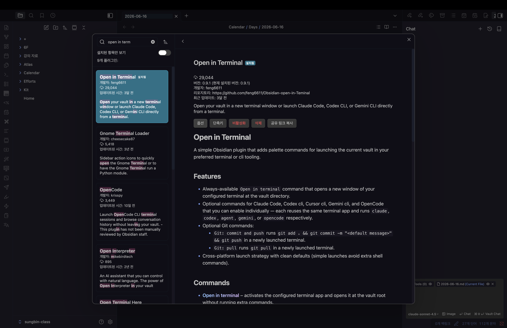
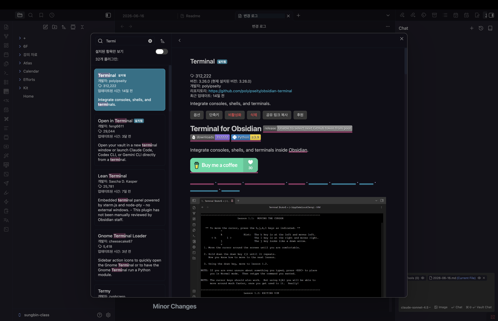
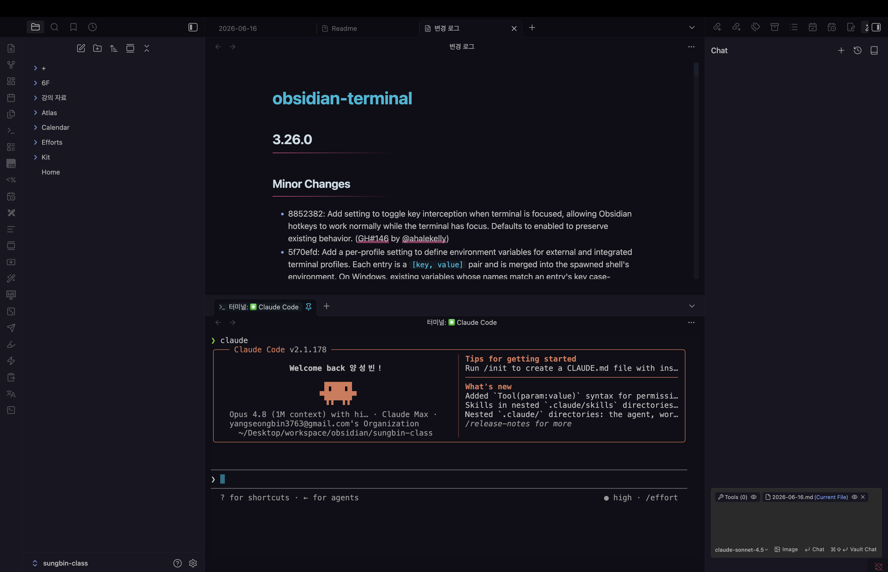

> 해당 포스팅은 [옵시디언 마스터 클래스: PKM·AI Second Brain·LLM WiKi 기초부터 실전까지](https://inf.run/ekDAP)를 참고하여 작성하였습니다.

## [옵시디언 x 클로드 코드] AI CLI 도구로 옵시디언 10배 활용하기

지금까지의 글에서는 옵시디언으로 개인 지식을 효율적으로 관리하는 법을 다뤘다. 이번 섹션부터는 한 걸음 더 나아가, **AI 코딩 도구**를 옵시디언과 연계해 생산성을 끌어올리는 방법을 살펴본다. 결론부터 말하면,
잘 쌓아둔 기록 위에 AI를 얹는 순간 옵시디언은 단순한 노트 앱을 넘어 '나를 가장 잘 아는 비서'에 가까워진다.

### 왜 하필 옵시디언이 AI 도구와 가장 잘 맞을까

강사가 "현 시점에서 옵시디언이 AI 도구를 활용하기에 가장 좋은 노트 툴"이라고 자신 있게 말하는 데에는 세 가지 이유가 있다.

- **모든 문서가 마크다운(Markdown)으로 저장된다.** 마크다운은 AI가 가장 친숙하게 인식하고 처리하는 포맷이다. 노션처럼 독자적인 블록 구조에 데이터를 가두는 방식이 아니라, AI가 그대로 읽고 쓸 수
  있는 평문 텍스트라는 점이 결정적이다.
- **모든 노트가 로컬 파일로 존재한다.** 문서들이 내 컴퓨터의 폴더와 파일로 그대로 놓여 있기 때문에, AI가 파일에 접근해 검색하고 종합하고 정리하기가 매우 수월하다.
- **AI 도구를 자유롭게 갈아 끼울 수 있다.** 데이터(노트)는 옵시디언에 그대로 두고, 그 위에서 동작하는 AI 도구만 필요에 따라 바꿔 쓸 수 있다. 특정 서비스에 종속되지 않는다는 뜻이다.

### AI CLI 도구란 무엇인가

AI 코딩 도구를 제대로 쓰려면 **CLI(Command Line Interface)**, 즉 터미널 환경에 대한 최소한의 이해가 필요하다. CLI는 마우스 클릭 대신 명령어로 로컬 파일을 다루는 환경이고, 요즘
개발자들은 여기에 AI를 접목해 코딩한다. 대표적인 AI CLI 도구는 다음과 같다.

- **Claude Code** — 앤트로픽(Anthropic)
- **Gemini CLI** — 구글(Google)
- **Codex CLI** — 오픈AI(OpenAI)

이 글에서는 **Claude Code**를 중심으로 설명하지만, 나머지 도구도 사용 방식은 대동소이하다. 핵심은 "터미널에서 자연어로 내 노트 폴더를 다룬다"는 개념 하나다.

### 실습 전, 이것만은 지키자

AI 코딩 도구는 한 번의 명령으로 **여러 문서를 동시에 편집**한다. 강력한 만큼 위험하기도 하다는 뜻이다. 그래서 처음 실습할 때는 다음 두 가지를 꼭 지키는 것이 좋다.

> **반드시 새 보관함(Vault)을 만들어 실습하라.**
> 기존 보관함에 바로 붙이면 민감한 정보가 노출되거나, 의도치 않은 파일 변경으로 그동안 쌓아온 기록이 망가질 수 있다. 비어 있는 새 보관함에서 충분히 익숙해진 뒤 실제 보관함으로 옮기는 것이 안전하다.

또한 Claude Code를 쓰려면 **유료 결제**가 필요하다. Pro 요금제 기준 월 17~20달러 수준이며, 결제 후에는 Claude Code가 보관함 폴더에 접근할 수 있도록 권한을 설정해 주면 된다(권한
설정은 공식 문서나 온라인 자료를 참고해 진행할 수 있다).

### 터미널에서 Claude Code 활용하기

터미널에서 Claude Code를 실행하면, 왼쪽에는 옵시디언 화면을, 오른쪽에는 Claude Code가 동작하는 터미널을 띄워 두고 작업하게 된다. 이제 코드 한 줄 몰라도, **자연어로 노트를 부린다.**

- **"내 파일 구조를 설명해줘"** — 폴더 구조와 문서 트리를 한눈에 파악해 준다.
- **"○○ 폴더에 Claude Code의 개념을 소개하는 문서를 만들어줘"** — 빈 노트를 만드는 데 그치지 않고, 내용까지 채운 문서를 자동으로 생성한다.
- **속성(Property) 일괄 제거, 폴더 구조 개편** 같은 번거로운 작업도 명령 한 줄로 끝낸다. 예를 들어 흩어진 노트들을 **PARA 구조**(
  Projects·Areas·Resources·Archives)로 재편하라고 시키면, 사람이 하면 한참 걸릴 정리를 AI가 알아서 해낸다.

강사의 표현을 빌리면 "AI 도구가 적어도 5분 안에 이걸 싹 정리해 줄" 정도의 생산성 차이가 난다.

### Cursor 같은 GUI 환경에서 활용하기

터미널이 낯설다면 **Cursor** 같은 GUI(Graphical User Interface) 에디터를 쓰는 방법도 있다. Cursor에서 옵시디언 보관함 폴더를 열면 옵시디언과 똑같은 문서 트리가 그대로 보이고,
`Command + J` 단축키로 터미널을 열어 그 안에서 Claude Code를 실행할 수 있다. 화면을 옮겨 다닐 필요 없이, **문서를 눈으로 보면서 동시에 AI로 편집**하는 셈이다.

- 지금 보고 있는 문서를 그 자리에서 요약하기
- 자연어 명령으로 속성·태그 추가하기
- 흩어진 특정 영역의 내용을 하나로 합치기

게다가 Cursor 자체에도 AI 에이전트 기능이 내장되어 있어, Claude Code와 함께 쓰면 편집·생성·정리를 한 화면에서 올인원으로 처리할 수 있다.

### 마치며

이번 글에서는 옵시디언과 Claude Code를 연계해 AI 도구로 PKM 생산성을 끌어올리는 법을 살펴봤다. 옵시디언은 **마크다운 저장**과 **로컬 파일 접근성** 덕분에 AI와 궁합이 가장 좋은 노트 툴이고,
CLI 환경에서는 데이터를 내 손에 둔 채 자연어만으로 문서를 관리할 수 있다. 터미널이 부담스럽다면 Cursor 같은 GUI 툴로 문서를 보면서 바로 편집하는 길도 열려 있다.

무엇보다 기억해야 할 것은, 이 모든 마법의 재료가 결국 **내가 쌓아온 기록**이라는 점이다. AI가 활용할 자산이 풍부할수록 그 위력도 커진다. 강사의 말처럼 "앞으로는 나의 기록들이 점점 더 중요해질" 것이다.
다음 글에서는 옵시디언 *안에서* Claude Code를 플러그인처럼 쓰는 방법을 이어서 다룬다.

## [옵시디언 x 클로드 코드] Claude Code 실전 통합편

앞 글에서는 터미널이나 Cursor에서 Claude Code를 띄워 옵시디언 보관함을 다뤘다. 그런데 막상 써 보면 한 가지 아쉬움이 남는다. **옵시디언과 터미널을 자꾸 오가야 한다**는 점이다. 이번 글에서는
커뮤니티 플러그인을 활용해 CLI 환경을 옵시디언 *안으로* 끌어들이고, 나아가 AI 에이전트를 사이드바에 상주시켜 노트와 실시간으로 주고받는 단계까지 통합 수준을 끌어올린다.

### 옵시디언 안에서 터미널 열기 — Open in Terminal

가장 먼저 할 일은 터미널을 옵시디언 밖에서 따로 켜지 않는 것이다. 커뮤니티 플러그인 탐색에서 '터미널'을 검색해 **Open in Terminal**을 설치하면 된다.

설치 후 `Command + P`로 명령어 팔레트를 열고 `Open in Terminal`을 실행하면, **보관함 경로가 자동으로 잡힌 채** 터미널이 뜬다. 거기서 `claude`만 입력하면 바로 Claude
Code가 실행된다. 매번 `cd`로 폴더를 찾아 들어가던 수고가 사라지는 셈이다.

> 비슷한 플러그인으로 **Open in Claude Code**도 있다. 경로를 여는 것에 더해 **로그인까지 자동으로** 처리해, 곧장 대화를 이어갈 수 있게 해준다.

### 사이드바에 터미널 붙이기 — Terminal

Open in Terminal은 편하지만, 여전히 별도 터미널 창이 뜬다는 점에서 문서 작업과 터미널 사이를 왔다 갔다 해야 한다. 이 번거로움을 없애주는 것이 **Terminal** 플러그인이다.

설치 후 활성화하고 `Terminal: Open`을 실행해 통합 프로필을 고르면, **옵시디언 사이드바 안에 터미널이 그대로 열린다.** 여기서 `claude`를 실행하면 옵시디언 화면을 벗어나지 않고도 AI와
작업할 수 있다. 강사의 말처럼 "터미널을 사이드바에서 보여주면 가장 좋은" 모양새가 완성된다.

### 그래도 남는 불편함 — 문서 인식의 핑퐁

여기까지 와도 결정적인 한계가 하나 남는다. 내가 **지금 보고 있는 문서를 Claude Code가 알아서 인식하지 못한다**는 점이다. 그래서 매번 이런 식으로 수동 작업을 해야 한다.

> "Claude Code.md 파일에서 개요를 5줄로 변경해줘"처럼, 대상 문서를 직접 태그하고 영역을 지정해 메시지를 보내는 **핑퐁**을 반복해야 한다.

문서를 보면서 자연스럽게 대화로 이어가고 싶은데, 매번 파일명을 일러줘야 하니 실제로 써 보면 꽤 거슬리는 요소다. 이 문제를 풀려면 한 단계 더 들어가야 한다.

### 비공식 플러그인을 설치하는 통로 — BRAT

옵시디언이 현재 보고 있는 문서를 Claude Code에 자동으로 물려주려면 **베타 버전 플러그인**이 필요하다. 그런데 베타·비공식 플러그인은 공식 마켓에 올라와 있지 않다. 이때 쓰는 것이 **BRAT(Beta
Review And Testing)**이다.

BRAT은 GitHub에 공개된 비공식 플러그인을 옵시디언 안에서 설치·관리할 수 있게 해주는 플러그인이다. 설정에서 BRAT을 검색해 설치한 뒤, `Add Beta Plugin` 버튼을 누르고 GitHub URL을
입력한 다음 `Add Plugin`을 클릭하면 된다.

> 다만 **비공식 플러그인은 옵시디언이 검증하지 않은 코드**라는 점을 반드시 기억하자. 보안을 비롯한 예기치 못한 이슈가 생길 수 있으니, 출처를 신뢰할 수 있는 경우에만 설치하는 것이 좋다.

### 노트와 AI를 일체화하다 — Claudian

BRAT으로 설치하는 핵심 플러그인이 바로 **Claudian**이다. 이 플러그인은 옵시디언 안에서 Claude Code(혹은 Gemini CLI 등)를 띄워, 노트와 AI를 **실시간으로 대화시키는** 역할을
한다.

Claudian을 실행하면 앞서의 핑퐁이 사라진다.

- **현재 보고 있는 노트 이름이 자동으로 입력**되어, 별도로 파일을 일러줄 필요가 없다.
- 문서의 핵심을 요약하거나, 특정 라인을 선택해 번역하는 작업을 그 자리에서 시킬 수 있다.
- 모델 변경, **Thinking 모드** 선택, 컨텍스트 포함 여부 등 세부 옵션이 패널 안에 내장되어 있다.

즉 AI 에이전트가 내 옵시디언 노트와 직접 상호작용하며 액션을 수행하는 것이다. 강사의 표현대로 "제 옵시디언 노트와 AI 에이전트가 바로바로 대화하면서 액션을 수행하는" 경험을 확인할 수 있다.

### 노트로 액션을 자동화하기

통합의 진가는 자동화에서 드러난다. 예를 들어 새 노트를 만들거나 기존 문서에 태그를 붙인 뒤, AI 에이전트에게 이렇게 시킬 수 있다.

> "특정 태그가 달린 문서를 모두 찾아서 폴더를 만들고 그 안으로 옮겨줘."

그러면 Claude Code가 해당 파일들을 찾아내고, 폴더를 생성하고, 문서를 이동시키는 일련의 과정을 알아서 수행한다. 결과로 생성된 링크를 클릭하면 바로 그 페이지로 이동까지 된다. 옵시디언과 Claude
Code가 완전히 한 몸처럼 동작하는, 진정한 **올인원** 경험이다. 강사의 말처럼 "쌓아놓은 노트를 가지고 무수히 많은 액션을 AI 에이전트를 통해 수행"할 수 있게 되는 셈이다.

### 마치며

이번 글에서는 옵시디언 안으로 Claude Code를 들이는 과정을, **Open in Terminal → Terminal(사이드바 통합) → BRAT + Claudian**의 순서로 단계적으로 살펴봤다. 처음에는
터미널을 보관함 경로에서 바로 여는 정도였지만, 사이드바 통합을 거쳐 Claudian에 이르면 문서를 보면서 AI와 실시간으로 대화하고, 태그 기반으로 폴더를 정리하는 자동화까지 손에 넣게 된다. 한 가지, 비공식
플러그인에는 늘 보안 리스크가 따른다는 점만 잊지 말자. 다음 글에서는 반대 방향, 즉 Claude Code 쪽에서 옵시디언을 더 잘 다루도록 **옵시디언 스킬(Skills)**을 연동하는 방법을 다룬다.

## [옵시디언 x 클로드 코드] Obsidian Skills 추가 및 활용 가이드

앞선 두 글에서는 옵시디언 안으로 Claude Code를 끌어들이는 데 집중했다. 이번에는 반대편을 손본다. Claude Code가 옵시디언을 *더 잘* 다루게 만드는 **Claude Skills** 이야기다.
스킬을 더하는 순간, 그동안 문법을 외워가며 손으로 만들던 Base·Canvas 문서가 자연어 명령 한 줄로 완성된다.

### Claude Skills란 — Claude Code의 '커뮤니티 플러그인'

Claude Skills를 가장 쉽게 이해하는 길은 옵시디언에 빗대는 것이다. 강사의 표현 그대로다.

> "옵시디언이 커뮤니티 플러그인으로 여러 부가 기능을 제공하는 것처럼, Claude Code도 스킬을 통해 여러 부가 기능을 제공한다고 이해하면 쉽다."

스킬에는 두 갈래가 있다. 하나는 앤트로픽(Anthropic)이 직접 제공하는 **공식 스킬**, 다른 하나는 **옵시디언 CEO인 Kepano**가 Claude Code에서 쓸 수 있도록 개발해 공개한 **옵시디언
스킬**이다. 후자는 Dataview, Markdown, Canvas 등 옵시디언 고유 기능을 정조준한다.

### 옵시디언 스킬 설치하기

옵시디언 스킬은 **GitHub 레포지토리 URL**로 설치한다. 커뮤니티 플러그인을 설치하듯, Claude Code에도 이 스킬을 설치해 주는 과정이라고 생각하면 된다. 설치하면 다음과 같은 스킬을 쓸 수 있다.

- `obsidian-base` — Base(Dataview) 문법으로 문서를 구조화
- `obsidian-markdown` — 마크다운 포맷 정리
- `obsidian-canvas`(`json-canvas`) — Canvas 시각화

핵심은 **스킬을 일일이 지정할 필요가 없다**는 점이다. 강사의 말처럼 "자연어로 그냥 입력하면 Claude Code가 알아서 이해하고 스킬을 사용"한다.

### 스킬 활용 ① Base 대시보드 자동 생성

`obsidian-base` 스킬을 쓰면, 특정 폴더의 문서들을 Base 문법에 맞춰 구조화하고 **대시보드 파일까지 자동으로** 만들 수 있다. 예전에는 Base 문법을 익히고 필터와 함수를 직접 짜야 했지만,
이제는 "이 폴더를 Base로 정리해줘" 같은 자연어 명령 한 줄이면 끝난다. 강사 말마따나 "스킬만 선언하고 자연어로 명령하면 바로 Base 문서가 만들어지는" 것을 확인할 수 있다.

### 스킬 활용 ② 마크다운 정리

`obsidian-markdown` 스킬은 문서를 마크다운 포맷에 맞게 다듬어 준다. 예를 들어 두서없이 적어둔 데일리 노트를 깔끔한 마크다운 형식으로 새로 업데이트하는 식이다. 형식을 신경 쓰지 않고 일단 쏟아낸
메모를, 사후에 AI가 정돈해 주는 셈이다.

### 스킬 활용 ③ Canvas 시각화

`json-canvas` 스킬은 현재 문서를 **옵시디언 Canvas 포맷으로 시각화**한다. 기존에는 사용자가 캔버스를 직접 열고, 내용을 옮겨 적고, 원본 문서를 참조하는 수고를 거쳐야 했다. 이제는 Claude
Code가 문서를 읽어 알아서 캔버스 형태로 배치해 준다. 글로 적힌 내용을 한눈에 보이는 구조로 바꾸는 작업이 명령 한 줄로 줄어든다.

### 앤트로픽 공식 스킬 — 문서를 PPT·PDF로

옵시디언 스킬 외에 앤트로픽 **공식 스킬**도 더할 수 있다. 대표적인 것이 **PDF·PPTX 생성** 스킬이다. 모든 스킬을 다 깔 필요는 없고, **필요한 것만 골라 설치**하는 편이 관리에 유리하다.

예를 들어 `pptx` 스킬을 설치한 뒤 "이 문서를 PPT로 만들어줘"라고 명령하면, Claude Code가 알아서 스킬을 호출해 슬라이드를 생성하기 시작한다. 완성된 PPT 파일은 폴더에서 바로 열어보고 수정할
수 있다. 옵시디언에 쌓아둔 노트가 곧장 발표 자료로 변신하는 셈이다.

### 마치며

이번 글에서는 Claude Skills로 Claude Code의 옵시디언 활용도를 한 단계 끌어올리는 법을 살펴봤다. 옵시디언 스킬(`obsidian-base`·`obsidian-markdown`·
`json-canvas`)으로 Base·마크다운·Canvas 작업을 자동화하고, 앤트로픽 공식 스킬로 노트를 PPT·PDF까지 뽑아냈다. 모두 **문법을 외울 필요 없이 자연어 명령만으로** 이뤄진다는 점이
핵심이다.

이로써 세 글에 걸친 '옵시디언 x 클로드 코드' 여정을 마무리한다. AI CLI 도구의 개념에서 출발해, 옵시디언 안으로 Claude Code를 통합하고, 마지막으로 스킬로 활용도를 극대화하는 데까지 이르렀다.
여기서 다룬 것은 Claude Code였지만, Gemini CLI나 Codex CLI 같은 다른 도구로도 같은 방식의 연계가 가능하다. 무엇을 쓰든 결국 그 위력을 결정하는 것은 **내가 꾸준히 쌓아온 기록**이라는
사실만큼은 변하지 않는다.