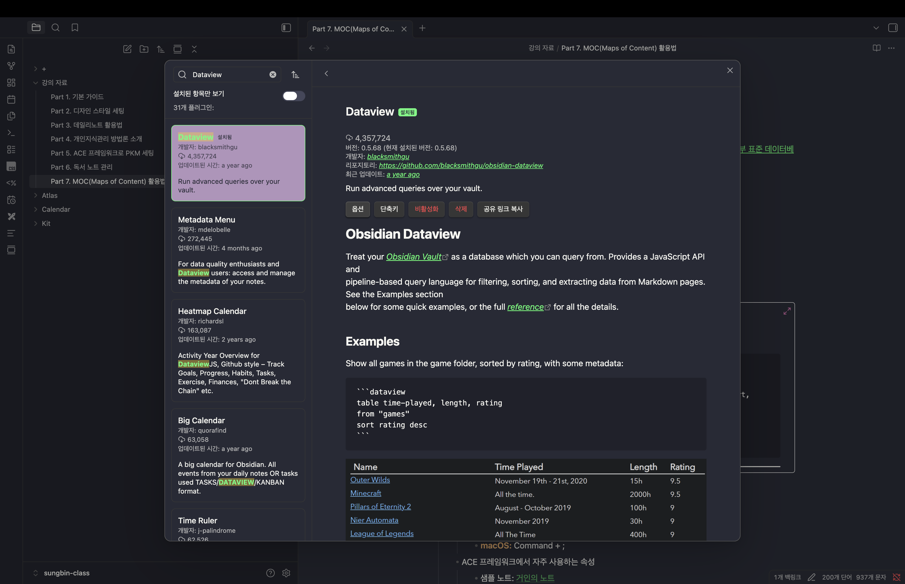
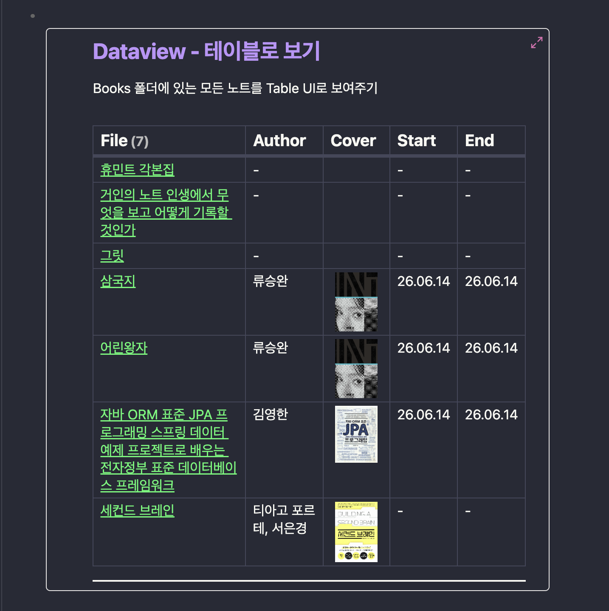

> 해당 포스팅은 [옵시디언 마스터 클래스: PKM·AI Second Brain·LLM WiKi 기초부터 실전까지](https://inf.run/ekDAP)를 참고하여 작성하였습니다.


## Part 7-1. 수동 정리는 그만, 자동으로 완성하는 MOC 구축법

이번 섹션부터는 MOC(Map of Content) 활용법을 다뤄보려고 한다. 앞서 PM/기획자 노트에서도 등장했던 개념인데, 개인지식관리를 공부하다 보면 자주 만나게 되는 용어다. MOC는 쉽게 말해 특정 주제와
연결되는 노트들을 한곳에 리스팅해서 보여주는, 일종의 목차 리스트라고 이해하면 된다.

### 수동 MOC의 한계

MOC를 손으로 직접 관리하다 보면 문제가 하나 생긴다. 새 노트를 만들 때마다 MOC 페이지에 일일이 멘션(링크)을 걸어줘야 하는데, 이걸 깜빡하면 연결 관계가 끊겨 노트가 목차에서 누락되어 버린다. 노트가
많아질수록 이런 누락은 점점 잦아진다.

다행히 옵시디언(Obsidian)에는 이런 누락을 막고 MOC를 자동으로 완성하는 기능이 있다.

### 데이터뷰(Dataview) 플러그인

그 핵심이 바로 데이터뷰(Dataview) 플러그인이다. 이 플러그인은 노트의 폴더 위치나 속성(property) 값을 기반으로, 공통된 정보를 가진 노트들을 자동으로 모아 목차 리스트를 만들어주는 데이터베이스
기능을 제공한다.

여기서 노션(Notion)과의 차이를 짚어두면 이해가 쉽다. 노션은 먼저 구조(데이터베이스)를 만들고 그 안에 노트를 넣는 방식이다. 반면 옵시디언은 노트를 먼저 만들어두고, 그 노트들의 속성을 이용해 데이터베이스
뷰를 만들어내는 방식이다.

설치는 `설정 → 커뮤니티 플러그인`에서 '데이터뷰'를 검색해 설치·활성화하면 된다. 적용이 바로 안 보이면 옵시디언을 껐다 켜거나 화면을 한 번 벗어났다 돌아오면 된다.





### 리스트 뷰 쿼리

데이터뷰는 코드 블록 안에 쿼리를 작성해 결과를 보여준다. 문법이 SQL과 매우 비슷해서, SQL을 아는 사람이라면 거의 그대로 읽힌다. 먼저 가장 간단한 리스트 형태부터 보자.

````
```dataview
LIST
FROM "Atlas Books"
SORT file.name ASC
```
````

- `LIST` : 결과를 리스트 형태로 보여줄 것을 선언
- `FROM "Atlas Books"` : 해당 폴더 안의 노트를 대상으로 가져오기
- `SORT file.name ASC` : 파일 이름 기준 오름차순 정렬

이 쿼리는 'Atlas Books' 폴더의 노트 목록을 동적으로 표시한다. 새 노트를 추가하면 자동으로 리스트에 반영되니, 멘션을 깜빡할 일이 없다.

### 테이블 뷰 쿼리

좀 더 풍부하게, 표 형태로도 보여줄 수 있다.

````
```dataview
TABLE author AS 저자, cover AS 표지
FROM "Atlas Books"
SORT file.startReadDate DESC
```
````

`TABLE` 키워드를 쓰면 표로 출력되며, 첫 번째 컬럼은 기본적으로 파일명(`file.name`)이 된다. 위 예시처럼 저자명(`author`), 표지 이미지 URL(`cover`) 등을 컬럼으로 추가할 수
있고(이미지 크기 조절도 가능하다), `SORT file.startReadDate DESC`처럼 특정 속성을 기준으로 정렬할 수도 있다.

### 조건부 필터링 (WHERE)

여기에 `WHERE` 조건을 더하면 원하는 노트만 골라낼 수 있다.

````
```dataview
TABLE author AS 저자
FROM "Atlas Books"
WHERE status = "완독"
```
````

이렇게 하면 상태(status)가 '완독'인 책들만 표에 나타난다.

### 서재 페이지 만들기

이 필터링을 활용하면 하나의 '서재' 페이지를 멋지게 구성할 수 있다. 예를 들어 '읽는 중인 책', '완독한 책', '다시 읽을 책'처럼 `WHERE` 조건만 다르게 준 표를 한 페이지에 여러 개 배치하면,
상태별로 정리된 나만의 서재가 완성된다. 책 노트의 속성만 바꿔주면 이 서재는 알아서 갱신된다.

### 마치며

지금까지 데이터뷰 플러그인으로 MOC를 자동화하는 방법을 살펴보았다. 리스트 뷰, 테이블 뷰, 그리고 `WHERE` 조건부 필터링까지 익혀두면, 노트를 만들 때마다 일일이 목차를 손보지 않아도 늘 최신 상태가
유지되는 지식 관리 시스템을 만들 수 있다. 다음 파트에서는 이 MOC를 더 탄탄하게 다듬는 방법들을 이어서 다뤄보도록 하겠다.

## Part 7-2. 노트 연결의 핵심, 속성 관리 마스터

앞에서 데이터뷰로 MOC를 자동화하려면 노트의 속성(property)이 잘 잡혀 있어야 한다는 걸 살펴봤다. 그런데 노트는 앞으로 많아질 일만 남았다. 노트가 늘어날수록 페이지와 연결 관계는 점점 복잡해지는데, 이때
각 노트가 어디에 있는지, 노트끼리 어떤 관계인지를 명확히 해두면 데이터베이스 형태로 관리하기가 훨씬 쉬워지고 원하는 정보도 바로 찾을 수 있다. 이번 파트에서는 그 핵심인 속성 관리를 익혀보자.

참고로 속성은 단축키로 빠르게 추가할 수 있다. 맥에서는 `Command + ;`, 윈도우에서는 `Ctrl + ;`이다.

### up 속성으로 상향 링크 만들기

지금까지의 연결은 대개 '거인의 노트 → 하위 노트'처럼 아래로 내려가는 링크만 있었다. 하지만 노트를 탐색하다 보면 위로 거슬러 올라가는 링크도 필요하다.

이때 `up`이라는 속성을 추가해 상위 노트를 연결해준다. 한쪽에서 `up`으로 상위 노트를 가리키면 양방향 링크가 형성되어, 위아래로 자유롭게 오갈 수 있다. 이때 `up` 속성은 일반 텍스트가 아니라 **목록(
list) 형태**로 설정해두는 것이 중요하다. 예를 들어 'ChatGPT' 노트가 여러 상위 개념에 동시에 속할 수 있는 것처럼, 하나의 노트가 여러 상위 노트에 연결될 수 있기 때문이다.

### related 속성으로 같은 레벨 연결하기

위아래 관계만으로는 부족할 때가 있다. 같은 레벨에 있는 노트끼리도 연결하고 싶을 때가 있기 때문이다. 예를 들어 회사 조직 정보를 관리할 때, 같은 위계의 부서·인물 노트를 서로 이어주고 싶은 경우다.

이럴 때는 `related` 속성을 사용해 동등한 레벨의 노트들을 연결한다. 이렇게 해두면 계층(up)뿐 아니라 옆으로도 이동할 수 있어 노트 간 이동성이 한층 좋아진다.

### Alias(별칭)로 검색과 연결 확장하기

마지막은 별칭(Alias)이다. 노트를 제목 외의 다른 이름으로도 검색하고 연결할 수 있게 해주는 기능이다.

예를 들어 책 노트가 한글 제목으로 되어 있어도, 원서 영문명을 별칭으로 등록해두면 영문명으로 검색하거나 멘션해서 연결할 수 있다. 즉, 노트 하나에 여러 이름표를 달아두는 셈이다.

또한 멘션할 때 세로 구분선(`|`)을 사용하면, 화면에 보이는 텍스트와 실제로 연결되는 노트를 다르게 지정할 수도 있다. (예: `[[원래 노트 제목|보여줄 이름]]`) 문맥에 맞는 자연스러운 표현으로 링크를 걸
수 있어 유용하다.

### 마치며

사실 속성에서 알아둘 것은 이 정도가 거의 전부다. `up`(상향), `related`(같은 레벨), `Alias`(별칭) 이 세 가지만 잘 활용해도 노트가 수천 개로 늘어나더라도 유기적이고 유연하게 연결된다. 결국
잘 정리된 속성이 곧 잘 작동하는 MOC와 데이터뷰의 토대가 되니, 노트를 만들 때 속성을 꼼꼼히 챙기는 습관을 들여두면 좋다.

## Part 7-3. AI 트렌드 노트, 한눈에 정리하는 분류법

AI 트렌드처럼 빠르게 쏟아지는 정보는 그때그때 잘 기록하고 분류해두지 않으면 금세 뒤죽박죽이 된다. 이번 파트에서는 강사가 실제로 81개의 AI 트렌드 노트를 MOC 형태로 정리하는 과정을 따라가며, 기록을 돕는
플러그인과 MOC 자동화 기법까지 살펴보려고 한다.

### MOC로 분류하고 특수기호로 표시하기

먼저 AI 트렌드 노트들을 주제별 MOC로 묶는다. 이때 옵시디언에서는 폴더와 문서를 아이콘으로 구분할 수 있는데, MOC는 폴더가 아니라 '문서'라는 점을 기억하자. 그리고 어떤 노트가 MOC인지 스스로 한눈에
알아보기 위해, 제목 앞에 삼각형 같은 특수기호를 붙여 표시해두면 관리가 편하다.

### 기록을 돕는 플러그인

트렌드를 기록할 때 유용한 두 가지 플러그인이 있다.

- **Natural Language Dates**: 날짜를 자연어로 입력할 수 있게 해준다. `@`로 오늘 날짜를 넣거나, '3일 전', 'three days after' 같은 표현으로 날짜를 유연하게 멘션할 수
  있다.
- **Auto Link Title**: URL만 붙여넣으면 내용을 알 수 없어 매번 클릭해봐야 하는데, 이 플러그인은 URL을 넣으면 해당 페이지의 제목을 자동으로 가져와 넣어준다.
  `Maximum Title Length` 설정으로 제목 길이를 조절해 가독성도 챙길 수 있다.

### Dataview JS로 MOC 자동화하기

앞서 Part 7-2에서 `up` 속성으로 상하 관계를 연결했다. 이 `up` 속성을 Dataview JS 쿼리와 결합하면 MOC를 한 번에 자동화할 수 있다.

먼저 데이터뷰 설정에서 `Enable JavaScript Queries` 옵션을 켠다. 그다음 "`up` 속성에 특정 파일명(=현재 MOC 노트)이 포함된 노트들을 자동으로 리스팅"하는 쿼리를 넣어준다.

````
```dataviewjs
dv.list(
  dv.pages()
    .where(p => p.up && p.up.map(String).includes("[[" + dv.current().file.name + "]]"))
    .file.link
)
```
````

이 코드의 원리는 간단하다. 어떤 노트의 `up` 속성에 현재 MOC 노트의 파일명이 들어 있으면, 그 노트를 자동으로 가져와 보여주는 것이다. 폴더 경로를 일일이 지정할 필요가 없고, 노트 제목을 바꿔도 연결
관계가 유지된다는 큰 장점이 있다. 같은 쿼리를 여러 MOC에 그대로 붙여넣어 일괄 적용하면 관리 효율이 크게 올라간다.

> 참고로 일반 데이터뷰(Dataview)는 폴더나 속성 기준으로 정적인 목록을 만들고, Dataview JS는 자바스크립트로 더 유연하게 동적인 목록을 만들 수 있다는 차이가 있다.

### Maps 폴더로 구조 재정비

MOC처럼 주제 중심으로 노트를 묶는 문서들은 한곳에 모아두는 것이 좋다. 그래서 `Maps` 폴더를 만들어 완성된 MOC 노트들을 이리로 옮긴다. 데일리노트 같은 '시간 기록'과 구분되는, '주제 중심' 노트들의
공간인 셈이다.

여기서 중요한 원칙이 하나 있다. 폴더를 무분별하게 만들면 나중에 어디에 뒀는지 찾기 어려워진다. 그래서 `Atlas`, `Maps`, `Notes`, `Visual Notes`처럼 성격별로 명확히 구분해두면, 새
노트를 어디에 넣을지도 어디서 찾을지도 분명해진다.

한 가지 안심할 점은, 옵시디언의 노트 연결은 속성 기반이라 폴더 위치를 옮겨도 연결이 끊기지 않는다는 것이다. 그래서 번거롭더라도 노트들을 `Notes` 폴더로 모으고 불필요한 폴더를 정리해도 아무 문제가 없다.

### 마치며

옵시디언의 노트 연결 방식은 노션이나 구글 문서와는 분명 다르다. 하지만 Dataview JS를 활용한 자동화와 성격별로 잘 나뉜 폴더 구조를 갖추면, 수많은 노트를 폴더 위치에 얽매이지 않고 유기적으로 연결해
관리할 수 있다. 처음엔 낯설어도 실제로 써보면 이 유연함이 무척 편리하게 느껴질 것이다.

## Part 7-4. BASE로 자동화하는 MOC 구축법

앞에서 데이터뷰(Dataview)와 Dataview JS로 MOC를 자동화하는 법을 살펴봤다. 강력하긴 하지만, 쿼리를 직접 작성해야 해서 개발 지식이 없으면 다소 부담스러운 게 사실이다. 그런데 이 작업을 훨씬 쉽게 만들어주는 옵시디언(Obsidian)의 새로운 공식 기능이 있는데, 바로 BASE다.

### BASE란

BASE는 옵시디언이 공식 기능으로 내놓은 데이터베이스 조합 기능이다. 데이터뷰처럼 쿼리를 작성할 필요 없이, 몇 번의 설정만으로 원하는 조합의 리스트를 만들 수 있다. 강사가 직접 써보니 공간도 덜 차지하고, 더 편리하고 쉬우며, 속도까지 매우 빠르다고 한다.

다만 강의 시점에는 아직 베타 기간이었고, 정식 출시 후에 본격적으로 활용하기를 권한다고 했다. (옵시디언 정식 기능으로 자리 잡은 뒤라면 데이터뷰보다 BASE를 우선 쓰는 편이 편리하다.)

### BASE 사용법

사용 흐름은 다음과 같다.

1. `DB Structure` 같은 폴더를 하나 만들어둔다.
2. `설정 → 코어 플러그인`에서 BASE를 활성화한다.
3. 명령 팔레트(`Command + P`)에서 `base`를 검색해 `Create New Base`로 새 데이터베이스를 만든다.

처음에는 모든 노트가 리스팅되는데, 여기서 필터를 걸어 원하는 노트만 보이게 하면 된다. 예를 들어 특정 폴더(`Atlas Books`)에 있는 노트만 보여주도록 필터를 설정하는 식이다.

### BASE로 MOC 만들기

MOC 구축에도 그대로 활용할 수 있다. 앞서 Dataview JS 코드로 처리했던 "`up` 속성에 현재 노트가 포함된 노트 모으기"를, BASE에서는 `up` 속성에 `this.file.name`을 포함하는 필터로 간단히 대체할 수 있다.

구조만 한 번 잡아두면 그 구조에 맞는 데이터가 자동으로 리스팅되기 때문에, 'AI 검색 요약'이나 '데이터 리서치 시각화' 같은 노트를 BASE에 끌어다 놓는 것만으로 데이터뷰 JS와 동일한 결과를 얻을 수 있다.

### BASE의 한계와 대안

물론 BASE가 만능은 아니다. 예를 들어 도서 리스트에서 표지 이미지를 가져와 보여주는 것 같은 일부 기능은 아직 제한적이다. 이런 세밀한 표현이 필요하다면 데이터뷰나 Dataview JS를 함께 쓰면 된다. 즉, 기본적인 목록·MOC는 BASE로 간편하게, 특수한 표현이 필요한 곳은 데이터뷰로 — 이렇게 상황에 맞게 골라 쓰는 것이 좋다.

기존에 만들어둔 데이터뷰 쿼리 샘플들은 `DB Structure` 폴더로 옮겨두고, 쓰지 않는 노트와 폴더는 정리해 폴더 구조를 깔끔하게 유지한다.

### 마치며 — 나만의 PKM 완성

이렇게 약 100여 개의 노트를 잘 정리하고 나면, 캘린더·키트·아틀라스·맵스 같은 기본 폴더 구조 안에서 모든 노트가 속성으로 유기적으로 연결되어 돌아가게 된다. 바로 이렇게 잘 잡힌 구조 속에서 노트들이 자연스럽게 이어지도록 관리하는 것, 그것이 곧 '나만의 PKM(개인지식관리)'이다.

이로써 MOC를 수동 관리에서 데이터뷰, Dataview JS, 그리고 BASE까지 단계적으로 자동화하며 PKM 구조를 완성해보았다. 처음 세팅이 다소 번거롭더라도 한 번 갖춰두면 오래도록 든든한 지식 관리 시스템이 되어줄 것이다.

## Part 8. 나만의 완벽한 PKM 지식관리 시스템 완성하기

앞선 파트들에서 MOC 자동화와 속성 관리, DB Structure와 Maps 폴더까지 만들어봤다. 이번 파트에서는 아직 채우지 못한 나머지 폴더들의 성격과 보관 방법을 정리하며, 비로소 나만의 PKM(개인지식관리) 폴더 구조를 완성해보려고 한다.

전체 그림을 먼저 잡자면, 이 구조는 결국 **지식과 관련된 기록 / 시간과 관련된 기록 / 목표와 관련된 기록**, 이 세 가지 축으로 나뉜다고 이해하면 된다. ACE 프레임워크의 Atlas(지식), Calendar(시간), Effort(목표)와 그대로 이어진다.

### Logs 폴더 — 시간 관련 로그성 기록

먼저 캘린더 아래에 `Logs` 폴더를 만든다. 여기에는 시간과 함께 꾸준히 쌓아가야 하는 로그성 노트를 보관한다. 예를 들어 수영 레슨 기록, 병원 기록, 주식 투자 기록, 회사 업무 이슈, 제품 아이디어, 조직 커뮤니케이션처럼 주제별로 계속 이어 적어야 하는 내용들이 여기에 들어간다.

### Records 폴더 — 시간과 연결된 단발성 기록

`Records` 폴더는 시간과 관련된 다양한 기록을 모아두는 공간이다. 데일리노트나 로그성 기록 외에, 미팅 기록처럼 단발성으로 생기는 기록을 관리한다. 이때 미팅 기록은 데일리노트에 멘션으로 연결해두면, 데일리노트가 너무 복잡해지지 않으면서도 필요할 때 바로 찾아갈 수 있다.

### Efforts 폴더 — ACE를 완성하는 목표 관리

이제 ACE 프레임워크를 완성해주는 `Efforts` 폴더를 만든다. 닉 마일로의 개념을 차용해, 진행 상태에 따라 노트를 다음과 같이 분류한다.

- **ON**: 지금 진행 중인 일
- **ON GOING**: 반복적으로 진행되는 일
- **SIMMERING**: 아직 구상·기획 단계인 일 (주전자가 보글보글 끓는 모습을 떠올리면 된다)
- **Sleeping**: 잠시 멈춰둔 일
- **Archive**: 완료된 일

개인 목표와 회사 목표, 반복 프로젝트 등을 이 상태값에 맞춰 관리하면, 지금 무엇에 힘을 쏟고 있는지가 한눈에 정리된다.

### Home 노트 — 핵심 가치와 현재 집중 활동

마지막으로 가장 최상단에 `Home` 노트를 배치한다. 이곳에는 나의 지식 관리 철학과 인생 철학, 버킷리스트, 그리고 6F(내 삶에서 가장 중요한 6가지 영역)를 기록한다. 말하자면 내 PKM 전체의 출발점이자 나침반 역할을 하는 노트다.

여기에 데이터뷰(Dataview) 쿼리를 더하면, Efforts 폴더의 모든 노트를 끌어와 "지금 내가 집중하고 있는 활동 리스트"를 자동으로 보여줄 수 있다. 결국 내가 현재 몰두하고 있는 모든 것이 이 Home 노트에 모이는 셈이다.

### Dataview와 BASE, 무엇을 쓸까

이런 리스트는 데이터뷰로도, BASE로도 만들 수 있다. 결과물 자체는 동일하지만, 앞서 이야기했듯 BASE가 더 편리하고 속도도 빠르다. 그래서 기본은 BASE를 중심으로 세팅하는 것을 추천한다.

### 마치며

이로써 캘린더·키트·아틀라스·맵스에 더해 Logs, Records, Efforts, 그리고 Home 노트까지, PKM 시스템의 기본 세팅이 모두 완료되었다. 지식·시간·목표라는 세 축을 중심으로 모든 노트가 유기적으로 연결되고, Home 노트에서 전체를 조망할 수 있는 구조다. 이렇게 한 번 틀을 갖춰두면, 앞으로는 그 안에 기록을 쌓아가기만 하면 된다. 이것이 바로 나만의 완벽한 PKM 지식관리 시스템이다.

