> 해당 포스팅은 [옵시디언 마스터 클래스: PKM·AI Second Brain·LLM WiKi 기초부터 실전까지](https://inf.run/ekDAP)를 참고하여 작성하였습니다.

## 전체 기능 둘러보기

이번 강의에서는 옵시디언(Obsidian)에만 있는 매력적인 기능들을 하나씩 둘러보려고 한다. 옵시디언은 회사에서는 노션(Notion)과 함께 개인 기록용으로 자주 활용되는 강력한 노트 앱이다. 단순한 기능 설명에
그치지 않고, 실제로 어떻게 쓰이는지 사용 사례 중심으로 살펴보면서 옵시디언이 왜 생산성 향상에 도움이 되는지 알아보도록 하겠다.

### 시각화 기능

첫 번째는 시각화 기능이다. 옵시디언의 시각화 기능은 `Excalidraw` 플러그인을 통해 사용할 수 있다. 이 기능을 활용하면 플로우 차트(flowchart)를 그리거나, 웹페이지를 노트 안에 임베드(embed)
하는 등 시각적인 정보 표현이 가능하다. 글로만 정리하기 어려운 구조나 흐름을 그림으로 풀어낼 수 있다는 점에서 유용하다.

### 데일리노트

두 번째는 데일리노트(Daily Notes)이다. `Calendar` 플러그인을 설치하면 날짜별로 노트를 관리하는 데일리노트 기능을 사용할 수 있다. 강사의 경우 5년 이상 매일의 일과를 데일리노트에 기록하며
활용하고 있다고 한다. 하루를 하나의 노트로 관리하기 때문에 그날의 할 일, 메모, 회고를 한곳에 모아둘 수 있다.

### 캘린더 일정 가져오기

세 번째는 캘린더에 등록된 일정을 옵시디언으로 가져오는 기능이다. 하루를 시작할 때 구글 캘린더(Google Calendar)에 등록해둔 일정을 옵시디언으로 바로 불러와 확인할 수 있다. 일정을 보기 위해 다른 앱을
열 필요 없이 옵시디언 안에서 그날의 스케줄을 한눈에 파악할 수 있어 효율적이다.

### 웹 뷰어 기능

네 번째는 웹 뷰어(Web View) 기능이다. 옵시디언 내부에서 웹페이지를 바로 열어볼 수 있는 기능으로, 앞서 이야기한 구글 캘린더처럼 웹페이지를 옵시디언 안에서 바로 사용할 수 있다. 노션 역시 웹페이지로 열
수 있어 옵시디언과 함께 활용이 가능하다.

여기서 한 걸음 더 나아가, 웹페이지의 내용을 노트로 저장한 뒤 하이라이트(highlight)나 볼드 처리(bold) 등으로 자유롭게 수정할 수도 있다. 이렇게 저장해둔 노트는 다른 페이지에서 멘션(mention)
하거나 임베드로 불러와 보여줄 수 있어, 단순히 읽고 끝나는 것이 아니라 내 지식 체계 안으로 끌어와 연결할 수 있다.

### 도서 정보 관리

다섯 번째는 책을 좋아하는 사람들에게 특히 추천하는 기능으로, 도서 정보를 한 번에 가져오는 기능이다. 새 파일을 만들고 책의 제목과 저자를 입력한 후 가져오기를 클릭하면 책의 기본 정보가 자동으로 채워지며, 이를
바탕으로 나만의 서재까지 관리할 수 있다. 도서 리스트를 만들어 필터링하거나 검색하는 기능도 제공한다. 강사는 좋아하는 책의 챕터별 주요 내용을 하이라이트하고 자신의 생각을 함께 정리해 기록해두는 방식으로 활용한다고
한다.

### AI 플러그인 연동

마지막 여섯 번째는 AI 플러그인 연동이다. 다양한 AI 플러그인과 연동하면 내가 작성해둔 노트 내용을 기반으로 대화를 나누거나, 노트의 내용을 바탕으로 문서를 업데이트하는 등 AI 기능을 적극적으로 활용할 수
있다. 쌓아둔 노트가 많을수록 이 기능의 가치는 더욱 커진다.

### 로컬 저장과 무료라는 강점

옵시디언의 또 다른 큰 장점은 모든 파일이 로컬에 저장된다는 점이다. 클라우드가 아닌 내 PC에 직접 저장되기 때문에 보안성과 속도 면에서 뛰어나다.

그리고 무엇보다도 이 모든 기능이 무료라는 점이 가장 큰 장점이다. 과거에는 상업적으로 사용할 경우 유료였으나, 최근 정책이 변경되면서 회사에서도 무료로 사용할 수 있게 되었다. 동기화(Sync) 기능은 유료이지만,
iCloud나 Google Drive, Git 등 무료 도구를 통해 충분히 대체할 수 있어 사실상 거의 모든 기능을 무료로 사용할 수 있는 셈이다.

### 높은 자유도와 러닝 커브

이렇게 매력적인 기능이 많은 옵시디언이지만, 분명한 단점도 존재한다. 바로 자유도가 너무 높다는 점이다. 옵시디언은 사용자가 원하는 대로 거의 모든 것을 커스터마이징(customizing)할 수 있는데, 이 높은
자유도가 곧 러닝 커브(learning curve)로 이어진다.

체계 없이 사용하면 노트가 금세 뒤죽박죽이 되어 그냥 메모장처럼 흘러가 버리기가 쉽다. 그래서 옵시디언을 잘 사용하려면 본인의 문서관리 스타일에 맞게끔 최적화를 해두어야 하는데, 이 과정에 도달하기까지 여러 번의
시행착오를 반복하게 된다. 결국 옵시디언은 "한 번 세팅하면 끝"인 도구가 아니라, 자신에게 맞는 형태를 찾아가는 도구라고 볼 수 있다.

### 마치며

지금까지 옵시디언의 대표적인 기능들과 장단점을 전체적으로 둘러보았다. 시각화, 데일리노트, 캘린더 연동, 웹 뷰어, 도서 관리, AI 연동까지 다양한 기능이 있지만, 결국 핵심은 이 기능들을 내 스타일에 맞게
최적화하는 데 있다. 앞으로는 이러한 기능들을 하나씩 차근차근 다뤄볼 예정이니, 천천히 따라오면서 자신만의 옵시디언을 만들어가면 되겠다.

## (초급 활용) 다이어리 앱? Obsidian이면 충분해요

이번에는 옵시디언을 활용해 웬만한 유료 다이어리 앱 이상의 기능을 무료로 구현하는 방법을 알아보도록 하겠다. 옵시디언은 노트 앱이기 때문에 당연히 사진 등록도 가능하고, 몇 가지 설정만 해두면 다이어리처럼 매일
기록하는 환경을 손쉽게 만들 수 있다. 지금부터 옵시디언 설치부터 리마인드 기능 설정까지 순서대로 따라가 보자.

### 일일 노트 자동 열기

먼저 옵시디언을 설치하고 보관함(Vault)을 생성한다. 보관함은 옵시디언에서 노트를 저장하고 관리하는 공간으로, 목적별로 새로운 보관함을 만들어 노트를 분리할 수도 있다.

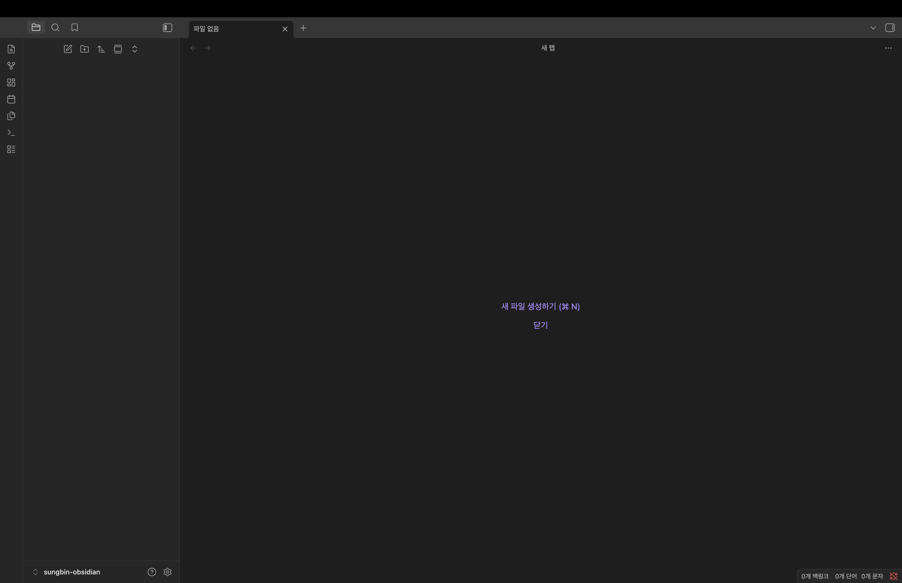

보관함을 만든 뒤에는 기본 설정에서 앱을 실행할 때 오늘 날짜의 노트가 자동으로 열리도록 설정한다. 이렇게 해두면 옵시디언을 켤 때마다 마치 다이어리를 펼치듯이 오늘의 노트가 바로 열려, 매일 기록하는 습관을
자연스럽게 만들 수 있다. 노션 같은 앱과 달리 날짜를 매번 직접 만들 필요 없이 자동으로 세팅된다는 점이 편리하다.

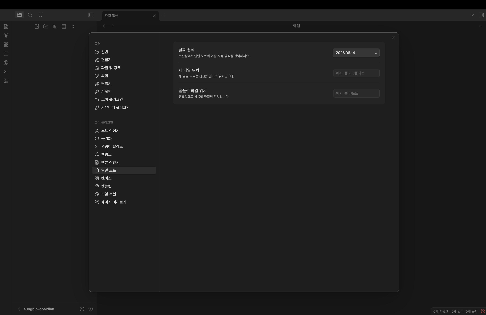

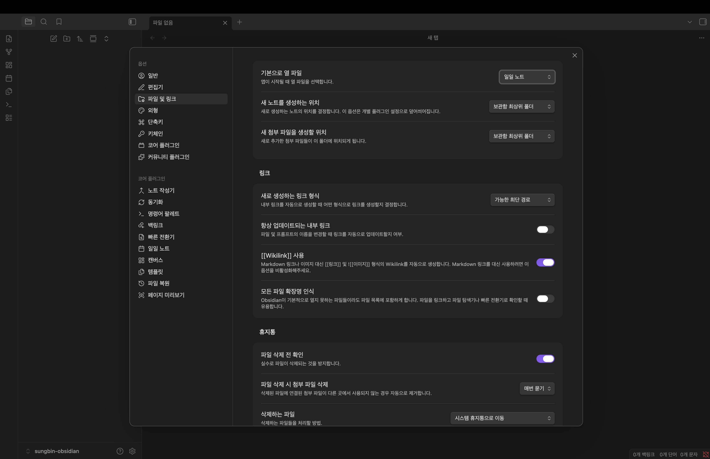

### Calendar 플러그인 설치 및 활용

다음으로 `Calendar` 플러그인을 설치한다. 캘린더 기능을 추가하면 달력 형태로 날짜별 노트를 한눈에 확인할 수 있고, 과거 날짜의 노트를 쉽게 찾아보거나 새로 생성할 수도 있다. 날짜별 기록 관리가 훨씬
직관적이고 편해진다.

`Calendar`나 뒤에서 소개할 `Journal Review`처럼, 옵시디언의 기능을 확장하는 이런 플러그인들을 커뮤니티 플러그인(Community Plugin)이라고 부른다. 사용자들이 직접 개발하고 공유하는
것으로, 옵시디언의 자유도를 책임지는 핵심 요소이다.

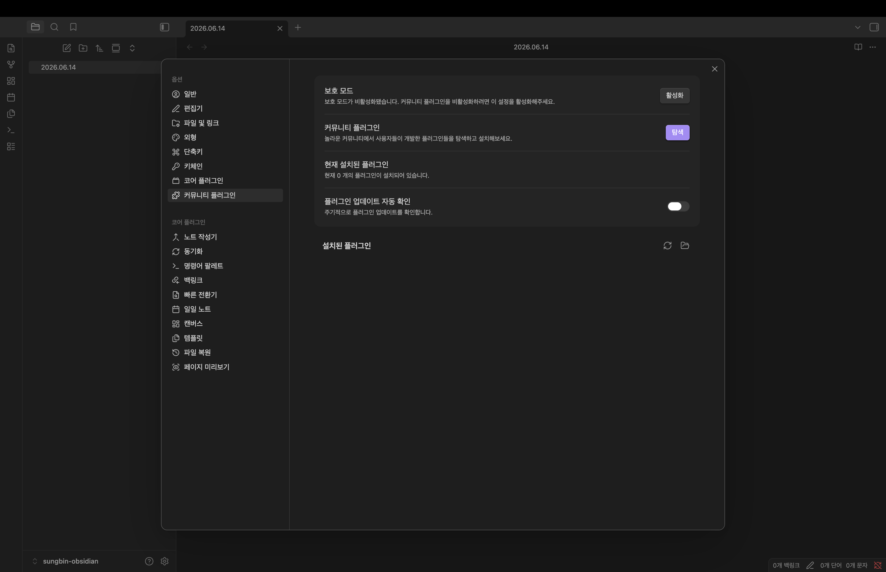

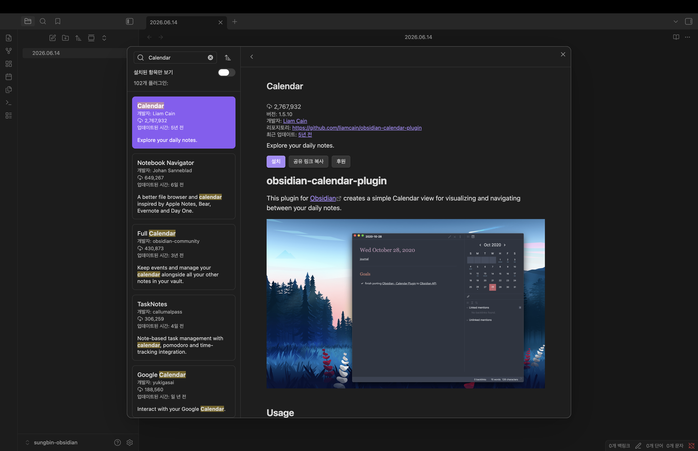

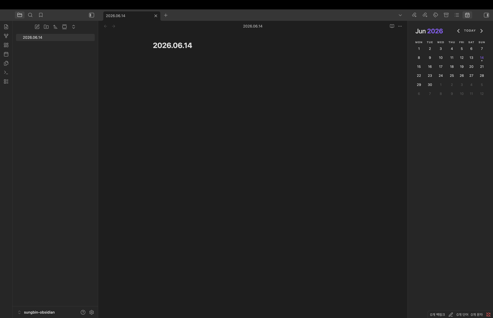

### 템플릿으로 질문 리스트 자동 삽입

막상 빈 페이지를 마주하면 무엇을 기록해야 할지 막막한 경우가 많다. 이럴 때를 대비해 템플릿(Template) 기능을 활용한다. "오늘 감사한 일은?", "인상 깊었던 순간은?" 같은 질문 리스트를 미리 템플릿으로
만들어두고, 새로운 노트를 생성할 때 자동으로 삽입되도록 설정하는 것이다.

이렇게 해두면 기록의 시작이 한결 수월해지고, 매일의 노트 구조도 일관되게 유지할 수 있다. 다만 템플릿을 수정하더라도 이미 작성된 과거 노트에는 반영되지 않으니, 이 점은 미리 알아두는 것이 좋다.

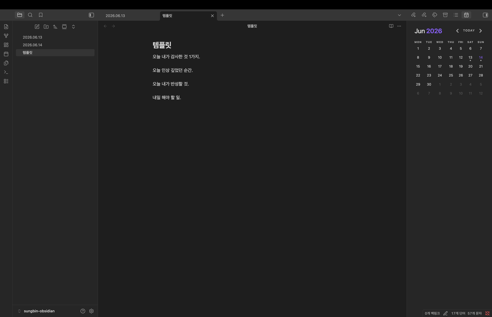

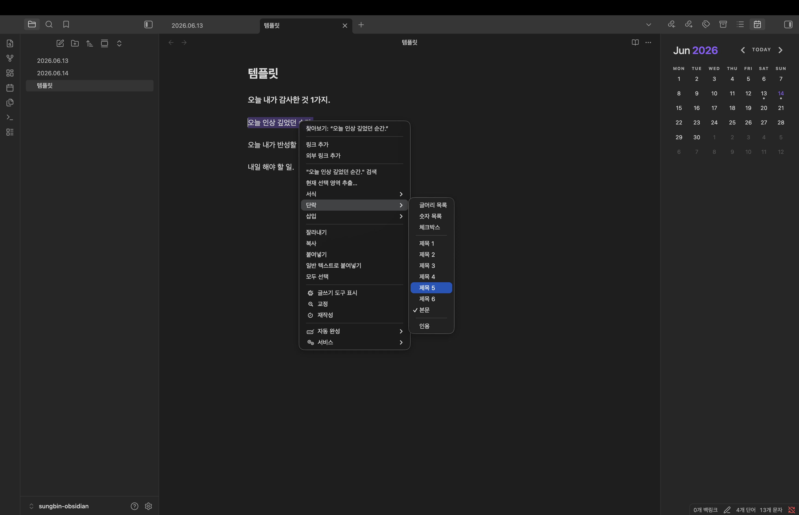

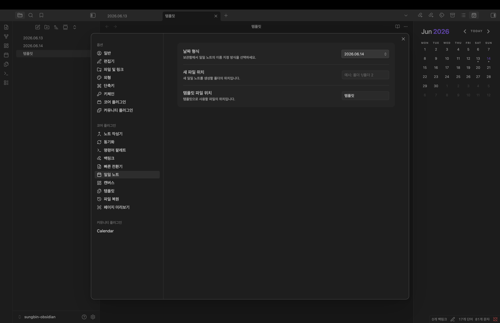

### 첨부파일 폴더 관리

옵시디언은 노트 앱이기 때문에 사진 같은 첨부파일을 손쉽게 등록할 수 있다. 그런데 첨부파일이 노트와 같은 위치에 그대로 노출되면 노트 목록이 금세 복잡해진다. 이를 방지하기 위해 첨부파일을 별도의 폴더로 관리하도록
설정한다. 한 번 지정해두면 새로 추가하는 첨부파일이 자동으로 해당 폴더에 저장되어, 노트 목록을 깔끔하게 유지할 수 있다.

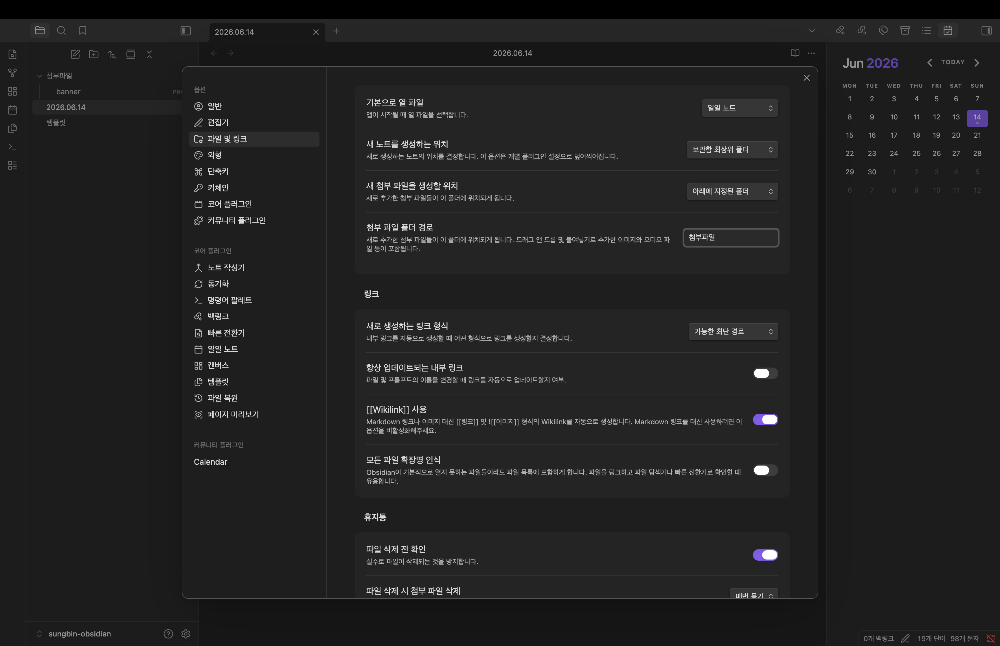

### Journal Review 플러그인으로 리마인드 받기

마지막으로 `Journal Review` 플러그인을 설치한다. 이 플러그인의 'On This Day' 기능을 활용하면 과거의 오늘 작성했던 노트를 다시 리마인드 받을 수 있다.

반복 주기를 설정해 7일 전, 14일 전 등 원하는 주기마다 과거 기록을 꺼내볼 수 있는데, 이는 잊고 있던 기억을 되살리고 기록의 연속성을 강화하는 데 큰 도움이 된다. 단순히 기록만 쌓아두는 것이 아니라, 쌓인
기록을 다시 마주하게 만들어준다는 점에서 다이어리 활용의 완성도를 높여준다.

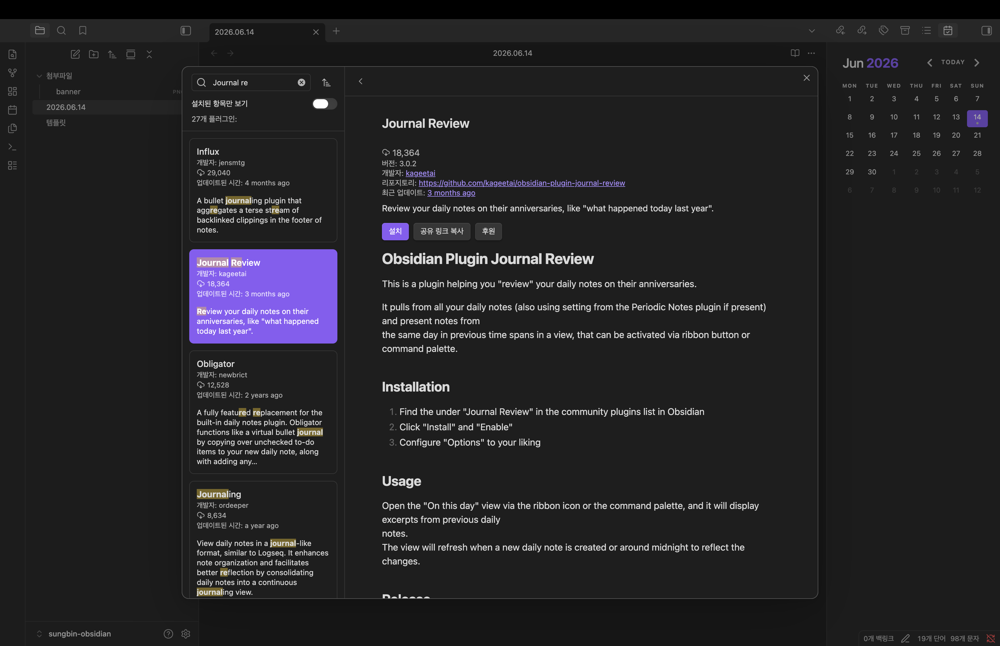

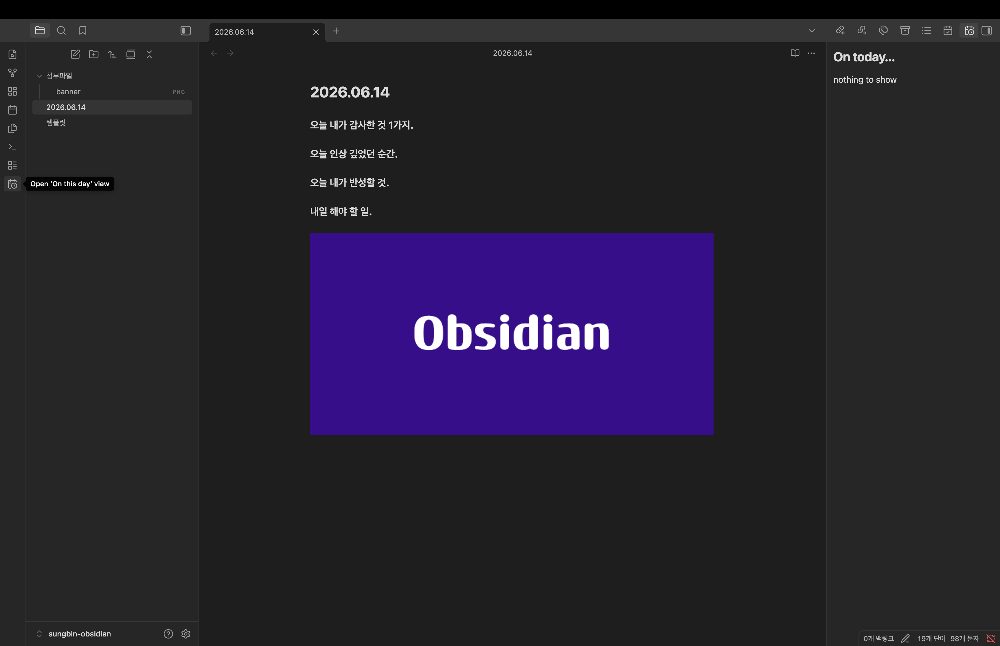

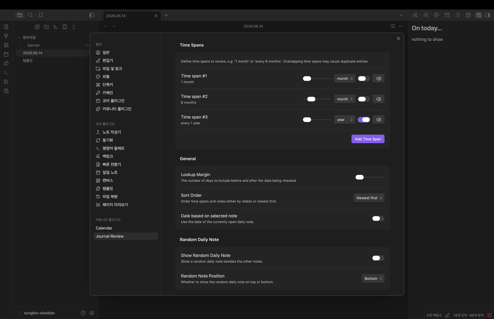

### 마치며

지금까지의 설정만으로도 옵시디언은 웬만한 유료 다이어리 앱 이상의 기능을 무료로 제공한다. 일일 노트 자동 열기, 캘린더, 템플릿, 첨부파일 폴더 관리, 리마인드 기능까지 갖추면 충분히 훌륭한 다이어리가 된다. 물론
옵시디언은 자유도가 굉장히 높은 만큼 이것은 수많은 활용 방법 중 하나일 뿐이니, 천천히 따라 해보면서 자신에게 맞는 방식을 찾아가면 되겠다.

### 일일 노트, 시작 시 자동으로 열기 (설정 위치가 바뀐 이야기)

앞서 다이어리 활용에서 "앱을 켜면 오늘 날짜의 일일 노트가 자동으로 열리도록" 설정하는 이야기를 했다. 그런데 옵시디언을 오랜만에 업데이트하고 나면 "어? 그 설정이 어디 갔지?" 하고 당황하는 경우가 있어, 이
부분을 조금 더 자세히 짚어두려고 한다.

### 토글이 사라진 것처럼 보이는 문제

예전 버전에서는 일일 노트(Daily Notes) 코어 플러그인 설정 안에 "앱 시작 시 일일 노트 열기" 같은 토글이 있었다. 이것을 켜두면 옵시디언을 실행할 때마다 그날의 일일 노트가 자동으로 열렸다. 그런데
최신 버전에서 같은 자리를 찾아보면 이 토글이 보이지 않아서, 기능이 없어진 것처럼 오해하기 쉽다.

### 핵심은 옵션이 자리를 옮겼다는 것

결론부터 말하면 이 옵션은 삭제된 것이 아니라 위치가 바뀐 것이다. 이제는 일일 노트 플러그인이 아니라 옵시디언 본체 설정 쪽으로 이동했다. 다음 순서대로 설정하면 된다.

1. `설정(Settings)`을 연다.
2. `파일 및 링크(Files and links)` 메뉴로 이동한다.
3. `열 기본 파일(Default file to open)` 항목을 찾는다.
4. 이 값을 "일일 노트(Daily note)"로 지정한다.

예전의 토글 하나가 "시작할 때 어떤 파일을 열지 고르는" 옵션으로 바뀐 셈이다. 이렇게 지정해두면 옵시디언을 켤 때마다 오늘 날짜의 일일 노트가 자동으로 열리고, 만약 오늘 날짜의 노트가 아직 없다면 자동으로 새로
생성한 뒤 열어준다.

### 정상 동작을 위한 전제 조건

이 기능이 제대로 동작하려면 일일 노트 관련 설정이 미리 잡혀 있어야 한다. 먼저 일일 노트(Daily Notes) 코어 플러그인이 켜져 있어야 하고(`설정 → 코어 플러그인(Core plugins)`에서 활성화),
일일 노트 설정에서 날짜 형식(Date format)과 새 파일 위치(New file location)가 지정되어 있어야 한다. 특히 새 파일 위치가 비어 있으면 자동 생성되는 일일 노트가 보관함(Vault) 루트에
만들어지므로, 노트가 엉뚱한 곳에 쌓이는 것이 싫다면 데일리노트 전용 폴더를 미리 지정해두는 것이 좋다.

### 주의: "마지막 파일 열기"로 두면 안 된다

마지막으로 한 가지 꼭 짚어둘 점이 있다. `열 기본 파일(Default file to open)`에는 "마지막 파일 열기(Last open file)" 같은 선택지도 있는데, 최근 버전에서는 이 값으로 두면 일일
노트가 자동으로 생성·열리지 않는 동작 변화가 있었다. 즉, "어제 보던 파일이 그대로 열리는 것"과 "오늘 일일 노트가 새로 열리는 것"은 서로 다른 동작이다. 일일 노트 자동 열기를 원한다면 반드시 이 값을 "
일일 노트"로 명시해야 한다. 무심코 기본값이나 "마지막 파일 열기"로 둔 채 "왜 안 되지?" 하고 헤매는 경우가 많으니 주의하자.

## (고급 활용) PM/기획자 업무 노트 둘러보기

다들 각자 노트 관리를 하고 있겠지만, 막상 다른 사람의 노트는 어떻게 생겼을지 궁금할 때가 종종 있다. 이번에는 PM/기획자로 일하는 강사가 실제로 옵시디언을 어떻게 활용해 업무 노트를 관리하는지 그 노하우를
둘러보려고 한다. 대외비 내용은 제외하고 가상의 회사 페이지를 만들어, 실제 노트 구조를 거의 그대로 보여주는 방식으로 진행된다.

### Remember 섹션

가장 자주 사용하는 섹션은 Remember이다. 이름 그대로 잊지 않기 위해 기록해두는 공간으로, 문득 떠오른 제품 아이디어, 조직 내 커뮤니케이션 중 기억해둘 내용, 운영 관련 로그 등을 담는다.

운영 로그는 날짜별로 짧게 코멘트를 남기는 식으로 관리한다. 여기서 중요한 점은, 정말 중요한 내용은 협업 문서에 따로 기록하고 이 섹션에는 "잊지 않기 위한 핵심 메시지"만 짧게 남긴다는 것이다. 모든 것을 다
적는 공간이 아니라, 휘발되기 쉬운 생각을 빠르게 붙잡아두는 공간으로 이해하면 된다.

### Projects 섹션

Projects 섹션은 현재 집중하고 있는 프로젝트성 항목들을 담는 공간이다. 강사는 이 항목들을 상태에 따라 네 가지로 분류해서 관리한다.

- **on**: 시작과 끝이 분명한, 지금 진행 중인 프로젝트
- **ongoing**: 끝은 없지만 꾸준히 중요한 업무 (예: 셀러 파트너십 관리)
- **simmering**: 기획 단계에서 아직 정리 중인 내용
- **sleeping**: 잠시 홀딩된 업무

이렇게 상태별로 나눠두면 지금 무엇에 힘을 쏟아야 하는지, 무엇이 대기 상태인지를 한눈에 파악할 수 있다.

### MOC(Maps of Content)로 지식 관리하기

이 노트 관리의 핵심은 MOC(Maps of Content)이다. MOC는 쉽게 말해 "나만의 분류 체계로 만들어둔 지식 관리 체계"라고 이해하면 된다. 강사는 자신이 일하는 산업 전체, 운영 중인 제품의 스펙과
비즈니스 모델, 조직, 데이터 트렌드까지 이 MOC 안에 담아 관리한다. 크게 네 가지 MOC로 나뉜다.

#### 제품 관리 MOC

제품 로드맵, 플랫폼 핵심 기능, 비즈니스 모델, 시스템 기능 등으로 소제목을 나누어 정리한다. 각 기능별로 고객 가치는 무엇인지, 어떤 비즈니스 모델과 연결되는지를 간략히 적어둔다. 디테일한 스펙은 협업 문서에
기록하고, 여기서는 중요한 내용만 추려서 관리한다.

#### 조직 관리 MOC

리더십 업무, 회사의 미션과 비전, HR 업무, 팀 관련 업무 등을 정리하는 MOC이다. 제품뿐 아니라 조직 차원의 맥락도 함께 관리하는 것이다.

#### 업계 트렌드 MOC

평소 관심 있게 본 기사나 뉴스를 그때그때 기록해 모아두는 공간이다. 나중에 IR 문서를 작성하거나 시장 자료가 필요할 때 꺼내 쓸 수 있도록, 언론사 뉴스 중에서도 관심 있는 내용만 골라 정리해둔다.

#### 업계 플레이어 MOC

경쟁사 동향을 파악하기 위해 업계 플레이어 정보를 리스팅하고 관리하는 MOC이다. 예를 들어 OTT 콘텐츠 회사를 광고, IP, 미디어 서비스, TV 서비스 등으로 중분류하고, 각 플레이어별로 정리한 생각이나 관련
기사를 담아둔다.

### 아카이브 섹션

자주 들여다보지는 않지만, 이미 종료된 프로젝트성 업무를 보관하는 공간이 아카이브 섹션이다. 끝난 일을 깔끔하게 분리해두어 현재 진행 중인 업무에 집중할 수 있게 해준다.

### 개인 지식 관리와 협업 문서의 차이

여기서 한 가지 짚어둘 점은, 옵시디언과 협업 문서의 역할이 다르다는 것이다. 노션이나 사내 위키처럼 협업에 필요한 내용은 해당 문서에 기록한다. 반면 옵시디언은 철저히 개인 지식 관리를 위한 공간으로, 내 언어로
내 사고의 흐름대로 정리한다. 같은 정보라도 "남과 공유하기 위한 정리"와 "내가 이해하기 위한 정리"는 다르며, 옵시디언은 후자에 최적화되어 있다는 점이 핵심이다.

### AI 관련 정보 정리

마지막으로 강사는 AI 관련 정보도 자신만의 기준으로 분류해 관리한다. AI 활용법, MCP, 그리고 다양한 AI 툴(검색, 요약, 노트북, LLM, 데이터 리서치, 시각화, 디자인, 이미지, 에이전트, 그록 등)을
기능별로 나누고, 영상·음성·코딩 자동화 관련 정보까지 정리해둔다. 빠르게 쏟아지는 AI 트렌드를 자기 체계 안에 차곡차곡 정리해두는 셈이다.

### 마치며

지금까지 한 PM/기획자가 옵시디언으로 업무 노트를 관리하는 방식을 둘러보았다. Remember, Projects, MOC, 아카이브, AI 정보 정리까지, 결국 핵심은 "협업을 위한 문서"와 "나를 위한 지식
관리"를 분리하고, 나만의 분류 체계로 정보를 엮어두는 데 있다. 정답이 있는 방식은 아니니, "어떤 PM은 이렇게 일하더라" 정도로 참고하면서 자신의 업무 스타일에 맞는 노트 관리법을 찾아가면 되겠다.

## AI로 옵시디언 10배 활용하기 (옵시디언 x 클로드 코드)

이번에는 옵시디언과 클로드 코드(Claude Code)를 연계해, AI 코딩 도구를 본격적으로 활용하는 방법을 알아보려고 한다. 강사는 현 시점에서 옵시디언이 AI 도구를 활용하기에 가장 좋은 노트 툴이라고 자신
있게 말한다. 그 이유부터 살펴보고, 실제로 클로드 코드로 무엇을 할 수 있는지 하나씩 둘러보자.

### 옵시디언이 AI 활용에 강한 이유

옵시디언이 AI 도구와 궁합이 좋은 이유는 크게 세 가지다.

- **마크다운(Markdown) 포맷**: 모든 문서가 AI에게 친숙한 마크다운으로 저장되기 때문에, 별도의 포맷 변환 없이 AI가 문서를 그대로 읽고 쓸 수 있다.
- **로컬 파일 저장**: 모든 노트가 로컬 파일로 저장되어 AI가 문서에 접근하기 쉽고, 전체를 아우르는 검색과 정리가 가능하다.
- **AI 도구 선택의 자유**: 특정 서비스에 묶이지 않기 때문에, 필요에 따라 연동할 AI 도구만 바꿔 끼우면 된다.

결국 옵시디언이 "내 기록을 로컬에 마크다운으로 쌓아두는 도구"라는 점이, 그대로 AI 활용의 강점으로 이어지는 셈이다.

### 실습 전 주의사항

본격적으로 따라 하기 전에 한 가지 주의할 점이 있다. AI 코딩 도구를 쓰면 문서 편집이 동시다발적으로, 그리고 자동으로 일어난다. 그래서 처음 실습할 때는 기존 보관함(Vault)이 아니라 새 보관함을 하나
만들어 사용하는 것을 권한다. 민감한 정보가 노출되거나, 의도치 않게 기존 파일이 변경되는 상황을 막기 위함이다.

### 클로드 코드로 문서 구조 파악하고 생성하기

옵시디언과 클로드 코드를 연동하면, 자연어 명령만으로 파일을 다룰 수 있다. 예를 들어 "내 파일 구조를 설명해줘"라고 하면 AI가 현재 보관함의 파일 구조를 파악해 설명해준다. 이어서 "'+' 폴더에 Claude
Code의 개념을 소개하는 문서를 생성해줘"라고 하면, AI가 알아서 해당 내용을 작성해 문서를 만들어준다. 직접 손으로 파일을 만들고 내용을 채우던 과정을 명령 한 줄로 끝낼 수 있는 것이다.

### 문서 속성 제거와 폴더 구조 개편

문서 정리도 마찬가지다. "해당 문서의 속성을 모두 제거해줘"라고 하면 프론트매터 같은 속성을 정리해주고, "PARA 구조로 전체 폴더 구조를 개편해줘"라고 하면 기존 구조(예: ACE 구조)를 PARA 구조로
통째로 바꿔준다.

여기서 PARA 구조란 Projects(프로젝트), Areas(영역), Resources(자원), Archives(보관)의 네 가지 카테고리로 노트를 분류하는 체계를 말한다. 놀라운 점은, AI가 PARA 구조를
이해한 뒤 계획을 세우고, 노트들을 분류하고, 폴더 트리를 새로 만들어 문서를 재배치하는 전 과정을 5분 안에 끝내준다는 것이다. 직접 하려면 엄두가 안 나는 작업을 버튼 한 번으로 처리할 수 있다.

### 실시간 대화로 노트 다루기

옵시디언 노트와 클로드 코드는 실시간으로 대화하며 작업을 수행할 수도 있다. 지금 보고 있는 노트의 이름을 AI가 자동으로 인식해 대화에 포함시켜주기 때문에, "기본 가이드의 핵심 내용을 한 줄로 요약해서 업데이트해
줘"라고 하면 해당 노트에 바로 요약을 반영해준다. 특정 라인만 선택해 스페인어로 번역하는 등, 문서의 일부만 골라 다양한 액션을 수행하는 것도 가능하다.

태그 기반 정리도 손쉽다. "태그가 'abc'인 문서를 찾아서 'abc' 폴더로 옮겨줘"라고 하면, AI가 보관함 전체에서 해당 태그를 찾아 폴더를 만들고 파일을 이동시킨다.

### Claude Skills로 기능 확장하기

마지막으로 Claude Skills를 활용하면 옵시디언의 기능을 한층 더 확장할 수 있다. 설치된 옵시디언 스킬을 통해 다음과 같은 작업이 가능하다.

- `obsidian-bases` 스킬: 강의 자료 폴더의 문서들을 구조화해 Base 파일을 생성
- `json-canvas` 스킬: 문서 내용을 캔버스로 시각화
- `PPT` 스킬: 문서를 PPT 슬라이드로 변환

이렇게 다양한 자동화 도구를 연결하면, 원래는 일일이 수작업으로 하던 일들을 훨씬 편리하게 처리할 수 있다.

### 마치며

지금까지 옵시디언과 클로드 코드를 연계해 문서 생성, 폴더 구조 개편, 실시간 대화, Claude Skills를 통한 기능 확장까지 살펴보았다. 클로드 코드뿐 아니라 Gemini CLI, Codex CLI 같은 다른
AI 도구와도 같은 방식으로 연동할 수 있다는 점도 기억해두면 좋다.

다만 가장 중요한 것은, 이 모든 정리의 원천이 되는 것은 결국 내가 쌓아둔 기록이라는 점이다. 내가 꾸준히 남긴 기록이 있어야 AI 도구가 그것을 활용할 수 있기 때문에, 앞으로는 나의 기록이 점점 더 중요한
자산이 될 것이다.