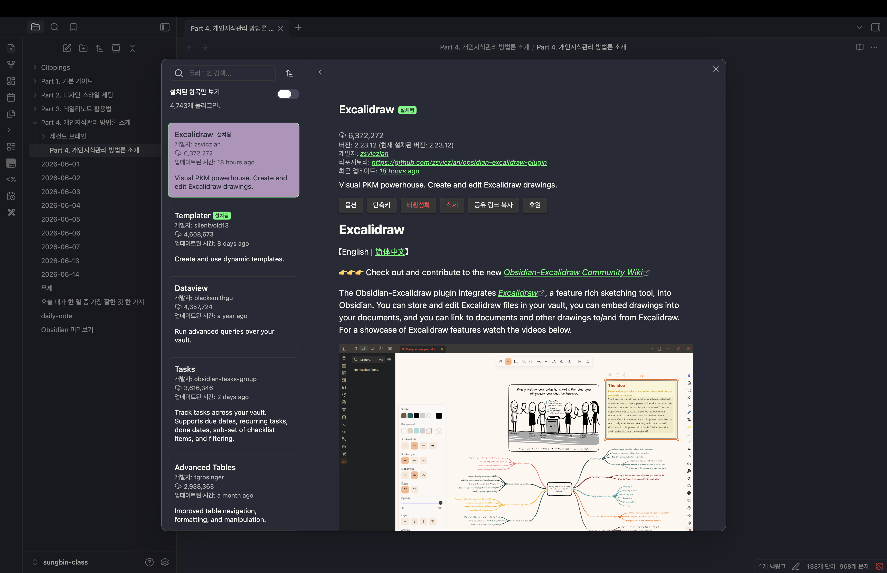

> 해당 포스팅은 [옵시디언 마스터 클래스: PKM·AI Second Brain·LLM WiKi 기초부터 실전까지](https://inf.run/ekDAP)를 참고하여 작성하였습니다.

## Part 4. 나에게 맞는 개인지식관리 방법론 찾기 & 실전 적용법

데일리노트로 매일의 기록을 쌓는 법을 익혔다면, 이제는 그 기록을 어떻게 체계적으로 관리할지 고민할 차례다. 이번 섹션에서는 개인지식관리(PKM, Personal Knowledge Management) 방법론들을 살펴보고, 그중 나에게 맞는 방식을 찾아보려고 한다.

### 개인지식관리(PKM)란

개인지식관리는 말 그대로 내 지식을 체계적으로 관리하고 활용하는 방법론이다. PKM을 검색하면 가장 많이 등장하는 것이 니클라스 루만(Niklas Luhmann) 교수의 제텔카스텐(Zettelkasten) 기법이다.

제텔카스텐은 큰 서랍장 안에 주제 중심의 노트를 분류해두고, 필요할 때 해당 노트만 꺼내 연구하거나 아웃풋을 만들어낼 때 사용하는 방식이라고 이해하면 된다.

### 대표적인 PKM 방법론과 전문가들

오늘날 활발히 활동하는 PKM 전문가 세 명과 그들의 방법론을 살펴보자. 세 사람 모두 유튜브를 운영하고 있으니, 관심이 있다면 직접 찾아봐도 좋다.

#### Tiago Forte — PARA 프레임워크

『세컨드 브레인(Second Brain)』의 저자인 티아고 포르테(Tiago Forte)는 PARA 프레임워크를 제안한다. PARA는 정보를 네 가지로 분류하는 체계다.

- **Project**: 시작과 끝이 있는 업무
- **Area**: 삶에서 꾸준히 관리해야 할 중요한 영역
- **Resource**: 지식, 참고자료, 아이디어
- **Archive**: 완료된 프로젝트나 문서

PARA는 옵시디언뿐 아니라 노션, 에버노트 등 어떤 노트 시스템에도 적용할 수 있다는 장점이 있다. 참고로 티아고 포르테의 개인지식관리는 수집·정제·아웃풋의 과정을 다루는 철학인 CODE와, 정보를 분류하는 폴더 체계인 PARA로 나뉜다.

#### Nick Milo — ACE 프레임워크

닉 마일로(Nick Milo)는 LYT(Linking Your Thinking), 즉 '생각을 연결하기'를 강조하며 모든 노트의 연결 관계를 중요하게 여긴다. 그가 제안하는 ACE 프레임워크는 세 가지로 구성된다.

- **Atlas**: 광범위한 지식 (마치 우주처럼 넓은 지식의 영역)
- **Calendar**: 시간과 관련된 노트
- **Effort**: 프로젝트성 업무

강사는 PARA 프레임워크를 5개월 이상 써봤지만 본인에게는 잘 맞지 않아 ACE 프레임워크로 전환했다고 한다. 그래서 이 ACE가 강사의 옵시디언 PKM의 근간이 된다.

#### Jolt — Visual PKM

졸트(Jolt)는 비주얼 PKM 전문가로, 화이트보드 안에서 노트와 아이디어가 유기적으로 연결되는 것을 중요하게 생각한다. 흥미롭게도 그는 옵시디언의 인기 커뮤니티 플러그인인 Excalidraw의 제작자이기도 하다. Excalidraw를 사용하면 옵시디언 안에서 화이트보드를 기반으로 생각을 정리하고, 노트를 연결하거나 임베드할 수 있다.

### 정답은 없다, 나에게 맞는 방식 찾기

이처럼 PKM 방법론은 제텔카스텐에서 PARA, ACE, 비주얼 PKM까지 다양하게 발전해왔다. 중요한 것은 어느 하나가 절대적인 정답은 아니라는 점이다. 강사도 PARA가 맞지 않아 ACE로 옮긴 것처럼, 직접 써보며 자신에게 맞는 방식을 찾아가는 과정이 필요하다.

다음 파트에서는 강사가 실제로 사용하는 ACE 프레임워크를 옵시디언에 직접 세팅하면서 더 자세히 다뤄보도록 하겠다.

## Part 5. ACE 프레임워크로 PKM 세팅

앞서 살펴본 ACE 프레임워크를 이제 옵시디언에 직접 세팅해보려고 한다. 강사가 실제로 사용하는 폴더 구조를 조금 변형한 버전을 기준으로 진행한다. 처음 설정하는 과정은 다소 까다로울 수 있지만, 한 번 잘 잡아두면 그대로 쭉 가져갈 수 있으니 천천히 하나씩 따라가 보자.

### 캘린더 / 데일리 노트 폴더

먼저 시간 기록과 관련된 모든 노트는 `캘린더(Calendar)` 폴더 아래의 `데일스(Days)` 폴더로 옮긴다. 데일리노트를 비롯한 일일 업무 관리 노트가 모두 이곳에 모이는, ACE의 시간 축에 해당하는 핵심 구조다.

### 키트 / 첨부파일 폴더

이미지, PDF, 동영상 같은 첨부파일은 `키트(Kit)` 폴더 아래의 `어테치먼트(Attachment)` 폴더에 모아 관리한다. 폴더를 옮겨도 노트와 첨부파일의 연결 관계는 그대로 유지되므로, 이미지가 깨지거나 유실될 걱정은 하지 않아도 된다.

### 아틀라스 / 비주얼 노트 폴더

지식과 관련된 시각화 정보는 `아틀라스(Atlas)` 폴더 아래의 `비주얼(Visuals)` 폴더에 저장한다. 앞서 소개한 Excalidraw 문서나 옵시디언 기본 기능인 캔버스(Canvas) 노트가 여기에 위치한다.

### 새 노트 자동 생성 위치 설정

폴더를 만들었다면, 새로 생성되는 노트가 알아서 제자리에 저장되도록 경로를 설정해주어야 한다. 이 부분이 빠지면 노트가 엉뚱한 곳에 생기기 쉽다.

- 데일리 노트의 새 파일 위치 → `캘린더/데일스`
- 첨부파일 저장 위치 → `키트/어테치먼트`

이렇게 지정해두면 노트와 파일이 종류에 맞는 폴더로 자동 분류된다.

### 키트 / 템플릿 폴더

템플릿 형식의 문서들은 `키트` 폴더 아래의 `템플릿(Templates)` 폴더에 보관한다. 그리고 데일리 노트 설정에서 템플릿 파일 위치를 이 폴더로 지정하면, 일관된 포맷으로 노트를 작성할 수 있다.

### 나머지 노트 정리

위 분류에 해당하지 않는 나머지 노트들은 `아틀라스` 폴더 아래의 `노트(Notes)` 폴더로 일괄 이동시킨다. 이렇게 하면 모든 노트가 체계적인 폴더 구조 안에 들어오게 된다.

### Excalidraw / 캔버스 폴더 설정

Excalidraw 문서와 캔버스 노트는 함께 `아틀라스/비주얼` 폴더에서 관리한다. 이때 Excalidraw 플러그인이 생성하는 스크립트 파일은 `키트` 폴더에 저장하도록 경로를 설정해 자동화해두면 깔끔하다.

### 인박스(Inbox) 폴더와 관리 전략

마지막으로 인박스(Inbox) 폴더다. 그때그때 떠오른 아이디어나 인상 깊었던 노트, 웹에서 수집한 자료는 일단 모두 이 인박스로 모은다. 웹 뷰어로 스크랩한 내용이나 크롬 확장 프로그램으로 클리핑한 자료의 저장 위치도 인박스로 지정한다.

다만 인박스는 쌓아두기만 하면 의미가 없다. 시간이 지나 다시 보면 "이걸 내가 왜 수집했지?" 싶은 것들이 꽤 많기 때문이다. 그래서 주기적으로 인박스를 점검하는데, 강사의 경우 평균적으로 약 60%는 과감히 삭제하고, 나머지 40%만 자신의 생각을 덧붙여 알맞은 폴더로 옮긴다. 이 "수집 → 정제 → 분류"의 흐름이 인박스 관리의 핵심이다.

### 마치며

이렇게 ACE 프레임워크 기반의 폴더 구조 세팅이 완료된다. 강사의 경우 이 과정을 통해 흩어져 있던 73개의 노트가 캘린더·키트·아틀라스·인박스라는 4개의 주요 폴더로 깔끔하게 정리되었다. 이 구조의 가장 큰 장점은 노트 수가 수천 개로 늘어나도 일관성이 유지된다는 점이다. 처음에만 잘 세팅해두면 그대로 오래 가져갈 수 있으니, 자신의 스타일에 맞게 조금씩 변형하며 활용해보면 되겠다.