> 해당 포스팅은 [옵시디언 마스터 클래스: PKM·AI Second Brain·LLM WiKi 기초부터 실전까지](https://inf.run/ekDAP)를 참고하여 작성하였습니다.


## Part 0. 인트로

앞선 미리보기에서 옵시디언(Obsidian)의 매력적인 기능들을 둘러봤다면, 이번 섹션부터는 본격적으로 옵시디언을 처음부터 차근차근 세팅해보려고 한다. 강사는 옵시디언을 벌써 5년 정도 사용해왔고, 그동안 자신의
직무와 삶에서 옵시디언을 어떻게 활용해왔는지 그 노하우를 최대한 쉽게 풀어 담았다고 한다. 그래서 "옵시디언을 쓰고는 있지만 뭔가 효율적으로 못 쓰는 것 같다", "조금 써보긴 했는데 어려워서 더 나아가기가 힘들다"
하는 사람들에게 특히 도움이 될 것이다.

### 보관함 생성하기

가장 먼저 할 일은 새로운 보관함(Vault)을 만드는 것이다. 보관함은 옵시디언이 노트를 저장하고 관리하는 공간으로, 이번 강의는 처음부터 깔끔하게 시작하기 위해 새 보관함을 하나 만들어 진행한다.

옵시디언을 처음 설치했다면 실행 시 기본 생성 화면이 바로 뜬다. 이미 옵시디언을 쓰고 있는 경우에는 왼쪽 아래에 있는 현재 보관함 이름을 클릭한 뒤, '보관함 관리하기' 메뉴에서 새로운 보관함을 생성할 수 있다.

강의에서는 보관함 이름을 'sungbin class'로 지정하고 편의상 바탕화면에 위치를 잡지만, 실제로 따라 할 때는 본인이 실제로 사용할 폴더 위치에 지정해두면 된다.

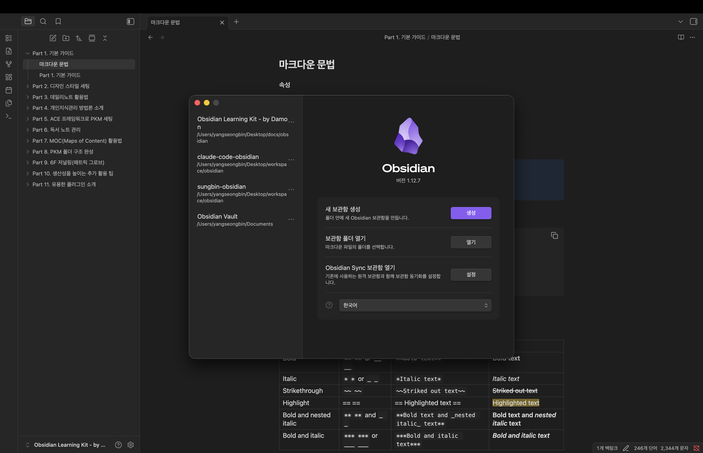

### 테마 설정하기

새 보관함을 만들면 '환영합니다' 페이지가 나타난다. 이 화면은 사용 중인 디바이스의 테마 환경을 따라 다크 모드 또는 라이트 모드로 보일 수 있다.

강사는 강의를 진행해보니 아무래도 다크 모드가 가독성이 조금 더 좋아서, 다크 모드로 세팅해두고 시작한다. 테마는 `설정(Settings) → 외형(Appearance) → 테마(Theme)`에서 '시스템 테마'가
아닌 '다크 테마'로 변경하면 된다. 물론 이 부분은 취향이니, 본인에게 더 편한 쪽으로 골라도 무방하다.

## Part 1. 기본 가이드

이제 본격적으로 옵시디언(Obsidian)의 기본 기능들을 하나씩 살펴보려고 한다. 생산성을 높이는 기록 습관을 만들기 위해 알아두면 좋은 핵심 기능들을 차례대로 짚어보자.

### 로컬 저장과 실시간 반영

먼저 옵시디언의 가장 큰 특징은 모든 노트가 로컬 디바이스에 저장된다는 점이다. 그렇기 때문에 인터넷이 연결되지 않아도 노트를 작성할 수 있고, 문서가 아무리 많아져도 속도가 굉장히 빠르며 보안 면에서도 강점이
있다.

또한 노트가 실제 파일로 저장되기 때문에 파일 탐색기(Finder)와도 자연스럽게 연동된다. 옵시디언에서 노트 이름을 바꾸거나 새 노트를 추가하면 파일 탐색기에도 실시간으로 반영되고, 반대로 파일 탐색기에서 바꾼
내용도 옵시디언에 그대로 나타난다.

### 그래프 뷰와 내부 링크

옵시디언에는 그래프 뷰(Graph View)라는 기능이 있다. 보관함에 있는 모든 노트를 시각적으로 보여주면서, 노트끼리 어떻게 연결되어 있는지 그 관계를 한눈에 표시해준다.

노트를 연결할 때는 내부 링크를 사용하는데, 대괄호 두 개(`[[ ]]`) 안에 노트 이름을 적으면 해당 노트로 이어지는 링크가 만들어진다. 여기서 재미있는 점은, 한쪽에서만 링크를 걸어도 양방향 링크가 자동으로
완성된다는 것이다. 덕분에 나중에 노트들을 서로 오가거나 조합해서 볼 때 매우 유용하다.

### 마크다운 문법으로 작성하기

옵시디언은 마크다운(Markdown) 문법을 지원한다. `#`으로 제목을 만들고, `**`로 볼드 처리를 하고, `- `로 리스트를 만드는 등 간단한 문법만으로 서식을 적용할 수 있다.

마크다운을 쓰는 가장 큰 장점은 호환성이다. 대부분의 노트 툴이 마크다운을 지원하기 때문에, 혹시 나중에 옵시디언을 더 이상 쓰지 않게 되더라도 다른 노트 툴로 쉽게 옮길 수 있고, 옮긴 뒤에도 서식이 깨지지 않고
그대로 유지된다. 블로그 초안을 잡을 때 활용하기에도 좋다.

### 웹 뷰어로 브라우저 통합하기

웹 뷰어(Web View)는 옵시디언 안에서 웹 브라우저를 실행할 수 있게 해주는 기능이다. 코어 플러그인에서 활성화한 뒤 노트에 있는 링크를 클릭하거나 명령어 팔레트(Command Palette, `Cmd-P`)를
이용하면 웹 페이지를 옵시디언 안에서 바로 열 수 있고, 그 내용을 스크랩할 수도 있다.

여기에 더해 크롬 확장 프로그램인 Obsidian Web Clipper를 사용하면, 웹 서핑 중에 마음에 드는 콘텐츠를 손쉽게 옵시디언으로 저장할 수 있다.

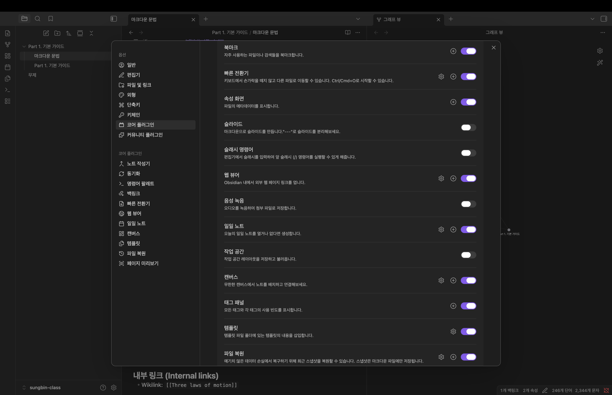

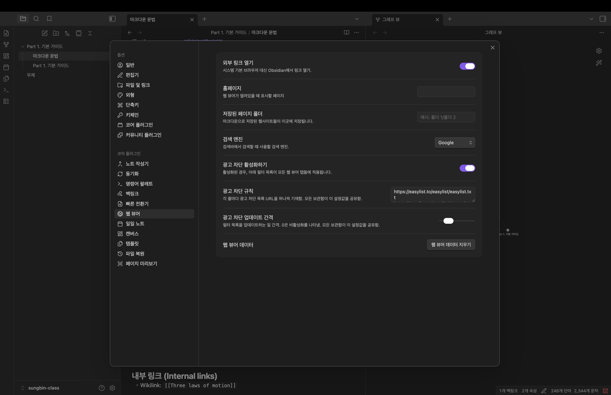

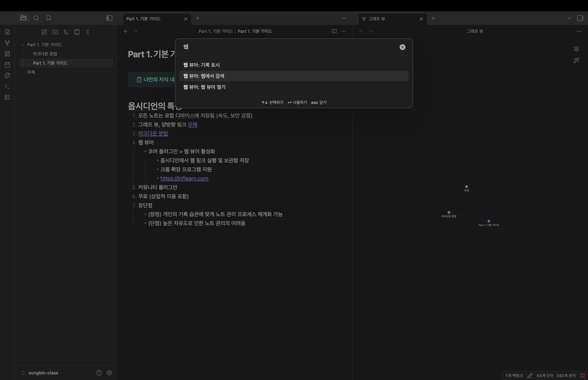

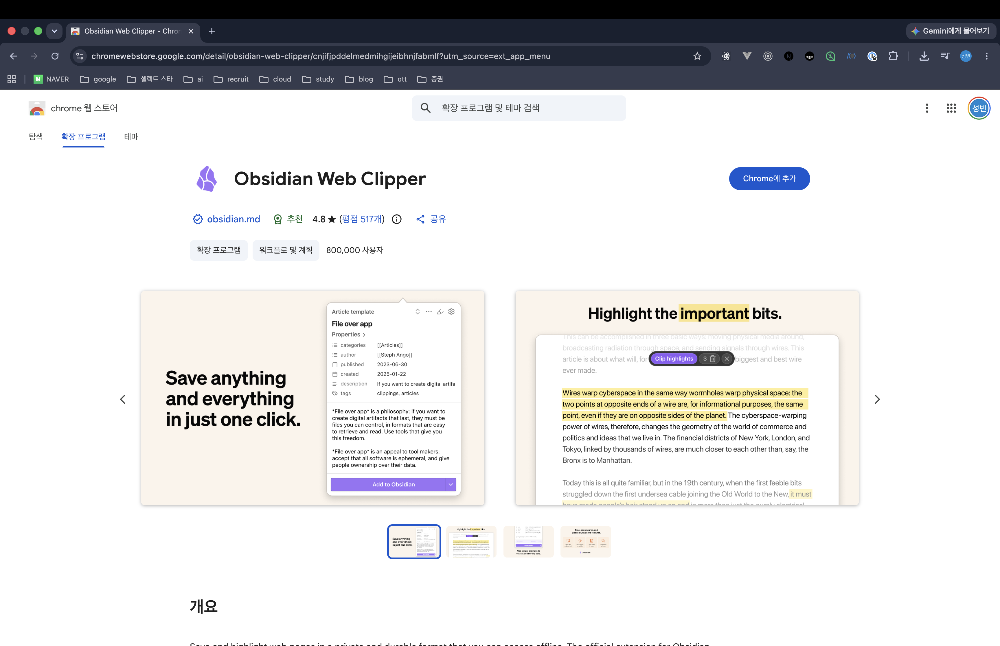

### 커뮤니티 플러그인으로 기능 확장

옵시디언의 또 다른 강력한 점은 커뮤니티 플러그인(Community Plugin)이다. 사용자들이 직접 만들어 공유하는 플러그인으로, 이를 통해 옵시디언의 기능을 거의 무한히 확장할 수 있다. 크롬 확장 프로그램을
떠올리면 이해하기 쉽다. 앞서 소개한 Excalidraw나 데이터뷰(Dataview) 등 다양한 플러그인이 있으며, 이 점이 다른 노트 툴과 크게 차별화되는 부분이다.

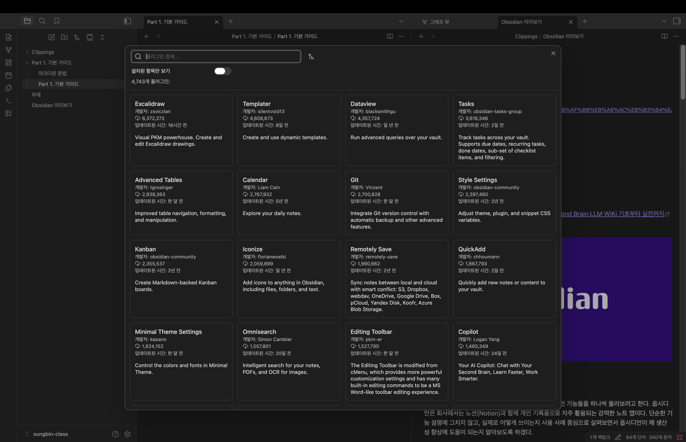

### 무료 사용과 높은 자유도, 그리고 관리의 중요성

옵시디언은 개인이든 회사든 모두 무료로 사용할 수 있다는 점도 큰 장점이다. 그리고 자유도가 굉장히 높아서 개인의 기록 습관에 맞게 노트 시스템을 마음껏 개인화하고 체계화할 수 있다.

다만 이 높은 자유도는 양날의 검이기도 하다. 노트가 많아지는데 체계가 제대로 잡혀 있지 않으면, 그때부터 노트들이 서로 꼬이기 시작한다. 그래서 옵시디언을 잘 쓰려면 효율적인 관리법을 익히는 것이 중요하다. 이
부분은 앞으로의 강의에서 차근차근 다뤄볼 예정이다. 다음 파트에서는 유용한 플러그인들을 소개하도록 하겠다.

## Part 2. 디자인 스타일 세팅

옵시디언(Obsidian)은 노션이나 구글 문서와 달리, 디자인 스타일을 본인의 입맛에 맞게 굉장히 다양하게 수정할 수 있다는 큰 장점이 있다. 다만 자기에게 딱 맞게 세팅하기까지는 적지 않은 노력이 필요하다. 그래서 이번 파트에서는 조금 더 쉽게 설정하는 방법들과, 사람들이 많이 쓰는 테마, 그리고 강사가 실제로 사용하는 테마 설정까지 함께 세팅해보려고 한다.

### 테마 설치하고 적용하기

기본 테마에서 다른 테마로 바꾸고 싶다면 `설정(Settings) → 외형(Appearance) → 테마 관리`를 클릭한다. 그러면 사람들이 만들어 놓은 다양한 테마가 나오는데, 원하는 것을 클릭해 바로 설치하고 적용할 수 있다.

대표적인 테마로는 미니멀(Minimal) 테마와 안오프친(AnuPpuccin) 테마가 있고, 강사가 오랫동안 사용해온 보더(Border) 테마도 있다. 누군가가 잘 만들어둔 세팅을 그대로 가져와 적용하는 방식이라, 손쉽게 분위기를 바꿀 수 있다.

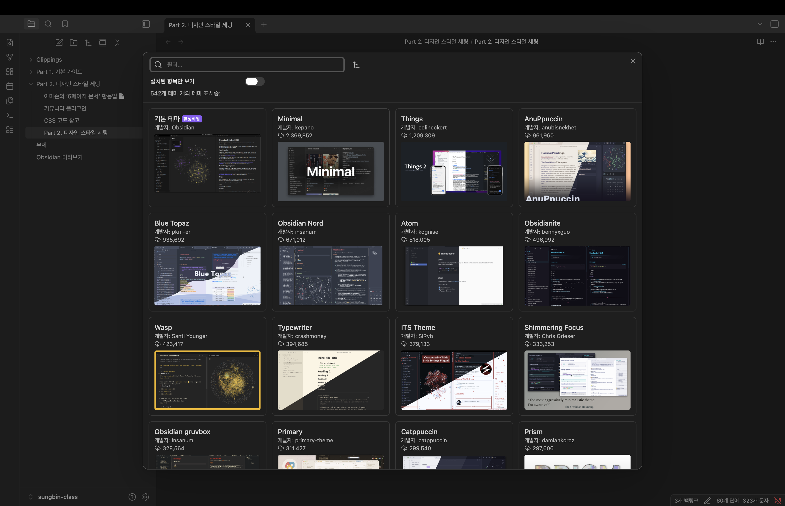

### 한국어 가독성 문제 다듬기

다만 한 가지 주의할 점이 있다. 이렇게 설치한 테마들은 대부분 영어를 기준으로 세팅되어 있다. 그래서 한국어 환경에서는 행간이나 글자 크기가 애매하게 잡혀 가독성이 떨어지는 경우가 종종 있다. 이럴 때는 행간과 글자 크기 등을 우리 환경에 맞게 조금 손봐서 더 읽기 좋게 다듬어주어야 한다.

### Style Settings 플러그인으로 커스터마이징

테마를 설치한 뒤 더 입맛에 맞게 다듬고 싶다면 Style Settings 플러그인을 사용하면 된다. 이 플러그인은 비개발자도 CSS 코드를 직접 건드리지 않고, 몇 번의 클릭만으로 디자인 서식을 바꿀 수 있도록 UI로 만들어 놓은 것이다.

여기서 꼭 이해하고 넘어가야 할 점은, Style Settings는 테마별로 지원하는 기능이 다르다는 것이다. 예를 들어 안오프친 테마에서는 사람들이 좋아하는 기능 중 하나로, 폴더 색상을 무지개처럼 입히는 레인보우 스타일을 설정할 수 있다.

보더 테마를 쓰는 경우에는 배경색을 좀 더 밝은 톤으로 바꾸거나, 마크다운 볼드 텍스트의 강렬한 빨간색이 눈에 부담스러울 때 색상을 조정해 가독성을 높일 수 있다. 배경색은 `설정 → 외형(Appearance)`의 다크 모드 설정에서, 볼드 텍스트 색상은 `설정 → 편집기(Editor)`의 텍스트 설정에서 `bold text color` 값을 수정하면 된다.

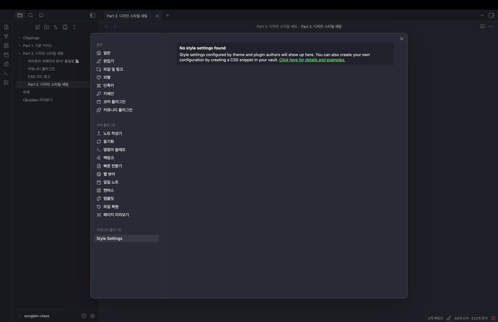

### CSS Snippet으로 한 단계 더 손보기

Style Settings로 해결되지 않는 부분도 있다. 예를 들어 행간을 더 넓히는 기능은 Style Settings에서 지원하지 않아 CSS를 직접 수정해야 한다. 이때는 CSS Snippet 플러그인을 설치하면 옵시디언 안에서 바로 CSS를 손볼 수 있다.

`Create CSS Snippet` 명령으로 `snippet.css` 파일을 만들고, 여기에 원하는 CSS 코드를 붙여넣어 제목(H1~H6)의 줄 간격, 텍스트 행간, 임베드 영역 디자인, 체크박스 스타일 등을 수정할 수 있다. 특히 체크박스는 기본적으로 완료 시 취소선(strike)이 그어져 텍스트를 읽기 어려워지는데, 완료해도 취소선이 표시되지 않도록 서식을 지정해두면 한결 보기 편해진다.

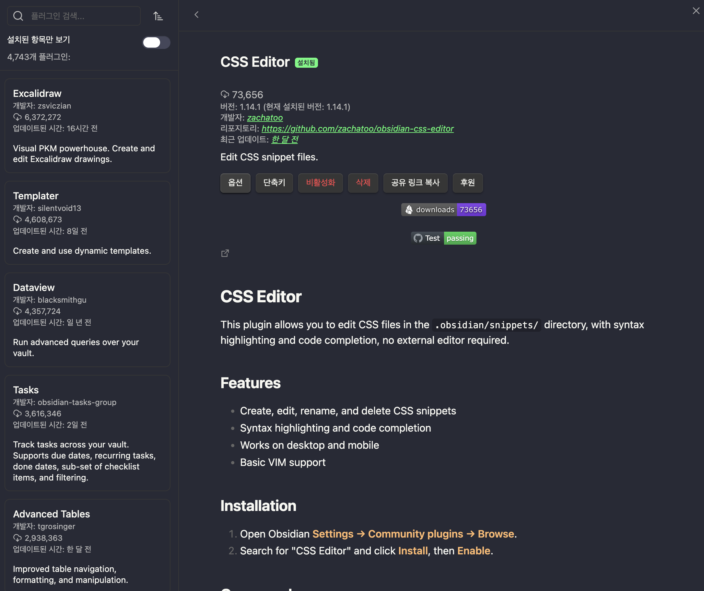

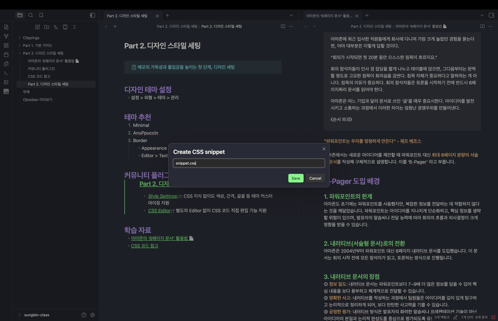

```css
/* H1~H6 행간 설정  */
.cm-header-1 {
    line-height: 2.0;
}
.cm-header-2 {
    line-height: 2.0;
}
.cm-header-3 {
    line-height: 2.0;
}
.cm-header-4 {
    line-height: 1.8;
}
.cm-header-5 {
    line-height: 1.8;
}
.cm-header-6 {
    line-height: 1.8;
} 

/* 텍스트 행간 설정 */
.cm-contentContainer { 
    line-height: 1.8;
} 

/* embed 영역 디자인 설정 */
.markdown-embed { 
    border: 1px solid #E7E5E4;
    border-radius: 5px;
    margin: 0;
    padding: 10px;
} 

/* 체크박스 스트라이크 제거 */
.markdown-source-view.mod-cm6 .HyperMD-task-line[data-task]:not([data-task=" "]) {
    text-decoration:none;
    color: var(--checklist-done-color); 
} 
```

### 개발자 도구로 실시간 수정하기

CSS에 익숙하거나 코드 레벨에서 직접 다루고 싶다면, 개발자 도구(`Command-Option-I`)를 활용할 수도 있다. 수정하고 싶은 영역을 선택해 해당 클래스를 확인하고, 스타일을 실시간으로 적용해보며 다듬는 방식이다.

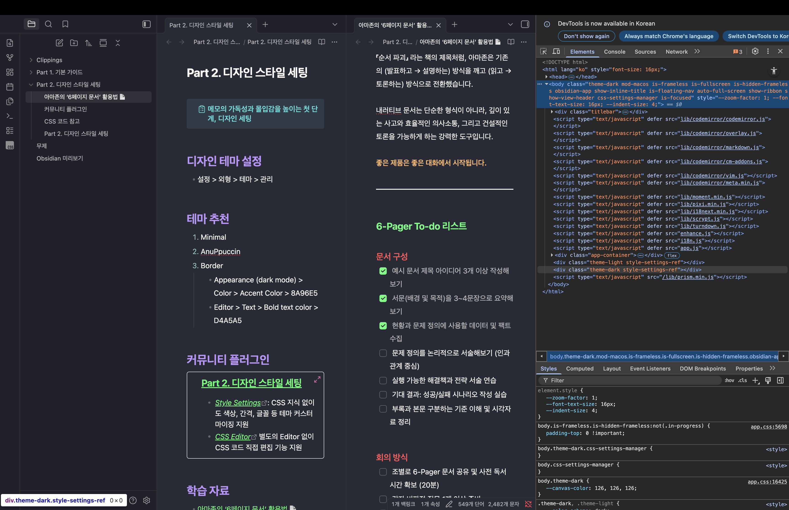

### 마치며

정리하면 옵시디언의 디자인은 ① 사용자들이 만들어둔 테마를 설치하거나, ② Style Settings 플러그인으로 UI 기반으로 커스텀하거나, ③ CSS를 직접 수정하는 방식으로 자유롭게 바꿀 수 있다. 어떤 사람들은 거의 게임 화면처럼 화려하게 꾸며 쓰기도 하지만, 강사는 딱 본인에게 맞는 정도로만 세팅해 사용한다고 한다. 정답이 있는 영역은 아니니, 각자 취향에 맞게 세팅해서 쓰면 되겠다.

