> 해당 포스팅은 [옵시디언 마스터 클래스: PKM·AI Second Brain·LLM WiKi 기초부터 실전까지](https://inf.run/ekDAP)를 참고하여 작성하였습니다.

## Part 3-1. 데일리노트로 시작하는 하루 기록 루틴

이번 섹션부터는 데일리노트(Daily Note) 활용법을 본격적으로 다뤄보려고 한다. 데일리노트는 저널링이라고도 불리는데, 한마디로 매일매일의 기록을 차곡차곡 쌓아가는 노트 기록 방식이다.

### 데일리노트란 무엇인가

일반적인 노트는 어떤 주제가 떠오르면 그 주제별로 기록을 남긴다. 반면 데일리노트는 오늘, 어제, 내일처럼 하루의 일과를 중심으로 기록을 쌓아간다. 즉 "무엇에 대한 노트인가"가 아니라 "언제의 노트인가"를 기준으로 삼는 것이다.

옵시디언(Obsidian)은 이런 데일리노트를 잘 쌓을 수 있도록 다양한 기능을 지원한다. 강사 역시 5년간 매일 기록을 이어오고 있다고 하니, 한번 그 방식을 따라가 보자.

### 데일리노트 활성화 및 자동 열기 설정

가장 먼저 `설정(Settings) → 코어 플러그인(Core plugins)`에서 데일리노트를 활성화해야 한다. 그리고 '앱 시작 시 Daily Note 열기' 기능을 켜두면, 옵시디언을 실행할 때마다 오늘 날짜의 노트가 자동으로 열린다.

이렇게 세팅해 두는 것만으로도 매일의 기록을 쌓아 나갈 기본적인 준비가 끝난 셈이다.

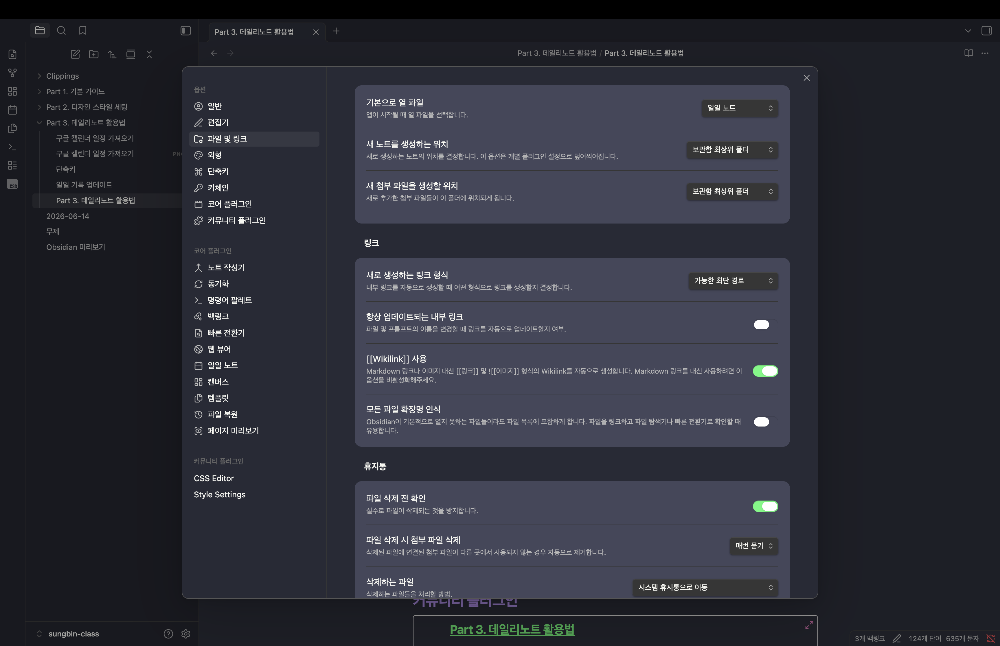

### 캘린더 플러그인 활용하기

여기에 캘린더(Calendar) 플러그인을 설치하면, 오른쪽 사이드바에 캘린더 아이콘이 생긴다. 이 캘린더를 통해 날짜 기반으로 노트를 생성하고 관리할 수 있다.

캘린더에서 날짜에 점이 찍혀 있으면 그날 노트가 작성되어 있다는 뜻이고, 기록한 텍스트가 길어질수록 점의 개수가 늘어난다. 그래서 달력만 봐도 어느 날 얼마나 기록했는지 한눈에 가늠할 수 있다.

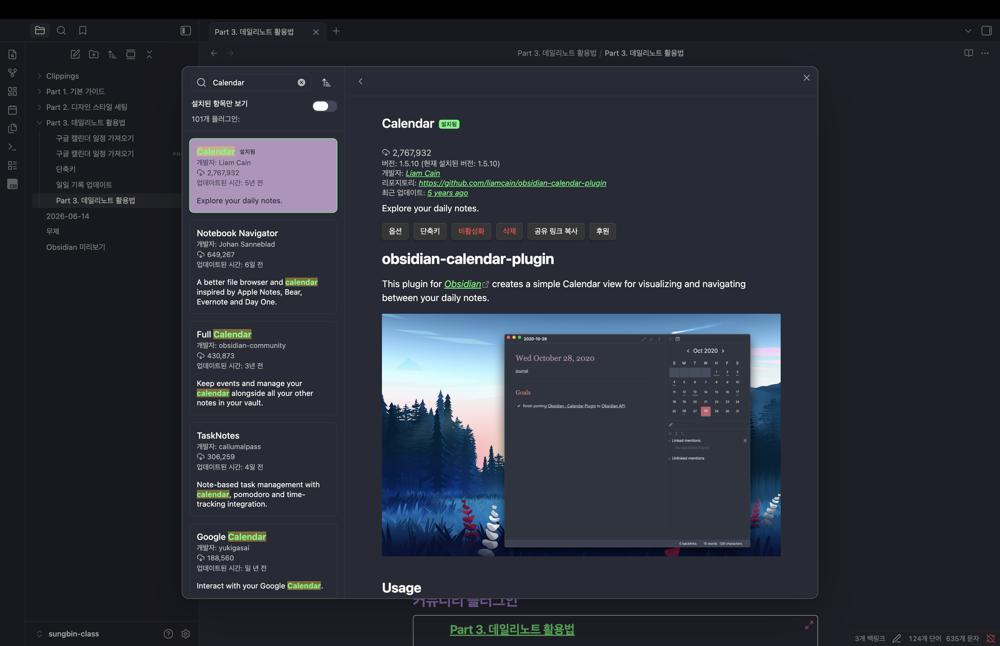

### 일관된 포맷으로 작성하기

데일리노트를 쓸 때는 일관된 포맷을 유지하는 것이 중요하다. 강사는 다음과 같은 구조로 작성한다.

- **맨 위 (Company)**: 회사 업무와 관련된 기록
- **중간 (Personal)**: 개인적인 기록
- **맨 아래 (Journaling)**: 하루를 마감하며 남기는 회고 기록

특히 회고 기록은 "오늘 한 일 중 가장 잘한 것은?", "아쉬웠던 것은?", "내일 개선할 행동은?" 같은 질문으로 구성한다. 매일 같은 틀로 기록하면 나중에 다시 볼 때 비교하기도 좋고, 기록 자체에 일관성이 생긴다.

### 템플릿으로 포맷 자동화하기

매번 이 구조를 손으로 적는 것은 번거롭다. 그래서 템플릿 기능을 활용한다. 새 파일을 만들어 '데일리노트'라는 제목으로 Company, Personal, Journaling 섹션과 회고 질문을 미리 적어 템플릿을 하나 만들어둔다.

그다음 `설정 → 일일 노트(Daily notes)`에서 템플릿 파일 위치를 방금 만든 노트로 지정한다. 이렇게 해두면 데일리노트가 새로 생성될 때마다 이 포맷을 자동으로 불러와, 항상 원하는 형태로 시작할 수 있다.

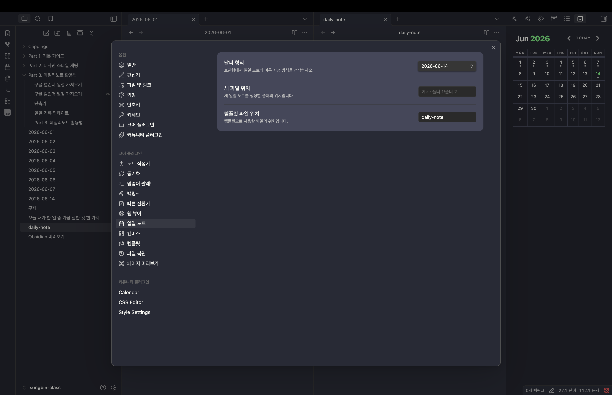

### 주차별 기록 설정하기

하루 단위뿐 아니라 주(週) 단위로도 기록을 남기고 싶다면, 캘린더 플러그인 설정에서 'Show Week Number'를 활성화하면 된다. 그러면 캘린더에 주차가 표시되고, 주차를 클릭해 해당 주의 노트를 생성할 수 있다.

예를 들어 한 주가 마감될 때 해당 주차 노트에 간단한 회고를 적어두는 식으로, 개인의 취향에 맞게 활용하면 된다.

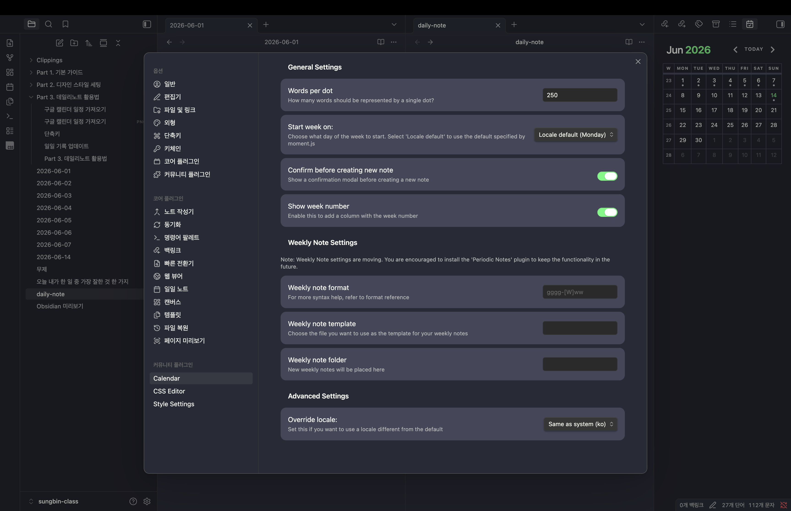

### 마치며

지금까지 데일리노트의 기본 설정(활성화·자동 열기)부터 캘린더 플러그인을 활용한 날짜·주차별 기록, 그리고 템플릿을 통한 일관된 포맷 구축까지 살펴보았다. 이렇게 한 번 세팅해두면, 옵시디언을 켜는 것만으로 매일의 기록을 효과적으로 쌓아 나갈 수 있다. 다음 파트에서는 데일리노트를 더 잘 활용하는 방법들을 이어서 다뤄보도록 하겠다.

## Part 3-2. 개인부터 업무까지, To-Do 리스트 완벽 관리법

데일리노트의 기본 틀을 잡았다면, 이번에는 그 안에서 To-Do 리스트를 효율적으로 관리하는 방법을 알아보려고 한다. 개인 일정부터 업무까지, 할 일을 빠짐없이 챙기는 것이 결국 생산성의 핵심이기 때문이다.

### To-Do 리스트 기본 사용법

To-Do 리스트는 데일리노트 안에 그대로 기록하면 된다. 마크다운 서식을 활용하면 간단히 체크박스를 만들 수 있는데, 불릿 리스트를 만드는 대시(`-`)에 이어 대괄호(`[ ]`)를 붙이면 체크박스로 바뀐다. 그리고 대괄호 안에 `x`를 넣으면(`[x]`) 완료 표시가 된다.

### 단축키로 빠르게 입력하기

매번 대시와 대괄호를 직접 입력하는 것은 번거롭다. 이럴 때는 단축키를 쓰면 편하다. 맥(Mac) 환경에서는 리스트 위에서 `Command + L`을 누르면 체크박스가 생성되고, 한 번 더 누르면 체크 완료 표시로 전환된다. 다시 누르면 일반 불릿 리스트로 되돌아간다. 키 하나로 "할 일 → 완료 → 일반 항목"을 오갈 수 있어 입력이 한결 빨라진다.

### 구글 캘린더 일정 연동하기 (ICS 플러그인)

구글 캘린더(Google Calendar)에 일정을 잘 정리해두는 사람이라면, 그 일정을 옵시디언으로 그대로 당겨올 수 있다. 이때 사용하는 것이 ICS 플러그인이다.

커뮤니티 플러그인에서 'ICS'를 검색해 설치한 뒤, 구글 캘린더의 **비공개(secret) iCal 주소**를 복사해 플러그인 옵션에 등록한다. iCal은 캘린더 일정을 외부 서비스와 공유하기 위한 표준 형식인데, 개인정보 보호를 위해 공개 주소가 아닌 비공개 주소를 사용하는 것을 권한다.

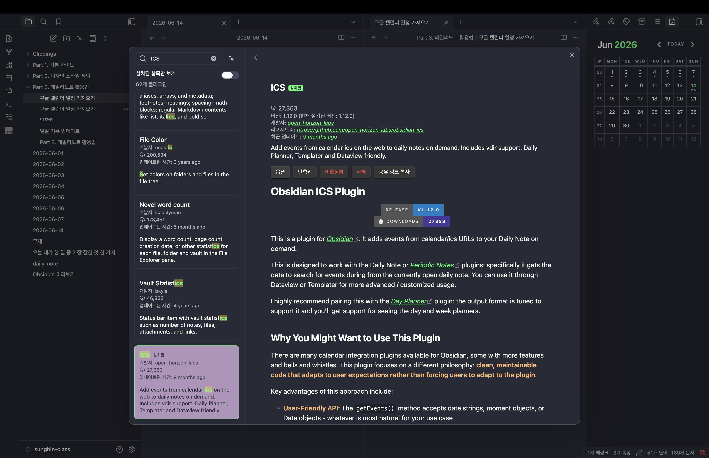

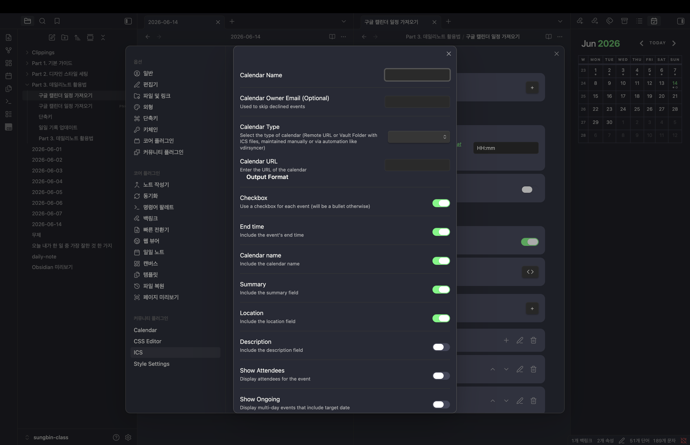

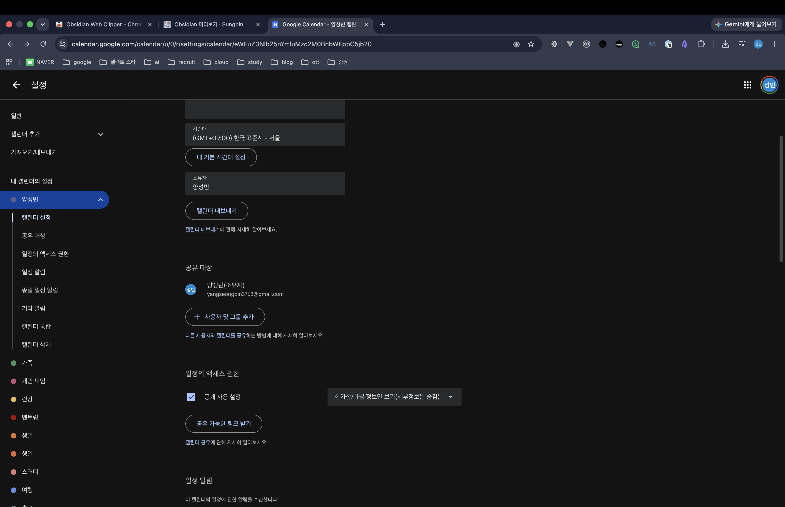

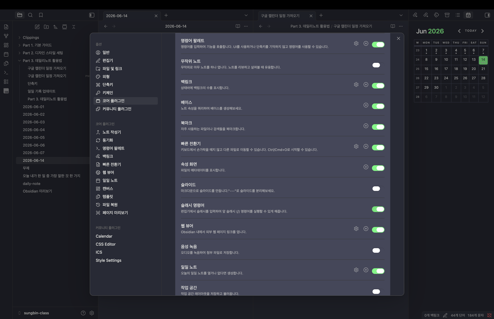

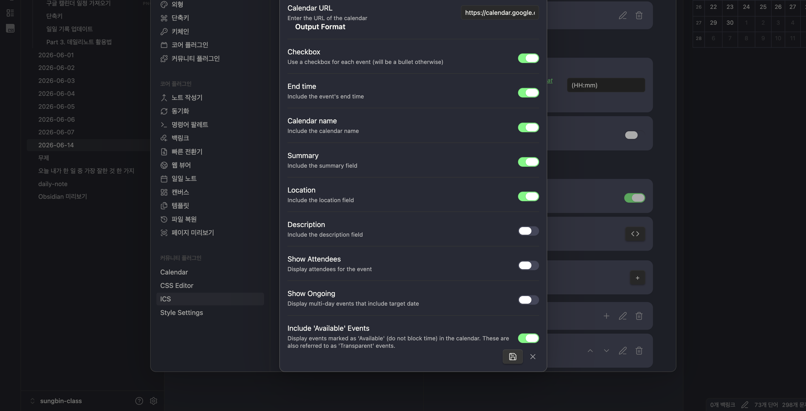

### ICS 명령어와 설정 최적화

연동을 마쳤다면, 먼저 옵시디언에서 슬래시 명령어를 활성화한다. 그다음 `Import Event` 명령어를 실행하면 오늘 날짜를 기준으로 구글 캘린더의 해당 일정을 불러온다. 노션의 슬래시 명령어와 비슷하다고 생각하면 이해하기 쉽다.

여기서 취향에 맞게 설정을 다듬을 수도 있다. 예를 들어 `End time` 설정을 꺼두면 종료 시간 없이 시작 시간만 가져오고, 시간을 괄호로 묶어 표시하는 등 자신에게 편한 형태로 개인화할 수 있다.

### 실시간으로 일정 관리하기

강사는 일정을 다음과 같이 유연하게 관리한다. 아침에 하루를 시작할 때는 일단 예측 일정을 넣어두고, 하루를 보내면서 실제로 수행한 시간에 맞춰 내용을 다시 정리한다. 만약 일정이 밀리면 해당 항목을 잘라내 다음 날짜로 옮긴다. 이렇게 하면 빠뜨리는 일정을 최소화하면서, 동시에 "계획"이 아닌 "실제 기록"이 노트에 남게 된다.

### 일과 마무리와 회고

하루를 마무리할 때는 데일리노트 회고 섹션을 활용한다. '가장 잘한 일', '아쉬웠던 일', '내일 개선할 점' 같은 기본 질문에 답을 적어두는 것이다. 이렇게 같은 포맷으로 꾸준히 기록하면 노트가 일관되게 쌓여, 시간이 지나도 장기적인 기록 관리가 가능해진다.

### 마치며

지금까지 마크다운과 단축키를 활용한 To-Do 리스트 관리부터, ICS 플러그인을 통한 구글 캘린더 연동, 그리고 실시간 일정 관리와 회고까지 살펴보았다. 데일리노트 하나에 할 일과 일정, 회고를 모두 담아두면, 개인 업무와 회사 업무를 따로 관리할 필요 없이 한곳에서 깔끔하게 챙길 수 있다.

## Part 3-3. 데일리노트 생산성 2배 늘리기 & 효과적인 일일 회고 팁

데일리노트를 꾸준히 쓰다 보면, 조금 더 편하게 기록하고 싶은 욕심이 생긴다. 이번에는 데일리노트 작성과 회고의 생산성을 한층 끌어올려 주는 플러그인들과, 쌓인 기록을 AI와 연계해 활용하는 방법을 알아보려고 한다.

### Templater로 어떤 노트든 템플릿처럼

앞서 템플릿 기능을 설정해뒀지만, 템플릿 파일을 따로 만들어두지 않은 노트는 불러올 수 없다. 이럴 때 Templater 플러그인이 유용하다.

Templater를 설치하고 활성화하면, 별도의 템플릿 파일이 아니어도 내가 만들어 둔 모든 노트를 템플릿처럼 가져다 쓸 수 있다. `openInsertTemplateModal` 명령을 실행하고 원하는 페이지를 고르면, 그 내용이 현재 노트에 그대로 삽입된다. (노트가 너무 많아질 경우 템플릿 노트를 효율적으로 정리하는 방법은 뒤에서 다시 다룬다.)

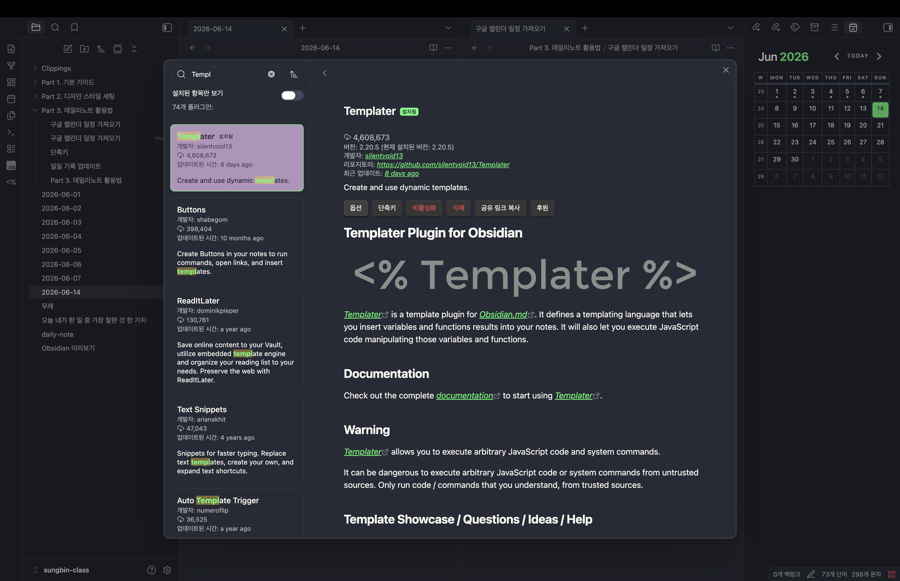

### Outliner로 항목 순서 자유자재로

데일리노트에 일정이나 할 일을 많이 적다 보면, 항목의 위아래 순서를 바꾸고 싶을 때가 많다. 기본 상태에서는 잘라내서 다시 붙여넣어야 해서 번거로운데, Outliner 플러그인을 설치하면 이 작업이 훨씬 쉬워진다.

드래그 앤 드롭으로 옮기는 것은 물론, 단축키(`Shift + Tab`으로 들여쓰기 조정, `Command + Shift + 위/아래`로 항목 이동)로 순서를 빠르게 바꿀 수 있다. 또한 `Command`를 누른 채 클릭하면 항목을 접거나 펼칠 수 있어, 긴 노트의 가독성도 좋아진다.

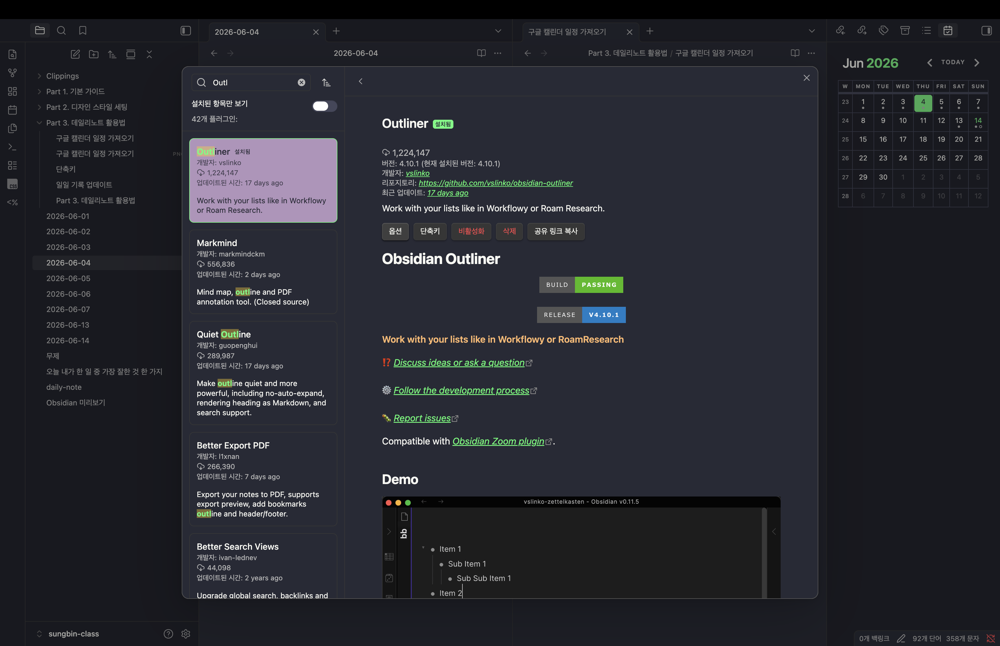

### 회고와 AI 활용

데일리노트의 진가는 회고에서 드러난다. 매일 쌓인 데일리노트를 일요일쯤 한 번 검토하면, 한 주 동안 무슨 일이 있었는지 돌아보고 인상 깊었던 이벤트를 모아 글쓰기 소재로 활용할 수 있다. 그래서 데일리노트 기록은 그 자체로 중요한 글감의 원천이 된다.

다만 회고를 매번 직접 정리하는 것은 번거롭다. 이때 AI 툴과 연계하면 좋다. 한 주치 데일리노트 기록을 AI에게 주고 KPT(Keep·Problem·Try) 방식으로 요약해달라고 한 뒤, 그 결과를 옵시디언의 주간 노트에 붙여넣으면 데일리노트를 바탕으로 한 주간 기록을 손쉽게 남길 수 있다.

### AI 시대, 개인 기록의 가치

강사는 여기서 한 가지 중요한 관점을 덧붙인다. 시대가 AI 중심으로 바뀌면서 대부분의 지식은 AI가 가장 잘 알게 될 수밖에 없다. 하지만 AI가 결코 가질 수 없는 것이 있는데, 바로 나 자신의 고유한 경험이다.

데일리노트에 꾸준히 기록을 쌓아두면, 훗날 AI와 대화하거나 여러 서비스를 활용할 때 내 경험을 바탕으로 훨씬 깊이 있는 상호작용을 할 수 있다. 그래서 앞으로는 개인의 기록이 점점 더 값진 자산이 될 것이다.

### Journal Review로 과거 돌아보기

마지막으로 Journal Review 플러그인을 소개한다. 사진첩에서 '1년 전 오늘', '2년 전 오늘'을 보여주는 기능을 떠올리면 이해하기 쉬운데, 바로 그 역할을 하는 플러그인이다.

리마인드 주기를 한 달 전, 6개월 전, 1년 전 등으로 설정해두면 과거의 오늘 있었던 일을 다시 꺼내볼 수 있다. 그때의 생각과 지금의 생각이 어떻게 달라졌는지 추적하고 관찰하는 재미가 쏠쏠하다. 물론 이 플러그인은 매일 충분한 기록이 쌓여 있어야 그 가치가 제대로 발휘된다. 주 단위로 주기를 바꿔 특정 날짜의 노트를 바로 확인하는 것도 가능하다.

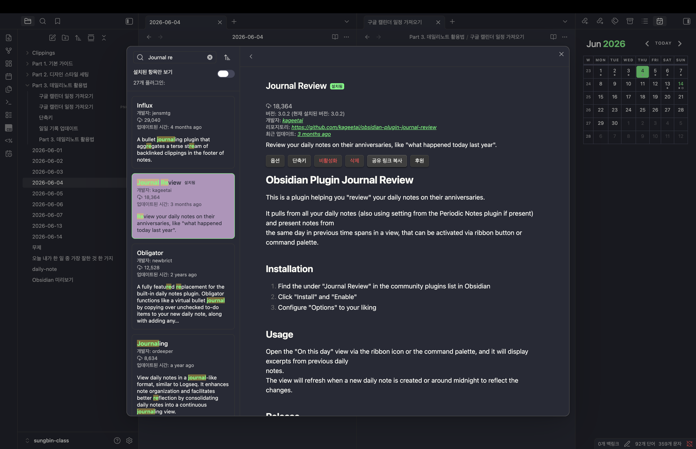

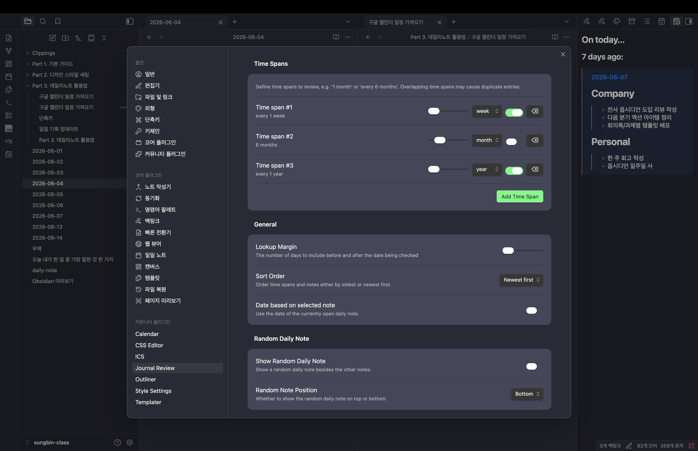

### 마치며

지금까지 Templater와 Outliner로 데일리노트 작성 자체를 편하게 만들고, AI 연계로 회고를 자동화하며, Journal Review로 과거 기록을 되살리는 방법까지 살펴보았다. 결국 이 모든 도구의 출발점은 매일 쌓아가는 나의 기록이다. 꾸준한 기록 위에 이런 플러그인과 AI를 얹으면, 데일리노트의 생산성은 자연스럽게 배가된다.

## Part 3-4. 빠른 기록을 위한 단축키 설정

데일리노트를 빠르게 기록하려면 결국 손이 키보드를 떠나지 않는 것이 중요하다. 그런데 옵시디언(Obsidian)은 기본적으로 최소한의 단축키만 세팅되어 있어서, 제대로 활용하려면 직접 단축키를 설정해주어야 한다. 이번에는 빠른 기록에 도움이 되는 단축키들을 하나씩 세팅해보자.

단축키는 모두 `설정(Settings) → 단축키(Hotkeys)`에서 기능을 검색해 원하는 키 조합으로 지정할 수 있다. 아래 제시하는 조합은 맥(Mac) 기준 예시이니, 본인에게 편한 방식으로 바꿔 써도 된다.

### 일일 노트 이동

먼저 오늘·내일·어제 노트로 빠르게 오갈 수 있는 단축키다. 단축키 설정에서 '일일 노트'를 검색해 지정한다.

- 오늘 노트: `Ctrl + Shift + D`
- 내일 노트: `Ctrl + Shift + .`
- 어제 노트: `Ctrl + Shift + ,`

이 단축키의 좋은 점은, 중간에 비어 있는 날짜가 있으면 그 날짜는 건너뛰고 이동한다는 것이다. 덕분에 기록이 있는 날들만 자유롭게 넘나들 수 있다.

### 사이드바 열고 닫기

화면이 작을 때 특히 자주 쓰게 되는 사이드바 토글이다. '사이드바'를 검색해 지정한다.

- 왼쪽 사이드바: `Command + Shift + [`
- 오른쪽 사이드바: `Command + Shift + ]`

사이드바를 단축키로 여닫으면 필요할 때만 펼쳐 화면 공간을 효율적으로 쓸 수 있다.

### 제목 수준 변경

앞서 `#`을 직접 입력해 제목을 만들었는데, 이것도 단축키로 처리하면 편하다. '제목'을 검색해 지정한다.

- H1 ~ H6: `Command + Option + 1` 부터 `Command + Option + 6` 까지 순서대로

숫자만 바꿔주면 제목 수준을 바로바로 바꿀 수 있다.

### 브라우저처럼 뒤로/앞으로 가기

옵시디언 안에서도 브라우저처럼 이전·다음 페이지로 이동할 수 있다. '뒤로 가기', '앞으로 가기'를 검색해 지정한다.

- 뒤로 가기: `Command + [`
- 앞으로 가기: `Command + ]`

노트를 이리저리 오가며 탐색할 때 페이지 이동이 한결 매끄러워진다.

### 파일을 다른 폴더로 이동

파일이 많아지고 폴더 구조가 복잡해지면, 드래그 앤 드롭으로 일일이 옮기기가 번거롭다. 보통은 '⋯' 메뉴에서 '파일을 다음 위치로 이동'을 눌러 폴더를 선택하는데, 이 기능에 단축키를 걸어두면 훨씬 빠르다.

- 파일을 다음 위치로 이동: `Command + Shift + M`

### 마치며

지금까지 일일 노트 이동, 사이드바 토글, 제목 수준 변경, 뒤로·앞으로 가기, 파일 이동까지 빠른 기록에 도움이 되는 단축키들을 살펴보았다. 옵시디언은 단축키 설정의 자유도가 높은 만큼, 자주 쓰는 기능부터 하나씩 자신에게 맞는 키로 지정해두면 기록 속도가 눈에 띄게 빨라질 것이다.

