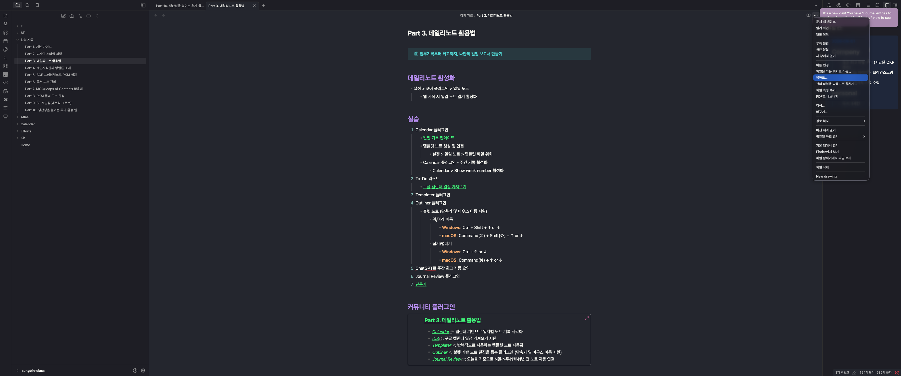
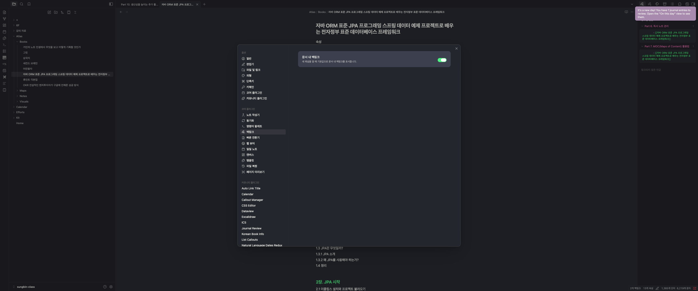
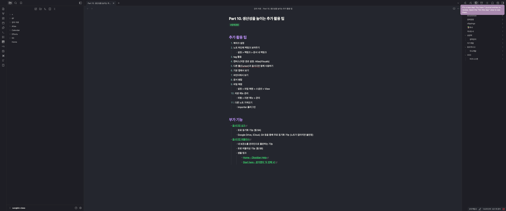
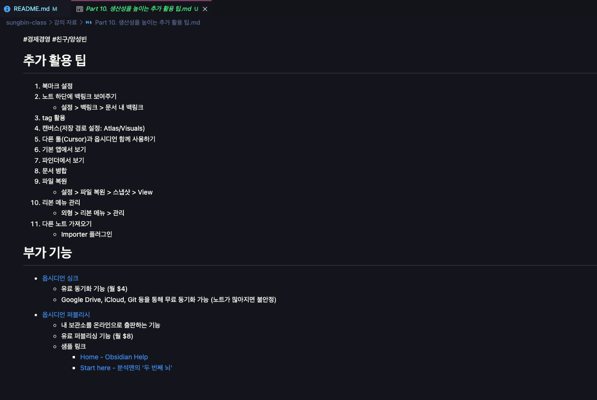
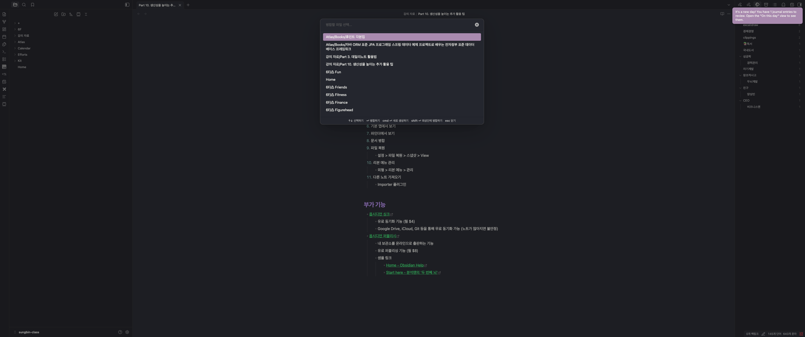
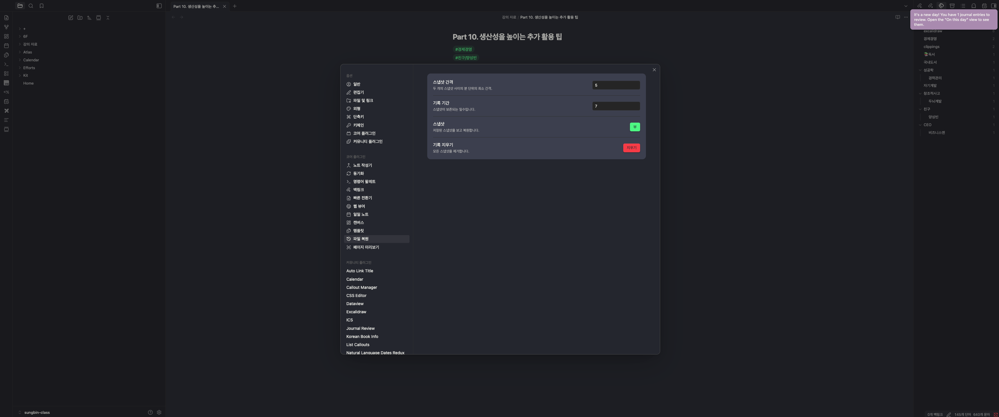
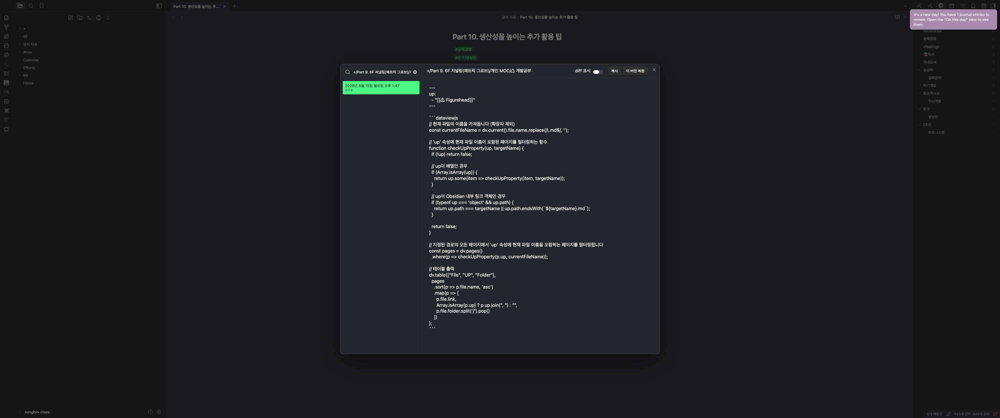
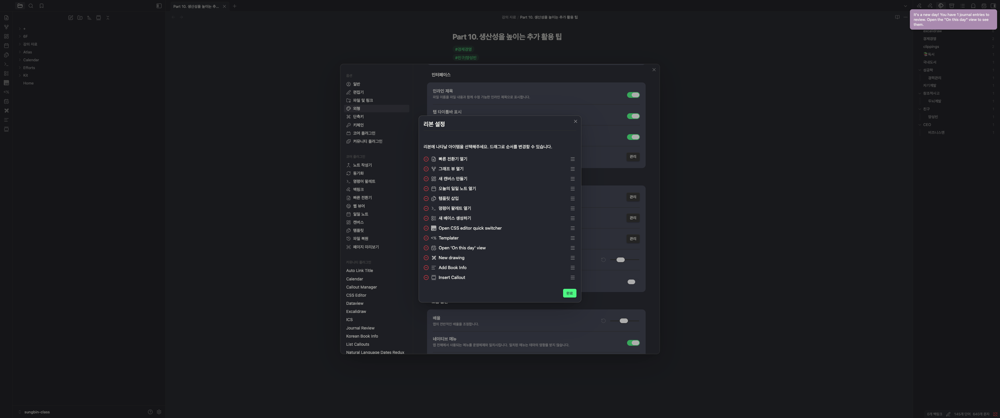
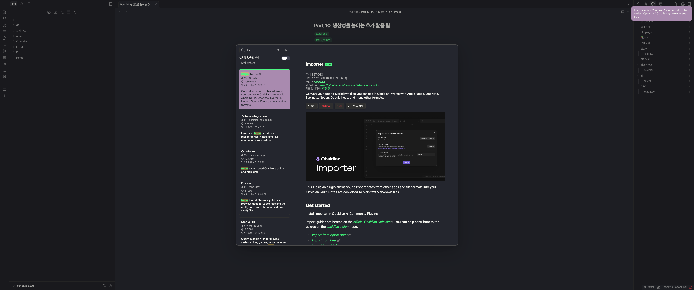

> 해당 포스팅은 [옵시디언 마스터 클래스: PKM·AI Second Brain·LLM WiKi 기초부터 실전까지](https://inf.run/ekDAP)를 참고하여 작성하였습니다.

## Part 10. 생산성을 높이는 추가 활용 팁

지금까지 데일리 노트, 독서 기록, PKM, 6F 저널링까지 굵직한 활용법을 차례로 다뤄왔다. 이번 파트에서는 앞선 흐름에 딱 들어맞진 않지만, 알아두면 옵시디언을 한층 편하게 쓸 수 있는 자잘한 팁들을 한데 묶어
소개한다. 작아 보여도 매일 쌓이면 생산성에 큰 차이를 만드는 기능들이다.

### 자주 보는 노트는 북마크로

가장 먼저 북마크 기능이다. 자주 들여다보는 노트가 있다면 일일이 찾아 들어가는 대신 북마크로 등록해 한곳에 모아둘 수 있다. 노트에서 북마크를 추가하거나 제거하는 것만으로, 핵심 노트들에 빠르게 접근하는 나만의
즐겨찾기 목록이 만들어진다.

### 노트 하단에서 연결 관계 한눈에 보기

노트가 서로 어떻게 연결되어 있는지 확인하고 싶다면 백링크 설정을 켜두면 좋다. '문서 내 백링크(Backlinks in document)'를 활성화하면, 노트 맨 아래에 이 노트로 들어오는 링크(백링크)와 이
노트가 내보내는 링크(나가는 링크)가 함께 표시된다. 덕분에 지금 보고 있는 노트가 어떤 노트들과 엮여 있는지 따로 찾지 않고도 바로 파악할 수 있다.

### 페이지 대신 흔적을 남기는 태그

태그는 내부 링크(`[[ ]]`)와는 쓰임새가 조금 다르다. 내부 링크가 페이지 단위 연결이라면, 태그는 검색을 위한 키워드 표식에 가깝다. `#` 기호 뒤에 키워드를 붙여 태그를 만들고, 그 태그를 클릭하면 해당
태그가 달린 모든 노트를 한 번에 모아 볼 수 있다.

특히 친구 이름처럼 굳이 별도 페이지로 만들기는 번거롭지만 흔적은 남겨두고 싶은 경우에 유용하다. 페이지를 만들지 않고도 태그만 달아두면 나중에 검색으로 쉽게 추적할 수 있다. 태그를 그룹으로 묶어 관리하는 기능도
함께 제공된다.

### 외부 에디터와 로컬 폴더 연동하기

옵시디언의 노트는 결국 로컬 폴더에 저장되는 마크다운 파일이다. 이 점을 활용하면, 로컬 폴더를 열 수 있는 외부 에디터(예: Cursor)와 연동해 같은 노트를 다룰 수 있다.

이렇게 연동하면 옵시디언에서는 지원하지 않는 일괄 선택 같은 편집 기능을 쓸 수 있고, 에디터에 붙은 AI 플러그인을 연계해 노트를 한 번에 수정하는 등 활용 범위가 크게 넓어진다. 옵시디언 안에만 갇히지 않고,
마크다운이라는 열린 포맷의 장점을 그대로 누리는 방법이다.

### 알아두면 좋은 파일 관리 기능

파일을 다루다 보면 유용하게 쓰이는 관리 기능들이 있다.

- **문서 병합** : 비슷하거나 중복된 노트를 하나로 합치는 기능이다. 노트의 점점점(`⋯`) 메뉴에서 '전체 파일을 다음으로 합치기'를 선택해 대상 노트를 고르면, 내용은 물론 연결된 링크(멘션)까지 한 번에
  병합된다.
- **파일 복원** : 이전 저장 버전(스냅샷)을 확인하고 원하는 시점으로 되돌릴 수 있다. 실수로 내용을 지웠거나 예전 버전이 필요할 때 든든한 안전장치가 된다.
- **리본 메뉴 관리** : 왼쪽 리본 메뉴에서 잘 쓰지 않는 기능은 빼고, 자주 쓰는 기능은 순서를 바꿔 정리할 수 있다. 화면을 내 손에 맞게 깔끔하게 다듬는 셈이다.

### 다른 노트 앱에서 옮겨오기

이미 노션(Notion)이나 에버노트(Evernote) 같은 앱에 쌓아둔 노트가 있다면, 임포터(Importer) 플러그인으로 옵시디언 서식에 맞게 변환해 가져올 수 있다. 기존 자료를 버리지 않고 옵시디언으로
자연스럽게 이주할 수 있는 길이 열려 있는 셈이다.

### 유료지만 강력한 두 기능

마지막으로, 비용이 들지만 그만큼 강력한 두 가지 유료 기능을 짚어둔다.

- **Obsidian Sync** : 집·회사 PC, 모바일 등 여러 기기 간에 노트를 동기화하는 기능이다. iCloud나 구글 드라이브로 무료 동기화도 가능하지만, Obsidian Sync는 더 쾌적하고 안정적인
  환경을 제공한다. 비용은 월 4달러 수준이다.
- **Obsidian Publish** : 내 노트를 그대로 웹사이트로 발행해 구글 검색까지 되게 만드는 기능이다. 노트 구조가 그대로 반영된 웹페이지가 만들어지며, 비용은 월 8달러 수준이다. 여러 탭을 열어둔
  상태라면 '탭 스택' 기능으로 책갈피처럼 인덱스를 만들고 애니메이션으로 노트를 넘겨볼 수도 있다.

### 마치며

이번 파트에서는 북마크, 백링크, 태그처럼 기본기를 보완하는 기능부터, 외부 에디터 연동·파일 병합·외부 노트 가져오기, 그리고 Sync와 Publish 같은 유료 기능까지 두루 살펴봤다. 하나하나는 사소해 보여도,
자신의 사용 습관에 맞는 팁을 골라 쓰면 옵시디언을 훨씬 매끄럽게 다룰 수 있다. 모든 기능을 다 쓰려 하기보다, 내게 필요한 것부터 하나씩 들여놓는 것을 추천한다.

## Part 11. 유용한 플러그인 소개

마지막 파트에서는 앞서 다루지 못했던 플러그인들 중, 강사가 실제로 잘 쓰고 있는 것들을 한데 모아 소개한다. 종류가 워낙 많으니, 비슷한 성격끼리 묶어 정리해본다. 참고로 강사는 빠르게 시연 가능한 것은 바로 보여주고, 설정이 복잡한 것은 이후 애드온 영상으로 따로 풀어줄 예정이라고 한다.

### 입력과 편집을 편하게

- **스마트 타이포그래피(Smart Typography)** : 특수문자를 쉽게 입력하도록 돕는다. 노션에도 비슷한 기능이 있는데, 화살표 같은 기호를 입력하면 자동으로 변환해준다.
- **페이스트 이미지 리네임(Paste image rename)** : 이미지를 붙여넣을 때 무작위로 생기던 파일명을, 지금 보고 있는 노트 제목을 프리픽스로 붙여 `노트제목-1`, `노트제목-2` 식으로 자동 변환해준다. 화면을 캡처하거나 웹브라우저에서 드래그해 넣을 때 특히 유용하다.
- **Toggle Crazy** : 헤딩이나 제목의 접기·펼치기 상태를 기억하고 고정해준다. 원하는 화면 상태를 그대로 유지하고 싶을 때 좋다.

### 탐색과 검색을 강력하게

- **Recent Files** : 최근에 열어본 노트 목록을 보여준다. 직전에 작업하던 노트로 빠르게 되돌아갈 때 편하다.
- **Dynamic Outline** : 헤딩(Heading)을 기준으로 목차(Table of Contents)를 자동 생성해준다. 하위 레벨 헤딩까지 내비게이션으로 동작해, 긴 노트 안을 빠르게 오갈 수 있다.
- **OmniSearch** : 기본 검색이 다루지 못하는 PDF, 오피스 문서, 이미지 속 내용까지 검색해준다. 문서 작업이 많은 연구자나 실무자에게 특히 유용하다.

### 태그와 링크 관리

- **Tag Wrangler** : 태그를 통합 관리하고 이름을 한 번에 수정할 수 있게 해준다. 태그 목록에서 직접 고치기 번거로울 때 유용하다.
- **블록링크 플러스(Block Link Plus)** : 제목이 아닌 특정 텍스트 블록 단위로 링크를 걸거나 임베드할 수 있게 해준다. 세밀하게 노트를 연결하고 싶을 때 쓴다.
- **머지 노트 & 노트 리팩터(Merge Notes & Note Refactor)** : 머지 노트는 여러 노트를 하나로 합치고, 노트 리팩터는 반대로 긴 노트를 제목 단위로 잘라 각각 멘션으로 연결해준다.

### 문서·미디어 연동

- **PDF++** : PDF에 하이라이트와 주석을 달고, 특정 영역을 노트에 임베드해 양방향으로 연결되는 링크를 만들 수 있다.
- **Translate** : 옵시디언 안에서 바로 번역 기능을 쓸 수 있다.
- **ShareNote** : 지금 보고 있는 노트를 테마와 서식까지 유지한 채 외부 공유 링크로 만들어준다.
- **커스텀 프레임(Custom Frames)** : 웹페이지를 iframe 형태로 임베드해 사이드바 패널 등에 띄워두고 쓸 수 있다.
- **Y-Transcript** : 유튜브 스크립트를 가져온다. 자막이 있으면 타임스탬프와 자막을, 없으면 음성 텍스트를 가져오며, 스마트 컴포저와 연계하면 한국어 맞춤법 교정까지 가능하다.

### AI를 활용하는 플러그인

- **스마트 컴포저(Smart Composer)** : 커서 위치에서 채팅창처럼 동작하며, AI가 노트 내용을 분석해 문서 작성을 돕는다. API 키를 설정해 원하는 채팅 모델을 골라 쓸 수 있다.
- **Smart Connection** : AI가 노트 간 유사도를 분석해 관련 노트를 추천해준다. 다만 한국어 환경에서는 정확도나 속도가 다소 아쉬울 수 있다고 한다.

### 데이터 이동과 베타 플러그인

- **텔레그램 싱크(Telegram Sync)** : 모바일에서 텔레그램 채팅창에 메시지를 보내면 그 내용이 곧장 옵시디언 보관함으로 들어온다. 설정이 다소 복잡해 별도 영상으로 다룰 예정이라고 한다.
- **임포터(Importer)** : 다른 노트 앱의 문서를 옵시디언 포맷으로 가져온다. 주로 처음 한 번, 일회성으로 쓰게 된다.
- **BRAT** : 아직 공식 등록되지 않은 베타 단계의 플러그인을 GitHub URL 등을 통해 설치할 수 있게 해준다.

### 플러그인은 '많이'가 아니라 '필요한 것만'

마지막으로 강사가 거듭 강조하는 당부가 있다. 각자의 상황에 따라 유용한 플러그인은 다르기 마련이니, 무조건 많이 설치하기보다 본인에게 꼭 필요한 것만 추려서 쓰라는 것이다.

플러그인은 결국 개개인이 만든 것이라, 수가 많아질수록 예상치 못한 사이드 이펙트가 생길 가능성도 높아진다. 그러니 최소한으로 유지하는 편이 안전하다. 새로운 도구가 궁금하다면, 커뮤니티 플러그인 탐색 화면의 정렬 옵션을 활용해 최근 업데이트되거나 새로 출시된 플러그인을 주기적으로 둘러보는 것을 추천한다.

### 마치며

이번 파트에서는 입력·편집, 탐색·검색, 태그·링크 관리, 문서·미디어 연동, AI 활용, 데이터 이동까지 다양한 플러그인을 한눈에 훑어봤다. 핵심은 '많이 까는 것'이 아니라 '내게 맞는 것을 고르는 것'이다. 여기 소개된 것들 중 지금 내 작업에 바로 도움이 될 만한 한두 개부터 가볍게 시작해보길 권한다. 이것으로 옵시디언 마스터 클래스의 정규 과정도 마무리된다.
