> 해당 포스팅은 [옵시디언 마스터 클래스: PKM·AI Second Brain·LLM WiKi 기초부터 실전까지](https://inf.run/ekDAP)를 참고하여 작성하였습니다.

## 그래프 뷰와 로컬 그래프 실전 활용법

옵시디언을 검색하면 썸네일로 가장 많이 등장하는 화면, 바로 노트들이 점과 선으로 얽혀 있는 그래프 뷰(Graph View)다. 가장 많이 소개되는 대표 기능이지만, 막상 켜보면 점만 잔뜩 떠 있어 무엇을 어떻게 봐야 할지 막막하기 쉽다. 이번 글에서는 그래프 뷰와 로컬 그래프 뷰(Local Graph View)를, 단순한 볼거리가 아니라 실제로 써먹을 수 있는 도구로 다루는 방법을 정리한다.

### 그래프 뷰 실행하기

그래프 뷰는 세 가지 방법으로 열 수 있다. 왼쪽 리본 메뉴의 그래프 아이콘을 클릭하거나, 명령 팔레트에서 '그래프 뷰'를 검색하거나, 맥이라면 단축키 `Command-G`로 바로 띄울 수 있다.

화면이 열리면 옵시디언에 만들어둔 모든 노트가 하나의 점(노드)으로 시각화된다. 이때 점의 크기는 연결 관계의 많고 적음을 나타낸다. 다른 노트와 많이 엮인 노트일수록 점이 크게 보이므로, 내 보관함에서 어떤 노트가 중심 역할을 하고 있는지 한눈에 가늠할 수 있다.

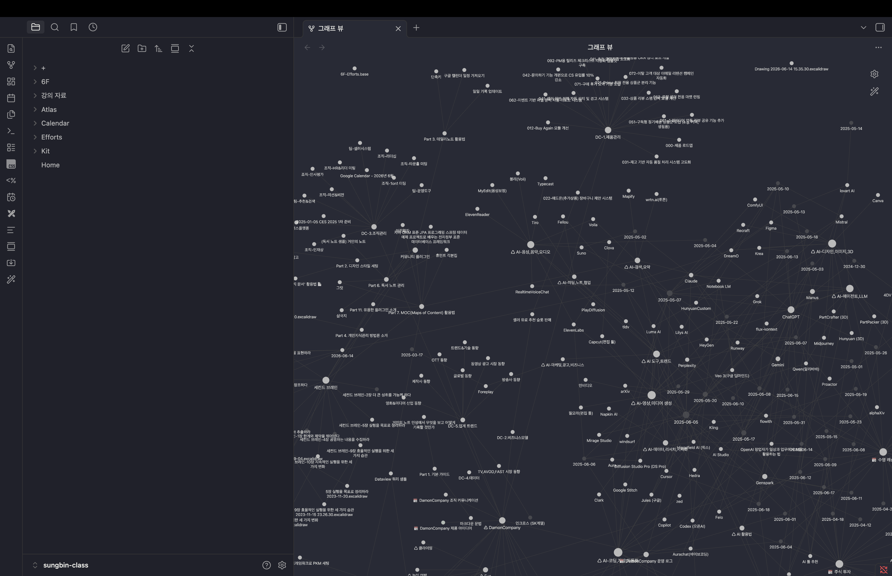

### 필터와 그룹으로 보고 싶은 것만 남기기

다만 이 기능만으로는 효율적으로 쓰기 어렵다. 점이 너무 많아 정작 보고 싶은 관계가 묻히기 때문이다. 그래서 우측 상단의 설정 아이콘을 눌러 약간의 설정을 손봐야 비로소 입맛에 맞게 쓸 수 있다.

- **필터** : 원하는 노트만 골라 시각화한다. 태그, 첨부 파일, 존재하는 파일, 연결되지 않은 노트 등을 표시하거나 숨길 수 있고, 특정 경로의 노트만 남기거나 반대로 제외하는 것도 가능하다.
- **그룹** : 노트의 특징에 따라 색을 입혀 분류한다. 예를 들어 특정 폴더(경로)에 있는 노트들을 같은 색으로 묶어두면, 비슷한 성격의 노트끼리 시각적으로 또렷하게 구분된다.

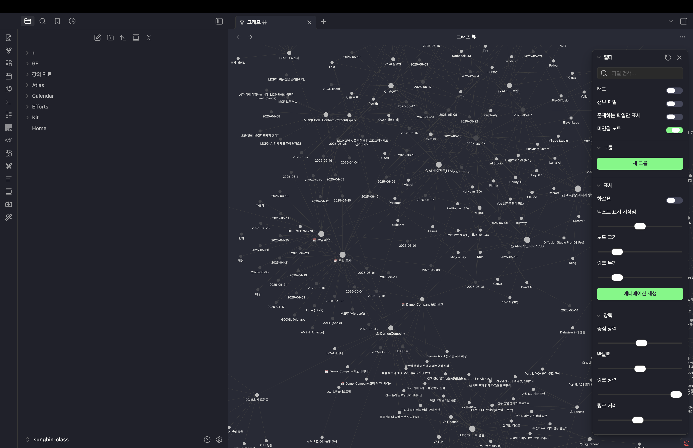

### 표시와 장력으로 보기 좋게 다듬기

연결의 방향과 모양새를 조절하는 설정도 있다.

- **표시** : 백링크와 아웃링크의 관계를 화살표로 나타낼 수 있고, 노드(개별 노트)의 크기나 링크(연결선)의 두께도 조절할 수 있다.
- **장력** : 노드들이 서로 어떻게 밀고 당길지를 제어한다. 중심 장력, 반발력, 링크 거리, 링크 장력 등을 만지면 그래프가 한층 다이내믹하게 움직인다. 재미있게 게임하듯이 이리저리 바꿔보며 가장 보기 편한 배치를 찾으면 된다.

### 타임랩스로 보는 지식의 성장

타임랩스는 노트가 처음 생겨난 시점부터 어떻게 서로 연결되어 왔는지, 그 전체 히스토리를 시간 순서대로 재생해 보여준다. 내 지식이 어떻게 자라왔는지를 마치 불멍 보듯 편안하게 관찰하는 용도다. 노트 관리에 직접 쓰이기보다는, 기록을 꾸준히 이어온 스스로에게 주는 작은 보상에 가깝다.

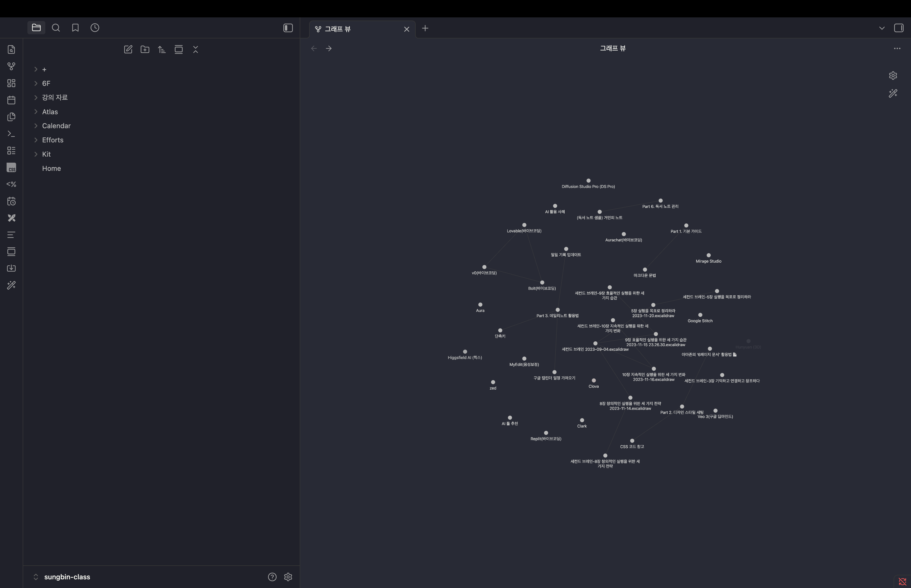

### 보기용 그래프 뷰, 도구용 로컬 그래프 뷰

사실 전체 그래프 뷰는 비주얼적인 요소로 쓰이는 경우가 많고, 노트 관리에 직접 활용하기는 애매하다. 한눈에 멋지긴 하지만, 매일의 작업에 곧바로 도움을 주진 않기 때문이다.

여기서 진짜 실용적인 기능이 로컬 그래프 뷰다. 화면은 전체 그래프 뷰와 비슷해 보이지만 쓰임새가 다르다. 로컬 그래프 뷰는 **지금 열어둔 노트와 연결된 노트들만** 보여주고, 점을 클릭하면 해당 노트로 바로 이동한다. 즉 단순한 시각화를 넘어, 연결을 따라 노트 사이를 오가는 내비게이션 역할을 한다.

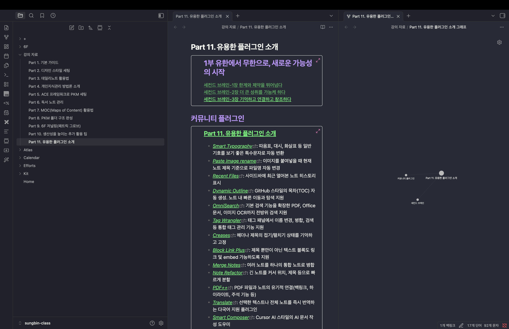

### 로컬 그래프 뷰 200% 활용하기

로컬 그래프 뷰는 노트의 점점점(`⋯`) 메뉴에서 '링크된 화면 열기 > 로컬 그래프 열기'를 선택하거나, 명령 팔레트에서 '로컬 그래프 열기'로 실행한다. 필터, 그룹, 표시, 장력 설정은 전체 그래프 뷰와 똑같이 쓸 수 있다.

실제로 쓸 때는 이 뷰를 우측 사이드바에 넣어두는 것이 좋다. 노트를 탐색할 때마다 지금 보고 있는 노트가 어떤 노트들과 엮여 있는지 곁눈으로 확인할 수 있기 때문이다. 그래프는 정사각형에 가까운 영역에서 더 잘 보이는 만큼, 사이드바를 위아래로 2분할해 두고 쓰는 경우가 많다.

### 마치며

이번 글에서는 그래프 뷰의 실행과 필터·그룹·표시·장력·타임랩스 설정, 그리고 진짜 일꾼인 로컬 그래프 뷰까지 살펴봤다. 핵심은 전체 그래프 뷰는 내 지식의 지도를 조망하는 '보기용'으로, 로컬 그래프 뷰는 노트 사이를 오가는 '도구용'으로 나눠 쓰는 것이다. 사이드바에 로컬 그래프를 띄워두는 작은 습관 하나만으로도, 흩어져 있던 노트들이 자연스럽게 이어지는 경험을 할 수 있을 것이다.

## 발표 자료를 뚝딱, 옵시디언 슬라이드 활용법

발표 자료를 만들 때마다 파워포인트나 키노트를 켜고 디자인 서식과 씨름하기 마련이다. 그런데 옵시디언만으로도 복잡한 서식 없이, 평소 쓰던 마크다운 그대로 슬라이드를 뚝딱 만들 수 있다. 이번 글에서는 옵시디언 코어 기능으로 기본 슬라이드를 만드는 법부터, 커뮤니티 플러그인으로 발표 자료를 한층 풍성하게 다듬는 법까지 정리한다.

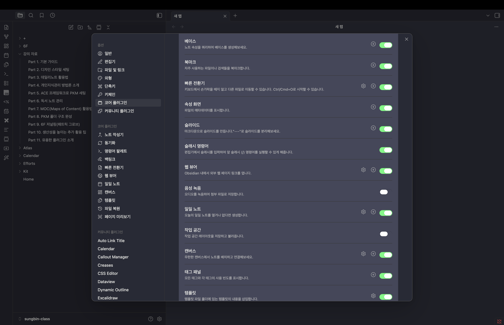

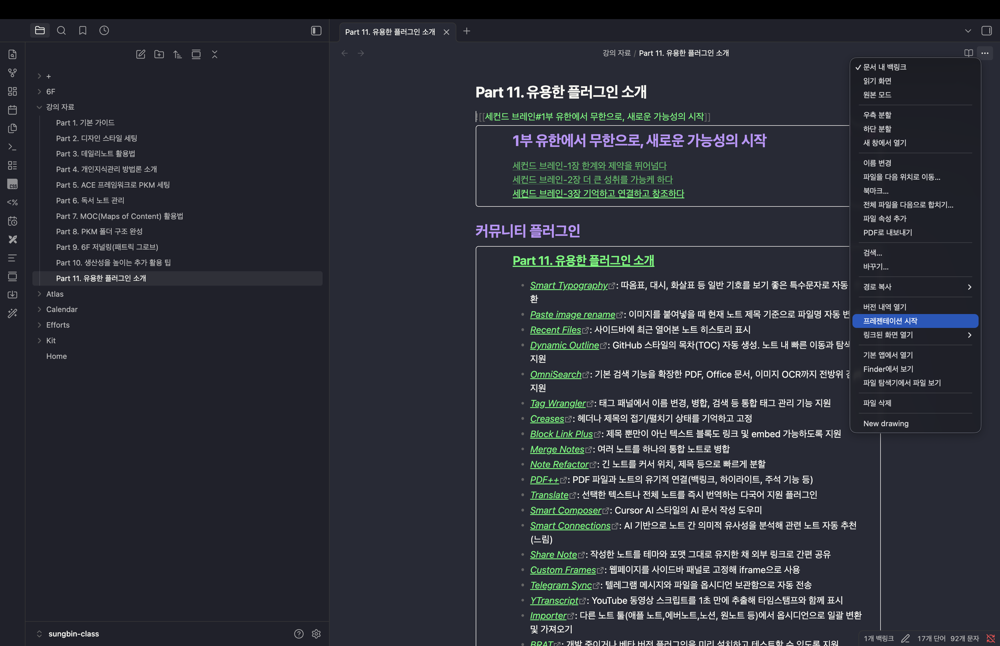

### 구분선으로 페이지 나누기

슬라이드의 출발점은 페이지를 나누는 일이다. 방법은 간단하다. 대시(`-`)를 세 번 입력해 가로 구분선(`---`)을 넣으면, 그 선을 기준으로 슬라이드가 한 장씩 분할된다. 평소 노트에 문단을 나누듯 구분선만 넣어주면 곧바로 페이지가 만들어지는 셈이다.

참고로 스마트 타이포그래피(Smart Typography) 플러그인의 `Dashes` 옵션을 꺼두어도 구분선은 동일하게 동작하니 걱정하지 않아도 된다.

### 이미지 삽입과 크기 조절

발표 자료에 이미지는 빠질 수 없다. 노트에 이미지를 삽입한 뒤에는, 옵시디언이 공통으로 제공하는 방식으로 크기를 조절할 수 있다. 이미지 링크 뒤에 세로 구분선(`|`)과 숫자를 붙여 너비(width) 값을 지정하면 되는데, 이렇게 조절한 크기가 슬라이드에도 그대로 반영된다. 별도의 작업 없이 노트에서 다듬은 모습 그대로 발표 화면에 나타난다.

### 코어 플러그인으로 만드는 기본 슬라이드

여기까지가 슬라이드의 기본 사용법이다. 구분선과 이미지만으로도, 옵시디언에 내장된 코어 플러그인 기능만 켜면 간단한 발표 자료를 충분히 구현할 수 있다. 거창한 도구 없이 마크다운 문서 한 장이 곧 발표 자료가 되는 것이다.

### Advanced Slides로 한 단계 끌어올리기

코어 기능만으로는 아무래도 아쉬운 부분이 있다. 이를 보완해주는 것이 커뮤니티 플러그인 **Advanced Slides**다. 설정의 커뮤니티 플러그인에서 검색해 설치하면, 발표 자료를 훨씬 다채롭게 꾸밀 수 있다.

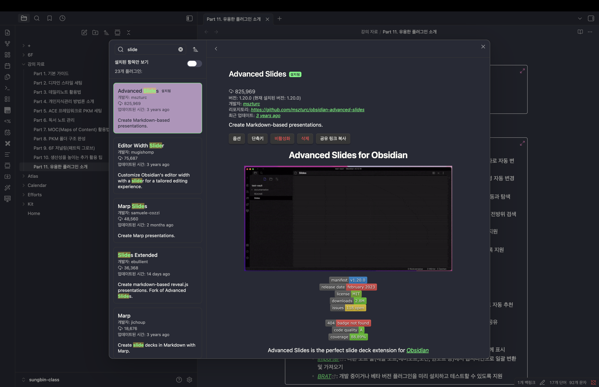

- **실시간 미리보기** : 플러그인을 켜면 리본 메뉴에 아이콘이 생긴다. 이를 클릭하면 우측에 미리보기 화면이 뜨고, 노트를 수정하는 즉시 결과가 반영된다. 고쳐가며 바로바로 확인할 수 있어 편집이 한결 수월하다.
- **테마 변경** : 플러그인 옵션에서 테마를 바꿀 수 있다. 기본 `black` 테마 외에 `sky` 같은 테마를 고르면 배경이 통째로 달라진다.
- **전환 애니메이션** : 슬라이드 넘김 효과를 `fade`(부드러운 전환)나 `zoom`(줌인·줌아웃되는 느낌)으로 바꿀 수 있고, 전환 속도도 조절할 수 있다.

### 발표 중에 바로 필기하는 화이트보드

Advanced Slides에는 발표를 도와주는 화이트보드 기능도 있다. 컨트롤 메뉴에서 초크보드(Chalkboard)를 선택하면 화이트보드가 활성화되어, 펜 도구로 화면 위에 직접 메모하거나 강조 표시를 할 수 있다. 칠판에 적은 내용은 페이지를 넘겨도 기억되며, 기능을 껐다 켜는 것만으로 주석을 자유롭게 추가할 수 있다. 청중 앞에서 즉석으로 설명을 덧붙여야 할 때 요긴하다.

### 더 욕심내고 싶다면 CSS 커스텀

기본 테마나 폰트가 마음에 들지 않는다면 CSS를 직접 손봐 디자인을 입맛대로 바꿀 수도 있다. 폰트부터 색상, 레이아웃까지 세밀하게 다듬어 나만의 발표 스타일을 만들 수 있다.

### 마치며

이번 글에서는 구분선으로 페이지를 나누고 이미지를 넣는 기본기부터, Advanced Slides의 미리보기·테마·애니메이션·화이트보드, 그리고 CSS 커스텀까지 살펴봤다. 핵심은 발표 자료를 만들겠다고 굳이 다른 도구를 켤 필요 없이, 평소 쓰던 옵시디언 노트를 그대로 슬라이드로 변신시킬 수 있다는 점이다. 간단한 발표라면 옵시디언 하나로 충분하다.

## 무작위 노트, 읽기 화면, 각주(Footnote) 사용법

옵시디언 기본 기능의 마지막으로, 자잘하지만 알아두면 쓸모 있는 세 가지를 모았다. 노트를 무작위로 펼쳐보는 무작위 노트, 편집 없이 글에만 집중하는 읽기 화면, 그리고 위키백과처럼 출처와 주석을 다는 각주다. 모두 옵시디언에 내장된 코어 플러그인으로 제공되는 기능이다.

### 무작위 노트로 우연히 다시 만나기

무작위 노트는 말 그대로 보유한 노트 중 하나를 무작위로 열어주는 기능이다. 설정의 코어 플러그인에서 '무작위 노트'를 켜면 왼쪽 리본 메뉴에 아이콘이 생기는데, 이 아이콘을 누를 때마다 주사위 룰렛을 돌리듯 노트가 아무거나 하나씩 열린다.

거창한 기능은 아니지만, 잊고 지냈던 옛 노트와 우연히 다시 마주치고 싶을 때 의외로 쏠쏠하다. 쌓아둔 기록을 가볍게 환기하는 용도로 써보면 좋다.

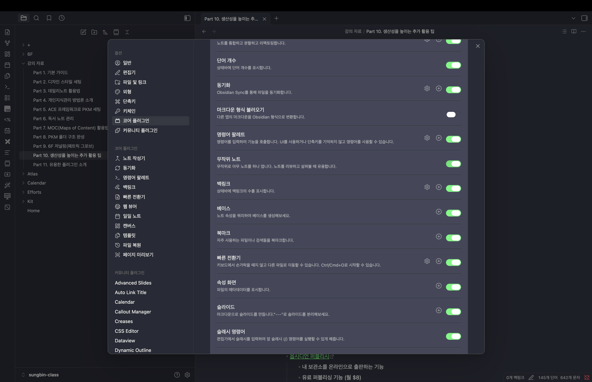

### 읽기 화면과 원본 모드

옵시디언은 노트를 보는 방식을 여러 가지로 제공한다. 평소에는 편집과 미리보기가 함께 되는 '실시간 미리보기' 모드를 쓰지만, 노트의 점점점(`⋯`) 메뉴에서 '읽기 화면'을 선택하면 편집이 막히고 내용만 깔끔하게 보는 화면으로 바뀐다. 긴 글을 차분히 읽고 싶을 때 유용하며, 다시 누르면 실시간 미리보기로 돌아온다.

반대로 '원본 모드'는 마크다운 코드까지 그대로 드러나는, 날것의 노트를 보여준다. 속성이나 시각화된 요소 없이 작성한 그대로를 보고 싶은 경우, 또는 코드 형태로 편집하는 게 익숙한 사용자에게 적합하다. 일반적인 글쓰기에는 실시간 미리보기를 쓰면 충분하다.

### 각주(Footnote)로 출처와 주석 달기

각주는 문장 중간에 출처나 부연 설명을 달 때 쓰는 기능이다. 위키백과나 나무위키에서 흔히 보던, 본문에 붙은 작은 번호와 하단의 설명이 바로 그것이다. 사용하려면 설정의 코어 플러그인에서 '각주(Footnote)' 기능을 켜야 한다.

작성법은 간단하다. 주석을 달고 싶은 자리에 대괄호와 캐럿 기호를 묶어 `[^각주이름]` 형태로 넣어주면 각주가 만들어지고, 문서 아래쪽에 그 설명을 채워 넣으면 된다. 예를 들어 `[^제텔카스텐의-배경]`처럼 표시한 뒤 하단에 해당 설명을 적는 식이다.

읽기 화면으로 전환하면 각주의 연결고리가 완성된다. 본문의 각주 번호를 클릭하면 해당 설명으로 이동하고, 설명에서 다시 원래 문장으로 돌아오는 링크까지 제공된다. 출처를 꼼꼼히 챙겨야 하는 긴 문서나 리서치 노트를 쓸 때 특히 든든하다.

수동으로 각주를 달다 보면 번호 순서가 꼬이기 쉬운데, 이럴 때는 커뮤니티 플러그인을 활용하면 좋다. 커뮤니티 플러그인 탐색에서 'Footnote'를 검색하면 번호를 1, 2, 3 순서로 자동 정렬해주는 등 한층 편리한 도구들을 찾을 수 있다.

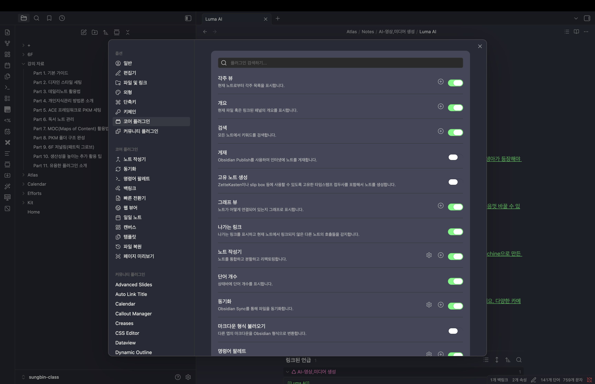

### 마치며

이번 글에서는 무작위 노트, 읽기 화면과 원본 모드, 그리고 각주까지 옵시디언 코어 플러그인의 자잘한 기능들을 살펴봤다. 옵시디언에는 이렇게 직접 만든 코어 플러그인과 사용자들이 만든 커뮤니티 플러그인이 함께 있는데, 기본기는 코어 플러그인만으로도 충분히 단단하다. 화려하진 않아도, 필요한 순간 손에 익혀두면 글쓰기와 기록이 한결 매끄러워지는 기능들이다.

## 노트 앱 Bear의 디자인 테마, 똑같이 구현해보기!

마크다운 기반 노트 앱은 기능은 강력해도 디자인이 투박하고, 특히 한글 가독성이 아쉬운 경우가 많다. 그런 가운데 노트 앱 Bear는 깔끔한 디자인과 뛰어난 한글 가독성으로 오래 사랑받아온 앱이다. 다만 여러 기기 동기화에 유료 구독이 필요하다는 허들 탓에 메인 도구로 삼기는 망설여진다. 그렇다면 그 좋은 디자인만이라도 옵시디언으로 옮겨올 수 없을까? 이번 글에서는 Bear의 테마를 옵시디언에서 거의 98% 수준으로 똑같이 재현하는 방법을 정리한다. 예전에는 CSS를 일일이 손봐야 했지만, 지금은 누구나 쉽게 따라 할 수 있다.

### 테마와 강조 색상 맞추기

가장 먼저 큰 틀을 잡는다. 세 단계만 거치면 Bear의 기본 분위기가 갖춰진다.

1. **외형 설정** : 테마를 '라이트' 모드로 변경한다. Bear의 밝고 깔끔한 느낌은 라이트 모드가 기본이다.
2. **기본 테마 변경** : 테마를 '미니멀(Minimal)'로 바꾼다. Bear 스타일 재현의 토대가 되는 테마다.
3. **강조 색상 설정** : Bear의 시그니처인 빨간색 강조 색상을 그대로 적용한다. 컬러 값은 RGB `(220, 77, 79)`이며, 이 값을 메인 컬러로 지정하면 강조 요소들이 Bear와 똑같은 색을 띤다.

### Minimal Theme Settings로 기능 다듬기

다음으로 커뮤니티 플러그인 **Minimal Theme Settings**를 설치한다. 이 플러그인은 세밀한 디자인보다 동작 방식을 손보는 데 초점이 맞춰져 있다.

- **라이트 모드 배경 대비** : 'High Contrast'로 변경해 배경 색감을 Bear에 가깝게 조정한다.
- **내부 링크 밑줄 끄기** : 멘션(내부 링크)에 자동으로 붙는 밑줄을 없애, 본문이 더 정갈하게 보이도록 한다.

### Style Settings로 세부 디자인 입히기

이제 디테일을 채울 차례다. 커뮤니티 플러그인 **Style Settings**를 사용하면 헤딩 크기, 간격 같은 세부 요소를 조절할 수 있다. 예전에는 옵션을 하나하나 만져야 했지만, 지금은 미리 만들어둔 설정 코드 값을 복사해 Style Settings의 'Import' 기능으로 한 번에 적용할 수 있다.

코드를 불러오면 헤딩 타이틀, 인용구 디자인, 볼드 처리, 텍스트 간격 등이 한꺼번에 Bear 스타일로 바뀐다. 가독성을 좌우하는 폰트·자간·행간이 자연스럽게 잡히는 것이 이 단계의 핵심이다.

### 하이라이트와 태그 스타일

마지막은 색감 디테일이다. Bear는 여러 색의 하이라이트를 자유롭게 쓸 수 있지만, 옵시디언은 그만큼 자유롭지는 않다. 에디터 플러그인으로 구현할 수는 있어도 텍스트 앞뒤에 코드 값이 붙어 번거롭기 때문에, 대신 다음과 같이 기본 스타일을 Bear와 비슷하게 맞춰두면 깔끔하다.

- 하이라이트에는 파란색 배경색을 적용한다.
- 이탤릭체에는 초록색 텍스트 색을 입힌다.
- 태그는 Bear와 유사한 기본 스타일로 표시되도록 맞춘다.

### 마치며

이번 글에서는 라이트 모드와 미니멀 테마, 빨간 강조 색상으로 큰 틀을 잡고, Minimal Theme Settings와 Style Settings 플러그인으로 기능과 세부 디자인을 다듬어 Bear의 테마를 옵시디언에 거의 똑같이 옮겨봤다. CSS를 깊이 파고들지 않아도 설정 몇 가지와 코드 한 번 복사로 충분하다. 평소 라이트 모드를 즐겨 쓰고 한글 가독성을 중시한다면, 이 세팅을 한번 적용해보길 추천한다.

## BASE로 디지털 서재 만들기: 읽을 책부터 완독까지 한눈에!

드디어 옵시디언의 BASE 기능이 정식으로 론칭됐다. BASE는 노트들을 하나의 데이터베이스처럼 다루며 표·카드 등 다양한 형태로 보여주는 기능인데, 이걸 활용하면 내가 읽은 책들을 한곳에 모아 디지털 서재를 꾸릴 수 있다. 이번 글에서는 BASE로 '읽을 책부터 완독까지' 한눈에 관리하는 서재를 단계별로 만들어본다.

### BASE 기능 켜고 생성하기

먼저 설정의 코어 플러그인에서 '베이스(Base)' 기능을 활성화해야 한다. 활성화한 뒤에는 명령 팔레트에서 '베이스'를 검색하거나, 왼쪽 리본 메뉴의 아이콘을 클릭해 베이스를 새로 만들거나 노트에 삽입할 수 있다.

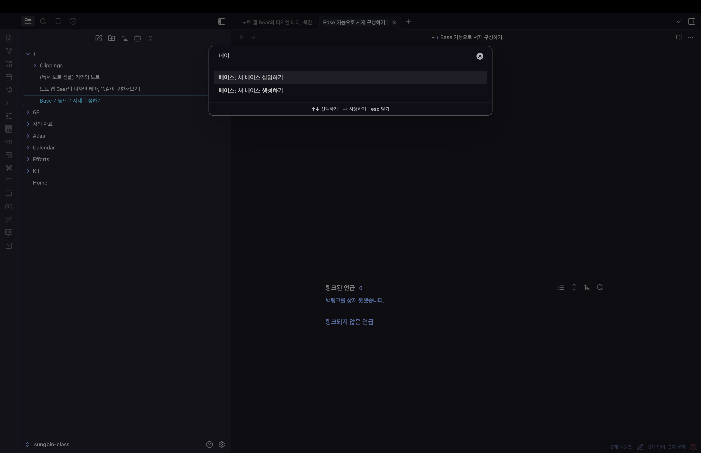

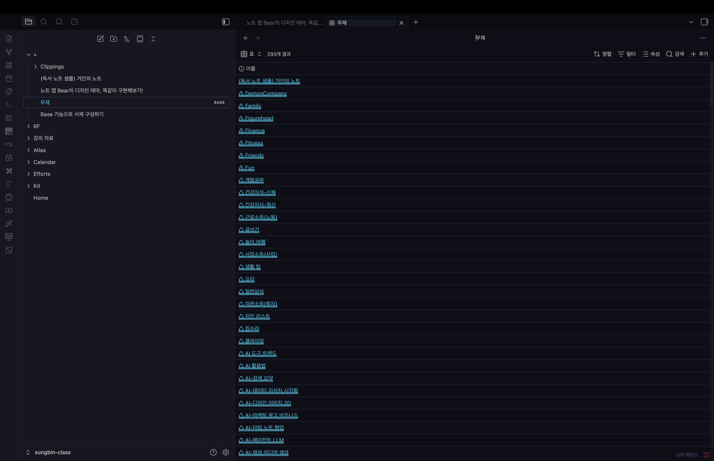

### 필터로 책 리스트만 모으기

서재의 재료는 'Books' 폴더에 쌓아둔 책 노트들이다. 베이스의 필터에서 `folder`가 `books`인 항목만 조회하도록 설정하면, 해당 폴더의 책 리스트가 그대로 불러와진다. 이렇게 만든 베이스를 'Books'라는 이름으로 저장하고, 미리 정해둔 폴더로 옮겨두면 정리가 깔끔하다.

### 표를 카드(썸네일) 뷰로 바꾸기

기본은 표 형태지만, 책은 표지가 보여야 서재답다. 'Add view'를 눌러 '서재'라는 이름의 뷰를 추가하고 레이아웃을 '카드'로 바꾼다. 그리고 다시 `folder`가 `books`인 항목으로 필터를 걸면 카드 형태로 나열된다. 이때 책 노트의 `cover_url` 속성을 썸네일 이미지로 지정하면, 각 카드에 표지가 떠 한층 서재다운 모습이 된다.

### 카드 뷰 다듬기

표지가 잘 보이도록 세부 설정을 손본다.

- **이미지 핏** : 썸네일 영역에 이미지가 꽉 차 잘리는 대신, 'Contain'으로 바꿔 책 표지 전체가 온전히 보이도록 한다.
- **카드 크기** : 카드 사이즈를 조절해 한 줄에 표시되는 책 수를 늘리거나 줄일 수 있고, 썸네일 영역의 비율도 입맛대로 조정할 수 있다.

### Status로 '읽는 중'과 '완독' 나누기

서재가 갖춰졌다면, 이제 책의 상태별로 나눠볼 차례다. 각 책 노트에 `status` 속성을 추가해 '읽는 중', '완독' 같은 값을 적어둔다. 그런 다음 'Add view'로 '읽는 중' 카드 뷰를 만들고, 필터에 `status`가 '읽는 중'인 것만 보이도록 설정하면 지금 읽고 있는 책만 모인다.

### 뷰 복제로 빠르게 완독 칸 만들기

'완독' 뷰는 처음부터 다시 만들 필요가 없다. '읽는 중' 뷰를 복제한 뒤 필터 값만 '완독'으로 바꾸면 끝이다. 이렇게 만들어진 서재·읽는 중·완독 뷰는 드래그 앤 드롭으로 순서를 바꿀 수 있으니, 전체 서재가 항상 맨 앞에 오도록 정렬해두면 보기 좋다.

### 페이지에 삽입하고 더 넓게 활용하기

완성된 'Books' 베이스 파일은 원하는 페이지에 그대로 삽입할 수 있다. 삽입한 베이스는 표·서재·읽는 중·완독 등 여러 뷰를 오가며 관리되고, 카드 뷰에도 `status` 같은 속성 값을 함께 표시할 수 있다. 같은 방식으로 영화나 드라마 평점 등 다른 콘텐츠를 관리하는 데에도 똑같이 응용할 수 있다.

### 마치며

이번 글에서는 BASE 기능을 켜고, 필터로 책을 모으고, 카드 뷰로 표지를 띄우고, Status로 '읽는 중'과 '완독'을 나눠 나만의 디지털 서재를 완성해봤다. 핵심은 하나의 데이터를 여러 뷰로 자유롭게 변주하며 보는 것이다. 책뿐 아니라 영화·드라마 등 무엇이든 같은 틀로 정리할 수 있으니, BASE로 나만의 컬렉션을 하나씩 늘려가 보길 바란다. 이것으로 '세팅과 활용, 한 단계 더 나아가기' 섹션을 마무리한다.
