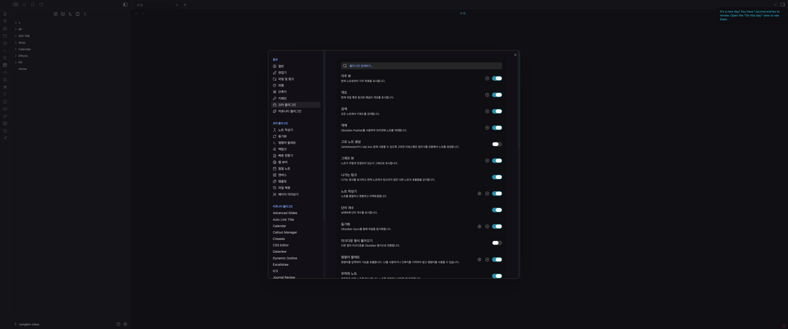
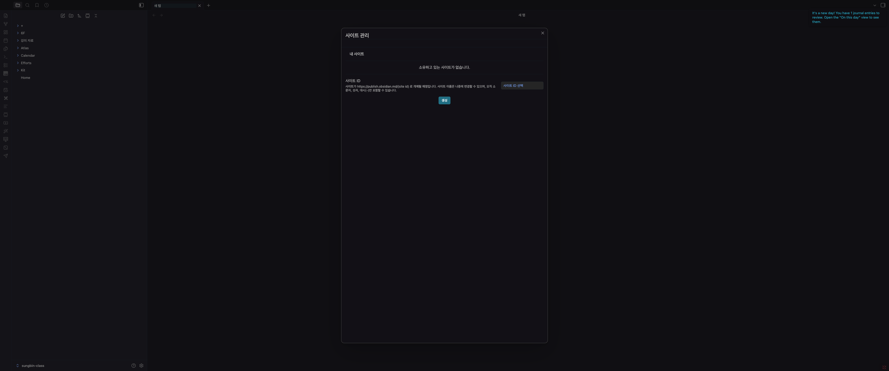
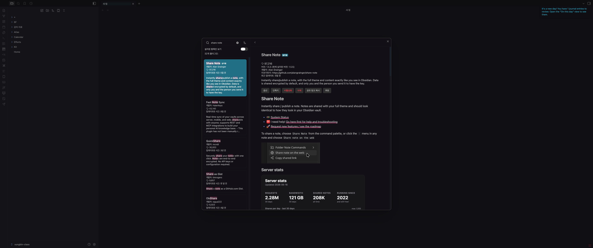
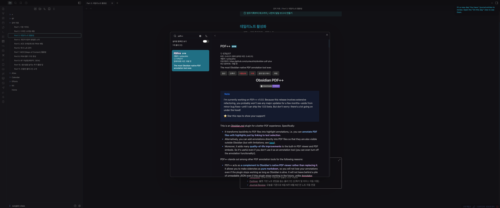
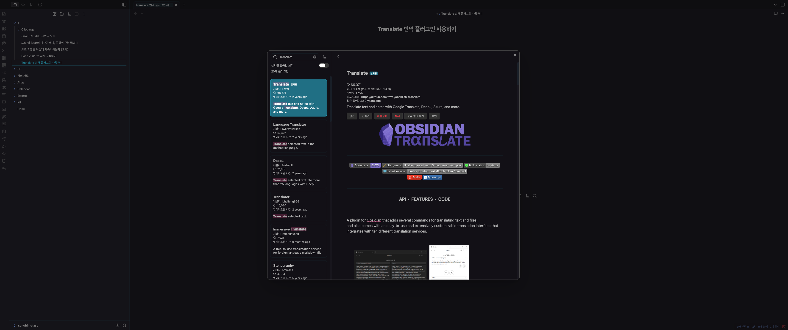
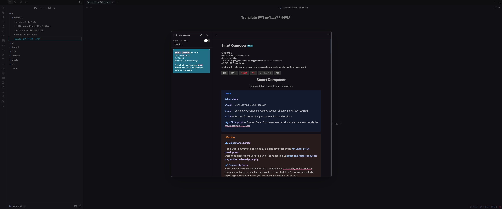
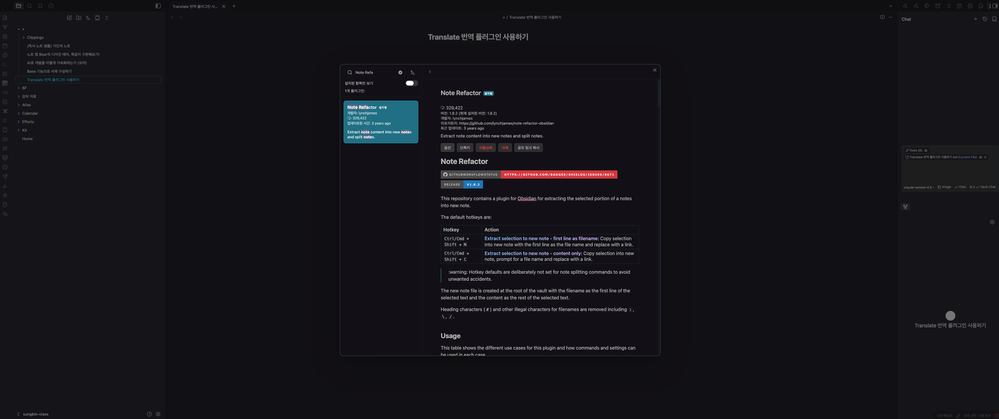
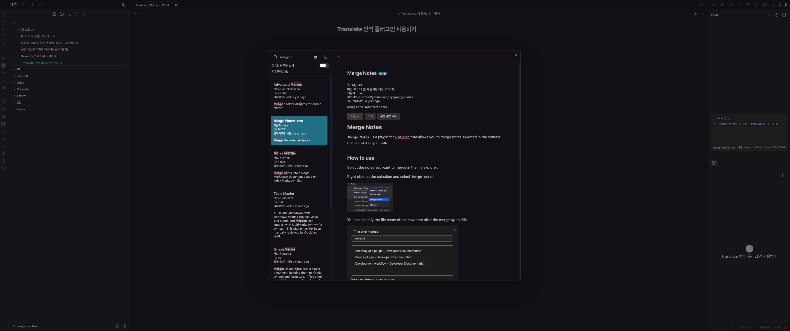

> 해당 포스팅은 [옵시디언 마스터 클래스: PKM·AI Second Brain·LLM WiKi 기초부터 실전까지](https://inf.run/ekDAP)를 참고하여 작성하였습니다.

## Telegram Sync - 텔레그램으로 옵시디언에 실시간 메모하기

길을 걷다가, 혹은 잠들기 직전에 문득 떠오른 아이디어를 잡아두기 위해 많은 사람이 카카오톡의 '나에게 보내기'를 쓴다. 손에 익고 빠르긴 하지만 한 가지 큰 약점이 있다. 카카오톡은 외부 툴과 연결되지 않아,
나중에 그 메모를 찾으려면 결국 대화창을 다시 열어 스크롤을 내리며 뒤져야 한다는 점이다. 그렇다고 옵시디언 모바일 앱을 켜자니, 앱 실행과 동기화에 약간의 딜레이가 있어 '떠오른 순간 바로 적기'에는 아쉬움이
남는다.

이 두 가지 불편을 한 번에 해결해주는 것이 바로 **Telegram Sync** 플러그인이다. 텔레그램으로 보낸 메시지를 옵시디언으로 실시간 동기화해주기 때문에, 평소처럼 텔레그램에 툭 던져둔 메모가 자동으로 내
보관함에 차곡차곡 쌓인다. 설치와 세팅 과정이 조금 까다로운 편이지만, 순서대로 따라오면 어렵지 않게 끝낼 수 있다.

### 플러그인 설치와 연결 준비

먼저 설정의 커뮤니티 플러그인에서 'Telegram Sync'를 검색해 설치하고 활성화한다. 그다음 플러그인 옵션의 **Connect** 항목으로 들어가면, 본격적인 연결을 위해 두 가지 값을 채워 넣어야 한다.

- **Bot API 토큰** : 텔레그램 봇이 외부 앱(옵시디언)과 통신할 때 쓰는 인증 키다.
- **Chat ID** : 메시지를 주고받을 대화 상대를 식별하는 고유 숫자 값이다.

이 두 값은 모두 텔레그램의 공식 봇인 **BotFather**를 통해 발급받는다. 이어지는 단계에서 하나씩 만들어보자.

### BotFather로 Bot API 토큰 발급받기

API 토큰은 봇을 새로 만들면서 얻는다.

1. 텔레그램 앱에서 `BotFather`를 검색해 대화창을 연다.
2. `/newbot` 명령어를 입력해 새 봇 생성을 시작한다.
3. 봇의 이름을 입력하고, 이어서 끝에 `_Bot`이 붙는 봇의 사용자명(username)을 입력한다.
4. 생성이 완료되면 봇 정보와 함께 **API 토큰**이 나타난다. 이 값을 복사해 플러그인 설정의 Bot API 토큰 칸에 붙여 넣는다.

### Chat ID 발급받기

다음은 메시지를 받을 대상을 가리키는 Chat ID 차례다.

1. BotFather에서 `/mybots` 명령어를 입력하고, 방금 만든 봇을 선택한다.
2. 봇 정보에서 'API Token' 옆에 보이는 **숫자로 된 값**을 복사한다. 이 값을 Chat ID로 사용한다.
3. 복사한 값을 플러그인 설정의 Chat ID 칸에 붙여 넣는다.

> 만약 메시지를 보냈을 때 'access denied'(접근 거절) 오류가 뜬다면, 대부분 Chat ID가 잘못 입력된 경우다. 당황하지 말고 위 과정을 다시 밟아 Chat ID를 재발급받아 넣으면 깔끔하게
> 해결된다.

### 텔레그램으로 메모하면 옵시디언에 쌓인다

세팅이 끝났다면 이제 평소처럼 텔레그램에서 봇에게 메시지를 보내보자. 잠시 뒤 옵시디언에 `Telegram`이라는 폴더가 자동으로 생성되고, 보낸 메시지가 그 안에 노트로 기록된다. 각 메모에는 내가 적은 내용과
함께 연도·월일·시간대 정보가 같이 남아, 언제 떠올린 생각인지도 한눈에 파악할 수 있다.

더 반가운 점은 텍스트만 동기화되는 게 아니라는 것이다. 보이스 메시지, 사진, 영상 같은 다양한 파일도 텔레그램으로 보내면 그대로 옵시디언으로 넘어온다. 이때 보이스 메시지는 `voice` 폴더에, 사진은
`photo` 폴더에 종류별로 알아서 분류되어 저장된다.

### 메시지 규칙으로 기록 형식 다듬기

기본 기록 형식이 다소 장황하게 느껴진다면, 설정의 **메시지 규칙**에서 입맛에 맞게 조절할 수 있다. 수신되는 메시지의 파일명이나 날짜 표기 방식을 바꿀 수 있는데, 예를 들어 날짜를 연월일만 표시하도록 설정하면
기록이 한결 간결해진다.

### 마치며

이번 글에서는 Telegram Sync 플러그인을 설치하고, BotFather로 API 토큰과 Chat ID를 발급받아 연결한 뒤, 텔레그램 메시지를 옵시디언으로 실시간 동기화하는 과정을 살펴봤다. 핵심은 '떠오른
순간 가장 빠르게 잡아두는 도구'와 '오래 쌓아두고 다시 찾는 도구'를 분리하지 않고, 평소 쓰던 텔레그램을 옵시디언의 빠른 입력창처럼 활용한다는 데 있다. 메모는 텔레그램으로 가볍게 던지고, 정리와 연결은
옵시디언에서 차분히 하는 흐름을 만들어두면 기록 습관이 한층 매끄러워질 것이다.

## Share Note - 노트 스타일 그대로, 간편하게 외부 공유하기

옵시디언에 잘 정리해둔 노트를 누군가에게 링크 하나로 툭 건네고 싶을 때가 있다. 그런데 옵시디언은 기본적으로 노트를 웹으로 공유하는 기능을 제공하지 않는다. 공식적으로는 **Obsidian Publish**라는
유료 기능을 써야 하는데, 월 8달러의 비용이 들고 별도의 구매 절차도 거쳐야 한다. 막상 써보면 블로깅 용도로는 애매하게 느껴져, 결국 잘 쓰지 않으면서 구독료만 나가기 십상이다.

이럴 때 좋은 대안이 커뮤니티 플러그인 **Share Note**다. 누군가 만들어 공개해둔 플러그인으로, 내가 원하는 페이지만 골라 무료로 공유할 수 있다. 무엇보다 노트에 적용된 CSS 테마와 서식까지 그대로
복사되어 공유된다는 점이 큰 매력이다.

### 플러그인 설치와 Connect 설정

먼저 설정의 커뮤니티 플러그인에서 'Share Note'를 검색해 설치하고 활성화한다. 그다음 플러그인 옵션에서 **Connect Plugin** 버튼을 눌러 키 값을 받아오는 과정을 거쳐야 하는데, 여기에 한 가지
함정이 있다.

이 버튼을 옵시디언 **내부 웹뷰어**에서 클릭하면 키 값 받아오기에 실패한다. 그래서 다음 두 방법 중 하나로 진행해야 한다.

- 열린 링크를 복사해 크롬 같은 **일반 브라우저**에서 열고, 반환된 값을 복사해 플러그인 설정에 붙여 넣는다.
- 또는 화면에 뜨는 'Obsidian 열기' 버튼을 클릭해 값을 받아온다.

이 과정만 무사히 넘기면 세팅은 끝이다.

### 노트 공유하기

공유할 노트를 연 상태에서 명령 팔레트를 열고 'Share Note → Share Current Note'를 실행한다. 그러면 자동으로 공유 링크가 생성되며, 이 링크를 누구에게나 전달할 수 있다. 앞서 말했듯 이
과정에서 페이지의 CSS와 테마까지 함께 복사되므로, 내가 옵시디언에서 보던 모습 그대로를 상대방도 보게 된다.

### 수정사항과 테마 반영하기

한 가지 기억해둘 점은, Share Note로 공유된 페이지는 **실시간으로 반영되지 않는다**는 것이다. 노션이나 구글 문서처럼 고치는 즉시 반영되는 방식이 아니라, 일종의 정적 페이지에 가깝다.

- **내용 수정** : 노트를 고친 뒤에는 'Publish'(업데이트) 과정을 한 번 더 실행해야 한다. 그러고 나서 페이지를 새로고침하면 바뀐 내용이 적용된다.
- **테마 변경** : 다크 모드로 공유한 페이지를 라이트 모드로 바꾸고 싶다면, 설정에서 외형을 변경한 뒤 다시 업데이트 버튼을 누르고 새로고침하면 변경된 테마가 반영된다.

더 이상 공유할 필요가 없어진 링크는 삭제하면 된다.

### 마치며

이번 글에서는 무료 플러그인 Share Note로 옵시디언 노트를 외부에 공유하는 방법을 살펴봤다. 핵심은 월 8달러의 Obsidian Publish 없이도, 내가 꾸민 테마와 서식 그대로 노트를 링크 한 번으로
나눌 수 있다는 점이다. 초기 설정 때 옵시디언 내부 웹뷰어에서는 키 값을 받아올 수 없다는 점, 그리고 수정 후에는 다시 한번 업데이트를 눌러야 반영된다는 점만 기억해두면, 가볍게 노트를 공유하기에 더없이 좋은
도구다.

## PDF 문서의 주석/하이라이트를 옵시디언 노트와 연동하고 활용하기

논문이나 리포트 같은 PDF를 읽으며 중요한 대목을 하이라이트해두는 일은 흔하다. 하지만 그렇게 표시한 내용을 따로 노트에 정리하려고 하면, 원문과 메모가 따로 놀아 나중에 "이게 몇 페이지 어디에 있던 내용이지?"
하고 다시 PDF를 뒤지게 된다. 이 단절을 메워주는 것이 커뮤니티 플러그인 **PDF++**다. PDF의 하이라이트와 주석을 옵시디언 노트와 양방향으로 연결해주어, 읽기와 정리를 하나의 흐름으로 묶어준다.

### 플러그인 설치와 PDF 불러오기

먼저 설정의 커뮤니티 플러그인 탐색에서 'PDF'로 검색하면 PDF++를 찾을 수 있다. 설치 수가 가장 많고 꾸준히 업데이트되고 있어 믿고 쓸 만하다. 설치하고 활성화한 뒤에는 정리하고 싶은 PDF 파일을 옵시디언
창으로 드래그해 불러온다. 불러온 PDF는 노트 안에 임베드되어 표시되며, 크기 조절이나 전체 페이지 보기도 지원한다.

> 참고로 강사는 맥에서 굿노트·노타빌리티 같은 별도 노트 툴로 PDF를 보고, 옵시디언에는 정리만 분리해두는 방식을 쓰기도 한다. 그만큼 PDF++는 PDF를 옵시디언에 보관하지 않더라도 활용성이 좋은 도구다.

### 하이라이트를 노트로 연동하기

핵심 기능은 하이라이트 연동이다. 새 노트를 하나 만들어 PDF를 보며 요약하는 식으로 쓰면 된다.

PDF 문서에서 기록하고 싶은 부분을 하이라이트한 뒤 그 텍스트를 복사해 노트에 붙여 넣으면, 단순히 글자만 옮겨지는 게 아니라 **원본 PDF의 해당 페이지와 하이라이트가 자동으로 링크**된다. 여러 색상의
하이라이트도 지원하며, 노트에 들어온 링크를 클릭하면 곧바로 PDF의 그 페이지로 이동한다.

### 이미지·영역 복사로 임베드하기

표나 그림처럼 텍스트로 드래그하기 어려운 부분은 **영역 선택** 기능으로 해결한다. 원하는 영역을 사각형으로 선택해 이미지로 복사한 뒤 노트에 임베드하면 되는데, 이렇게 넣은 이미지 역시 클릭하면 해당 페이지로
이동하는 링크 기능을 그대로 가진다.

### 옵션으로 내 스타일에 맞추기

PDF++는 붙여 넣는 형식을 입맛대로 조절할 수 있는 옵션이 풍부하다.

- **콜아웃 / 인용** : 하이라이트한 텍스트를 콜아웃 형태로 넣을지, 단순 인용으로 넣을지 고를 수 있다. 기본값은 콜아웃과 인용이 함께 적용된다.
- **링크 정보 표시** : 노트에 들어가는 링크를 '제목 + 페이지 번호', '페이지만', '텍스트만', '이모지', '표시 안 함' 등 다양한 방식으로 보여줄 수 있다.
- **스타일 지정** : 복사·붙여넣기 시 영역의 스타일과, 링크되는 제목의 스타일을 각각 따로 지정할 수 있다.

### 노트와 PDF를 오가는 양방향 링크

PDF++의 진가는 **양방향 링크**에서 드러난다. 노트의 링크를 클릭하면 해당 PDF 페이지로 넘어가고, 반대로 PDF에서 특정 부분을 더블 클릭하면 노트의 해당 내용으로 이동한다. 심지어 PDF를 따로 열어두지
않아도, 노트의 링크만으로 PDF를 열어 그 페이지까지 곧장 펼칠 수 있다. 미리 만들어둔 링크들도 그때그때 바로바로 연결되는 것을 확인할 수 있다.

### 마치며

이번 글에서는 PDF++ 플러그인으로 PDF의 하이라이트와 영역을 옵시디언 노트에 연동하고, 콜아웃·링크·스타일 옵션으로 정리 형식을 다듬은 뒤, 노트와 PDF를 오가는 양방향 링크까지 살펴봤다. 핵심은 PDF를 '
읽기만 하는 문서'가 아니라 '내 노트와 단단히 엮인 자료'로 바꾸는 데 있다. 논문, 보고서, 전자책을 정리할 일이 많다면 PDF++ 하나로 읽기와 기록의 거리를 크게 좁힐 수 있을 것이다.

## Translate - 구글 번역/DeepL 연동으로 빠르고 간편하게 번역하기

요즘은 번역도 챗GPT 같은 AI 툴에 맡기는 경우가 많아, 전통적인 번역 기능은 예전만큼 손이 가지 않는다. 그런데 막상 써보면 전통 번역만의 장점이 분명히 있다. AI는 같은 문장도 툴마다, 심지어 같은 툴
안에서도 결과가 들쭉날쭉할 때가 있는 반면, 번역 API는 어떤 언어가 와도 **일관된 결과**를 빠르게 내준다. 비용 면에서도 대체로 더 저렴한 편이다. 이번 글에서는 옵시디언 **Translate** 플러그인으로
구글 번역과 DeepL을 연동해, 노트를 옵시디언 안에서 바로 번역하는 방법을 정리한다.

### 플러그인 설치와 번역 서비스 선택

먼저 설정의 커뮤니티 플러그인에서 'Translate'를 검색해 설치하고 활성화한다. 플러그인 옵션에 들어가면 구글 번역, DeepL 등 여러 번역 서비스를 고를 수 있는데, 이들을 사용하려면 각 서비스의 **API
키**를 발급받아 세팅해야 한다. 아래에서 구글 번역과 DeepL을 차례로 연결해보자.

### 구글 번역(Cloud Translation API) 연동

구글 번역은 구글 클라우드의 Cloud Translation API를 통해 연결한다.

1. 구글 클라우드 콘솔에서 'API 및 서비스'로 이동한다.
2. Cloud Translation API를 사용 설정한 뒤, '사용자 인증정보'에서 **API 키**를 새로 생성한다.
3. 발급받은 API 키를 옵시디언 Translate 플러그인 설정에 입력하고, 테스트를 눌러 연동이 정상인지 확인한다.
4. 기본 번역 서비스를 **Google Translator**로 지정하고, 주로 쓰는 언어(예: 한국어)를 설정한다.

구글 번역은 사용량 대비 비용이 크게 부담스럽지 않은 편이라, 일상적인 번역 용도로 무난하게 쓸 수 있다.

### 노트 번역하는 여러 방법

연동이 끝나면 해외 사이트에서 가져온 영어 문서를 옵시디언 노트에 저장해두고 다양한 방식으로 번역할 수 있다.

- **번역 패널** : 왼쪽 하단 리본 메뉴의 번역 기능을 열어 텍스트를 번역한다.
- **Translate (새 파일)** : `Command-P`로 명령 팔레트를 열어 'Translate'를 실행하면, 노트 전체를 번역해 **새 파일**로 만들어준다.
- **Translate Selection** : 드래그로 **선택한 영역만** 번역한다. 기본 언어로 바로 번역하는 것도 가능하다.
- **Translate note and replace current file** : 번역 결과로 **현재 노트를 덮어쓴다**.

이렇게 전통 번역을 쓰면 어떤 언어가 들어와도 동일하게, 그리고 AI보다 훨씬 빠르게 번역되는 것을 체감할 수 있다.

### DeepL 연동

좀 더 자연스러운 어투를 원한다면 DeepL을 연결해두는 것도 좋다.

1. DeepL 웹사이트에서 **DeepL API**를 신청하고 API 키를 발급받는다. 무료 버전은 **월 50만 자**까지 번역할 수 있다.
2. 발급받은 키를 Translate 플러그인 설정에 입력하고 테스트로 연동을 확인한다.
3. 기본 번역 서비스를 DeepL로 바꾸면 된다.

같은 문장을 구글 번역과 DeepL로 각각 돌려보면 어투에 미묘한 차이가 있다. 어느 쪽이 더 낫다기보다, 문서 성격에 따라 골라 쓰면 된다.

### 번역기 갈아 끼우기

두 서비스를 모두 연동해두었다면, **Change Translator Service** 기능으로 그때그때 원하는 번역기를 골라 쓸 수 있다. 일관성과 속도가 필요할 땐 구글 번역, 자연스러운 어투가 필요할 땐
DeepL 식으로 입맛에 맞게 전환하면 된다.

### 마치며

이번 글에서는 Translate 플러그인으로 구글 번역과 DeepL을 연동하고, API 키를 발급받아 노트를 새 파일·선택 영역·현재 파일 덮어쓰기 등 다양한 방식으로 번역하는 법을 살펴봤다. 핵심은 옵시디언 밖으로
나가지 않고도, 일관되고 빠른 전통 번역을 노트 작업 흐름 안에 그대로 녹여 쓸 수 있다는 점이다. AI 번역과 전통 번역은 우열이 아니라 용도의 문제이니, 둘 다 갖춰두고 상황에 맞게 꺼내 쓰면 가장 든든하다.

## Smart Composer - 옵시디언 노트와 AI LLM 연동 실전 가이드

앞선 글들에서 마크다운 파일을 챗GPT에 일일이 업로드해 요약하는 방식을 떠올려보자. 번거롭기도 하고, 내 노트와 AI가 따로 떨어져 있다는 느낌을 지우기 어렵다. 이번에 소개할 **Smart Composer**는
그 거리를 없애주는 플러그인이다. 옵시디언 안에서 ChatGPT·Claude·Gemini 같은 LLM을 직접 연동해, 내가 쌓아둔 노트를 바탕으로 대화하고 번역하고 정리할 수 있다. 국내 개발자가 커서(Cursor)
의 사용성을 참고해 만든 플러그인이라 손에 착 붙는다.

### 플러그인 설치와 API 키 연동

먼저 설정의 커뮤니티 플러그인에서 'Smart Composer'를 검색해 설치하고 활성화한다. 리본 메뉴에서 Smart Composer를 클릭하면 우측에 대화창이 뜨는데, **API 키를 연동하기 전까지는 동작하지
않는다.**

Smart Composer 설정에서 대화에 쓸 모델(Chat 모델)과 적용에 쓸 모델(Apply 모델)을 고르고, 해당 모델의 API 키를 입력하면 된다.

- **ChatGPT** : OpenAI API 키
- **Claude** : Anthropic API 키
- **Gemini** : Google AI Studio에서 발급받은 키

여러 모델을 섞어 쓸 수도 있지만, 편의상 하나로 통일하면 관리가 편하다. 이 글에서는 Gemini로 통일해 진행한다.

### Gemini API 키 발급받기

1. Google AI Studio에 접속한다. (사전에 Google Cloud 프로젝트 가입이 되어 있어야 한다.)
2. API 키를 새로 생성한다.
3. 발급받은 키를 옵시디언 Smart Composer 설정의 Gemini API 키 입력란에 붙여 넣어 연동을 마친다.

### 현재 노트를 바탕으로 대화하기

연동이 끝나면 가장 기본적인 활용은 **지금 열어둔 노트를 기반으로 한 대화**다. 대화창에 "이 문서 설명해줘" 같은 프롬프트를 넣으면, AI가 현재 노트의 내용을 이해하고 답해준다. 챗GPT 창에 파일을 따로
올릴 필요 없이, 내가 보고 있는 문서를 그대로 맥락으로 삼는다는 점이 핵심이다.

### 번역과 문서 업데이트, 그리고 Apply

선택한 텍스트나 페이지 전체를 번역하고, 그 결과로 문서를 업데이트하는 것도 가능하다. 이때 AI가 제안한 변경 사항은 곧바로 반영되는 게 아니라 **미리보기(diff) 화면**으로 먼저 보여준다. 여기서 바뀐
부분을 검토해 일부만 승인하거나 거부할 수 있는데, 이 최종 반영 과정이 바로 **Apply** 버튼이다. 참고로 앞서 다룬 구글 번역보다 LLM 번역 결과가 한층 자연스러운 경우가 많다.

### 시스템 프롬프트로 답변 길들이기

**시스템 프롬프트**는 AI에게 미리 깔아두는 기본 지침이다. 예를 들어 "답변은 세 문장 이내로", "항상 한국어로" 같은 규칙을 정해두면, 매번 요청하지 않아도 모델이 그 틀에 맞춰 응답한다. 답변의
길이·형식·말투를 일관되게 잡고 싶을 때 요긴하다.

### VaultChat 모드 - 보관함 전체를 참고하기

Smart Composer의 진짜 강점은 **VaultChat 모드**다. 현재 페이지만 보는 게 아니라, 내 보관함(Vault) 안의 **모든 문서를 참고해** 답하는 모드다. 이를 위해서는 노트를 벡터 단위로
변환해주는 **임베딩 모델**이 필요하다.

- **임베딩 모델 설정** : 임베딩에 쓸 모델(여기서는 Gemini)을 지정한다. 내 노트 전체를 벡터로 변환해 AI가 검색·참고할 수 있게 만드는 과정이다.
- **디멘션(dimension) 값** : 값이 낮으면 빠르지만 정밀도가 떨어지고, 높으면 느리지만 정밀도가 올라간다. 속도와 정확도 사이에서 적당히 고르면 된다.

> 만약 임베딩에 실패한다면 대개 API 키가 없거나 임베딩 모델 설정이 잘못된 경우다. 키와 모델 설정을 다시 확인하면 해결된다.

### 파일·폴더 멘션으로 범위 좁히기

VaultChat 모드에서 특정 파일이나 폴더를 **멘션**하면, AI가 그 자료를 콕 집어 참고하게 만들 수 있어 답변이 한결 정확해진다. 예를 들어 데일리 노트 폴더를 멘션해 특정 기간의 일과를 요약하게 하고,
그 내용을 바탕으로 **KPT(Keep·Problem·Try) 방식의 주간 회고록**을 작성하는 식의 활용이 가능하다. 흩어진 기록이 한 편의 회고로 묶이는 셈이다.

### MCP와 프롬프트 템플릿

Smart Composer는 **MCP**를 통해 외부 도구를 연결하는, 일종의 'LLM 확장 프로그램' 역할도 한다. 더불어 **프롬프트 템플릿** 기능으로 자주 쓰는 질문이나 지시를 저장해두고 불러 쓸 수 있다.
내 프로필 정보나 정해진 회고 요청 같은 것을 템플릿으로 만들어두면, 매번 길게 타이핑하지 않고도 같은 작업을 반복할 수 있다.

### 마치며

이번 글에서는 Smart Composer로 옵시디언에 LLM을 연동하고, API 키 발급부터 현재 노트 기반 대화, 번역·Apply, 시스템 프롬프트, 보관함 전체를 참고하는 VaultChat 모드, 파일·폴더
멘션, MCP와 프롬프트 템플릿까지 폭넓게 살펴봤다. 핵심은 AI를 옵시디언 밖의 별도 창이 아니라 **내 지식 보관함 위에서 동작하는 비서**로 끌어들인다는 데 있다. 잘 쌓아둔 노트일수록 Smart
Composer는 더 똑똑한 답을 내놓으니, 기록과 AI가 서로를 키우는 선순환을 만들어보길 권한다.

## Note Refactor & Merge Notes - 노트 분할 & 노트 병합 TIP

노트를 오래 쓰다 보면 두 가지 정반대의 고민에 부딪힌다. 하나는 한 노트에 내용이 너무 불어나 여러 개로 쪼개고 싶을 때, 다른 하나는 흩어진 노트들을 하나로 모으고 싶을 때다. 이 두 작업을 손으로 일일이
복사·붙여넣기 하자면 여간 번거로운 게 아니다. 마지막 챕터에서는 노트를 **쪼개는 Note Refactor**와 **합치는 Merge Notes**, 상반된 역할을 가진 두 플러그인을 짝지어 소개한다.

### Note Refactor - 긴 노트를 쪼개기

**Note Refactor**는 긴 노트를 여러 개의 노트로 빠르게 분할해주는 플러그인이다. 설정의 커뮤니티 플러그인에서 검색해 설치하면, 여러 방식으로 노트를 나눌 수 있다.

- **헤더 단위 분리** : H2 헤더를 기준으로 노트를 쪼개면, 각 섹션이 별도의 문서로 자동 생성되고 원본과의 링크까지 알아서 연결된다. 긴 문서를 체계적으로 갈래 지을 때 가장 강력한 기능이다.
- **콘텐츠만 분리(Content Only)** : 헤더를 제외하고 본문 내용만 다른 문서로 옮기거나 새 파일로 만든다. 특정 부분만 독립된 노트로 떼어낼 때 편리하다.
- **첫 줄을 파일 이름으로(First Line as File Name)** : 노트의 첫 줄 텍스트를 그대로 파일 제목으로 삼아 새 노트를 만든다. 내용을 파악하기 쉬운 제목이 자동으로 붙는다.
- **드래그 영역 분리** : 헤더 단위가 아니라, 내가 드래그로 선택한 영역만 별도 페이지로 떼어낼 수 있다. Content Only 옵션과 함께 쓰면 선택한 내용만 새 노트가 된다. 드래그한 영역의 첫 줄을
  파일 이름으로 지정하는 것도 가능하다.

또한 설정에서 **프리픽스(Prefix)** 값을 지정해두면, 분리되는 노트 제목 앞에 접두사가 자동으로 붙는다. 노트들을 특정 카테고리로 묶어 관리하기 좋아서, 개발자들이 코드 관리를 할 때 즐겨 쓰는 기능이기도
하다.

### Merge Notes - 여러 노트를 합치기

반대로 **Merge Notes**는 여러 개의 노트를 하나로 병합해주는 플러그인이다. 합치고 싶은 노트들을 선택한 뒤 마우스 우클릭해 'Merge Notes'를 실행하면 된다. 기본 동작은 각 노트의 제목이 H1
헤더가 되고, 그 아래에 본문이 차례로 붙는 식이다. 여기에도 상황에 맞춘 옵션들이 있다.

- **속성 제외(Exclude Properties)** : 각 노트의 메타데이터(속성)를 빼고 본문만 병합한다. 노트마다 속성이 제각각이거나 불필요할 때 유용하다.
- **각 노트 이름 제외(Exclude Each Note Name)** : 노트 제목(헤더)은 빼고 본문 내용만 모은다. 순수하게 내용만 한 문서로 합치고 싶을 때 쓴다.
- **백업 폴더 생성** : 병합 시 새 폴더를 만들어 결과를 그 안에 모아둔다. 원본을 보존하면서 병합본을 백업하는 안전한 방식이다.
- **백업 없이 병합** : 백업 옵션을 끄면 원본 노트는 삭제되고 지정한 포맷으로 내용만 하나로 합쳐진다. 원본을 더 이상 쓰지 않고 완전히 통합할 때 적합하다.

### 마치며

이번 글에서는 노트를 쪼개는 Note Refactor와 합치는 Merge Notes를 함께 살펴봤다. 정리하면 **노트를 나눌 땐 Note Refactor, 합칠 땐 Merge Notes**라고 기억하면 된다.
헤더·드래그 단위로 자유롭게 분할하고, 속성·제목·백업 옵션으로 깔끔하게 병합하는 이 두 도구만 손에 익혀두면, 노트가 아무리 불어나거나 흩어져도 구조를 다시 잡는 일이 훨씬 수월해진다.

이것으로 '플러그인으로 무한 확장하기' 섹션을 마무리한다. Telegram Sync로 메모를 빠르게 모으고, Share Note로 공유하고, PDF++로 자료를 엮고, Translate로 번역하고, Smart
Composer로 AI를 끌어들이고, 마지막으로 Note Refactor·Merge Notes로 노트의 구조까지 자유자재로 다듬어봤다. 옵시디언의 진짜 힘은 이렇게 플러그인을 하나씩 더해가며 나만의 작업 환경을
무한히 확장해나가는 데 있다.