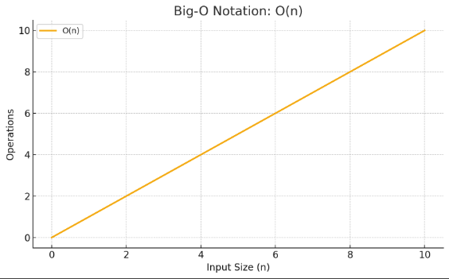
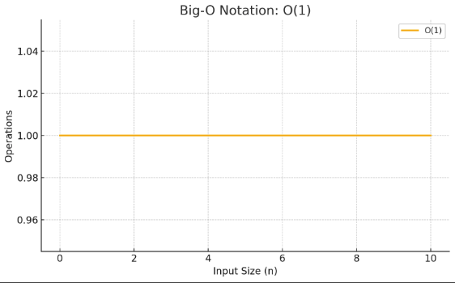

> 해당 블로그 글은 [감자님의 인프런 강의](https://inf.run/5fM4d)를 바탕으로 쓰여진 글입니다.

## 자료구조와 알고리즘이란?

프로그램은 일반적으로 자료구조와 알고리즘으로 나뉜다.

자료구조는 데이터가 어떤 구조로 저장되고 어떻게 사용되는지를 나타낸다. 우리가 한번쯤 코딩하면서 사용했었을 것이다. 가장 단순한 자료구조의 대표적인 예로 **변수**를 들 수 있다. 변수에 값을 저장하고 변수에 이름을 통해 값을 얻어오기도 한다. 또 다른 자료구조로는 **배열**도 존재한다. 배열에 숫자나 문자열과 같은 다양한 자료형들을 연속적으로 저장한다. 그리고 해당 배열의 요소에 값을 가져오는등 접근을 하려면 배열의 인덱스를 통하여 접근이 가능하다. 여기서 배열은 데이터에 접근하는 게 일반 변수와 조금 차이가 존재한다. 간단히 예제를 통해 살펴보자.

``` java
int a = 87;
int b = 70;
int c = 100;

double average = (a + b + c) / 3.0;
```

위와 같이 평균을 구하는 코드가 있다고 하자. 이것을 배열로 변경해보면 아래와 같을 것이다.

``` java
int[] arr = {87, 70, 100};

double average = 0;

for (int score : arr) {
    average += score;
}

average /= arr.length;
```

먼저 배열을 정의한 후, 총 점수를 담을 변수를 먼저 선언 후, 반복문을 통해 다 더한 후, 배열의 길이만큼 나눠주는 흐름이다. 즉, 위의 변수와 확연히 달라진 것을 볼 수 있다. 즉, 자료구조에 따라 처리 방법이 달라졌다. 그런데 어떻게 생각하면 이것은 당연한 것이다. 변수와 배열이 저장된 구조도 다르고 사용 방법도 다르기 때문이다. 또한 자료구조에 따라서는 상황에 따라 코드도 더 간단하게 할 수 있을 것이다.

다음으로 알고리즘에 대해 알아보자. 알고리즘은 어떤 문제를 해결하기 위한 확실한 방법을 말한다. 즉, 자료구조가 우리 도서관처럼 뭔가를 찾기 쉽게 정돈한 구조라면 알고리즘은 책을 빨리 찾기 위한 팻말 비슷한 거라고 생각하면 쉬울 것이다. 예를 들어보자. 평균을 우리는 어떻게 구할 수 있을까? 평균을 구하기 위해서는 확실한 방법, 즉 알고리즘이 필요하다. 만약 위의 코드처럼 변수 3개가 주어졌다면 3개의 값을 더한 후 3으로 나누는 것이 평균이다. 만약 배열이 존재한다면 배열의 원소들을 다 더한 후 배열의 길이만큼 나눠주면 된다. 즉, 설명서대로 했을 때 원하는 결과를 도출해낼 수 있는 것이 알고리즘이다.

우리는 이렇게 변수와 배열을 통해 평균을 구해보았다. 데이터가 어떤 자료구조를 택했는지에 따라서 평균을 구하는 방식은 조금 달랐다. 즉, 자료구조에 따라 알고리즘이 달라진 셈이다. 이렇게 알고리즘은 자료구조에 많은 영향을 끼치게 된 것이다. 또한 하나의 자료구조에 여러 알고리즘으로도 해결이 가능하다. 만약 배열의 평균을 구하는 알고리즘이 배열의 원소를 다 더한 후 원소의 개수만큼 나누는 방법론과 배열의 각 요소들을 다 더한 후 3으로 나누는 방법론처럼 말이다. 우리가 수학 문제를 풀때 한 가지 풀이만 존재하지 않는다. 여러 풀이가 존재하는 것처럼 말이다.

알고리즘은 자료구조에 따라서 많이 달라지고 같은 자료구조라 하더라도 다양한 알고리즘들이 존재할 것이다. 따라서 우리가 코드를 작성할 때 먼저 자료구조를 선택하여 어떻게 저장할지 결정하고 이에 맞는 알고리즘으로 데이터를 가공하고 원하는 결과 값을 도출할 것이다.

## 시간복잡도

우리는 지금까지 평균을 구하는 문제에 대하여 변수와 배열이라는 자료구조를 이용하여 각각에 맞는 알고리즘으로 해결하였다. 또한 같은 자료구조를 사용하더라도 마치 수학문제처럼 다양한 알고리즘이 존재하기 마련이다. 우리가 수학문제를 풀때 더 효율적인 방법으로 푸는것처럼 자료구조도 더 좋은 알고리즘을 사용해야 할 것이다.

그렇다면 더 좋은 알고리즘은 무엇일까? 아마 상황에 따라 다르긴 하겠지만 메모리를 극악으로 효율적으로 관리해야하는 상황이라면 메모리를 더 적게 사용하는 알고리즘이 더 좋은 알고리즘이고 만약 속도가 더 빠르게 관리하는 것이 중요하다면 속도가 빠른 알고리즘이 더 좋은 알고리즘일 것이다. 이렇게 상황마다 다르긴 하지만 일반적으로 알고리즘의 속도를 성능의 척도로 삼기는 한다. 이를 **시간 복잡도**라고 부른다.

> ✅ 꿀팁
>
> 메모리를 효율적으로 사용하는 것을 성능의 척도로 삼는 방식을 **공간 복잡도**라고 부른다.

시간 복잡도는 무엇일까? 시간 복잡도란 특정 알고리즘이 어떤 문제를 해결하는 데 걸리는 시간을 의미한다. 하지만 시간을 측정해서 알고리즘을 평가하기엔 현실적으로 어려움이 존재한다. 그 이유는 간단하다. 사용자마다 처해진 환경이 다르기 때문이다. 즉, 사용자마다 컴퓨터라던지 네트워크 속도라던지 전부 다르기 때문이다. 즉, 같은 알고리즘을 쓰더라도 누구는 좋은 성능을 누구는 그리 좋지 못한 성능이 나올 수 있을 것이다. 따라서 알고리즘을 평가할 때는 시간을 측정하는 것이 아닌 코드에서 성능적으로 이슈가 될 부분들을 찾아 실행시간을 예측해보는 것이다.

그러면 코드에서 성능적으로 이슈되는 부분을 어떤게 있을까? 정답은 **반복문**이다. 반복문이 여러번 반복하면 이에 따라 실행시간이 점점 길어질 것이다. 따라서 특정 알고리즘의 성능을 평가하려면 해당 알고리즘의 반복문을 보고 성능을 평가하곤 한다. 예를 들어보자. 만약 주어진 배열에 숫자 5를 찾아보라는 요구사항이 있다고 하자. 우리는 이런 요구사항에 배열의 0번 인덱스부터 마지막까지 5인지 비교해서 찾아보는 방법론이 존재할 것이다. 해당 방법론은 운이 좋은면 바로 찾을수는 있겠지만 만약 존재하지 않는다면 최악의 성능을 이끌 것이다. 이렇듯 때에 따라서 성능이 달라질 것이다. 그래서 경우를 나눠서 성능을 평가하는데 최선은 Big-Ω, 최악의 경우는 Big-O, 평균의 경우는 Big-θ라고 표현한다.

보통 이 3가지중에 Big-O랑 Big-θ를 많이 사용하는데 보통은 Big-O를 많이 사용한다. 그럼 위의 요구사항에 대해 우리가 결정한 알고리즘 성능평가를 진행해보자. 배열의 0번 인덱스부터 마지막 인덱스까지 찾으므로 최악의 경우 모든 원소들을 다 뒤져보는 것이다. 즉, 빅오표기법으로 O(n)이라고 한다. 그림으로 따지면 아래와 같은 1차 함수 모양이 나오게 된다.



이렇게 1차함수 모양을 띄고 있는 O(n)은 선형시간 알고리즘이라고도 부른다. 이 외에도 다양한 알고리즘들이 존재한다.

- 상수시간 알고리즘: O(1)



이외에도 O(logn), O(nlogn), O(n^2), O(2^n), O(n!)등이 존재한다.

그러면 마지막으로 빅오 표기법 특징을 알아보자.

- 입력이 늘어날때, 계산량이 늘어나는 척도를 나타내기 위한 것이다.
- 만약 2n^2 + 2n + logn + 100에 따라 늘어나는 수식이 존재한다면 많은 영향을 미치는 항만 표기한다. 또한 최고차항 계수는 제거한다. 즉, O(n^2)으로 표현한다.

## 자바스크립트 실행 환경 구축

강의에서는 자바스크립트 환경을 구축해 알고리즘을 구현하는데 필요한 것들을 알려주신다. 하지만 나는 실제 코딩테스트를 본다고 해도 자바로 볼 것이기에 자바로 진행해볼까 한다.

> 잘못된 지식이 있을 경우 댓글로 남겨주시면 빠르게 반영하겠습니다!