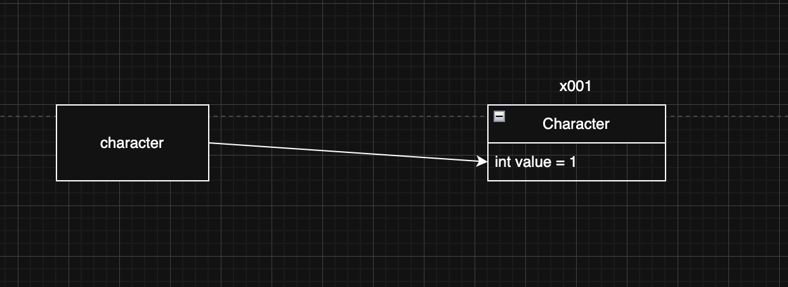
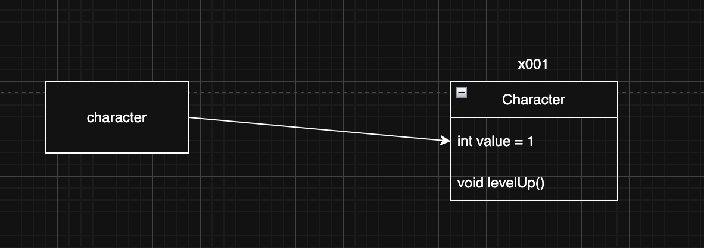

> 해당 블로그 글은 [영한님의 인프런 강의](https://inf.run/PuC6W)를 바탕으로 쓰여진 글입니다.

## 절차 지향 프로그래밍1 - 시작

프로그래밍 방식에는 절차 지향 프로그래밍과 객체 지향 프로그래밍으로 나뉜다.

### 절차 지향 프로그래밍

- 절차 지향 프로그래밍은 이름 그대로 절차를 지향한다. 쉽게 이야기해서 실행 순서를 중요하게 생각하는 방식이다.
- 절차 지향 프로그래밍은 프로그램의 흐름을 순차적으로 따르며 처리하는 방식이다. 즉, "어떻게"를 중심으로 프로그래밍 한다.

### 객체 지향 프로그래밍

- 객체 지향 프로그래밍은 이름 그대로 객체를 지향한다. 쉽게 이야기해서 객체를 중요하게 생각하는 방식이다.
- 객체 지향 프로그래밍은 실제 세계의 사물이나 사건을 객체로 보고, 이러한 객체들 간의 상호작용을 중심으로 프로그래밍하는 방식이다. 즉, "무엇을" 중심으로 프로그래밍 한다.

그러면 우리가 이제까지 예제 코드들은 전부 객체 지향 프로그래밍인것 같다. 왜냐하면 객체를 사용했기 때문이다. 하지만 실제 우리가 구현했던 것은 전부 절차 지향 프로그래밍이다. 단순히 객체만 사용한다고 해서 객체 지향 프로그래밍이 아닌 것이다.

절차 지향 프로그래밍과 객체 지향 프로그래밍의 큰 차이는 데이터와 행동이 분리되어 있냐 아니냐이다. 절차 지향 프로그래밍은 데이터와 행동이 분리되어 있고 객체 지향 프로그래밍은 데이터와 행동이 하나의 객체 안에 묶여져 있다.

그럼 절차 지향 예제 코드를 점점 객체 지향 프로그래밍이로 전환해보자.

``` java
package oop1;

public class MusicPlayerMain {
    public static void main(String[] args) {
        int volume = 0;
        boolean isOn = false;

        isOn = true;
        System.out.println("음악 플레이어를 시작합니다.");

        volume++;
        System.out.println("음악 플레이어 볼륨: " + volume);

        volume++;
        System.out.println("음악 플레이어 볼륨: " + volume);

        volume--;
        System.out.println("음악 플레이어 볼륨: " + volume);

        System.out.println("음악 플레이어 상태 확인");

        if (isOn) {
            System.out.println("음악 플레이어 ON, 볼륨: " + volume);
        } else {
            System.out.println("음악 플레이어 OFF");
        }

        isOn = false;
        System.out.println("음악 플레이어를 종료합니다.");
    }
}
```

지금 예제는 음악 플레이어를 키고 볼륨을 증가 및 감소하고 종료하는 순서대로 작성된 절차 지향 프로그래밍이다. 이것을 발전시켜보자.

## 절차 지향 프로그래밍2 - 데이터 묶음

이제 객체 지향 프로그래밍으로 전환에 있어서 일단 객체를 만들고 절차 지향 프로그래밍에 있는 변수를 객체에 넣어보자.

> ⚠️ 주의
>
> 그냥 변수를 무조건 객체에 넣는 것이 아니다. 해당 변수가 객체와 관련이 있어야 넣을 수 있다.

그러면 리팩토링을 해보면 아래와 같이 분리를 할 수 있다.

``` java
package oop1;

public class MusicPlayerData {
    int volume;
    boolean isOn;
}
```

``` java
package oop1;

public class MusicPlayerMain {
    public static void main(String[] args) {
        MusicPlayerData data = new MusicPlayerData();

        data.isOn = true;
        System.out.println("음악 플레이어를 시작합니다.");

        data.volume++;
        System.out.println("음악 플레이어 볼륨: " + data.volume);

        data.volume++;
        System.out.println("음악 플레이어 볼륨: " + data.volume);

        data.volume--;
        System.out.println("음악 플레이어 볼륨: " + data.volume);

        System.out.println("음악 플레이어 상태 확인");

        if (data.isOn) {
            System.out.println("음악 플레이어 ON, 볼륨: " + data.volume);
        } else {
            System.out.println("음악 플레이어 OFF");
        }

        data.isOn = false;
        System.out.println("음악 플레이어를 종료합니다.");
    }
}
```

## 절차 지향 프로그래밍3 - 메서드 추출

이제 메서드를 분리해보자. 위의 main 메서드가 있는 코드는 기능들이 중복되는 부분이 있다. 또한 이런 기능들은 나중에 어디선가 쓰일 가능성이 있다.

``` java
package oop1;

public class MusicPlayerMain3 {
    public static void main(String[] args) {
        MusicPlayerData data = new MusicPlayerData();

        on(data);

        volumeUp(data);
        volumeUp(data);
        volumeDown(data);

        showStatus(data);

        off(data);
    }

    static void off(MusicPlayerData data) {
        data.isOn = false;
        System.out.println("음악 플레이어를 종료합니다.");
    }

    static void showStatus(MusicPlayerData data) {
        System.out.println("음악 플레이어 상태 확인");

        if (data.isOn) {
            System.out.println("음악 플레이어 ON, 볼륨: " + data.volume);
        } else {
            System.out.println("음악 플레이어 OFF");
        }
    }

    static void volumeDown(MusicPlayerData data) {
        data.volume--;
        System.out.println("음악 플레이어 볼륨: " + data.volume);
    }

    static void volumeUp(MusicPlayerData data) {
        data.volume++;
        System.out.println("음악 플레이어 볼륨: " + data.volume);
    }

    static void on(MusicPlayerData data) {
        data.isOn = true;
        System.out.println("음악 플레이어를 시작합니다.");
    }
}
```

이렇게 하니 메서드 이름만 봐도 뭐하는 놈인지 파악하기 쉽고 흐름 자체도 한눈에 들어온다. 모듈화가 된 것이다. 즉, 다음과 같은 장점이 생긴 것이다.

- **중복 제거:** 로직 중복이 제거되었다. 같은 로직이 필요하면 해당 메서드를 여러번 호출하면 된다.
- **변경 영향 범위:** 기능을 수정할 때 해당 메서드 내부만 변경하면 된다.
- **메서드 이름 추가:** 메서드 이름을 통해 코드를 더 쉽게 이해할 수 있다.

> 📚 용어 정리
>
> 쉽게 이야기해서 레고 블럭을 생각하면 된다. 필요한 블럭을 가져다 꼽아서 사용할 수 있다. 여기서는 음악 플레이어의 기능이 필요하면 해당 기능을 메서드 호출 만으로 손쉽게 사용할 수 있다. 이제 음악 플레이어와 관련된 메서드를 조립해서 프로그램을 작성할 수 있다.

### 절차 지향 프로그래밍의 한계

이제 위의 코드는 객체 지향일까? 아니다. 왜냐하면 데이터와 기능이 분리되어 있기 때문이다. 데이터와 기능이 분리되어 있으면 여러 문제가 있다. 예를 들어, 데이터의 명이 변경되면 클래스에도 변경해줘야 하고 main 메서드쪽에도 변경을 해줘야 한다. 또한, 데이터가 추가 및 삭제가 될 때마다 main 메서드쪽에 와서 확인을 해줘야 한다. 즉, 유지보수 관점에서 관리 포인트가 2개가 되는 것이다. 즉, 유지보수성이 떨어진다. 이렇게 데이터와 기능이 밀접한 관계가 있을 때는 묶는 것이 좋다. 물론 기능이 있다해서 무조건 묶는게 아니고 해당 기능이 객체와 관련이 있는지 유무도 생각해보는 것이 좋다.

## 클래스와 메서드

클래스는 데이터인 멤버 변수 뿐 아니라 기능 역할을 하는 메서드도 포함할 수 있다. 그러면 기존 음악플레이어 예제를 메서드 분리를 하기 전에 어떻게 메서드가 분리되는지 하나의 게임 예제를 통해 확인해보자.

``` java
public class Character {
    int level = 1;
}
```

``` java
public class GameMain {
    public static void main(String[] args) {
        Character character = new Character();
        levelUp(character);
        levelUp(character);
        levelUp(character);
    }

    static void levelUp(Character character) {
        character.level++;
    }
}
```

위의 코드가 있다고 하자. 데이터와 메서드가 분리되어 있다. `levelUp`이라는 메서드를 통해 `Character`라는 참조값을 통해 level이라는 필드의 값을 하나씩 증가하는 로직이다. 아래 그림처럼 말이다.



이것을 객체 지향적으로 리팩토링 해보자.

``` java
public class Character {
    int level = 1;

    public void levelUp() {
        level++;
    }
}
```

``` java
public class GameMain {
    public static void main(String[] args) {
        Character character = new Character();
        character.levelUp();
        character.levelUp();
        character.levelUp();
    }
}
```

레벨업이라는 행동은 캐릭터와 연관이 있고 안에 쓰이는 데이터도 캐릭터 클래스 안에 필드이다. 따라서 캐릭터 안에 메서드를 선언해서 사용하니 조금 더 명확해졌다. 기존에는 그냥 레벨업을 하라였지만 지금은 캐릭터가 레벨업을 한다라고 볼 수 있고 인간이 보기에 직관적이였다.

> ✅ 참고
>
> 클래스 안에 메서드를 선언할 때 `static`키워드를 사용하지 않았다. `static` 키워드를 사용하면 객체 생성 없이 사용할 수 있다라는 뜻인데 지금은 메서드를 이용할 때 객체를 반드시 생성해야 하므로 `static` 키워드를 제외시킨 것이다.

인스턴스의 메서드를 호출하는 방법은 변수 접근하는 것과 같이 `.`을 이용하면 된다.



`levelUp`메서드를 사용하려면 character에 먼저 접근해야 한다. 해당 참조값을 통해 접근 후에 `levelUp`이라는 메서드가 있는지 확인한다. 있으면 그 안에 로직을 수행하는데 그 객체가 가지고 있는 level이라는 변수를 증가시키고 빠져 나온다. 물론 반환값이 있다면 반환값을 반환한다.

### 정리

- 클래스는 속성(데이터, 멤버 변수)과 기능(메서드)을 정의할 수 있다.
- 객체는 자신의 메서드를 통해 자신의 멤버 변수에 접근할 수 있다.
    - 객체의 메서드 내부에서 접근하는 멤버 변수는 객체 자신의 멤버 변수이다.

## 객체 지향 프로그래밍

그러면 이를 바탕으로 이전 음악 플레이어 코드를 객체 지향적으로 작성해보자. 그러면 먼저 음악 플레이어라는 객체를 만들어야 한다. 그리고 기능을 객체 안에 넣어보자.

``` java
package oop;

public class MusicPlayer {
    int volume;

    boolean isOn;

    void on() {
        isOn = true;
        System.out.println("음악 플레이어를 시작합니다.");
    }

    void off() {
        isOn = false;
        System.out.println("음악 플레이어를 종료합니다.");
    }

    void volumeUp() {
        volume++;
        System.out.println("음악 플레이어 볼륨: " + volume);
    }

    void volumeDown() {
        volume--;
        System.out.println("음악 플레이어 볼륨: " + volume);
    }

    void showStatus() {
        System.out.println("음악 플레이어 상태 확인");

        if (isOn) {
            System.out.println("음악 플레이어 ON, 볼륨: " + volume);
        } else {
            System.out.println("음악 플레이어 OFF");
        }
    }
}
```

그리고 main 메서드를 작성해보자.

``` java
package oop;

public class MusicPlayerMain4 {
    public static void main(String[] args) {
        MusicPlayer player = new MusicPlayer();

        player.on();

        player.volumeUp();
        player.volumeUp();
        player.volumeDown();

        player.showStatus();

        player.off();
    }
}
```

이제 기능과 데이터가 한 곳에 모여 있으니 데이터 명이 바뀌거나 로직이 바뀌어도 사용하는 쪽에서는 변경없이 사용하면 된다. 즉, 사용하는 입장에서는 안의 내부적인 코드를 몰라도 사용이 가능하다. 즉, **캡슐화**가 잘 이루어져 있다.

> ✅ 캡슐화
>
> 속성과 기능을 하나로 묶어서 필요한 기능을 메서드를 통해 외부에 제공하는 것을 캡슐화라 한다.

> 잘못된 지식이 있을 경우 댓글로 남겨주시면 빠르게 반영하겠습니다!