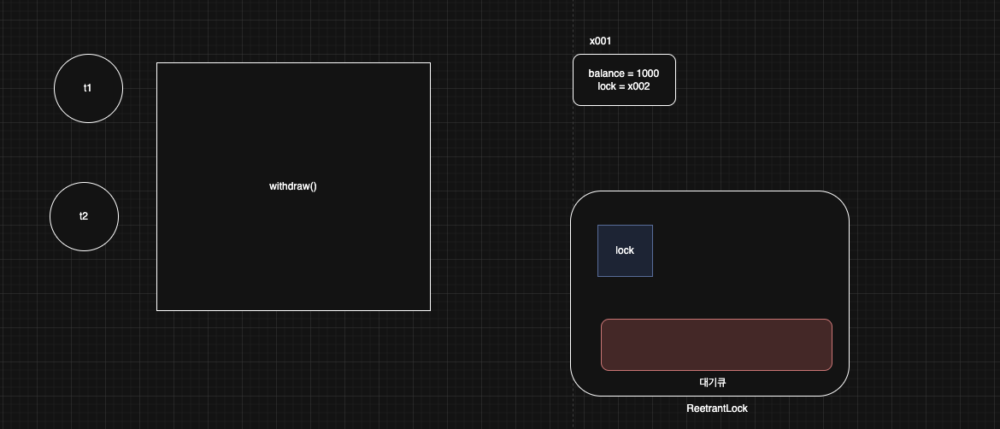
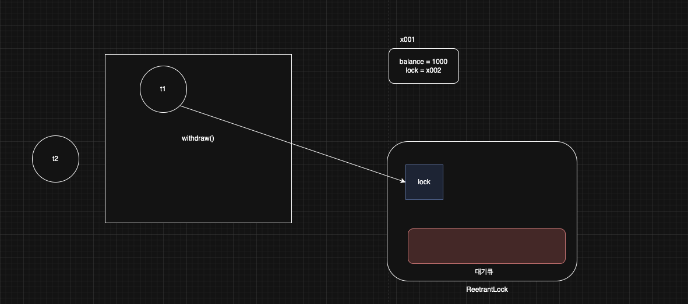
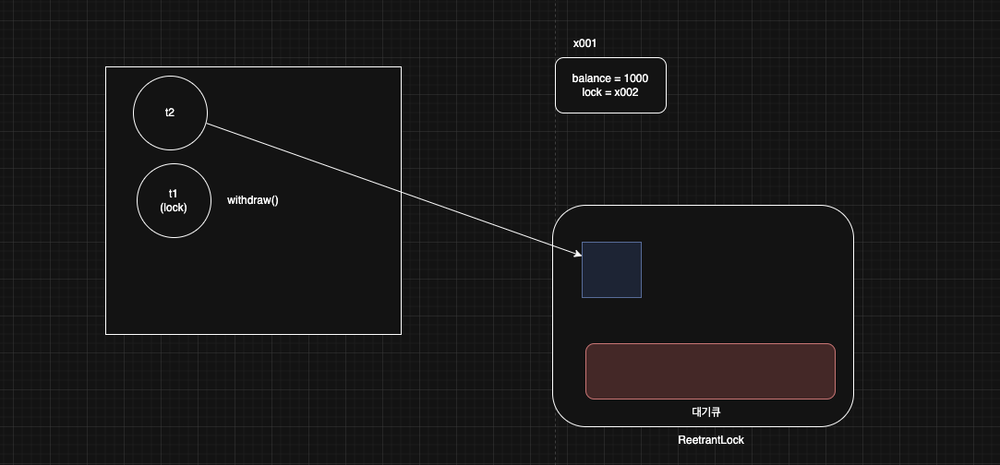
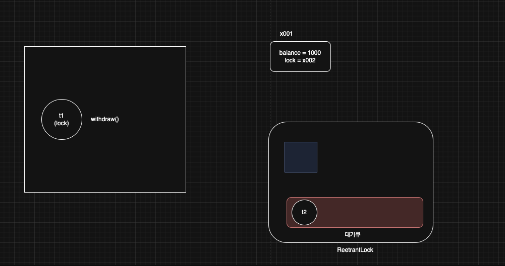
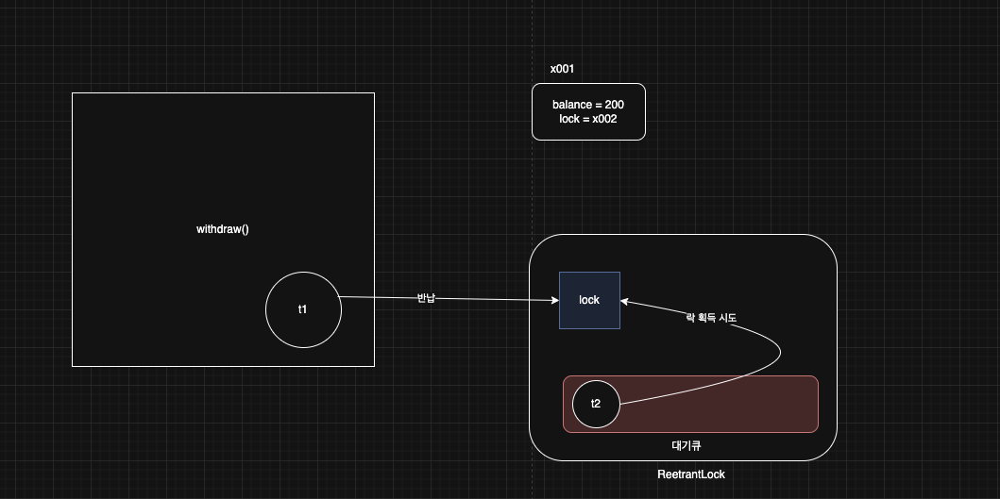
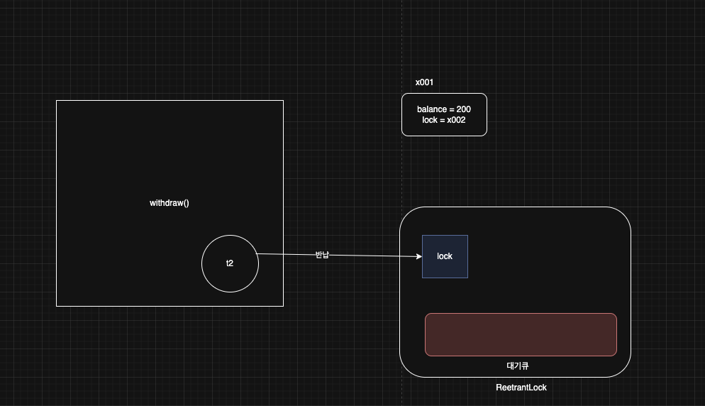

> 해당 블로그 글은 [영한님의 인프런 강의](https://inf.run/6oSgn)를 바탕으로 쓰여진 글입니다.

## LockSupport1

`synchronized`는 자바 1.0부터 제공되는 매우 편리한 기능이지만, 다음과 같은 한계가 있다.

- 무한 대기: `BLOCKED` 상태의 스레드는 락이 풀릴 때 까지 무한 대기한다.
  - 특정 시간까지만 대기하는 타임아웃X
  - 중간에 인터럽트X
- 공정성: 락이 돌아왔을 때 `BLOCKED` 상태의 여러 스레드 중에 어떤 스레드가 락을 획득할 지 알 수 없다. 최악의 경우 특정 스레드가 너무 오랜기간 락을 획득하지 못할 수 있다.

이런 문제를 해결하기 위해 자바 1.5부터 `java.util.concurrent` 라는 동시성 문제 해결을 위한 라이브러리 패키지가 추가된다. 이중에 `LockSupport`에 대해 알아보자.

### LockSupport 기능

- `park()`: 스레드를 `WAITING`상태로 변경한다.
- `parkNanos(nanos)` : 스레드를 나노초 동안만 `TIMED_WAITING` 상태로 변경한다.
  - 지정한 나노초가 지나면 `TIMED_WAITING` 상태에서 빠져나오고 `RUNNABLE` 상태로 변경된다.
- `unpark(thread)` : `WAITING` 상태의 대상 스레드를 `RUNNABLE` 상태로 변경한다.

``` java
package thread.sync.lock;

import java.util.concurrent.locks.LockSupport;

import static util.MyLogger.log;
import static util.ThreadUtils.sleep;

public class LockSupportMainV1 {
    public static void main(String[] args) {
        Thread thread1 = new Thread(new ParkTask(), "Thread-1");
        thread1.start();

        sleep(100);
        log("Thread-1 state: " + thread1.getState());

        log("main -> unpark(Thread-1)");
        LockSupport.unpark(thread1);
        // thread1.interrupt();
    }

    static class ParkTask implements Runnable {
        @Override
        public void run() {
            log("park 시작");

            LockSupport.park();

            log("park 종료, state: " + Thread.currentThread().getState());
            log("인터럽트 상태: " + Thread.currentThread().isInterrupted());
        }
    }
}
```

위의 코드를 보면 `main` 스레드가 `Thread-1`을 생성하고 100ms간 `TIMED_WAITING` 상태가 된다. 그 동안 `ParkTask`가 로그를 찍고 `LockSupport.park()`를 통해 대기 상태가 된다. 그리고 `main` 스레드가 `unpark()`를 통하여 `RUNNABLE`상태로 만들어준다. 하지만 이 방법 말고 대기상태의 스레드를 깨울 수 있는 방법이 있다. 바로 인터럽트를 거는 것이다. 하지만 인터럽트의 단점이라고 말하면 인터럽트 상태가 우리가 직접 `Thread.interrupted()`를 호출해주던가 상태값을 변경해줘야 한다.

## LockSupport2

`parkNanos(nanos)`를 호출하면 `unpark()`없이 특정 시간만 지나면 자동으로 스레드가 깨어나는 역할을 한다. 즉, `park()` 메서드와 다르게 `TIMED_WAITING`상태였다가 특정 시간이 지나면 `RUNNABLE` 상태가 되는 것이다.

### BLOCKED vs WAITING

#### 인터럽트

- `BLOCKED` 상태는 인터럽트가 걸려도 대기 상태를 빠져나오지 못한다. 여전히 `BLOCKED` 상태이다.
- `WAITING`, `TIMED_WAITING` 상태는 인터럽트가 걸리면 대기 상태를 빠져나온다. 그래서 `RUNNABLE` 상태로 변한다.

#### 용도

- `BLOCKED` 상태는 자바의 `synchronized`에서 락을 획득하기 위해 대기할 때 사용된다.
- `WAITING`, `TIMED_WAITING` 상태는 스레드가 특정 조건이나 시간 동안 대기할 때 발생하는 상태이다.
- `WAITING` 상태는 다양한 상황에서 사용된다. 예를 들어, `Thread.join()`, `LockSupport.park()`, `Object.wait()` 와 같은 메서드 호출 시 `WAITING` 상태가 된다.
- `TIMED_WAITING` 상태는 `Thread.sleep(ms)`, `Object.wait(long timeout)`, `Thread.join(long millis)`, `LockSupport.parkNanos(ns)` 등과 같은 시간 제한이 있는 대기 메서드를 호출할 때 발생한다.

### LockSupport 정리

`LockSupport`를 사용하면 스레드를 `WAITING`, `TIMED_WAITING` 상태로 변경할 수 있고, 또 인터럽트를 받아서 스레드를 깨울 수도 있다. 이런 기능들을 잘 활용하면 `synchronized`의 단점인 무한 대기 문제를 해결할 수 있을 것 같다. `synchronized`의 문제점중 하나인 무한대기는 뭔가 `parkNanos(nanos)` 메서드로 해결할 수 있을 것 같고 인터럽트 발생이 안되는 문제는 `park()`와 `parkNanos(nanos)`를 통해 해결할 수 있을 것 같다.

락이라는 클래스를 만들고, 특정 스레드가 먼저 락을 얻으면 `RUNNABLE`로 실행하고, 락을 얻지 못하면 `park()`를 사용해서 대기 상태로 만드는 것이다. 그리고 스레드가 임계 영역의 실행을 마치고 나면 락을 반납하고, `unpark()`를 사용해서 대기 중인 다른 스레드를 깨우는 것이다. 물론 `parkNanos()`를 사용해서 너무 오래 대기하면 스레드가 스스로 중간에 깨어나게 할 수도 있다. 하지만 이런 기능을 직접 구현하기는 매우 어렵다. 일단 수 많은 스레드들 중에 특정 스레드를 지정하여 락을 주고 나머지는 대기시켜야 하며 대기시키는 알고리즘도 구현해야 하고 우선순위 로직도 만들어야 하는 매우 힘든 작업이 있다.

즉, 한마디로 `LockSupport`는 너무 저수준이다. `synchronized`처럼 더 고수준의 기능이 필요하다. 그래서 등장한 것이 `Lock` 인터페이스와 `ReetrantLock`이다.

## ReentrantLock - 이론

자바는 1.0부터 존재한 `synchronized`와 `BLOCKED` 상태를 통한 통한 임계 영역 관리의 한계를 극복하기 위해 자바 1.5부터 `Lock` 인터페이스와 `ReentrantLock` 구현체를 제공한다.

``` java
package java.util.concurrent.locks;

public interface Lock {
  void lock();
  void lockInterruptibly() throws InterruptedException;
  boolean tryLock();
  boolean tryLock(long time, TimeUnit unit) throws InterruptedException;
  void unlock();
  Condition newCondition();
}
```

`Lock` 인터페이스는 동시성 프로그래밍에서 쓰이는 안전한 임계 영역을 위한 락을 구현하는데 사용된다.

- `void lock()`
  - 락을 획득한다. 만약 다른 스레드가 이미 락을 획득했다면, 락이 풀릴 때까지 현재 스레드는 대기(`WAITING`)한다. 이 메서드는 인터럽트에 응답하지 않는다.
  - 예) 맛집에 한번 줄을 서면 끝까지 기다린다. 친구가 다른 맛집을 찾았다고 중간에 연락해도 포기하지 않고 기다린다.

> ⚠️ 주의
>
> 여기서 사용하는 락은 객체 내부에 있는 모니터 락이 아니다! `Lock` 인터페이스와 `ReentrantLock`이 제공하는 기능이다! 모니터 락과 `BLOCKED`상태는 `synchronized`에서만 사용된다.

- `void lockInterruptibly()`
  - 락 획득을 시도하되, 다른 스레드가 인터럽트할 수 있도록 한다. 만약 다른 스레드가 이미 락을 획득했다면, 현재 스레드는 락을 획득할 때까지 대기한다. 대기 중에 인터럽트가 발생하면 `InterruptedException`이 발생하며 락 획득을 포기한다.
  - 예) 맛집에 한번 줄을 서서 기다린다. 다만 친구가 다른 맛집을 찾았다고 중간에 연락하면 포기한다.
- `boolean tryLock()`
  - 락 획득을 시도하고, 즉시 성공 여부를 반환한다. 만약 다른 스레드가 이미 락을 획득했다면 `false`를 반환하고, 그렇지 않으면 락을 획득하고 `true`를 반환한다.
  - 예) 맛집에 대기 줄이 없으면 바로 들어가고, 대기 줄이 있으면 즉시 포기한다.
- `boolean tryLock(long time, TimeUnit unit)`
  - 주어진 시간 동안 락 획득을 시도한다. 주어진 시간 안에 락을 획득하면 `true`를 반환한다. 주어진 시간이 지나도 락을 획득하지 못한 경우 `false`를 반환한다. 이 메서드는 대기 중 인터럽트가 발생하면 `InterruptedException`이 발생하며 락 획득을 포기한다.
  - 예) 맛집에 줄을 서지만 특정 시간 만큼만 기다린다. 특정 시간이 지나도 계속 줄을 서야 한다면 포기한다. 친구가 다른 맛집을 찾았다고 중간에 연락해도 포기한다.
- `void unlock()`
  - 락을 해제한다. 락을 해제하면 락 획득을 대기 중인 스레드 중 하나가 락을 획득할 수 있게 된다.
  - 락을 획득한 스레드가 호출해야 하며, 그렇지 않으면 `IllegalMonitorStateException`이 발생할 수 있다.
  - 예) 식당안에 있는 손님이 밥을 먹고 나간다. 식당에 자리가 하나 난다. 기다리는 손님께 이런 사실을 알려주어야 한다. 기다리던 손님중 한 명이 식당에 들어간다.
- `Condition newCondition()`
  - `Condition` 객체를 생성하여 반환한다. `Condition` 객체는 락과 결합되어 사용되며, 스레드가 특정 조건을 기다리거나 신호를 받을 수 있도록 한다. 이는 `Object` 클래스의 `wait`, `notify`, `notifyAll` 메서드와 유사한 역할을 한다.

> ✅ 참고
>
> `lock()` 메서드는 인터럽트에 응하지 않는다고 되어있다. 이 메서드의 의도는 인터럽트가 발생해도 무시하고 락을 기다리는 것이다. 앞서 대기(`WAITING`) 상태의 스레드에 인터럽트가 발생하면 대기 상태를 빠져나온다고 배웠다. 그런데 `lock()` 메서드의 설명을 보면 대기(`WAITING`) 상태인데 인터럽트에 응하지 않는다고 되어있다. 어떻게 된 것일까? `lock()`을 호출해서 락을 얻기 위해 대기중인 스레드에 인터럽트가 발생하면 순간 대기 상태를 빠져나오는 것은 맞다. 그래서 아주 짧지만 `WAITING`->`RUNNABLE` 이 된다. 그런데 `lock()` 메서드 안에서 해당 스레드를 다시 WAITING` 상태로 강제로 변경해버린다. 이런 원리로 인터럽트를 무시하는 것이다.

이렇게 `Lock` 인터페이스가 제공하는 메서드를 활용하여 `synchronized`의 무한대기 문제는 해결을 할 수 있을 것 같다. 이제 다음 문제인 공정성 문제는 어떻게 해결할까? 이것은 `Lock` 인터페이스의 구현체인 `ReetrantLock`을 사용하면 된다. `ReentrantLock` 락은 공정성(fairness) 모드와 비공정(non-fair) 모드로 설정할 수 있으며, 이 두 모드는 락을 획득하는 방식에서 차이가 있다.

### 비공정 모드

- 기본모드
- 성능 우선: 락을 획득하는 속도가 빠르다.
- 선점 가능: 새로운 스레드가 기존 대기 스레드보다 먼저 락을 획득할 수 있다.
- 기아 현상 가능성: 특정 스레드가 계속해서 락을 획득하지 못할 수 있다.

### 공정 모드

생성자에서 `true` 를 전달하면 된다. 예) `new ReentrantLock(true)`

- 공정성 보장: 대기 큐에서 먼저 대기한 스레드가 락을 먼저 획득한다.
- 기아 현상 방지: 모든 스레드가 언젠가 락을 획득할 수 있게 보장된다.
- 성능 저하: 락을 획득하는 속도가 느려질 수 있다.

즉, 비공정 모드는 성능을 중시하고, 스레드가 락을 빨리 획득할 수 있지만, 특정 스레드가 계속해서 락을 획득하지 못 할 수 있다. 하지만 공정 모드는 스레드가 락을 획득하는 순서를 보장하여 공정성을 중시하지만, 성능이 저하될 수 있다.

## ReentrantLock - 활용

그럼 이전의 출금 계좌 예제를 `ReetrantLock`을 이용하여 변경해보자.

``` java
package thread.sync;

import java.util.concurrent.locks.Lock;
import java.util.concurrent.locks.ReentrantLock;

import static util.MyLogger.log;
import static util.ThreadUtils.sleep;

public class BankAccountV4 implements BankAccount {

    private int balance;

    private final Lock lock = new ReentrantLock();

    public BankAccountV4(int initialBalance) {
        this.balance = initialBalance;
    }

    @Override
    public boolean withdraw(int amount) {
        log("거래 시작: " + getClass().getSimpleName());

        lock.lock();

        try {
            log("[검증 시작] 출금액: " + amount + ", 잔액: " + balance);

            if (balance < amount) {
                log("[검증 실패] 출금액: " + amount + ", 잔액: " + balance);
                return false;
            }

            log("[검증 완료] 출금액: " + amount + ", 잔액: " + balance);
            sleep(1000);

            balance -= amount;

            log("[출금 완료] 출금액: " + amount + ", 잔액: " + balance);
        } finally {
            lock.unlock();
        }

        log("거래 종료");

        return true;
    }

    @Override
    public int getBalance() {
        lock.lock();

        try {
            return balance;
        } finally {
            lock.unlock();
        }
    }
}
```

`synchronized` 코드 블록이 사라지는 대신에 `lock()` 메서드로 락을 걸고 작업 수행 후 `finally`로 `unlock()` 메서드를 호출하였다. 여기서 `lock()` 메서드부터 `unlock()` 메서드까지를 **임계영역**이라고 한다.

> ⚠️ 주의
>
> 여기서 사용하는 락은 객체 내부에 있는 모니터 락이 아니다! `Lock` 인터페이스와 `ReentrantLock`이 제공하는 기능이다! 모니터 락과 `BLOCKED` 상태는 `synchronized`에서만 사용된다.

그러면 그림을 통해 확인해보자.



- `t1`, `t2`가 출금을 시작한다. 여기서는 `t1`이 약간 먼저 실행된다고 가정하겠다.
- `ReenterantLock` 내부에는 락과 락을 얻지 못해 대기하는 스레드를 관리하는 대기 큐가 존재한다.



- `t1` 스레드가 먼저 실행되어 `lock()` 메서드를 호출함으로 `ReetrantLock`에 락 획득을 시도하려 한다.
- `lock`이 존재하므로 `t1` 스레드가 락을 획득한다. 락을 획득하였으니 스레드 상태는 여전히 `RUNNABLE` 상태일 것이다.



- `t1` 스레드가 어느정도 수행할 때 쯤 `t2` 스레드가 `lock()` 메서드를 만나 락 획득 시도를 하려고 한다.



- 하지만 락이 없으므로 `t2` 스레드 상태가 `WAITING` 상태가 되고, 대기 큐에서 관리된다.
  - `LockSupoort.park()`가 내부에서 호출된다.

> ✅ 참고
>
> `tryLock(long time, TimeUnit unit)`와 같은 시간 대기 기능을 사용하면 `TIMED_WAITING`이 되고, 대기 큐에서 관리된다.



- `t1` : 임계 영역을 수행하고 나면 `lock.unlock()`을 호출한다.
  - t1이 락을 반납한다.
  - t1 스레드가 대기 큐의 스레드를 하나 깨운다. `LockSupoort.unpark(thread)`가 내부에서 호출된다.
  - 그러면 t2는 `RUNNABLE` 상태가 되면서 깨어난 스레드는 락 획득을 시도한다.
    - 이때 락을 획득하면 `lock.lock()`을 빠져나오면서 대기 큐에서도 제거된다.
    - 이때 락을 획득하지 못하면 다시 대기 상태가 되면서 대기 큐에 유지된다.
      - 참고로 락 획득을 시도하는 잠깐 사이에 새로운 스레드가 락을 먼저 가져갈 수 있다.
      - 공정 모드의 경우 대기 큐에 먼저 대기한 스레드가 먼저 락을 가져간다.



이제 t2도 임계영역을 수행하고 `unlock()` 메서드를 통해 락을 반납한다.

> ✅ 참고
>
> `volatile`를 사용하지 않아도 `Lock`을 사용할 때 접근하는 변수의 메모리 가시성 문제는 해결된다.

## ReentrantLock - 대기 중단

`ReentrantLock`을 사용하면 락을 무한 대기하지 않고, 중간에 빠져나오는 것이 가능하다. 심지어 락을 얻을 수 없다면 기다리지 않고 즉시 빠져나오는 것도 가능하다. 바로 `tryLock()` 메서드를 이용하면 된다.

``` java
package thread.sync;

import java.util.concurrent.locks.Lock;
import java.util.concurrent.locks.ReentrantLock;

import static util.MyLogger.log;
import static util.ThreadUtils.sleep;

public class BankAccountV5 implements BankAccount {

    private int balance;

    private final Lock lock = new ReentrantLock();

    public BankAccountV5(int initialBalance) {
        this.balance = initialBalance;
    }

    @Override
    public boolean withdraw(int amount) {
        log("거래 시작: " + getClass().getSimpleName());

        if (!lock.tryLock()) {
            log("[진입 실패] 이미 처리 중인 작업이 있습니다.");
            return false;
        }

        try {
            log("[검증 시작] 출금액: " + amount + ", 잔액: " + balance);

            if (balance < amount) {
                log("[검증 실패] 출금액: " + amount + ", 잔액: " + balance);
                return false;
            }

            log("[검증 완료] 출금액: " + amount + ", 잔액: " + balance);
            sleep(1000);

            balance -= amount;

            log("[출금 완료] 출금액: " + amount + ", 잔액: " + balance);
        } finally {
            lock.unlock();
        }

        log("거래 종료");

        return true;
    }

    @Override
    public int getBalance() {
        lock.lock();

        try {
            return balance;
        } finally {
            lock.unlock();
        }
    }
}
```

기존의 코드에서 `lock()` 메서드 대신 `tryLock()`로 변경하였다. 처음에 t1 스레드가 접근하여 `tryLock()`을 만나면 바로 락을 획득하여 임계영역에 접근하지만 이후 t2가 접근하면 락이 없으므로 바로 나가버린다. 즉, 결과는 t1 스레드만 수행되게끔 할 수 있다.

해당 방식 말고 `tryLock(long time, TimeUnit unit)`으로 특정 시간만큼은 기달리고 그 시간이 초과되면 바로 나가버리게끔 할 수 있다. 아래와 같이 작성하면 된다.

``` java
package thread.sync;

import java.util.concurrent.TimeUnit;
import java.util.concurrent.locks.Lock;
import java.util.concurrent.locks.ReentrantLock;

import static util.MyLogger.log;
import static util.ThreadUtils.sleep;

public class BankAccountV6 implements BankAccount {

    private int balance;

    private final Lock lock = new ReentrantLock();

    public BankAccountV6(int initialBalance) {
        this.balance = initialBalance;
    }

    @Override
    public boolean withdraw(int amount) {
        log("거래 시작: " + getClass().getSimpleName());

        try {
            if (!lock.tryLock(500, TimeUnit.MILLISECONDS)) {
                log("[진입 실패] 이미 처리 중인 작업이 있습니다.");
                return false;
            }
        } catch (InterruptedException e) {
            throw new RuntimeException(e);
        }

        try {
            log("[검증 시작] 출금액: " + amount + ", 잔액: " + balance);

            if (balance < amount) {
                log("[검증 실패] 출금액: " + amount + ", 잔액: " + balance);
                return false;
            }

            log("[검증 완료] 출금액: " + amount + ", 잔액: " + balance);
            sleep(1000);

            balance -= amount;

            log("[출금 완료] 출금액: " + amount + ", 잔액: " + balance);
        } finally {
            lock.unlock();
        }

        log("거래 종료");

        return true;
    }

    @Override
    public int getBalance() {
        lock.lock();

        try {
            return balance;
        } finally {
            lock.unlock();
        }
    }
}
```

위의 코드는 처음에 t1 스레드가 접근하여 락을 획득하고 그 후 t2가 접근을 하는데 락이 없으므로 0.5초 대기를 한다. 이때 `t2`는 `TIMED_WAITING`상태가 된다. 내부에서는 `LockSupport.parkNanos(시간)`이 호출된다. 대기 시간인 0.5초간 락을 획득하지 못했다. `lock.tryLock(시간)` 에서 즉시 빠져나온다. 이때 `false`가 반환된다. 스레드는 `TIMED_WAITING`->`RUNNABLE`이 된다.

> 잘못된 지식이 있을 경우 댓글로 남겨주시면 빠르게 반영하겠습니다!